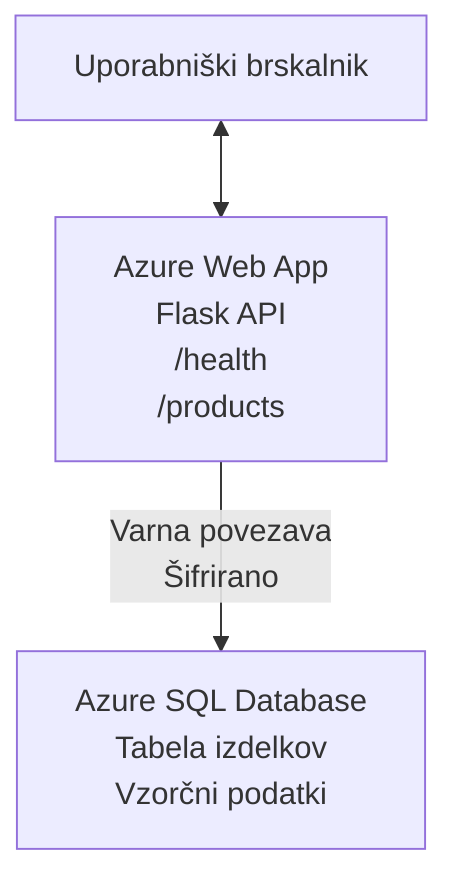

# Nameščanje Microsoft SQL podatkovne baze in spletne aplikacije z AZD

⏱️ **Ocenjeni čas**: 20–30 minut | 💰 **Ocenjeni strošek**: ~$15-25/mesec | ⭐ **Kompleksnost**: Srednje

Ta **popoln, delujoč primer** prikazuje, kako uporabiti [Azure Developer CLI (azd)](https://learn.microsoft.com/azure/developer/azure-developer-cli/) za nameščanje Python Flask spletne aplikacije z Microsoft SQL podatkovno bazo v Azure. Vsa koda je vključena in testirana—brez zunanjih odvisnosti.

## Česa se boste naučili

Z izvedbo tega primera boste:
- Namestili večplastno aplikacijo (spletna aplikacija + podatkovna baza) z infrastrukturo kot kodo
- Konfigurirali varne povezave do podatkovne baze brez vpisovanja skrivnosti v kodo
- Spremljali zdravje aplikacije z Application Insights
- Učinkovito upravljali Azure vire z AZD CLI
- Sledili najboljšim praksam Azure glede varnosti, optimizacije stroškov in opazovanja

## Pregled scenarija
- **Spletna aplikacija**: Python Flask REST API s povezljivostjo do podatkovne baze
- **Podatkovna baza**: Azure SQL Database s primeri podatkov
- **Infrastruktura**: Zagotovljena z Bicep (modularne, ponovno uporabne predloge)
- **Nameščanje**: Popolnoma avtomatizirano z ukazi `azd`
- **Spremljanje**: Application Insights za dnevniške podatke in telemetrijo

## Predpogoji

### Zahtevana orodja

Pred začetkom preverite, da imate nameščena ta orodja:

1. **[Azure CLI](https://learn.microsoft.com/cli/azure/install-azure-cli)** (različica 2.50.0 ali novejša)
   ```sh
   az --version
   # Pričakovani izhod: azure-cli 2.50.0 ali novejši
   ```

2. **[Azure Developer CLI (azd)](https://learn.microsoft.com/azure/developer/azure-developer-cli/install-azd)** (različica 1.0.0 ali novejša)
   ```sh
   azd version
   # Pričakovan izhod: azd različica 1.0.0 ali novejša
   ```

3. **[Python 3.8+](https://www.python.org/downloads/)** (za lokalni razvoj)
   ```sh
   python --version
   # Pričakovani izhod: Python 3.8 ali novejši
   ```

4. **[Docker](https://www.docker.com/get-started)** (neobvezno, za lokalni razvoj v kontejnerjih)
   ```sh
   docker --version
   # Pričakovan izhod: Docker različica 20.10 ali novejša
   ```

### Zahteve za Azure

- Aktiven **Azure naročninski račun** ([ustvarite brezplačen račun](https://azure.microsoft.com/free/))
- Pooblastila za ustvarjanje virov v vašem naročninskem računu
- Vloga **Owner** ali **Contributor** na naročnini ali skupini virov

### Predznanje

To je primer na **srednji ravni**. Priporočeno je, da poznate:
- Osnovne ukaze v terminalu
- Temeljne koncepte oblaka (viri, skupine virov)
- Osnovno razumevanje spletnih aplikacij in podatkovnih baz

**Novo pri AZD?** Najprej začnite z [Getting Started guide](../../docs/chapter-01-foundation/azd-basics.md).

## Arhitektura

Ta primer namesti dvoplastno arhitekturo s spletno aplikacijo in SQL podatkovno bazo:


**Namestitev virov:**
- **Resource Group**: Posoda za vse vire
- **App Service Plan**: Gostovanje na Linuxu (B1 raven za stroškovno učinkovitost)
- **Web App**: Python 3.11 runtime s Flask aplikacijo
- **SQL Server**: Upravljen strežnik podatkovne baze z najmanj TLS 1.2
- **SQL Database**: Basic raven (2GB, primerna za razvoj/testiranje)
- **Application Insights**: Spremljanje in beleženje
- **Log Analytics Workspace**: Centralizirano shranjevanje dnevnikov

**Analogija**: Predstavljajte si, da je to kot restavracija (spletna aplikacija) s hladilnikom (podatkovna baza). Stranke naročajo s karto (API endpointi), kuhinja (Flask aplikacija) pa pridobi sestavine (podatke) iz hladilnika. Vodja restavracije (Application Insights) spremlja vse dogajanje.

## Struktura map

Vsi datoteki so vključeni v tem primeru—brez zunanjih odvisnosti:

```
examples/database-app/
│
├── README.md                    # This file
├── azure.yaml                   # AZD configuration file
├── .env.sample                  # Sample environment variables
├── .gitignore                   # Git ignore patterns
│
├── infra/                       # Infrastructure as Code (Bicep)
│   ├── main.bicep              # Main orchestration template
│   ├── abbreviations.json      # Azure naming conventions
│   └── resources/              # Modular resource templates
│       ├── sql-server.bicep    # SQL Server configuration
│       ├── sql-database.bicep  # Database configuration
│       ├── app-service-plan.bicep  # Hosting plan
│       ├── app-insights.bicep  # Monitoring setup
│       └── web-app.bicep       # Web application
│
└── src/
    └── web/                    # Application source code
        ├── app.py              # Flask REST API
        ├── requirements.txt    # Python dependencies
        └── Dockerfile          # Container definition
```

**Kaj posamezna datoteka počne:**
- **azure.yaml**: Pove AZD, kaj je potrebno namestiti in kam
- **infra/main.bicep**: Orkestrira vse Azure vire
- **infra/resources/*.bicep**: Posamezne definicije virov (modularno za ponovno uporabo)
- **src/web/app.py**: Flask aplikacija z logiko za podatkovno bazo
- **requirements.txt**: Odvisnosti Python paketov
- **Dockerfile**: Navodila za kontejnerizacijo za nameščanje

## Hitri začetek (korak za korakom)

### Korak 1: Klonirajte in se premaknite v mapo

```sh
git clone https://github.com/microsoft/AZD-for-beginners.git
cd AZD-for-beginners/examples/database-app
```

**✓ Preverjanje uspešnosti**: Preverite, ali vidite `azure.yaml` in mapo `infra/`:
```sh
ls
# Pričakovano: README.md, azure.yaml, infra/, src/
```

### Korak 2: Avtentikacija v Azure

```sh
azd auth login
```

To odpre vaš brskalnik za Azure avtentikacijo. Prijavite se s svojimi Azure poverilnicami.

**✓ Preverjanje uspešnosti**: Moral bi videti:
```
Logged in to Azure.
```

### Korak 3: Inicializirajte okolje

```sh
azd init
```

**Kaj se zgodi**: AZD ustvari lokalno konfiguracijo za vaše nameščanje.

**Pozivi, ki jih boste videli**:
- **Environment name**: Vnesite kratek naziv (npr. `dev`, `myapp`)
- **Azure subscription**: Izberite vaše naročnino s seznama
- **Azure location**: Izberite regijo (npr. `eastus`, `westeurope`)

**✓ Preverjanje uspešnosti**: Moral bi videti:
```
SUCCESS: New project initialized!
```

### Korak 4: Zagotovite Azure vire

```sh
azd provision
```

**Kaj se zgodi**: AZD namesti vso infrastrukturo (traja 5–8 minut):
1. Ustvari resource group
2. Ustvari SQL Server in bazo
3. Ustvari App Service Plan
4. Ustvari Web App
5. Ustvari Application Insights
6. Konfigurira omrežje in varnost

**Bili boste pozvani za**:
- **SQL admin username**: Vnesite uporabniško ime (npr. `sqladmin`)
- **SQL admin password**: Vnesite močno geslo (shrani ga!)

**✓ Preverjanje uspešnosti**: Moral bi videti:
```
SUCCESS: Your application was provisioned in Azure in X minutes Y seconds.
You can view the resources created under the resource group rg-<env-name> in Azure Portal:
https://portal.azure.com/#@/resource/subscriptions/.../resourceGroups/rg-<env-name>
```

**⏱️ Čas**: 5–8 minut

### Korak 5: Namestite aplikacijo

```sh
azd deploy
```

**Kaj se zgodi**: AZD zgradi in namesti vašo Flask aplikacijo:
1. Paketira Python aplikacijo
2. Zgradi Docker kontejner
3. Potisne v Azure Web App
4. Inicializira podatkovno bazo s primeri podatkov
5. Zažene aplikacijo

**✓ Preverjanje uspešnosti**: Moral bi videti:
```
SUCCESS: Your application was deployed to Azure in X minutes Y seconds.
You can view the resources created under the resource group rg-<env-name> in Azure Portal:
https://portal.azure.com/#@/resource/subscriptions/.../resourceGroups/rg-<env-name>
```

**⏱️ Čas**: 3–5 minut

### Korak 6: Odprite aplikacijo v brskalniku

```sh
azd browse
```

To odpre vašo nameščeno spletno aplikacijo v brskalniku na `https://app-<unique-id>.azurewebsites.net`

**✓ Preverjanje uspešnosti**: Moral bi videti JSON izhod:
```json
{
  "message": "Welcome to the Database App API",
  "endpoints": {
    "/": "This help message",
    "/health": "Health check endpoint",
    "/products": "List all products",
    "/products/<id>": "Get product by ID"
  }
}
```

### Korak 7: Preizkusite API endpoint-e

**Preverjanje zdravja** (preverite povezavo s podatkovno bazo):
```sh
curl https://app-<your-id>.azurewebsites.net/health
```

**Pričakovan odgovor**:
```json
{
  "status": "healthy",
  "database": "connected"
}
```

**Seznam izdelkov** (primeri podatkov):
```sh
curl https://app-<your-id>.azurewebsites.net/products
```

**Pričakovan odgovor**:
```json
[
  {
    "id": 1,
    "name": "Laptop",
    "description": "High-performance laptop",
    "price": 1299.99,
    "created_at": "2025-11-19T10:30:00"
  },
  ...
]
```

**Pridobi en izdelek**:
```sh
curl https://app-<your-id>.azurewebsites.net/products/1
```

**✓ Preverjanje uspešnosti**: Vsi endpoint-i vračajo JSON podatke brez napak.

---

**🎉 Čestitke!** Uspešno ste namestili spletno aplikacijo s podatkovno bazo v Azure z uporabo AZD.

## Podroben pregled konfiguracije

### Okoljske spremenljivke

Skrivnosti so varno upravljane preko konfiguracije Azure App Service—**nikoli jih ne vpisujte v izvorno kodo**.

**Samodejno konfigurira AZD**:
- `SQL_CONNECTION_STRING`: Povezava do podatkovne baze z šifriranimi podatki
- `APPLICATIONINSIGHTS_CONNECTION_STRING`: Telemetrijska povezava za spremljanje
- `SCM_DO_BUILD_DURING_DEPLOYMENT`: Omogoča samodejno namestitev odvisnosti med nameščanjem

**Kje so skrivnosti shranjene**:
1. Med `azd provision` vnesete SQL poverilnice preko varnih pozivov
2. AZD jih shrani v lokalno datoteko `.azure/<env-name>/.env` (izključeno iz Git)
3. AZD jih vstavi v konfiguracijo Azure App Service (šifrirano v mirovanju)
4. Aplikacija jih prebere preko `os.getenv()` med izvajanjem

### Lokalni razvoj

Za lokalno testiranje ustvarite datoteko `.env` iz vzorčne datoteke:

```sh
cp .env.sample .env
# Uredi .env z lokalno povezavo do baze podatkov
```

**Delovni potek za lokalni razvoj**:
```sh
# Namestite odvisnosti
cd src/web
pip install -r requirements.txt

# Nastavite spremenljivke okolja
export SQL_CONNECTION_STRING="your-local-connection-string"

# Zaženite aplikacijo
python app.py
```

**Testirajte lokalno**:
```sh
curl http://localhost:8000/health
# Pričakovano: {"status": "healthy", "database": "connected"}
```

### Infrastruktura kot koda

Vsi Azure viri so definirani v **Bicep predlogah** (mapa `infra/`):

- **Modularna zasnova**: Vsaka vrsta vira ima svojo datoteko za ponovno uporabo
- **Parametrizirano**: Prilagodite SKU-je, regije, konvencije poimenovanja
- **Najboljše prakse**: Sledi Azure standardom poimenovanja in varnostnim privzetkom
- **Vodenje različic**: Spremembe infrastrukture so sledene v Gitu

**Primer prilagoditve**:
Za spremembo ravni podatkovne baze uredite `infra/resources/sql-database.bicep`:
```bicep
sku: {
  name: 'Standard'  // Changed from 'Basic'
  tier: 'Standard'
  capacity: 10
}
```

## Najboljše varnostne prakse

Ta primer sledi Azure varnostnim najboljšim praksam:

### 1. **Brez skrivnosti v izvorni kodi**
- ✅ Poverilnice so shranjene v konfiguraciji Azure App Service (šifrirano)
- ✅ Datoteke `.env` so izključene iz Gita preko `.gitignore`
- ✅ Skrivnosti se posredujejo preko varnih parametrov med zagotavljanjem

### 2. **Šifrirane povezave**
- ✅ TLS 1.2 najmanj za SQL Server
- ✅ Samo HTTPS je prisiljen za Web App
- ✅ Povezave do podatkovne baze uporabljajo šifrirane kanale

### 3. **Omrežna varnost**
- ✅ SQL Server firewall konfiguriran za dovoljenje samo Azure storitev
- ✅ Javni dostop do omrežja omejen (lahko se dodatno zaklene s Private Endpoints)
- ✅ FTPS onemogočen na Web App

### 4. **Avtentikacija in avtorizacija**
- ⚠️ **Trenutno**: SQL avtentikacija (uporabniško ime/geslo)
- ✅ **Priporočilo za produkcijo**: Uporabite Azure Managed Identity za avtentikacijo brez gesla

**Za nadgradnjo na Managed Identity** (za produkcijo):
1. Omogočite managed identity na Web App
2. Dodelite identiteti dovoljenja v SQL
3. Posodobite connection string za uporabo managed identity
4. Odstranite avtentikacijo na osnovi gesla

### 5. **Revizija in skladnost**
- ✅ Application Insights beleži vse zahteve in napake
- ✅ Revizija SQL Database je omogočena (lahko se konfigurira za skladnost)
- ✅ Vsi viri so označeni za upravljanje

**Kontrolni seznam varnosti pred produkcijo**:
- [ ] Omogočite Azure Defender for SQL
- [ ] Konfigurirajte Private Endpoints za SQL Database
- [ ] Omogočite Web Application Firewall (WAF)
- [ ] Uvedite Azure Key Vault za rotacijo skrivnosti
- [ ] Konfigurirajte Azure AD avtentikacijo
- [ ] Omogočite diagnostično beleženje za vse vire

## Optimizacija stroškov

**Ocenjeni mesečni stroški** (stanje november 2025):

| Resource | SKU/Tier | Estimated Cost |
|----------|----------|----------------|
| App Service Plan | B1 (Basic) | ~$13/month |
| SQL Database | Basic (2GB) | ~$5/month |
| Application Insights | Pay-as-you-go | ~$2/month (low traffic) |
| **Total** | | **~$20/month** |

**💡 Nasveti za varčevanje**:

1. **Uporabite brezplačno raven za učenje**:
   - App Service: F1 raven (brezplačno, omejene ure)
   - SQL Database: Uporabite Azure SQL Database serverless
   - Application Insights: 5GB/mesec brezplačnega vnosa

2. **Ustavite vire, ko jih ne uporabljate**:
   ```sh
   # Ustavi spletno aplikacijo (strošek baze podatkov se še vedno obračunava)
   az webapp stop --name <app-name> --resource-group <rg-name>
   
   # Znova zaženi po potrebi
   az webapp start --name <app-name> --resource-group <rg-name>
   ```

3. **Izbrišite vse po testiranju**:
   ```sh
   azd down
   ```
   To odstrani VSE vire in ustavi stroške.

4. **Različne SKU za razvoj in produkcijo**:
   - **Razvoj**: Basic raven (uporabljena v tem primeru)
   - **Produkcija**: Standard/Premium raven z redundanco

**Spremljanje stroškov**:
- Ogled stroškov v [Azure Cost Management](https://portal.azure.com/#view/Microsoft_Azure_CostManagement)
- Nastavite opozorila glede stroškov, da se izognete presenečenjem
- Oznakujte vse vire z `azd-env-name` za lažje sledenje

**Brezplačna alternativa**:
Za učenje lahko spremenite `infra/resources/app-service-plan.bicep`:
```bicep
sku: {
  name: 'F1'  // Free tier
  tier: 'Free'
}
```
**Opomba**: Brezplačna raven ima omejitve (60 min/dan CPU, ni always-on).

## Spremljanje in opazovanje

### Integracija Application Insights

Ta primer vključuje **Application Insights** za obsežno spremljanje:

**Kaj se spremlja**:
- ✅ HTTP zahteve (zakasnitev, statusne kode, endpointi)
- ✅ Napake in izjeme v aplikaciji
- ✅ Po meri dnevniški zapisi iz Flask aplikacije
- ✅ Zdravje povezave do podatkovne baze
- ✅ Meritve zmogljivosti (CPU, pomnilnik)

**Dostop do Application Insights**:
1. Odprite [Azure Portal](https://portal.azure.com)
2. Pojdite v vašo resource group (`rg-<env-name>`)
3. Kliknite na Application Insights vir (`appi-<unique-id>`)

Uporabni poizvedbe (Application Insights → Logs):

**Poglej vse zahteve**:
```kusto
requests
| where timestamp > ago(1h)
| order by timestamp desc
| project timestamp, name, url, resultCode, duration
```

**Poišči napake**:
```kusto
exceptions
| where timestamp > ago(24h)
| order by timestamp desc
| project timestamp, type, outerMessage, operation_Name
```

**Preveri health endpoint**:
```kusto
requests
| where name contains "health"
| summarize count() by resultCode, bin(timestamp, 1h)
```

### Revizija SQL podatkovne baze

**Revizija SQL podatkovne baze je omogočena** za sledenje:
- Vzorcev dostopa do baze
- Neuspelih poskusov prijave
- Sprememb sheme
- Dostopa do podatkov (za skladnost)

**Dostop do revizijskih dnevnikov**:
1. Azure Portal → SQL Database → Auditing
2. Ogled dnevnikov v Log Analytics workspace

### Spremljanje v realnem času

**Poglej meritev v živo**:
1. Application Insights → Live Metrics
2. Oglejte si zahteve, napake in zmogljivost v realnem času

**Nastavite opozorila**:
Ustvarite opozorila za kritične dogodke:
- HTTP 500 napake > 5 v 5 minutah
- Napake povezave do podatkovne baze
- Visoki odzivni časi (>2 sekundi)

**Primer ustvarjanja opozorila**:
```sh
az monitor metrics alert create \
  --name "High-Response-Time" \
  --resource-group <rg-name> \
  --scopes <app-insights-resource-id> \
  --condition "avg requests/duration > 2000" \
  --description "Alert when response time exceeds 2 seconds"
```

## Odpravljanje težav
### Pogoste težave in rešitve

#### 1. `azd provision` ne uspe z napako "Location not available"

**Simptom**:
```
Error: The subscription is not registered for the resource type 'components' in the location 'centralus'.
```

**Rešitev**:
Izberite drugo regijo Azure ali registrirajte ponudnika virov:
```sh
az provider register --namespace Microsoft.Insights
```

#### 2. Povezava do SQL med nameščanjem ne uspe

**Simptom**:
```
pyodbc.OperationalError: ('08001', '[08001] [Microsoft][ODBC Driver 18 for SQL Server]TCP Provider...')
```

**Rešitev**:
- Preverite, ali požarni zid SQL strežnika dovoljuje storitve Azure (samodejno konfigurirano)
- Preverite, ali je za SQL skrbnika geslo pravilno vneseno med `azd provision`
- Prepričajte se, da je SQL strežnik popolnoma nameščen (lahko traja 2-3 minute)

**Preverite povezavo**:
```sh
# V Azure Portalu pojdite v SQL Database → Urejevalnik poizvedb
# Poskusite se povezati s svojimi prijavnimi podatki
```

#### 3. Spletna aplikacija prikazuje "Application Error"

**Simptom**:
Brskalnik prikaže splošno stran z napako.

**Rešitev**:
Preverite dnevnike aplikacije:
```sh
# Prikaži nedavne dnevnike
az webapp log tail --name <app-name> --resource-group <rg-name>
```

**Pogosti vzroki**:
- Manjkajoče spremenljivke okolja (preverite App Service → Configuration)
- Namestitev Python paketov je spodletela (preverite dnevnike razmestitve)
- Napaka pri inicializaciji baze podatkov (preverite povezljivost s SQL)

#### 4. `azd deploy` ne uspe z napako "Build Error"

**Simptom**:
```
Error: Failed to build project
```

**Rešitev**:
- Prepričajte se, da datoteka `requirements.txt` nima sintaktičnih napak
- Preverite, da je v `infra/resources/web-app.bicep` naveden Python 3.11
- Preverite, ali ima Dockerfile pravilno osnovno sliko

**Odpravljanje napak lokalno**:
```sh
cd src/web
docker build -t test-app .
docker run -p 8000:8000 test-app
```

#### 5. "Unauthorized" pri izvajanju AZD ukazov

**Simptom**:
```
ERROR: (Unauthorized) The client '<id>' with object id '<id>' does not have authorization
```

**Rešitev**:
Ponovno se prijavite v Azure:
```sh
# Zahtevano za AZD poteke dela
azd auth login

# Neobvezno, če neposredno uporabljate tudi ukaze Azure CLI
az login
```

Preverite, da imate pravilna dovoljenja (vloga Contributor) na naročnini.

#### 6. Visoki stroški baze podatkov

**Simptom**:
Nepričakovan račun za Azure.

**Rešitev**:
- Preverite, ali ste pozabili zagnati `azd down` po testiranju
- Preverite, ali SQL Database uporablja nivo Basic (ne Premium)
- Preglejte stroške v Azure Cost Management
- Nastavite opozorila o stroških

### Kako dobiti pomoč

**Poglejte vse AZD spremenljivke okolja**:
```sh
azd env get-values
```

**Preverite stanje razmestitve**:
```sh
az webapp show --name <app-name> --resource-group <rg-name> --query state
```

**Dostop do dnevnikov aplikacije**:
```sh
az webapp log download --name <app-name> --resource-group <rg-name> --log-file app-logs.zip
```

**Potrebujete več pomoči?**
- [Vodnik za odpravljanje težav z AZD](../../docs/chapter-07-troubleshooting/common-issues.md)
- [Odpravljanje težav z Azure App Service](https://learn.microsoft.com/azure/app-service/troubleshoot-diagnostic-logs)
- [Odpravljanje težav z Azure SQL](https://learn.microsoft.com/azure/azure-sql/database/troubleshoot-common-errors-issues)

## Praktične vaje

### Vaja 1: Preverite svojo nameščitev (začetnik)

**Cilj**: Potrdite, da so vse storitve nameščene in aplikacija deluje.

**Koraki**:
1. Naštejte vse vire v svoji skupini virov:
   ```sh
   az resource list --resource-group rg-<env-name> --output table
   ```
   **Pričakovano**: 6-7 virov (Web App, SQL Server, SQL Database, App Service Plan, Application Insights, Log Analytics)

2. Preizkusite vse API končne točke:
   ```sh
   curl https://app-<your-id>.azurewebsites.net/
   curl https://app-<your-id>.azurewebsites.net/health
   curl https://app-<your-id>.azurewebsites.net/products
   curl https://app-<your-id>.azurewebsites.net/products/1
   ```
   **Pričakovano**: Vse vrnejo veljaven JSON brez napak

3. Preverite Application Insights:
   - Pojdite v Application Insights v Azure Portal
   - Odprite "Live Metrics"
   - Osvežite brskalnik na spletni aplikaciji
   **Pričakovano**: V realnem času vidite prihajajoče zahteve

**Kriteriji uspeha**: Vsi 6-7 virov obstajajo, vse končne točke vračajo podatke, Live Metrics prikazuje aktivnost.

---

### Vaja 2: Dodajte novo API končno točko (srednje zahtevno)

**Cilj**: Razširite Flask aplikacijo z novo končno točko.

**Izhodiščna koda**: Trenutne končne točke v `src/web/app.py`

**Koraki**:
1. Uredite `src/web/app.py` in dodajte novo končno točko za `get_product()` funkcijo:
   ```python
   @app.route('/products/search/<keyword>')
   def search_products(keyword):
       """Search products by name or description."""
       try:
           conn = get_db_connection()
           cursor = conn.cursor()
           cursor.execute(
               "SELECT id, name, description, price, created_at FROM products WHERE name LIKE ? OR description LIKE ?",
               (f'%{keyword}%', f'%{keyword}%')
           )
           
           products = []
           for row in cursor.fetchall():
               products.append({
                   'id': row[0],
                   'name': row[1],
                   'description': row[2],
                   'price': float(row[3]) if row[3] else None,
                   'created_at': row[4].isoformat() if row[4] else None
               })
           
           cursor.close()
           conn.close()
           
           logger.info(f"Search for '{keyword}' returned {len(products)} results")
           return jsonify(products), 200
           
       except Exception as e:
           logger.error(f"Error searching products: {str(e)}")
           return jsonify({'error': str(e)}), 500
   ```

2. Razmestite posodobljeno aplikacijo:
   ```sh
   azd deploy
   ```

3. Preizkusite novo končno točko:
   ```sh
   curl https://app-<your-id>.azurewebsites.net/products/search/laptop
   ```
   **Pričakovano**: Vrne izdelke, ki se ujemajo z "laptop"

**Kriteriji uspeha**: Nova končna točka deluje, vrača filtrirane rezultate, se pojavi v dnevnikih Application Insights.

---

### Vaja 3: Dodajte spremljanje in opozorila (napredno)

**Cilj**: Nastavite proaktivno spremljanje z opozorili.

**Koraki**:
1. Ustvarite opozorilo za HTTP 500 napake:
   ```sh
   # Pridobi ID vira Application Insights
   AI_ID=$(az monitor app-insights component show \
     --app appi-<your-id> \
     --resource-group rg-<env-name> \
     --query id -o tsv)
   
   # Ustvari opozorilo
   az monitor metrics alert create \
     --name "High-Error-Rate" \
     --resource-group rg-<env-name> \
     --scopes $AI_ID \
     --condition "count requests/failed > 5" \
     --window-size 5m \
     --evaluation-frequency 1m \
     --description "Alert when >5 failed requests in 5 minutes"
   ```

2. Sprožite opozorilo z povzročanjem napak:
   ```sh
   # Zahtevaj neobstoječ izdelek
   for i in {1..10}; do curl https://app-<your-id>.azurewebsites.net/products/999; done
   ```

3. Preverite, ali je opozorilo sproženo:
   - Azure Portal → Alerts → Alert Rules
   - Preverite svoj e-poštni naslov (če je konfiguriran)

**Kriteriji uspeha**: Pravilo opozorila je ustvarjeno, sproži se ob napakah, prejmete obvestila.

---

### Vaja 4: Spremembe sheme baze podatkov (napredno)

**Cilj**: Dodajte novo tabelo in spremenite aplikacijo, da jo uporablja.

**Koraki**:
1. Povežite se z SQL bazo podatkov prek Query Editor v Azure Portal

2. Ustvarite novo tabelo `categories`:
   ```sql
   CREATE TABLE categories (
       id INT PRIMARY KEY IDENTITY(1,1),
       name NVARCHAR(50) NOT NULL,
       description NVARCHAR(200)
   );
   
   INSERT INTO categories (name, description) VALUES
   ('Electronics', 'Electronic devices and accessories'),
   ('Office Supplies', 'Office equipment and supplies');
   
   -- Add category to products table
   ALTER TABLE products ADD category_id INT;
   UPDATE products SET category_id = 1; -- Set all to Electronics
   ```

3. Posodobite `src/web/app.py`, da vključite informacije o kategorijah v odzive

4. Razmestite in preizkusite

**Kriteriji uspeha**: Nova tabela obstaja, izdelki prikazujejo informacije o kategorijah, aplikacija še vedno deluje.

---

### Vaja 5: Uvedite predpomnjenje (strokovno)

**Cilj**: Dodajte Azure Redis Cache za izboljšanje zmogljivosti.

**Koraki**:
1. Dodajte Redis Cache v `infra/main.bicep`
2. Posodobite `src/web/app.py`, da predpomnite poizvedbe izdelkov
3. Izmerite izboljšanje zmogljivosti z Application Insights
4. Primerjajte čas odziva pred in po predpomnjenju

**Kriteriji uspeha**: Redis je nameščen, predpomnjenje deluje, čas odziva se izboljša za >50%.

**Namig**: Začnite z [Azure Cache for Redis documentation](https://learn.microsoft.com/azure/azure-cache-for-redis/).

---

## Čiščenje

Da se izognete nadaljnjim stroškom, izbrišite vse vire, ko končate:

```sh
azd down
```

**Poziv za potrditev**:
```
? Total resources to delete: 7, are you sure you want to continue? (y/N)
```

Vnesite `y` za potrditev.

**✓ Preverjanje uspeha**: 
- Vsi viri so izbrisani iz Azure Portala
- Ni nadaljnjih stroškov
- Lokalna mapa `.azure/<env-name>` je lahko izbrisana

**Alternativa** (ohranite infrastrukturo, izbrišite podatke):
```sh
# Izbriši samo skupino virov (ohrani konfiguracijo AZD)
az group delete --name rg-<env-name> --yes
```
## Izvedite več

### Sorodna dokumentacija
- [Azure Developer CLI Documentation](https://learn.microsoft.com/azure/developer/azure-developer-cli/)
- [Azure SQL Database Documentation](https://learn.microsoft.com/azure/azure-sql/database/)
- [Azure App Service Documentation](https://learn.microsoft.com/azure/app-service/)
- [Application Insights Documentation](https://learn.microsoft.com/azure/azure-monitor/app/app-insights-overview)
- [Bicep Language Reference](https://learn.microsoft.com/azure/azure-resource-manager/bicep/)

### Naslednji koraki v tem tečaju
- **[Primer Container Apps](../../../../examples/container-app)**: Razmestite mikroservise z Azure Container Apps
- **[Vodnik za integracijo AI](../../../../docs/ai-foundry)**: Dodajte AI zmogljivosti v vašo aplikacijo
- **[Prakse razmestitve](../../docs/chapter-04-infrastructure/deployment-guide.md)**: Vzorci razmestitve v produkciji

### Napredne teme
- **Upravljana identiteta**: Odstranite gesla in uporabite Azure AD avtentikacijo
- **Zasebne končne točke**: Zavarujte povezave do baze znotraj virtualnega omrežja
- **Integracija CI/CD**: Avtomatizirajte razmestitve z GitHub Actions ali Azure DevOps
- **Več okolij**: Nastavite dev, staging in produkcijska okolja
- **Migracije baze podatkov**: Uporabite Alembic ali Entity Framework za verzioniranje sheme

### Primerjava z drugimi pristopi

**AZD vs. ARM Templates**:
- ✅ AZD: Višja abstrakcija, enostavnejši ukazi
- ⚠️ ARM: Bolj obsežen, ponuja fino nastavitev

**AZD vs. Terraform**:
- ✅ AZD: Azure-native, integriran z Azure storitvami
- ⚠️ Terraform: Podpora več oblakov, večja ekosistema

**AZD vs. Azure Portal**:
- ✅ AZD: Ponovljivo, verzionirano, avtomatizirano
- ⚠️ Portal: Ročno klikanje, težje reproducirati

**Razmislite o AZD kot**: Docker Compose za Azure — poenostavljena konfiguracija za kompleksne razmestitve.

---

## Pogosto zastavljena vprašanja

**V: Ali lahko uporabim drug programski jezik?**  
O: Da! Zamenjajte `src/web/` z Node.js, C#, Go ali katerim koli jezikom. Posodobite `azure.yaml` in Bicep ustrezno.

**V: Kako dodam več baz podatkov?**  
O: Dodajte še en SQL Database modul v `infra/main.bicep` ali uporabite PostgreSQL/MySQL iz Azure Database storitev.

**V: Ali lahko to uporabim v produkciji?**  
O: To je izhodišče. Za produkcijo dodajte: upravljano identiteto, zasebne končne točke, redundanco, strategijo varnostnih kopij, WAF in izboljšano spremljanje.

**V: Kaj pa, če želim uporabljati kontejnere namesto razmestitve kode?**  
O: Oglejte si [Primer Container Apps](../../../../examples/container-app), ki uporablja Docker kontejnere povsod.

**V: Kako se povežem z bazo podatkov iz lokalnega računalnika?**  
O: Dodajte svoj IP v požarni zid SQL strežnika:
```sh
az sql server firewall-rule create \
  --resource-group rg-<env-name> \
  --server sql-<unique-id> \
  --name AllowMyIP \
  --start-ip-address <your-ip> \
  --end-ip-address <your-ip>
```

**V: Ali lahko uporabim obstoječo bazo podatkov namesto ustvarjanja nove?**  
O: Da, spremenite `infra/main.bicep`, da se sklicuje na obstoječ SQL Server in posodobite parametre connection stringa.

---

> **Opomba:** Ta primer prikazuje najboljše prakse za razmestitev spletne aplikacije z bazo podatkov z uporabo AZD. Vključuje delujočo kodo, obsežno dokumentacijo in praktične vaje za utrjevanje znanja. Za produkcijske razmestitve preglejte varnostne, skalabilnostne, skladnostne in stroškovne zahteve, specifične za vašo organizacijo.

**📚 Navigacija po tečaju:**
- ← Prejšnji: [Primer Container Apps](../../../../examples/container-app)
- → Naslednji: [Vodnik za integracijo AI](../../../../docs/ai-foundry)
- 🏠 [Domov tečaja](../../README.md)

---

<!-- CO-OP TRANSLATOR DISCLAIMER START -->
**Izjava o omejitvi odgovornosti**:
Ta dokument je bil preveden z uporabo storitve za prevajanje z umetno inteligenco [Co-op Translator](https://github.com/Azure/co-op-translator). Čeprav si prizadevamo za natančnost, prosimo upoštevajte, da lahko avtomatizirani prevodi vsebujejo napake ali netočnosti. Izvirni dokument v svojem izvirnem jeziku velja za avtoritativni vir. Za kritične informacije priporočamo strokovni človeški prevod. Ne odgovarjamo za morebitne nesporazume ali napačne razlage, ki izhajajo iz uporabe tega prevoda.
<!-- CO-OP TRANSLATOR DISCLAIMER END -->