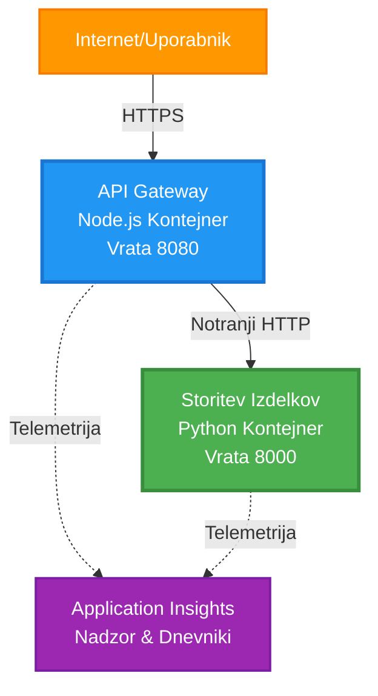
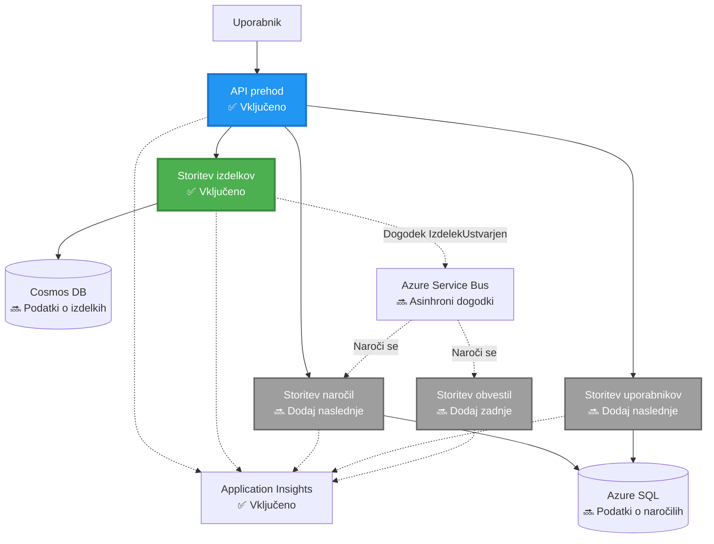
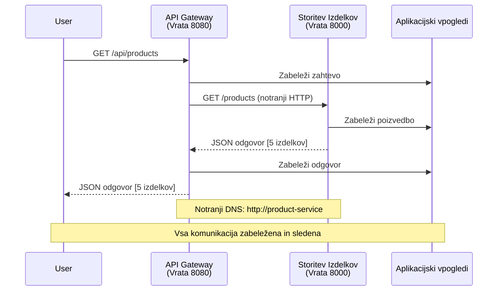

<!--
CO_OP_TRANSLATOR_METADATA:
{
  "original_hash": "eb3a4803a1e80a7f2e64f6bf63738c0f",
  "translation_date": "2025-11-23T23:27:33+00:00",
  "source_file": "examples/microservices/README.md",
  "language_code": "sl"
}
-->
# Arhitektura mikrostoritev - Primer aplikacije v kontejnerju

⏱️ **Ocenjeni čas**: 25-35 minut | 💰 **Ocenjeni strošek**: ~$50-100/mesec | ⭐ **Kompleksnost**: Napredno

**📚 Učni načrt:**
- ← Prejšnje: [Preprosta Flask API](../../../../examples/container-app/simple-flask-api) - Osnove enega kontejnerja
- 🎯 **Tukaj ste**: Arhitektura mikrostoritev (osnova z 2 storitvama)
- → Naslednje: [Integracija AI](../../../../docs/ai-foundry) - Dodajte inteligenco svojim storitvam
- 🏠 [Domov tečaja](../../README.md)

---

**Poenostavljena, a funkcionalna** arhitektura mikrostoritev, nameščena v Azure Container Apps z uporabo AZD CLI. Ta primer prikazuje komunikacijo med storitvami, orkestracijo kontejnerjev in spremljanje z praktično postavitvijo dveh storitev.

> **📚 Učni pristop**: Ta primer se začne z minimalno arhitekturo dveh storitev (API Gateway + Backend Service), ki jo lahko dejansko namestite in se iz nje učite. Ko obvladate to osnovo, vam ponujamo smernice za širitev v celoten ekosistem mikrostoritev.

## Kaj se boste naučili

Z dokončanjem tega primera boste:
- Namestili več kontejnerjev v Azure Container Apps
- Izvedli komunikacijo med storitvami z notranjim omrežjem
- Konfigurirali skaliranje na podlagi okolja in preverjanje zdravja
- Spremljali porazdeljene aplikacije z Application Insights
- Razumeli vzorce namestitve mikrostoritev in najboljše prakse
- Naučili se postopne širitve od preprostih do kompleksnih arhitektur

## Arhitektura

### Faza 1: Kaj gradimo (vključeno v ta primer)


**Podrobnosti komponent:**

| Komponenta | Namen | Dostop | Viri |
|------------|-------|--------|------|
| **API Gateway** | Usmerja zunanje zahteve na storitve v ozadju | Javno (HTTPS) | 1 vCPU, 2GB RAM, 2-20 replik |
| **Product Service** | Upravljanje kataloga izdelkov z podatki v pomnilniku | Samo interno | 0.5 vCPU, 1GB RAM, 1-10 replik |
| **Application Insights** | Centralizirano beleženje in porazdeljeno sledenje | Azure Portal | 1-2 GB/mesec vnosa podatkov |

**Zakaj začeti preprosto?**
- ✅ Hitro namestite in razumite (25-35 minut)
- ✅ Naučite se osnovnih vzorcev mikrostoritev brez zapletenosti
- ✅ Delujoča koda, ki jo lahko spreminjate in preizkušate
- ✅ Nižji stroški za učenje (~$50-100/mesec v primerjavi z $300-1400/mesec)
- ✅ Pridobite samozavest pred dodajanjem baz podatkov in vrst sporočil

**Primerjava**: To je kot učenje vožnje. Začnete na praznem parkirišču (2 storitvi), obvladate osnove, nato pa napredujete v mestni promet (5+ storitev z bazami podatkov).

### Faza 2: Prihodnja širitev (referenčna arhitektura)

Ko obvladate arhitekturo z dvema storitvama, jo lahko razširite na:


Oglejte si razdelek "Vodnik za širitev" na koncu za navodila po korakih.

## Vključene funkcije

✅ **Odkritje storitev**: Samodejno odkritje na podlagi DNS med kontejnerji  
✅ **Uravnavanje obremenitve**: Vgrajeno uravnavanje obremenitve med replikami  
✅ **Samodejno skaliranje**: Neodvisno skaliranje za vsako storitev na podlagi HTTP zahtev  
✅ **Spremljanje zdravja**: Preverjanje živosti in pripravljenosti za obe storitvi  
✅ **Porazdeljeno beleženje**: Centralizirano beleženje z Application Insights  
✅ **Notranje omrežje**: Varna komunikacija med storitvami  
✅ **Orkestracija kontejnerjev**: Samodejna namestitev in skaliranje  
✅ **Posodobitve brez izpadov**: Postopne posodobitve z upravljanjem revizij  

## Predpogoji

### Potrebna orodja

Pred začetkom preverite, ali imate nameščena naslednja orodja:

1. **[Azure Developer CLI (azd)](https://learn.microsoft.com/azure/developer/azure-developer-cli/install-azd)** (različica 1.0.0 ali novejša)
   ```bash
   azd version
   # Pričakovani izhod: azd različica 1.0.0 ali višja
   ```

2. **[Azure CLI](https://learn.microsoft.com/cli/azure/install-azure-cli)** (različica 2.50.0 ali novejša)
   ```bash
   az --version
   # Pričakovani rezultat: azure-cli 2.50.0 ali višje
   ```

3. **[Docker](https://www.docker.com/get-started)** (za lokalni razvoj/testiranje - opcijsko)
   ```bash
   docker --version
   # Pričakovani rezultat: Docker različica 20.10 ali višja
   ```

### Preverite svojo nastavitev

Za potrditev pripravljenosti zaženite te ukaze:

```bash
# Preveri Azure Developer CLI
azd version
# ✅ Pričakovano: azd različica 1.0.0 ali višja

# Preveri Azure CLI
az --version
# ✅ Pričakovano: azure-cli 2.50.0 ali višja

# Preveri Docker (neobvezno)
docker --version
# ✅ Pričakovano: Docker različica 20.10 ali višja
```

**Merilo uspeha**: Vsi ukazi vrnejo številke različic, ki ustrezajo ali presegajo minimalne zahteve.

### Zahteve za Azure

- Aktivna **Azure naročnina** ([ustvarite brezplačen račun](https://azure.microsoft.com/free/))
- Dovoljenja za ustvarjanje virov v vaši naročnini
- **Vloga sodelavca** v naročnini ali skupini virov

### Zahteve glede znanja

To je primer na **napredni ravni**. Morali bi:
- Dokončati [primer preproste Flask API](../../../../examples/container-app/simple-flask-api) 
- Osnovno razumevanje arhitekture mikrostoritev
- Poznavanje REST API-jev in HTTP
- Razumevanje konceptov kontejnerjev

**Novinec pri Container Apps?** Začnite s [primerom preproste Flask API](../../../../examples/container-app/simple-flask-api) za učenje osnov.

## Hitri začetek (korak za korakom)

### Korak 1: Klonirajte in navigirajte

```bash
git clone https://github.com/microsoft/AZD-for-beginners.git
cd AZD-for-beginners/examples/microservices
```

**✓ Preverjanje uspeha**: Preverite, ali vidite `azure.yaml`:
```bash
ls
# Pričakovano: README.md, azure.yaml, infra/, src/
```

### Korak 2: Avtentikacija z Azure

```bash
azd auth login
```

To odpre vaš brskalnik za avtentikacijo Azure. Prijavite se s svojimi Azure poverilnicami.

**✓ Preverjanje uspeha**: Videti bi morali:
```
Logged in to Azure.
```

### Korak 3: Inicializirajte okolje

```bash
azd init
```

**Pozivi, ki jih boste videli**:
- **Ime okolja**: Vnesite kratko ime (npr. `microservices-dev`)
- **Azure naročnina**: Izberite svojo naročnino
- **Azure lokacija**: Izberite regijo (npr. `eastus`, `westeurope`)

**✓ Preverjanje uspeha**: Videti bi morali:
```
SUCCESS: New project initialized!
```

### Korak 4: Namestite infrastrukturo in storitve

```bash
azd up
```

**Kaj se zgodi** (traja 8-12 minut):

```mermaid
graph LR
    A[azd up] --> B[Ustvari skupino virov]
    B --> C[Namesti register vsebnikov]
    C --> D[Namesti analitiko dnevnikov]
    D --> E[Namesti vpogled aplikacij]
    E --> F[Ustvari okolje vsebnikov]
    F --> G[Zgradi sliko API prehoda]
    F --> H[Zgradi sliko storitve izdelkov]
    G --> I[Potisni v register]
    H --> I
    I --> J[Namesti API prehod]
    I --> K[Namesti storitev izdelkov]
    J --> L[Konfiguriraj vhod & preverjanje zdravja]
    K --> L
    L --> M[Namestitev dokončana ✓]
    
    style A fill:#2196F3,stroke:#1976D2,stroke-width:3px,color:#fff
    style M fill:#4CAF50,stroke:#388E3C,stroke-width:3px,color:#fff
```


**✓ Preverjanje uspeha**: Videti bi morali:
```
SUCCESS: Your application was deployed to Azure in X minutes Y seconds.
Endpoint: https://api-gateway-<unique-id>.azurecontainerapps.io
```

**⏱️ Čas**: 8-12 minut

### Korak 5: Preizkusite namestitev

```bash
# Pridobi končno točko prehoda
GATEWAY_URL=$(azd env get-values | grep API_GATEWAY_URL | cut -d '=' -f2 | tr -d '"')

# Preveri zdravje API prehoda
curl $GATEWAY_URL/health
```

**✅ Pričakovani izhod:**
```json
{
  "status": "healthy",
  "service": "api-gateway",
  "timestamp": "2025-11-19T10:30:00Z"
}
```

**Preizkusite storitev izdelkov prek prehoda**:
```bash
# Seznam izdelkov
curl $GATEWAY_URL/api/products
```

**✅ Pričakovani izhod:**
```json
[
  {"id":1,"name":"Laptop","price":999.99,"stock":50},
  {"id":2,"name":"Mouse","price":29.99,"stock":200},
  {"id":3,"name":"Keyboard","price":79.99,"stock":150}
]
```

**✓ Preverjanje uspeha**: Obe končni točki vrneta JSON podatke brez napak.

---

**🎉 Čestitke!** Namestili ste arhitekturo mikrostoritev v Azure!

## Struktura projekta

Vse implementacijske datoteke so vključene—to je popoln, delujoč primer:

```
microservices/
│
├── README.md                         # This file
├── azure.yaml                        # AZD configuration
├── .gitignore                        # Git ignore patterns
│
├── infra/                           # Infrastructure as Code (Bicep)
│   ├── main.bicep                   # Main orchestration
│   ├── abbreviations.json           # Naming conventions
│   ├── core/                        # Shared infrastructure
│   │   ├── container-apps-environment.bicep  # Container environment + registry
│   │   └── monitor.bicep            # Application Insights + Log Analytics
│   └── app/                         # Service definitions
│       ├── api-gateway.bicep        # API Gateway container app
│       └── product-service.bicep    # Product Service container app
│
└── src/                             # Application source code
    ├── api-gateway/                 # Node.js API Gateway
    │   ├── app.js                   # Express server with routing
    │   ├── package.json             # Node dependencies
    │   └── Dockerfile               # Container definition
    └── product-service/             # Python Product Service
        ├── main.py                  # Flask API with product data
        ├── requirements.txt         # Python dependencies
        └── Dockerfile               # Container definition
```

**Kaj počne vsaka komponenta:**

**Infrastruktura (infra/)**:
- `main.bicep`: Orkestrira vse Azure vire in njihove odvisnosti
- `core/container-apps-environment.bicep`: Ustvari okolje Container Apps in Azure Container Registry
- `core/monitor.bicep`: Nastavi Application Insights za porazdeljeno beleženje
- `app/*.bicep`: Posamezne definicije aplikacij v kontejnerjih s skaliranjem in preverjanjem zdravja

**API Gateway (src/api-gateway/)**:
- Storitev, ki je usmerjena navzven in usmerja zahteve na storitve v ozadju
- Implementira beleženje, obravnavo napak in posredovanje zahtev
- Prikazuje komunikacijo med storitvami prek HTTP

**Product Service (src/product-service/)**:
- Interna storitev s katalogom izdelkov (za preprostost v pomnilniku)
- REST API s preverjanjem zdravja
- Primer vzorca mikrostoritve v ozadju

## Pregled storitev

### API Gateway (Node.js/Express)

**Vrata**: 8080  
**Dostop**: Javno (zunanji vhod)  
**Namen**: Usmerja dohodne zahteve na ustrezne storitve v ozadju  

**Končne točke**:
- `GET /` - Informacije o storitvi
- `GET /health` - Končna točka za preverjanje zdravja
- `GET /api/products` - Posredovanje na storitev izdelkov (seznam vseh)
- `GET /api/products/:id` - Posredovanje na storitev izdelkov (pridobitev po ID-ju)

**Ključne funkcije**:
- Usmerjanje zahtev z axios
- Centralizirano beleženje
- Obravnava napak in upravljanje časovnih omejitev
- Odkritje storitev prek spremenljivk okolja
- Integracija Application Insights

**Poudarek kode** (`src/api-gateway/app.js`):
```javascript
// Komunikacija med internimi storitvami
app.get('/api/products', async (req, res) => {
  const response = await axios.get(`${PRODUCT_SERVICE_URL}/products`, {
    timeout: 5000
  });
  res.json(response.data);
});
```

### Product Service (Python/Flask)

**Vrata**: 8000  
**Dostop**: Samo interno (brez zunanjega vhoda)  
**Namen**: Upravljanje kataloga izdelkov z podatki v pomnilniku  

**Končne točke**:
- `GET /` - Informacije o storitvi
- `GET /health` - Končna točka za preverjanje zdravja
- `GET /products` - Seznam vseh izdelkov
- `GET /products/<id>` - Pridobitev izdelka po ID-ju

**Ključne funkcije**:
- RESTful API z Flask
- Katalog izdelkov v pomnilniku (preprosto, brez potrebne baze podatkov)
- Spremljanje zdravja s sondami
- Strukturirano beleženje
- Integracija Application Insights

**Model podatkov**:
```python
{
  "id": 1,
  "name": "Laptop",
  "description": "High-performance laptop",
  "price": 999.99,
  "stock": 50
}
```

**Zakaj samo interno?**
Storitev izdelkov ni javno izpostavljena. Vse zahteve morajo iti prek API Gateway, ki zagotavlja:
- Varnost: Nadzorovana dostopna točka
- Prilagodljivost: Možnost spremembe ozadja brez vpliva na odjemalce
- Spremljanje: Centralizirano beleženje zahtev

## Razumevanje komunikacije med storitvami

### Kako storitve komunicirajo med seboj


V tem primeru API Gateway komunicira s storitvijo izdelkov z **notranjimi HTTP klici**:

```javascript
// API prehod (src/api-gateway/app.js)
const PRODUCT_SERVICE_URL = process.env.PRODUCT_SERVICE_URL;

// Izvedi interno HTTP zahtevo
const response = await axios.get(`${PRODUCT_SERVICE_URL}/products`);
```

**Ključne točke**:

1. **Odkritje na podlagi DNS**: Container Apps samodejno zagotavlja DNS za interne storitve
   - FQDN storitve izdelkov: `product-service.internal.<environment>.azurecontainerapps.io`
   - Poenostavljeno kot: `http://product-service` (Container Apps to samodejno razreši)

2. **Brez javne izpostavljenosti**: Storitev izdelkov ima `external: false` v Bicep
   - Dostopna samo znotraj okolja Container Apps
   - Ni dostopna z interneta

3. **Spremenljivke okolja**: URL-ji storitev se vbrizgajo ob namestitvi
   - Bicep posreduje notranji FQDN prehodu
   - Brez trdo kodiranih URL-jev v kodi aplikacije

**Primerjava**: To je kot pisarniške sobe. API Gateway je recepcija (usmerjena navzven), storitev izdelkov pa je pisarniška soba (samo interna). Obiskovalci morajo iti skozi recepcijo, da dosežejo katero koli pisarno.

## Možnosti namestitve

### Popolna namestitev (priporočeno)

```bash
# Namestite infrastrukturo in obe storitvi
azd up
```

To namesti:
1. Okolje Container Apps
2. Application Insights
3. Container Registry
4. Kontejner API Gateway
5. Kontejner storitve izdelkov

**Čas**: 8-12 minut

### Namestitev posamezne storitve

```bash
# Namesti samo eno storitev (po začetnem azd up)
azd deploy api-gateway

# Ali namesti storitev izdelka
azd deploy product-service
```

**Uporaba**: Ko ste posodobili kodo v eni storitvi in želite ponovno namestiti samo to storitev.

### Posodobitev konfiguracije

```bash
# Spremenite parametre skaliranja
azd env set GATEWAY_MAX_REPLICAS 30

# Znova uvedite z novo konfiguracijo
azd up
```

## Konfiguracija

### Konfiguracija skaliranja

Obe storitvi sta konfigurirani za samodejno skaliranje na podlagi HTTP v njihovih Bicep datotekah:

**API Gateway**:
- Minimalne replike: 2 (vedno vsaj 2 za razpoložljivost)
- Maksimalne replike: 20
- Sprožilec skaliranja: 50 sočasnih zahtev na repliko

**Product Service**:
- Minimalne replike: 1 (lahko se skalira na nič, če je potrebno)
- Maksimalne replike: 10
- Sprožilec skaliranja: 100 sočasnih zahtev na repliko

**Prilagodite skaliranje** (v `infra/app/*.bicep`):
```bicep
scale: {
  minReplicas: 1
  maxReplicas: 10
  rules: [
    {
      name: 'http-scale-rule'
      http: {
        metadata: {
          concurrentRequests: '100'  // Adjust this
        }
      }
    }
  ]
}
```

### Dodelitev virov

**API Gateway**:
- CPU: 1.0 vCPU
- Pomnilnik: 2 GiB
- Razlog: Obdeluje ves zunanji promet

**Product Service**:
- CPU: 0.5 vCPU
- Pomnilnik: 1 GiB
- Razlog: Lahke operacije v pomnilniku

### Preverjanje zdravja

Obe storitvi vključujeta preverjanje živosti in pripravljenosti:

```bicep
probes: [
  {
    type: 'Liveness'
    httpGet: {
      path: '/health'
      port: 8080
    }
    initialDelaySeconds: 10
    periodSeconds: 30
  }
  {
    type: 'Readiness'
    httpGet: {
      path: '/health'
      port: 8080
    }
    initialDelaySeconds: 5
    periodSeconds: 10
  }
]
```

**Kaj to pomeni**:
- **Živost**: Če preverjanje zdravja ne uspe, Container Apps ponovno zažene kontejner
- **Pripravljenost**: Če ni pripravljeno, Container Apps preneha usmerjati promet na to repliko

## Spremljanje in opazovanje

### Ogled dnevnikov storitev

```bash
# Pretok dnevnikov iz API Gateway
azd logs api-gateway --follow

# Ogled nedavnih dnevnikov storitve izdelkov
azd logs product-service --tail 100

# Ogled vseh dnevnikov iz obeh storitev
azd logs --follow
```

**Pričakovani izhod**:
```
[api-gateway] API Gateway listening on port 8080
[api-gateway] Product Service URL: http://product-service
[api-gateway] GET /api/products 200 - 45ms
[product-service] Retrieved 5 products
```

### Poizvedbe Application Insights

Dostopajte do Application Insights v Azure Portal, nato zaženite te poizvedbe:

**Poiščite počasne zahteve**:
```kusto
requests
| where timestamp > ago(1h)
| where duration > 1000  // Requests taking >1 second
| summarize count() by name, cloud_RoleName
| order by count_ desc
```

**Sledite klicem med storitvami**:
```kusto
dependencies
| where timestamp > ago(1h)
| where type == "Http"
| project timestamp, name, target, duration, success
| order by timestamp desc
```

**Stopnja napak po storitvi**:
```kusto
exceptions
| where timestamp > ago(24h)
| summarize errorCount = count() by cloud_RoleName, type
| order by errorCount desc
```

**Obseg zahtev skozi čas**:
```kusto
requests
| where timestamp > ago(1h)
| summarize requestCount = count() by bin(timestamp, 5m), cloud_RoleName
| render timechart
```

### Dostop do nadzorne plošče spremljanja

```bash
# Pridobite podrobnosti o Application Insights
azd env get-values | grep APPLICATIONINSIGHTS

# Odprite spremljanje v Azure Portalu
az monitor app-insights component show \
  --app $(azd env get-values | grep APPLICATIONINSIGHTS_CONNECTION_STRING | cut -d '=' -f2) \
  --resource-group $(azd env get-values | grep AZURE_RESOURCE_GROUP | cut -d '=' -f2) \
  --query "appId" -o tsv
```

### Žive metrike

1. Pojdite na Application Insights v Azure Portal
2. Kliknite "Live Metrics"
3. Oglejte si zahteve v realnem času, napake in zmogljivost
4. Preizkusite z zagonom: `curl $(azd env get-values | grep API_GATEWAY_URL | cut -d '=' -f2 | tr -d '"')/api/products`

## Praktične vaje

### Naloga 1: Dodajte novo končno točko za izdelke ⭐ (Enostavno)

**Cilj**: Dodajte POST končno točko za ustvarjanje novih izdelkov

**Izhodišče**: `src/product-service/main.py`

**Koraki**:

1. Dodajte to končno točko po funkciji `get_product` v `main.py`:

```python
@app.route('/products', methods=['POST'])
def create_product():
    """Create a new product"""
    data = request.get_json()
    
    # Preveri zahtevana polja
    if not data or 'name' not in data or 'price' not in data:
        return jsonify({'error': 'Missing required fields: name, price'}), 400
    
    new_id = max(p['id'] for p in products) + 1
    new_product = {
        'id': new_id,
        'name': data['name'],
        'description': data.get('description', ''),
        'price': float(data['price']),
        'stock': int(data.get('stock', 0))
    }
    products.append(new_product)
    logger.info(f"Created product {new_id}")
    return jsonify(new_product), 201
```

2. Dodajte POST pot v API Gateway (`src/api-gateway/app.js`):

```javascript
// Dodajte to po poti GET /api/products
app.post('/api/products', async (req, res) => {
  try {
    console.log(`Forwarding POST request to ${PRODUCT_SERVICE_URL}/products`);
    const response = await axios.post(`${PRODUCT_SERVICE_URL}/products`, req.body, {
      timeout: 5000
    });
    res.status(201).json(response.data);
  } catch (error) {
    console.error('Error calling product service:', error.message);
    res.status(503).json({
      error: 'Product service unavailable',
      message: error.message
    });
  }
});
```

3. Ponovno uvedite obe storitvi:

```bash
azd deploy product-service
azd deploy api-gateway
```

4. Preizkusite novo končno točko:

```bash
GATEWAY_URL=$(azd env get-values | grep API_GATEWAY_URL | cut -d '=' -f2 | tr -d '"')

# Ustvari nov izdelek
curl -X POST $GATEWAY_URL/api/products \
  -H "Content-Type: application/json" \
  -d '{"name":"USB Cable","price":9.99,"stock":500}'
```

**✅ Pričakovani rezultat:**
```json
{"id":6,"name":"USB Cable","description":"","price":9.99,"stock":500}
```

5. Preverite, ali se pojavi na seznamu:

```bash
curl $GATEWAY_URL/api/products
# Zdaj bi moralo prikazati 6 izdelkov, vključno z novim USB kablom
```

**Merila uspeha**:
- ✅ POST zahteva vrne HTTP 201
- ✅ Nov izdelek se pojavi na seznamu GET /api/products
- ✅ Izdelek ima samodejno dodeljeno ID številko

**Čas**: 10-15 minut

---

### Naloga 2: Spremenite pravila za samodejno skaliranje ⭐⭐ (Srednje)

**Cilj**: Spremenite storitev Product Service, da se bolj agresivno skalira

**Izhodišče**: `infra/app/product-service.bicep`

**Koraki**:

1. Odprite `infra/app/product-service.bicep` in poiščite blok `scale` (približno vrstica 95)

2. Spremenite iz:
```bicep
scale: {
  minReplicas: 1
  maxReplicas: 10
  rules: [
    {
      name: 'http-scale-rule'
      http: {
        metadata: {
          concurrentRequests: '100'  // OLD
        }
      }
    }
  ]
}
```

V:
```bicep
scale: {
  minReplicas: 2  // Always have 2 running
  maxReplicas: 20  // Allow more scaling
  rules: [
    {
      name: 'http-scale-rule'
      http: {
        metadata: {
          concurrentRequests: '20'  // Scale at lower threshold
        }
      }
    }
  ]
}
```

3. Ponovno uvedite infrastrukturo:

```bash
azd up
```

4. Preverite novo konfiguracijo skaliranja:

```bash
az containerapp show \
  --name $(azd env get-values | grep PRODUCT_SERVICE | head -1 | cut -d '/' -f5) \
  --resource-group $(azd env get-values | grep AZURE_RESOURCE_GROUP | cut -d '=' -f2 | tr -d '"') \
  --query "properties.template.scale" -o json
```

**✅ Pričakovani rezultat:**
```json
{
  "minReplicas": 2,
  "maxReplicas": 20,
  "rules": [...]
}
```

5. Preizkusite samodejno skaliranje z obremenitvijo:

```bash
# Ustvari sočasne zahteve
for i in {1..500}; do curl $GATEWAY_URL/api/products & done

# Opazuj, kako se dogaja skaliranje
azd logs product-service --follow
# Poišči: dogodke skaliranja aplikacij v vsebniku
```

**Merila uspeha**:
- ✅ Storitev Product Service vedno deluje z vsaj 2 replikama
- ✅ Pod obremenitvijo se skalira na več kot 2 replike
- ✅ Azure Portal prikazuje nova pravila skaliranja

**Čas**: 15-20 minut

---

### Naloga 3: Dodajte prilagojeno poizvedbo za spremljanje ⭐⭐ (Srednje)

**Cilj**: Ustvarite prilagojeno poizvedbo v Application Insights za spremljanje zmogljivosti API-ja za izdelke

**Koraki**:

1. Pojdite v Application Insights v Azure Portalu:
   - Odprite Azure Portal
   - Poiščite svojo skupino virov (rg-microservices-*)
   - Kliknite na vir Application Insights

2. Kliknite "Logs" v levem meniju

3. Ustvarite to poizvedbo:

```kusto
requests
| where timestamp > ago(1h)
| where name contains "products"
| summarize 
    RequestCount = count(),
    AvgDuration = avg(duration),
    P95Duration = percentile(duration, 95),
    SuccessRate = 100.0 * countif(success == true) / count()
  by bin(timestamp, 5m)
| render timechart
```

4. Kliknite "Run", da izvedete poizvedbo

5. Shranite poizvedbo:
   - Kliknite "Save"
   - Ime: "Product API Performance"
   - Kategorija: "Performance"

6. Ustvarite testni promet:

```bash
for i in {1..100}; do curl $GATEWAY_URL/api/products; sleep 1; done
```

7. Osvežite poizvedbo, da vidite podatke

**✅ Pričakovani rezultat:**
- Graf, ki prikazuje število zahtevkov skozi čas
- Povprečno trajanje < 500ms
- Stopnja uspešnosti = 100%
- Časovni intervali po 5 minut

**Merila uspeha**:
- ✅ Poizvedba prikazuje 100+ zahtevkov
- ✅ Stopnja uspešnosti je 100%
- ✅ Povprečno trajanje < 500ms
- ✅ Graf prikazuje časovne intervale po 5 minut

**Učni cilj**: Razumeti, kako spremljati zmogljivost storitev s prilagojenimi poizvedbami

**Čas**: 10-15 minut

---

### Naloga 4: Implementirajte logiko ponovnih poskusov ⭐⭐⭐ (Napredno)

**Cilj**: Dodajte logiko ponovnih poskusov v API Gateway, ko storitev Product Service začasno ni na voljo

**Izhodišče**: `src/api-gateway/app.js`

**Koraki**:

1. Namestite knjižnico za ponovne poskuse:

```bash
cd src/api-gateway
npm install axios-retry --save
cd ../..
```

2. Posodobite `src/api-gateway/app.js` (dodajte po uvozu axios):

```javascript
const axiosRetry = require('axios-retry');

// Konfiguriraj logiko ponovnega poskusa
axiosRetry(axios, {
  retries: 3,
  retryDelay: (retryCount) => {
    return retryCount * 1000; // 1s, 2s, 3s
  },
  retryCondition: (error) => {
    // Ponovno poskusi pri napakah omrežja ali odzivih 5xx
    return axiosRetry.isNetworkOrIdempotentRequestError(error) ||
           (error.response && error.response.status >= 500);
  }
});

console.log('Retry logic configured: 3 retries with exponential backoff');
```

3. Ponovno uvedite API Gateway:

```bash
azd deploy api-gateway
```

4. Preizkusite vedenje ponovnih poskusov z simulacijo odpovedi storitve:

```bash
# Zmanjšajte storitev izdelkov na 0 (simulirajte napako)
az containerapp update \
  --name $(azd env get-values | grep PRODUCT_SERVICE | head -1 | cut -d '/' -f5) \
  --resource-group $(azd env get-values | grep AZURE_RESOURCE_GROUP | cut -d '=' -f2 | tr -d '"') \
  --min-replicas 0 \
  --max-replicas 0

# Poskusite dostopati do izdelkov (bo poskusil 3-krat)
time curl -v $GATEWAY_URL/api/products
# Opazujte: Odziv traja ~6 sekund (1s + 2s + 3s poskusi)

# Obnovite storitev izdelkov
az containerapp update \
  --name $(azd env get-values | grep PRODUCT_SERVICE | head -1 | cut -d '/' -f5) \
  --resource-group $(azd env get-values | grep AZURE_RESOURCE_GROUP | cut -d '=' -f2 | tr -d '"') \
  --min-replicas 1 \
  --max-replicas 10
```

5. Preglejte dnevnike ponovnih poskusov:

```bash
azd logs api-gateway --tail 50
# Poiščite: Sporočila o poskusu ponovnega poskusa
```

**✅ Pričakovano vedenje:**
- Zahteve se ponovijo 3-krat, preden odpovejo
- Vsak ponovni poskus čaka dlje (1s, 2s, 3s)
- Uspešne zahteve po ponovnem zagonu storitve
- Dnevniki prikazujejo poskuse ponovnih poskusov

**Merila uspeha**:
- ✅ Zahteve se ponovijo 3-krat, preden odpovejo
- ✅ Vsak ponovni poskus čaka dlje (eksponentno povečanje časa)
- ✅ Uspešne zahteve po ponovnem zagonu storitve
- ✅ Dnevniki prikazujejo poskuse ponovnih poskusov

**Učni cilj**: Razumeti vzorce odpornosti v mikroservisih (circuit breakers, ponovni poskusi, časovne omejitve)

**Čas**: 20-25 minut

---

## Preverjanje znanja

Po zaključku tega primera preverite svoje razumevanje:

### 1. Komunikacija med storitvami ✓

Preverite svoje znanje:
- [ ] Ali lahko razložite, kako API Gateway odkrije storitev Product Service? (DNS-based service discovery)
- [ ] Kaj se zgodi, če storitev Product Service ne deluje? (Gateway vrne 503 napako)
- [ ] Kako bi dodali tretjo storitev? (Ustvarite novo Bicep datoteko, dodajte v main.bicep, ustvarite mapo src)

**Praktična preverba**:
```bash
# Simuliraj okvaro storitve
az containerapp update --name <product-service-name> --min-replicas 0 --max-replicas 0
curl $GATEWAY_URL/api/products
# ✅ Pričakovano: 503 Storitev ni na voljo

# Obnovi storitev
az containerapp update --name <product-service-name> --min-replicas 1 --max-replicas 10
```

### 2. Spremljanje in opazovanje ✓

Preverite svoje znanje:
- [ ] Kje vidite razpršene dnevnike? (Application Insights v Azure Portalu)
- [ ] Kako spremljate počasne zahteve? (Kusto poizvedba: `requests | where duration > 1000`)
- [ ] Ali lahko ugotovite, katera storitev je povzročila napako? (Preverite polje `cloud_RoleName` v dnevnikih)

**Praktična preverba**:
```bash
# Ustvari simulacijo počasne zahteve
curl "$GATEWAY_URL/api/products?delay=2000"

# Poizvedba Application Insights za počasne zahteve
# Pomaknite se na Azure Portal → Application Insights → Dnevniki
# Zaženi: requests | where duration > 1000 | project timestamp, name, duration, cloud_RoleName
```

### 3. Skaliranje in zmogljivost ✓

Preverite svoje znanje:
- [ ] Kaj sproži samodejno skaliranje? (Pravila za sočasne HTTP zahteve: 50 za gateway, 100 za product)
- [ ] Koliko replik trenutno deluje? (Preverite z `az containerapp revision list`)
- [ ] Kako bi skalirali storitev Product Service na 5 replik? (Posodobite minReplicas v Bicep)

**Praktična preverba**:
```bash
# Ustvari obremenitev za testiranje samodejnega skaliranja
for i in {1..1000}; do curl $GATEWAY_URL/api/products & done

# Opazuj povečanje replik
azd logs api-gateway --follow
# ✅ Pričakovano: Oglej si dogodke skaliranja v dnevnikih
```

**Merila uspeha**: Lahko odgovorite na vsa vprašanja in preverite z praktičnimi ukazi.

---

## Analiza stroškov

### Ocenjeni mesečni stroški (za ta primer z 2 storitvama)

| Vir | Konfiguracija | Ocenjeni strošek |
|-----|--------------|------------------|
| API Gateway | 2-20 replik, 1 vCPU, 2GB RAM | $30-150 |
| Product Service | 1-10 replik, 0.5 vCPU, 1GB RAM | $15-75 |
| Container Registry | Osnovni nivo | $5 |
| Application Insights | 1-2 GB/mesec | $5-10 |
| Log Analytics | 1 GB/mesec | $3 |
| **Skupaj** | | **$58-243/mesec** |

### Razčlenitev stroškov glede na uporabo

**Majhen promet** (testiranje/učenje): ~$60/mesec
- API Gateway: 2 repliki × 24/7 = $30
- Product Service: 1 replika × 24/7 = $15
- Spremljanje + Registry = $13

**Zmeren promet** (majhna produkcija): ~$120/mesec
- API Gateway: povprečno 5 replik = $75
- Product Service: povprečno 3 replike = $45
- Spremljanje + Registry = $13

**Velik promet** (obremenjena obdobja): ~$240/mesec
- API Gateway: povprečno 15 replik = $225
- Product Service: povprečno 8 replik = $120
- Spremljanje + Registry = $13

### Nasveti za optimizacijo stroškov

1. **Skalirajte na nič za razvoj**:
   ```bicep
   scale: {
     minReplicas: 0  // Save $30-40/month when not in use
     maxReplicas: 10
   }
   ```

2. **Uporabite Consumption Plan za Cosmos DB** (ko ga dodate):
   - Plačajte samo za dejansko uporabo
   - Brez minimalnih stroškov

3. **Nastavite vzorčenje v Application Insights**:
   ```javascript
   appInsights.defaultClient.config.samplingPercentage = 50; // Vzorec 50% zahtev
   ```

4. **Po čiščenju odstranite nepotrebne vire**:
   ```bash
   azd down --force --purge
   ```

### Možnosti brezplačnega nivoja

Za učenje/testiranje razmislite o:
- ✅ Uporabi brezplačnih Azure kreditov ($200 za prvih 30 dni z novimi računi)
- ✅ Ohranjanju minimalnega števila replik (prihranek ~50% stroškov)
- ✅ Brisanju po testiranju (brez stalnih stroškov)
- ✅ Skaliranju na nič med učnimi sejami

**Primer**: Zagon tega primera za 2 uri/dan × 30 dni = ~$5/mesec namesto $60/mesec

---

## Hitri referenčni vodič za odpravljanje težav

### Težava: `azd up` ne uspe z "Subscription not found"

**Rešitev**:
```bash
# Prijavite se znova z eksplicitno naročnino
az account set --subscription <your-subscription-id>
azd env set AZURE_SUBSCRIPTION_ID <your-subscription-id>
azd up
```

### Težava: API Gateway vrne 503 "Product service unavailable"

**Diagnostika**:
```bash
# Preverite dnevnike storitve izdelka
azd logs product-service --tail 50

# Preverite stanje storitve izdelka
az containerapp show \
  --name $(azd env get-values | grep PRODUCT_SERVICE | head -1 | cut -d '/' -f5) \
  --resource-group $(azd env get-values | grep AZURE_RESOURCE_GROUP | cut -d '=' -f2 | tr -d '"') \
  --query "properties.runningStatus"
```

**Pogosti vzroki**:
1. Storitev Product Service se ni zagnala (preverite dnevnike za Python napake)
2. Preverjanje zdravja ne uspe (preverite, ali `/health` endpoint deluje)
3. Gradnja slike kontejnerja ni uspela (preverite registry za sliko)

### Težava: Samodejno skaliranje ne deluje

**Diagnostika**:
```bash
# Preveri trenutno število replik
az containerapp revision list \
  --name $(azd env get-values | grep API_GATEWAY | head -1 | cut -d '/' -f5) \
  --resource-group $(azd env get-values | grep AZURE_RESOURCE_GROUP | cut -d '=' -f2 | tr -d '"') \
  --query "[].properties.replicas"

# Ustvari obremenitev za testiranje
for i in {1..1000}; do curl $GATEWAY_URL/api/products & done

# Opazuj dogodke skaliranja
azd logs api-gateway --follow | grep -i scale
```

**Pogosti vzroki**:
1. Obremenitev ni dovolj visoka, da sproži pravilo skaliranja (potrebno >50 sočasnih zahtev)
2. Doseženo največje število replik (preverite konfiguracijo Bicep)
3. Napačno konfigurirano pravilo skaliranja v Bicep (preverite vrednost concurrentRequests)

### Težava: Application Insights ne prikazuje dnevnikov

**Diagnostika**:
```bash
# Preverite, ali je nastavljena povezovalna niz
azd env get-values | grep APPLICATIONINSIGHTS

# Preverite, ali storitve pošiljajo telemetrijo
az monitor app-insights component show \
  --app $(azd env get-values | grep APPLICATIONINSIGHTS_NAME | cut -d '=' -f2 | tr -d '"') \
  --resource-group $(azd env get-values | grep AZURE_RESOURCE_GROUP | cut -d '=' -f2 | tr -d '"') \
  --query "properties.InstrumentationKey"
```

**Pogosti vzroki**:
1. Povezovalni niz ni posredovan kontejnerju (preverite okoljske spremenljivke)
2. SDK za Application Insights ni konfiguriran (preverite uvoze v kodi)
3. Požarni zid blokira telemetrijo (redko, preverite omrežna pravila)

### Težava: Lokalna gradnja Dockerja ne uspe

**Diagnostika**:
```bash
# Preizkusite gradnjo API Gateway
cd src/api-gateway
docker build -t test-gateway .

# Preizkusite gradnjo storitve izdelkov
cd ../product-service
docker build -t test-product .
```

**Pogosti vzroki**:
1. Manjkajoče odvisnosti v package.json/requirements.txt
2. Napake v sintaksi Dockerfile
3. Omrežne težave pri prenosu odvisnosti

**Še vedno težave?** Oglejte si [Vodič za pogoste težave](../../docs/troubleshooting/common-issues.md) ali [Azure Container Apps Troubleshooting](https://learn.microsoft.com/azure/container-apps/troubleshooting)

---

## Čiščenje

Da se izognete stalnim stroškom, izbrišite vse vire:

```bash
azd down --force --purge
```

**Potrditev**:
```
? Total resources to delete: 6, are you sure you want to continue? (y/N)
```

Vnesite `y` za potrditev.

**Kaj se izbriše**:
- Okolje za Container Apps
- Obe storitvi Container Apps (gateway & product service)
- Container Registry
- Application Insights
- Log Analytics Workspace
- Skupina virov

**✓ Preverite čiščenje**:
```bash
az group list --query "[?starts_with(name,'rg-microservices')]" --output table
```

Rezultat mora biti prazen.

---

## Vodnik za razširitev: Od 2 do 5+ storitev

Ko obvladate to arhitekturo z 2 storitvama, tukaj je, kako jo razširiti:

### Faza 1: Dodajte podatkovno bazo za shranjevanje (Naslednji korak)

**Dodajte Cosmos DB za storitev Product Service**:

1. Ustvarite `infra/core/cosmos.bicep`:
   ```bicep
   resource cosmosAccount 'Microsoft.DocumentDB/databaseAccounts@2023-04-15' = {
     name: name
     location: location
     kind: 'GlobalDocumentDB'
     properties: {
       databaseAccountOfferType: 'Standard'
       consistencyPolicy: { defaultConsistencyLevel: 'Session' }
       locations: [{ locationName: location, failoverPriority: 0 }]
     }
   }
   ```

2. Posodobite storitev Product Service, da uporablja Azure Cosmos DB Python SDK namesto podatkov v pomnilniku

3. Ocenjeni dodatni strošek: ~$25/mesec (serverless)

### Faza 2: Dodajte tretjo storitev (Upravljanje naročil)

**Ustvarite storitev Order Service**:

1. Nova mapa: `src/order-service/` (Python/Node.js/C#)
2. Nov Bicep: `infra/app/order-service.bicep`
3. Posodobite API Gateway za usmerjanje `/api/orders`
4. Dodajte Azure SQL Database za shranjevanje naročil

**Arhitektura postane**:
```
API Gateway → Product Service (Cosmos DB)
           → Order Service (Azure SQL)
```

### Faza 3: Dodajte asinhrono komunikacijo (Service Bus)

**Implementirajte arhitekturo, ki temelji na dogodkih**:

1. Dodajte Azure Service Bus: `infra/core/servicebus.bicep`
2. Storitev Product Service objavlja dogodke "ProductCreated"
3. Storitev Order Service se naroči na dogodke izdelkov
4. Dodajte storitev Notification Service za obdelavo dogodkov

**Vzorec**: Zahteva/Odziv (HTTP) + Arhitektura, ki temelji na dogodkih (Service Bus)

### Faza 4: Dodajte avtentikacijo uporabnikov

**Implementirajte storitev User Service**:

1. Ustvarite `src/user-service/` (Go/Node.js)
2. Dodajte Azure AD B2C ali prilagojeno avtentikacijo JWT
3. API Gateway preverja žetone pred usmerjanjem
4. Storitve preverjajo dovoljenja uporabnikov

### Faza 5: Pripravljenost za produkcijo

**Dodajte te komponente**:
- ✅ Azure Front Door (globalno uravnavanje obremenitve)
- ✅ Azure Key Vault (upravljanje skrivnosti)
- ✅ Azure Monitor Workbooks (prilagojene nadzorne plošče)
- ✅ CI/CD Pipeline (GitHub Actions)
- ✅ Blue-Green Deployments
- ✅ Upravljana identiteta za vse storitve

**Celotni stroški produkcijske arhitekture**: ~$300-1,400/mesec

---

## Več informacij

### Povezana dokumentacija
- [Dokumentacija za Azure Container Apps](https://learn.microsoft.com/azure/container-apps/)
- [Vodnik za arhitekturo mikroservisov](https://learn.microsoft.com/azure/architecture/guide/architecture-styles/microservices)
- [Application Insights za razpršeno sledenje](https://learn.microsoft.com/azure/azure-monitor/app/distributed-tracing)
- [Dokumentacija za Azure Developer CLI](https://learn.microsoft.com/azure/developer/azure-developer-cli/)

### Naslednji koraki v tem tečaju
- ← Prejšnje: [Preprost Flask API](../../../../examples/container-app/simple-flask-api) - Začetni primer z enim kontejnerjem
- → Naslednje: [Vodnik za integracijo AI](../../../../docs/ai-foundry) - Dodajte AI zmogljivosti
- 🏠 [Domača stran tečaja](../../README.md)

### Primerjava: Kdaj uporabiti kaj

| Funkcija | En sam kontejner | Mikroservisi (Ta primer) | Kubernetes (AKS) |
|----------|------------------|--------------------------|------------------|
| **Uporaba** | Preproste aplikacije | Kompleksne aplikacije | Podjetniške aplikacije |
| **Skalabilnost** | Ena storitev | Skaliranje po storitvah | Največja prilagodljivost |
| **Kompleksnost** | Nizka | Srednja | Visoka |
| **Velikost ekipe** | 1-3 razvijalci | 3-10 razvijalcev | 10+ razvijalcev |
| **Stroški** | ~$15-50/mesec | ~$60-250/mesec | ~$150-500/mesec |
| **Čas uvajanja** | 5-10 minut | 8-12 minut | 15-30 minut |
| **Najboljše za** | MVP-je, prototipe | Produkcijske aplikacije | Multi-cloud, napredno mreženje |

**Priporočilo**: Začnite s Container Apps (ta primer), preklopite na AKS le, če potrebujete funkcije, specifične za Kubernetes.

---

## Pogosto zastavljena vprašanja

**V: Zakaj samo 2 storitvi namesto 5+?**  
O: Izobraževalni napredek. Obvladajte osnove (komunikacija med storitvami, spremljanje, skaliranje) s preprostim primerom, preden dodate kompleksnost. Vzorci, ki se jih naučite tukaj, veljajo tudi za arhitekture s 100 storitvami.

**V: Ali lahko sam dodam več storitev?**  
O: Seveda! Sledite zgornjemu vodniku za razširitev. Vsaka nova storitev sledi istemu vzorcu: ustvarite mapo src, ustvarite Bicep datoteko, posodobite azure.yaml, izvedite namestitev.

**V: Ali je to pripravljeno za produkcijo?**  
O: To je dobra osnova. Za produkcijo dodajte: upravljano identiteto, Key Vault, trajne baze podatkov, CI/CD pipeline, opozorila za spremljanje in strategijo varnostnega kopiranja.

**V: Zakaj ne uporabimo Dapr ali drugega service mesh?**  
O: Naj bo preprosto za učenje. Ko razumete omreženje v Container Apps, lahko dodate Dapr za napredne scenarije (upravljanje stanja, pub/sub, povezave).

**V: Kako odpravljam napake lokalno?**  
O: Zaženite storitve lokalno z Dockerjem:  
```bash
cd src/api-gateway
docker build -t local-gateway .
docker run -p 8080:8080 -e PRODUCT_SERVICE_URL=http://localhost:8000 local-gateway
```
  
**V: Ali lahko uporabim različne programske jezike?**  
O: Da! Ta primer prikazuje Node.js (gateway) + Python (storitev izdelkov). Lahko kombinirate katerikoli jezik, ki deluje v kontejnerjih: C#, Go, Java, Ruby, PHP itd.

**V: Kaj če nimam Azure kreditov?**  
O: Uporabite brezplačno Azure stopnjo (prvih 30 dni z novimi računi dobite $200 kreditov) ali izvajajte kratkotrajna testiranja in takoj izbrišite. Ta primer stane približno $2/dan.

**V: Kako se to razlikuje od Azure Kubernetes Service (AKS)?**  
O: Container Apps je enostavnejši (ni potrebno znanje o Kubernetesu), vendar manj prilagodljiv. AKS vam omogoča popoln nadzor nad Kubernetesom, vendar zahteva več strokovnega znanja. Začnite s Container Apps, preidite na AKS, če je potrebno.

**V: Ali lahko to uporabim z obstoječimi Azure storitvami?**  
O: Da! Lahko se povežete z obstoječimi bazami podatkov, računi za shranjevanje, Service Bus itd. Posodobite Bicep datoteke, da se sklicujejo na obstoječe vire namesto ustvarjanja novih.

---

> **🎓 Povzetek učne poti**: Naučili ste se namestiti arhitekturo z več storitvami z avtomatskim skaliranjem, notranjim omreženjem, centraliziranim spremljanjem in vzorci, pripravljenimi za produkcijo. Ta osnova vas pripravi na kompleksne porazdeljene sisteme in arhitekture mikrostoritev za podjetja.

**📚 Navigacija po tečaju:**
- ← Prejšnje: [Preprosta Flask API](../../../../examples/container-app/simple-flask-api)
- → Naslednje: [Primer integracije baze podatkov](../../../../database-app)
- 🏠 [Domov tečaja](../../README.md)
- 📖 [Najboljše prakse za Container Apps](../../docs/deployment/deployment-guide.md)

---

**✨ Čestitke!** Zaključili ste primer mikrostoritev. Zdaj razumete, kako graditi, nameščati in spremljati porazdeljene aplikacije na Azure Container Apps. Pripravljeni na dodajanje AI zmogljivosti? Oglejte si [Vodnik za integracijo AI](../../../../docs/ai-foundry)!

---

<!-- CO-OP TRANSLATOR DISCLAIMER START -->
**Omejitev odgovornosti**:  
Ta dokument je bil preveden z uporabo storitve za prevajanje AI [Co-op Translator](https://github.com/Azure/co-op-translator). Čeprav si prizadevamo za natančnost, vas prosimo, da upoštevate, da lahko avtomatski prevodi vsebujejo napake ali netočnosti. Izvirni dokument v njegovem maternem jeziku naj se šteje za avtoritativni vir. Za ključne informacije priporočamo profesionalni človeški prevod. Ne prevzemamo odgovornosti za morebitna nesporazumevanja ali napačne razlage, ki izhajajo iz uporabe tega prevoda.
<!-- CO-OP TRANSLATOR DISCLAIMER END -->