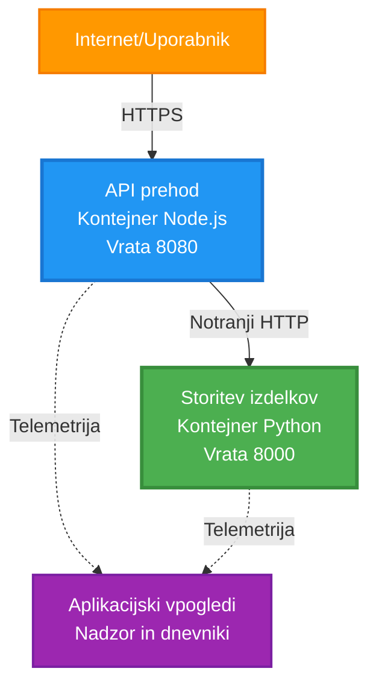
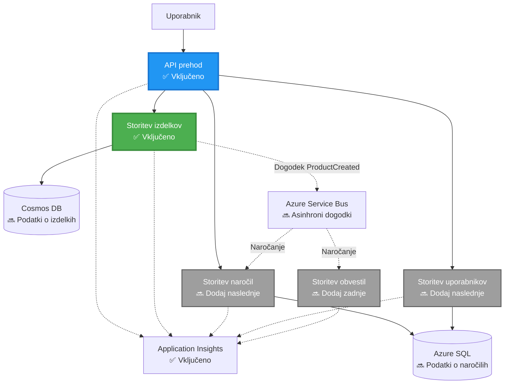
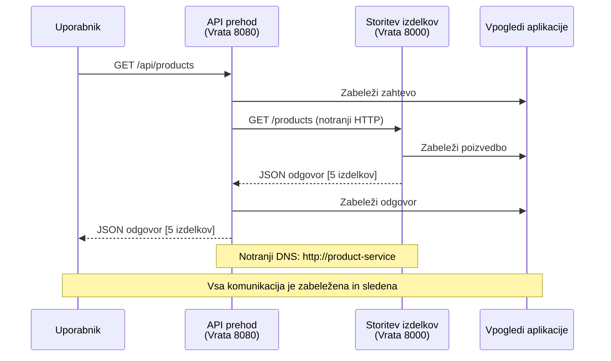

# Arhitektura mikrostoritev - primer Container App

⏱️ **Ocenjen čas**: 25-35 minut | 💰 **Ocenjeni strošek**: ~$50-100/mesec | ⭐ **Zahtevnost**: Napredno

**📚 Pot učenja:**
- ← Prejšnje: [Enostaven Flask API](../../../../examples/container-app/simple-flask-api) - Osnove enega kontejnerja
- 🎯 **Tukaj ste**: Arhitektura mikrostoritev (osnova z 2 storitvama)
- → Naslednje: [AI Integration](../../../../docs/ai-foundry) - Dodajte inteligenco svojim storitvam
- 🏠 [Domača stran tečaja](../../README.md)

---

Poenostavljena, a funkcionalna arhitektura mikrostoritev, nameščena v Azure Container Apps z uporabo AZD CLI. Ta primer prikazuje komunikacijo med storitvami, orkestracijo kontejnerjev in spremljanje z praktično postavitvijo dveh storitev.

> **📚 Pristop k učenju**: Ta primer se začne z minimalno arhitekturo z 2 storitvama (API Gateway + Backend Service), ki jo lahko dejansko namestite in iz katere se lahko učite. Ko obvladate to osnovo, nudimo navodila za razširitev v poln ekosistem mikrostoritev.

## Kaj se boste naučili

Z izvedbo tega primera boste:
- Namestili več kontejnerjev v Azure Container Apps
- Uvedli komunikacijo med storitvami z notranjim omrežjem
- Konfigurirali skaliranje in zdravstvene preglede glede na okolje
- Spremljali distribuirane aplikacije z Application Insights
- Razumeli vzorce nameščanja mikrostoritev in priporočene prakse
- Naučili se postopne razširitve od preprostega do kompleksnega

## Arhitektura

### Faza 1: Kaj gradimo (vključeno v ta primer)


```mermaid
graph TB
    Internet[Internet/Uporabnik]
    Gateway[API prehod<br/>Kontejner Node.js<br/>Vrata 8080]
    Product[Storitev izdelkov<br/>Kontejner Python<br/>Vrata 8000]
    AppInsights[Aplikacijski vpogledi<br/>Nadzor in dnevniki]
    
    Internet -->|HTTPS| Gateway
    Gateway -->|Notranji HTTP| Product
    Gateway -.->|Telemetrija| AppInsights
    Product -.->|Telemetrija| AppInsights
    
    style Gateway fill:#2196F3,stroke:#1976D2,stroke-width:3px,color:#fff
    style Product fill:#4CAF50,stroke:#388E3C,stroke-width:3px,color:#fff
    style Internet fill:#FF9800,stroke:#F57C00,stroke-width:2px,color:#fff
    style AppInsights fill:#9C27B0,stroke:#7B1FA2,stroke-width:2px,color:#fff
```
**Podrobnosti komponent:**

| Component | Purpose | Access | Resources |
|-----------|---------|--------|-----------|
| **API Gateway** | Usmerja zunanje zahteve do backend storitev | Public (HTTPS) | 1 vCPU, 2GB RAM, 2-20 replicas |
| **Product Service** | Upravljanje kataloga izdelkov z v-memoriji podatki | Internal only | 0.5 vCPU, 1GB RAM, 1-10 replicas |
| **Application Insights** | Centralizirano beleženje in distribuirano sledenje | Azure Portal | 1-2 GB/month data ingestion |

**Zakaj začeti preprosto?**
- ✅ Hitro namestite in razumite (25-35 minut)
- ✅ Naučite se osnovnih vzorcev mikrostoritev brez kompleksnosti
- ✅ Delujoča koda, ki jo lahko spreminjate in preizkušate
- ✅ Nižji stroški za učenje (~$50-100/mesec v primerjavi z $300-1400/mesec)
- ✅ Zgradite samozavest pred dodajanjem baz podatkov in vrst sporočil

**Analogia**: To je kot učenje vožnje. Začnete s praznim parkiriščem (2 storitvi), obvladate osnove, nato napredujete v mestni promet (5+ storitev z bazami podatkov).

### Faza 2: Prihodnja razširitev (referenčna arhitektura)

Ko obvladate arhitekturo z 2 storitvama, jo lahko razširite na:


```mermaid
graph TB
    User[Uporabnik]
    Gateway[API prehod<br/>✅ Vključeno]
    Product[Storitev izdelkov<br/>✅ Vključeno]
    Order[Storitev naročil<br/>🔜 Dodaj naslednje]
    UserSvc[Storitev uporabnikov<br/>🔜 Dodaj naslednje]
    Notify[Storitev obvestil<br/>🔜 Dodaj zadnje]
    
    CosmosDB[(Cosmos DB<br/>🔜 Podatki o izdelkih)]
    AzureSQL[(Azure SQL<br/>🔜 Podatki o naročilih)]
    ServiceBus[Azure Service Bus<br/>🔜 Asinhroni dogodki]
    AppInsights[Application Insights<br/>✅ Vključeno]
    
    User --> Gateway
    Gateway --> Product
    Gateway --> Order
    Gateway --> UserSvc
    
    Product --> CosmosDB
    Order --> AzureSQL
    UserSvc --> AzureSQL
    
    Product -.->|Dogodek ProductCreated| ServiceBus
    ServiceBus -.->|Naročanje| Notify
    ServiceBus -.->|Naročanje| Order
    
    Gateway -.-> AppInsights
    Product -.-> AppInsights
    Order -.-> AppInsights
    UserSvc -.-> AppInsights
    Notify -.-> AppInsights
    
    style Product fill:#4CAF50,stroke:#388E3C,stroke-width:3px,color:#fff
    style Gateway fill:#2196F3,stroke:#1976D2,stroke-width:3px,color:#fff
    style Order fill:#9E9E9E,stroke:#616161,stroke-width:2px,color:#fff
    style UserSvc fill:#9E9E9E,stroke:#616161,stroke-width:2px,color:#fff
    style Notify fill:#9E9E9E,stroke:#616161,stroke-width:2px,color:#fff
```
Za korak-po-koraku navodila glejte razdelek "Expansion Guide" na koncu.

## Vključene funkcije

✅ **Odkritje storitev**: Samodejno odkrivanje na podlagi DNS med kontejnerji  
✅ **Uravnoteženje obremenitve**: Vgrajeno uravnoteženje med replikami  
✅ **Samodejno skaliranje**: Neodvisno skaliranje za vsako storitev glede na HTTP zahteve  
✅ **Spremljanje zdravja**: Liveness in readiness probe za obe storitvi  
✅ **Distribuirano beleženje**: Centralizirano beleženje z Application Insights  
✅ **Notranje omrežje**: Varnostna komunikacija med storitvami  
✅ **Orkestracija kontejnerjev**: Samodejna namestitev in skaliranje  
✅ **Posodobitve brez izpada**: Rolling updates z upravljanjem revizij  

## Predpogoji

### Potrebna orodja

Preden začnete, preverite, da imate nameščena ta orodja:

1. **[Azure Developer CLI (azd)](https://learn.microsoft.com/azure/developer/azure-developer-cli/install-azd)** (različica 1.0.0 ali višja)
   ```bash
   azd version
   # Pričakovan izhod: azd različica 1.0.0 ali novejša
   ```

2. **[Azure CLI](https://learn.microsoft.com/cli/azure/install-azure-cli)** (različica 2.50.0 ali višja)
   ```bash
   az --version
   # Pričakovan izhod: azure-cli 2.50.0 ali novejši
   ```

3. **[Docker](https://www.docker.com/get-started)** (za lokalni razvoj/testiranje - neobvezno)
   ```bash
   docker --version
   # Pričakovan izhod: Docker različica 20.10 ali novejša
   ```

### Preverite svojo postavitev

Za potrditev, da ste pripravljeni, zaženite te ukaze:

```bash
# Preverite Azure Developer CLI
azd version
# ✅ Pričakovano: azd različica 1.0.0 ali novejša

# Preverite Azure CLI
az --version
# ✅ Pričakovano: azure-cli 2.50.0 ali novejša

# Preverite Docker (neobvezno)
docker --version
# ✅ Pričakovano: različica Dockera 20.10 ali novejša
```

**Merila uspeha**: Vsi ukazi vrnejo številke različic, ki so enake ali višje od minimalnih.

### Zahteve Azure

- Aktivno **Azure naročnino** ([ustvarite brezplačen račun](https://azure.microsoft.com/free/))
- Dovoljenja za ustvarjanje virov v vaši naročnini
- Vloga **Contributor** na naročnini ali skupini virov

### Predznanje

To je primer na **napredni ravni**. Moral bi imeti:
- Dokončan [Simple Flask API example](../../../../examples/container-app/simple-flask-api) 
- Osnovno razumevanje arhitekture mikrostoritev
- Poznavanje REST API-jev in HTTP
- Razumevanje konceptov kontejnerjev

**Nov pri Container Apps?** Začnite s [Simple Flask API example](../../../../examples/container-app/simple-flask-api), da se naučite osnov.

## Hiter začetek (korak za korakom)

### 1. korak: Klonirajte in se premaknite

```bash
git clone https://github.com/microsoft/AZD-for-beginners.git
cd AZD-for-beginners/examples/microservices
```

**✓ Preverjanje uspeha**: Preverite, da vidite `azure.yaml`:
```bash
ls
# Pričakovano: README.md, azure.yaml, infra/, src/
```

### 2. korak: Avtentikacija v Azure

```bash
azd auth login
```

To odpre vaš brskalnik za avtentikacijo v Azure. Prijavite se z vašimi Azure poverilnicami.

**✓ Preverjanje uspeha**: Morali bi videti:
```
Logged in to Azure.
```

### 3. korak: Inicializirajte okolje

```bash
azd init
```

**Pozivi, ki jih boste videli**:
- **Environment name**: Vnesite kratek ime (npr. `microservices-dev`)
- **Azure subscription**: Izberite vašo naročnino
- **Azure location**: Izberite regijo (npr. `eastus`, `westeurope`)

**✓ Preverjanje uspeha**: Morali bi videti:
```
SUCCESS: New project initialized!
```

### 4. korak: Namestite infrastrukturo in storitve

```bash
azd up
```

**Kaj se zgodi** (traja 8-12 minut):


```mermaid
graph LR
    A[azd zaženi] --> B[Ustvari skupino virov]
    B --> C[Namesti register kontejnerjev]
    C --> D[Namesti Analitiko dnevnikov]
    D --> E[Namesti App Insights]
    E --> F[Ustvari okolje za kontejnerje]
    F --> G[Zgradi sliko API prehoda]
    F --> H[Zgradi sliko storitve izdelka]
    G --> I[Potisni v register]
    H --> I
    I --> J[Namesti API prehod]
    I --> K[Namesti storitev izdelka]
    J --> L[Konfiguriraj Ingress in preverjanja stanja]
    K --> L
    L --> M[Namestitev zaključena ✓]
    
    style A fill:#2196F3,stroke:#1976D2,stroke-width:3px,color:#fff
    style M fill:#4CAF50,stroke:#388E3C,stroke-width:3px,color:#fff
```
**✓ Preverjanje uspeha**: Morali bi videti:
```
SUCCESS: Your application was deployed to Azure in X minutes Y seconds.
Endpoint: https://api-gateway-<unique-id>.azurecontainerapps.io
```

**⏱️ Čas**: 8-12 minut

### 5. korak: Preizkusite namestitev

```bash
# Pridobi končno točko prehoda
GATEWAY_URL=$(azd env get-values | grep API_GATEWAY_URL | cut -d '=' -f2 | tr -d '"')

# Preveri stanje API prehoda
curl $GATEWAY_URL/health
```

**✅ Pričakovani izhod:**
```json
{
  "status": "healthy",
  "service": "api-gateway",
  "timestamp": "2025-11-19T10:30:00Z"
}
```

**Preizkusite product service preko gatewaya**:
```bash
# Seznam izdelkov
curl $GATEWAY_URL/api/products
```

**✅ Pričakovani izhod:**
```json
[
  {"id":1,"name":"Laptop","price":999.99,"stock":50},
  {"id":2,"name":"Mouse","price":29.99,"stock":200},
  {"id":3,"name":"Keyboard","price":79.99,"stock":150}
]
```

**✓ Preverjanje uspeha**: Obe končni točki vračata JSON podatke brez napak.

---

**🎉 Čestitke!** Namestili ste arhitekturo mikrostoritev v Azure!

## Struktura projekta

Vse izvedbene datoteke so vključene—to je popoln, delujoč primer:

```
microservices/
│
├── README.md                         # This file
├── azure.yaml                        # AZD configuration
├── .gitignore                        # Git ignore patterns
│
├── infra/                           # Infrastructure as Code (Bicep)
│   ├── main.bicep                   # Main orchestration
│   ├── abbreviations.json           # Naming conventions
│   ├── core/                        # Shared infrastructure
│   │   ├── container-apps-environment.bicep  # Container environment + registry
│   │   └── monitor.bicep            # Application Insights + Log Analytics
│   └── app/                         # Service definitions
│       ├── api-gateway.bicep        # API Gateway container app
│       └── product-service.bicep    # Product Service container app
│
└── src/                             # Application source code
    ├── api-gateway/                 # Node.js API Gateway
    │   ├── app.js                   # Express server with routing
    │   ├── package.json             # Node dependencies
    │   └── Dockerfile               # Container definition
    └── product-service/             # Python Product Service
        ├── main.py                  # Flask API with product data
        ├── requirements.txt         # Python dependencies
        └── Dockerfile               # Container definition
```

**Kaj posamezna komponenta počne:**

**Infrastruktura (infra/)**:
- `main.bicep`: Orkestrira vse Azure vire in njihove odvisnosti
- `core/container-apps-environment.bicep`: Ustvari Container Apps okolje in Azure Container Registry
- `core/monitor.bicep`: Nastavi Application Insights za distribuirano beleženje
- `app/*.bicep`: Posamezne definicije container app-ov s skaliranjem in zdravstvenimi pregledi

**API Gateway (src/api-gateway/)**:
- Javno usmerjena storitev, ki preusmerja zahteve do backend storitev
- Implementira beleženje, ravnanje z napakami in posredovanje zahtev
- Prikazuje HTTP komunikacijo med storitvami

**Product Service (src/product-service/)**:
- Notranja storitev s katalogom izdelkov (v-memoriji za enostavnost)
- REST API z zdravstvenimi pregledi
- Primer vzorca backend mikrostoritev

## Pregled storitev

### API Gateway (Node.js/Express)

**Vrata**: 8080  
**Dostop**: Javno (external ingress)  
**Namen**: Usmerja vhodne zahteve do ustreznih backend storitev  

**Končne točke**:
- `GET /` - Informacije o storitvi
- `GET /health` - Health check endpoint
- `GET /api/products` - Posreduje do product service (prikaz vseh)
- `GET /api/products/:id` - Posreduje do product service (pridobi po ID)

**Ključne funkcije**:
- Usmerjanje zahtev z axios
- Centralizirano beleženje
- Ravnanje z napakami in upravljanje časovnih omejitev
- Odkritje storitev preko spremenljivk okolja
- Integracija z Application Insights

**Izpostavljena koda** (`src/api-gateway/app.js`):
```javascript
// Notranja komunikacija med storitvami
app.get('/api/products', async (req, res) => {
  const response = await axios.get(`${PRODUCT_SERVICE_URL}/products`, {
    timeout: 5000
  });
  res.json(response.data);
});
```

### Product Service (Python/Flask)

**Vrata**: 8000  
**Dostop**: Samo interno (brez zunanjega dostopa)  
**Namen**: Upravljanje kataloga izdelkov z v-memoriji podatki  

**Končne točke**:
- `GET /` - Informacije o storitvi
- `GET /health` - Health check endpoint
- `GET /products` - Prikaži vse izdelke
- `GET /products/<id>` - Pridobi izdelek po ID

**Ključne funkcije**:
- RESTful API z Flask
- Shramba izdelkov v pomnilniku (preprosto, brez baze podatkov)
- Spremljanje zdravja z probes
- Strukturirano beleženje
- Integracija z Application Insights

**Model podatkov**:
```python
{
  "id": 1,
  "name": "Laptop",
  "description": "High-performance laptop",
  "price": 999.99,
  "stock": 50
}
```

**Zakaj samo interno?**
Product service ni javno izpostavljen. Vse zahteve morajo iti skozi API Gateway, ki nudi:
- Varnost: Nadzorovana točka dostopa
- Fleksibilnost: Spremembe backend-a brez vpliva na odjemalce
- Spremljanje: Centralizirano beleženje zahtev

## Razumevanje komunikacije med storitvami

### Kako storitve med seboj komunicirajo


```mermaid
sequenceDiagram
    participant User as Uporabnik
    participant Gateway as API prehod<br/>(Vrata 8080)
    participant Product as Storitev izdelkov<br/>(Vrata 8000)
    participant AI as Vpogledi aplikacije
    
    User->>Gateway: GET /api/products
    Gateway->>AI: Zabeleži zahtevo
    Gateway->>Product: GET /products (notranji HTTP)
    Product->>AI: Zabeleži poizvedbo
    Product-->>Gateway: JSON odgovor [5 izdelkov]
    Gateway->>AI: Zabeleži odgovor
    Gateway-->>User: JSON odgovor [5 izdelkov]
    
    Note over Gateway,Product: Notranji DNS: http://product-service
    Note over User,AI: Vsa komunikacija je zabeležena in sledena
```
V tem primeru API Gateway komunicira s Product Service z uporabo **notranjih HTTP klicev**:

```javascript
// API prehod (src/api-gateway/app.js)
const PRODUCT_SERVICE_URL = process.env.PRODUCT_SERVICE_URL;

// Izvedi interno HTTP zahtevo
const response = await axios.get(`${PRODUCT_SERVICE_URL}/products`);
```

**Ključne točke**:

1. **Odkritje preko DNS**: Container Apps samodejno zagotavlja DNS za notranje storitve
   - Product Service FQDN: `product-service.internal.<environment>.azurecontainerapps.io`
   - Poenostavljeno kot: `http://product-service` (Container Apps to razreši)

2. **Brez javne izpostavitve**: Product Service ima v Bicep `external: false`
   - Dosegljiv samo znotraj Container Apps okolja
   - Ni dostopen iz interneta

3. **Spremenljivke okolja**: URL-ji storitev se vbrizgajo ob nameščanju
   - Bicep posreduje notranji FQDN gatewayu
   - Nobenih trdo kodiranih URL-jev v kodi aplikacije

**Analogia**: Predstavljajte si to kot pisarniške sobe. API Gateway je recepcija (javno dostopna), Product Service pa pisarna (samo interno). Obiskovalci morajo skozi recepcijo, da pridejo do katere koli pisarne.

## Možnosti namestitve

### Polna namestitev (priporočeno)

```bash
# Razporedi infrastrukturo in obe storitvi
azd up
```

To namesti:
1. Container Apps okolje
2. Application Insights
3. Container Registry
4. API Gateway kontejner
5. Product Service kontejner

**Čas**: 8-12 minut

### Namestitev posamezne storitve

```bash
# Razmestite samo eno storitev (po začetnem azd up)
azd deploy api-gateway

# Ali pa razmestite storitev product
azd deploy product-service
```

**Uporabniški primer**: Ko ste posodobili kodo v eni storitvi in želite ponovno namestiti samo to storitev.

### Posodobi konfiguracijo

```bash
# Spremenite parametre skaliranja
azd env set GATEWAY_MAX_REPLICAS 30

# Ponovno razporedite z novo konfiguracijo
azd up
```

## Konfiguracija

### Konfiguracija skaliranja

Obe storitvi sta konfigurirani z avtomatskim skaliranjem na podlagi HTTP v njihovih Bicep datotekah:

**API Gateway**:
- Min replik: 2 (vedno vsaj 2 za razpoložljivost)
- Max replik: 20
- Trigger skaliranja: 50 vzporednih zahtev na repliko

**Product Service**:
- Min replik: 1 (lahko se skrči na nič, če je potrebno)
- Max replik: 10
- Trigger skaliranja: 100 vzporednih zahtev na repliko

**Prilagodite skaliranje** (v `infra/app/*.bicep`):
```bicep
scale: {
  minReplicas: 1
  maxReplicas: 10
  rules: [
    {
      name: 'http-scale-rule'
      http: {
        metadata: {
          concurrentRequests: '100'  // Adjust this
        }
      }
    }
  ]
}
```

### Dodelitev virov

**API Gateway**:
- CPU: 1.0 vCPU
- Pomnilnik: 2 GiB
- Razlog: Obdeluje ves zunanji promet

**Product Service**:
- CPU: 0.5 vCPU
- Pomnilnik: 1 GiB
- Razlog: Lahkotne operacije v pomnilniku

### Zdravstveni pregledi

Obe storitvi vključujeta liveness in readiness probe:

```bicep
probes: [
  {
    type: 'Liveness'
    httpGet: {
      path: '/health'
      port: 8080
    }
    initialDelaySeconds: 10
    periodSeconds: 30
  }
  {
    type: 'Readiness'
    httpGet: {
      path: '/health'
      port: 8080
    }
    initialDelaySeconds: 5
    periodSeconds: 10
  }
]
```

**Kaj to pomeni**:
- **Liveness**: Če zdravje ne uspe, Container Apps ponovno zažene kontejner
- **Readiness**: Če ni pripravljen, Container Apps preneha usmerjati promet na to repliko

## Spremljanje in opazovanje

### Ogled dnevnikov storitev

```bash
# Ogled dnevnikov z uporabo azd monitor
azd monitor --logs

# Ali uporabite Azure CLI za določene Container Apps:
# Pretakajte dnevnike prek API Gateway
az containerapp logs show --name api-gateway --resource-group $RG_NAME --follow

# Ogled nedavnih dnevnikov storitve izdelka
az containerapp logs show --name product-service --resource-group $RG_NAME --tail 100
```

**Pričakovani izhod**:
```
[api-gateway] API Gateway listening on port 8080
[api-gateway] Product Service URL: http://product-service
[api-gateway] GET /api/products 200 - 45ms
[product-service] Retrieved 5 products
```

### Query-ji v Application Insights

Dostopajte do Application Insights v Azure Portal in zaženite te poizvedbe:

**Najdi počasne zahteve**:
```kusto
requests
| where timestamp > ago(1h)
| where duration > 1000  // Requests taking >1 second
| summarize count() by name, cloud_RoleName
| order by count_ desc
```

**Sledi klice med storitvami**:
```kusto
dependencies
| where timestamp > ago(1h)
| where type == "Http"
| project timestamp, name, target, duration, success
| order by timestamp desc
```

**Stopnja napak po storitvi**:
```kusto
exceptions
| where timestamp > ago(24h)
| summarize errorCount = count() by cloud_RoleName, type
| order by errorCount desc
```

**Obremenitev zahtev skozi čas**:
```kusto
requests
| where timestamp > ago(1h)
| summarize requestCount = count() by bin(timestamp, 5m), cloud_RoleName
| render timechart
```

### Dostop do nadzorne plošče za spremljanje

```bash
# Pridobi podrobnosti storitve Application Insights
azd env get-values | grep APPLICATIONINSIGHTS

# Odpri nadzor v Azure Portalu
az monitor app-insights component show \
  --app $(azd env get-values | grep APPLICATIONINSIGHTS_CONNECTION_STRING | cut -d '=' -f2) \
  --resource-group $(azd env get-values | grep AZURE_RESOURCE_GROUP | cut -d '=' -f2) \
  --query "appId" -o tsv
```

### Live Metrics

1. Pojdite v Application Insights v Azure Portal
2. Kliknite "Live Metrics"
3. Oglejte si realnočasovne zahteve, napake in delovanje
4. Preizkusite tako, da zaženete: `curl $(azd env get-values | grep API_GATEWAY_URL | cut -d '=' -f2 | tr -d '"')/api/products`

## Praktične vaje

### Naloga 1: Dodajte nov endpoint za ustvarjanje izdelka ⭐ (Enostavno)

**Cilj**: Dodajte POST endpoint za ustvarjanje novih izdelkov

**Začetna točka**: `src/product-service/main.py`

**Koraki**:

1. Dodajte ta endpoint za `get_product` funkcijo v `main.py`:

```python
@app.route('/products', methods=['POST'])
def create_product():
    """Create a new product"""
    data = request.get_json()
    
    # Preverite zahtevana polja
    if not data or 'name' not in data or 'price' not in data:
        return jsonify({'error': 'Missing required fields: name, price'}), 400
    
    new_id = max(p['id'] for p in products) + 1
    new_product = {
        'id': new_id,
        'name': data['name'],
        'description': data.get('description', ''),
        'price': float(data['price']),
        'stock': int(data.get('stock', 0))
    }
    products.append(new_product)
    logger.info(f"Created product {new_id}")
    return jsonify(new_product), 201
```

2. Dodajte POST pot v API Gateway (`src/api-gateway/app.js`):

```javascript
// Dodajte to po poti GET /api/products
app.post('/api/products', async (req, res) => {
  try {
    console.log(`Forwarding POST request to ${PRODUCT_SERVICE_URL}/products`);
    const response = await axios.post(`${PRODUCT_SERVICE_URL}/products`, req.body, {
      timeout: 5000
    });
    res.status(201).json(response.data);
  } catch (error) {
    console.error('Error calling product service:', error.message);
    res.status(503).json({
      error: 'Product service unavailable',
      message: error.message
    });
  }
});
```

3. Ponovno razmestite obe storitvi:

```bash
azd deploy product-service
azd deploy api-gateway
```

4. Preizkusite novo končno točko:

```bash
GATEWAY_URL=$(azd env get-values | grep API_GATEWAY_URL | cut -d '=' -f2 | tr -d '"')

# Ustvari nov izdelek
curl -X POST $GATEWAY_URL/api/products \
  -H "Content-Type: application/json" \
  -d '{"name":"USB Cable","price":9.99,"stock":500}'
```

**✅ Pričakovani izhod:**
```json
{"id":6,"name":"USB Cable","description":"","price":9.99,"stock":500}
```

5. Preverite, da se prikaže na seznamu:

```bash
curl $GATEWAY_URL/api/products
# Zdaj bi moralo prikazati 6 izdelkov, vključno z novim USB kablom
```

**Kriteriji uspeha**:
- ✅ POST zahteva vrne HTTP 201
- ✅ Nov izdelek se prikaže v seznamu GET /api/products
- ✅ Izdelek ima samodejno povečan ID

**Čas**: 10-15 minut

---

### Vaja 2: Spremenite pravila samodejnega skaliranja ⭐⭐ (Srednje)

**Cilj**: Spremeniti Product Service, da se bolj agresivno skalira

**Izhodišče**: `infra/app/product-service.bicep`

**Koraki**:

1. Odprite `infra/app/product-service.bicep` in poiščite blok `scale` (približno vrstica 95)

2. Spremenite iz:
```bicep
scale: {
  minReplicas: 1
  maxReplicas: 10
  rules: [
    {
      name: 'http-scale-rule'
      http: {
        metadata: {
          concurrentRequests: '100'  // OLD
        }
      }
    }
  ]
}
```

V:
```bicep
scale: {
  minReplicas: 2  // Always have 2 running
  maxReplicas: 20  // Allow more scaling
  rules: [
    {
      name: 'http-scale-rule'
      http: {
        metadata: {
          concurrentRequests: '20'  // Scale at lower threshold
        }
      }
    }
  ]
}
```

3. Ponovno razmestite infrastrukturo:

```bash
azd up
```

4. Preverite novo konfiguracijo skaliranja:

```bash
az containerapp show \
  --name $(azd env get-values | grep PRODUCT_SERVICE | head -1 | cut -d '/' -f5) \
  --resource-group $(azd env get-values | grep AZURE_RESOURCE_GROUP | cut -d '=' -f2 | tr -d '"') \
  --query "properties.template.scale" -o json
```

**✅ Pričakovani izhod:**
```json
{
  "minReplicas": 2,
  "maxReplicas": 20,
  "rules": [...]
}
```

5. Preizkusite samodejno skaliranje z obremenitvijo:

```bash
# Ustvari sočasne zahteve
for i in {1..500}; do curl $GATEWAY_URL/api/products & done

# Spremljaj skaliranje z Azure CLI
az containerapp logs show --name product-service --resource-group $RG_NAME --follow
# Poišči: dogodke skaliranja Container Apps
```

**Kriteriji uspeha**:
- ✅ Product Service vedno teče z vsaj 2 replikama
- ✅ Pod obremenitvijo se poveča na več kot 2 repliki
- ✅ Azure Portal prikazuje nova pravila skaliranja

**Čas**: 15-20 minut

---

### Vaja 3: Dodajte lastno poizvedbo za spremljanje ⭐⭐ (Srednje)

**Cilj**: Ustvariti lastno poizvedbo v Application Insights za sledenje zmogljivosti API-ja izdelkov

**Koraki**:

1. Pojdite v Application Insights v Azure Portal:
   - Odprite Azure Portal
   - Poiščite svojo skupino virov (rg-microservices-*)
   - Kliknite na Application Insights vir

2. Kliknite "Logs" v levem meniju

3. Ustvarite to poizvedbo:

```kusto
requests
| where timestamp > ago(1h)
| where name contains "products"
| summarize 
    RequestCount = count(),
    AvgDuration = avg(duration),
    P95Duration = percentile(duration, 95),
    SuccessRate = 100.0 * countif(success == true) / count()
  by bin(timestamp, 5m)
| render timechart
```

4. Kliknite "Run", da zaženete poizvedbo

5. Shranite poizvedbo:
   - Kliknite "Save"
   - Ime: "Product API Performance"
   - Kategorija: "Performance"

6. Ustvarite testni promet:

```bash
for i in {1..100}; do curl $GATEWAY_URL/api/products; sleep 1; done
```

7. Osvežite poizvedbo, da vidite podatke

**✅ Pričakovani izhod:**
- Grafikon, ki prikazuje število zahtev skozi čas
- Povprečni čas < 500 ms
- Stopnja uspešnosti = 100%
- Časovni intervali po 5 minut

**Kriteriji uspeha**:
- ✅ Poizvedba prikaže več kot 100 zahtev
- ✅ Stopnja uspešnosti je 100%
- ✅ Povprečni čas < 500 ms
- ✅ Grafikon prikazuje 5-minutne časovne intervale

**Učni rezultat**: Razumeti, kako spremljati zmogljivost storitve z lastnimi poizvedbami

**Čas**: 10-15 minut

---

### Vaja 4: Implementirajte logiko ponavljanja (retry) ⭐⭐⭐ (Napredno)

**Cilj**: Dodajte logiko ponavljanja (retry) v API Gateway, ko Product Service začasno ni na voljo

**Izhodišče**: `src/api-gateway/app.js`

**Koraki**:

1. Namestite knjižnico za ponavljanje:

```bash
cd src/api-gateway
npm install axios-retry --save
cd ../..
```

2. Posodobite `src/api-gateway/app.js` (dodajte po uvozu axios):

```javascript
const axiosRetry = require('axios-retry');

// Konfigurirajte logiko ponovnih poskusov
axiosRetry(axios, {
  retries: 3,
  retryDelay: (retryCount) => {
    return retryCount * 1000; // 1s, 2s, 3s
  },
  retryCondition: (error) => {
    // Ponovni poskusi ob omrežnih napakah ali odgovorih 5xx
    return axiosRetry.isNetworkOrIdempotentRequestError(error) ||
           (error.response && error.response.status >= 500);
  }
});

console.log('Retry logic configured: 3 retries with exponential backoff');
```

3. Ponovno razmestite API Gateway:

```bash
azd deploy api-gateway
```

4. Preizkusite vedenje ponavljanja z simulacijo izpada storitve:

```bash
# Nastavi storitev izdelkov na 0 (simuliraj napako)
az containerapp update \
  --name $(azd env get-values | grep PRODUCT_SERVICE | head -1 | cut -d '/' -f5) \
  --resource-group $(azd env get-values | grep AZURE_RESOURCE_GROUP | cut -d '=' -f2 | tr -d '"') \
  --min-replicas 0 \
  --max-replicas 0

# Poskusi dostopati do izdelkov (poskus bo ponovljen 3-krat)
time curl -v $GATEWAY_URL/api/products
# Opazuj: Odziv traja približno 6 sekund (ponovitve: 1 s + 2 s + 3 s)

# Obnovi storitev izdelkov
az containerapp update \
  --name $(azd env get-values | grep PRODUCT_SERVICE | head -1 | cut -d '/' -f5) \
  --resource-group $(azd env get-values | grep AZURE_RESOURCE_GROUP | cut -d '=' -f2 | tr -d '"') \
  --min-replicas 1 \
  --max-replicas 10
```

5. Oglejte si dnevnike ponavljanja:

```bash
az containerapp logs show --name api-gateway --resource-group $RG_NAME --tail 50
# Poiščite: sporočila o ponovnih poskusih
```

**✅ Pričakovano vedenje:**
- Zahteve se ponovijo 3-krat, preden odpovejo
- Vsako ponavljanje počaka dlje (1 s, 2 s, 3 s)
- Uspešne zahteve po ponovnem zagonu storitve
- Dnevniki prikazujejo poskuse ponavljanja

**Kriteriji uspeha**:
- ✅ Zahteve se ponovijo 3-krat, preden odpovejo
- ✅ Vsako ponavljanje počaka dlje (eksponentni backoff)
- ✅ Uspešne zahteve po ponovnem zagonu storitve
- ✅ Dnevniki prikazujejo poskuse ponavljanja

**Učni rezultat**: Razumeti vzorce odpornosti v mikrostoritevah (circuit breakers, retries, timeouts)

**Čas**: 20-25 minut

---

## Preverjanje znanja

Po dokončanju tega primera preverite svoje razumevanje:

### 1. Komunikacija med storitvami ✓

Preizkusite svoje znanje:
- [ ] Ali lahko razložite, kako API Gateway odkrije Product Service? (odkrivanje storitev na osnovi DNS)
- [ ] Kaj se zgodi, če Product Service ni dosegljiv? (Gateway vrne napako 503)
- [ ] Kako bi dodali tretjo storitev? (Ustvarite novo datoteko Bicep, dodajte v main.bicep, ustvarite mapo src)

**Praktično preverjanje:**
```bash
# Simuliraj izpad storitve
az containerapp update --name <product-service-name> --min-replicas 0 --max-replicas 0
curl $GATEWAY_URL/api/products
# ✅ Pričakovano: 503 Storitev ni na voljo

# Obnovi storitev
az containerapp update --name <product-service-name> --min-replicas 1 --max-replicas 10
```

### 2. Spremljanje in opazljivost ✓

Preizkusite svoje znanje:
- [ ] Kje vidite distribuirane dnevnike? (Application Insights v Azure Portal)
- [ ] Kako sledite počasnim zahtevam? (Kusto poizvedba: `requests | where duration > 1000`)
- [ ] Ali lahko ugotovite, katera storitev je povzročila napako? (Preverite polje `cloud_RoleName` v dnevnikih)

**Praktično preverjanje:**
```bash
# Ustvari simulacijo počasne zahteve
curl "$GATEWAY_URL/api/products?delay=2000"

# Poizvedi v Application Insights po počasnih zahtevah
# Pojdi v Azure Portal → Application Insights → Logs
# Zaženi: requests | where duration > 1000 | project timestamp, name, duration, cloud_RoleName
```

### 3. Skaliranje in zmogljivost ✓

Preizkusite svoje znanje:
- [ ] Kaj sproži samodejno skaliranje? (pravila za sočasne HTTP zahteve: 50 za gateway, 100 za product)
- [ ] Koliko replik se trenutno izvaja? (Preverite z `az containerapp revision list`)
- [ ] Kako bi skalirali Product Service na 5 replik? (Posodobite minReplicas v Bicep)

**Praktično preverjanje:**
```bash
# Ustvari obremenitev za preizkus samodejnega skaliranja
for i in {1..1000}; do curl $GATEWAY_URL/api/products & done

# Spremljaj povečanje replik z Azure CLI
az containerapp logs show --name api-gateway --resource-group $RG_NAME --follow
# ✅ Pričakovano: v dnevnikih vidni dogodki skaliranja
```

**Kriteriji uspeha**: Lahko odgovorite na vsa vprašanja in jih potrdite z ukazi.

---

## Analiza stroškov

### Ocenjeni mesečni stroški (za ta primer z 2 storitvema)

| Vir | Konfiguracija | Ocenjeni stroški |
|----------|--------------|----------------|
| API Gateway | 2-20 replik, 1 vCPU, 2 GB RAM | $30-150 |
| Product Service | 1-10 replik, 0.5 vCPU, 1 GB RAM | $15-75 |
| Container Registry | osnovni nivo | $5 |
| Application Insights | 1-2 GB/mesec | $5-10 |
| Log Analytics | 1 GB/mesec | $3 |
| **Skupaj** | | **$58-243/mesec** |

### Razčlenitev stroškov po uporabi

**Nizka obremenitev** (testiranje/učenje): ~$60/mesec
- API Gateway: 2 replik × 24/7 = $30
- Product Service: 1 replika × 24/7 = $15
- Spremljanje + Register = $13

**Srednja obremenitev** (majhna produkcija): ~$120/mesec
- API Gateway: 5 povprečnih replik = $75
- Product Service: 3 povprečne replike = $45
- Spremljanje + Register = $13

**Visoka obremenitev** (zaposlene periode): ~$240/mesec
- API Gateway: 15 povprečnih replik = $225
- Product Service: 8 povprečnih replik = $120
- Spremljanje + Register = $13

### Nasveti za optimizacijo stroškov

1. Skalirajte na nič za razvoj:
   ```bicep
   scale: {
     minReplicas: 0  // Save $30-40/month when not in use
     maxReplicas: 10
   }
   ```

2. Uporabite Consumption Plan za Cosmos DB (ko ga dodate):
   - Plačajte le za to, kar uporabljate
   - Brez minimalnega stroška

3. Nastavite vzorčenje v Application Insights:
   ```javascript
   appInsights.defaultClient.config.samplingPercentage = 50; // Vzorči 50 % zahtev
   ```

4. Počistite, kadar ni potrebno:
   ```bash
   azd down --force --purge
   ```

### Možnosti brezplačnega paketa

Za učenje/testiranje razmislite o:
- ✅ Uporabite brezplačen Azure kredit ($200 za prvih 30 dni za nove račune)
- ✅ Ohranjajte minimalno število replik (prihrani ~50% stroškov)
- ✅ Izbrišite po testiranju (brez nadaljnjih stroškov)
- ✅ Skalirajte na nič med učnimi sejami

**Primer**: Z zagonom tega primera 2 uri/dan × 30 dni = ~ $5/mesec namesto $60/mesec

---

## Hiter vodnik za odpravljanje težav

### Težava: `azd up` ne uspe z "Subscription not found"

**Rešitev**:
```bash
# Prijavite se ponovno z izrecno naročnino
az account set --subscription <your-subscription-id>
azd env set AZURE_SUBSCRIPTION_ID <your-subscription-id>
azd up
```

### Težava: API Gateway vrne 503 "Product service unavailable"

**Diagnoza**:
```bash
# Preverite dnevnike storitve izdelka z uporabo Azure CLI
az containerapp logs show --name product-service --resource-group $RG_NAME --tail 50

# Preverite stanje storitve izdelka
az containerapp show \
  --name $(azd env get-values | grep PRODUCT_SERVICE | head -1 | cut -d '/' -f5) \
  --resource-group $(azd env get-values | grep AZURE_RESOURCE_GROUP | cut -d '=' -f2 | tr -d '"') \
  --query "properties.runningStatus"
```

**Pogosti vzroki**:
1. Product service se ni zagnal (preverite dnevnike za Python napake)
2. Preverjanje stanja odpove (preverite, da endpoint `/health` deluje)
3. Gradnja slike kontejnerja ni uspela (preverite register za sliko)

### Težava: Samodejno skaliranje ne deluje

**Diagnoza**:
```bash
# Preveri trenutno število replik
az containerapp revision list \
  --name $(azd env get-values | grep API_GATEWAY | head -1 | cut -d '/' -f5) \
  --resource-group $(azd env get-values | grep AZURE_RESOURCE_GROUP | cut -d '=' -f2 | tr -d '"') \
  --query "[].properties.replicas"

# Ustvari obremenitev za testiranje
for i in {1..1000}; do curl $GATEWAY_URL/api/products & done

# Spremljaj dogodke skaliranja z Azure CLI
az containerapp logs show --name api-gateway --resource-group $RG_NAME --follow | grep -i scale
```

**Pogosti vzroki**:
1. Obremenitev ni dovolj visoka, da sproži pravilo skaliranja (potrebno >50 sočasnih zahtev)
2. Doseženo je največje število replik (preverite konfiguracijo Bicep)
3. Pravilo skaliranja napačno nastavljeno v Bicep (preverite vrednost concurrentRequests)

### Težava: Application Insights ne prikazuje dnevnikov

**Diagnoza**:
```bash
# Preverite, ali je niz za povezavo nastavljen
azd env get-values | grep APPLICATIONINSIGHTS

# Preverite, ali storitve pošiljajo telemetrijo
az monitor app-insights component show \
  --app $(azd env get-values | grep APPLICATIONINSIGHTS_NAME | cut -d '=' -f2 | tr -d '"') \
  --resource-group $(azd env get-values | grep AZURE_RESOURCE_GROUP | cut -d '=' -f2 | tr -d '"') \
  --query "properties.InstrumentationKey"
```

**Pogosti vzroki**:
1. Connection string ni posredovan vsebniku (preverite spremenljivke okolja)
2. Application Insights SDK ni konfiguriran (preverite uvoze v kodi)
3. Požarni zid blokira telemetrijo (redko, preverite omrežna pravila)

### Težava: Docker build lokalno ne uspe

**Diagnoza**:
```bash
# Preizkus gradnje API prehoda
cd src/api-gateway
docker build -t test-gateway .

# Preizkus gradnje storitve izdelkov
cd ../product-service
docker build -t test-product .
```

**Pogosti vzroki**:
1. Manjkajoče odvisnosti v package.json/requirements.txt
2. Napake v sintaksi Dockerfile
3. Težave z omrežjem pri prenosu odvisnosti

**Še vedno zataknjeni?** Oglejte si [Common Issues Guide](../../docs/chapter-07-troubleshooting/common-issues.md) ali [Azure Container Apps Troubleshooting](https://learn.microsoft.com/azure/container-apps/troubleshooting)

---

## Čiščenje

Da se izognete stalnim stroškom, izbrišite vse vire:

```bash
azd down --force --purge
```

**Poziv za potrditev**:
```
? Total resources to delete: 6, are you sure you want to continue? (y/N)
```

Vnesite `y` za potrditev.

**Kaj bo izbrisano**:
- Okolje Container Apps
- Obe Container Apps (gateway & product service)
- Container Registry
- Application Insights
- Log Analytics Workspace
- Skupina virov

**✓ Preverite čiščenje**:
```bash
az group list --query "[?starts_with(name,'rg-microservices')]" --output table
```

Treba bi bilo vrniti prazno.

---

## Vodič za razširitev: iz 2 na 5+ storitev

Ko obvladate to arhitekturo z 2 storitvama, tukaj je, kako razširiti:

### Faza 1: Dodaj trajno bazo podatkov (naslednji korak)

**Dodajte Cosmos DB za Product Service**:

1. Ustvarite `infra/core/cosmos.bicep`:
   ```bicep
   resource cosmosAccount 'Microsoft.DocumentDB/databaseAccounts@2023-04-15' = {
     name: name
     location: location
     kind: 'GlobalDocumentDB'
     properties: {
       databaseAccountOfferType: 'Standard'
       consistencyPolicy: { defaultConsistencyLevel: 'Session' }
       locations: [{ locationName: location, failoverPriority: 0 }]
     }
   }
   ```

2. Posodobite product service, da uporabi Azure Cosmos DB Python SDK namesto podatkov v pomnilniku

3. Ocenjen dodaten strošek: ~ $25/mesec (serverless)

### Faza 2: Dodajte tretjo storitev (upravljanje naročil)

**Ustvarite Order Service**:

1. Nova mapa: `src/order-service/` (Python/Node.js/C#)
2. Nova Bicep datoteka: `infra/app/order-service.bicep`
3. Posodobite API Gateway za usmerjanje `/api/orders`
4. Dodajte Azure SQL Database za shranjevanje naročil

**Arhitektura postane**:
```
API Gateway → Product Service (Cosmos DB)
           → Order Service (Azure SQL)
```

### Faza 3: Dodajte asinhrono komunikacijo (Service Bus)

**Implementirajte arhitekturo, ki temelji na dogodkih**:

1. Dodajte Azure Service Bus: `infra/core/servicebus.bicep`
2. Product Service objavlja dogodke "ProductCreated"
3. Order Service se naroči na dogodke produktov
4. Dodajte Notification Service za obdelavo dogodkov

**Vzorec**: Request/Response (HTTP) + Event-Driven (Service Bus)

### Faza 4: Dodajte avtentikacijo uporabnikov

**Implementirajte User Service**:

1. Ustvarite `src/user-service/` (Go/Node.js)
2. Dodajte Azure AD B2C ali lastno JWT avtentikacijo
3. API Gateway preveri žetone pred usmerjanjem
4. Storitve preverjajo uporabniške pravice

### Faza 5: Pripravljenost za produkcijo

**Dodajte te komponente**:
- ✅ Azure Front Door (globalno uravnoteženje obremenitve)
- ✅ Azure Key Vault (upravljanje skrivnosti)
- ✅ Azure Monitor Workbooks (lastni nadzorni paneli)
- ✅ CI/CD pipeline (GitHub Actions)
- ✅ Blue-Green razmestitve
- ✅ Managed Identity za vse storitve

**Strošek za celotno produkcijsko arhitekturo**: ~ $300-1,400/mesec

---

## Izvedite več

### Povezana dokumentacija
- [Dokumentacija Azure Container Apps](https://learn.microsoft.com/azure/container-apps/)
- [Vodič za arhitekturo mikrostoritev](https://learn.microsoft.com/azure/architecture/guide/architecture-styles/microservices)
- [Application Insights za distribuirano sledenje](https://learn.microsoft.com/azure/azure-monitor/app/distributed-tracing)
- [Dokumentacija Azure Developer CLI](https://learn.microsoft.com/azure/developer/azure-developer-cli/)

### Naslednji koraki v tem tečaju
- ← Prejšnje: [Simple Flask API](../../../../examples/container-app/simple-flask-api) - Primer za začetnike z enim kontejnerjem
- → Naslednje: [AI Integration Guide](../../../../docs/ai-foundry) - Dodajte AI zmogljivosti
- 🏠 [Domača stran tečaja](../../README.md)

### Primerjava: Kdaj uporabiti kaj

| Funkcija | En kontejner | Mikrostoritve (ta) | Kubernetes (AKS) |
|---------|-----------------|---------------------|------------------|
| **Uporabni primer** | Preproste aplikacije | Kompleksne aplikacije | Poslovne aplikacije |
| **Razširljivost** | Ena storitev | Skaliranje po storitvah | Največja prilagodljivost |
| **Zapletenost** | Nizka | Srednja | Visoka |
| **Velikost ekipe** | 1-3 razvijalci | 3-10 razvijalcev | 10+ razvijalcev |
| **Stroški** | ~$15-50/mesec | ~$60-250/mesec | ~$150-500/mesec |
| **Čas razmestitve** | 5-10 minut | 8-12 minut | 15-30 minut |
| **Najbolj primerno za** | MVP-ji, prototipi | Produkcijske aplikacije | Večoblačno, napredno omrežavanje |

**Priporočilo**: Začnite s Container Apps (ta primer), preidite na AKS le, če potrebujete funkcije specifične za Kubernetes.

---

## Pogosto zastavljena vprašanja

**Q: Zakaj le 2 storitvi namesto 5+?**  
A: Izobraževalni napredek. Obvladajte osnove (komunikacija storitev, nadzor, skaliranje) s preprostim primerom, preden dodate kompleksnost. Vzorci, ki jih tukaj spoznate, veljajo za arhitekture s 100 storitvami.

**Q: Lahko sam dodam več storitev?**  
A: Seveda! Sledite zgornjemu vodniku za razširitev. Vsaka nova storitev sledi istemu vzorcu: ustvarite src mapo, ustvarite Bicep datoteko, posodobite azure.yaml, razporedite.

**Q: Je to primerno za produkcijo?**  
A: Gre za trdno osnovo. Za produkcijo dodajte: managed identity, Key Vault, trajne podatkovne baze, CI/CD cevovod, opozorila za spremljanje in strategijo varnostnega kopiranja.

**Q: Zakaj ne uporabiti Dapr ali drugega service mesha?**  
A: Naj bo preprosto za učenje. Ko boste razumeli izvorno omrežavanje Container Apps, lahko dodate Dapr za napredne scenarije (upravljanje stanja, pub/sub, bindings).

**Q: Kako odpravim napake lokalno?**  
A: Zaženite storitve lokalno z Dockerjem:
```bash
cd src/api-gateway
docker build -t local-gateway .
docker run -p 8080:8080 -e PRODUCT_SERVICE_URL=http://localhost:8000 local-gateway
```

**Q: Lahko uporabim različne programske jezike?**  
A: Da! Ta primer prikazuje Node.js (gateway) + Python (product service). Mešate lahko poljubne jezike, ki tečejo v kontejnerjih: C#, Go, Java, Ruby, PHP itd.

**Q: Kaj, če nimam Azure kreditov?**  
A: Uporabite Azure free tier (prvih 30 dni nove račune dobijo $200 kreditov) ali razporedite za kratka testna obdobja in takoj izbrišite. Ta primer stane približno ~$2/dan.

**Q: Kako se to razlikuje od Azure Kubernetes Service (AKS)?**  
A: Container Apps je preprostejši (ni potrebnega znanja Kubernetes), vendar manj prilagodljiv. AKS vam daje popoln nadzor nad Kubernetes, vendar zahteva več strokovnega znanja. Začnite s Container Apps, preidite na AKS, če je potrebno.

**Q: Lahko to uporabim z obstoječimi Azure storitvami?**  
A: Da! Povežete se lahko z obstoječimi bazami podatkov, storage accounti, Service Bus itd. Posodobite Bicep datoteke, da se sklicujete na obstoječe vire namesto ustvarjanja novih.

---

> **🎓 Povzetek učne poti**: Naučili ste se razporediti večstoritevno arhitekturo z avtomatskim skaliranjem, notranjim omrežjem, centraliziranim nadzorom in vzorci, pripravljenimi za produkcijo. Ta osnova vas pripravi na kompleksne distribuirane sisteme in arhitekture mikroservisov za podjetja.

**📚 Navigacija tečaja:**
- ← Previous: [Simple Flask API](../../../../examples/container-app/simple-flask-api)
- → Next: [Database Integration Example](../../../../database-app)
- 🏠 [Course Home](../../README.md)
- 📖 [Container Apps Best Practices](../../docs/chapter-04-infrastructure/deployment-guide.md)

---

**✨ Čestitamo!** Končali ste primer mikroservisov. Zdaj razumete, kako zgraditi, razmestiti in spremljati distribuirane aplikacije na Azure Container Apps. Pripravljeni dodati zmogljivosti AI? Oglejte si [Vodnik za integracijo AI](../../../../docs/ai-foundry)!

---

<!-- CO-OP TRANSLATOR DISCLAIMER START -->
**Izjava o omejitvi odgovornosti**:
Ta dokument je bil preveden z uporabo storitve za avtomatsko prevajanje [Co-op Translator](https://github.com/Azure/co-op-translator). Čeprav si prizadevamo za natančnost, upoštevajte, da lahko avtomatizirani prevodi vsebujejo napake ali netočnosti. Izvirni dokument v njegovem izvor­nem jeziku velja za avtoritativni vir. Za kritične informacije priporočamo strokoven človeški prevod. Ne odgovarjamo za morebitne nesporazume ali napačne interpretacije, ki izhajajo iz uporabe tega prevoda.
<!-- CO-OP TRANSLATOR DISCLAIMER END -->