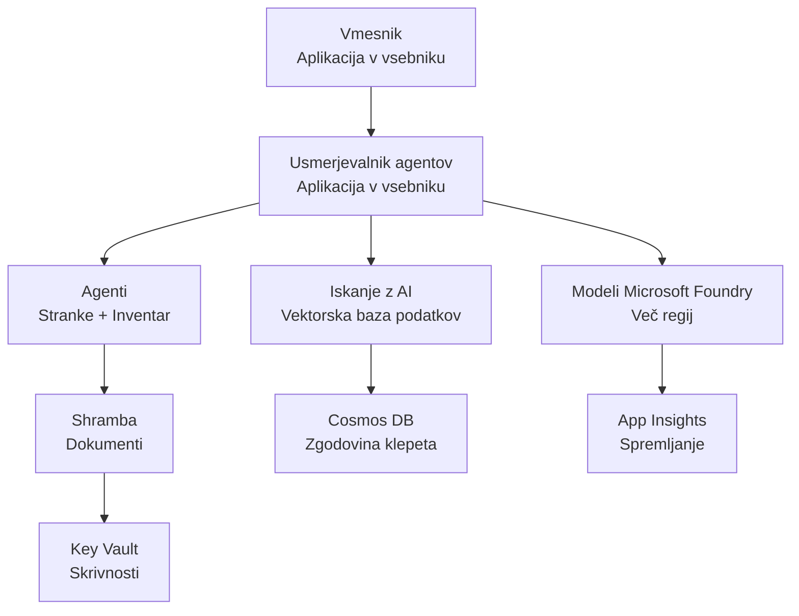

# Retail Multi-Agent Solution - Infrastructure Template

**Chapter 5: Production Deployment Package**
- **📚 Course Home**: [AZD za začetnike](../../README.md)
- **📖 Related Chapter**: [Poglavje 5: Večagentne AI rešitve](../../README.md#-chapter-5-multi-agent-ai-solutions-advanced)
- **📝 Scenario Guide**: [Celotna arhitektura](../retail-scenario.md)
- **🎯 Quick Deploy**: [Namestitev z enim klikom](#-quick-deployment)

> **⚠️ SAMO PREDLOG INFRASTRUKTURE**  
> Ta ARM predloga namesti **Azure vire** za sistem z več agenti.  
>  
> **Kaj se namesti (15-25 minut):**
> - ✅ Microsoft Foundry Models (gpt-4.1, gpt-4.1-mini, embeddings v 3 regijah)
> - ✅ AI Search storitev (prazna, pripravljena za ustvarjanje indeksov)
> - ✅ Container Apps (nadomestne slike, pripravljene za vašo kodo)
> - ✅ Storage, Cosmos DB, Key Vault, Application Insights
>  
> **Kaj NI vključeno (zahteva razvoj):**
> - ❌ Koda agentov (Customer Agent, Inventory Agent)
> - ❌ Logika usmerjanja in API končne točke
> - ❌ Frontend klepetalni vmesnik
> - ❌ Sheme indeksov iskanja in podatkovni pipeline-i
> - ❌ **Ocena potrebnega razvojnega časa: 80-120 ur**
>  
> **Uporabite to predlogo, če:**
> - ✅ Želite pripraviti Azure infrastrukturo za projekt z več agenti
> - ✅ Nameravate razvijati implementacijo agentov ločeno
> - ✅ Potrebujete proizvodno pripravljen osnovni nivo infrastrukture
>  
> **Ne uporabljajte, če:**
> - ❌ Pričakujete takoj delujoč večagentni demo
> - ❌ Iščete popolne primere aplikacijske kode

## Overview

This directory contains a comprehensive Azure Resource Manager (ARM) template for deploying the **infrastructure foundation** of a multi-agent customer support system. The template provisions all necessary Azure services, properly configured and interconnected, ready for your application development.

**After deployment, you'll have:** Production-ready Azure infrastructure  
**To complete the system, you need:** Agent code, frontend UI, and data configuration (see [Architecture Guide](../retail-scenario.md))

## 🎯 What Gets Deployed

### Core Infrastructure (Status After Deployment)

✅ **Microsoft Foundry Models Services** (Ready for API calls)
  - Primary region: gpt-4.1 deployment (20K TPM capacity)
  - Secondary region: gpt-4.1-mini deployment (10K TPM capacity)
  - Tertiary region: Text embeddings model (30K TPM capacity)
  - Evaluation region: gpt-4.1 grader model (15K TPM capacity)
  - **Status:** Fully functional - can make API calls immediately

✅ **Azure AI Search** (Empty - ready for configuration)
  - Vector search capabilities enabled
  - Standard tier with 1 partition, 1 replica
  - **Status:** Service running, but requires index creation
  - **Action needed:** Create search index with your schema

✅ **Azure Storage Account** (Empty - ready for uploads)
  - Blob containers: `documents`, `uploads`
  - Secure configuration (HTTPS-only, no public access)
  - **Status:** Ready to receive files
  - **Action needed:** Upload your product data and documents

⚠️ **Container Apps Environment** (Placeholder images deployed)
  - Agent router app (nginx default image)
  - Frontend app (nginx default image)
  - Auto-scaling configured (0-10 instances)
  - **Status:** Running placeholder containers
  - **Action needed:** Build and deploy your agent applications

✅ **Azure Cosmos DB** (Empty - ready for data)
  - Database and container pre-configured
  - Optimized for low-latency operations
  - TTL enabled for automatic cleanup
  - **Status:** Ready to store chat history

✅ **Azure Key Vault** (Optional - ready for secrets)
  - Soft delete enabled
  - RBAC configured for managed identities
  - **Status:** Ready to store API keys and connection strings

✅ **Application Insights** (Optional - monitoring active)
  - Connected to Log Analytics workspace
  - Custom metrics and alerts configured
  - **Status:** Ready to receive telemetry from your apps

✅ **Document Intelligence** (Ready for API calls)
  - S0 tier for production workloads
  - **Status:** Ready to process uploaded documents

✅ **Bing Search API** (Ready for API calls)
  - S1 tier for real-time searches
  - **Status:** Ready for web search queries

### Deployment Modes

| Mode | OpenAI Capacity | Container Instances | Search Tier | Storage Redundancy | Best For |
|------|-----------------|---------------------|-------------|-------------------|----------|
| **Minimal** | 10K-20K TPM | 0-2 replicas | Basic | LRS (Local) | Dev/test, učenje, dokaz koncepta |
| **Standard** | 30K-60K TPM | 2-5 replicas | Standard | ZRS (Zone) | Proizvodnja, zmerne obremenitve (<10K uporabnikov) |
| **Premium** | 80K-150K TPM | 5-10 replicas, zone-redundant | Premium | GRS (Geo) | Podjetja, velike obremenitve (>10K uporabnikov), 99.99% SLA |

**Cost Impact:**
- **Minimal → Standard:** ~4x povečanje stroškov ($100-370/mo → $420-1,450/mo)
- **Standard → Premium:** ~3x povečanje stroškov ($420-1,450/mo → $1,150-3,500/mo)
- **Izberite glede na:** Pričakovano obremenitev, zahteve SLA, proračunske omejitve

**Capacity Planning:**
- **TPM (Tokens Per Minute):** Skupno čez vse nameščene modele
- **Container Instances:** Razpon avto-skaliranja (min-max replik)
- **Search Tier:** Vpliva na zmogljivost poizvedb in omejitve velikosti indeksov

## 📋 Prerequisites

### Required Tools
1. **Azure CLI** (version 2.50.0 or higher)
   ```bash
   az --version  # Preveri različico
   az login      # Avtenticiraj
   ```

2. **Active Azure subscription** with Owner or Contributor access
   ```bash
   az account show  # Preveri naročnino
   ```

### Required Azure Quotas

Before deployment, verify sufficient quotas in your target regions:

```bash
# Preverite razpoložljivost modelov Microsoft Foundry v vaši regiji
az cognitiveservices account list-skus \
  --kind OpenAI \
  --location eastus2

# Preverite kvoto OpenAI (primer za gpt-4.1)
az cognitiveservices usage list \
  --location eastus2 \
  --query "[?name.value=='OpenAI.Standard.gpt-4.1']"

# Preverite kvoto za Container Apps
az provider show \
  --namespace Microsoft.App \
  --query "resourceTypes[?resourceType=='managedEnvironments'].locations"
```

**Minimum Required Quotas:**
- **Microsoft Foundry Models:** 3-4 model deployments across regions
  - gpt-4.1: 20K TPM (Tokens Per Minute)
  - gpt-4.1-mini: 10K TPM
  - text-embedding-ada-002: 30K TPM
  - **Note:** gpt-4.1 may have waitlist in some regions - check [model availability](https://learn.microsoft.com/azure/ai-services/openai/concepts/models)
- **Container Apps:** Managed environment + 2-10 container instances
- **AI Search:** Standard tier (Basic insufficient for vector search)
- **Cosmos DB:** Standard provisioned throughput

**If quota insufficient:**
1. Go to Azure Portal → Quotas → Request increase
2. Or use Azure CLI:
   ```bash
   az support tickets create \
     --ticket-name "OpenAI-Quota-Increase" \
     --severity "minimal" \
     --description "Request quota increase for Microsoft Foundry Models gpt-4.1 in eastus2"
   ```
3. Consider alternative regions with availability

## 🚀 Quick Deployment

### Option 1: Using Azure CLI

```bash
# Klonirajte ali prenesite predloge datotek
git clone <repository-url>
cd examples/retail-multiagent-arm-template

# Naredite skripto za nameščanje izvršljivo
chmod +x deploy.sh

# Izvedite nameščanje s privzetimi nastavitvami
./deploy.sh -g myResourceGroup

# Izvedite nameščanje v produkcijo z premium funkcijami
./deploy.sh -g myProdRG -e prod -m premium -l eastus2
```

### Option 2: Using Azure Portal

[](https://portal.azure.com/#create/Microsoft.Template/uri/https%3A%2F%2Fraw.githubusercontent.com%2Fmicrosoft%2Fazd-for-beginners%2Fmain%2Fexamples%2Fretail-multiagent-arm-template%2Fazuredeploy.json)

### Option 3: Using Azure CLI directly

```bash
# Ustvari skupino virov
az group create --name myResourceGroup --location eastus2

# Razporedi predlogo
az deployment group create \
  --resource-group myResourceGroup \
  --template-file azuredeploy.json \
  --parameters azuredeploy.parameters.json
```

## ⏱️ Deployment Timeline

### What to Expect

| Phase | Duration | What Happens |
|-------|----------|--------------||
| **Template Validation** | 30-60 seconds | Azure validates ARM template syntax and parameters |
| **Resource Group Setup** | 10-20 seconds | Creates resource group (if needed) |
| **OpenAI Provisioning** | 5-8 minutes | Creates 3-4 OpenAI accounts and deploys models |
| **Container Apps** | 3-5 minutes | Creates environment and deploys placeholder containers |
| **Search & Storage** | 2-4 minutes | Provisions AI Search service and storage accounts |
| **Cosmos DB** | 2-3 minutes | Creates database and configures containers |
| **Monitoring Setup** | 2-3 minutes | Sets up Application Insights and Log Analytics |
| **RBAC Configuration** | 1-2 minutes | Configures managed identities and permissions |
| **Total Deployment** | **15-25 minutes** | Complete infrastructure ready |

**After Deployment:**
- ✅ **Infrastructure Ready:** All Azure services provisioned and running
- ⏱️ **Application Development:** 80-120 hours (your responsibility)
- ⏱️ **Index Configuration:** 15-30 minutes (requires your schema)
- ⏱️ **Data Upload:** Varies by dataset size
- ⏱️ **Testing & Validation:** 2-4 hours

---

## ✅ Verify Deployment Success

### Step 1: Check Resource Provisioning (2 minutes)

```bash
# Preverite, ali so bili vsi viri uspešno razporejeni
az resource list \
  --resource-group myResourceGroup \
  --query "[?provisioningState!='Succeeded'].{Name:name, Status:provisioningState, Type:type}" \
  --output table
```

**Expected:** Empty table (all resources show "Succeeded" status)

### Step 2: Verify Microsoft Foundry Models Deployments (3 minutes)

```bash
# Naštej vse OpenAI račune
az cognitiveservices account list \
  --resource-group myResourceGroup \
  --query "[?kind=='OpenAI'].{Name:name, Location:location, Status:properties.provisioningState}" \
  --output table

# Preveri nameščanja modelov za primarno regijo
OPENAI_NAME=$(az cognitiveservices account list \
  --resource-group myResourceGroup \
  --query "[?kind=='OpenAI'] | [0].name" -o tsv)

az cognitiveservices account deployment list \
  --name $OPENAI_NAME \
  --resource-group myResourceGroup \
  --output table
```

**Expected:** 
- 3-4 OpenAI accounts (primary, secondary, tertiary, evaluation regions)
- 1-2 model deployments per account (gpt-4.1, gpt-4.1-mini, text-embedding-ada-002)

### Step 3: Test Infrastructure Endpoints (5 minutes)

```bash
# Pridobi URL-je kontejnerske aplikacije
az containerapp list \
  --resource-group myResourceGroup \
  --query "[].{Name:name, URL:properties.configuration.ingress.fqdn, Status:properties.runningStatus}" \
  --output table

# Preizkusi končno točko usmerjevalnika (odzvala se bo nadomestna slika)
ROUTER_URL=$(az containerapp show \
  --name retail-router \
  --resource-group myResourceGroup \
  --query "properties.configuration.ingress.fqdn" -o tsv)

echo "Testing: https://$ROUTER_URL"
curl -I https://$ROUTER_URL || echo "Container running (placeholder image - expected)"
```

**Expected:** 
- Container Apps show "Running" status
- Placeholder nginx responds with HTTP 200 or 404 (no application code yet)

### Step 4: Verify Microsoft Foundry Models API Access (3 minutes)

```bash
# Pridobi OpenAI končno točko in ključ
OPENAI_ENDPOINT=$(az cognitiveservices account show \
  --name $OPENAI_NAME \
  --resource-group myResourceGroup \
  --query "properties.endpoint" -o tsv)

OPENAI_KEY=$(az cognitiveservices account keys list \
  --name $OPENAI_NAME \
  --resource-group myResourceGroup \
  --query "key1" -o tsv)

# Preizkusi namestitev gpt-4.1
curl "${OPENAI_ENDPOINT}openai/deployments/gpt-4.1/chat/completions?api-version=2024-08-01-preview" \
  -H "Content-Type: application/json" \
  -H "api-key: $OPENAI_KEY" \
  -d '{
    "messages": [{"role": "user", "content": "Say hello"}],
    "max_tokens": 10
  }'
```

**Expected:** JSON response with chat completion (confirms OpenAI is functional)

### What's Working vs. What's Not

**✅ Working After Deployment:**
- Microsoft Foundry Models models deployed and accepting API calls
- AI Search service running (empty, no indexes yet)
- Container Apps running (placeholder nginx images)
- Storage accounts accessible and ready for uploads
- Cosmos DB ready for data operations
- Application Insights collecting infrastructure telemetry
- Key Vault ready for secret storage

**❌ Not Working Yet (Requires Development):**
- Agent endpoints (no application code deployed)
- Chat functionality (requires frontend + backend implementation)
- Search queries (no search index created yet)
- Document processing pipeline (no data uploaded)
- Custom telemetry (requires application instrumentation)

**Next Steps:** See [Post-Deployment Configuration](#-post-deployment-next-steps) to develop and deploy your application

---

## ⚙️ Configuration Options

### Template Parameters

| Parameter | Type | Default | Description |
|-----------|------|---------|-------------|
| `projectName` | string | "retail" | Prefix for all resource names |
| `location` | string | Resource group location | Primary deployment region |
| `secondaryLocation` | string | "westus2" | Secondary region for multi-region deployment |
| `tertiaryLocation` | string | "francecentral" | Region for embeddings model |
| `environmentName` | string | "dev" | Environment designation (dev/staging/prod) |
| `deploymentMode` | string | "standard" | Deployment configuration (minimal/standard/premium) |
| `enableMultiRegion` | bool | true | Enable multi-region deployment |
| `enableMonitoring` | bool | true | Enable Application Insights and logging |
| `enableSecurity` | bool | true | Enable Key Vault and enhanced security |

### Customizing Parameters

Edit `azuredeploy.parameters.json`:

```json
{
  "$schema": "https://schema.management.azure.com/schemas/2019-04-01/deploymentParameters.json#",
  "contentVersion": "1.0.0.0",
  "parameters": {
    "projectName": {
      "value": "mycompany"
    },
    "environmentName": {
      "value": "prod"
    },
    "deploymentMode": {
      "value": "premium"
    },
    "location": {
      "value": "eastus2"
    }
  }
}
```

## 🏗️ Architecture Overview


## 📖 Deployment Script Usage

The `deploy.sh` script provides an interactive deployment experience:

```bash
# Prikaži pomoč
./deploy.sh --help

# Osnovna namestitev
./deploy.sh -g myResourceGroup

# Napredna namestitev z lastnimi nastavitvami
./deploy.sh \
  -g myProductionRG \
  -p companyname \
  -e prod \
  -m premium \
  -l eastus2

# Razvojna namestitev brez večregijske podpore
./deploy.sh \
  -g myDevRG \
  -e dev \
  -m minimal \
  --no-multi-region \
  --no-security
```

### Script Features

- ✅ **Prerequisites validation** (Azure CLI, login status, template files)
- ✅ **Resource group management** (creates if doesn't exist)
- ✅ **Template validation** before deployment
- ✅ **Progress monitoring** with colored output
- ✅ **Deployment outputs** display
- ✅ **Post-deployment guidance**

## 📊 Monitoring Deployment

### Check Deployment Status

```bash
# Prikaži implementacije
az deployment group list --resource-group myResourceGroup --output table

# Prikaži podrobnosti implementacije
az deployment group show \
  --resource-group myResourceGroup \
  --name retail-deployment-YYYYMMDD-HHMMSS

# Spremljaj napredek implementacije
az deployment group create \
  --resource-group myResourceGroup \
  --template-file azuredeploy.json \
  --parameters azuredeploy.parameters.json \
  --verbose
```

### Deployment Outputs

After successful deployment, the following outputs are available:

- **Frontend URL**: Public endpoint for the web interface
- **Router URL**: API endpoint for the agent router
- **OpenAI Endpoints**: Primary and secondary OpenAI service endpoints
- **Search Service**: Azure AI Search service endpoint
- **Storage Account**: Name of the storage account for documents
- **Key Vault**: Name of the Key Vault (if enabled)
- **Application Insights**: Name of the monitoring service (if enabled)

## 🔧 Post-Deployment: Next Steps
> **📝 Important:** Infrastructure is deployed, but you need to develop and deploy application code.

### Phase 1: Develop Agent Applications (Your Responsibility)

The ARM template creates **empty Container Apps** with placeholder nginx images. You must:

**Required Development:**
1. **Agent Implementation** (30-40 hours)
   - Customer service agent with gpt-4.1 integration
   - Inventory agent with gpt-4.1-mini integration
   - Agent routing logic

2. **Frontend Development** (20-30 hours)
   - Chat interface UI (React/Vue/Angular)
   - File upload functionality
   - Response rendering and formatting

3. **Backend Services** (12-16 hours)
   - FastAPI or Express router
   - Authentication middleware
   - Telemetry integration

**See:** [Architecture Guide](../retail-scenario.md) for detailed implementation patterns and code examples

### Phase 2: Configure AI Search Index (15-30 minutes)

Create a search index matching your data model:

```bash
# Pridobite podrobnosti o iskalni storitvi
SEARCH_NAME=$(az search service list \
  --resource-group myResourceGroup \
  --query "[0].name" -o tsv)

SEARCH_KEY=$(az search admin-key show \
  --service-name $SEARCH_NAME \
  --resource-group myResourceGroup \
  --query "primaryKey" -o tsv)

# Ustvarite indeks z vašo shemo (primer)
curl -X POST "https://${SEARCH_NAME}.search.windows.net/indexes?api-version=2023-11-01" \
  -H "Content-Type: application/json" \
  -H "api-key: ${SEARCH_KEY}" \
  -d '{
    "name": "products",
    "fields": [
      {"name": "id", "type": "Edm.String", "key": true},
      {"name": "title", "type": "Edm.String", "searchable": true},
      {"name": "content", "type": "Edm.String", "searchable": true},
      {"name": "category", "type": "Edm.String", "filterable": true},
      {"name": "content_vector", "type": "Collection(Edm.Single)", 
       "searchable": true, "dimensions": 1536, "vectorSearchProfile": "default"}
    ],
    "vectorSearch": {
      "algorithms": [{"name": "default", "kind": "hnsw"}],
      "profiles": [{"name": "default", "algorithm": "default"}]
    }
  }'
```

**Resources:**
- [AI Search Index Schema Design](https://learn.microsoft.com/azure/search/search-what-is-an-index)
- [Vector Search Configuration](https://learn.microsoft.com/azure/search/vector-search-how-to-create-index)

### Phase 3: Upload Your Data (Time varies)

Once you have product data and documents:

```bash
# Pridobite podatke o računu za shranjevanje
STORAGE_NAME=$(az storage account list \
  --resource-group myResourceGroup \
  --query "[0].name" -o tsv)

STORAGE_KEY=$(az storage account keys list \
  --account-name $STORAGE_NAME \
  --resource-group myResourceGroup \
  --query "[0].value" -o tsv)

# Naložite svoje dokumente
az storage blob upload-batch \
  --destination documents \
  --source /path/to/your/product/docs \
  --account-name $STORAGE_NAME \
  --account-key $STORAGE_KEY

# Primer: Naložite posamezno datoteko
az storage blob upload \
  --container-name documents \
  --name "product-manual.pdf" \
  --file /path/to/product-manual.pdf \
  --account-name $STORAGE_NAME \
  --account-key $STORAGE_KEY
```

### Phase 4: Build and Deploy Your Applications (8-12 hours)

Once you've developed your agent code:

```bash
# 1. Ustvarite Azure Container Registry (če je potrebno)
az acr create \
  --name myregistry \
  --resource-group myResourceGroup \
  --sku Basic

# 2. Izgradite in potisnite sliko agent-routerja
docker build -t myregistry.azurecr.io/agent-router:v1 /path/to/your/router/code
az acr login --name myregistry
docker push myregistry.azurecr.io/agent-router:v1

# 3. Izgradite in potisnite sliko frontenda
docker build -t myregistry.azurecr.io/frontend:v1 /path/to/your/frontend/code
docker push myregistry.azurecr.io/frontend:v1

# 4. Posodobite Container Apps z vašimi slikami
az containerapp update \
  --name retail-router \
  --resource-group myResourceGroup \
  --image myregistry.azurecr.io/agent-router:v1

az containerapp update \
  --name retail-frontend \
  --resource-group myResourceGroup \
  --image myregistry.azurecr.io/frontend:v1

# 5. Konfigurirajte spremenljivke okolja
az containerapp update \
  --name retail-router \
  --resource-group myResourceGroup \
  --set-env-vars \
    OPENAI_ENDPOINT=secretref:openai-endpoint \
    OPENAI_KEY=secretref:openai-key \
    SEARCH_ENDPOINT=secretref:search-endpoint \
    SEARCH_KEY=secretref:search-key
```

### Phase 5: Test Your Application (2-4 hours)

```bash
# Pridobite URL vaše aplikacije
ROUTER_URL=$(az containerapp show \
  --name retail-router \
  --resource-group myResourceGroup \
  --query "properties.configuration.ingress.fqdn" -o tsv)

# Preizkusite končno točko agenta (ko bo vaša koda nameščena)
curl -X POST "https://${ROUTER_URL}/chat" \
  -H "Content-Type: application/json" \
  -d '{
    "message": "Hello, I need help with my order",
    "agent": "customer"
  }'

# Preverite dnevnike aplikacije
az containerapp logs show \
  --name retail-router \
  --resource-group myResourceGroup \
  --follow
```

### Implementation Resources

**Architecture & Design:**
- 📖 [Complete Architecture Guide](../retail-scenario.md) - Detailed implementation patterns
- 📖 [Multi-Agent Design Patterns](https://learn.microsoft.com/azure/architecture/ai-ml/guide/multi-agent-systems)

**Code Examples:**
- 🔗 [Microsoft Foundry Models Chat Sample](https://github.com/Azure-Samples/azure-search-openai-demo) - RAG pattern
- 🔗 [Semantic Kernel](https://github.com/microsoft/semantic-kernel) - Agent framework (C#)
- 🔗 [LangChain Azure](https://github.com/langchain-ai/langchain) - Agent orchestration (Python)
- 🔗 [AutoGen](https://github.com/microsoft/autogen) - Multi-agent conversations

**Estimated Total Effort:**
- Infrastructure deployment: 15-25 minutes (✅ Complete)
- Application development: 80-120 hours (🔨 Your work)
- Testing and optimization: 15-25 hours (🔨 Your work)

## 🛠️ Troubleshooting

### Common Issues

#### 1. Microsoft Foundry Models Quota Exceeded

```bash
# Preveri trenutno uporabo kvote
az cognitiveservices usage list --location eastus2

# Zahtevaj povečanje kvote
az support tickets create \
  --ticket-name "OpenAI-Quota-Increase" \
  --severity "minimal" \
  --description "Request quota increase for Microsoft Foundry Models in region X"
```

#### 2. Container Apps Deployment Failed

```bash
# Preveri dnevnike aplikacije kontejnerja
az containerapp logs show \
  --name retail-router \
  --resource-group myResourceGroup \
  --follow

# Ponovno zaženi kontejnersko aplikacijo
az containerapp revision restart \
  --name retail-router \
  --resource-group myResourceGroup
```

#### 3. Search Service Initialization

```bash
# Preveri stanje storitve iskanja
az search service show \
  --name <search-service-name> \
  --resource-group myResourceGroup

# Preizkusi povezljivost storitve iskanja
curl -X GET "https://<search-service-name>.search.windows.net/indexes?api-version=2023-11-01" \
  -H "api-key: <search-admin-key>"
```

### Deployment Validation

```bash
# Preverite, ali so vsi viri ustvarjeni
az resource list \
  --resource-group myResourceGroup \
  --output table

# Preverite stanje vira
az resource list \
  --resource-group myResourceGroup \
  --query "[?provisioningState!='Succeeded'].{Name:name, Status:provisioningState, Type:type}" \
  --output table
```

## 🔐 Security Considerations

### Key Management
- All secrets are stored in Azure Key Vault (when enabled)
- Container apps use managed identity for authentication
- Storage accounts have secure defaults (HTTPS only, no public blob access)

### Network Security
- Container apps use internal networking where possible
- Search service configured with private endpoints option
- Cosmos DB configured with minimal necessary permissions

### RBAC Configuration
```bash
# Dodelite potrebne vloge za upravljano identiteto
az role assignment create \
  --assignee <container-app-managed-identity> \
  --role "Cognitive Services OpenAI User" \
  --scope <openai-resource-id>
```

## 💰 Cost Optimization

### Cost Estimates (Monthly, USD)

| Mode | OpenAI | Container Apps | Search | Storage | Total Est. |
|------|--------|----------------|--------|---------|------------|
| Minimal | $50-200 | $20-50 | $25-100 | $5-20 | $100-370 |
| Standard | $200-800 | $100-300 | $100-300 | $20-50 | $420-1450 |
| Premium | $500-2000 | $300-800 | $300-600 | $50-100 | $1150-3500 |

### Cost Monitoring

```bash
# Nastavite opozorila za proračun
az consumption budget create \
  --account-name <subscription-id> \
  --budget-name "retail-budget" \
  --amount 500 \
  --time-grain Monthly \
  --start-date 2024-01-01 \
  --end-date 2024-12-31
```

## 🔄 Updates and Maintenance

### Template Updates
- Version control the ARM template files
- Test changes in development environment first
- Use incremental deployment mode for updates

### Resource Updates
```bash
# Posodobi z novimi parametri
az deployment group create \
  --resource-group myResourceGroup \
  --template-file azuredeploy.json \
  --parameters azuredeploy.parameters.json \
  --mode Incremental
```

### Backup and Recovery
- Cosmos DB automatic backup enabled
- Key Vault soft delete enabled
- Container app revisions maintained for rollback

## 📞 Support

- **Template Issues**: [GitHub Issues](https://github.com/microsoft/azd-for-beginners/issues)
- **Azure Support**: [Azure Support Portal](https://portal.azure.com/#blade/Microsoft_Azure_Support/HelpAndSupportBlade)
- **Community**: [Azure AI Discord](https://discord.gg/microsoft-azure)

---

**⚡ Ready to deploy your multi-agent solution?**

Start with: `./deploy.sh -g myResourceGroup`

---

<!-- CO-OP TRANSLATOR DISCLAIMER START -->
**Izjava o omejitvi odgovornosti**:
Ta dokument je bil preveden z uporabo AI prevajalske storitve [Co-op Translator](https://github.com/Azure/co-op-translator). Čeprav si prizadevamo za natančnost, vas prosimo, da upoštevate, da avtomatizirani prevodi lahko vsebujejo napake ali netočnosti. Izvirni dokument v izvorni jezikovni različici velja za uradni vir. Za pomembne informacije priporočamo strokovni človeški prevod. Za morebitna nesporazume ali napačne razlage, ki izhajajo iz uporabe tega prevoda, ne odgovarjamo.
<!-- CO-OP TRANSLATOR DISCLAIMER END -->