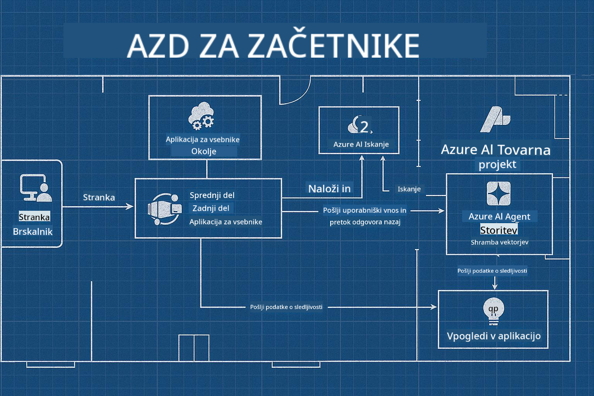

<!--
CO_OP_TRANSLATOR_METADATA:
{
  "original_hash": "245d24997bbcf2bae93bb2a503845d37",
  "translation_date": "2025-09-23T12:07:51+00:00",
  "source_file": "workshop/README.md",
  "language_code": "sl"
}
-->
# AZD za delavnico AI razvijalcev

## AZD predloge

Izdelava rešitev za aplikacije umetne inteligence na ravni podjetja za vaš specifični scenarij je zelo podobna gradnji lastnega doma. Lahko ga sami oblikujete, gradite opeko za opeko in prevzamete odgovornost za zagotavljanje skladnosti z vsemi smernicami upravljanja in razvoja.

**ALI ....**

Lahko sodelujete z arhitektom, ki vam lahko ponudi _načrt_ za začetni dom, nato pa z vami sodeluje pri _prilagoditvi_, da ustreza vašim potrebam. To vam omogoča, da se osredotočite na tisto, kar naredi **vaš dom** poseben, medtem ko za osnovno napeljavo, vodovod in druge odvisnosti poskrbijo strokovnjaki.

**To je pristop za [AI App Templates](https://ai.azure.com/templates)** - serija načrtov za gradnjo različnih vrst "domov" aplikacij umetne inteligence, odvisno od vaših osnovnih potreb in odvisnosti.

## Prilagoditev predlog

Predloge so zasnovane za delo z [Azure AI Foundry](https://ai.azure.com). Ta platforma je kot vaš "gradbeni izvajalec" z dostopom do vseh virov, orodij in strokovnega znanja, ki jih potrebujete za izvedbo projekta!

Vse, kar morate storiti, je izbrati [vaše začetne predloge](https://learn.microsoft.com/en-us/azure/ai-foundry/how-to/develop/ai-template-get-started). Na primer, osredotočili se bomo na predlogo _Get Started with AI Agents_, da zgradimo "Agentic AI Home", ki vključuje funkcije, kot so AI Search, Red Teaming, Evaluations, Tracing, Monitoring in še več!



Vse, kar potrebujete, je rezervirati čas z arhitektom, ki vas bo vodil skozi proces prilagoditve. [GitHub Copilot for Azure](https://learn.microsoft.com/en-us/azure/developer/github-copilot-azure/get-started) je lahko vaš vodič. Preprosto "pogovarjajte se z njim", da:

- Spoznate funkcije Azure v vaši predlogi
- Namestite Azure vire
- Pridobite informacije o vaši namestitvi
- Diagnosticirate in odpravite težave!

Na tej delavnici se bomo naučili, kako _razstaviti_ obstoječo predlogo (da razumemo, kaj ponuja), nato pa jo _prilagoditi_ (da izpolni naše zahteve) - korak za korakom.

AI predloge **poskrbijo, da deluje** - z zaključkom delavnice se boste naučili, kako **jo narediti svojo**

----

**Navigacija po delavnici**
- **📚 Domača stran tečaja**: [AZD za začetnike](../README.md)
- **📖 Povezana poglavja**: Zajema [Poglavje 1](../README.md#-chapter-1-foundation--quick-start), [Poglavje 2](../README.md#-chapter-2-ai-first-development-recommended-for-ai-developers) in [Poglavje 5](../README.md#-chapter-5-multi-agent-ai-solutions-advanced)
- **🛠️ Praktični laboratorij**: [AI Workshop Lab](../docs/ai-foundry/ai-workshop-lab.md)
- **🚀 Naslednji koraki**: [Moduli laboratorija delavnice](../../../workshop)

Dobrodošli na praktični delavnici za učenje Azure Developer CLI (AZD) s poudarkom na uvajanju aplikacij umetne inteligence. Ta delavnica je zasnovana tako, da vas popelje od osnov AZD do uvajanja produkcijsko pripravljenih rešitev umetne inteligence.

## Pregled delavnice

**Trajanje:** 2-3 ure  
**Raven:** Začetnik do srednje napreden  
**Predpogoji:** Osnovno znanje o Azure, orodjih ukazne vrstice in konceptih umetne inteligence

### Kaj se boste naučili

- **Osnove AZD**: Razumevanje infrastrukture kot kode z AZD
- 🤖 **Integracija AI storitev**: Uvajanje Azure OpenAI, AI Search in drugih AI storitev
- **Namestitev vsebnikov**: Uporaba Azure Container Apps za aplikacije umetne inteligence
- **Najboljše prakse varnosti**: Uporaba upravljane identitete in varnih konfiguracij
- **Nadzor in opazovanje**: Nastavitev Application Insights za delovne obremenitve umetne inteligence
- **Produkcijski vzorci**: Strategije uvajanja na ravni podjetja

## Struktura delavnice

### Modul 1: Osnove AZD (30 minut)
- Namestitev in konfiguracija AZD
- Razumevanje strukture projekta AZD
- Vaša prva namestitev z AZD
- **Laboratorij**: Namestitev preproste spletne aplikacije

### Modul 2: Integracija Azure OpenAI (45 minut)
- Nastavitev virov Azure OpenAI
- Strategije uvajanja modelov
- Konfiguracija dostopa do API-ja in avtentikacije
- **Laboratorij**: Namestitev aplikacije za klepet z GPT-4

### Modul 3: RAG aplikacije (45 minut)
- Integracija Azure AI Search
- Obdelava dokumentov z Azure Document Intelligence
- Vektorske vdelave in semantično iskanje
- **Laboratorij**: Izdelava sistema za vprašanja in odgovore na podlagi dokumentov

### Modul 4: Produkcijsko uvajanje (30 minut)
- Konfiguracija aplikacij vsebnikov
- Optimizacija zmogljivosti in skaliranje
- Nadzor in beleženje
- **Laboratorij**: Uvajanje v produkcijo z opazovanjem

### Modul 5: Napredni vzorci (15 minut)
- Uvajanje v več okoljih
- Integracija CI/CD
- Strategije optimizacije stroškov
- **Zaključek**: Kontrolni seznam za pripravljenost na produkcijo

## Predpogoji

### Zahtevana orodja

Prosimo, namestite ta orodja pred delavnico:

```bash
# Azure Developer CLI
curl -fsSL https://aka.ms/install-azd.sh | bash

# Azure CLI
curl -sL https://aka.ms/InstallAzureCLIDeb | sudo bash

# Git
sudo apt-get install git

# Docker
curl -fsSL https://get.docker.com -o get-docker.sh
sudo sh get-docker.sh

# Python 3.10+
sudo apt-get install python3.10 python3.10-venv python3-pip
```

### Nastavitev Azure računa

1. **Azure naročnina**: [Prijavite se brezplačno](https://azure.microsoft.com/free/)
2. **Dostop do Azure OpenAI**: [Zahtevajte dostop](https://aka.ms/oai/access)
3. **Zahtevana dovoljenja**:
   - Vloga Contributor na naročnini ali skupini virov
   - User Access Administrator (za dodelitve RBAC)

### Preverite predpogoje

Za preverjanje vaše nastavitve zaženite ta skript:

```bash
#!/bin/bash
echo "Verifying workshop prerequisites..."

# Check AZD installation
if command -v azd &> /dev/null; then
    echo "✅ Azure Developer CLI: $(azd --version)"
else
    echo "❌ Azure Developer CLI not found"
fi

# Check Azure CLI
if command -v az &> /dev/null; then
    echo "✅ Azure CLI: $(az --version | head -n1)"
else
    echo "❌ Azure CLI not found"
fi

# Check Docker
if command -v docker &> /dev/null; then
    echo "✅ Docker: $(docker --version)"
else
    echo "❌ Docker not found"
fi

# Check Python
if command -v python3 &> /dev/null; then
    echo "✅ Python: $(python3 --version)"
else
    echo "❌ Python 3 not found"
fi

# Check Azure login
if az account show &> /dev/null; then
    echo "✅ Azure: Logged in as $(az account show --query user.name -o tsv)"
else
    echo "❌ Azure: Not logged in (run 'az login')"
fi

echo "Setup verification complete!"
```

## Gradivo delavnice

### Praktične vaje

Vsak modul vključuje praktične laboratorije z začetno kodo in navodili korak za korakom:

- **[lab-1-azd-basics/](../../../workshop/lab-1-azd-basics)** - Vaša prva namestitev z AZD
- **[lab-2-openai-chat/](../../../workshop/lab-2-openai-chat)** - Aplikacija za klepet z Azure OpenAI
- **[lab-3-rag-search/](../../../workshop/lab-3-rag-search)** - RAG aplikacija z AI Search
- **[lab-4-production/](../../../workshop/lab-4-production)** - Produkcijski vzorci uvajanja
- **[lab-5-advanced/](../../../workshop/lab-5-advanced)** - Napredni scenariji uvajanja

### Referenčno gradivo

- **[Vodnik za integracijo AI Foundry](../docs/ai-foundry/azure-ai-foundry-integration.md)** - Celoviti vzorci integracije
- **[Vodnik za uvajanje AI modelov](../docs/ai-foundry/ai-model-deployment.md)** - Najboljše prakse uvajanja modelov
- **[Produkcijske prakse AI](../docs/ai-foundry/production-ai-practices.md)** - Vzorci uvajanja na ravni podjetja
- **[Vodnik za odpravljanje težav AI](../docs/troubleshooting/ai-troubleshooting.md)** - Pogoste težave in rešitve

### Vzorčne predloge

Predloge za hiter začetek za pogoste scenarije umetne inteligence:

```
workshop/templates/
├── minimal-chat/          # Basic OpenAI chat app
├── rag-application/       # RAG with AI Search
├── multi-model/          # Multiple AI services
└── production-ready/     # Enterprise template
```

## Začetek

### Možnost 1: GitHub Codespaces (Priporočeno)

Najhitrejši način za začetek delavnice:

[](https://github.com/codespaces/new?hide_repo_select=true&ref=main&repo=YOUR_REPO_ID)

### Možnost 2: Lokalni razvoj

1. **Klonirajte repozitorij delavnice:**
```bash
git clone https://github.com/YOUR_ORG/AZD-for-beginners.git
cd AZD-for-beginners/workshop
```

2. **Prijavite se v Azure:**
```bash
az login
azd auth login
```

3. **Začnite z laboratorijem 1:**
```bash
cd lab-1-azd-basics
cat README.md  # Follow the instructions
```

### Možnost 3: Delavnica pod vodstvom inštruktorja

Če se udeležujete seje pod vodstvom inštruktorja:

- 🎥 **Posnetek delavnice**: [Na voljo na zahtevo](https://aka.ms/azd-ai-workshop)
- 💬 **Discord skupnost**: [Pridružite se za podporo v živo](https://aka.ms/foundry/discord)
- **Povratne informacije o delavnici**: [Delite svoje izkušnje](https://aka.ms/azd-workshop-feedback)

## Časovnica delavnice

### Učenje v lastnem tempu (3 ure)

```
⏰ 00:00 - 00:30  Module 1: AZD Foundations
⏰ 00:30 - 01:15  Module 2: Azure OpenAI Integration
⏰ 01:15 - 02:00  Module 3: RAG Applications
⏰ 02:00 - 02:30  Module 4: Production Deployment
⏰ 02:30 - 02:45  Module 5: Advanced Patterns
⏰ 02:45 - 03:00  Q&A and Next Steps
```

### Seja pod vodstvom inštruktorja (2,5 ure)

```
⏰ 00:00 - 00:15  Welcome & Prerequisites Check
⏰ 00:15 - 00:40  Module 1: Live Demo + Lab
⏰ 00:40 - 01:20  Module 2: OpenAI Integration
⏰ 01:20 - 01:30  Break
⏰ 01:30 - 02:10  Module 3: RAG Applications
⏰ 02:10 - 02:30  Module 4: Production Patterns
⏰ 02:30 - 02:45  Module 5: Advanced Topics
⏰ 02:45 - 03:00  Q&A and Resources
```

## Merila uspešnosti

Do konca te delavnice boste lahko:

✅ **Namestili aplikacije umetne inteligence** z uporabo predlog AZD  
✅ **Konfigurirali storitve Azure OpenAI** z ustrezno varnostjo  
✅ **Izdelali RAG aplikacije** z integracijo Azure AI Search  
✅ **Uvedli produkcijske vzorce** za delovne obremenitve umetne inteligence na ravni podjetja  
✅ **Nadzorovali in odpravljali težave** pri uvajanju aplikacij umetne inteligence  
✅ **Uporabili strategije optimizacije stroškov** za delovne obremenitve umetne inteligence  

## Skupnost in podpora

### Med delavnico

- 🙋 **Vprašanja**: Uporabite klepet delavnice ali dvignite roko
- 🐛 **Težave**: Preverite [vodnik za odpravljanje težav](../docs/troubleshooting/ai-troubleshooting.md)
- **Nasveti**: Delite odkritja z drugimi udeleženci

### Po delavnici

- 💬 **Discord**: [Skupnost Azure AI Foundry](https://aka.ms/foundry/discord)
- **GitHub Issues**: [Prijavite težave s predlogami](https://github.com/YOUR_ORG/AZD-for-beginners/issues)
- 📧 **Povratne informacije**: [Obrazec za oceno delavnice](https://aka.ms/azd-workshop-feedback)

## Naslednji koraki

### Nadaljujte z učenjem

1. **Napredni scenariji**: Raziščite [uvajanje v več regijah](../docs/ai-foundry/production-ai-practices.md#multi-region-deployment)
2. **Integracija CI/CD**: Nastavite [delovne tokove GitHub Actions](../docs/deployment/github-actions.md)
3. **Prilagojene predloge**: Ustvarite svoje [predloge AZD](../docs/getting-started/custom-templates.md)

### Uporabite v svojih projektih

1. **Ocena**: Uporabite naš [kontrolni seznam pripravljenosti](./production-readiness-checklist.md)
2. **Predloge**: Začnite z našimi [predlogami, specifičnimi za umetno inteligenco](../../../workshop/templates)
3. **Podpora**: Pridružite se [Discord skupnosti Azure AI Foundry](https://aka.ms/foundry/discord)

### Delite svoj uspeh

- ⭐ **Ocenite repozitorij**, če vam je delavnica pomagala
- 🐦 **Delite na družbenih omrežjih** z #AzureDeveloperCLI #AzureAI
- 📝 **Napišite blog objavo** o svoji poti uvajanja umetne inteligence

---

## Povratne informacije o delavnici

Vaše povratne informacije nam pomagajo izboljšati izkušnjo delavnice:

| Vidik | Ocena (1-5) | Komentarji |
|-------|-------------|------------|
| Kakovost vsebine | ⭐⭐⭐⭐⭐ | |
| Praktični laboratoriji | ⭐⭐⭐⭐⭐ | |
| Dokumentacija | ⭐⭐⭐⭐⭐ | |
| Stopnja težavnosti | ⭐⭐⭐⭐⭐ | |
| Splošna izkušnja | ⭐⭐⭐⭐⭐ | |

**Pošljite povratne informacije**: [Obrazec za oceno delavnice](https://aka.ms/azd-workshop-feedback)

---

**Prejšnje:** [Vodnik za odpravljanje težav AI](../docs/troubleshooting/ai-troubleshooting.md) | **Naslednje:** Začnite z [Laboratorijem 1: Osnove AZD](../../../workshop/lab-1-azd-basics)

**Pripravljeni na začetek gradnje aplikacij umetne inteligence z AZD?**

[Začnite z Laboratorijem 1: Osnove AZD →](./lab-1-azd-basics/README.md)

---

