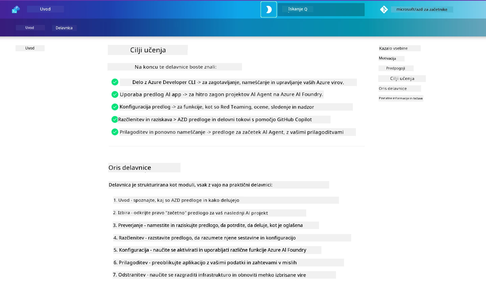

<div align="center">
  <div style="background: linear-gradient(135deg, #0078d4, #106ebe); border-radius: 10px; padding: 20px; margin: 20px 0; box-shadow: 0 4px 15px rgba(0, 120, 212, 0.3); border: 2px solid #005a9e;">
    <h2 style="color: white; margin: 0; font-size: 24px; text-shadow: 1px 1px 2px rgba(0,0,0,0.3);">
      🎯 Delavnica AZD za razvijalce AI
    </h2>
    <p style="color: white; margin: 10px 0 0 0; font-size: 16px; text-shadow: 1px 1px 2px rgba(0,0,0,0.3);">
      <strong>Praktična delavnica za izdelavo AI aplikacij z Azure Developer CLI.</strong><br>
      Dokončajte 7 modulov, da obvladate AZD predloge in delovne tokove za uvajanje AI.
    </p>
    <div style="margin-top: 15px;">
      <span style="background: rgba(255,255,255,0.2); padding: 5px 10px; border-radius: 15px; color: white; font-size: 14px;">
        📅 Zadnja posodobitev: marec 2026
      </span>
    </div>
  </div>
</div>

# AZD za razvijalce AI - delavnica

Dobrodošli na praktični delavnici za učenje Azure Developer CLI (AZD) s poudarkom na uvajanju AI aplikacij. Ta delavnica vam pomaga pridobiti praktično razumevanje AZD predlog v 3 korakih:

1. **Odkritje** - najdite predlogo, ki je prava za vas.
1. **Uvajanje** - uvedite in preverite, da deluje
1. **Prilagoditev** - prilagodite in iterirajte, da bo vaša!

Over the course of this workshop, you will also be introduced to core developer tools and workflows, to help you streamline your end-to-end development journey.

<br/>

## Vodnik v brskalniku

The workshop lessons are in Markdown. You can navigate them directly in GitHub - or launch a browser-based preview as shown in the screenshot below.



To use this option - fork the repository to your profile, and launch GitHub Codespaces. Once the VS Code terminal is active, type this command:

This browser preview works in GitHub Codespaces, dev containers, or a local clone with Python and MkDocs installed.

```bash title="" linenums="0"
mkdocs serve > /dev/null 2>&1 &
```

In a few seconds, you will see a pop-up dialog. Select the option to `Open in browser`. The web-based guide will now open in a new browser tab. Some benefits of this preview:

1. **Built-in search** - find keywords or lessons quickly.
1. **Copy icon** - hover over codeblocks to see this option
1. **Theme toggle** - switch between dark and light themes
1. **Get help** - click the Discord icon in footer to join!

<br/>

## Pregled delavnice

**Trajanje:** 3-4 ure  
**Raven:** Začetna do vmesna  
**Predpogoji:** Poznavanje Azure, konceptov AI, VS Code in orodij ukazne vrstice.

This is a hands-on workshop where you learn by doing. Once you have completed the exercises, we recommend reviewing the AZD For Beginners curriculum to continue your learning journey into Security and Productivity best practices.

| Time| Module  | Objective |
|:---|:---|:---|
| 15 mins | [Introduction](docs/instructions/0-Introduction.md) | Uvod, razumevanje ciljev |
| 30 mins | [Select AI Template](docs/instructions/1-Select-AI-Template.md) | Raziščite možnosti in izberite začetno predlogo | 
| 30 mins | [Validate AI Template](docs/instructions/2-Validate-AI-Template.md) | Uvedite privzeto rešitev v Azure |
| 30 mins | [Deconstruct AI Template](docs/instructions/3-Deconstruct-AI-Template.md) | Raziščite strukturo in konfiguracijo |
| 30 mins | [Configure AI Template](docs/instructions/4-Configure-AI-Template.md) | Aktivirajte in preizkusite razpoložljive funkcije |
| 30 mins | [Customize AI Template](docs/instructions/5-Customize-AI-Template.md) | Prilagodite predlogo svojim potrebam |
| 30 mins | [Teardown Infrastructure](docs/instructions/6-Teardown-Infrastructure.md) | Počistite in sprostite vire |
| 15 mins | [Wrap-Up & Next Steps](docs/instructions/7-Wrap-up.md) | Viri za učenje, izziv delavnice |

<br/>

## Kaj se boste naučili

Think of the AZD Template as a learning sandbox to explore various capabilities and tools for end-to-end development on Microsoft Foundry. By the end of this workshop, you should have an intuitive sense for various tools and concepts in this context.

| Concept  | Objective |
|:---|:---|
| **Azure Developer CLI** | Razumeti ukaze in delovne tokove orodja|
| **AZD Templates**| Razumeti strukturo projekta in konfiguracijo|
| **Azure AI Agent**| Zagotavljanje in uvajanje projekta Microsoft Foundry  |
| **Azure AI Search**| Omogočiti inženiring konteksta z agenti |
| **Observability**| Raziščite sledenje, spremljanje in ocenjevanja |
| **Red Teaming**| Raziščite adverzarialno testiranje in ukrepe omilitve |

<br/>

## Struktura delavnice

The workshop is structured to take you on a journey from template discovery, to deployment, deconstruction, and customization - using the official [Getting Started with AI Agents](https://github.com/Azure-Samples/get-started-with-ai-agents) starter template as the basis.

### [Modul 1: Izberite AI predlogo](docs/instructions/1-Select-AI-Template.md) (30 mins)

- Kaj so AI predloge?
- Kje lahko najdem AI predloge?
- Kako lahko začnem graditi AI agente?
- **Laboratorij**: Hiter začetek v Codespaces ali razvojni posodi

### [Modul 2: Validacija AI predloge](docs/instructions/2-Validate-AI-Template.md) (30 mins)

- Kakšna je arhitektura AI predloge?
- Kakšen je razvojni potek AZD?
- Kako lahko dobim pomoč pri razvoju z AZD?
- **Laboratorij**: Uvedite in validirajte predlogo AI agentov

### [Modul 3: Razstavite AI predlogo](docs/instructions/3-Deconstruct-AI-Template.md) (30 mins)

- Raziščite svoje okolje v `.azure/` 
- Raziščite nastavitve virov v `infra/` 
- Raziščite svojo AZD konfiguracijo v `azure.yaml`s
- **Laboratorij**: Spremenite spremenljivke okolja in ponovno uvedite

### [Modul 4: Konfigurirajte AI predlogo](docs/instructions/4-Configure-AI-Template.md) (30 mins)
- Raziščite: Retrieval Augmented Generation
- Raziščite: Agent Evaluation & Red Teaming
- Raziščite: Sledenje in spremljanje
- **Laboratorij**: Raziščite AI agenta + opazovanje 

### [Modul 5: Prilagodite AI predlogo](docs/instructions/5-Customize-AI-Template.md) (30 mins)
- Določite: PRD z zahtevami scenarija
- Konfigurirajte: spremenljivke okolja za AZD
- Implementirajte: vtičnice življenjskega cikla za dodatna opravila
- **Laboratorij**: Prilagodite predlogo za moj scenarij

### [Modul 6: Odstranitev infrastrukture](docs/instructions/6-Teardown-Infrastructure.md) (30 mins)
- Povzetek: Kaj so AZD predloge?
- Povzetek: Zakaj uporabljati Azure Developer CLI?
- Naslednji koraki: Poskusite drugo predlogo!
- **Laboratorij**: Odstranite infrastrukturo in počistite

<br/>

## Izziv delavnice

Want to challenge yourself to do more? Here are some project suggestions - or share your ideas with us!!

| Project | Description |
|:---|:---|
|1. **Razstavite kompleksno AI predlogo** | Uporabite delovni tok in orodja, ki smo jih opisali, ter preverite, ali lahko uvedete, validirate in prilagodite drugo predlogo rešitve AI. _Kaj ste se naučili?_|
|2. **Prilagodite glede na svoj scenarij**  | Poskusite napisati PRD (Product Requirements Document) za drug scenarij. Nato uporabite GitHub Copilot v svojem repozitoriju s predlogo v Agent Model - in ga prosite, naj za vas ustvari delovni tok za prilagoditev. _Kaj ste se naučili? Kako bi lahko izboljšali ta predloga?_|
| | |

## Imate povratne informacije?

1. Objavite issue v tem repozitoriju - označite ga z `Workshop` za lažje iskanje.
1. Pridružite se Microsoft Foundry Discordu - povežite se s kolegi!


| | | 
|:---|:---|
| **📚 Domača stran tečaja**| [AZD For Beginners](../README.md)|
| **📖 Dokumentacija** | [Get started with AI templates](https://learn.microsoft.com/en-us/azure/ai-foundry/how-to/develop/ai-template-get-started)|
| **🛠️AI predloge** | [Microsoft Foundry Templates](https://ai.azure.com/templates) |
|**🚀 Naslednji koraki** | [Začni delavnico](#pregled-delavnice) |
| | |

<br/>

---

**Navigacija:** [Main Course](../README.md) | [Introduction](docs/instructions/0-Introduction.md) | [Modul 1: Izberite predlogo](docs/instructions/1-Select-AI-Template.md)

**Pripravljeni začeti graditi AI aplikacije z AZD?**

[Začni delavnico: Uvod →](docs/instructions/0-Introduction.md)

---

<!-- CO-OP TRANSLATOR DISCLAIMER START -->
**Izjava o omejitvi odgovornosti**:
Ta dokument je bil preveden z uporabo storitve za prevajanje z umetno inteligenco [Co-op Translator](https://github.com/Azure/co-op-translator). Čeprav si prizadevamo za natančnost, upoštevajte, da avtomatizirani prevodi lahko vsebujejo napake ali netočnosti. Izvirni dokument v svojem izvirnem jeziku velja za avtoritativni vir. Za kritične informacije priporočamo strokovni človeški prevod. Ne odgovarjamo za morebitne nesporazume ali napačne interpretacije, ki bi izhajale iz uporabe tega prevoda.
<!-- CO-OP TRANSLATOR DISCLAIMER END -->