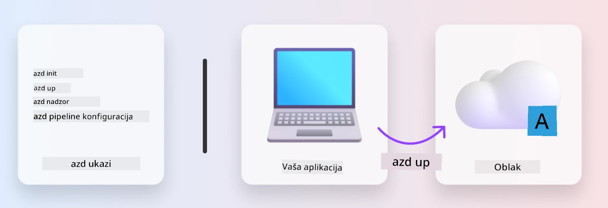
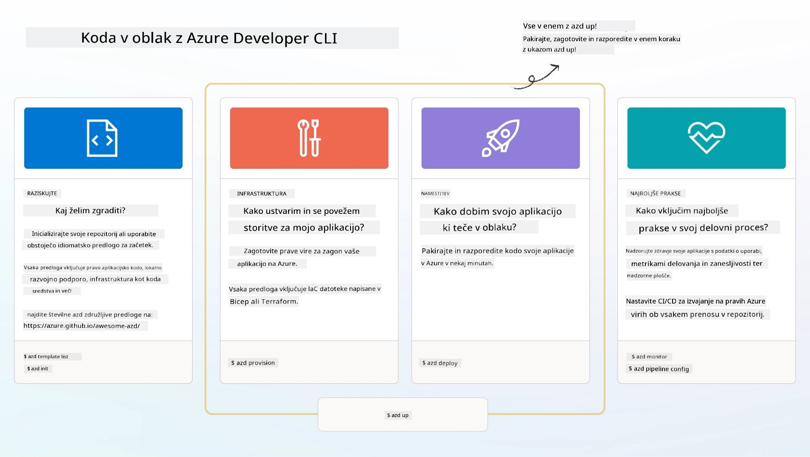

# 1. Izberite predlogo

!!! tip "DO KONCA TEGA MODULA BOSTE ZMOGLI"

    - [ ] Opisati, kaj so AZD predloge
    - [ ] Odkriti in uporabiti AZD predloge za AI
    - [ ] Začeti z uporabo predloge AI Agents
    - [ ] **Laboratorij 1:** Hitri začetek z AZD v GitHub Codespaces

---

## 1. Analogija graditelja

Gradnja sodobne AI aplikacije, pripravljene za podjetja, _od začetka_ je lahko zastrašujoča. To je malo podobno, kot da bi sami gradili svojo novo hišo, opeko za opeko. Da, to je mogoče! Ampak ni najbolj učinkovit način za dosego želenega rezultata!

Namesto tega pogosto začnemo z obstoječim _načrtom_, nato pa sodelujemo z arhitektom, da ga prilagodimo našim osebnim zahtevam. In točno takšen pristop je priporočljiv pri gradnji inteligentnih aplikacij. Najprej poiščite dobro arhitekturo, ki ustreza vašemu problemu. Nato sodelujte z arhitektom rešitev, da prilagodite in razvijete rešitev za vaš specifični scenarij.

Ampak kje lahko najdemo te načrte? In kako najdemo arhitekta, ki je pripravljen naučiti nas, kako prilagoditi in implementirati te načrte sami? V tej delavnici bomo odgovorili na ta vprašanja z uvodom v tri tehnologije:

1. [Azure Developer CLI](https://aka.ms/azd) - odprtokodno orodje, ki pospeši pot razvijalca od lokalnega razvoja (gradnja) do implementacije v oblak (dostava).
1. [Azure AI Foundry Templates](https://ai.azure.com/templates) - standardizirani odprtokodni repozitoriji, ki vsebujejo vzorčno kodo, infrastrukturo in konfiguracijske datoteke za implementacijo AI arhitekture rešitev.
1. [GitHub Copilot Agent Mode](https://code.visualstudio.com/docs/copilot/chat/chat-agent-mode) - kodirni agent, ki temelji na znanju Azure in nas lahko vodi pri navigaciji po kodi ter pri spremembah - z uporabo naravnega jezika.

S temi orodji v rokah lahko zdaj _odkrijemo_ pravo predlogo, jo _implementiramo_, da preverimo, ali deluje, in jo _prilagodimo_ za naše specifične scenarije. Poglobimo se in se naučimo, kako delujejo.

---

## 2. Azure Developer CLI

[Azure Developer CLI](https://learn.microsoft.com/en-us/azure/developer/azure-developer-cli/) (ali `azd`) je odprtokodno orodje ukazne vrstice, ki lahko pospeši vašo pot od kode do oblaka z naborom ukazov, prijaznih za razvijalce, ki dosledno delujejo v vašem IDE (razvoj) in CI/CD (devops) okolju.

Z `azd` je vaša pot implementacije lahko tako preprosta kot:

- `azd init` - Inicializira nov AI projekt iz obstoječe AZD predloge.
- `azd up` - Zagotovi infrastrukturo in implementira vašo aplikacijo v enem koraku.
- `azd monitor` - Pridobite sprotno spremljanje in diagnostiko za vašo implementirano aplikacijo.
- `azd pipeline config` - Nastavite CI/CD pipeline za avtomatizacijo implementacije v Azure.

**🎯 | VAJA**: <br/> Raziščite orodje ukazne vrstice `azd` v vašem GitHub Codespaces okolju zdaj. Začnite tako, da vnesete ta ukaz, da vidite, kaj orodje zmore:

```bash title="" linenums="0"
azd help
```



---

## 3. AZD predloga

Da bi `azd` to dosegel, mora vedeti, katero infrastrukturo zagotoviti, katere konfiguracijske nastavitve uveljaviti in katero aplikacijo implementirati. Tukaj pridejo v igro [AZD predloge](https://learn.microsoft.com/en-us/azure/developer/azure-developer-cli/azd-templates?tabs=csharp).

AZD predloge so odprtokodni repozitoriji, ki združujejo vzorčno kodo z infrastrukturnimi in konfiguracijskimi datotekami, potrebnimi za implementacijo arhitekture rešitev. 
Z uporabo pristopa _Infrastructure-as-Code_ (IaC) omogočajo, da so definicije virov predloge in konfiguracijske nastavitve pod nadzorom različic (tako kot izvorna koda aplikacije) - kar ustvarja ponovno uporabne in dosledne delovne tokove med uporabniki tega projekta.

Ko ustvarjate ali ponovno uporabljate AZD predlogo za _vaš_ scenarij, razmislite o teh vprašanjih:

1. Kaj gradite? → Ali obstaja predloga, ki ima začetno kodo za ta scenarij?
1. Kako je vaša rešitev arhitekturno zasnovana? → Ali obstaja predloga, ki ima potrebne vire?
1. Kako je vaša rešitev implementirana? → Pomislite na `azd deploy` s predhodnimi/naknadnimi obdelovalnimi kljukami!
1. Kako jo lahko še optimizirate? → Pomislite na vgrajeno spremljanje in avtomatizacijske pipeline!

**🎯 | VAJA**: <br/> 
Obiščite galerijo [Awesome AZD](https://azure.github.io/awesome-azd/) in uporabite filtre za raziskovanje več kot 250 predlog, ki so trenutno na voljo. Preverite, ali lahko najdete predlogo, ki ustreza _vašim_ zahtevam scenarija.



---

## 4. Predloge AI aplikacij

---

