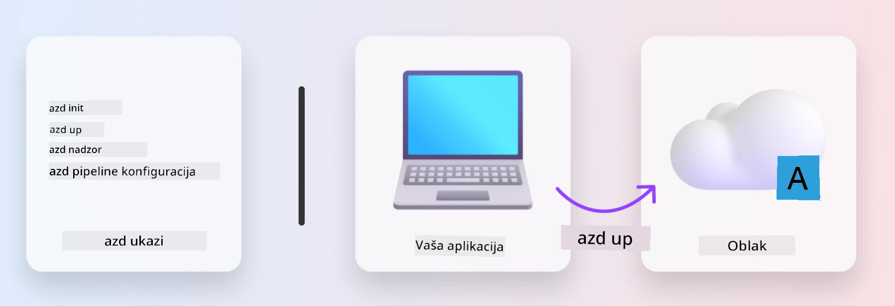
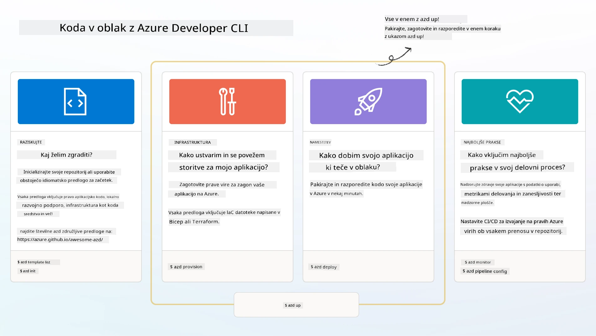

# 1. Izberite predlogo

!!! tip "NA KONCU TEGA MODULA BOSTE ZMOGLI"

    - [ ] Opisati, kaj so AZD predloge
    - [ ] Odkriti in uporabiti AZD predloge za AI
    - [ ] Začeti s predlogo za AI agente
    - [ ] **Lab 1:** AZD hitri začetek z GitHub Codespaces

---

## 1. Prispodoba graditelja

Building a modern enterprise-ready AI application _iz nič_ can be daunting. It's a little bit like building your new home on your own, brick by brick. Yes, it can be done! But it is not the most effective way to get the desired end result! 

Instead, we often start with an existing _obstoječ načrt_, and work with an architect to customize it to our personal requirements. And that's exactly the approach to take when building intelligent applications. First, find a good design architecture that fits your problem space. Then work with a solution architect to customize and develop the solution for your specific scenario.

But where can we find these design blueprints? And how do we find an architect that is willing to teach us how to customize and deploy these blueprints on our own? In this workshop, we answer those questions by introducing you to three technologies:

1. [Azure Developer CLI](https://aka.ms/azd) - an open-source tool that accelerates the developer path in going from local development (build) to cloud deployment (ship).
1. [Microsoft Foundry Templates](https://ai.azure.com/templates) - standardized open-source repositories containing sample code, infrastructure and configuration files for deploying an AI solution architecture.
1. [GitHub Copilot Agent Mode](https://code.visualstudio.com/docs/copilot/chat/chat-agent-mode) - a coding agent grounded in Azure knowledge, that can guide us in navigating the codebase and making changes - using natural language.

With these tools in hand, we can now _discover_ the right template, _deploy_ it to validate it works, and _customize_ it to suit our specific scenarios. Let's dive in and learn how these work.


---

## 2. Azure Developer CLI

The [Azure Developer CLI](https://learn.microsoft.com/en-us/azure/developer/azure-developer-cli/) (or `azd`) is an open-source commandline tool that can speed up your code-to-cloud journey with a set of developer-friendly commands that work consistently across your IDE (development) and CI/CD (devops) environments.

With `azd`, your deployment journey can be as simple as:

- `azd init` - Initializes a new AI project from an existing AZD template.
- `azd up` - Provisions infrastructure and deploy your application in one step.
- `azd monitor` - Get real-time monitoring and diagnostics for your deployed application.
- `azd pipeline config` - Setup CI/CD pipelines to automate deployment to Azure.

**🎯 | VAJA**: <br/> Raziščite orodje ukazne vrstice `azd` v vašem okolju GitHub Codespaces zdaj. Začnite tako, da vtipkate ta ukaz in si ogledate, kaj orodje zmore:

```bash title="" linenums="0"
azd help
```



---

## 3. AZD predloga

For `azd` to achieve this, it needs to know the infrastructure to provision, the configuration settings to enforce, and the application to deploy. This is where [AZD templates](https://learn.microsoft.com/en-us/azure/developer/azure-developer-cli/azd-templates?tabs=csharp) come in. 

AZD templates are open-source repositories that combine sample code with infrastructure and configuraton files required for deploying the solution architecture.
By using an _Infrastructure-as-Code_ (IaC) approach, they allow template resource definitions and configuration settings to be version-controller (just like the app source code) - creating reusable and consistent workflows across users of that project.

When creating or reusing an AZD template for _your_ scenario, consider these questions:

1. What are you building? → Is there a template that has starter code for that scenario?
1. How is your solution architected? → Is there a template that has the necessary resources?
1. How is your solution deployed? → Think `azd deploy` with pre/post-processing hooks!
1. How can you optimize it further? → Think built-in monitoring and automation pipelines!

**🎯 | VAJA**: <br/> 
Visit the [Awesome AZD](https://azure.github.io/awesome-azd/) gallery and use the filters to explore the 250+ templates currently available. See if you can find on that aligns to _your_ scenario requirements.



---

## 4. Predloge za AI aplikacije

For AI-powered applications, Microsoft provides specialized templates featuring **Microsoft Foundry** and **Foundry Agents**. These templates accelerate your path to building intelligent, production-ready applications.

### Microsoft Foundry & Foundry Agents predloge

Select a template below to deploy. Each template is available on [Awesome AZD](https://azure.github.io/awesome-azd/) and can be initialized with a single command.

| Template | Description | Deploy Command |
|----------|-------------|----------------|
| **[AI Chat with RAG](https://azure.github.io/awesome-azd/?tags=ai&tags=rag)** | Aplikacija za klepet z Retrieval Augmented Generation (RAG) z uporabo Microsoft Foundry | `azd init -t azure-samples/azure-search-openai-demo` |
| **[Foundry Agent Service Starter](https://azure.github.io/awesome-azd/?tags=ai&tags=agents)** | Build AI agents with Foundry Agents for autonomous task execution | `azd init -t azure-samples/foundry-agent-service-starter` |
| **[Multi-Agent Orchestration](https://azure.github.io/awesome-azd/?tags=ai&tags=agents)** | Coordinate multiple Foundry Agents for complex workflows | `azd init -t azure-samples/multi-agent-orchestration` |
| **[AI Document Intelligence](https://azure.github.io/awesome-azd/?tags=ai&tags=document)** | Extract and analyze documents with Microsoft Foundry models | `azd init -t azure-samples/ai-document-processing` |
| **[Conversational AI Bot](https://azure.github.io/awesome-azd/?tags=ai&tags=bot)** | Build intelligent chatbots with Microsoft Foundry integration | `azd init -t azure-samples/ai-chat-protocol` |
| **[AI Image Generation](https://azure.github.io/awesome-azd/?tags=ai&tags=dalle)** | Generate images using DALL-E via Microsoft Foundry | `azd init -t azure-samples/ai-image-generation` |
| **[Semantic Kernel Agent](https://azure.github.io/awesome-azd/?tags=ai&tags=semantic-kernel)** | AI agents using Semantic Kernel with Foundry Agents | `azd init -t azure-samples/semantic-kernel-agent` |
| **[AutoGen Multi-Agent](https://azure.github.io/awesome-azd/?tags=ai&tags=autogen)** | Multi-agent systems using AutoGen framework | `azd init -t azure-samples/autogen-multi-agent` |

### Hitri začetek

1. **Prebrskajte predloge**: Obiščite [https://azure.github.io/awesome-azd/](https://azure.github.io/awesome-azd/) in filtrirajte po `AI`, `Agents`, ali `Microsoft Foundry`
2. **Izberite predlogo**: Izberite tisto, ki ustreza vašemu primeru uporabe
3. **Inicializirajte**: Zaženite ukaz `azd init` za izbrano predlogo
4. **Namestite**: Zaženite `azd up` za provision in namestitev

**🎯 | VAJA**: <br/>
Izberite eno izmed zgornjih predlog glede na vaš scenarij:

- **Gradite klepetalnega bota?** → Začnite z **AI Chat with RAG** ali **Conversational AI Bot**
- **Potrebujete avtonomne agente?** → Poskusite **Foundry Agent Service Starter** ali **Multi-Agent Orchestration**
- **Obdelujete dokumente?** → Uporabite **AI Document Intelligence**
- **Želite pomoč pri pisanju kode z AI?** → Raziščite **Semantic Kernel Agent** ali **AutoGen Multi-Agent**

```bash title="Example: Deploy the AI Chat with RAG template" linenums="0"
azd init -t azure-samples/azure-search-openai-demo
azd up
```

!!! info "RAZIŠČITE VEČ PREDLOG"
    The [Awesome AZD Gallery](https://azure.github.io/awesome-azd/) contains 250+ templates. Use the filters to find templates matching your specific requirements for language, framework, and Azure services.

---

<!-- CO-OP TRANSLATOR DISCLAIMER START -->
Izjava o omejitvi odgovornosti:
Ta dokument je bil preveden z uporabo storitve za prevajanje z umetno inteligenco Co-op Translator (https://github.com/Azure/co-op-translator). Čeprav si prizadevamo za natančnost, upoštevajte, da lahko avtomatizirani prevodi vsebujejo napake ali netočnosti. Izvirni dokument v njegovem izvirnem jeziku velja za avtoritativni vir. Za ključne informacije priporočamo strokovni prevod, opravljen s strani usposobljenega prevajalca. Ne prevzemamo odgovornosti za morebitne nesporazume ali napačne interpretacije, ki izhajajo iz uporabe tega prevoda.
<!-- CO-OP TRANSLATOR DISCLAIMER END -->