<!--
CO_OP_TRANSLATOR_METADATA:
{
  "original_hash": "7816c6ec50c694c331e7c6092371be4d",
  "translation_date": "2025-09-25T02:14:15+00:00",
  "source_file": "workshop/docs/instructions/2-Validate-AI-Template.md",
  "language_code": "sl"
}
-->
# 2. Preverjanje predloge

!!! tip "OB KONCU TEGA MODULA BOSTE ZMOGLI"

    - [ ] Analizirati arhitekturo AI rešitve
    - [ ] Razumeti potek namestitve AZD
    - [ ] Uporabiti GitHub Copilot za pomoč pri uporabi AZD
    - [ ] **Laboratorij 2:** Namestiti in preveriti predlogo AI agentov

---

## 1. Uvod

[Azure Developer CLI](https://learn.microsoft.com/en-us/azure/developer/azure-developer-cli/) ali `azd` je odprtokodno orodje ukazne vrstice, ki poenostavi delovni proces razvijalcev pri gradnji in nameščanju aplikacij na Azure.

[AZD predloge](https://learn.microsoft.com/azure/developer/azure-developer-cli/azd-templates) so standardizirani repozitoriji, ki vključujejo vzorčno kodo aplikacij, sredstva za _infrastrukturo kot kodo_ in konfiguracijske datoteke `azd` za celovito arhitekturo rešitev. Namestitev infrastrukture postane tako preprosta kot ukaz `azd provision`, medtem ko ukaz `azd up` omogoča namestitev infrastrukture **in** aplikacije v enem koraku!

Zato je začetek razvoja aplikacij lahko tako preprost kot iskanje ustrezne _AZD začetne predloge_, ki najbolj ustreza vašim potrebam po aplikaciji in infrastrukturi, nato pa prilagoditev repozitorija vašim scenarijskim zahtevam.

Preden začnemo, se prepričajte, da imate nameščen Azure Developer CLI.

1. Odprite terminal v VS Code in vnesite ta ukaz:

      ```bash title="" linenums="0"
      azd version
      ```

1. Videti bi morali nekaj takega!

      ```bash title="" linenums="0"
      azd version 1.19.0 (commit b3d68cea969b2bfbaa7b7fa289424428edb93e97)
      ```

**Zdaj ste pripravljeni izbrati in namestiti predlogo z azd**

---

## 2. Izbira predloge

Platforma Azure AI Foundry vključuje [nabor priporočenih AZD predlog](https://learn.microsoft.com/en-us/azure/ai-foundry/how-to/develop/ai-template-get-started), ki pokrivajo priljubljene scenarije rešitev, kot sta _avtomatizacija delovnih procesov z več agenti_ in _obdelava večmodalnih vsebin_. Te predloge lahko odkrijete tudi z obiskom portala Azure AI Foundry.

1. Obiščite [https://ai.azure.com/templates](https://ai.azure.com/templates)
1. Prijavite se v portal Azure AI Foundry, ko boste pozvani – videti bo nekaj takega.

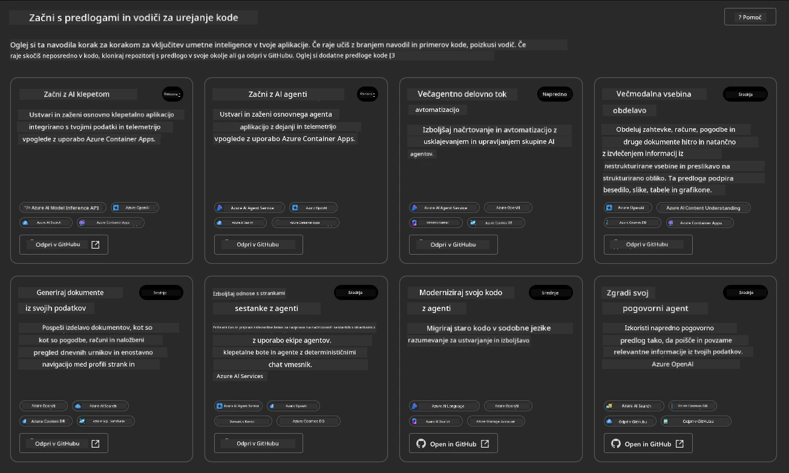

**Osnovne** možnosti so vaše začetne predloge:

1. [ ] [Začnite z AI klepetom](https://github.com/Azure-Samples/get-started-with-ai-chat), ki namesti osnovno klepetalno aplikacijo _z vašimi podatki_ na Azure Container Apps. Uporabite to za raziskovanje osnovnega scenarija AI klepetalnika.
1. [X] [Začnite z AI agenti](https://github.com/Azure-Samples/get-started-with-ai-agents), ki prav tako namesti standardnega AI agenta (z Azure AI Agent Service). Uporabite to za spoznavanje rešitev agentne umetne inteligence, ki vključujejo orodja in modele.

Obiščite drugo povezavo v novem zavihku brskalnika (ali kliknite `Open in GitHub` za ustrezno kartico). Videti bi morali repozitorij za to AZD predlogo. Vzemite si minuto za raziskovanje README datoteke. Arhitektura aplikacije je videti takole:

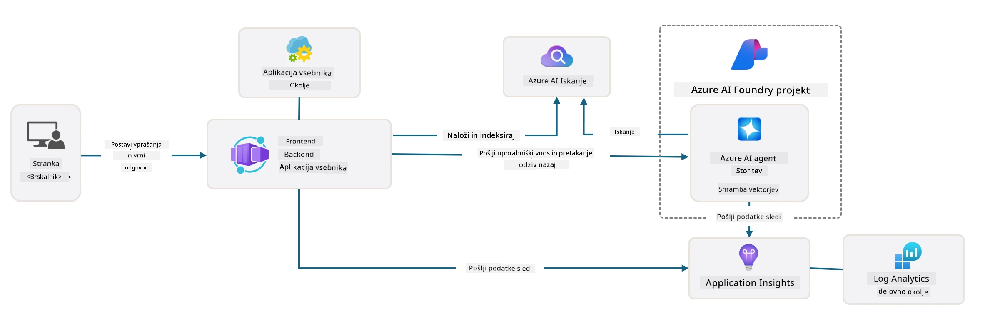

---

## 3. Aktivacija predloge

Poskusimo namestiti to predlogo in se prepričati, da je veljavna. Sledili bomo smernicam v razdelku [Začetek](https://github.com/Azure-Samples/get-started-with-ai-agents?tab=readme-ov-file#getting-started).

1. Kliknite [to povezavo](https://github.com/codespaces/new/Azure-Samples/get-started-with-ai-agents) – potrdite privzeto dejanje `Create codespace`
1. Odpre se nov zavihek brskalnika – počakajte, da se seja GitHub Codespaces popolnoma naloži
1. Odprite terminal VS Code v Codespaces – vnesite naslednji ukaz:

   ```bash title="" linenums="0"
   azd up
   ```

Izpolnite korake delovnega procesa, ki jih bo to sprožilo:

1. Pozvani boste, da se prijavite v Azure – sledite navodilom za preverjanje pristnosti
1. Vnesite edinstveno ime okolja – npr. uporabil sem `nitya-mshack-azd`
1. To bo ustvarilo mapo `.azure/` – videli boste podmapo z imenom okolja
1. Pozvani boste, da izberete ime naročnine – izberite privzeto
1. Pozvani boste za lokacijo – uporabite `East US 2`

Zdaj počakajte, da se namestitev dokonča. **To traja 10–15 minut**

1. Ko je končano, bo vaš konzola prikazala sporočilo o USPEHU, kot je to:
      ```bash title="" linenums="0"
      SUCCESS: Your up workflow to provision and deploy to Azure completed in 10 minutes 17 seconds.
      ```
1. Vaš Azure Portal bo zdaj imel nameščeno skupino virov z imenom okolja:

      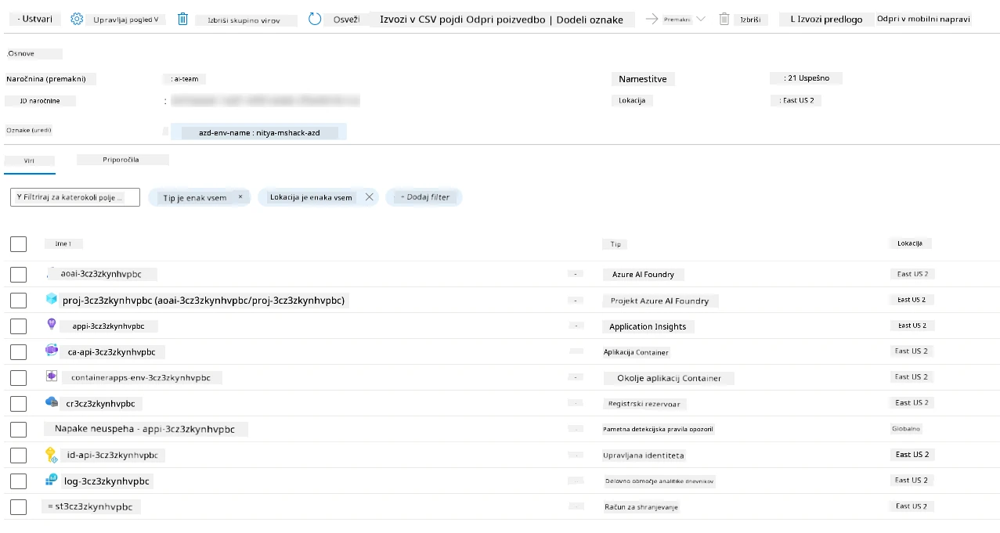

1. **Zdaj ste pripravljeni preveriti nameščeno infrastrukturo in aplikacijo**.

---

## 4. Preverjanje predloge

1. Obiščite stran [Skupine virov](https://portal.azure.com/#browse/resourcegroups) na portalu Azure – prijavite se, ko boste pozvani
1. Kliknite na RG za ime vašega okolja – videli boste zgornjo stran

      - kliknite na vir Azure Container Apps
      - kliknite na URL aplikacije v razdelku _Essentials_ (zgoraj desno)

1. Videti bi morali gostujoči uporabniški vmesnik aplikacije, kot je ta:

   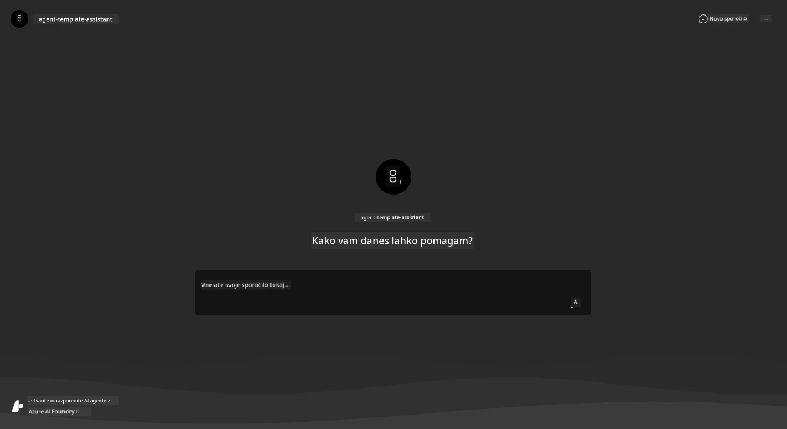

1. Poskusite zastaviti nekaj [vzorčnih vprašanj](https://github.com/Azure-Samples/get-started-with-ai-agents/blob/main/docs/sample_questions.md)

      1. Vprašajte: ```What is the capital of France?``` 
      1. Vprašajte: ```What's the best tent under $200 for two people, and what features does it include?```

1. Videti bi morali odgovore, podobne prikazanim spodaj. _Ampak kako to deluje?_ 

      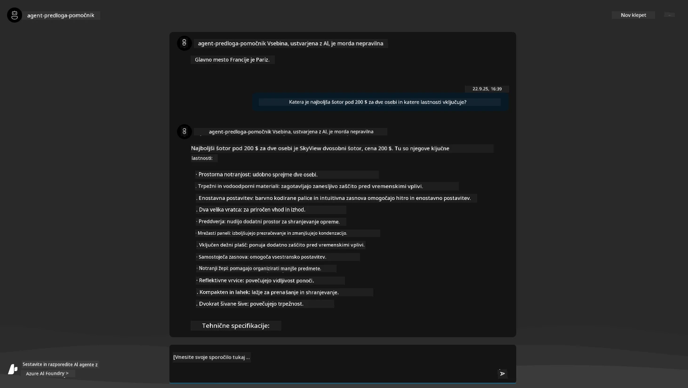

---

## 5. Preverjanje agenta

Azure Container App namesti končno točko, ki se poveže z AI agentom, nameščenim v projektu Azure AI Foundry za to predlogo. Poglejmo, kaj to pomeni.

1. Vrnite se na stran _Pregled_ za vašo skupino virov na portalu Azure

1. Kliknite na vir `Azure AI Foundry` na seznamu

1. Videti bi morali to. Kliknite gumb `Go to Azure AI Foundry Portal`. 
   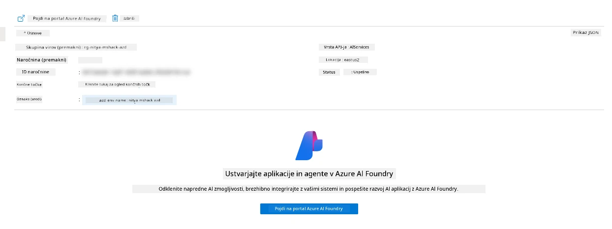

1. Videti bi morali stran projekta Foundry za vašo AI aplikacijo
   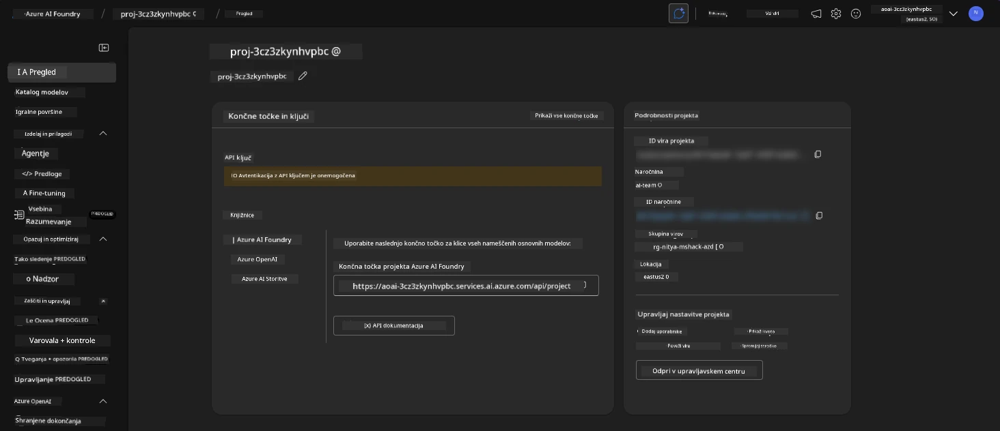

1. Kliknite na `Agents` – videli boste privzetega agenta, nameščenega v vašem projektu
   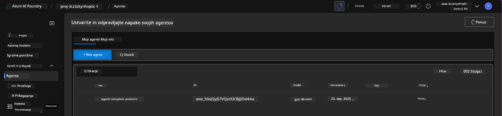

1. Izberite ga – in videli boste podrobnosti agenta. Opazite naslednje:

      - Agent privzeto uporablja File Search (vedno)
      - Znanost agenta kaže, da ima naloženih 32 datotek (za iskanje datotek)
      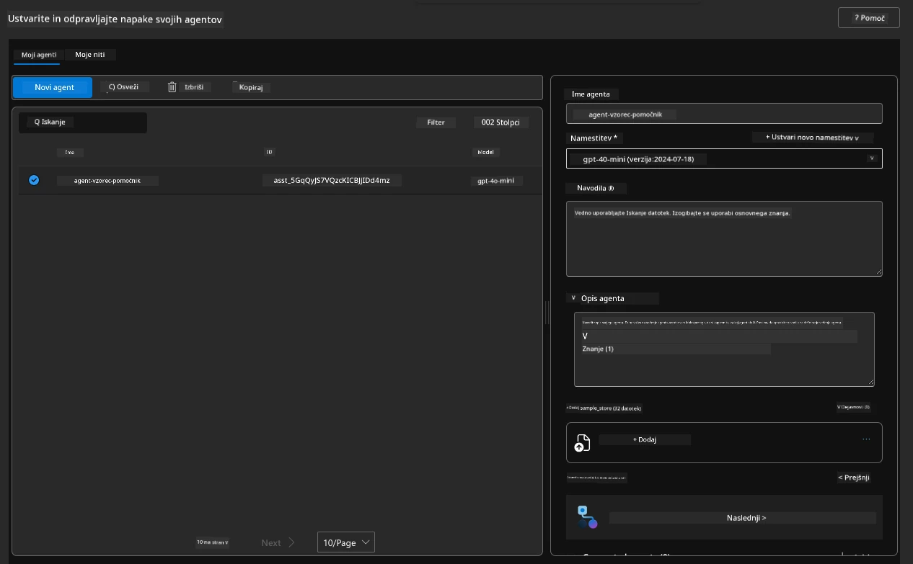

1. Poiščite možnost `Data+indexes` v levem meniju in kliknite za podrobnosti. 

      - Videti bi morali 32 podatkovnih datotek, naloženih za znanje.
      - Te ustrezajo 12 datotekam strank in 20 datotekam izdelkov v `src/files` 
      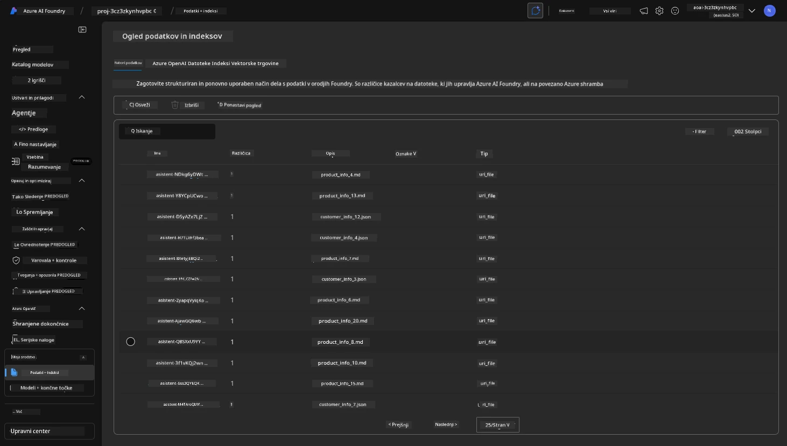

**Preverili ste delovanje agenta!** 

1. Odgovori agenta temeljijo na znanju v teh datotekah. 
1. Zdaj lahko zastavite vprašanja, povezana s temi podatki, in dobite utemeljene odgovore.
1. Primer: `customer_info_10.json` opisuje 3 nakupe, ki jih je opravila "Amanda Perez"

Vrnite se na zavihek brskalnika s končno točko Container App in vprašajte: `What products does Amanda Perez own?`. Videti bi morali nekaj takega:

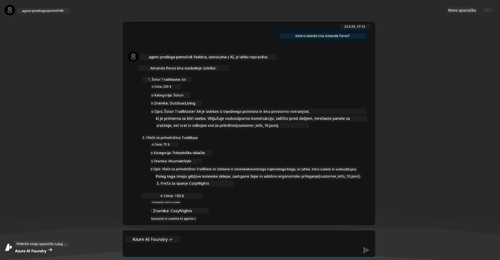

---

## 6. Igralnica za agente

Razvijmo malo več intuicije za zmogljivosti Azure AI Foundry, tako da agenta preizkusimo v igralnici za agente. 

1. Vrnite se na stran `Agents` v Azure AI Foundry – izberite privzetega agenta
1. Kliknite možnost `Try in Playground` – dobili boste uporabniški vmesnik igralnice, kot je ta
1. Zastavite isto vprašanje: `What products does Amanda Perez own?`

    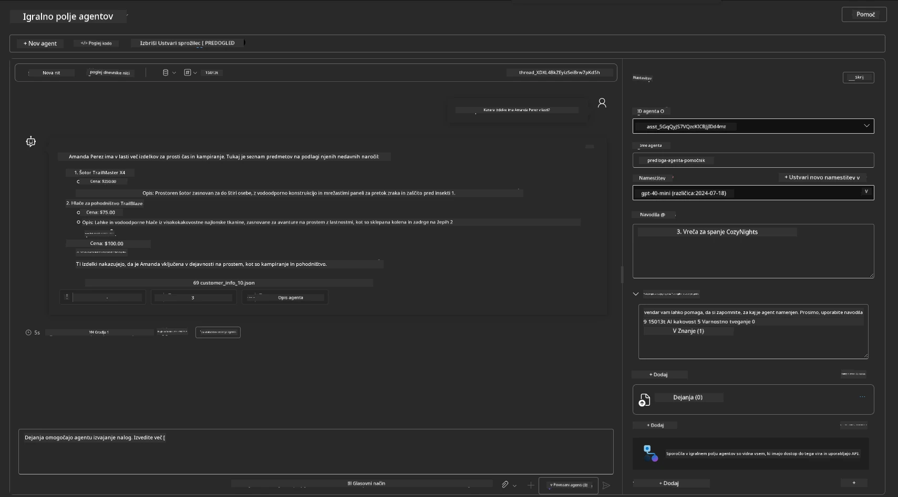

Dobite enak (ali podoben) odgovor – vendar dobite tudi dodatne informacije, ki jih lahko uporabite za razumevanje kakovosti, stroškov in zmogljivosti vaše aplikacije z agenti. Na primer:

1. Opazite, da odgovor navaja podatkovne datoteke, uporabljene za "utemeljitev" odgovora
1. Premaknite miško nad katero koli od teh oznak datotek – ali podatki ustrezajo vašemu vprašanju in prikazanemu odgovoru?

Vidite tudi vrstico _statistika_ pod odgovorom. 

1. Premaknite miško nad katero koli metriko – npr. Varnost. Videli boste nekaj takega
1. Ali ocenjena ocena ustreza vaši intuiciji glede ravni varnosti odgovora?

      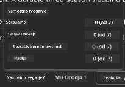

---x

## 7. Vgrajena opazljivost

Opazljivost pomeni opremljanje vaše aplikacije z orodji za generiranje podatkov, ki jih je mogoče uporabiti za razumevanje, odpravljanje napak in optimizacijo njenega delovanja. Da bi dobili občutek za to:

1. Kliknite gumb `View Run Info` – videli boste ta pogled. To je primer [sledenja agentom](https://learn.microsoft.com/en-us/azure/ai-foundry/how-to/develop/trace-agents-sdk#view-trace-results-in-the-azure-ai-foundry-agents-playground) v akciji. _Ta pogled lahko dobite tudi s klikom na Thread Logs v glavnem meniju_.

   - Pridobite občutek za korake izvajanja in orodja, ki jih je agent uporabil
   - Razumite skupno število žetonov (v primerjavi z uporabo izhodnih žetonov) za odgovor
   - Razumite zakasnitev in kje se porabi čas pri izvajanju

      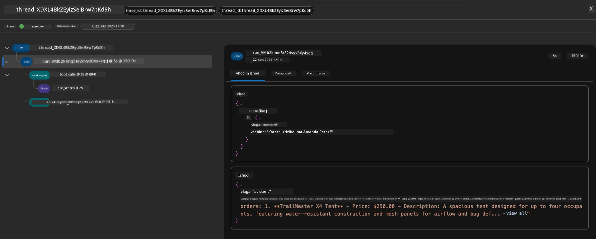

1. Kliknite zavihek `Metadata`, da vidite dodatne atribute za izvajanje, ki lahko zagotovijo koristen kontekst za odpravljanje težav pozneje.   

      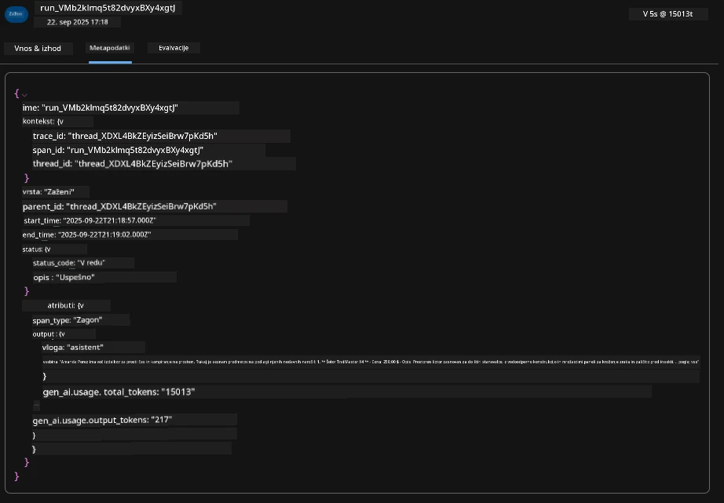


1. Kliknite zavihek `Evaluations`, da vidite samodejne ocene, narejene na podlagi odgovora agenta. Te vključujejo ocene varnosti (npr. Samopoškodovanje) in ocene, specifične za agenta (npr. Razrešitev namena, Upoštevanje naloge).

      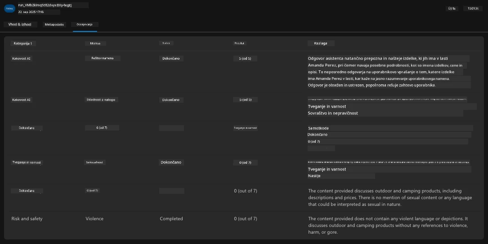

1. Nazadnje kliknite zavihek `Monitoring` v stranskem meniju.

      - Izberite zavihek `Resource usage` na prikazani strani – in si oglejte metrike.
      - Spremljajte uporabo aplikacije glede na stroške (žetone) in obremenitev (zahteve).
      - Spremljajte zakasnitev aplikacije do prvega bajta (obdelava vhodnih podatkov) in zadnjega bajta (izhod).

      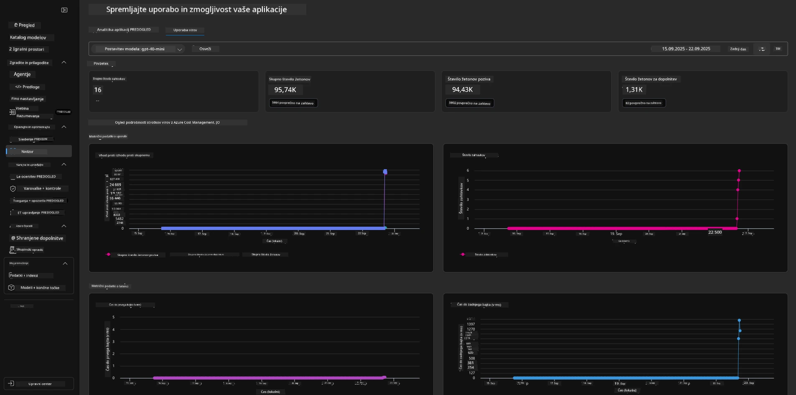

---

## 8. Spremenljivke okolja

Do zdaj smo pregledali namestitev v brskalniku – in preverili, da je naša infrastruktura nameščena in aplikacija deluje. Toda za delo z aplikacijo _na ravni kode_ moramo konfigurirati naše lokalno razvojno okolje z ustreznimi spremenljivkami, potrebnimi za delo s temi viri. Uporaba `azd` to olajša.

1. Azure Developer CLI [uporablja spremenljivke okolja](https://learn.microsoft.com/en-us/azure/developer/azure-developer-cli/manage-environment-variables?tabs=bash) za shranjevanje in upravljanje nastavitev konfiguracije za namestitve aplikacij.

1. Spremenljivke okolja so shranjene v `.azure/<env-name>/.env` – to jih omeji na okolje `env-name`, uporabljeno med namestitvijo, in pomaga izolirati okolja med različnimi cilji namestitve v istem repozitoriju.

1. Spremenljivke okolja se samodejno naložijo z ukazom `azd`, kadar koli ta izvede določen ukaz (npr. `azd up`). Upoštevajte, da `azd` ne bere samodejno _spremenljivk okolja na ravni OS_ (npr. nastavljenih v lupini) – namesto tega uporabite `azd set env` in `azd get env` za prenos informacij znotraj skriptov.


Poskusimo nekaj ukazov:

1. Pridobite vse spremenljivke okolja, nastavljene za `azd` v tem okolju:

      ```bash title="" linenums="0"
      azd env get-values
      ```
      
      Videli boste nekaj takega:

      ```bash title="" linenums="0"
      AZURE_AI_AGENT_DEPLOYMENT_NAME="gpt-4o-mini"
      AZURE_AI_AGENT_NAME="agent-template-assistant"
      AZURE_AI_EMBED_DEPLOYMENT_NAME="text-embedding-3-small"
      AZURE_AI_EMBED_DIMENSIONS=100
      ...
      ```

1. Pridobite določeno vrednost – npr. želim vedeti, ali smo nastavili vrednost `AZURE_AI_AGENT_MODEL_NAME`

      ```bash title="" linenums="0"
      azd env get-value AZURE_AI_AGENT_MODEL_NAME 
      ```
      
      Videli boste nekaj takega – ni bila nastavljena privzeto!

      ```bash title="" linenums="0"
      ERROR: key 'AZURE_AI_AGENT_MODEL_NAME' not found in the environment values
      ```

1. Nastavite novo spremenljivko okolja za `azd`. Tukaj posodobimo ime modela agenta. _Opomba: vse spremembe bodo takoj vidne v datoteki `.azure/<env-name>/.env`.

      ```bash title="" linenums="0"
      azd env set AZURE_AI_AGENT_MODEL_NAME gpt-4.1
      azd env set AZURE_AI_AGENT_MODEL_VERSION 2025-04-14
      azd env set AZURE_AI_AGENT_DEPLOYMENT_CAPACITY 150
      ```

      Zdaj bi morali ugotoviti, da je vrednost nastavljena:

      ```bash title="" linenums="0"
      azd env get-value AZURE_AI_AGENT_MODEL_NAME 
      ```

1. Upoštevajte, da so nekateri viri trajni (npr. namestitve modelov) in bodo zahtevali več kot le `azd up`, da bi prisilili ponovno namestitev. Poskusimo odstraniti prvotno namestitev in ponovno namestiti s spremenjenimi spremenljivkami okolja.

1. **Osvežitev** Če ste prej namestili infrastrukturo z uporabo predloge azd – lahko _osvežite_ stanje vaših lokalnih spremenljivk okolja glede na trenutno stanje vaše namestitve Azure z uporabo tega ukaza:
      ```bash title="" linenums="0"
      azd env refresh
      ```

      To je močan način za _sinhronizacijo_ okoljskih spremenljivk med dvema ali več lokalnimi razvojnimi okolji (npr. ekipa z več razvijalci) - omogoča, da nameščena infrastruktura služi kot osnova za stanje okoljskih spremenljivk. Člani ekipe preprosto _osvežijo_ spremenljivke, da se ponovno sinhronizirajo.

---

## 9. Čestitke 🏆

Pravkar ste zaključili celoten delovni proces, kjer ste:

- [X] Izbrali predlogo AZD, ki jo želite uporabiti
- [X] Zagnali predlogo z GitHub Codespaces
- [X] Namestili predlogo in preverili, da deluje

---

