# 2. Preverjanje predloge

> Preverjeno z `azd 1.23.12` marca 2026.

!!! tip "NA KONCU TEGA MODULA BOSTE ZMOGLI"

    - [ ] Analizirati arhitekturo AI rešitve
    - [ ] Razumeti delovni tok nameščanja z AZD
    - [ ] Uporabiti GitHub Copilot za pomoč pri uporabi AZD
    - [ ] **Lab 2:** Namestiti in preveriti predlogo AI Agentov

---


## 1. Uvod

The [Azure Developer CLI](https://learn.microsoft.com/en-us/azure/developer/azure-developer-cli/) or `azd` je odprtokodno orodje ukazne vrstice, ki poenostavi razvojni potek pri gradnji in nameščanju aplikacij v Azure. 

[AZD Templates](https://learn.microsoft.com/azure/developer/azure-developer-cli/azd-templates) so standardizirani repozitoriji, ki vključujejo vzorčno kodo aplikacije, sredstva _infrastrukture kot kode_ in konfiguracijske datoteke `azd` za skladno arhitekturo rešitve. Zagotavljanje infrastrukture postane tako preprosto kot ukaz `azd provision` - medtem ko `azd up` omogoča, da hkrati zagotovite infrastrukturo **in** namestite svojo aplikacijo!

Posledično je zagon razvoja aplikacije lahko tako preprost, kot najti pravo _AZD Starter predlogo_, ki se najbolj ujema z vašimi potrebami po aplikaciji in infrastrukturi - nato prilagoditi repozitorij tako, da ustreza zahtevam vašega scenarija.

Preden začnemo, poskrbimo, da imate nameščen Azure Developer CLI.

1. Odprite terminal v VS Code in vnesite ta ukaz:

      ```bash title="" linenums="0"
      azd version
      ```

1. Videli boste nekaj podobnega!

      ```bash title="" linenums="0"
      azd version 1.23.12 (commit <current-build>)
      ```

**Zdaj ste pripravljeni izbrati in namestiti predlogo z azd**

---

## 2. Izbor predloge

Platforma Microsoft Foundry vključuje [serijo priporočenih AZD predlog](https://learn.microsoft.com/en-us/azure/ai-foundry/how-to/develop/ai-template-get-started), ki pokrivajo priljubljene scenarije rešitev, kot so _samodejni delovni tok več agentov_ in _večmodalna obdelava vsebin_. Te predloge lahko odkrijete tudi neposredno v portalu Microsoft Foundry.

1. Obiščite [https://ai.azure.com/templates](https://ai.azure.com/templates)
1. Prijavite se v portal Microsoft Foundry, ko boste pozvani - videli boste nekaj takega.

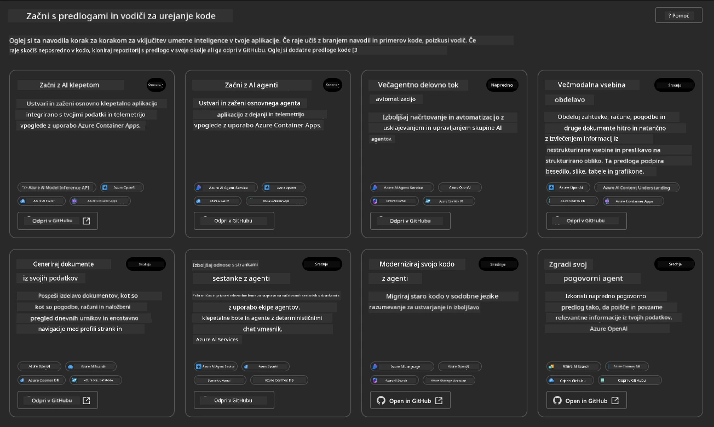


Možnosti **Basic** so vaše začetne predloge:

1. [ ] [Get Started with AI Chat](https://github.com/Azure-Samples/get-started-with-ai-chat) ki namešča osnovno klepetalno aplikacijo _z vašimi podatki_ v Azure Container Apps. Uporabite to za raziskovanje osnovnega scenarija AI klepetalnika.
1. [X] [Get Started with AI Agents](https://github.com/Azure-Samples/get-started-with-ai-agents) ki prav tako namešča standardnega AI Agenta (s Foundry Agenti). Uporabite to za seznanitev z agentnimi AI rešitvami, ki vključujejo orodja in modele.

Obiščite drugo povezavo v novem zavihku brskalnika (ali kliknite `Open in GitHub` za ustrezni kartici). Videti bi morali repozitorij te AZD predloge. Vzemite si minuto in raziskujte README. Arhitektura aplikacije izgleda takole:

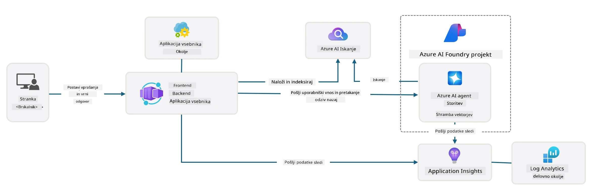

---

## 3. Aktivacija predloge

Poskusimo namestiti to predlogo in se prepričati, da je veljavna. Upoštevali bomo navodila v razdelku [Getting Started](https://github.com/Azure-Samples/get-started-with-ai-agents?tab=readme-ov-file#getting-started).

1. Izberite delovno okolje za repozitorij predloge:

      - **GitHub Codespaces**: Kliknite [to povezavo](https://github.com/codespaces/new/Azure-Samples/get-started-with-ai-agents) in potrdite `Create codespace`
      - **Local clone or dev container**: Klonirajte `Azure-Samples/get-started-with-ai-agents` in ga odprite v VS Code

1. Počakajte, da je terminal v VS Code pripravljen, nato vnesite naslednji ukaz:

   ```bash title="" linenums="0"
   azd up
   ```

Dokončajte korake delovnega toka, ki jih bo to sprožilo:

1. Prijavili se boste v Azure - sledite navodilom za overjanje
1. Vnesite edinstveno ime okolja za vas - npr., jaz sem uporabil `nitya-mshack-azd`
1. To bo ustvarilo mapo `.azure/` - videli boste podmapo z imenom okolja
1. Pozvani boste, da izberete ime naročnine - izberite privzeto
1. Pozvani boste za lokacijo - uporabite `East US 2`

Zdaj počakajte, da se zagotavljanje zaključi. **To traja 10-15 minut**

1. Ko je končano, bo v vaši konzoli prikazano sporočilo SUCCESS, podobno temu:
      ```bash title="" linenums="0"
      SUCCESS: Your up workflow to provision and deploy to Azure completed in 10 minutes 17 seconds.
      ```
1. Vaš Azure Portal bo zdaj imel zagotovljeno skupino virov z imenom tega okolja:

      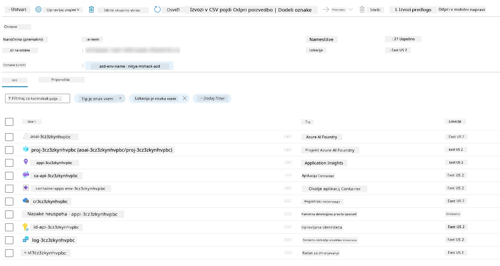

1. **Zdaj ste pripravljeni preveriti nameščeno infrastrukturo in aplikacijo**.

---

## 4. Preverjanje predloge

1. Obiščite stran Azure Portal [Resource Groups](https://portal.azure.com/#browse/resourcegroups) - prijavite se, ko boste pozvani
1. Kliknite na RG za ime vašega okolja - videli boste stran, prikazano zgoraj

      - kliknite na vir Azure Container Apps
      - kliknite na Application Url v razdelku _Essentials_ (zgoraj desno)

1. Videti bi morali gostujočo uporabniško vmesnik aplikacije, kot je ta:

   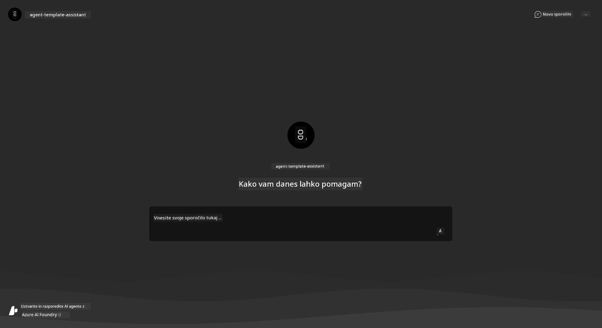

1. Poskusite zastaviti nekaj [vzorečnih vprašanj](https://github.com/Azure-Samples/get-started-with-ai-agents/blob/main/docs/sample_questions.md)

      1. Vprašajte: ```Kaj je prestolnica Francije?``` 
      1. Vprašajte: ```Kateri je najboljši šotor do $200 za dve osebi in katere lastnosti vključuje?```

1. Dobili bi morali odgovore, podobne prikazanemu spodaj. _Ampak kako to deluje?_ 

      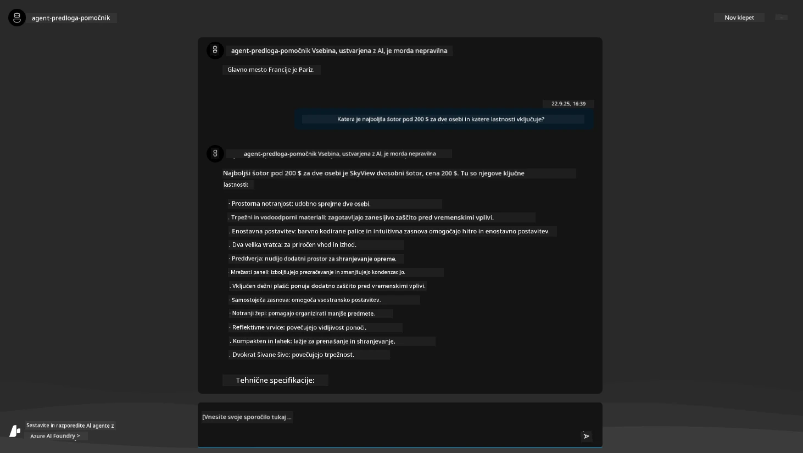

---

## 5. Validacija agenta

Azure Container App namesti končno točko, ki se poveže z AI Agentom, zagotovljenim v projektu Microsoft Foundry za to predlogo. Oglejmo si, kaj to pomeni.

1. Vrnite se na stran Overview v Azure Portal za vašo skupino virov

1. Kliknite na vir `Microsoft Foundry` v tem seznamu

1. Videti bi morali to. Kliknite gumb `Go to Microsoft Foundry Portal`. 
   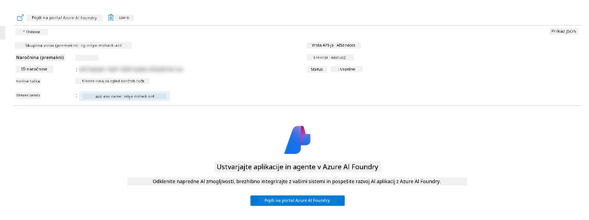

1. Videli boste stran Foundry Project za vašo AI aplikacijo
   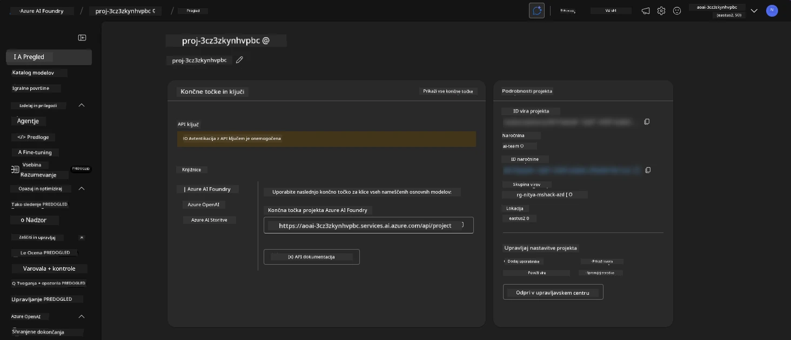

1. Kliknite na `Agents` - videli boste privzetega Agenta, zagotovljenega v vašem projektu
   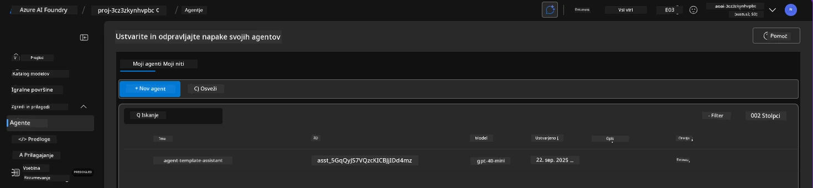

1. Izberite ga - in videli boste podrobnosti agenta. Upoštevajte naslednje:

      - Agent privzeto vedno uporablja File Search
      - Agentova `Knowledge` kaže, da ima naloženih 32 datotek (za iskanje po datotekah)
      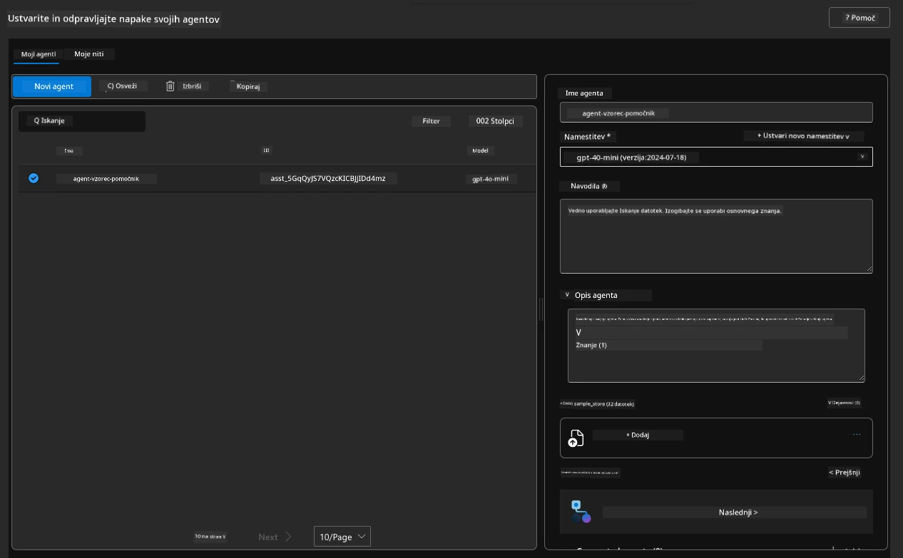

1. Poiščite možnost `Data+indexes` v levem meniju in kliknite za podrobnosti. 

      - Videli bi morali 32 naloženih podatkovnih datotek za znanje.
      - Te bodo ustrezale 12 datotekam strank in 20 datotekam izdelkov v mapi `src/files`
      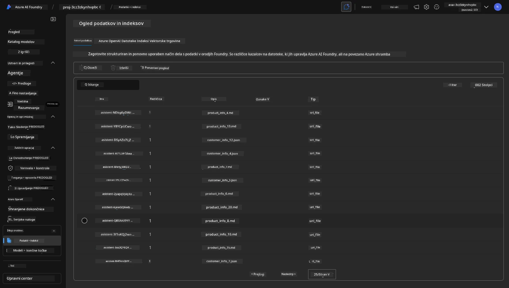

**Potrdili ste delovanje Agenta!** 

1. Odgovori agenta so utemeljeni na znanju v teh datotekah. 
1. Sedaj lahko postavljate vprašanja v povezavi s temi podatki in dobite utemeljene odgovore.
1. Primer: `customer_info_10.json` opisuje 3 nakupe, ki jih je opravila "Amanda Perez"

Vrnete se na zavihek brskalnika s končno točko Container App in vprašajte: `Katere izdelke ima Amanda Perez?`. Videti bi morali nekaj takega:

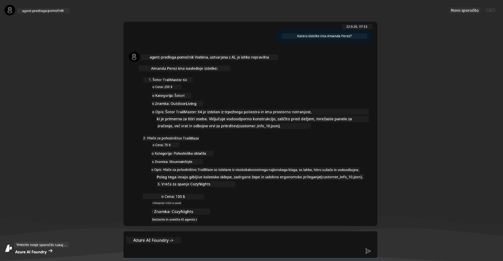

---

## 6. Igrišče agentov

Izboljšajmo razumevanje zmogljivosti Microsoft Foundry tako, da Agenta preizkusimo v Agents Playground.

1. Vrnite se na stran `Agents` v Microsoft Foundry - izberite privzetega agenta
1. Kliknite možnost `Try in Playground` - dobili boste uporabniški vmesnik Playground, podoben temu
1. Postavite isto vprašanje: `Katere izdelke ima Amanda Perez?`

    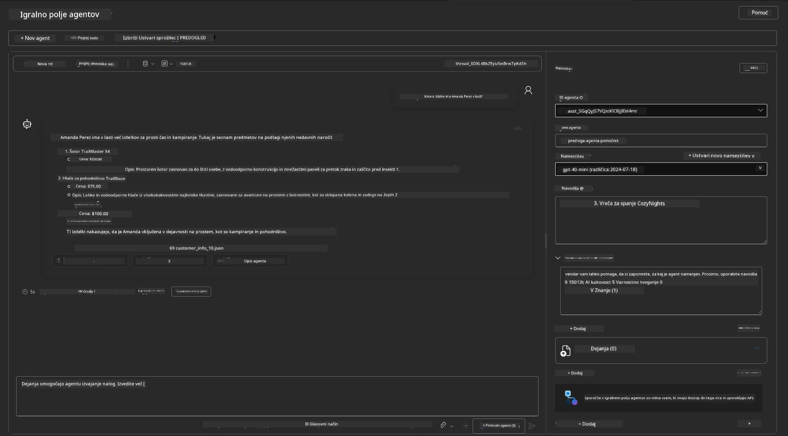

Dobite enak (ali podoben) odgovor - vendar dobite tudi dodatne informacije, ki jih lahko uporabite za razumevanje kakovosti, stroškov in zmogljivosti vaše agentne aplikacije. Na primer:

1. Opazite, da odgovor navaja podatkovne datoteke, uporabljene za "utrjevanje" odgovora
1. POMEMBNO: Premaknite kazalec nad katerikoli od teh oznak datotek - ali se podatki ujemajo z vašim poizvedbo in prikazanim odgovorom?

V spodnjem delu odgovora vidite tudi vrstico s statistiko.

1. Premaknite kazalec nad katerikoli merilnik - npr. Safety. Videli boste nekaj takega
1. Ali ocenjena ocena ustreza vašemu občutku glede ravni varnosti odgovora?

      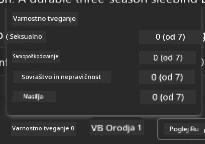

---

## 7. Vgrajena opazljivost

Opazljivost pomeni instrumentiranje vaše aplikacije za ustvarjanje podatkov, ki jih je mogoče uporabiti za razumevanje, odpravljanje napak in optimizacijo njenega delovanja. Da pridobite vtis o tem:

1. Kliknite gumb `View Run Info` - videli boste ta pogled. To je primer [sledenja agentom](https://learn.microsoft.com/en-us/azure/ai-foundry/how-to/develop/trace-agents-sdk#view-trace-results-in-the-azure-ai-foundry-agents-playground) v akciji. _Ta pogled lahko dobite tudi z izbiro Thread Logs v zgornjem nivoju menija_.

   - Dobite občutek korakov izvajanja in orodij, ki jih agent uporablja
   - Razumete skupno število tokenov (v primerjavi z uporabo izhodnih tokenov) za odgovor
   - Razumete zakasnitev in kje se čas porablja med izvajanjem

      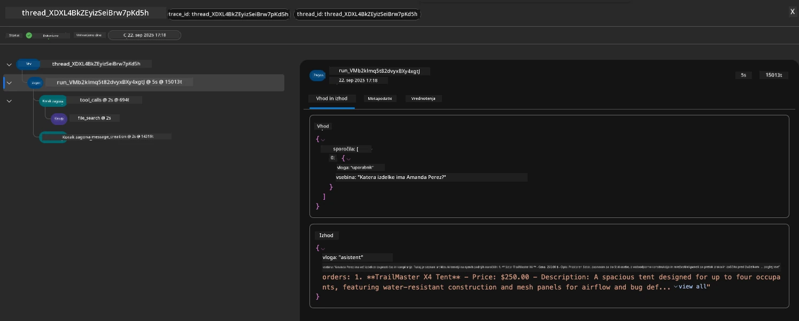

1. Kliknite zavihek `Metadata`, da vidite dodatne atribute za zagon, ki lahko kasneje nudijo uporaben kontekst za odpravljanje napak.   

      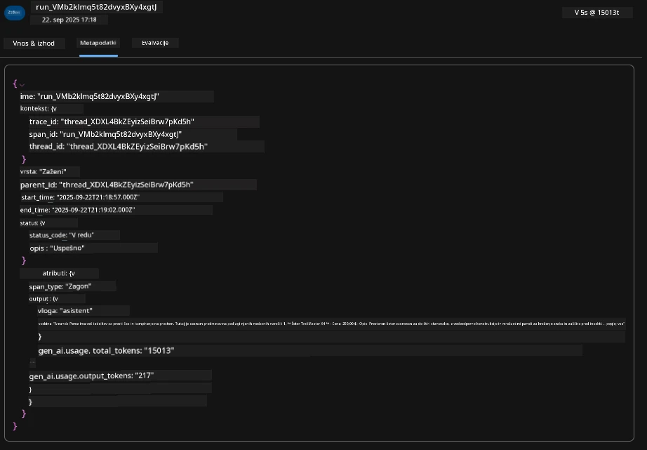


1. Kliknite zavihek `Evaluations`, da vidite samodejne ocene, opravljene na odgovoru agenta. Te vključujejo ocene varnosti (npr. samopoškodovanje) in ocene specifične za agente (npr. razrešitev namere, sledenje nalogi).

      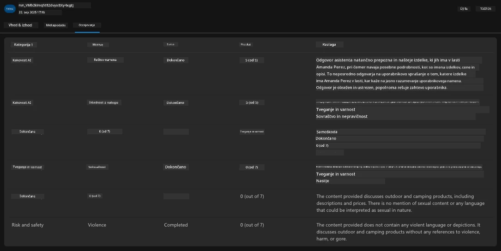

1. In nenazadnje, kliknite zavihek `Monitoring` v stranskem meniju.

      - Izberite zavihek `Resource usage` na prikazani strani - in si oglejte meritve.
      - Spremljajte uporabo aplikacije v smislu stroškov (tokeni) in obremenitve (zahteve).
      - Spremljajte zakasnitev aplikacije do prvega bajta (obdelava vnosa) in zadnjega bajta (izhod).

      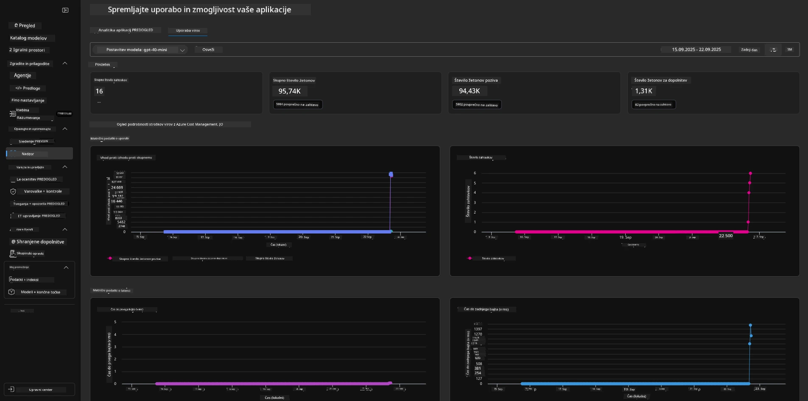

---

## 8. Spremenljivke okolja

Doslej smo pregledali namestitev v brskalniku in potrdili, da je naša infrastruktura zagotovljena in da aplikacija deluje. Vendar pa, da delate s kodo aplikacije _na prvem mestu_, moramo konfigurirati lokalno razvojno okolje z ustreznimi spremenljivkami, potrebnimi za delo s temi viri. Uporaba `azd` to poenostavi.

1. Azure Developer CLI [uses environment variables](https://learn.microsoft.com/en-us/azure/developer/azure-developer-cli/manage-environment-variables?tabs=bash) za shranjevanje in upravljanje konfiguracijskih nastavitev za nameščanje aplikacij.

1. Spremenljivke okolja so shranjene v `.azure/<env-name>/.env` - s tem so omejene na okolje z imenom `env-name`, uporabljeno med nameščanjem, kar pomaga izolirati okolja med različnimi cilji nameščanja v istem repozitoriju.

1. Spremenljivke okolja samodejno naloži ukaz `azd`, kadar izvaja določen ukaz (npr. `azd up`). Upoštevajte, da `azd` samodejno ne bere _spremenljivk okolja na nivoju OS_ (npr. nastavljenih v lupini) - namesto tega uporabite `azd set env` in `azd get env` za prenos informacij znotraj skript.

Preizkusimo nekaj ukazov:

1. Pridobite vse spremenljivke okolja, nastavljene za `azd` v tem okolju:

      ```bash title="" linenums="0"
      azd env get-values
      ```
      
      Videli boste nekaj takega:

      ```bash title="" linenums="0"
      AZURE_AI_AGENT_DEPLOYMENT_NAME="gpt-4.1-mini"
      AZURE_AI_AGENT_NAME="agent-template-assistant"
      AZURE_AI_EMBED_DEPLOYMENT_NAME="text-embedding-3-small"
      AZURE_AI_EMBED_DIMENSIONS=100
      ...
      ```

1. Pridobite določeno vrednost - npr. želim vedeti, ali smo nastavili vrednost `AZURE_AI_AGENT_MODEL_NAME`

      ```bash title="" linenums="0"
      azd env get-value AZURE_AI_AGENT_MODEL_NAME 
      ```
      
      Videli boste nekaj takega - privzeto ni bila nastavljena!

      ```bash title="" linenums="0"
      ERROR: key 'AZURE_AI_AGENT_MODEL_NAME' not found in the environment values
      ```

1. Nastavite novo spremenljivko okolja za `azd`. Tukaj posodobimo ime modela agenta. _Opomba: vse spremembe bodo takoj odražene v datoteki `.azure/<env-name>/.env`._

      ```bash title="" linenums="0"
      azd env set AZURE_AI_AGENT_MODEL_NAME gpt-4.1
      azd env set AZURE_AI_AGENT_MODEL_VERSION 2025-04-14
      azd env set AZURE_AI_AGENT_DEPLOYMENT_CAPACITY 150
      ```

      Zdaj bi morali videti, da je vrednost nastavljena:

      ```bash title="" linenums="0"
      azd env get-value AZURE_AI_AGENT_MODEL_NAME 
      ```

1. Upoštevajte, da so nekateri viri trajni (npr. namestitve modelov) in bodo zahtevali več kot samo `azd up`, da bi prisilili ponovno namestitev. Poskusimo razstaviti izvorno namestitev in ponovno namestiti s spremenjenimi spremenljivkami okolja.

1. **Refresh** Če ste prej nameščali infrastrukturo z uporabo azd predloge - lahko stanje vaših lokalnih spremenljivk okolja osvežite glede na trenutno stanje vaše Azure namestitve z uporabo tega ukaza:

      ```bash title="" linenums="0"
      azd env refresh
      ```

      To je zmogljiv način za _sinhronizacijo_ spremenljivk okolja med dvema ali več lokalnimi razvojnimi okolji (npr. ekipa z več razvijalci) - kar omogoča, da nameščena infrastruktura služi kot končni vir resnice za stanje spremenljivk okolja. Člani ekipe preprosto _osvežijo_ spremenljivke, da se ponovno sinhronizirajo.

---

## 9. Čestitke 🏆

Pravkar ste zaključili celovit potek dela, v katerem ste:

- [X] Izbrali predlogo AZD, ki jo želite uporabiti
- [X] Odprli predlogo v podprtem razvojnem okolju
- [X] Razmestili predlogo in potrdili, da deluje

---

<!-- CO-OP TRANSLATOR DISCLAIMER START -->
**Izjava o omejitvi odgovornosti**:
Ta dokument je bil preveden s storitvijo za prevajanje z umetno inteligenco [Co-op Translator](https://github.com/Azure/co-op-translator). Čeprav si prizadevamo za natančnost, upoštevajte, da lahko avtomatizirani prevodi vsebujejo napake ali netočnosti. Izvirni dokument v izvirnem jeziku velja za merodajen vir. Za kritične informacije priporočamo strokovni človeški prevod. Ne odgovarjamo za morebitne nesporazume ali napačne interpretacije, ki izhajajo iz uporabe tega prevoda.
<!-- CO-OP TRANSLATOR DISCLAIMER END -->