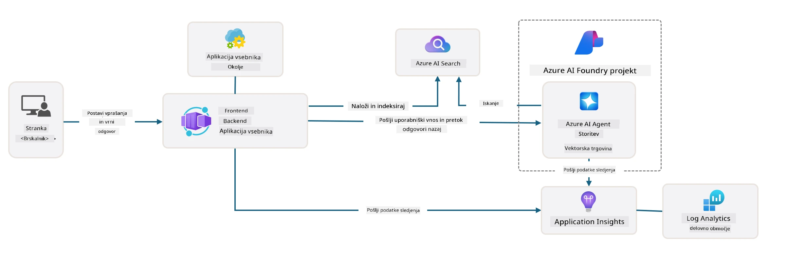

# 3. Razčlenitev predloge

!!! tip "DO KONCA TEGA MODULA BOSTE ZMOGLI"

    - [ ] Postavka
    - [ ] Postavka
    - [ ] Postavka
    - [ ] **Laboratorij 3:** 

---

S predlogami AZD in Azure Developer CLI (`azd`) lahko hitro začnemo našo pot razvoja AI z uporabo standardiziranih repozitorijev, ki zagotavljajo vzorčno kodo, infrastrukturo in konfiguracijske datoteke - v obliki pripravljene _začetne_ projektne predloge.

**Zdaj pa moramo razumeti strukturo projekta in kodo - ter prilagoditi predlogo AZD - brez predhodnih izkušenj ali razumevanja AZD!**

---

## 1. Aktivirajte GitHub Copilot

### 1.1 Namestite GitHub Copilot Chat

Čas je, da raziščete [GitHub Copilot z Agent Mode](https://code.visualstudio.com/docs/copilot/chat/chat-agent-mode). Zdaj lahko uporabimo naravni jezik za opis naloge na visoki ravni in dobimo pomoč pri izvedbi. Za ta laboratorij bomo uporabili [Copilot Free plan](https://github.com/github-copilot/signup), ki ima mesečno omejitev za dokončanja in interakcije v klepetu.

Razširitev je mogoče namestiti iz tržnice, vendar bi morala biti že na voljo v vašem okolju Codespaces. _Kliknite `Open Chat` iz spustnega menija ikone Copilot - in vnesite poziv, kot je `What can you do?`_ - morda boste morali opraviti prijavo. **GitHub Copilot Chat je pripravljen**.

### 1.2. Namestite MCP strežnike

Da bi bil Agent Mode učinkovit, potrebuje dostop do pravih orodij, ki mu pomagajo pridobiti znanje ali izvesti dejanja. Tukaj pridejo v poštev MCP strežniki. Konfigurirali bomo naslednje strežnike:

1. [Azure MCP Server](../../../../../workshop/docs/instructions)
1. [Microsoft Docs MCP Server](../../../../../workshop/docs/instructions)

Za aktivacijo teh strežnikov:

1. Ustvarite datoteko `.vscode/mcp.json`, če ne obstaja
1. Kopirajte naslednje v to datoteko - in zaženite strežnike!
   ```json title=".vscode/mcp.json"
   {
      "servers": {
         "Azure MCP Server": {
            "command": "npx",
            "args": [
            "-y",
            "@azure/mcp@latest",
            "server",
            "start"
            ]
         },
         "microsoft.docs.mcp": {
            "type": "http",
            "url": "https://learn.microsoft.com/api/mcp"
         }
      }
   }
   ```

??? warning "Morda boste prejeli napako, da `npx` ni nameščen (kliknite za razširitev rešitve)"

      Da to odpravite, odprite datoteko `.devcontainer/devcontainer.json` in dodajte to vrstico v razdelek funkcij. Nato ponovno sestavite vsebnik. Zdaj bi morali imeti nameščen `npx`.

      ```title="" linenums="0"
         "features": {
            "ghcr.io/devcontainers/features/node:1": {},
            ...
         },
      ```

---

### 1.3. Testirajte GitHub Copilot Chat

**Najprej uporabite `az login` za avtentikacijo z Azure iz ukazne vrstice VS Code.**

Zdaj bi morali biti sposobni poizvedovati o statusu vaše naročnine na Azure in postavljati vprašanja o nameščenih virih ali konfiguraciji. Poskusite te pozive:

1. `List my Azure resource groups`
1. `#foundry list my current deployments`

Prav tako lahko postavljate vprašanja o dokumentaciji Azure in dobite odgovore, ki temeljijo na Microsoft Docs MCP strežniku. Poskusite te pozive:

1. `#microsoft_docs_search What is Azure Developer CLI?`
1. `#microsoft_docs_search Show me a Python tutorial to chat with deployed model`

Lahko pa zahtevate tudi kode za dokončanje naloge. Poskusite ta poziv:

1. `Give me a Python code example that uses AAD for an interactive chat client`

V načinu `Ask` bo to zagotovilo kodo, ki jo lahko kopirate in preizkusite. V načinu `Agent` pa lahko gre korak dlje in ustvari ustrezne vire za vas - vključno z nastavitvenimi skripti in dokumentacijo - da vam pomaga izvesti nalogo.

**Zdaj ste pripravljeni začeti raziskovati repozitorij predloge**

---

## 2. Razčlenitev arhitekture

??? prompt "VPRAŠAJ: Pojasnite arhitekturo aplikacije v docs/images/architecture.png v enem odstavku"

      Ta aplikacija je AI-podprta klepetalna aplikacija, zgrajena na Azure, ki prikazuje sodobno arhitekturo, temelječo na agentih. Rešitev se osredotoča na Azure Container App, ki gosti glavno aplikacijsko kodo, ki obdeluje uporabniški vnos in generira inteligentne odgovore prek AI agenta. 
      
      Arhitektura izkorišča Azure AI Foundry Project kot osnovo za AI zmogljivosti, povezuje se z Azure AI Services, ki zagotavljajo osnovne jezikovne modele (kot GPT-4o-mini) in funkcionalnost agenta. Interakcije uporabnikov potekajo prek React-osnovanega sprednjega dela do FastAPI zadnjega dela, ki komunicira s storitvijo AI agenta za generiranje kontekstualnih odgovorov. 
      
      Sistem vključuje zmogljivosti za pridobivanje znanja prek iskanja datotek ali storitve Azure AI Search, kar omogoča agentu dostop do informacij iz naloženih dokumentov in njihovo citiranje. Za operativno odličnost arhitektura vključuje celovito spremljanje prek Application Insights in Log Analytics Workspace za sledenje, beleženje in optimizacijo zmogljivosti. 
      
      Azure Storage zagotavlja blob shranjevanje za podatke aplikacije in nalaganje datotek, medtem ko Managed Identity zagotavlja varni dostop med Azure viri brez shranjevanja poverilnic. Celotna rešitev je zasnovana za skalabilnost in vzdržljivost, pri čemer aplikacija v vsebniku samodejno skalira glede na povpraševanje, hkrati pa zagotavlja vgrajeno varnost, spremljanje in CI/CD zmogljivosti prek ekosistema upravljanih storitev Azure.



---

## 3. Struktura repozitorija

!!! prompt "VPRAŠAJ: Pojasnite strukturo mape predloge. Začnite z vizualnim hierarhičnim diagramom."

??? info "ODGOVOR: Vizualni hierarhični diagram"

      ```bash title="" 
      get-started-with-ai-agents/
      ├── 📋 Konfiguracija in nastavitev
      │   ├── azure.yaml                    # Konfiguracija Azure Developer CLI
      │   ├── docker-compose.yaml           # Lokalni razvojni vsebniki
      │   ├── pyproject.toml                # Konfiguracija Python projekta
      │   ├── requirements-dev.txt          # Odvisnosti za razvoj
      │   └── .devcontainer/                # Nastavitev VS Code razvojnega vsebnika
      │
      ├── 🏗️ Infrastruktura (infra/)
      │   ├── main.bicep                    # Glavna infrastruktura predloga
      │   ├── api.bicep                     # Viri specifični za API
      │   ├── main.parameters.json          # Parametri infrastrukture
      │   └── core/                         # Modularne komponente infrastrukture
      │       ├── ai/                       # Konfiguracije AI storitev
      │       ├── host/                     # Gostiteljska infrastruktura
      │       ├── monitor/                  # Spremljanje in beleženje
      │       ├── search/                   # Nastavitev Azure AI Search
      │       ├── security/                 # Varnost in identiteta
      │       └── storage/                  # Konfiguracije shranjevanja
      │
      ├── 💻 Izvor aplikacije (src/)
      │   ├── api/                          # Zadnji del API
      │   │   ├── main.py                   # Vstopna točka aplikacije FastAPI
      │   │   ├── routes.py                 # Definicije poti API
      │   │   ├── search_index_manager.py   # Funkcionalnost iskanja
      │   │   ├── data/                     # Upravljanje podatkov API
      │   │   ├── static/                   # Statična spletna sredstva
      │   │   └── templates/                # HTML predloge
      │   ├── frontend/                     # Sprednji del React/TypeScript
      │   │   ├── package.json              # Odvisnosti Node.js
      │   │   ├── vite.config.ts            # Konfiguracija gradnje Vite
      │   │   └── src/                      # Izvorna koda sprednjega dela
      │   ├── data/                         # Vzorčne datoteke podatkov
      │   │   └── embeddings.csv            # Vnaprej izračunane vdelave
      │   ├── files/                        # Datoteke baze znanja
      │   │   ├── customer_info_*.json      # Vzorčni podatki strank
      │   │   └── product_info_*.md         # Dokumentacija izdelkov
      │   ├── Dockerfile                    # Konfiguracija vsebnika
      │   └── requirements.txt              # Odvisnosti Python
      │
      ├── 🔧 Avtomatizacija in skripti (scripts/)
      │   ├── postdeploy.sh/.ps1           # Nastavitev po namestitvi
      │   ├── setup_credential.sh/.ps1     # Konfiguracija poverilnic
      │   ├── validate_env_vars.sh/.ps1    # Validacija okolja
      │   └── resolve_model_quota.sh/.ps1  # Upravljanje kvote modela
      │
      ├── 🧪 Testiranje in ocenjevanje
      │   ├── tests/                        # Enotno in integracijsko testiranje
      │   │   └── test_search_index_manager.py
      │   ├── evals/                        # Okvir za ocenjevanje agenta
      │   │   ├── evaluate.py               # Zaganjalnik ocenjevanja
      │   │   ├── eval-queries.json         # Testne poizvedbe
      │   │   └── eval-action-data-path.json
      │   ├── sandbox/                      # Razvojno igrišče
      │   │   ├── 1-quickstart.py           # Primeri za začetek
      │   │   └── aad-interactive-chat.py   # Primeri avtentikacije
      │   └── airedteaming/                 # Ocenjevanje varnosti AI
      │       └── ai_redteaming.py          # Testiranje rdeče ekipe
      │
      ├── 📚 Dokumentacija (docs/)
      │   ├── deployment.md                 # Vodnik za namestitev
      │   ├── local_development.md          # Navodila za lokalno nastavitev
      │   ├── troubleshooting.md            # Pogoste težave in rešitve
      │   ├── azure_account_setup.md        # Predpogoji za Azure
      │   └── images/                       # Sredstva za dokumentacijo
      │
      └── 📄 Metapodatki projekta
         ├── README.md                     # Pregled projekta
         ├── CODE_OF_CONDUCT.md           # Smernice skupnosti
         ├── CONTRIBUTING.md              # Vodnik za prispevanje
         ├── LICENSE                      # Pogoji licence
         └── next-steps.md                # Vodnik po namestitvi
      ```

### 3.1. Osnovna arhitektura aplikacije

Ta predloga sledi vzorcu **celovite spletne aplikacije** z:

- **Zadnji del**: Python FastAPI z integracijo Azure AI
- **Sprednji del**: TypeScript/React z gradbenim sistemom Vite
- **Infrastruktura**: Azure Bicep predloge za oblačne vire
- **Vsebniki**: Docker za dosledno namestitev

### 3.2 Infrastruktura kot koda (bicep)

Infrastrukturna plast uporablja **Azure Bicep** predloge, organizirane modularno:

   - **`main.bicep`**: Orkestrira vse Azure vire
   - **`core/` moduli**: Ponovno uporabne komponente za različne storitve
      - AI storitve (Azure OpenAI, AI Search)
      - Gostovanje vsebnikov (Azure Container Apps)
      - Spremljanje (Application Insights, Log Analytics)
      - Varnost (Key Vault, Managed Identity)

### 3.3 Izvor aplikacije (`src/`)

**Zadnji del API (`src/api/`)**:

- REST API, temelječ na FastAPI
- Integracija storitve Azure AI Agent
- Upravljanje iskalnega indeksa za pridobivanje znanja
- Zmožnosti nalaganja in obdelave datotek

**Sprednji del (`src/frontend/`)**:

- Sodobna React/TypeScript SPA
- Vite za hitro razvijanje in optimizirane gradnje
- Klepetalni vmesnik za interakcije z agentom

**Baza znanja (`src/files/`)**:

- Vzorčni podatki strank in izdelkov
- Prikazuje pridobivanje znanja na podlagi datotek
- Primeri v formatu JSON in Markdown


### 3.4 DevOps in avtomatizacija

**Skripti (`scripts/`)**:

- Skripti za PowerShell in Bash, združljivi med platformami
- Validacija in nastavitev okolja
- Konfiguracija po namestitvi
- Upravljanje kvote modela

**Integracija Azure Developer CLI**:

- Konfiguracija `azure.yaml` za delovne tokove `azd`
- Avtomatizirano zagotavljanje in namestitev
- Upravljanje spremenljivk okolja

### 3.5 Testiranje in zagotavljanje kakovosti

**Okvir za ocenjevanje (`evals/`)**:

- Ocenjevanje zmogljivosti agenta
- Testiranje kakovosti poizvedb in odgovorov
- Avtomatiziran ocenjevalni proces

**Varnost AI (`airedteaming/`)**:

- Testiranje rdeče ekipe za varnost AI
- Pregledovanje ranljivosti
- Prakse odgovornega AI

---

## 4. Čestitke 🏆

Uspešno ste uporabili GitHub Copilot Chat z MCP strežniki za raziskovanje repozitorija.

- [X] Aktivirali GitHub Copilot za Azure
- [X] Razumeli arhitekturo aplikacije
- [X] Raziskali strukturo predloge AZD

To vam daje občutek za _infrastrukturo kot kodo_ za to predlogo. Naslednjič si bomo ogledali konfiguracijsko datoteko za AZD.

---

