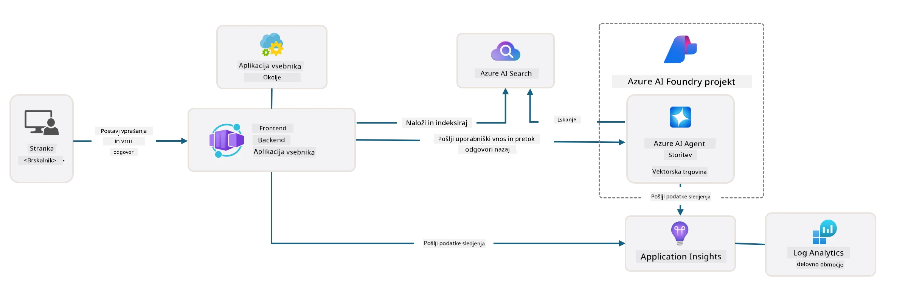

# 3. Razčleni predlogo

!!! tip "NA KONCU TEGA MODULA BOSTE ZMOGLI"

    - [ ] Aktivirati GitHub Copilot z MCP strežniki za pomoč pri Azure
    - [ ] Razumeti strukturo map AZD predloge in njene komponente
    - [ ] Raziščite vzorce organizacije infrastrukture kot kode (Bicep)
    - [ ] **Lab 3:** Uporabite GitHub Copilot za raziskovanje in razumevanje arhitekture repozitorija 

---


Z AZD predlogami in Azure Developer CLI (`azd`) lahko hitro pospešimo našo pot razvoja AI z uveljavljenimi repozitoriji, ki zagotavljajo vzorčno kodo, infrastrukturo in konfiguracijske datoteke - v obliki pripravljene za uvedbo _starter_ projekta.

**Zdaj pa moramo razumeti strukturo projekta in kodo ter biti sposobni prilagoditi AZD predlogo - brez predhodnih izkušenj ali znanja o AZD!**

---

## 1. Aktivirajte GitHub Copilot

### 1.1 Namestite GitHub Copilot Chat

Čas je, da raziščete [GitHub Copilot with Agent Mode](https://code.visualstudio.com/docs/copilot/chat/chat-agent-mode). Zdaj lahko z naravnim jezikom opišete svojo nalogo na visoki ravni in dobite pomoč pri izvajanju. Za ta laboratorij bomo uporabili [Copilot Free plan](https://github.com/github-copilot/signup), ki ima mesečno omejitev za zaključke in klepetalna opravila.

Razširitev je mogoče namestiti iz marketplace-a, vendar bi morala že biti na voljo v vašem Codespaces okolju. _Click `Open Chat` from the Copilot icon drop-down - and type a prompt like `What can you do?`_ - morda boste pozvani, da se prijavite. **GitHub Copilot Chat je pripravljen**.

### 1.2. Namestite MCP strežnike

Za učinkovito delovanje Agent moda potrebuje dostop do pravih orodij, ki mu pomagajo pridobiti znanje ali izvesti dejanja. Tu lahko pomagajo MCP strežniki. Konfigurirali bomo naslednje strežnike:

1. [Azure MCP Server](../../../../../workshop/docs/instructions)
1. [Microsoft Docs MCP Server](../../../../../workshop/docs/instructions)

Za aktivacijo teh:

1. Ustvarite datoteko z imenom `.vscode/mcp.json`, če ne obstaja
1. Kopirajte naslednje v to datoteko - in zaženite strežnike!
   ```json title=".vscode/mcp.json"
   {
      "servers": {
         "Azure MCP Server": {
            "command": "npx",
            "args": [
            "-y",
            "@azure/mcp@latest",
            "server",
            "start"
            ]
         },
         "microsoft.docs.mcp": {
            "type": "http",
            "url": "https://learn.microsoft.com/api/mcp"
         }
      }
   }
   ```

??? warning "Morda boste dobili napako, da `npx` ni nameščen (kliknite za razširitev popravka)"

      Za popravilo odprite datoteko `.devcontainer/devcontainer.json` in v razdelek features dodajte to vrstico. Nato ponovno zgradite kontejner. Sedaj bi morali imeti nameščen `npx`.

      ```title="" linenums="0"
         "features": {
            "ghcr.io/devcontainers/features/node:1": {},
            ...
         },
      ```

---

### 1.3. Preizkusite GitHub Copilot Chat

**Najprej za overitev z Azure uporabite `az login` iz ukazne vrstice VS Code.**

Zdaj bi morali biti sposobni preveriti stanje vaše Azure naročnine in zastaviti vprašanja o nameščenih virih ali konfiguraciji. Poskusite s temi pozivi:

1. `List my Azure resource groups`
1. `#foundry list my current deployments`

Lahko tudi vprašate o dokumentaciji Azure in dobite odgovore utemeljene v Microsoft Docs MCP strežniku. Poskusite s temi pozivi:

1. `#microsoft_docs_search What is Azure Developer CLI?`
1. `#microsoft_docs_search Show me a Python tutorial to chat with deployed model`

Lahko pa prosite za odlomke kode za dokončanje naloge. Poskusite s tem pozivom.

1. `Give me a Python code example that uses AAD for an interactive chat client`

V načinu `Ask` bo to zagotovilo kodo, ki jo lahko kopirate in preizkusite. V načinu `Agent` pa lahko to stori korak dlje in ustvari ustrezne vire za vas - vključno s skriptami za nastavitev in dokumentacijo - da vam pomaga izvesti to nalogo.

**Zdaj imate orodja, da začnete raziskovati predlogo repozitorija**

---

## 2. Razčlenite arhitekturo

??? prompt "ASK: Razložite arhitekturo aplikacije v docs/images/architecture.png v enem odstavku"

      Ta aplikacija je klepetalna aplikacija na osnovi umetne inteligence, zgrajena na Azure, ki prikazuje sodobno arhitekturo, osnovano na agentih. Rešitev je osredotočena na Azure Container App, ki gosti glavno kodo aplikacije in obdeluje uporabniški vnos ter generira inteligentne odzive prek AI agenta.
      
      Arhitektura izkorišča Microsoft Foundry Project kot temelj za AI zmožnosti in se povezuje z Azure AI Services, ki zagotavljajo osnovne jezikovne modele (kot je gpt-4.1-mini) in funkcionalnost agentov. Uporabniške interakcije tečejo skozi frontend na osnovi React do backend-a FastAPI, ki komunicira s storitvijo AI agentov za generiranje kontekstualnih odgovorov.
      
      Sistem vključuje zmožnosti pridobivanja znanja preko iskanja po datotekah ali storitve Azure AI Search, kar agentu omogoča dostop in citiranje informacij iz naloženih dokumentov. Za operativno odličnost arhitektura vključuje celovito spremljanje preko Application Insights in Log Analytics Workspace za sledenje, beleženje in optimizacijo delovanja.
      
      Azure Storage zagotavlja blob storage za podatke aplikacije in nalaganje datotek, medtem ko Managed Identity zagotavlja varen dostop med Azure viri brez shranjevanja poverilnic. Celotna rešitev je zasnovana za skalabilnost in vzdrževanje, saj se kontejnerizirana aplikacija samodejno prilagaja glede na povpraševanje in ponuja vgrajeno varnost, spremljanje in CI/CD zmogljivosti preko upravljanih Azure storitev.



---

## 3. Struktura repozitorija

!!! prompt "ASK: Razložite strukturo map predloge. Začnite z vizualnim hierarhičnim diagramom."

??? info "ANSWER: Vizualni hierarhični diagram"

      ```bash title="" 
      get-started-with-ai-agents/
      ├── 📋 Konfiguracija in nastavitev
      │   ├── azure.yaml                    # Konfiguracija Azure Developer CLI
      │   ├── docker-compose.yaml           # Lokalni razvojni kontejnerji
      │   ├── pyproject.toml                # Konfiguracija Python projekta
      │   ├── requirements-dev.txt          # Odvisnosti za razvoj
      │   └── .devcontainer/                # Nastavitev razvojnega kontejnerja VS Code
      │
      ├── 🏗️ Infrastruktura (infra/)
      │   ├── main.bicep                    # Glavna predloga infrastrukture
      │   ├── api.bicep                     # Viri specifični za API
      │   ├── main.parameters.json          # Parametri infrastrukture
      │   └── core/                         # Modularne infrastrukturne komponente
      │       ├── ai/                       # Konfiguracije AI storitev
      │       ├── host/                     # Infrastruktura gostovanja
      │       ├── monitor/                  # Nadzor in beleženje
      │       ├── search/                   # Nastavitev Azure AI Search
      │       ├── security/                 # Varnost in identiteta
      │       └── storage/                  # Konfiguracije računov za shranjevanje
      │
      ├── 💻 Izvor aplikacije (src/)
      │   ├── api/                          # Backend API
      │   │   ├── main.py                   # Vhodna točka aplikacije FastAPI
      │   │   ├── routes.py                 # Definicije poti API
      │   │   ├── search_index_manager.py   # Funkcionalnost iskanja
      │   │   ├── data/                     # Obdelava podatkov API
      │   │   ├── static/                   # Statične spletne datoteke
      │   │   └── templates/                # HTML predloge
      │   ├── frontend/                     # Frontend v React/TypeScript
      │   │   ├── package.json              # Odvisnosti Node.js
      │   │   ├── vite.config.ts            # Konfiguracija gradnje Vite
      │   │   └── src/                      # Izvorna koda frontenda
      │   ├── data/                         # Primeri podatkovnih datotek
      │   │   └── embeddings.csv            # Vnaprej izračunani embeddingi
      │   ├── files/                        # Datoteke znanja
      │   │   ├── customer_info_*.json      # Vzorci podatkov strank
      │   │   └── product_info_*.md         # Dokumentacija izdelka
      │   ├── Dockerfile                    # Konfiguracija kontejnerja
      │   └── requirements.txt              # Python odvisnosti
      │
      ├── 🔧 Avtomatizacija in skripte (scripts/)
      │   ├── postdeploy.sh/.ps1           # Nastavitev po uvedbi
      │   ├── setup_credential.sh/.ps1     # Konfiguracija poverilnic
      │   ├── validate_env_vars.sh/.ps1    # Preverjanje okolijskih spremenljivk
      │   └── resolve_model_quota.sh/.ps1  # Upravljanje kvot modelov
      │
      ├── 🧪 Testiranje in ocenjevanje
      │   ├── tests/                        # Enotski in integracijski testi
      │   │   └── test_search_index_manager.py
      │   ├── evals/                        # Okvir za ocenjevanje agentov
      │   │   ├── evaluate.py               # Zagon ocenjevanja
      │   │   ├── eval-queries.json         # Testne poizvedbe
      │   │   └── eval-action-data-path.json
      │   ├── sandbox/                      # Razvojno igrišče
      │   │   ├── 1-quickstart.py           # Primeri za začetek
      │   │   └── aad-interactive-chat.py   # Primeri za avtentikacijo
      │   └── airedteaming/                 # Ocenjevanje varnosti AI
      │       └── ai_redteaming.py          # Red team testiranje
      │
      ├── 📚 Dokumentacija (docs/)
      │   ├── deployment.md                 # Vodič za nameščanje
      │   ├── local_development.md          # Navodila za lokalni razvoj
      │   ├── troubleshooting.md            # Pogoste težave in rešitve
      │   ├── azure_account_setup.md        # Predpogoji za Azure račun
      │   └── images/                       # Sredstva dokumentacije
      │
      └── 📄 Metapodatki projekta
         ├── README.md                     # Pregled projekta
         ├── CODE_OF_CONDUCT.md           # Smernice skupnosti
         ├── CONTRIBUTING.md              # Navodila za prispevanje
         ├── LICENSE                      # Pogoji licence
         └── next-steps.md                # Navodila po uvedbi
      ```

### 3.1. Jedrna arhitektura aplikacije

Ta predloga sledi vzorcu **full-stack spletne aplikacije** z:

- **Backend**: Python FastAPI z integracijo Azure AI
- **Frontend**: TypeScript/React z Vite sistemom gradnje
- **Infrastruktura**: Azure Bicep predloge za oblačne vire
- **Kontejnerizacija**: Docker za konsistentno nameščanje

### 3.2 Infra kot koda (Bicep)

Plast infrastrukture uporablja **Azure Bicep** predloge, organizirane modularno:

   - **`main.bicep`**: Orkestrira vse Azure vire
   - **`core/` modules**: Znovuporabne komponente za različne storitve
      - AI storitve (Microsoft Foundry Models, AI Search)
      - Gostovanje kontejnerjev (Azure Container Apps)
      - Nadzor (Application Insights, Log Analytics)
      - Varnost (Key Vault, Managed Identity)

### 3.3 Izvor aplikacije (`src/`)

**Backend API (`src/api/`)**:

- REST API na osnovi FastAPI
- Integracija Foundry Agents
- Upravljanje iskalnih indeksov za pridobivanje znanja
- Možnosti nalaganja in obdelave datotek

**Frontend (`src/frontend/`)**:

- Sodobna React/TypeScript SPA
- Vite za hitro razvijanje in optimizirane gradnje
- Klepetalni vmesnik za interakcije z agentom

**Baza znanja (`src/files/`)**:

- Vzorčni podatki o strankah in izdelkih
- Prikazuje pridobivanje znanja iz datotek
- Primeri v formatih JSON in Markdown


### 3.4 DevOps in avtomatizacija

**Skripte (`scripts/`):**

- Večplatformne PowerShell in Bash skripte
- Preverjanje in nastavitev okolja
- Konfiguracija po uvedbi
- Upravljanje kvot modelov

**Integracija z Azure Developer CLI**:

- `azure.yaml` konfiguracija za `azd` delovne tokove
- Samodejno zagotavljanje in nameščanje
- Upravljanje okolijskih spremenljivk

### 3.5 Testiranje in zagotavljanje kakovosti

**Okvir za ocenjevanje (`evals/`)**:

- Ocenjevanje zmogljivosti agentov
- Testiranje kakovosti odgovorov na poizvedbe
- Samodejni postopek ocenjevanja

**Varnost AI (`airedteaming/`)**:

- Red team testiranje za varnost AI
- Skeniranje varnostnih ranljivosti
- Prakse odgovorne umetne inteligence

---

## 4. Čestitke 🏆

Uspešno ste uporabili GitHub Copilot Chat z MCP strežniki, da raziščete repozitorij.

- [X] Aktivirali ste GitHub Copilot za Azure
- [X] Razumeli ste arhitekturo aplikacije
- [X] Raziščili ste strukturo AZD predloge

To vam daje občutek o sredstvih _infrastruktura kot koda_ za to predlogo. Naslednje si bomo ogledali konfiguracijsko datoteko za AZD.

---

<!-- CO-OP TRANSLATOR DISCLAIMER START -->
**Izjava o omejitvi odgovornosti**:
Ta dokument je bil preveden s pomočjo storitve za prevajanje z umetno inteligenco [Co-op Translator](https://github.com/Azure/co-op-translator). Čeprav si prizadevamo za natančnost, prosimo upoštevajte, da lahko avtomatizirani prevodi vsebujejo napake ali netočnosti. Izvirni dokument v njegovem izvirnem jeziku je treba šteti za avtoritativni vir. Za kritične informacije priporočamo strokovni človeški prevod. Ne odgovarjamo za kakršnekoli nesporazume ali napačne interpretacije, ki bi izhajale iz uporabe tega prevoda.
<!-- CO-OP TRANSLATOR DISCLAIMER END -->