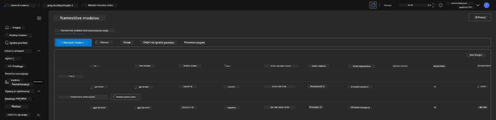
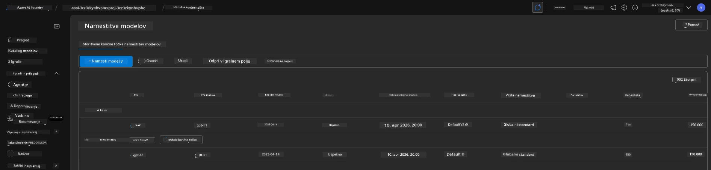

# 6. Odstranjevanje infrastrukture

!!! tip "DO KONCA TEGA MODULA BOSTE ZMOGLI"

    - [ ] Razumeti pomen čiščenja virov in upravljanja stroškov
    - [ ] Uporabiti `azd down` za varno odstranjevanje infrastrukture
    - [ ] Obnoviti mehko izbrisane storitve Cognitive Services, če bo potrebno
    - [ ] **Vaja 6:** Očistite vire Azure in preverite njihovo odstranitev

---

## Dodatne vaje

Preden odstranimo projekt, si vzemite nekaj minut za odprto raziskovanje.

!!! info "Preizkusite te raziskovalne predloge"

    **Eksperimentirajte z GitHub Copilot:**
    
    1. Ask: `Katere druge AZD predloge bi lahko preizkusil za scenarije z več agenti?`
    2. Ask: `Kako lahko prilagodim navodila agenta za primer uporabe v zdravstvu?`
    3. Ask: `Katere okoljske spremenljivke nadzorujejo optimizacijo stroškov?`
    
    **Raziskovanje Azure portala:**
    
    1. Preglejte metrike Application Insights za vašo namestitev
    2. Preverite analizo stroškov za dodeljene vire
    3. Še enkrat raziščite igrišče agentov na portalu Microsoft Foundry

---

## Odstranitev infrastrukture

1. Odstranjevanje infrastrukture je preprosto:
      
      ```bash title="" linenums="0"
      azd down --purge
      ```
1. Stikalo `--purge` zagotavlja, da prav tako trajno odstrani mehko izbrisane Cognitive Service vire, s čimer sprosti kvoto, ki jo ti viri zadržujejo. Ko je postopek končan, boste videli nekaj takega:
      
      ```bash title="" linenums="0"
      ? Total resources to delete: 11, are you sure you want to continue? Yes
      Deleting your resources can take some time.
      (✓) Done: Deleted resource group rg-nitya-mshack-azd
      (✓) Done: Purging Cognitive Account: aoai-3cz3zkynhvpbc

      SUCCESS: Your application was removed from Azure in 11 minutes 4 seconds.
      ```

1. (Izbirno) Če zdaj znova zaženete `azd up`, boste opazili, da se model gpt-4.1 namesti, ker je bila okoljska spremenljivka spremenjena (in shranjena) v lokalni mapi `.azure`. 

      Tukaj so namestitve modelov **pred**:

      

      In tukaj je **po**:
      

---

<!-- CO-OP TRANSLATOR DISCLAIMER START -->
**Izjava o omejitvi odgovornosti**:
Ta dokument je bil preveden z uporabo storitve za prevajanje z umetno inteligenco [Co-op Translator](https://github.com/Azure/co-op-translator). Čeprav si prizadevamo za natančnost, upoštevajte, da avtomatizirani prevodi lahko vsebujejo napake ali netočnosti. Izvirni dokument v njegovi izvorni različici naj se šteje za avtoritativni vir. Za pomembne informacije priporočamo strokovni človeški prevod. Ne odgovarjamo za kakršnekoli nesporazume ali napačne interpretacije, ki bi izhajale iz uporabe tega prevoda.
<!-- CO-OP TRANSLATOR DISCLAIMER END -->