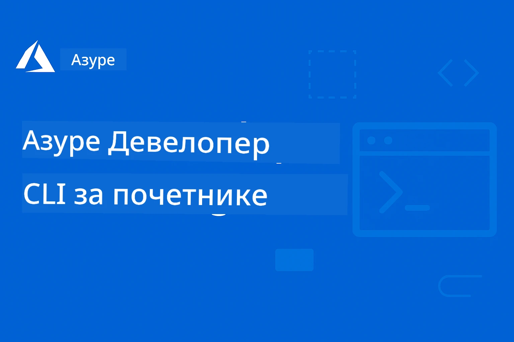

# AZD за почетнике: Структурирано учење

 

[](https://GitHub.com/microsoft/azd-for-beginners/watchers/)
[](https://GitHub.com/microsoft/azd-for-beginners/network/)
[](https://GitHub.com/microsoft/azd-for-beginners/stargazers/)

[](https://discord.gg/microsoft-azure)
[](https://discord.gg/nTYy5BXMWG)

## Почетак рада са овим курсом

Пратите ове кораке да започнете ваше AZD учење:

1. **Форкујте репозиторијум**: Кликните [](https://GitHub.com/microsoft/azd-for-beginners/fork)
2. **Клонирајте репозиторијум**: `git clone https://github.com/microsoft/azd-for-beginners.git`
3. **Придружите се заједници**: [Azure Discord заједнице](https://discord.com/invite/ByRwuEEgH4) за стручну подршку
4. **Изаберите свој пут учења**: Изаберите поглавље испод које одговара вашем нивоу искуства

### Подршка за више језика

#### Аутоматизовани преводи (увек ажурирани)

<!-- CO-OP TRANSLATOR LANGUAGES TABLE START -->
[Arabic](../ar/README.md) | [Bengali](../bn/README.md) | [Bulgarian](../bg/README.md) | [Burmese (Myanmar)](../my/README.md) | [Chinese (Simplified)](../zh-CN/README.md) | [Chinese (Traditional, Hong Kong)](../zh-HK/README.md) | [Chinese (Traditional, Macau)](../zh-MO/README.md) | [Chinese (Traditional, Taiwan)](../zh-TW/README.md) | [Croatian](../hr/README.md) | [Czech](../cs/README.md) | [Danish](../da/README.md) | [Dutch](../nl/README.md) | [Estonian](../et/README.md) | [Finnish](../fi/README.md) | [French](../fr/README.md) | [German](../de/README.md) | [Greek](../el/README.md) | [Hebrew](../he/README.md) | [Hindi](../hi/README.md) | [Hungarian](../hu/README.md) | [Indonesian](../id/README.md) | [Italian](../it/README.md) | [Japanese](../ja/README.md) | [Kannada](../kn/README.md) | [Korean](../ko/README.md) | [Lithuanian](../lt/README.md) | [Malay](../ms/README.md) | [Malayalam](../ml/README.md) | [Marathi](../mr/README.md) | [Nepali](../ne/README.md) | [Nigerian Pidgin](../pcm/README.md) | [Norwegian](../no/README.md) | [Persian (Farsi)](../fa/README.md) | [Polish](../pl/README.md) | [Portuguese (Brazil)](../pt-BR/README.md) | [Portuguese (Portugal)](../pt-PT/README.md) | [Punjabi (Gurmukhi)](../pa/README.md) | [Romanian](../ro/README.md) | [Russian](../ru/README.md) | [Serbian (Cyrillic)](./README.md) | [Slovak](../sk/README.md) | [Slovenian](../sl/README.md) | [Spanish](../es/README.md) | [Swahili](../sw/README.md) | [Swedish](../sv/README.md) | [Tagalog (Filipino)](../tl/README.md) | [Tamil](../ta/README.md) | [Telugu](../te/README.md) | [Thai](../th/README.md) | [Turkish](../tr/README.md) | [Ukrainian](../uk/README.md) | [Urdu](../ur/README.md) | [Vietnamese](../vi/README.md)

> **Превлачење локално?**

> Овај репозиторијум укључује преводе на преко 50 језика што значајно повећава величину преузимања. За клонирање без превода, користите sparse checkout:
> ```bash
> git clone --filter=blob:none --sparse https://github.com/microsoft/AZD-for-beginners.git
> cd AZD-for-beginners
> git sparse-checkout set --no-cone '/*' '!translations' '!translated_images'
> ```
> Ово вам даје све што вам је потребно да завршите курс уз знатно брже преузимање.
<!-- CO-OP TRANSLATOR LANGUAGES TABLE END -->

## Преглед курса

Мастер Azure Developer CLI (azd) кроз структурирана поглавља дизајнирана за прогресивно учење. **Посебан фокус на имплементацију AI апликација са интеграцијом Microsoft Foundry.**

### Зашто је овај курс важан за модерне програмере

На основу увида из Microsoft Foundry Discord заједнице, **45% програмера жели да користи AZD за AI радне токове** али се сусрећу са изазовима:
- Комплексне мултисервисне AI архитектуре
- Најбоље праксе за продукцијску имплементацију AI
- Интеграција и конфигурација Azure AI сервиса
- Оптимизација трошкова за AI радне токове
- Решавање проблема специфичних за AI имплементације

### Циљеви учења

Завршетком овог структурираног курса, моћи ћете да:
- **Мастер AZD основе**: Језгро појмова, инсталација и конфигурација
- **Имплементирате AI апликације**: Користите AZD са Microsoft Foundry сервисима
- **Имплементирате инфраструктуру као код**: Управљање Azure ресурсима преко Bicep шаблона
- **Решавате проблеме у имплементацији**: Дијагностикујете уобичајене проблеме
- **Оптимизујете за продукцију**: Безбедност, скалирање, праћење и управљање трошковима
- **Градите мулти-агент решења**: Имплементација сложених AI архитектура

## 📚 Поглавља за учење

*Изаберите свој пут учења на основу нивоа искуства и циљева*

### 🚀 Поглавље 1: Основе и брз почетак
**Претпоставке**: Azure претплата, основно знање командне линије  
**Трајање**: 30-45 минута  
**Комплексност**: ⭐

#### Шта ћете научити
- Основе Azure Developer CLI
- Инсталирање AZD на вашу платформу
- Ваша прва успешна имплементација

#### Ресурси за учење
- **🎯 Почните овде**: [Шта је Azure Developer CLI?](../..)
- **📖 Теорија**: [AZD основе](docs/getting-started/azd-basics.md) - Језгро појмова и терминологија
- **⚙️ Постављање**: [Инсталација и подешавање](docs/getting-started/installation.md) - Водичи за одређене платформе
- **🛠️ Практичан рад**: [Ваш први пројекат](docs/getting-started/first-project.md) - Упутство корак по корак
- **📋 Брз преглед**: [Командна табела](resources/cheat-sheet.md)

#### Практичне вежбе
```bash
# Брза провера инсталације
azd version

# Покрените вашу прву апликацију
azd init --template todo-nodejs-mongo
azd up
```

**💡 Резултат поглавља**: Успешно имплементирајте једноставну веб апликацију на Azure користећи AZD

**✅ Валидација успеха:**
```bash
# Након завршетка Поглавља 1, требало би да можете:
azd version              # Приказује инсталирану верзију
azd init --template todo-nodejs-mongo  # Иницијализује пројекат
azd up                  # Објављује на Azure
azd show                # Приказује URL активне апликације
# Апликација се отвара у прегледачу и ради
azd down --force --purge  # Чисти ресурсе
```

**📊 Уложено време:** 30-45 минута  
**📈 Ниво вештина након:** Може самостално имплементирати основне апликације

**✅ Валидација успеха:**
```bash
# Након завршетка Првог поглавља, требало би да будете у стању да:
azd version              # Приказује инсталирану верзију
azd init --template todo-nodejs-mongo  # Иницијализује пројекат
azd up                  # Деплојује на Azure
azd show                # Приказује URL активне апликације
# Апликација се отвара у прегледачу и ради
azd down --force --purge  # Чисти ресурсе
```

**📊 Уложено време:** 30-45 минута  
**📈 Ниво вештина након:** Може самостално имплементирати основне апликације

---

### 🤖 Поглавље 2: Развој са фокусом на AI (препоручено за AI програмере)
**Претпоставке**: Поглавље 1 завршено  
**Трајање**: 1-2 сата  
**Комплексност**: ⭐⭐

#### Шта ћете научити
- Интеграција Microsoft Foundry са AZD-ом
- Имплементација AI-управљаних апликација
- Разумевање конфигурације AI сервиса

#### Ресурси за учење
- **🎯 Почните овде**: [Microsoft Foundry интеграција](docs/microsoft-foundry/microsoft-foundry-integration.md)
- **📖 Обрасци**: [Имплементација AI модела](docs/microsoft-foundry/ai-model-deployment.md) - Имплементирајте и управљајте AI моделима
- **🛠️ Радна радионица**: [AI Workshop Lab](docs/microsoft-foundry/ai-workshop-lab.md) - Припремите своја AI решења за AZD
- **🎥 Интерактивни водич**: [Материјали радионице](workshop/README.md) - Учење у претраживачу уз MkDocs * DevContainer окружење
- **📋 Шаблони**: [Microsoft Foundry шаблони](../..)
- **📝 Примери**: [AZD примери имплементације](examples/README.md)

#### Практичне вежбе
```bash
# Распоредите вашу прву АИ апликацију
azd init --template azure-search-openai-demo
azd up

# Испробајте додатне АИ шаблоне
azd init --template openai-chat-app-quickstart
azd init --template agent-openai-python-prompty
```

**💡 Резултат поглавља**: Имплементирајте и конфигуришите AI-управљану чат апликацију са RAG функционалностима

**✅ Валидација успеха:**
```bash
# Након Другог поглавља, требало би да будете у могућности да:
azd init --template azure-search-openai-demo
azd up
# Тестирате AI чет интерфејс
# Постављате питања и добијате одговоре уз помоћ AI-а са изворима
# Проверите да ли интеграција претраге ради
azd monitor  # Проверите да ли Application Insights приказује телеметрију
azd down --force --purge
```

**📊 Уложено време:** 1-2 сата  
**📈 Ниво вештина након:** Може самостално имплементирати и конфигурисати AI апликације спремне за продукцију  
**💰 Свест о трошковима:** Разуме трошкове развоја од 80-150$ месечно и трошкове продукције 300-3500$ месечно

#### 💰 Разматрања трошкова за AI имплементације

**Развојно окружење (процењено 80-150$ месечно):**
- Azure OpenAI (плаћање по коришћењу): 0-50$ месечно (у зависности од броја токена)
- AI Search (основни ниво): 75$ месечно
- Container Apps (конзумација): 0-20$ месечно
- Складиштење (стандардно): 1-5$ месечно

**Продукцијско окружење (процењено 300-3,500+ $ месечно):**
- Azure OpenAI (PTU за конзистентне перформансе): 3,000+ $ месечно ИЛИ плаћање по коришћењу са великим обимом
- AI Search (стандардни ниво): 250$ месечно
- Container Apps (посвећено): 50-100$ месечно
- Application Insights: 5-50$ месечно
- Складиштење (премиум): 10-50$ месечно

**💡 Савети за оптимизацију трошкова:**
- Користите **Free Tier** Azure OpenAI за учење (укључено 50,000 токена месечно)
- Покрените `azd down` да бисте ослободили ресурсе када не развијате активно
- Почните са конзумацијским моделом плаћања, PTU користите само за продукцију
- Користите `azd provision --preview` да процените трошкове пре имплементације
- Омогућите аутоматско скалирање: плаћате само за стварну употребу

**Праћење трошкова:**
```bash
# Провери процењене месечне трошкове
azd provision --preview

# Праћење стварних трошкова у Azure Порталу
az consumption budget list --resource-group <your-rg>
```

---

### ⚙️ Поглавље 3: Конфигурација и аутентикација
**Претпоставке**: Поглавље 1 завршено  
**Трајање**: 45-60 минута  
**Комплексност**: ⭐⭐

#### Шта ћете научити
- Конфигурација и управљање окружењима
- Најбоље праксе за аутентикацију и безбедност
- Именовање и организација ресурса

#### Ресурси за учење
- **📖 Конфигурација**: [Водич за конфигурацију](docs/getting-started/configuration.md) - Постављање окружења
- **🔐 Безбедност**: [Обрасци за аутентикацију и Managed Identity](docs/getting-started/authsecurity.md) - Обрасци за аутентикацију
- **📝 Примери**: [Пример базе података](examples/database-app/README.md) - AZD примери са базом података

#### Практичне вежбе
- Конфигуришите више окружења (dev, staging, prod)
- Поставите аутентикацију помоћу Managed Identity
- Имплементирајте конфигурације специфичне за окружење

**💡 Резултат поглавља**: Успешно управљајте вишеструким окружењима са исправном аутентикацијом и безбедношћу

---

### 🏗️ Поглавље 4: Инфраструктура као код и имплементација
**Претпоставке**: Поглавља 1-3 завршена  
**Трајање**: 1-1.5 сата  
**Комплексност**: ⭐⭐⭐

#### Шта ћете научити
- Напредни обрасци имплементације
- Инфраструктура као код помоћу Bicep-а
- Стратегије за управљање ресусрсима

#### Ресурси за учење
- **📖 Имплементација**: [Водич за имплементацију](docs/deployment/deployment-guide.md) - Комплетни токови рада
- **🏗️ Provisioning**: [Provisioning ресурса](docs/deployment/provisioning.md) - Управљање Azure ресурсима
- **📝 Примери**: [Пример Container App](../../examples/container-app) - Имплементације у контејнеру

#### Практичне вежбе
- Креирајте прилагођене Bicep шаблоне
- Имплементирајте мултисервисне апликације
- Имплементирајте blue-green стратегије имплементације

**💡 Резултат поглавља**: Имплементирајте сложене мултисервисне апликације користећи прилагођене инфраструктурне шаблоне

---

### 🎯 Поглавље 5: Мулти-агентска AI решења (напредно)
**Претпоставке**: Поглавља 1-2 завршена  
**Трајање**: 2-3 сата  
**Комплексност**: ⭐⭐⭐⭐
#### Шта ћете научити
- Обрасци мулти-агентске архитектуре
- Оркестрација и координација агената
- Производна спремна AI решења

#### Ресурси за учење
- **🤖 Истакнути пројекат**: [Решење за трговину са више агената](examples/retail-scenario.md) - Комплетна имплементација
- **🛠️ ARM шаблони**: [Пакет ARM шаблона](../../examples/retail-multiagent-arm-template) - Инсталација једним кликом
- **📖 Архитектура**: [Обрасци координације више агената](/docs/pre-deployment/coordination-patterns.md) - Обрасци

#### Практичне вежбе
```bash
# Распореди потпуно решење за малопродају са више агената
cd examples/retail-multiagent-arm-template
./deploy.sh

# Истражи конфигурације агената
az deployment group show --resource-group <rg-name> --name <deployment-name>
```

**💡 Резултат поглавља**: Размештање и управљање мулти-агент AI решењем спремним за производњу са агентима за Купце и Инвентар

---

### 🔍 Поглавље 6: Валидација и планирање пре размештања
**Претпоставке**: Завршено поглавље 4  
**Трајање**: 1 сат  
**Комплексност**: ⭐⭐

#### Шта ћете научити
- Планирање капацитета и валидација ресурса
- Стратегије селекције SKU
- Провере пре лансирања и аутоматизација

#### Ресурси за учење
- **📊 Планирање**: [Планирање капацитета](docs/pre-deployment/capacity-planning.md) - Валидација ресурса
- **💰 Селекција**: [Избор SKU](docs/pre-deployment/sku-selection.md) - Исплативи избори
- **✅ Валидација**: [Провере пре лета](docs/pre-deployment/preflight-checks.md) - Аутоматизовани скрипти

#### Практичне вежбе
- Покрени скрипте за валидацију капацитета
- Оптимизуј изборе SKU по цени
- Имплементирај аутоматизоване провере пре размештања

**💡 Резултат поглавља**: Валидација и оптимизација размештања пре извршења

---

### 🚨 Поглавље 7: Решавање проблема и дебаговање
**Претпоставке**: Завршено било које поглавље о размештању  
**Трајање**: 1-1.5 сати  
**Комплексност**: ⭐⭐

#### Шта ћете научити
- Систематске приступе дебаговању
- Уобичајени проблеми и решења
- Решавање проблема специфичних за AI

#### Ресурси за учење
- **🔧 Чести проблеми**: [Чести проблеми](docs/troubleshooting/common-issues.md) - ЧПП и решења
- **🕵️ Дебаговање**: [Водич за дебаговање](docs/troubleshooting/debugging.md) - Стратегије корак по корак
- **🤖 AI проблеми**: [Специфично за AI](docs/troubleshooting/ai-troubleshooting.md) - Проблеми AI сервиса

#### Практичне вежбе
- Дијагностикуј отказе у размештању
- Решавање проблема са аутентификацијом
- Дебаговање повезаности AI сервиса

**💡 Резултат поглавља**: Самостално дијагностиковање и решавање уобичајених проблема у размештању

---

### 🏢 Поглавље 8: Обрасци за производњу и предузећа
**Претпоставке**: Завршена поглавља 1-4  
**Трајање**: 2-3 сата  
**Комплексност**: ⭐⭐⭐⭐

#### Шта ћете научити
- Стратегије производног размештања
- Обрасци безбедности за предузећа
- Праћење и оптимизација трошкова

#### Ресурси за учење
- **🏭 Производња**: [Најбоље праксе производње AI](docs/microsoft-foundry/production-ai-practices.md) - Обрасци за предузећа
- **📝 Примери**: [Пример микросервиса](../../examples/microservices) - Комплексне архитектуре
- **📊 Праћење**: [Интеграција Application Insights](docs/pre-deployment/application-insights.md) - Праћење

#### Практичне вежбе
- Имплементирај обрасце безбедности предузећа
- Постави свеобухватно праћење
- Размешти у производњу са адекватном контролом

**💡 Резултат поглавља**: Размештање апликација спремних за предузећа са пуним карактеристикама производње

---

## 🎓 Преглед радионице: Практично учење

> **⚠️ СТАТУС РАДИОНИЦЕ: Активни развој**  
> Материјали радионице су у развоју и дорађивању. Основни модули су функционални, али неке напредне секције су непотпуне. Интензивно радимо на завршетку свих садржаја. [Пратите напредак →](workshop/README.md)

### Интерактивни материјали радионице
**Свеобухватно практично учење са алатима у прегледачу и вођеним вежбама**

Материјали радионице пружају структуриран и интерактиван начин учења који допуњује горњи програм по поглављима. Радионица је осмишљена за самостално учење и вођене сесије.

#### 🛠️ Карактеристике радионице
- **Интерфејс у прегледачу**: Потпуна MkDocs радионица са претрагом, копирањем и темама
- **GitHub Codespaces интеграција**: Постављање окружења за развој једним кликом
- **Структуриран пут учења**: 7 корака вођених вежби (укупно 3,5 сати)
- **Откривање → Размештање → Прилагођавање**: Прогресивна методологија
- **Интерактивно DevContainer окружење**: Предконфигурисани алати и зависности

#### 📚 Структура радионице
Радионица следи методологију **Откривање → Размештање → Прилагођавање**:

1. **Фаза откривања** (45 минута)
   - Истражи Microsoft Foundry шаблоне и услуге
   - Разумевање образаца мулти-агентске архитектуре
   - Преглед захтева и претпоставки за размештање

2. **Фаза размештања** (2 сата)
   - Практично размештање AI апликација са AZD
   - Конфигурисање Azure AI услуга и крајњих тачака
   - Имплементација образаца безбедности и аутентификације

3. **Фаза прилагођавања** (45 минута)
   - Измена апликација за специфичне случајеве коришћења
   - Оптимизација за производно размештање
   - Имплементација праћења и управљања трошковима

#### 🚀 Почетак рада са радионицом
```bash
# Опција 1: GitHub Codespaces (препоручено)
# Кликните на "Code" → "Create codespace on main" у репозиторијуму

# Опција 2: Локални развој
git clone https://github.com/microsoft/azd-for-beginners.git
cd azd-for-beginners/workshop
# Пратите упутства за подешавање у workshop/README.md
```

#### 🎯 Резултати учења радионице
Завршавањем радионице, учесници ће:
- **Размештати производне AI апликације**: Користећи AZD и Microsoft Foundry услуге
- **Мајсторити мулти-агентске архитектуре**: Имплементирати координирана AI решења агената
- **Примeнити најбоље безбедносне праксе**: Конфигурисати аутентификацију и контролу приступа
- **Оптимизовати за скалирање**: Дизајнирати исплативе и перформантне развоје
- **Решавати проблеме у размештању**: Самостално решавати уобичајене проблеме

#### 📖 Ресурси радионице
- **🎥 Интерактивни водич**: [Материјали радионице](workshop/README.md) - Окружење за учење у прегледачу
- **📋 Упутства корак по корак**: [Вођене вежбе](../../workshop/docs/instructions) - Детаљни кораци
- **🛠️ AI радионичарска лабораторија**: [AI Workshop Lab](docs/microsoft-foundry/ai-workshop-lab.md) - AI фокусиране вежбе
- **💡 Брзо покретање**: [Водич за постављање радионице](workshop/README.md#quick-start) - Конфигурација окружења

**Идеално за**: Корпоративну обуку, универзитетске курсеве, самостално учење и програме обуке програмера.

---

## 📖 Шта је Azure Developer CLI?

Azure Developer CLI (azd) је командна линија оријентисана ка програмерима која убрзава процес израде и размештања апликација на Azure платформу. Пружа:

- **Размештања заснована на шаблонима** - Користи унапред припремљене шаблоне за уобичајене апликације
- **Инфраструктура као код** - Управља Azure ресурсима помоћу Bicep-а или Terraform-а  
- **Интегрисане радне токове** - Беспрекорно провизионира, размешта и прати апликације
- **Пријатељски према програмерима** - Оптимизован за продуктивност и кориснички доживљај програмера

### **AZD + Microsoft Foundry: Идеално за AI размештања**

**Зашто AZD за AI решења?** AZD решава главне изазове са којима се сусрећу AI програмери:

- **AI-спремни шаблони** - Предконфигурисани шаблони за Azure OpenAI, Cognitive Services и ML радне задатке
- **Безбедна AI размештања** - Уграђени безбедносни образци за AI услуге, API кључеве и крајње тачке модела  
- **Производни AI обрасци** - Најбоље праксе за скалабилна и исплатива AI решења
- **Крај-до-крај AI радни токови** - Од развоја модела до производног размештања са праћењем
- **Оптимизација трошкова** - Паметне стратегије распореда ресурса и скалирања за AI радне задатке
- **Интеграција са Microsoft Foundry** - Беспрекорно повезивање са Microsoft Foundry каталогом модела и крајњим тачкама

---

## 🎯 Библиотека шаблона и примера

### Истакнуто: Microsoft Foundry шаблони
**Почните овде ако размешћујете AI апликације!**

> **Напомена:** Ови шаблони демонстрирају различите AI образце. Неки су Azure узорци са спољних репозиторијума, други локалне имплементације.

| Шаблон | Поглавље | Комплексност | Услуге | Тип |
|--------|----------|--------------|--------|-----|
| [**Започни са AI ћаскањем**](https://github.com/Azure-Samples/get-started-with-ai-chat) | Поглавље 2 | ⭐⭐ | AzureOpenAI + Azure AI Model Inference API + Azure AI Search + Azure Container Apps + Application Insights | Спољни |
| [**Започни са AI агентима**](https://github.com/Azure-Samples/get-started-with-ai-agents) | Поглавље 2 | ⭐⭐ | Azure AI Agent Service + AzureOpenAI + Azure AI Search + Azure Container Apps + Application Insights| Спољни |
| [**Azure Search + OpenAI демонстрација**](https://github.com/Azure-Samples/azure-search-openai-demo) | Поглавље 2 | ⭐⭐ | AzureOpenAI + Azure AI Search + App Service + Storage | Спољни |
| [**OpenAI Chat App Quickstart**](https://github.com/Azure-Samples/openai-chat-app-quickstart) | Поглавље 2 | ⭐ | AzureOpenAI + Container Apps + Application Insights | Спољни |
| [**Agent OpenAI Python Prompty**](https://github.com/Azure-Samples/agent-openai-python-prompty) | Поглавље 5 | ⭐⭐⭐ | AzureOpenAI + Azure Functions + Prompty | Спољни |
| [**Contoso Chat RAG**](https://github.com/Azure-Samples/contoso-chat) | Поглавље 8 | ⭐⭐⭐⭐ | AzureOpenAI + AI Search + Cosmos DB + Container Apps | Спољни |
| [**Решење за трговину са више агената**](examples/retail-scenario.md) | Поглавље 5 | ⭐⭐⭐⭐ | AzureOpenAI + AI Search + Storage + Container Apps + Cosmos DB | **Локални** |

### Истакнуто: Комплетни сценарији за учење
**Шаблони апликација спремних за производњу мапирани на наставне јединице**

| Шаблон | Поглавље за учење | Комплексност | Кључно учење |
|--------|-------------------|--------------|--------------|
| [**openai-chat-app-quickstart**](https://github.com/Azure-Samples/openai-chat-app-quickstart) | Поглавље 2 | ⭐ | Основни обрасци AI размештања |
| [**azure-search-openai-demo**](https://github.com/Azure-Samples/azure-search-openai-demo) | Поглавље 2 | ⭐⭐ | RAG имплементација са Azure AI Search |
| [**ai-document-processing**](https://github.com/Azure-Samples/ai-document-processing) | Поглавље 4 | ⭐⭐ | Интеграција са Document Intelligence |
| [**agent-openai-python-prompty**](https://github.com/Azure-Samples/agent-openai-python-prompty) | Поглавље 5 | ⭐⭐⭐ | Фрејмворк агената и позивање функција |
| [**contoso-chat**](https://github.com/Azure-Samples/contoso-chat) | Поглавље 8 | ⭐⭐⭐ | Оркестрација AI за предузећа |
| [**retail-multi-agent-solution**](examples/retail-scenario.md) | Поглавље 5 | ⭐⭐⭐⭐ | Мулти-агентска архитектура са агентима за Купце и Инвентар |

### Учите преко примера

> **📌 Локални у односу на спољне примере:**  
> **Локални примери** (у овом репозиторијуму) = Одмах спремни за употребу  
> **Спољни примери** (Azure узорци) = Клонирајте са наведених репозиторијума

#### Локални примери (Одмах спремни)
- [**Решење за трговину са више агената**](examples/retail-scenario.md) - Комплетна производна имплементација са ARM шаблонима
  - Мулти-агентска архитектура (Купац + Инвентар агенти)
  - Свеобухватно праћење и евалуација
  - Један клик за размештање преко ARM шаблона

#### Локални примери - Контейнер апликације (Поглавља 2-5)
**Свеобухватни примери размештања контејнера у овом репозиторијуму:**
- [**Примери Container App**](examples/container-app/README.md) - Комплетан водич за контейнеризована размештања
  - [Једноставан Flask API](../../examples/container-app/simple-flask-api) - Основни REST API са скалирањем на нулу
  - [Архитектура микросервиса](../../examples/container-app/microservices) - Производно спремно мулти-сервисно размештање
  - Брзи почетак, производња и напредни обрасци размештања
  - Водич за праћење, безбедност и оптимизацију трошкова

#### Спољни примери - Једноставне апликације (Поглавља 1-2)
**Клонирајте ове Azure узорке да започнете:**
- [Једноставна веб апликација - Node.js + MongoDB](https://github.com/Azure-Samples/todo-nodejs-mongo) - Основни обрасци размештања
- [Статички сајт - React SPA](https://github.com/Azure-Samples/todo-csharp-sql-swa-func) - Размештање статичког садржаја
- [Container App - Python Flask](https://github.com/Azure-Samples/container-apps-store-api-microservice) - Размештање REST API

#### Спољни примери - Интеграција са базама података (Поглавља 3-4)  
- [Апликација са базом података - C# + SQL](https://github.com/Azure-Samples/todo-csharp-sql) - Обрасци повезивања са базом
- [Функције + Cosmos DB](https://github.com/Azure-Samples/todo-python-mongo-swa-func) - Serverless радни токови података

#### Спољни примери - Напредни обрасци (Поглавља 4-8)
- [Java микросервиси](https://github.com/Azure-Samples/java-microservices-aca-lab) - Мулти-сервисне архитектуре
- [Container Apps Jobs](https://github.com/Azure-Samples/container-apps-jobs) - Позадинска обрада  
- [Enterprise ML Pipeline](https://github.com/Azure-Samples/mlops-v2) - Производно спремни ML образци

### Колекције спољних шаблона
- [**Званична AZD галерија шаблона**](https://azure.github.io/awesome-azd/) - Курирана колекција званичних и заједничких шаблона
- [**Azure Developer CLI Templates**](https://learn.microsoft.com/en-us/azure/developer/azure-developer-cli/azd-templates) - Microsoft Learn документација за шаблоне  
- [**Examples Directory**](examples/README.md) - Локални примери за учење са детаљним објашњењима

---

## 📚 Ресурси за учење и референце

### Брзе референце
- [**Command Cheat Sheet**](resources/cheat-sheet.md) - Основне azd команде организоване по поглављима  
- [**Glossary**](resources/glossary.md) - Терминологија Azure и azd  
- [**FAQ**](resources/faq.md) - Честа питања организована по поглављима за учење  
- [**Study Guide**](resources/study-guide.md) - Комплетне вежбе за праксу

### Практичне радионице
- [**AI Workshop Lab**](docs/microsoft-foundry/ai-workshop-lab.md) - Направите своја AI решења која се могу AZD-ом дејловати (2-3 сата)  
- [**Interactive Workshop Guide**](workshop/README.md) - Радионица у прегледачу са MkDocs и DevContainer окружењем  
- [**Structured Learning Path**](../../workshop/docs/instructions) - 7 корака вођених вежби (Откривање → Деплојмент → Прилагођавање)  
- [**AZD For Beginners Workshop**](workshop/README.md) - Потпуни материјали за радионицу са GitHub Codespaces интеграцијом

### Спољни ресурси за учење
- [Azure Developer CLI Documentation](https://learn.microsoft.com/en-us/azure/developer/azure-developer-cli/)  
- [Azure Architecture Center](https://learn.microsoft.com/en-us/azure/architecture/)  
- [Azure Pricing Calculator](https://azure.microsoft.com/pricing/calculator/)  
- [Azure Status](https://status.azure.com/)

---

## 🔧 Брз водич за решавање проблема

**Чести проблеми са којима се почетници сусрећу и тренутна решења:**

### ❌ "azd: command not found"

```bash
# Прво инсталирајте AZD
# Виндоус (ПоверШел):
winget install microsoft.azd

# мацОС:
brew tap azure/azd && brew install azd

# Линукс:
curl -fsSL https://aka.ms/install-azd.sh | bash

# Проверите инсталацију
azd version
```
  
### ❌ "No subscription found" or "Subscription not set"

```bash
# Листа доступних претплата
az account list --output table

# Подеси подразумевану претплату
az account set --subscription "<subscription-id-or-name>"

# Подеси за AZD окружење
azd env set AZURE_SUBSCRIPTION_ID "<subscription-id>"

# Верификуј
az account show
```
  
### ❌ "InsufficientQuota" or "Quota exceeded"

```bash
# Покушајте другу Azure регију
azd env set AZURE_LOCATION "westus2"
azd up

# Или користите мање SKUs у развоју
# Уреди infra/main.parameters.json:
{
  "sku": "B1"  // Instead of "P1V2"
}
```
  
### ❌ "azd up" fails halfway through

```bash
# Опција 1: Очисти и покушај поново
azd down --force --purge
azd up

# Опција 2: Само поправи инфратсруктуру
azd provision

# Опција 3: Провери детаљне записнике
azd show
azd logs
```
  
### ❌ "Authentication failed" or "Token expired"

```bash
# Поново аутентификујте се
az logout
az login

azd auth logout
azd auth login

# Потврдите аутентификацију
az account show
```
  
### ❌ "Resource already exists" or naming conflicts

```bash
# AZD генерише јединствена имена, али ако дође до конфликта:
azd down --force --purge

# Онда покушај поново са новом средином
azd env new dev-v2
azd up
```
  
### ❌ Template deployment taking too long

**Нормално време чекања:**  
- Једноставна веб апликација: 5-10 минута  
- Апликација са базом података: 10-15 минута  
- AI апликације: 15-25 минута (Обезбеђење OpenAI-а је споро)

```bash
# Провери напретак
azd show

# Ако си заглављен >30 минута, провери Azure портал:
azd monitor
# Потражи неуспеле имплементације
```
  
### ❌ "Permission denied" or "Forbidden"

```bash
# Проверите своју Azure улогу
az role assignment list --assignee $(az account show --query user.name -o tsv)

# Потребна вам је најмање улога "Contributor"
# Замолите Azure администратора да додели:
# - Contributor (за ресурсе)
# - User Access Administrator (за додељивање улога)
```
  
### ❌ Can't find deployed application URL

```bash
# Прикажи све сервисне крајње тачке
azd show

# Или отвори Azure портал
azd monitor

# Провери конкретан сервис
azd env get-values
# Потражи променљиве *_URL
```
  
### 📚 Пуни ресурси за решавање проблема

- **Водич за честе проблеме:** [Детаљна решења](docs/troubleshooting/common-issues.md)  
- **AI специфични проблеми:** [AI решавање проблема](docs/troubleshooting/ai-troubleshooting.md)  
- **Водич за дебаговање:** [Корак по корак дебаговање](docs/troubleshooting/debugging.md)  
- **Тражите помоћ:** [Azure Discord](https://discord.gg/microsoft-azure) #azure-developer-cli

---

## 🔧 Брз водич за решавање проблема

**Чести проблеми са којима се почетници сусрећу и тренутна решења:**

<details>
<summary><strong>❌ "azd: command not found"</strong></summary>

```bash
# Прво инсталирајте AZD
# Windows (PowerShell):
winget install microsoft.azd

# macOS:
brew tap azure/azd && brew install azd

# Linux:
curl -fsSL https://aka.ms/install-azd.sh | bash

# Потврдите инсталацију
azd version
```
</details>

<details>
<summary><strong>❌ "No subscription found" or "Subscription not set"</strong></summary>

```bash
# Прикажи доступне претплате
az account list --output table

# Подеси подразумевану претплату
az account set --subscription "<subscription-id-or-name>"

# Подеси за AZD окружење
azd env set AZURE_SUBSCRIPTION_ID "<subscription-id>"

# Верификуј
az account show
```
</details>

<details>
<summary><strong>❌ "InsufficientQuota" or "Quota exceeded"</strong></summary>

```bash
# Испробајте различити Azure регион
azd env set AZURE_LOCATION "westus2"
azd up

# Или користите мање SKU-ове у развоју
# Уредите infra/main.parameters.json:
{
  "sku": "B1"  // Instead of "P1V2"
}
```
</details>

<details>
<summary><strong>❌ "azd up" fails halfway through</strong></summary>

```bash
# Опција 1: Очисти и покушај поново
azd down --force --purge
azd up

# Опција 2: Само поправи инфраструктуру
azd provision

# Опција 3: Провери детаљне логове
azd show
azd logs
```
</details>

<details>
<summary><strong>❌ "Authentication failed" or "Token expired"</strong></summary>

```bash
# Поново аутентификујте се
az logout
az login

azd auth logout
azd auth login

# Потврдите аутентификацију
az account show
```
</details>

<details>
<summary><strong>❌ "Resource already exists" or naming conflicts</strong></summary>

```bash
# AZD генерише јединствене називе, али ако дође до конфликта:
azd down --force --purge

# Онда покушај поново са новом околином
azd env new dev-v2
azd up
```
</details>

<details>
<summary><strong>❌ Template deployment taking too long</strong></summary>

**Нормално време чекања:**  
- Једноставна веб апликација: 5-10 минута  
- Апликација са базом података: 10-15 минута  
- AI апликације: 15-25 минута (Обезбеђење OpenAI-а је споро)

```bash
# Провери напредак
azd show

# Ако заглавите више од 30 минута, провери Azure портал:
azd monitor
# Потражите неуспеле имплементације
```
</details>

<details>
<summary><strong>❌ "Permission denied" or "Forbidden"</strong></summary>

```bash
# Проверите вашу Azure улогу
az role assignment list --assignee $(az account show --query user.name -o tsv)

# Потребна вам је барем улога "Contributor"
# Замолите Azure администратора да додели:
# - Contributor (за ресурсе)
# - User Access Administrator (за доделу улога)
```
</details>

<details>
<summary><strong>❌ Can't find deployed application URL</strong></summary>

```bash
# Прикажи све сервисне крајње тачке
azd show

# Или отвори Azure портал
azd monitor

# Провери одређени сервис
azd env get-values
# Потражи *_URL променљиве
```
</details>

### 📚 Пуни ресурси за решавање проблема

- **Водич за честе проблеме:** [Детаљна решења](docs/troubleshooting/common-issues.md)  
- **AI специфични проблеми:** [AI решавање проблема](docs/troubleshooting/ai-troubleshooting.md)  
- **Водич за дебаговање:** [Корак по корак дебаговање](docs/troubleshooting/debugging.md)  
- **Тражите помоћ:** [Azure Discord](https://discord.gg/microsoft-azure) #azure-developer-cli

---

## 🎓 Завршетак курса и сертификат

### Праћење напретка
Пратите свој напредак кроз сва поглавља:

- [ ] **Поглавље 1**: Основа и брзи почетак ✅  
- [ ] **Поглавље 2**: AI-први развој ✅  
- [ ] **Поглавље 3**: Конфигурација и аутентификација ✅  
- [ ] **Поглавље 4**: Инфраструктура као код и деплојмент ✅  
- [ ] **Поглавље 5**: Мулти-агент AI решења ✅  
- [ ] **Поглавље 6**: Валидација и планирање пре деплојмента ✅  
- [ ] **Поглавље 7**: Решавање проблема и дебаговање ✅  
- [ ] **Поглавље 8**: Обрасци за продукцију и предузећа ✅

### Верификација учења
Након сваког поглавља проверите своје знање тако што ћете:  
1. **Практичну вежбу**: Завршити практични део поглавља  
2. **Проверу знања**: Прегледати FAQ одељак за то поглавље  
3. **Заједницу**: Поделити искуства у Azure Discord заједници  
4. **Следеће поглавље**: Прећи на наредни ниво сложености

### Предности завршетка курса  
Након завршетка свих поглавља, имаћете:  
- **Искуство у продукцији**: Размењене стварне AI апликације на Azure  
- **Професионалне вештине**: Способности за предузетнички деплојмент  
- **Признатост у заједници**: Активни члан Azure developers заједнице  
- **Напредак у каријери**: Тражене AZD и AI експертизе за деплојмент

---

## 🤝 Заједница и подршка

### Тражите помоћ и подршку
- **Технички проблеми**: [Пријавите багове и захтеве за нове функције](https://github.com/microsoft/azd-for-beginners/issues)  
- **Питања о учењу**: [Microsoft Azure Discord заједница](https://discord.gg/microsoft-azure) и [](https://discord.gg/nTYy5BXMWG)  
- **AI-специфична помоћ**: Придружите се [](https://discord.gg/nTYy5BXMWG)  
- **Документација**: [Званична документација за Azure Developer CLI](https://learn.microsoft.com/en-us/azure/developer/azure-developer-cli/)

### Упутства заједнице из Microsoft Foundry Discord-а

**Резултати недавне анкете на #Azure каналу:**  
- **45%** програмера жели да користи AZD за AI задатке  
- **Главни изазови:** Мулти-сервизни деплојменти, управљање креденцијалима, спремност за продукцију  
- **Најчешће тражено:** AI-специфични шаблони, водичи за решавање проблема, најбоље праксе

**Придружите се нашој заједници да:**  
- Делите своја AZD + AI искуства и добијете помоћ  
- Приступите раним прегледима нових AI шаблона  
- Допринесете најбољим праксама за AI деплојмент  
- Утичете на будући развој AI + AZD функција

### Допринос курсу  
Добро дошли сте да допринесете! Молимо вас да прочитате наш [Водич за допринос](CONTRIBUTING.md) за детаље о:  
- **Побољшању садржаја**: Унапређујте постојећа поглавља и примере  
- **Нови примери**: Додајте стварне сценарије и шаблоне  
- **Превод**: Помозите у одржавању подршке за више језика  
- **Пријаве багова**: Побољшајте прецизност и јасноћу  
- **Стандарди заједнице**: Пратите наше инклузивне смернице заједнице

---

## 📄 Информације о курсу

### Лиценца  
Овај пројекат је лиценциран под MIT лиценцом - видети [LICENSE](../../LICENSE) датотеку за детаље.

### Повезани Microsoft Learning ресурси

Наш тим производи и друге комплетне курсеве за учење:

<!-- CO-OP TRANSLATOR OTHER COURSES START -->
### LangChain
[](https://aka.ms/langchain4j-for-beginners)  
[](https://aka.ms/langchainjs-for-beginners?WT.mc_id=m365-94501-dwahlin)  
[](https://github.com/microsoft/langchain-for-beginners?WT.mc_id=m365-94501-dwahlin)  
---

### Azure / Edge / MCP / Agents
[](https://github.com/microsoft/AZD-for-beginners?WT.mc_id=academic-105485-koreyst)  
[](https://github.com/microsoft/edgeai-for-beginners?WT.mc_id=academic-105485-koreyst)  
[](https://github.com/microsoft/mcp-for-beginners?WT.mc_id=academic-105485-koreyst)  
[](https://github.com/microsoft/ai-agents-for-beginners?WT.mc_id=academic-105485-koreyst)

---

### Генеративни AI серијал
[](https://github.com/microsoft/generative-ai-for-beginners?WT.mc_id=academic-105485-koreyst)  
[-9333EA?style=for-the-badge&labelColor=E5E7EB&color=9333EA)](https://github.com/microsoft/Generative-AI-for-beginners-dotnet?WT.mc_id=academic-105485-koreyst)  
[-C084FC?style=for-the-badge&labelColor=E5E7EB&color=C084FC)](https://github.com/microsoft/generative-ai-for-beginners-java?WT.mc_id=academic-105485-koreyst)  
[-E879F9?style=for-the-badge&labelColor=E5E7EB&color=E879F9)](https://github.com/microsoft/generative-ai-with-javascript?WT.mc_id=academic-105485-koreyst)

---

### Основно учење
[](https://aka.ms/ml-beginners?WT.mc_id=academic-105485-koreyst)
[](https://aka.ms/datascience-beginners?WT.mc_id=academic-105485-koreyst)
[](https://aka.ms/ai-beginners?WT.mc_id=academic-105485-koreyst)
[](https://github.com/microsoft/Security-101?WT.mc_id=academic-96948-sayoung)
[](https://aka.ms/webdev-beginners?WT.mc_id=academic-105485-koreyst)
[](https://aka.ms/iot-beginners?WT.mc_id=academic-105485-koreyst)
[](https://github.com/microsoft/xr-development-for-beginners?WT.mc_id=academic-105485-koreyst)

---
 
### Copilot Серия
[](https://aka.ms/GitHubCopilotAI?WT.mc_id=academic-105485-koreyst)
[](https://github.com/microsoft/mastering-github-copilot-for-dotnet-csharp-developers?WT.mc_id=academic-105485-koreyst)
[](https://github.com/microsoft/CopilotAdventures?WT.mc_id=academic-105485-koreyst)
<!-- CO-OP TRANSLATOR OTHER COURSES END -->

---

## 🗺️ Навигација курса

**🚀 Спремни за почетак учења?**

**Почетници**: Почните са [Поглавље 1: Основе и брзи почетак](../..)  
**AI Програмери**: Прелазак на [Поглавље 2: AI-Први развој](../..)  
**Искуствени програмери**: Почните са [Поглавље 3: Конфигурација и аутентификација](../..)

**Следећи кораци**: [Почните Поглавље 1 - Основе AZD](docs/getting-started/azd-basics.md) →

---

<!-- CO-OP TRANSLATOR DISCLAIMER START -->
**Одрицање од одговорности**:  
Овај документ је преведен коришћењем АИ сервиса за превођење [Co-op Translator](https://github.com/Azure/co-op-translator). Иако тежимо прецизности, молимо вас да имате у виду да аутоматизовани преводи могу садржати грешке или нетачности. Оригинални документ на његовом изворном језику треба сматрати ауторитетним извором. За критичне информације препоручује се професионални превод од стране људи. Не сносимо одговорност за било каква неспоразума или погрешна тумачења проистекла из коришћења овог превода.
<!-- CO-OP TRANSLATOR DISCLAIMER END -->