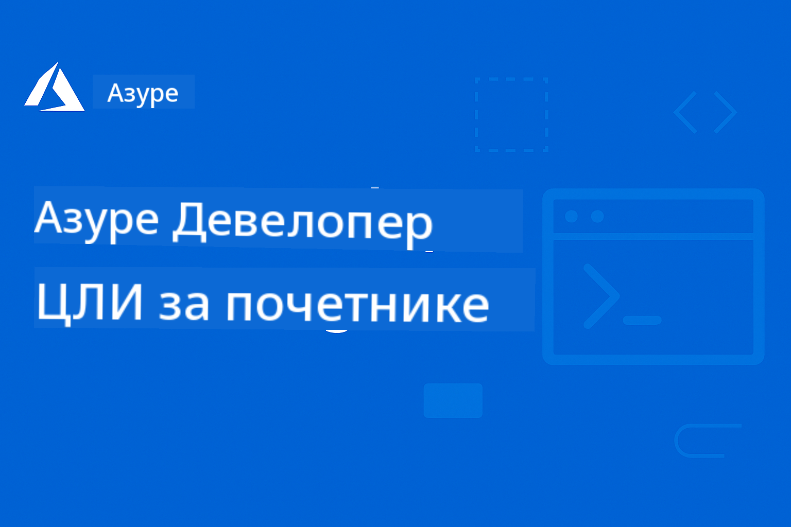

<!--
CO_OP_TRANSLATOR_METADATA:
{
  "original_hash": "068c87cc2641a81ca353ad7064ff326a",
  "translation_date": "2026-01-01T19:51:05+00:00",
  "source_file": "README.md",
  "language_code": "sr"
}
-->
# AZD за почетнике: Структурисано учење

 

[](https://GitHub.com/microsoft/azd-for-beginners/watchers/)
[](https://GitHub.com/microsoft/azd-for-beginners/network/)
[](https://GitHub.com/microsoft/azd-for-beginners/stargazers/)

[](https://discord.gg/microsoft-azure)
[](https://discord.gg/nTYy5BXMWG)

## Како почети са овим курсом

Пратите ове кораке да бисте започели своје AZD путовање учења:

1. **Направите форк репозиторијума**: Кликните [](https://GitHub.com/microsoft/azd-for-beginners/fork)
2. **Клонирајте репозиторијум**: `git clone https://github.com/microsoft/azd-for-beginners.git`
3. **Придружите се заједници**: [Azure Discord заједнице](https://discord.com/invite/ByRwuEEgH4) за стручну помоћ
4. **Изаберите свој пут учења**: Одаберите поглавље испод које одговара вашем нивоу искуства

### Подршка за више језика

#### Аутоматизовани преводи (увек ажурни)

<!-- CO-OP TRANSLATOR LANGUAGES TABLE START -->
[Арапски](../ar/README.md) | [Бенгалски](../bn/README.md) | [Бугарски](../bg/README.md) | [Бирмански (Мјанмар)](../my/README.md) | [Кинески (поједностављени)](../zh/README.md) | [Кинески (традиционални, Хонг Конг)](../hk/README.md) | [Кинески (традиционални, Макао)](../mo/README.md) | [Кинески (традиционални, Тајван)](../tw/README.md) | [Хрватски](../hr/README.md) | [Чешки](../cs/README.md) | [Дански](../da/README.md) | [Холандски](../nl/README.md) | [Естонски](../et/README.md) | [Фински](../fi/README.md) | [Француски](../fr/README.md) | [Немачки](../de/README.md) | [Грчки](../el/README.md) | [Хебрејски](../he/README.md) | [Хинди](../hi/README.md) | [Мађарски](../hu/README.md) | [Индонежански](../id/README.md) | [Италијански](../it/README.md) | [Јапански](../ja/README.md) | [Каннада](../kn/README.md) | [Корејски](../ko/README.md) | [Литвански](../lt/README.md) | [Малејски](../ms/README.md) | [Малајалам](../ml/README.md) | [Марати](../mr/README.md) | [Непали](../ne/README.md) | [Нигеријски Пидгин](../pcm/README.md) | [Норвешки](../no/README.md) | [Персијски (фарси)](../fa/README.md) | [Пољски](../pl/README.md) | [Португалски (Бразил)](../br/README.md) | [Португалски (Португал)](../pt/README.md) | [Пунџаби (Гурмуки)](../pa/README.md) | [Румунски](../ro/README.md) | [Руски](../ru/README.md) | [Српски (ћирилица)](./README.md) | [Словачки](../sk/README.md) | [Словеначки](../sl/README.md) | [Шпански](../es/README.md) | [Свахили](../sw/README.md) | [Шведски](../sv/README.md) | [Тагалог (Филипински)](../tl/README.md) | [Тамилски](../ta/README.md) | [Телугу](../te/README.md) | [Тајландски](../th/README.md) | [Турски](../tr/README.md) | [Украјински](../uk/README.md) | [Урду](../ur/README.md) | [Вијетнамски](../vi/README.md)
<!-- CO-OP TRANSLATOR LANGUAGES TABLE END -->

## Преглед курса

Свладајте Azure Developer CLI (azd) кроз структурисана поглавља дизајнирана за постепено учење. **Посебан фокус на размештању AI апликација уз интеграцију Microsoft Foundry.**

### Зашто је овај курс важан за савремене програмере

На основу увида из Microsoft Foundry Discord заједнице, **45% програмера жели да користи AZD за AI радне оптерећења** али се сусреће са изазовима у вези са:
- Сложене мулти-сервисне AI архитектуре
- Најбоље праксе за размештање AI у продукцији  
- Интеграција и конфигурација Azure AI сервиса
- Оптимизација трошкова за AI радна оптерећења
- Решавање проблема специфичних за размештање AI

### Циљеви учења

Завршетком овог структурисаног курса, научићете:
- **Савладајте основе AZD**: Основни концепти, инсталација и конфигурација
- **Размештајте AI апликације**: Користите AZD са Microsoft Foundry сервисима
- **Имплементирајте инфраструктуру као код**: Управљајте Azure ресурсима помоћу Bicep шаблона
- **Решавање проблема приликом размењивања**: Решавање уобичајених проблема и дебаговање
- **Оптимизирајте за продукцију**: Безбедност, скалирање, надгледање и управљање трошковима
- **Градите мулти-агентска решења**: Размештајте сложене AI архитектуре

## 📚 Поглавља за учење

*Одаберите свој пут учења на основу нивоа искуства и циљева*

### 🚀 Поглавље 1: Основе и брзи почетак
**Предуслови**: Azure претплата, основно знање командне линије  
**Трајање**: 30-45 минута  
**Комплексност**: ⭐

#### Шта ћете научити
- Разумевање основа Azure Developer CLI
- Инсталирање AZD на вашој платформи
- Ваше прво успешно размештање

#### Ресурси за учење
- **🎯 Почните овде**: [Шта је Azure Developer CLI?](../..)
- **📖 Теорија**: [Основе AZD](docs/getting-started/azd-basics.md) - Основни концепти и терминологија
- **⚙️ Подешавање**: [Инсталација и подешавање](docs/getting-started/installation.md) - Упутства за специфичне платформе
- **🛠️ Практично**: [Ваш први пројекат](docs/getting-started/first-project.md) - Туторијал корак по корак
- **📋 Брза референца**: [Шпаргалка команда](resources/cheat-sheet.md)

#### Практичне вежбе
```bash
# Брза провера инсталације
azd version

# Поставите своју прву апликацију
azd init --template todo-nodejs-mongo
azd up
```

**💡 Резултат поглавља**: Успешно разместите једноставну веб апликацију на Azure користећи AZD

**✅ Валидација успеха:**
```bash
# Након завршетка Поглавља 1, требало би да будете у стању да:
azd version              # Приказује инсталирану верзију
azd init --template todo-nodejs-mongo  # Иницијализује пројекат
azd up                  # Распоређује на Azure
azd show                # Приказује URL покренуте апликације
# Апликација се отвара у прегледачу и ради
azd down --force --purge  # Чисти ресурсе
```

**📊 Уложено време:** 30-45 минута  
**📈 Ниво вештина након:** Можете самостално разместити основне апликације

**✅ Валидација успеха:**
```bash
# Након завршетка Поглавља 1, требало би да будете у стању да:
azd version              # Приказује инсталирану верзију
azd init --template todo-nodejs-mongo  # Иницијализује пројекат
azd up                  # Распоређује на Azure
azd show                # Приказује УРЛ покренуте апликације
# Апликација се отвара у прегледачу и ради
azd down --force --purge  # Очишћава ресурсе
```

**📊 Уложено време:** 30-45 минута  
**📈 Ниво вештина након:** Можете самостално разместити основне апликације

---

### 🤖 Поглавље 2: AI-прво развијање (Препоручено за AI програмере)
**Предуслови**: Поглавље 1 завршено  
**Трајање**: 1-2 сата  
**Комплексност**: ⭐⭐

#### Шта ћете научити
- Интеграција Microsoft Foundry са AZD
- Размештање апликација са AI могућностима
- Разумевање конфигурација AI сервиса

#### Ресурси за учење
- **🎯 Почните овде**: [Интеграција Microsoft Foundry](docs/microsoft-foundry/microsoft-foundry-integration.md)
- **📖 Обрасци**: [Размештање AI модела](docs/microsoft-foundry/ai-model-deployment.md) - Разместите и управљајте AI моделима
- **🛠️ Радионица**: [AI Workshop Lab](docs/microsoft-foundry/ai-workshop-lab.md) - Припремите своја AI решења за AZD
- **🎥 Интерактивни водич**: [Материјали радионице](workshop/README.md) - Учење у прегледачу са MkDocs * DevContainer окружењем
- **📋 Шаблони**: [Microsoft Foundry шаблони](../..)
- **📝 Примери**: [Примери размењивања AZD](examples/README.md)

#### Практичне вежбе
```bash
# Разместите вашу прву AI апликацију
azd init --template azure-search-openai-demo
azd up

# Испробајте додатне AI шаблоне
azd init --template openai-chat-app-quickstart
azd init --template agent-openai-python-prompty
```

**💡 Резултат поглавља**: Разместите и конфигуришете AI-опремљену чет апликацију са RAG могућностима

**✅ Валидација успеха:**
```bash
# Након Поглавља 2, требало би да будете у стању да:
azd init --template azure-search-openai-demo
azd up
# Тестирати АИ интерфејс за ћаскање
# Постављати питања и добијати АИ-подржане одговоре са изворима
# Проверити да интеграција претраге функционише
azd monitor  # Проверити да Application Insights приказује телеметрију
azd down --force --purge
```

**📊 Уложено време:** 1-2 сата  
**📈 Ниво вештина након:** Можете размењивати и конфигурисати AI апликације спремне за продукцију  
**💰 Свесност о трошковима:** Разумевање трошкова за развој $80-150/месечно, трошкова за продукцију $300-3500/месечно

#### 💰 Разматрања трошкова за размењивање AI

**Окружење за развој (процењено $80-150/месечно):**
- Azure OpenAI (плаћање по коришћењу): $0-50/месечно (у зависности од коришћења токена)
- AI Search (базни ниво): $75/месечно
- Container Apps (према потрошњи): $0-20/месечно
- Складиште (стандардно): $1-5/месечно

**Продукционо окружење (процењено $300-3,500+/месечно):**
- Azure OpenAI (PTU за конзистентне перформансе): $3,000+/месечно ИЛИ плаћање по коришћењу при великом обиму
- AI Search (стандардни ниво): $250/месечно
- Container Apps (дедицирани): $50-100/месечно
- Application Insights: $5-50/месечно
- Складиште (примијум): $10-50/месечно

**💡 Савети за оптимизацију трошкова:**
- Користите **Free Tier** Azure OpenAI за учење (укључено 50,000 токена/месечно)
- Покрените `azd down` да бисте ослободили ресурсе када активно не развијате
- Почните са наплатом по потрошњи, надоградите на PTU само за продукцију
- Користите `azd provision --preview` да процените трошкове пре размењивања
- Омогућите аутоматско скалирање: плаћајте само за стварно коришћење

**Праћење трошкова:**
```bash
# Проверите процењене месечне трошкове
azd provision --preview

# Пратите стварне трошкове у Azure порталу
az consumption budget list --resource-group <your-rg>
```

---

### ⚙️ Поглавље 3: Конфигурација и аутентикација
**Предуслови**: Поглавље 1 завршено  
**Трајање**: 45-60 минута  
**Комплексност**: ⭐⭐

#### Шта ћете научити
- Конфигурација и управљање окружењем
- Најбоље праксе аутентикације и безбедности
- Именовање и организација ресурса

#### Ресурси за учење
- **📖 Конфигурација**: [Водич за конфигурацију](docs/getting-started/configuration.md) - Подешавање окружења
- **🔐 Безбедност**: [Обрасци аутентикације и менаџирани идентитет](docs/getting-started/authsecurity.md) - Обрасци аутентикације
- **📝 Примери**: [Пример апликације са базом података](examples/database-app/README.md) - AZD примери базе података

#### Практичне вежбе
- Конфигуришите више окружења (dev, staging, prod)
- Подесите аутентикацију помоћу менаџираног идентитета
- Имплементирајте конфигурације специфичне за окружење

**💡 Резултат поглавља**: Управљајте више окружења уз правилну аутентикацију и безбедност

---

### 🏗️ Поглавље 4: Инфраструктура као код и размењивање
**Предуслови**: Поглавља 1-3 завршена  
**Трајање**: 1-1.5 сата  
**Комплексност**: ⭐⭐⭐

#### Шта ћете научити
- Напредни обрасци размењивања
- Инфраструктура као код помоћу Bicep
- Стратегије провизије ресурса

#### Ресурси за учење
- **📖 Размењивање**: [Водич за размењивање](docs/deployment/deployment-guide.md) - Потпуни токови пословања
- **🏗️ Провизија**: [Провизија ресурса](docs/deployment/provisioning.md) - Управљање Azure ресурсима
- **📝 Примери**: [Пример Container апликације](../../examples/container-app) - Размењивања у контејнерима

#### Практичне вежбе
- Направите прилагођене Bicep шаблоне
- Разместите мулти-сервисне апликације
- Имплементирајте blue-green стратегије размењивања

**💡 Резултат поглавља**: Разместите сложене мулти-сервисне апликације користећи прилагођене инфраструктурне шаблоне

---

### 🎯 Поглавље 5: Мулти-агентска AI решења (Напредно)
**Предуслови**: Поглавља 1-2 завршена  
**Трајање**: 2-3 сата  
**Комплексност**: ⭐⭐⭐⭐

#### Шта ћете научити
- Обрасци мулти-агентских архитектура
- Оркестрација и координација агената
- AI размењивања спремна за продукцију

#### Ресурси за учење
- **🤖 Истакнути пројекат**: [Мулти-агентско решење за малопродају](examples/retail-scenario.md) - Потпуна имплементација
- **🛠️ ARM шаблони**: [Пакет ARM шаблона](../../examples/retail-multiagent-arm-template) - Распоређивање једним кликом
- **📖 Архитектура**: [Патерни координације више агената](/docs/pre-deployment/coordination-patterns.md) - Патерни

#### Практичне вежбе
```bash
# Разместите целокупно мулти-агентско решење за малопродају
cd examples/retail-multiagent-arm-template
./deploy.sh

# Истражите конфигурације агената
az deployment group show --resource-group <rg-name> --name <deployment-name>
```

**💡 Исход поглавља**: Распоредите и управљајте мулти-агентним AI решењем спремним за производњу са агентима Customer и Inventory

---

### 🔍 Поглавље 6: Валидација и планирање пре распоређивања
**Предуслови**: Поглавље 4 завршено  
**Трајање**: 1 сат  
**Комплексност**: ⭐⭐

#### Шта ћете научити
- Планирање капацитета и валидација ресурса
- Стратегије избора SKU-а
- Провере пре распоређивања и аутоматизација

#### Ресурси за учење
- **📊 Планирање**: [Capacity Planning](docs/pre-deployment/capacity-planning.md) - Валидација ресурса
- **💰 Избор**: [SKU Selection](docs/pre-deployment/sku-selection.md) - Избори погодни по цени
- **✅ Валидација**: [Провере пре распоређивања](docs/pre-deployment/preflight-checks.md) - Аутоматизоване скрипте

#### Практичне вежбе
- Покрените скрипте за валидацију капацитета
- Оптимизујте изборе SKU-а ради уштеде
- Имплементирајте аутоматизоване провере пре распоређивања

**💡 Исход поглавља**: Валидација и оптимизација распоредења пре извршења

---

### 🚨 Поглавље 7: Отклањање грешака и дебаговање
**Предуслови**: Завршено било које поглавље о распоређивању  
**Трајање**: 1-1.5 сата  
**Комплексност**: ⭐⭐

#### Шта ћете научити
- Систематични приступи дебаговању
- Уобичајени проблеми и решења
- Отклањање проблема специфичних за AI

#### Ресурси за учење
- **🔧 Уобичајени проблеми**: [Common Issues](docs/troubleshooting/common-issues.md) - ЧПП и решења
- **🕵️ Дебаговање**: [Debugging Guide](docs/troubleshooting/debugging.md) - Стратегије корак по корак
- **🤖 AI проблеми**: [AI-Specific Troubleshooting](docs/troubleshooting/ai-troubleshooting.md) - Проблеми AI сервиса

#### Практичне вежбе
- Дијагностикујте неуспехе при распоређивању
- Решите проблеме са аутентификацијом
- Дебагујте повезивост AI сервиса

**💡 Исход поглавља**: Самостално дијагностиковање и решавање уобичајених проблема при распоређивању

---

### 🏢 Поглавље 8: Патерни за производњу и предузећа
**Предуслови**: Поглавља 1-4 завршена  
**Трајање**: 2-3 сата  
**Комплексност**: ⭐⭐⭐⭐

#### Шта ћете научити
- Стратегије за распоређивање у производњи
- Предузећни безбедносни обрасци
- Надгледање и оптимизација трошкова

#### Ресурси за учење
- **🏭 Производња**: [Production AI Best Practices](docs/microsoft-foundry/production-ai-practices.md) - Предузећни обрасци
- **📝 Примери**: [Microservices Example](../../examples/microservices) - Комплексне архитектуре
- **📊 Надгледање**: [Application Insights integration](docs/pre-deployment/application-insights.md) - Надгледање

#### Практичне вежбе
- Имплементирајте предузећне безбедносне обрасце
- Подесите свеобухватно надгледање
- Распоредите у производњу уз правилну управу

**💡 Исход поглавља**: Распоредите апликације спремне за предузеће са пуном производном функционалношћу

---

## 🎓 Преглед радионице: Практично искуство учења

> **⚠️ СТАЊЕ РАДИОНИЦЕ: Развој у току**  
> Материјали радионице тренутно се развијају и унапређују. Језгра модула су функционална, али неке напредне секције нису потпуне. Активно радимо на довршавању целокупног садржаја. [Пратите напредак →](workshop/README.md)

### Интерактивни материјали радионице
**Свеобухватно практично учење са алатима у прегледачу и вођеним вежбама**

Наши материјали радионице пружају структуриран, интерактиван курс који допуњује горе наведени програм по поглављима. Радионица је дизајнирана за самостално учење и за вођене сесије са инструктором.

#### 🛠️ Карактеристике радионице
- **Интерфејс у прегледачу**: Потпуна радионица покретана MkDocs-ом са претрагом, копирањем и темама
- **Интеграција са GitHub Codespaces**: Постављање развојног окружења једним кликом
- **Структурирана путања учења**: Водич у 7 корака (укупно 3,5 часа)
- **Истраживање → Распоређивање → Прилагођавање**: Прогресивна методологија
- **Интерактивно DevContainer окружење**: Унапред конфигурисани алати и зависности

#### 📚 Структура радионице
Радионица прати методологију **Истраживање → Распоређивање → Прилагођавање**:

1. **Фаза истраживања** (45 мин)
   - Истражите Microsoft Foundry шаблоне и сервисе
   - Разумевање патерна архитектуре са више агената
   - Преглед захтева за распоређивање и предуслова

2. **Фаза распоређивања** (2 сата)
   - Практично распоређивање AI апликација помоћу AZD
   - Конфигуришите Azure AI сервисе и ендпоинте
   - Имплементирајте безбедносне и аутентификационе обрасце

3. **Фаза прилагођавања** (45 мин)
   - Измените апликације за конкретне случајеве употребе
   - Оптимизујте за производно распоређивање
   - Имплементирајте праћење и управљање трошковима

#### 🚀 Како започети са радионицом
```bash
# Опција 1: GitHub Codespaces (препоручено)
# Кликните "Code" → "Create codespace on main" у репозиторијуму

# Опција 2: Локални развој
git clone https://github.com/microsoft/azd-for-beginners.git
cd azd-for-beginners/workshop
# Пратите упутства за подешавање у workshop/README.md
```

#### 🎯 Исходи учења радионице
Познавањем садржаја радионице, учесници ће:
- **Распоредити AI апликације у производњу**: Користите AZD уз Microsoft Foundry сервисе
- **Овладати архитектурама са више агената**: Имплементирајте координирана AI агентска решења
- **Применити најбоље безбедносне праксе**: Конфигуришите аутентификацију и контролу приступа
- **Оптимизовати за скалабилност**: Дизајнирати исплатива и перформантна распоредења
- **Решавати проблеме распоређивања**: Самостално решавати уобичајене проблеме

#### 📖 Ресурси радионице
- **🎥 Интерактивни водич**: [Workshop Materials](workshop/README.md) - Учење преко прегледача
- **📋 Упутства корак по корак**: [Guided Exercises](../../workshop/docs/instructions) - Детаљни водичи
- **🛠️ AI лабораторија радионице**: [AI Workshop Lab](docs/microsoft-foundry/ai-workshop-lab.md) - Вежбе фокусиране на AI
- **💡 Брзи почетак**: [Workshop Setup Guide](workshop/README.md#quick-start) - Конфигурација окружења

**Идеално за**: Корпоративну обуку, универзитетске курсеве, самостално учење и програме за обуку програмера.

---

## 📖 Шта је Azure Developer CLI?

Azure Developer CLI (azd) је командна линија усмерена на програмере која убрзава процес прављења и распоредења апликација на Azure. Пружа:

- **Распоређивања заснована на шаблонима** - Користите унапред припремљене шаблоне за уобичајене апликационе обрасце
- **Инфраструктура као код** - Управљајте Azure ресурсима користећи Bicep или Terraform  
- **Интегрисани токови посла** - Беспрекорно провизионирање, распоређивање и надгледање апликација
- **Прилагођено програмерима** - Оптимизовано за продуктивност и искуство програмера

### **AZD + Microsoft Foundry: Савршено за AI распоредења**

**Зашто AZD за AI решења?** AZD решава главне изазове са којима се суочавају AI програмери:

- **AI-припремљени шаблони** - Унапред конфигурисани шаблони за Azure OpenAI, Cognitive Services и ML радне оптерећења
- **Безбедна AI распоређивања** - Уградњени безбедносни обрасци за AI сервисе, API кључеве и ендпоинте модела  
- **Патерни за производно AI** - Најбоље праксе за скалабилна, економична AI распоредења
- **Крај-до-краја AI токови посла** - Од развоја модела до производног распоредења уз адекватно праћење
- **Оптимизација трошкова** - Паметно распоређивање ресурса и стратегије скалирања за AI радне оптерећења
- **Интеграција са Microsoft Foundry** - Беспрекорна веза са Microsoft Foundry каталогом модела и ендпоинтима

---

## 🎯 Библиотека шаблона и примера

### Истакнуто: Microsoft Foundry шаблони
**Започните овде ако распоређујете AI апликације!**

> **Напомена:** Ови шаблони демонстрирају различите AI патерне. Неки су спољашњи Azure узорци, други су локалне имплементације.

| Template | Chapter | Complexity | Services | Type |
|----------|---------|------------|----------|------|
| [**Започните са AI четом**](https://github.com/Azure-Samples/get-started-with-ai-chat) | Поглавље 2 | ⭐⭐ | AzureOpenAI + Azure AI Model Inference API + Azure AI Search + Azure Container Apps + Application Insights | Спољашње |
| [**Започните са AI агентима**](https://github.com/Azure-Samples/get-started-with-ai-agents) | Поглавље 2 | ⭐⭐ | Azure AI Agent Service + AzureOpenAI + Azure AI Search + Azure Container Apps + Application Insights| Спољашње |
| [**Azure Search + OpenAI демонстрација**](https://github.com/Azure-Samples/azure-search-openai-demo) | Поглавље 2 | ⭐⭐ | AzureOpenAI + Azure AI Search + App Service + Storage | Спољашње |
| [**OpenAI Chat App Quickstart**](https://github.com/Azure-Samples/openai-chat-app-quickstart) | Поглавље 2 | ⭐ | AzureOpenAI + Container Apps + Application Insights | Спољашње |
| [**Agent OpenAI Python Prompty**](https://github.com/Azure-Samples/agent-openai-python-prompty) | Поглавље 5 | ⭐⭐⭐ | AzureOpenAI + Azure Functions + Prompty | Спољашње |
| [**Contoso Chat RAG**](https://github.com/Azure-Samples/contoso-chat) | Поглавље 8 | ⭐⭐⭐⭐ | AzureOpenAI + AI Search + Cosmos DB + Container Apps | Спољашње |
| [**Retail Multi-Agent Solution**](examples/retail-scenario.md) | Поглавље 5 | ⭐⭐⭐⭐ | AzureOpenAI + AI Search + Storage + Container Apps + Cosmos DB | **Локално** |

### Истакнуто: Потпуни сценарији учења
**Шаблони апликација спремни за производњу усклађени са поглављима за учење**

| Template | Learning Chapter | Complexity | Key Learning |
|----------|------------------|------------|--------------|
| [**openai-chat-app-quickstart**](https://github.com/Azure-Samples/openai-chat-app-quickstart) | Поглавље 2 | ⭐ | Основни AI обрасци распоредења |
| [**azure-search-openai-demo**](https://github.com/Azure-Samples/azure-search-openai-demo) | Поглавље 2 | ⭐⭐ | RAG имплементација са Azure AI Search |
| [**ai-document-processing**](https://github.com/Azure-Samples/ai-document-processing) | Поглавље 4 | ⭐⭐ | Интеграција Document Intelligence |
| [**agent-openai-python-prompty**](https://github.com/Azure-Samples/agent-openai-python-prompty) | Поглавље 5 | ⭐⭐⭐ | Фрејмворк агената и позиви функција |
| [**contoso-chat**](https://github.com/Azure-Samples/contoso-chat) | Поглавље 8 | ⭐⭐⭐ | Оркестрација предузећног AI |
| [**retail-multi-agent-solution**](examples/retail-scenario.md) | Поглавље 5 | ⭐⭐⭐⭐ | Мулти-агентска архитектура са агентима Customer и Inventory |

### Учење путем примера

> **📌 Локални vs. Спољашњи примери:**  
> **Локални примери** (у овом репозиторијуму) = Спремни за употребу одмах  
> **Спољашњи примери** (Azure Samples) = Клонирајте из повезаних репозиторијума

#### Локални примери (спремни за употребу)
- [**Retail Multi-Agent Solution**](examples/retail-scenario.md) - Потпуна имплементација спремна за производњу са ARM шаблонима
  - Мулти-агентска архитектура (Customer + Inventory агенти)
  - Свеобухватно праћење и евалуација
  - Распоређивање једним кликом преко ARM шаблона

#### Локални примери - Container приложения (Поглавља 2-5)
**Свеобухватни примери распоређивања контејнера у овом репозиторијуму:**
- [**Container App Examples**](examples/container-app/README.md) - Потпун водич за распоређивања у контејнерима
  - [Simple Flask API](../../examples/container-app/simple-flask-api) - Основни REST API са scale-to-zero
  - [Microservices Architecture](../../examples/container-app/microservices) - Производно спремно распоређивање више сервиса
  - Брзи почетак, Производња и Напредни обрасци распоредења
  - Смернице за праћење, безбедност и оптимизацију трошкова

#### Спољашњи примери - Једноставне апликације (Поглавља 1-2)
**Клонирајте ове Azure Samples репозиторијуме да започнете:**
- [Simple Web App - Node.js + MongoDB](https://github.com/Azure-Samples/todo-nodejs-mongo) - Основни обрасци распоредења
- [Static Website - React SPA](https://github.com/Azure-Samples/todo-csharp-sql-swa-func) - Распоређивање статичког садржаја
- [Container App - Python Flask](https://github.com/Azure-Samples/container-apps-store-api-microservice) - Распоређивање REST API

#### Спољашњи примери - Интеграција базе података (Поглавља 3-4)  
- [Database App - C# + SQL](https://github.com/Azure-Samples/todo-csharp-sql) - Обрасци повезивања са базом података
- [Functions + Cosmos DB](https://github.com/Azure-Samples/todo-python-mongo-swa-func) - Serverless радни ток података

#### Спољашњи примери - Напредни патерни (Поглавља 4-8)
- [Java Microservices](https://github.com/Azure-Samples/java-microservices-aca-lab) - Архитектуре више сервиса
- [Container Apps Jobs](https://github.com/Azure-Samples/container-apps-jobs) - Обрада у позадини  
- [Enterprise ML Pipeline](https://github.com/Azure-Samples/mlops-v2) - Производни ML обрасци

### Колекције спољашњих шаблона
- [**Званична AZD галерија шаблона**](https://azure.github.io/awesome-azd/) - Курирана колекција званичних и заједничких шаблона
- [**Azure Developer CLI шаблони**](https://learn.microsoft.com/en-us/azure/developer/azure-developer-cli/azd-templates) - Документација Microsoft Learn о шаблонима
- [**Examples Directory**](examples/README.md) - Локални примери за учење са детаљним објашњењима

---

## 📚 Ресурси за учење и референце

### Кратке референце
- [**Сажетак команди**](resources/cheat-sheet.md) - Кључне azd команде организоване по поглављима
- [**Речник**](resources/glossary.md) - Azure и azd терминологија  
- [**ЧПП**](resources/faq.md) - Честа питања организована по обучним поглављима
- [**Водич за учење**](resources/study-guide.md) - Свеобухватне практичне вежбе

### Практични радионички задаци
- [**AI Workshop Lab**](docs/microsoft-foundry/ai-workshop-lab.md) - Учини своја AI решења deploy-овима помоћу AZD (2-3 сата)
- [**Interactive Workshop Guide**](workshop/README.md) - Радионица у прегледачу са MkDocs и DevContainer окружењем
- [**Structured Learning Path**](../../workshop/docs/instructions) - 7-степених вођених вежби (Откривање → Распоређивање → Прилагођавање)
- [**AZD For Beginners Workshop**](workshop/README.md) - Комплетни материјали за практичну радионицу са интеграцијом GitHub Codespaces

### Спољни ресурси за учење
- [Azure Developer CLI Documentation](https://learn.microsoft.com/en-us/azure/developer/azure-developer-cli/)
- [Azure Architecture Center](https://learn.microsoft.com/en-us/azure/architecture/)
- [Azure Pricing Calculator](https://azure.microsoft.com/pricing/calculator/)
- [Azure Status](https://status.azure.com/)

---

## 🔧 Брз водич за отклањање проблема

**Уобичајени проблеми са којима се почетници сусрећу и тренутна решења:**

### ❌ "azd: команда није пронађена"

```bash
# Прво инсталирајте AZD
# Виндовс (PowerShell):
winget install microsoft.azd

# macOS:
brew tap azure/azd && brew install azd

# Линукс:
curl -fsSL https://aka.ms/install-azd.sh | bash

# Проверите инсталацију
azd version
```

### ❌ "Није пронађена претплата" или "Претплата није подешена"

```bash
# Листа доступних претплата
az account list --output table

# Постави подразумевану претплату
az account set --subscription "<subscription-id-or-name>"

# Постави за AZD окружење
azd env set AZURE_SUBSCRIPTION_ID "<subscription-id>"

# Потврди
az account show
```

### ❌ "Недовољна квота" или "Квота премашена"

```bash
# Пробајте другу Azure регију
azd env set AZURE_LOCATION "westus2"
azd up

# Или користите мање SKU-ове у развоју
# Измените infra/main.parameters.json:
{
  "sku": "B1"  // Instead of "P1V2"
}
```

### ❌ "\"azd up\" не успева на пола пута"

```bash
# Опција 1: Очисти и покушај поново
azd down --force --purge
azd up

# Опција 2: Само поправи инфраструктуру
azd provision

# Опција 3: Провери детаљне логове
azd show
azd logs
```

### ❌ "Аутентикација није успела" или "Токен је истекао"

```bash
# Поново се аутентификујте
az logout
az login

azd auth logout
azd auth login

# Проверите аутентификацију
az account show
```

### ❌ "Ресурс већ постоји" или конфликт имена

```bash
# AZD генерише јединствена имена, али ако дође до конфликта:
azd down --force --purge

# Поново покушај са свежим окружењем
azd env new dev-v2
azd up
```

### ❌ Размештање шаблона траје предуго

**Уобичајено време чекања:**
- Једноставна веб апликација: 5-10 минута
- Апликација са базом података: 10-15 минута
- AI апликације: 15-25 минута (провизија OpenAI-а је спора)

```bash
# Проверите напредак
azd show

# Ако сте заглављени више од 30 минута, проверите Azure портал:
azd monitor
# Потражите неуспеле деплојменте
```

### ❌ "Приступ одбијен" или "Забрањено"

```bash
# Проверите вашу Azure улогу
az role assignment list --assignee $(az account show --query user.name -o tsv)

# Потребна вам је најмање улога "Contributor"
# Замолите вашег Azure администратора да додели:
# - Contributor (за ресурсе)
# - User Access Administrator (за додељивање улога)
```

### ❌ Не могу да пронађем URL распоређене апликације

```bash
# Прикажи све крајње тачке сервиса
azd show

# Или отвори Azure портал
azd monitor

# Провери одређену услугу
azd env get-values
# Потражи *_URL променљиве
```

### 📚 Комплетни ресурси за отклањање проблема

- **Водич за уобичајене проблеме:** [Детаљна решења](docs/troubleshooting/common-issues.md)
- **AI-специфични проблеми:** [AI отклањање проблема](docs/troubleshooting/ai-troubleshooting.md)
- **Водич за дебаговање:** [Корак по корак дебаговање](docs/troubleshooting/debugging.md)
- **Тражите помоћ:** [Azure Discord](https://discord.gg/microsoft-azure) #azure-developer-cli

---

## 🔧 Брз водич за отклањање проблема

**Уобичајени проблеми са којима се почетници сусрећу и тренутна решења:**

<details>
<summary><strong>❌ "azd: команда није пронађена"</strong></summary>

```bash
# Прво инсталирајте AZD
# Виндоус (Пауершел):
winget install microsoft.azd

# macOS:
brew tap azure/azd && brew install azd

# Линукс:
curl -fsSL https://aka.ms/install-azd.sh | bash

# Проверите инсталацију
azd version
```
</details>

<details>
<summary><strong>❌ "Није пронађена претплата" или "Претплата није подешена"</strong></summary>

```bash
# Листа доступних претплата
az account list --output table

# Постави подразумевану претплату
az account set --subscription "<subscription-id-or-name>"

# Постави за AZD окружење
azd env set AZURE_SUBSCRIPTION_ID "<subscription-id>"

# Провери
az account show
```
</details>

<details>
<summary><strong>❌ "Недовољна квота" или "Квота премашена"</strong></summary>

```bash
# Пробајте другу Azure регију
azd env set AZURE_LOCATION "westus2"
azd up

# Или користите мање SKU-ове у развоју
# Измените infra/main.parameters.json:
{
  "sku": "B1"  // Instead of "P1V2"
}
```
</details>

<details>
<summary><strong>❌ "\"azd up\" не успева на пола пута"</strong></summary>

```bash
# Опција 1: Очисти и покушај поново
azd down --force --purge
azd up

# Опција 2: Само поправи инфраструктуру
azd provision

# Опција 3: Провери детаљне логове
azd show
azd logs
```
</details>

<details>
<summary><strong>❌ "Аутентикација није успела" или "Токен је истекао"</strong></summary>

```bash
# Аутентификујте се поново
az logout
az login

azd auth logout
azd auth login

# Потврдите аутентификацију
az account show
```
</details>

<details>
<summary><strong>❌ "Ресурс већ постоји" или конфликт имена</strong></summary>

```bash
# AZD генерише јединствена имена, али ако дође до конфликта:
azd down --force --purge

# Онда поново покушајте са свежим окружењем
azd env new dev-v2
azd up
```
</details>

<details>
<summary><strong>❌ Размештање шаблона траје предуго</strong></summary>

**Уобичајено време чекања:**
- Једноставна веб апликација: 5-10 минута
- Апликација са базом података: 10-15 минута
- AI апликације: 15-25 минута (провизија OpenAI-а је спора)

```bash
# Проверите напредак
azd show

# Ако сте заглављени више од 30 минута, проверите Azure портал:
azd monitor
# Потражите неуспела распоређивања
```
</details>

<details>
<summary><strong>❌ "Приступ одбијен" или "Забрањено"</strong></summary>

```bash
# Проверите вашу Azure улогу
az role assignment list --assignee $(az account show --query user.name -o tsv)

# Потребна вам је најмање улога „Contributor”
# Затражите од Azure администратора да додели:
# - Contributor (за ресурсе)
# - User Access Administrator (за додељивање улога)
```
</details>

<details>
<summary><strong>❌ Не могу да пронађем URL распоређене апликације</strong></summary>

```bash
# Прикажи све крајње тачке услуга
azd show

# Или отвори Azure портал
azd monitor

# Провери конкретну услугу
azd env get-values
# Потражи *_URL променљиве
```
</details>

### 📚 Комплетни ресурси за отклањање проблема

- **Водич за уобичајене проблеме:** [Детаљна решења](docs/troubleshooting/common-issues.md)
- **AI-специфични проблеми:** [AI отклањање проблема](docs/troubleshooting/ai-troubleshooting.md)
- **Водич за дебаговање:** [Корак по корак дебаговање](docs/troubleshooting/debugging.md)
- **Тражите помоћ:** [Azure Discord](https://discord.gg/microsoft-azure) #azure-developer-cli

---

## 🎓 Завршетак курса и сертификација

### Праћење напретка
Пратите свој напредак у учењу кроз свако поглавље:

- [ ] **Поглавље 1**: Основе и брзи почетак ✅
- [ ] **Поглавље 2**: AI-приоритетни развој ✅  
- [ ] **Поглавље 3**: Конфигурација и аутентификација ✅
- [ ] **Поглавље 4**: Инфраструктура као код и распоређивање ✅
- [ ] **Поглавље 5**: AI решења са више агената ✅
- [ ] **Поглавље 6**: Валидација и планирање пре распоређивања ✅
- [ ] **Поглавље 7**: Отстрањивање грешака и дебаговање ✅
- [ ] **Поглавље 8**: Обрасци за продукционо и предузетничко окружење ✅

### Верификација учења
Након завршетка сваког поглавља, проверите своје знање кроз:
1. **Практична вежба**: Завршите практично распоређивање поглавља
2. **Провера знања**: Прегледајте одељак ЧПП за ваше поглавље
3. **Заједничка дискусија**: Поделите своје искуство на Azure Discord
4. **Следеће поглавље**: Прелазак на следећи ниво сложености

### Предности завршетка курса
Након завршетка свих поглавља, добићете:
- **Искуство у продукцији**: Распоређене реалне AI апликације на Azure
- **Професионалне вештине**: Способности за распоређивање спремно за предузеће  
- **Признање у заједници**: Активан члан Azure developer заједнице
- **Напредовање у каријери**: Тражене вештине у AZD и AI распоређивању

---

## 🤝 Заједница и подршка

### Потражите помоћ и подршку
- **Технички проблеми**: [Пријавите грешке и захтеве за функције](https://github.com/microsoft/azd-for-beginners/issues)
- **Питања о учењу**: [Microsoft Azure Discord заједница](https://discord.gg/microsoft-azure) и [](https://discord.gg/nTYy5BXMWG)
- **AI-специфична помоћ**: Придружите се [](https://discord.gg/nTYy5BXMWG)
- **Документација**: [Званична документација Azure Developer CLI-а](https://learn.microsoft.com/en-us/azure/developer/azure-developer-cli/)

### Увид из Microsoft Foundry Discord заједнице

**Недавни резултати анкете са канала #Azure:**
- **45%** програмера желе да користе AZD за AI радна оптерећења
- **Највећи изазови**: Распоређивање више сервиса, управљање акредитивима, спремност за продукцију  
- **Најчешће захтевано**: AI-специфични шаблони, водичи за отклањање проблема, најбоље праксе

**Придружите се нашој заједници да:**
- Делите своја AZD + AI искуства и добијете помоћ
- Приступите раним прегледима нових AI шаблона
- Допринесете најбољим праксама за AI распоређивање
- Утицете на будући развој AI + AZD функционалности

### Допринос курсу
Позивамо на допринос! Молимо прочитајте наш [Contributing Guide](CONTRIBUTING.md) за детаље о:
- **Унапређења садржаја**: Побољшајте постојећа поглавља и примере
- **Нови примери**: Додајте сценарије и шаблоне из стварног света  
- **Превођење**: Помозите у одржавању вишејезичке подршке
- **Пријаве грешака**: Побољшајте тачност и јасноћу
- **Стандарди за заједницу**: Пратите наше инклузивне смернице за заједницу

---

## 📄 Информације о курсу

### Лиценца
Овом пројекту је додељена MIT лиценца - видите датотеку [LICENSE](../../LICENSE) за детаље.

### Повећани Microsoft ресурси за учење

Наш тим производи и друге свеобухватне курсеве за учење:

<!-- CO-OP TRANSLATOR OTHER COURSES START -->
### LangChain
[](https://aka.ms/langchain4j-for-beginners)
[](https://aka.ms/langchainjs-for-beginners?WT.mc_id=m365-94501-dwahlin)

---

### Azure / Edge / MCP / Agents
[](https://github.com/microsoft/AZD-for-beginners?WT.mc_id=academic-105485-koreyst)
[](https://github.com/microsoft/edgeai-for-beginners?WT.mc_id=academic-105485-koreyst)
[](https://github.com/microsoft/mcp-for-beginners?WT.mc_id=academic-105485-koreyst)
[](https://github.com/microsoft/ai-agents-for-beginners?WT.mc_id=academic-105485-koreyst)

---
 
### Generative AI Series
[](https://github.com/microsoft/generative-ai-for-beginners?WT.mc_id=academic-105485-koreyst)
[-9333EA?style=for-the-badge&labelColor=E5E7EB&color=9333EA)](https://github.com/microsoft/Generative-AI-for-beginners-dotnet?WT.mc_id=academic-105485-koreyst)
[-C084FC?style=for-the-badge&labelColor=E5E7EB&color=C084FC)](https://github.com/microsoft/generative-ai-for-beginners-java?WT.mc_id=academic-105485-koreyst)
[-E879F9?style=for-the-badge&labelColor=E5E7EB&color=E879F9)](https://github.com/microsoft/generative-ai-with-javascript?WT.mc_id=academic-105485-koreyst)

---
 
### Основно учење
[](https://aka.ms/ml-beginners?WT.mc_id=academic-105485-koreyst)
[](https://aka.ms/datascience-beginners?WT.mc_id=academic-105485-koreyst)
[](https://aka.ms/ai-beginners?WT.mc_id=academic-105485-koreyst)
[](https://github.com/microsoft/Security-101?WT.mc_id=academic-96948-sayoung)
[](https://aka.ms/webdev-beginners?WT.mc_id=academic-105485-koreyst)
[](https://aka.ms/iot-beginners?WT.mc_id=academic-105485-koreyst)
[](https://github.com/microsoft/xr-development-for-beginners?WT.mc_id=academic-105485-koreyst)

---
 
### Серија Copilot
[](https://aka.ms/GitHubCopilotAI?WT.mc_id=academic-105485-koreyst)
[](https://github.com/microsoft/mastering-github-copilot-for-dotnet-csharp-developers?WT.mc_id=academic-105485-koreyst)
[](https://github.com/microsoft/CopilotAdventures?WT.mc_id=academic-105485-koreyst)
<!-- CO-OP TRANSLATOR OTHER COURSES END -->

---

## 🗺️ Навигација курса

**🚀 Спремни да почнете са учењем?**

**Почетници**: Почните са [Поглавље 1: Основе и брзи почетак](../..)  
**AI програмери**: Прескочите до [Поглавље 2: AI-први развој](../..)  
**Искусни програмери**: Почните са [Поглавље 3: Конфигурација и аутентикација](../..)

**Следећи кораци**: [Почните Поглавље 1 - Основе AZD](docs/getting-started/azd-basics.md) →

---

<!-- CO-OP TRANSLATOR DISCLAIMER START -->
**Одрицање одговорности**:
Овај документ је преведен помоћу услуге за превођење засноване на вештачкој интелигенцији [Co-op Translator](https://github.com/Azure/co-op-translator). Иако се трудимо да обезбедимо тачност, имајте у виду да аутоматски преводи могу садржати грешке или нетачности. Оригинални документ на његовом изворном језику треба сматрати коначним и обавезујућим извором. За критичне информације препоручује се професионалан, људски превод. Не сносимо одговорност за било какве неспоразуме или погрешна тумачења која проистичу из употребе овог превода.
<!-- CO-OP TRANSLATOR DISCLAIMER END -->