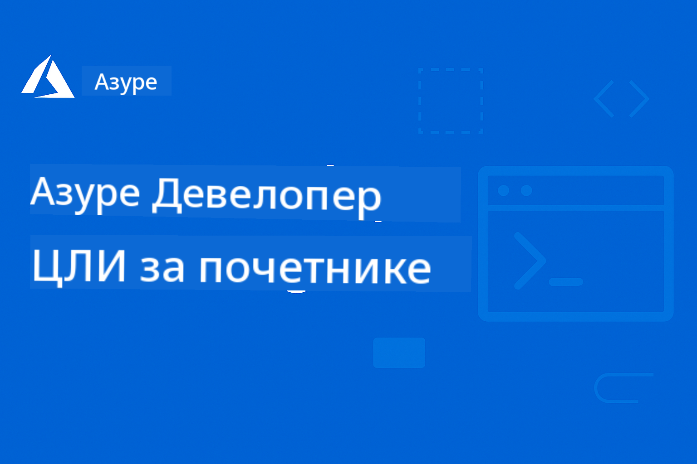

<!--
CO_OP_TRANSLATOR_METADATA:
{
  "original_hash": "6a804be263d09a0fd6f36d6ab251707a",
  "translation_date": "2025-11-25T12:36:49+00:00",
  "source_file": "README.md",
  "language_code": "sr"
}
-->
# AZD за почетнике: Структурисано учење

 

[](https://GitHub.com/microsoft/azd-for-beginners/watchers/)
[](https://GitHub.com/microsoft/azd-for-beginners/network/)
[](https://GitHub.com/microsoft/azd-for-beginners/stargazers/)

[](https://discord.gg/microsoft-azure)
[](https://discord.gg/nTYy5BXMWG)

## Почетак курса

Пратите ове кораке да бисте започели своје AZD учење:

1. **Fork-ујте репозиторијум**: Кликните [](https://GitHub.com/microsoft/azd-for-beginners/fork)
2. **Клонирајте репозиторијум**: `git clone https://github.com/microsoft/azd-for-beginners.git`
3. **Придружите се заједници**: [Azure Discord заједнице](https://discord.com/invite/ByRwuEEgH4) за стручну подршку
4. **Изаберите свој пут учења**: Одаберите поглавље испод које одговара вашем нивоу искуства

### Подршка за више језика

#### Аутоматски преводи (увек ажурни)

<!-- CO-OP TRANSLATOR LANGUAGES TABLE START -->
[Arabic](../ar/README.md) | [Bengali](../bn/README.md) | [Bulgarian](../bg/README.md) | [Burmese (Myanmar)](../my/README.md) | [Chinese (Simplified)](../zh/README.md) | [Chinese (Traditional, Hong Kong)](../hk/README.md) | [Chinese (Traditional, Macau)](../mo/README.md) | [Chinese (Traditional, Taiwan)](../tw/README.md) | [Croatian](../hr/README.md) | [Czech](../cs/README.md) | [Danish](../da/README.md) | [Dutch](../nl/README.md) | [Estonian](../et/README.md) | [Finnish](../fi/README.md) | [French](../fr/README.md) | [German](../de/README.md) | [Greek](../el/README.md) | [Hebrew](../he/README.md) | [Hindi](../hi/README.md) | [Hungarian](../hu/README.md) | [Indonesian](../id/README.md) | [Italian](../it/README.md) | [Japanese](../ja/README.md) | [Kannada](../kn/README.md) | [Korean](../ko/README.md) | [Lithuanian](../lt/README.md) | [Malay](../ms/README.md) | [Malayalam](../ml/README.md) | [Marathi](../mr/README.md) | [Nepali](../ne/README.md) | [Nigerian Pidgin](../pcm/README.md) | [Norwegian](../no/README.md) | [Persian (Farsi)](../fa/README.md) | [Polish](../pl/README.md) | [Portuguese (Brazil)](../br/README.md) | [Portuguese (Portugal)](../pt/README.md) | [Punjabi (Gurmukhi)](../pa/README.md) | [Romanian](../ro/README.md) | [Russian](../ru/README.md) | [Serbian (Cyrillic)](./README.md) | [Slovak](../sk/README.md) | [Slovenian](../sl/README.md) | [Spanish](../es/README.md) | [Swahili](../sw/README.md) | [Swedish](../sv/README.md) | [Tagalog (Filipino)](../tl/README.md) | [Tamil](../ta/README.md) | [Telugu](../te/README.md) | [Thai](../th/README.md) | [Turkish](../tr/README.md) | [Ukrainian](../uk/README.md) | [Urdu](../ur/README.md) | [Vietnamese](../vi/README.md)
<!-- CO-OP TRANSLATOR LANGUAGES TABLE END -->

## Преглед курса

Савладајте Azure Developer CLI (azd) кроз структурисана поглавља дизајнирана за прогресивно учење. **Посебан фокус на примену AI апликација уз интеграцију Microsoft Foundry.**

### Зашто је овај курс важан за савремене програмере

На основу увида из Microsoft Foundry Discord заједнице, **45% програмера жели да користи AZD за AI радне задатке**, али се суочавају са изазовима као што су:
- Комплексне AI архитектуре са више услуга
- Најбоље праксе за примену AI у продукцији  
- Интеграција и конфигурација Azure AI услуга
- Оптимизација трошкова за AI радне задатке
- Решавање проблема специфичних за AI примену

### Циљеви учења

Завршетком овог структурисаног курса, научићете:
- **Савладавање основа AZD-а**: Основни концепти, инсталација и конфигурација
- **Примена AI апликација**: Коришћење AZD-а са Microsoft Foundry услугама
- **Имплементација инфраструктуре као кода**: Управљање Azure ресурсима помоћу Bicep шаблона
- **Решавање проблема при примени**: Решавање уобичајених проблема и отклањање грешака
- **Оптимизација за продукцију**: Безбедност, скалабилност, надзор и управљање трошковима
- **Изградња решења са више агената**: Примена комплексних AI архитектура

## 📚 Поглавља за учење

*Изаберите свој пут учења на основу нивоа искуства и циљева*

### 🚀 Поглавље 1: Основе и брзи почетак
**Предуслови**: Azure претплата, основно познавање командне линије  
**Трајање**: 30-45 минута  
**Комплексност**: ⭐

#### Шта ћете научити
- Разумевање основа Azure Developer CLI-а
- Инсталација AZD-а на вашој платформи
- Ваша прва успешна примена

#### Ресурси за учење
- **🎯 Почните овде**: [Шта је Azure Developer CLI?](../..)
- **📖 Теорија**: [Основе AZD-а](docs/getting-started/azd-basics.md) - Основни концепти и терминологија
- **⚙️ Подешавање**: [Инсталација и подешавање](docs/getting-started/installation.md) - Водичи специфични за платформу
- **🛠️ Практично**: [Ваш први пројекат](docs/getting-started/first-project.md) - Водич корак по корак
- **📋 Брзи референтни водич**: [Командни подсетник](resources/cheat-sheet.md)

#### Практичне вежбе
```bash
# Брза провера инсталације
azd version

# Поставите вашу прву апликацију
azd init --template todo-nodejs-mongo
azd up
```

**💡 Резултат поглавља**: Успешно примените једноставну веб апликацију на Azure користећи AZD

**✅ Валидација успеха:**
```bash
# Након завршетка Првог поглавља, требало би да будете у могућности да:
azd version              # Приказује инсталирану верзију
azd init --template todo-nodejs-mongo  # Иницијализује пројекат
azd up                  # Деплојује на Азур
azd show                # Приказује URL покренуте апликације
# Апликација се отвара у прегледачу и ради
azd down --force --purge  # Чисти ресурсе
```

**📊 Улагање времена:** 30-45 минута  
**📈 Ниво вештине након:** Можете самостално примењивати основне апликације

**✅ Валидација успеха:**
```bash
# Након завршетка Првог поглавља, требало би да будете у могућности да:
azd version              # Приказује инсталирану верзију
azd init --template todo-nodejs-mongo  # Иницијализује пројекат
azd up                  # Деплојује на Азур
azd show                # Приказује URL покренуте апликације
# Апликација се отвара у прегледачу и ради
azd down --force --purge  # Чисти ресурсе
```

**📊 Улагање времена:** 30-45 минута  
**📈 Ниво вештине након:** Можете самостално примењивати основне апликације

---

### 🤖 Поглавље 2: Развој са фокусом на AI (Препоручено за AI програмере)
**Предуслови**: Завршено Поглавље 1  
**Трајање**: 1-2 сата  
**Комплексност**: ⭐⭐

#### Шта ћете научити
- Интеграција Microsoft Foundry-а са AZD-ом
- Примена апликација заснованих на AI-у
- Разумевање конфигурација AI услуга

#### Ресурси за учење
- **🎯 Почните овде**: [Интеграција Microsoft Foundry-а](docs/microsoft-foundry/microsoft-foundry-integration.md)
- **📖 Шаблони**: [Примена AI модела](docs/microsoft-foundry/ai-model-deployment.md) - Примена и управљање AI моделима
- **🛠️ Радионица**: [AI радионица](docs/microsoft-foundry/ai-workshop-lab.md) - Припремите своја AI решења за AZD
- **🎥 Интерактивни водич**: [Материјали за радионицу](workshop/README.md) - Учење у прегледачу са MkDocs * DevContainer окружењем
- **📋 Шаблони**: [Шаблони Microsoft Foundry-а](../..)
- **📝 Примери**: [Примери примене AZD-а](examples/README.md)

#### Практичне вежбе
```bash
# Поставите вашу прву AI апликацију
azd init --template azure-search-openai-demo
azd up

# Пробајте додатне AI шаблоне
azd init --template openai-chat-app-quickstart
azd init --template agent-openai-python-prompty
```

**💡 Резултат поглавља**: Примените и конфигуришите AI апликацију за ћаскање са RAG могућностима

**✅ Валидација успеха:**
```bash
# После поглавља 2, требало би да будете у могућности да:
azd init --template azure-search-openai-demo
azd up
# Тестирате интерфејс за ћаскање са вештачком интелигенцијом
# Постављате питања и добијате одговоре засноване на вештачкој интелигенцији са изворима
# Потврдите да интеграција претраге функционише
azd monitor  # Проверите да Application Insights приказује телеметрију
azd down --force --purge
```

**📊 Улагање времена:** 1-2 сата  
**📈 Ниво вештине након:** Можете применити и конфигурисати AI апликације спремне за продукцију  
**💰 Свесност о трошковима:** Разумевање трошкова од $80-150/месечно за развој, $300-3500/месечно за продукцију

#### 💰 Разматрање трошкова за AI примене

**Окружење за развој (Процењено $80-150/месечно):**
- Azure OpenAI (Плаћање по коришћењу): $0-50/месечно (у зависности од коришћења токена)
- AI Search (Основни ниво): $75/месечно
- Container Apps (Потрошња): $0-20/месечно
- Складиштење (Стандардно): $1-5/месечно

**Окружење за продукцију (Процењено $300-3,500+/месечно):**
- Azure OpenAI (PTU за конзистентне перформансе): $3,000+/месечно ИЛИ Плаћање по коришћењу са великим обимом
- AI Search (Стандардни ниво): $250/месечно
- Container Apps (Дедиковано): $50-100/месечно
- Application Insights: $5-50/месечно
- Складиштење (Премиум): $10-50/месечно

**💡 Савети за оптимизацију трошкова:**
- Користите **бесплатни ниво** Azure OpenAI за учење (50,000 токена/месечно укључено)
- Покрените `azd down` да бисте деактивирали ресурсе када не развијате активно
- Почните са наплатом на основу потрошње, надоградите на PTU само за продукцију
- Користите `azd provision --preview` за процену трошкова пре примене
- Омогућите аутоматско скалирање: плаћајте само за стварно коришћење

**Праћење трошкова:**
```bash
# Проверите процењене месечне трошкове
azd provision --preview

# Пратите стварне трошкове у Azure порталу
az consumption budget list --resource-group <your-rg>
```

---

### ⚙️ Поглавље 3: Конфигурација и аутентификација
**Предуслови**: Завршено Поглавље 1  
**Трајање**: 45-60 минута  
**Комплексност**: ⭐⭐

#### Шта ћете научити
- Конфигурација и управљање окружењем
- Најбоље праксе за аутентификацију и безбедност
- Именовање и организација ресурса

#### Ресурси за учење
- **📖 Конфигурација**: [Водич за конфигурацију](docs/getting-started/configuration.md) - Подешавање окружења
- **🔐 Безбедност**: [Шаблони за аутентификацију и управљани идентитет](docs/getting-started/authsecurity.md) - Шаблони за аутентификацију
- **📝 Примери**: [Пример апликације са базом података](examples/database-app/README.md) - AZD примери за базе података

#### Практичне вежбе
- Конфигуришите више окружења (развој, тестирање, продукција)
- Подесите аутентификацију са управљаним идентитетом
- Имплементирајте конфигурације специфичне за окружење

**💡 Резултат поглавља**: Управљајте више окружења са правилном аутентификацијом и безбедношћу

---

### 🏗️ Поглавље 4: Инфраструктура као код и примена
**Предуслови**: Завршена Поглавља 1-3  
**Трајање**: 1-1.5 сати  
**Комплексност**: ⭐⭐⭐

#### Шта ћете научити
- Напредни шаблони примене
- Инфраструктура као код са Bicep-ом
- Стратегије за обезбеђивање ресурса

#### Ресурси за учење
- **📖 Примена**: [Водич за примену](docs/deployment/deployment-guide.md) - Комплетни токови рада
- **🏗️ Обезбеђивање**: [Обезбеђивање ресурса](docs/deployment/provisioning.md) - Управљање Azure ресурсима
- **📝 Примери**: [Пример апликације у контејнеру](../../examples/container-app) - Примене у контејнерима

#### Практичне вежбе
- Креирајте прилагођене Bicep шаблоне
- Примените апликације са више услуга
- Имплементирајте стратегије примене "плаво-зелено"

**💡 Резултат поглавља**: Примените комплексне апликације са више услуга користећи прилагођене шаблоне инфраструктуре

---

### 🎯 Поглавље 5: AI решења са више агената (Напредно)
**Предуслови**: Завршена Поглавља 1-2  
**Трајање**: 2-3 сата  
**Комплексност**: ⭐⭐⭐⭐

#### Шта ћете научити
- Шаблони архитектуре са више агената
- Оркестрација и координација агената
- AI примене спремне за продукцију

#### Ресурси за учење
- **🤖 Истакнути пројекат**: [Решење за малопродају са више агената](examples/retail-scenario.md) - Комплетна имплементација
- **🛠️ ARM Шаблони**: [ARM Пакет шаблона](../../examples/retail-multiagent-arm-template) - Један клик за имплементацију
- **📖 Архитектура**: [Шаблони за координацију више агената](/docs/pre-deployment/coordination-patterns.md) - Шаблони

#### Практичне Вежбе
```bash
# Разместите комплетно решење за малопродају са више агената
cd examples/retail-multiagent-arm-template
./deploy.sh

# Истражите конфигурације агената
az deployment group show --resource-group <rg-name> --name <deployment-name>
```

**💡 Исход Поглавља**: Имплементирајте и управљајте производно спремним AI решењем са агенатима за купце и инвентар

---

### 🔍 Поглавље 6: Валидација и Планирање Пре Имплементације
**Предуслови**: Завршено Поглавље 4  
**Трајање**: 1 сат  
**Комплексност**: ⭐⭐

#### Шта ћете научити
- Планирање капацитета и валидација ресурса
- Стратегије избора SKU
- Провере пре имплементације и аутоматизација

#### Ресурси за учење
- **📊 Планирање**: [Планирање капацитета](docs/pre-deployment/capacity-planning.md) - Валидација ресурса
- **💰 Избор**: [Избор SKU](docs/pre-deployment/sku-selection.md) - Исплативе опције
- **✅ Валидација**: [Провере пре имплементације](docs/pre-deployment/preflight-checks.md) - Аутоматизовани скриптови

#### Практичне Вежбе
- Покрените скриптове за валидацију капацитета
- Оптимизујте избор SKU за трошкове
- Примените аутоматизоване провере пре имплементације

**💡 Исход Поглавља**: Валидација и оптимизација имплементације пре извршења

---

### 🚨 Поглавље 7: Решавање проблема и Дебаговање
**Предуслови**: Завршено било које поглавље о имплементацији  
**Трајање**: 1-1.5 сати  
**Комплексност**: ⭐⭐

#### Шта ћете научити
- Систематски приступи дебаговању
- Уобичајени проблеми и решења
- Решавање проблема специфичних за AI

#### Ресурси за учење
- **🔧 Уобичајени проблеми**: [Уобичајени проблеми](docs/troubleshooting/common-issues.md) - Честа питања и решења
- **🕵️ Дебаговање**: [Водич за дебаговање](docs/troubleshooting/debugging.md) - Корак по корак стратегије
- **🤖 AI Проблеми**: [Решавање AI проблема](docs/troubleshooting/ai-troubleshooting.md) - Проблеми са AI сервисима

#### Практичне Вежбе
- Дијагностикујте неуспехе имплементације
- Решите проблеме са аутентификацијом
- Дебагујте повезивање AI сервиса

**💡 Исход Поглавља**: Самостално дијагностикујте и решите уобичајене проблеме са имплементацијом

---

### 🏢 Поглавље 8: Производни и Ентерпрајз Шаблони
**Предуслови**: Завршена Поглавља 1-4  
**Трајање**: 2-3 сата  
**Комплексност**: ⭐⭐⭐⭐

#### Шта ћете научити
- Стратегије имплементације у производњи
- Шаблони за безбедност у ентерпрајзу
- Надгледање и оптимизација трошкова

#### Ресурси за учење
- **🏭 Производња**: [Најбоље праксе за AI у производњи](docs/microsoft-foundry/production-ai-practices.md) - Ентерпрајз шаблони
- **📝 Примери**: [Пример микросервиса](../../examples/microservices) - Комплексне архитектуре
- **📊 Надгледање**: [Интеграција са Application Insights](docs/pre-deployment/application-insights.md) - Надгледање

#### Практичне Вежбе
- Примените шаблоне за безбедност у ентерпрајзу
- Поставите свеобухватно надгледање
- Имплементирајте у производњу са одговарајућим управљањем

**💡 Исход Поглавља**: Имплементирајте апликације спремне за ентерпрајз са пуним производним могућностима

---

## 🎓 Преглед Радионице: Практично Искуство Учења

> **⚠️ СТАЊЕ РАДИОНИЦЕ: Активан Развој**  
> Материјали за радионицу су тренутно у развоју и усавршавању. Основни модули су функционални, али неки напредни делови су непотпуни. Активно радимо на завршетку свих садржаја. [Пратите напредак →](workshop/README.md)

### Интерактивни Материјали Радионице
**Свеобухватно практично учење са алатима у претраживачу и вођеним вежбама**

Наши материјали за радионицу пружају структуирано, интерактивно искуство учења које допуњује наставни план заснован на поглављима. Радионица је дизајнирана за самостално учење и сесије са инструктором.

#### 🛠️ Карактеристике Радионице
- **Интерфејс у претраживачу**: Комплетна радионица заснована на MkDocs-у са претрагом, копирањем и функцијама теме
- **Интеграција са GitHub Codespaces**: Један клик за подешавање развојног окружења
- **Структуирани Пут Учења**: 7 корака вођених вежби (укупно 3.5 сати)
- **Откривање → Имплементација → Прилагођавање**: Прогресивна методологија
- **Интерактивно DevContainer Окружење**: Унапред конфигурисани алати и зависности

#### 📚 Структура Радионице
Радионица прати методологију **Откривање → Имплементација → Прилагођавање**:

1. **Фаза Откривања** (45 минута)
   - Истражите Microsoft Foundry шаблоне и сервисе
   - Разумите архитектонске шаблоне за више агената
   - Прегледајте захтеве и предуслове за имплементацију

2. **Фаза Имплементације** (2 сата)
   - Практична имплементација AI апликација са AZD
   - Конфигуришите Azure AI сервисе и крајње тачке
   - Примените шаблоне за безбедност и аутентификацију

3. **Фаза Прилагођавања** (45 минута)
   - Модификујте апликације за специфичне случајеве употребе
   - Оптимизујте за производну имплементацију
   - Примените надгледање и управљање трошковима

#### 🚀 Почетак са Радионицом
```bash
# Опција 1: GitHub Codespaces (Препоручено)
# Кликните "Code" → "Create codespace on main" у репозиторијуму

# Опција 2: Локални развој
git clone https://github.com/microsoft/azd-for-beginners.git
cd azd-for-beginners/workshop
# Пратите упутства за подешавање у workshop/README.md
```

#### 🎯 Исходи Учења Радионице
Завршетком радионице, учесници ће:
- **Имплементирати AI Апликације за Производњу**: Користите AZD са Microsoft Foundry сервисима
- **Савладати Архитектуре за Више Агената**: Примените координирана AI решења
- **Применити Најбоље Праксе за Безбедност**: Конфигуришите аутентификацију и контролу приступа
- **Оптимизовати за Скалирање**: Дизајнирајте исплативе, перформантне имплементације
- **Решавати Проблеме са Имплементацијом**: Самостално решите уобичајене проблеме

#### 📖 Ресурси Радионице
- **🎥 Интерактивни Водич**: [Материјали Радионице](workshop/README.md) - Окружење за учење у претраживачу
- **📋 Упутства Корак по Корак**: [Вођене Вежбе](../../workshop/docs/instructions) - Детаљна упутства
- **🛠️ AI Лабораторија Радионице**: [AI Лабораторија Радионице](docs/microsoft-foundry/ai-workshop-lab.md) - Вежбе фокусиране на AI
- **💡 Брзи Почетак**: [Водич за Подешавање Радионице](workshop/README.md#quick-start) - Конфигурација окружења

**Идеално за**: Корпоративне обуке, универзитетске курсеве, самостално учење и програме за обуку програмера.

---

## 📖 Шта је Azure Developer CLI?

Azure Developer CLI (azd) је интерфејс командне линије усмерен на програмере који убрзава процес изградње и имплементације апликација на Azure. Пружа:

- **Имплементације засноване на шаблонима** - Користите унапред направљене шаблоне за уобичајене обрасце апликација
- **Инфраструктура као Код** - Управљајте Azure ресурсима користећи Bicep или Terraform  
- **Интегрисани токови рада** - Беспрекорно обезбеђивање, имплементација и надгледање апликација
- **Прилагођено програмерима** - Оптимизовано за продуктивност и искуство програмера

### **AZD + Microsoft Foundry: Идеално за AI Имплементације**

**Зашто AZD за AI решења?** AZD решава главне изазове са којима се суочавају AI програмери:

- **Шаблони спремни за AI** - Унапред конфигурисани шаблони за Azure OpenAI, Cognitive Services и ML радне токове
- **Безбедне AI Имплементације** - Уграђени шаблони за безбедност AI сервиса, API кључева и крајњих тачака модела  
- **Шаблони за AI у Производњи** - Најбоље праксе за скалабилне, исплативе AI апликације
- **Крајњи AI Токови** - Од развоја модела до производне имплементације са одговарајућим надгледањем
- **Оптимизација Трошкова** - Паметна алокација ресурса и стратегије скалирања за AI радне токове
- **Интеграција са Microsoft Foundry** - Беспрекорна веза са каталогом модела и крајњим тачкама Microsoft Foundry

---

## 🎯 Библиотека Шаблона и Примера

### Истакнуто: Microsoft Foundry Шаблони
**Почните овде ако имплементирате AI апликације!**

> **Напомена:** Ови шаблони демонстрирају различите AI обрасце. Неки су екстерни Azure Примери, други су локалне имплементације.

| Шаблон | Поглавље | Комплексност | Сервиси | Тип |
|--------|----------|-------------|---------|-----|
| [**Почните са AI четом**](https://github.com/Azure-Samples/get-started-with-ai-chat) | Поглавље 2 | ⭐⭐ | AzureOpenAI + Azure AI Model Inference API + Azure AI Search + Azure Container Apps + Application Insights | Екстерно |
| [**Почните са AI агентима**](https://github.com/Azure-Samples/get-started-with-ai-agents) | Поглавље 2 | ⭐⭐ | Azure AI Agent Service + AzureOpenAI + Azure AI Search + Azure Container Apps + Application Insights| Екстерно |
| [**Azure Search + OpenAI Демонстрација**](https://github.com/Azure-Samples/azure-search-openai-demo) | Поглавље 2 | ⭐⭐ | AzureOpenAI + Azure AI Search + App Service + Storage | Екстерно |
| [**OpenAI Chat Апликација Брзи Почетак**](https://github.com/Azure-Samples/openai-chat-app-quickstart) | Поглавље 2 | ⭐ | AzureOpenAI + Container Apps + Application Insights | Екстерно |
| [**Agent OpenAI Python Prompty**](https://github.com/Azure-Samples/agent-openai-python-prompty) | Поглавље 5 | ⭐⭐⭐ | AzureOpenAI + Azure Functions + Prompty | Екстерно |
| [**Contoso Chat RAG**](https://github.com/Azure-Samples/contoso-chat) | Поглавље 8 | ⭐⭐⭐⭐ | AzureOpenAI + AI Search + Cosmos DB + Container Apps | Екстерно |
| [**Решење за више агената у малопродаји**](examples/retail-scenario.md) | Поглавље 5 | ⭐⭐⭐⭐ | AzureOpenAI + AI Search + Storage + Container Apps + Cosmos DB | **Локално** |

### Истакнуто: Комплетни Сценарији Учења
**Шаблони апликација спремних за производњу повезани са поглављима за учење**

| Шаблон | Поглавље за Учење | Комплексност | Кључно Учење |
|--------|-------------------|-------------|-------------|
| [**openai-chat-app-quickstart**](https://github.com/Azure-Samples/openai-chat-app-quickstart) | Поглавље 2 | ⭐ | Основни AI обрасци имплементације |
| [**azure-search-openai-demo**](https://github.com/Azure-Samples/azure-search-openai-demo) | Поглавље 2 | ⭐⭐ | RAG имплементација са Azure AI Search |
| [**ai-document-processing**](https://github.com/Azure-Samples/ai-document-processing) | Поглавље 4 | ⭐⭐ | Интеграција Document Intelligence |
| [**agent-openai-python-prompty**](https://github.com/Azure-Samples/agent-openai-python-prompty) | Поглавље 5 | ⭐⭐⭐ | Оквир за агенте и позивање функција |
| [**contoso-chat**](https://github.com/Azure-Samples/contoso-chat) | Поглавље 8 | ⭐⭐⭐ | Оркестрација AI у ентерпрајзу |
| [**retail-multi-agent-solution**](examples/retail-scenario.md) | Поглавље 5 | ⭐⭐⭐⭐ | Архитектура за више агената са агенатима за купце и инвентар |

### Учење кроз Примере

> **📌 Локални vs. Екстерни Примери:**  
> **Локални Примери** (у овом репозиторијуму) = Спремни за одмах коришћење  
> **Екстерни Примери** (Azure Примери) = Клонирајте из повезаних репозиторијума

#### Локални Примери (Спремни за Коришћење)
- [**Решење за више агената у малопродаји**](examples/retail-scenario.md) - Комплетна имплементација спремна за производњу са ARM шаблонима
  - Архитектура за више агената (агенти за купце + инвентар)
  - Свеобухватно надгледање и евалуација
  - Један клик за имплементацију преко ARM шаблона

#### Локални Примери - Апликације у Контејнерима (Поглавља 2-5)
**Свеобухватни примери имплементације у контејнерима у овом репозиторијуму:**
- [**Примери Апликација у Контејнерима**](examples/container-app/README.md) - Комплетан водич за имплементацију у контејнерима
  - [Једноставан Flask API](../../examples/container-app/simple-flask-api) - Основни REST API са scale-to-zero
  - [Архитектура Микросервиса](../../examples/container-app/microservices) - Имплементација спремна за производњу са више сервиса
  - Брзи Почетак, Производња и Напредни обрасци имплементације
  - Водичи за надгледање, безбедност и оптимизацију трошкова

#### Екстерни Примери - Једноставне Апликације (Поглавља 1-2)
**Клонирајте ове Azure Примере репозиторијуме за
- [**Командни подсетник**](resources/cheat-sheet.md) - Основне azd команде организоване по поглављима
- [**Речник**](resources/glossary.md) - Терминологија Azure-а и azd-а  
- [**Често постављана питања**](resources/faq.md) - Уобичајена питања организована по поглављима за учење
- [**Водич за учење**](resources/study-guide.md) - Свеобухватне вежбе за праксу

### Практичне радионице
- [**AI радионица**](docs/microsoft-foundry/ai-workshop-lab.md) - Припремите своја AI решења за AZD имплементацију (2-3 сата)
- [**Интерактивни водич за радионицу**](workshop/README.md) - Радионица у прегледачу са MkDocs и DevContainer окружењем
- [**Структурисан пут учења**](../../workshop/docs/instructions) - 7 корака вођених вежби (Откривање → Имплементација → Прилагођавање)
- [**AZD радионица за почетнике**](workshop/README.md) - Комплетан материјал за радионицу са интеграцијом GitHub Codespaces-а

### Спољни ресурси за учење
- [Azure Developer CLI документација](https://learn.microsoft.com/en-us/azure/developer/azure-developer-cli/)
- [Azure Architecture Center](https://learn.microsoft.com/en-us/azure/architecture/)
- [Azure калкулатор цена](https://azure.microsoft.com/pricing/calculator/)
- [Azure статус](https://status.azure.com/)

---

## 🔧 Брзи водич за решавање проблема

**Уобичајени проблеми са којима се почетници сусрећу и тренутна решења:**

### ❌ "azd: команда није пронађена"

```bash
# Прво инсталирајте AZD
# Windows (PowerShell):
winget install microsoft.azd

# macOS:
brew tap azure/azd && brew install azd

# Linux:
curl -fsSL https://aka.ms/install-azd.sh | bash

# Потврдите инсталацију
azd version
```

### ❌ "Није пронађена претплата" или "Претплата није подешена"

```bash
# Листа доступних претплата
az account list --output table

# Постави подразумевану претплату
az account set --subscription "<subscription-id-or-name>"

# Постави за AZD окружење
azd env set AZURE_SUBSCRIPTION_ID "<subscription-id>"

# Потврди
az account show
```

### ❌ "Недовољна квота" или "Квота прекорачена"

```bash
# Пробајте различит Azure регион
azd env set AZURE_LOCATION "westus2"
azd up

# Или користите мање SKUs у развоју
# Уредите infra/main.parameters.json:
{
  "sku": "B1"  // Instead of "P1V2"
}
```

### ❌ "azd up" не успева на пола пута

```bash
# Опција 1: Очисти и покушај поново
azd down --force --purge
azd up

# Опција 2: Само поправи инфраструктуру
azd provision

# Опција 3: Провери детаљне записе
azd show
azd logs
```

### ❌ "Аутентификација није успела" или "Токен је истекао"

```bash
# Поново се аутентификујте
az logout
az login

azd auth logout
azd auth login

# Потврдите аутентификацију
az account show
```

### ❌ "Ресурс већ постоји" или конфликт у именовању

```bash
# AZD генерише јединствена имена, али ако дође до конфликта:
azd down --force --purge

# Онда поново покушајте са свежим окружењем
azd env new dev-v2
azd up
```

### ❌ Размештање шаблона траје предуго

**Нормално време чекања:**
- Једноставна веб апликација: 5-10 минута
- Апликација са базом података: 10-15 минута
- AI апликације: 15-25 минута (OpenAI провизионисање је споро)

```bash
# Проверите напредак
azd show

# Ако сте заглављени више од 30 минута, проверите Azure Portal:
azd monitor
# Потражите неуспеле деплоје
```

### ❌ "Приступ одбијен" или "Забрањено"

```bash
# Проверите своју Azure улогу
az role assignment list --assignee $(az account show --query user.name -o tsv)

# Потребна вам је барем улога "Contributor"
# Замолите свог Azure администратора да додели:
# - Contributor (за ресурсе)
# - User Access Administrator (за доделу улога)
```

### ❌ Не могу да пронађем URL распоређене апликације

```bash
# Прикажи све крајње тачке услуга
azd show

# Или отвори Azure портал
azd monitor

# Провери одређену услугу
azd env get-values
# Потражи *_URL променљиве
```

### 📚 Комплетни ресурси за решавање проблема

- **Водич за уобичајене проблеме:** [Детаљна решења](docs/troubleshooting/common-issues.md)
- **AI-специфични проблеми:** [AI решавање проблема](docs/troubleshooting/ai-troubleshooting.md)
- **Водич за дебаговање:** [Корак по корак дебаговање](docs/troubleshooting/debugging.md)
- **Потражите помоћ:** [Azure Discord](https://discord.gg/microsoft-azure) #azure-developer-cli

---

## 🔧 Брзи водич за решавање проблема

**Уобичајени проблеми са којима се почетници сусрећу и тренутна решења:**

<details>
<summary><strong>❌ "azd: команда није пронађена"</strong></summary>

```bash
# Прво инсталирајте AZD
# Windows (PowerShell):
winget install microsoft.azd

# macOS:
brew tap azure/azd && brew install azd

# Linux:
curl -fsSL https://aka.ms/install-azd.sh | bash

# Потврдите инсталацију
azd version
```
</details>

<details>
<summary><strong>❌ "Није пронађена претплата" или "Претплата није подешена"</strong></summary>

```bash
# Листа доступних претплата
az account list --output table

# Постави подразумевану претплату
az account set --subscription "<subscription-id-or-name>"

# Постави за AZD окружење
azd env set AZURE_SUBSCRIPTION_ID "<subscription-id>"

# Потврди
az account show
```
</details>

<details>
<summary><strong>❌ "Недовољна квота" или "Квота прекорачена"</strong></summary>

```bash
# Пробајте различит Azure регион
azd env set AZURE_LOCATION "westus2"
azd up

# Или користите мање SKUs у развоју
# Уредите infra/main.parameters.json:
{
  "sku": "B1"  // Instead of "P1V2"
}
```
</details>

<details>
<summary><strong>❌ "azd up" не успева на пола пута"</strong></summary>

```bash
# Опција 1: Очисти и покушај поново
azd down --force --purge
azd up

# Опција 2: Само поправи инфраструктуру
azd provision

# Опција 3: Провери детаљне записе
azd show
azd logs
```
</details>

<details>
<summary><strong>❌ "Аутентификација није успела" или "Токен је истекао"</strong></summary>

```bash
# Поново се аутентификујте
az logout
az login

azd auth logout
azd auth login

# Потврдите аутентификацију
az account show
```
</details>

<details>
<summary><strong>❌ "Ресурс већ постоји" или конфликт у именовању"</strong></summary>

```bash
# AZD генерише јединствена имена, али ако дође до конфликта:
azd down --force --purge

# Онда поново покушајте са свежим окружењем
azd env new dev-v2
azd up
```
</details>

<details>
<summary><strong>❌ Размештање шаблона траје предуго</strong></summary>

**Нормално време чекања:**
- Једноставна веб апликација: 5-10 минута
- Апликација са базом података: 10-15 минута
- AI апликације: 15-25 минута (OpenAI провизионисање је споро)

```bash
# Проверите напредак
azd show

# Ако сте заглављени више од 30 минута, проверите Azure Portal:
azd monitor
# Потражите неуспеле деплоје
```
</details>

<details>
<summary><strong>❌ "Приступ одбијен" или "Забрањено"</strong></summary>

```bash
# Проверите своју Azure улогу
az role assignment list --assignee $(az account show --query user.name -o tsv)

# Потребна вам је најмање улога "Contributor"
# Замолите свог Azure администратора да додели:
# - Contributor (за ресурсе)
# - User Access Administrator (за доделу улога)
```
</details>

<details>
<summary><strong>❌ Не могу да пронађем URL распоређене апликације</strong></summary>

```bash
# Прикажи све крајње тачке услуга
azd show

# Или отвори Azure портал
azd monitor

# Провери одређену услугу
azd env get-values
# Потражи *_URL променљиве
```
</details>

### 📚 Комплетни ресурси за решавање проблема

- **Водич за уобичајене проблеме:** [Детаљна решења](docs/troubleshooting/common-issues.md)
- **AI-специфични проблеми:** [AI решавање проблема](docs/troubleshooting/ai-troubleshooting.md)
- **Водич за дебаговање:** [Корак по корак дебаговање](docs/troubleshooting/debugging.md)
- **Потражите помоћ:** [Azure Discord](https://discord.gg/microsoft-azure) #azure-developer-cli

---

## 🎓 Завршетак курса и сертификација

### Праћење напретка
Пратите свој напредак у учењу кроз свако поглавље:

- [ ] **Поглавље 1**: Основе и брзи почетак ✅
- [ ] **Поглавље 2**: AI-прво развијање ✅  
- [ ] **Поглавље 3**: Конфигурација и аутентификација ✅
- [ ] **Поглавље 4**: Инфраструктура као код и имплементација ✅
- [ ] **Поглавље 5**: AI решења са више агената ✅
- [ ] **Поглавље 6**: Валидација и планирање пре имплементације ✅
- [ ] **Поглавље 7**: Решавање проблема и дебаговање ✅
- [ ] **Поглавље 8**: Продукција и обрасци за предузећа ✅

### Провера знања
Након завршетка сваког поглавља, проверите своје знање:
1. **Практична вежба**: Завршите практичну имплементацију за поглавље
2. **Провера знања**: Прегледајте FAQ секцију за своје поглавље
3. **Дискусија у заједници**: Поделите своје искуство на Azure Discord-у
4. **Следеће поглавље**: Пређите на следећи ниво сложености

### Предности завршетка курса
По завршетку свих поглавља, имаћете:
- **Искуство у продукцији**: Имплементиране стварне AI апликације на Azure
- **Професионалне вештине**: Способности за имплементацију спремну за предузећа  
- **Признање у заједници**: Активан члан Azure заједнице програмера
- **Напредак у каријери**: Тражене вештине за AZD и AI имплементацију

---

## 🤝 Заједница и подршка

### Потражите помоћ и подршку
- **Технички проблеми**: [Пријавите грешке и затражите функције](https://github.com/microsoft/azd-for-beginners/issues)
- **Питања о учењу**: [Microsoft Azure Discord заједница](https://discord.gg/microsoft-azure) и [](https://discord.gg/nTYy5BXMWG)
- **AI-специфична помоћ**: Придружите се [](https://discord.gg/nTYy5BXMWG)
- **Документација**: [Званична Azure Developer CLI документација](https://learn.microsoft.com/en-us/azure/developer/azure-developer-cli/)

### Увид у заједницу из Microsoft Foundry Discord-а

**Недавни резултати анкета из #Azure канала:**
- **45%** програмера жели да користи AZD за AI радне задатке
- **Главни изазови**: Размештање више услуга, управљање акредитивима, спремност за продукцију  
- **Најтраженије**: AI-специфични шаблони, водичи за решавање проблема, најбоље праксе

**Придружите се нашој заједници да:**
- Поделите своја AZD + AI искуства и добијете помоћ
- Приступите раним прегледима нових AI шаблона
- Допринесете најбољим праксама за AI имплементацију
- Утичете на будући развој функција за AI + AZD

### Допринос курсу
Добродошли су сви доприноси! Прочитајте наш [Водич за доприносе](CONTRIBUTING.md) за детаље о:
- **Унапређењу садржаја**: Побољшајте постојећа поглавља и примере
- **Новим примерима**: Додајте сценарије из стварног света и шаблоне  
- **Преводу**: Помозите у одржавању подршке за више језика
- **Пријави грешака**: Побољшајте тачност и јасноћу
- **Стандардима заједнице**: Пратите наше смернице за инклузивну заједницу

---

## 📄 Информације о курсу

### Лиценца
Овај пројекат је лиценциран под MIT лиценцом - погледајте [LICENSE](../../LICENSE) датотеку за детаље.

### Повезани ресурси за учење од Microsoft-а

Наш тим производи и друге свеобухватне курсеве за учење:

<!-- CO-OP TRANSLATOR OTHER COURSES START -->
### Azure / Edge / MCP / Агенти
[](https://github.com/microsoft/AZD-for-beginners?WT.mc_id=academic-105485-koreyst)
[](https://github.com/microsoft/edgeai-for-beginners?WT.mc_id=academic-105485-koreyst)
[](https://github.com/microsoft/mcp-for-beginners?WT.mc_id=academic-105485-koreyst)
[](https://github.com/microsoft/ai-agents-for-beginners?WT.mc_id=academic-105485-koreyst)

---
 
### Генеративни AI серијал
[](https://github.com/microsoft/generative-ai-for-beginners?WT.mc_id=academic-105485-koreyst)
[-9333EA?style=for-the-badge&labelColor=E5E7EB&color=9333EA)](https://github.com/microsoft/Generative-AI-for-beginners-dotnet?WT.mc_id=academic-105485-koreyst)
[-C084FC?style=for-the-badge&labelColor=E5E7EB&color=C084FC)](https://github.com/microsoft/generative-ai-for-beginners-java?WT.mc_id=academic-105485-koreyst)
[-E879F9?style=for-the-badge&labelColor=E5E7EB&color=E879F9)](https://github.com/microsoft/generative-ai-with-javascript?WT.mc_id=academic-105485-koreyst)

---
 
### Основно учење
[](https://aka.ms/ml-beginners?WT.mc_id=academic-105485-koreyst)
[](https://aka.ms/datascience-beginners?WT.mc_id=academic-105485-koreyst)
[](https://aka.ms/ai-beginners?WT.mc_id=academic-105485-koreyst)
[](https://github.com/microsoft/Security-101?WT.mc_id=academic-96948-sayoung)
[](https://aka.ms/webdev-beginners?WT.mc_id=academic-105485-koreyst)
[](https://aka.ms/iot-beginners?WT.mc_id=academic-105485-koreyst)
[](https://github.com/microsoft/xr-development-for-beginners?WT.mc_id=academic-105485-koreyst)

---

### Copilot серија
[](https://aka.ms/GitHubCopilotAI?WT.mc_id=academic-105485-koreyst)
[](https://github.com/microsoft/mastering-github-copilot-for-dotnet-csharp-developers?WT.mc_id=academic-105485-koreyst)
[](https://github.com/microsoft/CopilotAdventures?WT.mc_id=academic-105485-koreyst)
<!-- CO-OP TRANSLATOR OTHER COURSES END -->

---

## 🗺️ Навигација кроз курс

**🚀 Спремни за учење?**

**Почетници**: Почните са [Поглављем 1: Основе и брзи почетак](../..)  
**AI програмери**: Прескочите на [Поглавље 2: Развој са AI као приоритетом](../..)  
**Искусни програмери**: Почните са [Поглављем 3: Конфигурација и аутентикација](../..)

**Следећи кораци**: [Почните Поглавље 1 - Основе AZD](docs/getting-started/azd-basics.md) →

---

<!-- CO-OP TRANSLATOR DISCLAIMER START -->
**Одрицање од одговорности**:  
Овај документ је преведен помоћу услуге за превођење вештачке интелигенције [Co-op Translator](https://github.com/Azure/co-op-translator). Иако настојимо да обезбедимо тачност, молимо вас да имате у виду да аутоматизовани преводи могу садржати грешке или нетачности. Оригинални документ на његовом изворном језику треба сматрати ауторитативним извором. За критичне информације препоручује се професионални превод од стране људи. Не преузимамо одговорност за било каква погрешна тумачења или неспоразуме који могу настати услед коришћења овог превода.
<!-- CO-OP TRANSLATOR DISCLAIMER END -->