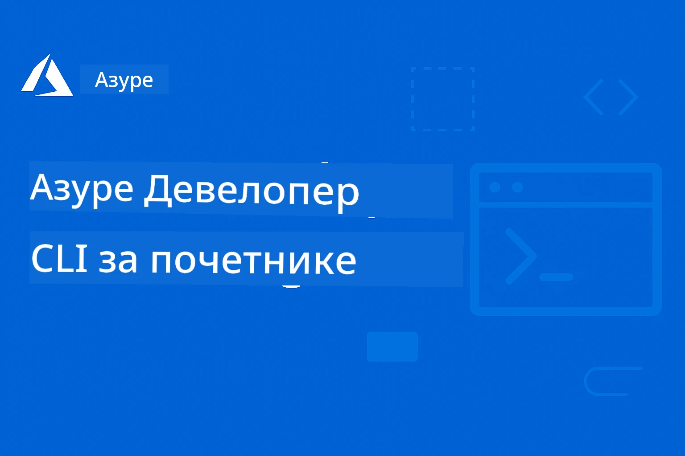

# AZD За почетнике: Структурисано учење

 

[](https://GitHub.com/microsoft/azd-for-beginners/watchers/)
[](https://GitHub.com/microsoft/azd-for-beginners/network/)
[](https://GitHub.com/microsoft/azd-for-beginners/stargazers/)

[](https://discord.com/invite/nkVh3dp)
[](https://discord.gg/nTYy5BXMWG)

---

### Аутоматски преводи (увек ажурни)

<!-- CO-OP TRANSLATOR LANGUAGES TABLE START -->
[Арапски](../ar/README.md) | [Бенгалски](../bn/README.md) | [Бугарски](../bg/README.md) | [Бирмански (Мјанмар)](../my/README.md) | [Кинески (поједностављени)](../zh-CN/README.md) | [Кинески (традиционални, Хонг Конг)](../zh-HK/README.md) | [Кинески (традиционални, Макао)](../zh-MO/README.md) | [Кинески (традиционални, Тајван)](../zh-TW/README.md) | [Хрватски](../hr/README.md) | [Чешки](../cs/README.md) | [Дански](../da/README.md) | [Холандски](../nl/README.md) | [Естонски](../et/README.md) | [Фински](../fi/README.md) | [Француски](../fr/README.md) | [Немачки](../de/README.md) | [Грчки](../el/README.md) | [Хебрејски](../he/README.md) | [Хинди](../hi/README.md) | [Мађарски](../hu/README.md) | [Индонежански](../id/README.md) | [Италијански](../it/README.md) | [Јапански](../ja/README.md) | [Каннада](../kn/README.md) | [Кмерски](../km/README.md) | [Корејски](../ko/README.md) | [Литвански](../lt/README.md) | [Малајски](../ms/README.md) | [Малајалам](../ml/README.md) | [Марати](../mr/README.md) | [Непалски](../ne/README.md) | [Нигеријски Пидгин](../pcm/README.md) | [Норвешки](../no/README.md) | [Персијски (Фарси)](../fa/README.md) | [Пољски](../pl/README.md) | [Португалски (Бразил)](../pt-BR/README.md) | [Португалски (Португал)](../pt-PT/README.md) | [Панџаби (Гурмуки)](../pa/README.md) | [Румунски](../ro/README.md) | [Руски](../ru/README.md) | [Српски (ћирилица)](./README.md) | [Словачки](../sk/README.md) | [Словеначки](../sl/README.md) | [Шпански](../es/README.md) | [Свахили](../sw/README.md) | [Шведски](../sv/README.md) | [Тагалог (Филипински)](../tl/README.md) | [Тамилски](../ta/README.md) | [Телугу](../te/README.md) | [Тајландски](../th/README.md) | [Турски](../tr/README.md) | [Украјински](../uk/README.md) | [Урду](../ur/README.md) | [Вијетнамски](../vi/README.md)

> **Више волите да клонирате локално?**
>
> Ово складиште укључује преко 50 превода на различите језике, што значајно повећава величину преузимања. Да бисте клонирали без превода, користите sparse checkout:
>
> **Bash / macOS / Linux:**
> ```bash
> git clone --filter=blob:none --sparse https://github.com/microsoft/AZD-for-beginners.git
> cd AZD-for-beginners
> git sparse-checkout set --no-cone '/*' '!translations' '!translated_images'
> ```
>
> **CMD (Windows):**
> ```cmd
> git clone --filter=blob:none --sparse https://github.com/microsoft/AZD-for-beginners.git
> cd AZD-for-beginners
> git sparse-checkout set --no-cone "/*" "!translations" "!translated_images"
> ```
>
> Ово вам даје све што вам је потребно за завршетак курса уз много брже преузимање.
<!-- CO-OP TRANSLATOR LANGUAGES TABLE END -->

## 🆕 Шта је ново у azd данас

Azure Developer CLI се проширио изван традиционалних веб апликација и API-ја. Данас, azd је једини алат за деплој било које апликације на Azure — укључујући апликације покретане вештачком интелигенцијом и интелигентне агенте.

Ево шта то значи за вас:

- **AI агенти су сада једнаки радни задаци у azd.** Можете инициализовати, распоредити и управљати пројектима AI агената користећи исти `azd init` → `azd up` радни ток који већ познајете.
- **Интеграција Microsoft Foundry** доноси распоређивање модела, хостовање агената и конфигурацију AI сервиса директно у azd екосистем шаблона.
- **Основни радни ток се није променио.** Без обзира да ли распоређујете todo апликацију, микросервис или мулти-агент AI решење, команде су исте.

Ако сте раније користили azd, подршка за AI је природно проширење — а не посебан алат или напредни смер. Ако почињете из почетка, научићете један радни ток који ради за све.

---

## 🚀 Шта је Azure Developer CLI (azd)?

**Azure Developer CLI (azd)** је пријатељски алат за развојни командни ред који поједностављује деплој апликација на Azure. Уместо да ручно креирате и повежете десетине Azure ресурса, можете распоредити целе апликације једном командом.

### Магија `azd up`

```bash
# Овај један команд ради све:
# ✅ Креира све Azure ресурсе
# ✅ Конфигурише мрежу и безбедност
# ✅ Граби ваш апликацијски код
# ✅ Деплојује на Azure
# ✅ Даје вам радни URL
azd up
```

**То је то!** Ни кликања по Azure порталу, ни сложених ARM шаблона које прво треба научити, ни ручне конфигурације — само радне апликације на Azure.

---

## ❓ Azure Developer CLI vs Azure CLI: Која је разлика?

Ово је најчешће питање које почетници постављају. Ево једноставног одговора:

| Функција | **Azure CLI (`az`)** | **Azure Developer CLI (`azd`)** |
|---------|---------------------|--------------------------------|
| **Намена** | Управљање појединачним Azure ресурсима | Деплој целих апликација |
| **Начин размишљања** | Фокусиран на инфраструктуру | Фокусиран на апликацију |
| **Пример** | `az webapp create --name myapp...` | `azd up` |
| **Крива учења** | Морате познавати Azure сервисе | Довољно је да познајете вашу апликацију |
| **Најпогоднији за** | DevOps, инфраструктуру | Развијаче, прототипирање |

### Једноставна аналогија

- **Azure CLI** је као да имате све алате да изградите кућу — чекићи, тестере, ексери. Можете изградити било шта, али морате знати грађевину.
- **Azure Developer CLI** је као да ангажујете извођача — опишете шта желите, и он се брине о изградњи.

### Када користити који

| Сценарио | Користите ово |
|----------|----------|
| "Желим брзо да деплојујем моју веб апликацију" | `azd up` |
| "Треба да направим само storage account" | `az storage account create` |
| "Правим пуну AI апликацију" | `azd init --template azure-search-openai-demo` |
| "Треба да дебагујем одређени Azure ресурс" | `az resource show` |
| "Желим продукциони деплој за неколико минута" | `azd up --environment production` |

### Раде заједно!

AZD користи Azure CLI у позадини. Можете користити оба:
```bash
# Поставите своју апликацију помоћу AZD
azd up

# Затим прецизно подесите одређене ресурсе помоћу Azure CLI
az webapp config set --name myapp --always-on true
```

---

## 🌟 Пронађите шаблоне у Awesome AZD

Не почињите од нуле! **Awesome AZD** је заједничка колекција шаблона спремних за деплој:

| Ресурс | Опис |
|----------|-------------|
| 🔗 [**Галерија Awesome AZD**](https://azure.github.io/awesome-azd/) | Прегледајте преко 200 шаблона и деплојујте једним кликом |
| 🔗 [**Пошаљите шаблон**](https://github.com/Azure/awesome-azd/issues) | Допринесите свој шаблон за заједницу |
| 🔗 [**GitHub репозиторијум**](https://github.com/Azure/awesome-azd) | Оставите звездицу и истражите изворни код |

### Популарни AI шаблони из Awesome AZD

```bash
# RAG разговор са Microsoft Foundry моделима + претрага уз помоћ вештачке интелигенције
azd init --template azure-search-openai-demo

# Брза апликација за ћаскање са вештачком интелигенцијом
azd init --template openai-chat-app-quickstart

# AI агенти са Foundry агентима
azd init --template get-started-with-ai-agents
```

---

## 🎯 Почните у 3 корака

Пре него што почнете, уверите се да је ваш рачунар спреман за шаблон који желите да деплојујете:

**Windows:**
```powershell
.\validate-setup.ps1
```

**macOS / Linux:**
```bash
bash ./validate-setup.sh
```

Ако било која обавезна провера не успе, поправите то прво и затим наставите са брзим почетком.

### Корак 1: Инсталирајте AZD (2 минута)

**Windows:**
```powershell
winget install microsoft.azd
```

**macOS:**
```bash
brew tap azure/azd && brew install azd
```

**Linux:**
```bash
curl -fsSL https://aka.ms/install-azd.sh | bash
```

### Корак 2: Аутентификација за AZD

```bash
# Опционо ако планирате да користите Azure CLI команде директно у овом курсу
az login

# Обавезно за AZD токове рада
azd auth login
```

Ако нисте сигурни који вам је потребан, пратите потпуни ток подешавања у [Инсталација и подешавање](docs/chapter-01-foundation/installation.md#authentication-setup).

### Корак 3: Деплојујте вашу прву апликацију

```bash
# Иницијализуј из шаблона
azd init --template todo-nodejs-mongo

# Деплојуј на Azure (креира све!)
azd up
```

**🎉 То је то!** Ваша апликација је сада доступна на Azure.

### Чишћење (не заборавите!)

```bash
# Remove all resources when done experimenting
azd down --force --purge
```

---

## 📚 Како користити овај курс

Овај курс је дизајниран за **постепено учење** - почните тамо где вам одговара и напредујте корак по корак:

| Ваше искуство | Почните овде |
|-----------------|------------|
| **Потпуно нови у Azure** | [Поглавље 1: Основа](#-chapter-1-foundation--quick-start) |
| **Познајете Azure, нови у AZD** | [Поглавље 1: Основа](#-chapter-1-foundation--quick-start) |
| **Желите да деплојујете AI апликације** | [Поглавље 2: AI-First Development](#-chapter-2-ai-first-development-recommended-for-ai-developers) |
| **Желите практичну вежбу** | [🎓 Интерактивна радионица](workshop/README.md) - 3-4 сата вођена лабораторија |
| **Потребни вам продукциони обрасци** | [Поглавље 8: Продукција и предузећа](#-chapter-8-production--enterprise-patterns) |

### Брзо подешавање

1. **Направите форк овог репозиторијума**: [](https://GitHub.com/microsoft/azd-for-beginners/fork)
2. **Клонирајте га**: `git clone https://github.com/YOUR-USERNAME/azd-for-beginners.git`
3. **Потражите помоћ**: [Azure Discord заједница](https://discord.com/invite/ByRwuEEgH4)

> **Више волите да клонирате локално?**
>
> Ово складиште укључује преко 50 превода на различите језике, што значајно повећава величину преузимања. Да бисте клонирали без превода, користите sparse checkout:
> ```bash
> git clone --filter=blob:none --sparse https://github.com/microsoft/AZD-for-beginners.git
> cd AZD-for-beginners
> git sparse-checkout set --no-cone '/*' '!translations' '!translated_images'
> ```
> Ово вам даје све што вам је потребно за завршетак курса уз много брже преузимање.


## Преглед курса

Мастер Azure Developer CLI (azd) кроз структурисана поглавља дизајнирана за постепено учење. **Посебан фокус на деплоју AI апликација уз интеграцију Microsoft Foundry.**

### Зашто је овај курс важан за савремене развојаче

На основу увида из Microsoft Foundry Discord заједнице, **45% програмера жели да користи AZD за AI оптерећења** али се сусреће са изазовима као што су:
- Сложене AI архитектуре које укључују више сервиса
- Најбоље праксе за продукциони деплој AI апликација  
- Интеграција и конфигурација Azure AI сервиса
- Оптимизација трошкова за AI оптерећења
- Решавање проблема специфичних за AI деплоје

### Циљеви учења

Завршетком овог структурисаног курса, ви ћете:
- **Овладати AZD фундаментима**: основни концепти, инсталација и конфигурација
- **Деплојујете AI апликације**: користите AZD са Microsoft Foundry сервисима
- **Имплементирате Infrastructure as Code**: управљајте Azure ресурсима са Bicep шаблонима
- **Решавате проблеме у деплоју**: отклоните уобичајене грешке и дебагујте проблеме
- **Оптимизујете за продукцију**: сигурност, скалирање, мониторинг и управљање трошковима
- **Градите мулти-агент решења**: деплојујете сложене AI архитектуре

## Пре него што почнете: Налози, приступ и претпоставке

Пре него што почнете Поглавље 1, уверите се да имате следеће. Ступњеви инсталације касније у овом водичу претпостављају да су ове основе већ средњене.
- **Претплата на Azure**: Можете користити постојећу претплату са посла или сопствени налог, или креирати [бесплатну пробу](https://aka.ms/azurefreetrial) да започнете.
- **Дозвола за креирање Azure ресурса**: За већину вежби требало би да имате барем **Contributor** приступ на циљаној претплати или групи ресурса. Нека поглавља такође могу претпоставити да можете креирати групе ресурса, управљане идентитете и RBAC доделе.
- [**GitHub налог**](https://github.com): Ово је корисно за форковање репозиторијума, праћење сопствених промена и коришћење GitHub Codespaces за радионицу.
- **Предуслови за извршавање шаблона**: Неке шаблоне захтевају локалне алате као што су Node.js, Python, Java или Docker. Покрените validator за подешавање пре почетка како бисте рано открили недостајуће алате.
- **Основно познавање терминала**: Не морате бити експерт, али треба да будете комфорни у покретању команди као што су `git clone`, `azd auth login`, и `azd up`.

> **Радите у претплати предузећа?**
> Ако ваше Azure окружење управља администратор, потврдите унапред да можете да распоредите ресурсе у претплати или групи ресурса коју планирате да користите. Ако не, затражите sandbox претплату или Contributor приступ пре него што почнете.

> **Нови сте у Azure?**
> Почните са сопственом Azure пробном или pay-as-you-go претплатом на https://aka.ms/azurefreetrial тако да можете завршити вежбе од почетка до краја без чекања на одобрења на нивоу тенанта.

## 🗺️ Мапа курса: Брза навигација по поглављима

Свако поглавље има посвећени README са циљевима учења, брзим почецима и вежбама:

| Поглавље | Тема | Лекције | Трајање | Сложеност |
|---------|-------|---------|----------|------------|
| **[Погл 1: Основе](docs/chapter-01-foundation/README.md)** | Увод | [Основе AZD](docs/chapter-01-foundation/azd-basics.md) &#124; [Инсталација](docs/chapter-01-foundation/installation.md) &#124; [Први пројекат](docs/chapter-01-foundation/first-project.md) | 30-45 min | ⭐ |
| **[Погл 2: AI Development](docs/chapter-02-ai-development/README.md)** | АПИ-приоритетне апликације | [Интеграција Foundry](docs/chapter-02-ai-development/microsoft-foundry-integration.md) &#124; [AI агенти](docs/chapter-02-ai-development/agents.md) &#124; [Распоређивање модела](docs/chapter-02-ai-development/ai-model-deployment.md) &#124; [Радионца](docs/chapter-02-ai-development/ai-workshop-lab.md) | 1-2 hrs | ⭐⭐ |
| **[Погл 3: Configuration](docs/chapter-03-configuration/README.md)** | Аутентикација и безбедност | [Конфигурација](docs/chapter-03-configuration/configuration.md) &#124; [Auth & Security](docs/chapter-03-configuration/authsecurity.md) | 45-60 min | ⭐⭐ |
| **[Погл 4: Infrastructure](docs/chapter-04-infrastructure/README.md)** | IaC и распоређивање | [Водич за распоређивање](docs/chapter-04-infrastructure/deployment-guide.md) &#124; [Provisioning resursa](docs/chapter-04-infrastructure/provisioning.md) | 1-1.5 hrs | ⭐⭐⭐ |
| **[Погл 5: Multi-Agent](docs/chapter-05-multi-agent/README.md)** | Решења са AI агентима | [Maloprodajni scenario](examples/retail-scenario.md) &#124; [Шаблони координције](docs/chapter-06-pre-deployment/coordination-patterns.md) | 2-3 hrs | ⭐⭐⭐⭐ |
| **[Погл 6: Pre-Deployment](docs/chapter-06-pre-deployment/README.md)** | Планирање и валидација | [Preflight Checks](docs/chapter-06-pre-deployment/preflight-checks.md) &#124; [Capacity Planning](docs/chapter-06-pre-deployment/capacity-planning.md) &#124; [SKU Selection](docs/chapter-06-pre-deployment/sku-selection.md) &#124; [App Insights](docs/chapter-06-pre-deployment/application-insights.md) | 1 hr | ⭐⭐ |
| **[Погл 7: Troubleshooting](docs/chapter-07-troubleshooting/README.md)** | Дебаговање и исправљање | [Уобичајени проблеми](docs/chapter-07-troubleshooting/common-issues.md) &#124; [Дебаговање](docs/chapter-07-troubleshooting/debugging.md) &#124; [AI Issues](docs/chapter-07-troubleshooting/ai-troubleshooting.md) | 1-1.5 hrs | ⭐⭐ |
| **[Погл 8: Production](docs/chapter-08-production/README.md)** | Обрасци за предузећа | [Production Practices](docs/chapter-08-production/production-ai-practices.md) | 2-3 hrs | ⭐⭐⭐⭐ |
| **[🎓 Workshop](workshop/README.md)** | Практична лабораторија | [Introduction](workshop/docs/instructions/0-Introduction.md) &#124; [Selection](workshop/docs/instructions/1-Select-AI-Template.md) &#124; [Validation](workshop/docs/instructions/2-Validate-AI-Template.md) &#124; [Deconstruction](workshop/docs/instructions/3-Deconstruct-AI-Template.md) &#124; [Configuration](workshop/docs/instructions/4-Configure-AI-Template.md) &#124; [Customization](workshop/docs/instructions/5-Customize-AI-Template.md) &#124; [Teardown](workshop/docs/instructions/6-Teardown-Infrastructure.md) &#124; [Wrap-up](workshop/docs/instructions/7-Wrap-up.md) | 3-4 hrs | ⭐⭐ |

**Укупно трајање курса:** ~10-14 сати | **Прогрес вештина:** Почетник → Спреман за продукцију

---

## 📚 Поглавља за учење

*Изаберите пут учења на основу нивоа искуства и циљева*

### 🚀 Поглавље 1: Основе и брзи почетак
**Предуслови**: Pretplata na Azure, основно познавање командне линије  
**Трајање**: 30-45 минута  
**Сложеност**: ⭐

#### Шта ћете научити
- Разумевање основа Azure Developer CLI
- Инсталација AZD на вашој платформи
- Ваше прво успешно распоређивање

#### Ресурси за учење
- **🎯 Почните овде**: [Шта је Azure Developer CLI?](#what-is-azure-developer-cli)
- **📖 Теорија**: [Основе AZD](docs/chapter-01-foundation/azd-basics.md) - Основни концепти и терминологија
- **⚙️ Постављање**: [Инсталација и подешавање](docs/chapter-01-foundation/installation.md) - Водичи специфични за платформу
- **🛠️ Практично**: [Ваш први пројекат](docs/chapter-01-foundation/first-project.md) - Водич корак по корак
- **📋 Брза референца**: [Кратка референца команди](resources/cheat-sheet.md)

#### Практичне вежбе
```bash
# Брза провера инсталације
azd version

# Разместите своју прву апликацију
azd init --template todo-nodejs-mongo
azd up
```

**💡 Ишод поглавља**: Успешно распоредити једноставну веб апликацију на Azure користећи AZD

**✅ Валидација успеха:**
```bash
# Након завршетка Поглавља 1, требало би да будете у стању да:
azd version              # Приказује инсталирану верзију
azd init --template todo-nodejs-mongo  # Иницијализује пројекат
azd up                  # Распоређује на Azure
azd show                # Приказује URL покренуте апликације
# Апликација се отвара у прегледачу и ради
azd down --force --purge  # Чисти ресурсе
```

**📊 Уложено време:** 30-45 минута  
**📈 Ниво вештина након:** Може самостално распоређивати основне апликације
**📈 Ниво вештина након:** Може самостално распоређивати основне апликације

---

### 🤖 Поглавље 2: Развој оријентисан на AI (Препоручено за AI развојне инжењере)
**Предуслови**: Поглавље 1 завршено  
**Трајање**: 1-2 сата  
**Сложеност**: ⭐⭐

#### Шта ћете научити
- Интеграција Microsoft Foundry са AZD
- Рaspоређивање апликација покретаних AI
- Разумевање конфигурација AI сервиса

#### Ресурси за учење
- **🎯 Почните овде**: [Интеграција Microsoft Foundry](docs/chapter-02-ai-development/microsoft-foundry-integration.md)
- **🤖 AI агенти**: [Водич за AI агенте](docs/chapter-02-ai-development/agents.md) - Распоредите интелигентне агенте са AZD
- **📖 Шаблони**: [Распоређивање AI модела](docs/chapter-02-ai-development/ai-model-deployment.md) - Распоредите и управљајте AI моделима
- **🛠️ Радионца**: [AI Workshop Lab](docs/chapter-02-ai-development/ai-workshop-lab.md) - Припремите своја AI решења за AZD
- **🎥 Интерактивни водич**: [Материјали радионице](workshop/README.md) - Учење у прегледачу уз MkDocs * DevContainer окружење
- **📋 Предлошци**: [Microsoft Foundry Templates](#ресурси-радионице)
- **📝 Примери**: [Примери AZD распоређивања](examples/README.md)

#### Практичне вежбе
```bash
# Поставите своју прву АИ апликацију
azd init --template azure-search-openai-demo
azd up

# Испробајте додатне АИ шаблоне
azd init --template openai-chat-app-quickstart
azd init --template agent-openai-python-prompty
```

**💡 Ишод поглавља**: Распоредити и конфигурисати AI-погонску чет апликацију са RAG функционалностима

**✅ Валидација успеха:**
```bash
# Након Поглавља 2, требало би да будете у стању да:
azd init --template azure-search-openai-demo
azd up
# Тестирајте интерфејс за ћаскање који користи вештачку интелигенцију
# Постављајте питања и добијајте одговоре које покреће вештачка интелигенција са изворима
# Потврдите да интеграција претраге функционише
azd monitor  # Проверите да Application Insights приказује телеметрију
azd down --force --purge
```

**📊 Уложено време:** 1-2 сата  
**📈 Ниво вештина након:** Може распоредити и конфигурисати AI апликације спремне за продукцију  
**💰 Свесност о трошковима:** Разумевање трошкова развоја од $80-150/месечно, трошкова продукције $300-3500/месечно

#### 💰 Разматрања трошкова за AI распоређивања

**Развојно окружење (процењено $80-150/месечно):**
- Microsoft Foundry модели (плаћање по коришћењу): $0-50/месечно (зависно од коришћења токена)
- AI Search (основни ниво): $75/месечно
- Container Apps (на потрошњу): $0-20/месечно
- Складиште (стандард): $1-5/месечно

**Продукционо окружење (процењено $300-3,500+/месечно):**
- Microsoft Foundry модели (PTU за конзистентан перформанс): $3,000+/месечно ИЛИ плаћање по коришћењу при великом обиму
- AI Search (стандардни ниво): $250/месечно
- Container Apps (посвећено): $50-100/месечно
- Application Insights: $5-50/месечно
- Складиште (премиум): $10-50/месечно

**💡 Савети за оптимизацију трошкова:**
- Користите **Free Tier** Microsoft Foundry моделе за учење (Azure OpenAI укључује 50,000 токена/месечно)
- Покрените `azd down` да деалокирате ресурсе када не развијате активно
- Почните са наплатом по потрошњи, надоградите на PTU само за продукцију
- Користите `azd provision --preview` да процените трошкове пре распоређивања
- Омогућите аутоматско скалирање: плаћајте само за стварну употребу

**Праћење трошкова:**
```bash
# Проверите процењене месечне трошкове
azd provision --preview

# Пратите стварне трошкове на Azure порталу
az consumption budget list --resource-group <your-rg>
```

---

### ⚙️ Поглавље 3: Конфигурација и аутентификација
**Предуслови**: Поглавље 1 завршено  
**Трајање**: 45-60 минута  
**Сложеност**: ⭐⭐

#### Шта ћете научити
- Конфигурација и управљање окружењима
- Најбоље праксе за аутентификацију и безбедност
- Именовање ресурса и организација

#### Ресурси за учење
- **📖 Конфигурација**: [Водич за конфигурацију](docs/chapter-03-configuration/configuration.md) - Подешавање окружења
- **🔐 Безбедност**: [Шаблони аутентикације и управљани идентитет](docs/chapter-03-configuration/authsecurity.md) - Шаблони аутентикације
- **📝 Примери**: [Пример апликације са базом података](examples/database-app/README.md) - Примери AZD базе података

#### Практичне вежбе
- Конфигуришите више окружења (dev, staging, prod)
- Подесите аутентификацију помоћу управљаног идентитета
- Имплементирајте конфигурације специфичне за окружење

**💡 Ишод поглавља**: Управљајте више окружења са исправном аутентификацијом и безбедношћу

---

### 🏗️ Поглавље 4: Инфраструктура као код и распоређивање
**Предуслови**: Поглавља 1-3 завршена  
**Трајање**: 1-1.5 сата  
**Сложеност**: ⭐⭐⭐

#### Шта ћете научити
- Напредни шаблони распоређивања
- Инфраструктура као код уз Bicep
- Стратегије провизионисања ресурса

#### Ресурси за учење
- **📖 Распоређивање**: [Водич за распоређивање](docs/chapter-04-infrastructure/deployment-guide.md) - Комплетни токови рада
- **🏗️ Провизионисање**: [Провизионисање ресурса](docs/chapter-04-infrastructure/provisioning.md) - Управљање Azure ресурсима
- **📝 Примери**: [Пример Container App](../../examples/container-app) - Распоређивања у контејнерима

#### Практичне вежбе
- Креирајте прилагођене Bicep шаблоне
- Распоредите вишесервисне апликације
- Имплементирајте blue-green стратегије распоређивања

**💡 Ишод поглавља**: Распоредите сложене вишесервисне апликације користећи прилагођене шаблоне инфраструктуре

---

### 🎯 Поглавље 5: Решења са више AI агената (Напредно)
**Предуслови**: Поглавља 1-2 завршена  
**Трајање**: 2-3 сата  
**Сложеност**: ⭐⭐⭐⭐

#### Шта ћете научити
- Шаблони архитектуре са више агената
- Оркестрација и координација агената
- Распоређивања AI спремна за продукцију

#### Ресурси за учење
- **🤖 Истакнути пројекат**: [Maloprodajni scenario](examples/retail-scenario.md) - Комплетна имплементација
- **🛠️ ARM шаблони**: [ARM Template Package](../../examples/retail-multiagent-arm-template) - Један клик за распоређивање
- **📖 Архитектура**: [Шаблони координације више агената](docs/chapter-06-pre-deployment/coordination-patterns.md) - Шаблони

#### Практичне вежбе
```bash
# Разместите целокупно малопродајно решење са више агената
cd examples/retail-multiagent-arm-template
./deploy.sh

# Истражите конфигурације агената
az deployment group show --resource-group <rg-name> --name <deployment-name>
```

**💡 Ишод поглавља**: Распоредите и управљајте решењем са више агената спремним за продукцију са агентима за купце и инвентар

---

### 🔍 Поглавље 6: Валидација и планирање пре распоређивања
**Предуслови**: Поглавље 4 завршено  
**Трајање**: 1 сат  
**Сложеност**: ⭐⭐
#### Шта ћете научити
- Планирање капацитета и валидација ресурса
- Стратегије избора SKU-ова
- Провере пре покретања и аутоматизација

#### Ресурси за учење
- **📊 Планирање**: [Планирање капацитета](docs/chapter-06-pre-deployment/capacity-planning.md) - Валидација ресурса
- **💰 Избор**: [Избор SKU-ова](docs/chapter-06-pre-deployment/sku-selection.md) - Исплативи избори
- **✅ Валидација**: [Провере пре покретања](docs/chapter-06-pre-deployment/preflight-checks.md) - Аутоматизовани скрипти

#### Практични задаци
- Покрените скрипте за валидацију капацитета
- Оптимизујте изборе SKU-ова ради уштеде
- Имплементирајте аутоматизоване провере пре распоређивања

**💡 Исход поглавља**: Потврдите и оптимизујте распоређивања пре извршења

---

### 🚨 Поглавље 7: Решавање проблема и дебаговање
**Претходни услови**: Завршено било које поглавље о распоређивању  
**Трајање**: 1-1.5 сати  
**Комплексност**: ⭐⭐

#### Шта ћете научити
- Систематски приступи дебаговању
- Уобичајени проблеми и решења
- Решавање проблема специфично за AI

#### Ресурси за учење
- **🔧 Уобичајени проблеми**: [Уобичајени проблеми](docs/chapter-07-troubleshooting/common-issues.md) - ЧПП и решења
- **🕵️ Дебаговање**: [Водич за дебаговање](docs/chapter-07-troubleshooting/debugging.md) - Стратегије корак-по-корак
- **🤖 AI проблеми**: [Решавање проблема специфично за AI](docs/chapter-07-troubleshooting/ai-troubleshooting.md) - Проблеми са AI услугама

#### Практични задаци
- Дијагностикујте неуспехе распоређивања
- Решите проблеме аутентификације
- Дебагујте повезаност AI услуга

**💡 Исход поглавља**: Самостално дијагностикујте и решите уобичајене проблеме распоређивања

---

### 🏢 Поглавље 8: Производни и корпоративни обрасци
**Претходни услови**: Поглавља 1-4 завршена  
**Трајање**: 2-3 сати  
**Комплексност**: ⭐⭐⭐⭐

#### Шта ћете научити
- Стратегије за производно распоређивање
- Корпоративни безбедносни обрасци
- Надгледање и оптимизација трошкова

#### Ресурси за учење
- **🏭 Производни**: [Најбоље праксе за AI у производњи](docs/chapter-08-production/production-ai-practices.md) - Корпоративни обрасци
- **📝 Примери**: [Микросервисни пример](../../examples/microservices) - Комплексне архитектуре
- **📊 Надгледање**: [Интеграција Application Insights](docs/chapter-06-pre-deployment/application-insights.md) - Надгледање

#### Практични задаци
- Имплементирајте корпоративне безбедносне обрасце
- Подесите комплетно надгледање
- Распоредите у производно окружење уз адекватно управљање

**💡 Исход поглавља**: Распоредите апликације спремне за предузеће са пуном производном функционалношћу

---

## 🎓 Преглед радионице: Практично искуство учења

> **⚠️ СТАТУС РАДИОНИЦЕ: У активном развоју**  
> Материјали за радионицу се тренутно развијају и допуњују. Језгрови модули су функционални, али неки напредни делови нису завршени. Интензивно радимо на довршавању целог садржаја. [Пратите напредак →](workshop/README.md)

### Интерактивни материјали радионице
**Свеобухватно практично учење са алатима у претраживачу и вођеним вежбама**

Материјали радионице пружају структуриран, интерактиван процес учења који допуњује горе наведени програм по поглављима. Радионица је дизајнирана и за самостално учење и за сесије под вођством инструктора.

#### 🛠️ Карактеристике радионице
- **Интерфејс у прегледачу**: Потпуна радионица покретана MkDocs-ом са претрагом, копирањем и темама
- **Интеграција GitHub Codespaces**: Подешавање окружења за развој једним кликом
- **Структурисани пут учења**: 8-модулне вођене вежбе (укупно 3-4 сата)
- **Прогресивна методологија**: Увод → Избор → Валидација → Деконструкција → Конфигурација → Прилагођавање → Демонтажа → Закључак
- **Интерактивно DevContainer окружење**: Предконфигурисани алати и зависности

#### 📚 Структура модула радионице
Радионица следи једну **прогресивну методологију од 8 модула** која вас води од откривања до савладавања распоређивања:

| Модул | Тема | Шта ћете радити | Трајање |
|--------|-------|----------------|----------|
| **0. Увод** | Преглед радионице | Разумети циљеве учења, претходне услове и структуру радионице | 15 мин |
| **1. Избор** | Откривање шаблона | Истражите AZD шаблоне и изаберите прави AI шаблон за ваш сценарио | 20 мин |
| **2. Валидација** | Распоређивање и верификација | Распоредите шаблон помоћу `azd up` и проверите да инфраструктура ради | 30 мин |
| **3. Деконструкција** | Разумевање структуре | Користите GitHub Copilot за истраживање архитектуре шаблона, Bicep фајлова и организације кода | 30 мин |
| **4. Конфигурација** | Детаљан преглед azure.yaml | Савладајте конфигурацију `azure.yaml`, хукове животног циклуса и променљиве окружења | 30 мин |
| **5. Прилагођавање** | Прилагодите га себи | Омогућите AI Search, трасирање, евалуацију и прилагодите за ваш сценарио | 45 мин |
| **6. Демонтажа** | Чишћење | Безбедно деактивирајте ресурсе помоћу `azd down --purge` | 15 мин |
| **7. Завршетак** | Следећи кораци | Прегледајте постигнућа, кључне концепте и наставите свој пут учења | 15 мин |

**Ток радионице:**
```
Introduction → Selection → Validation → Deconstruction → Configuration → Customization → Teardown → Wrap-up
     ↓            ↓           ↓              ↓               ↓              ↓            ↓           ↓
  Overview    Find the     Deploy &      Explore        Master         Customize     Clean up    Review &
             right        verify        code &        azure.yaml      for your      resources   next steps
             template                   structure                     scenario
```

#### 🚀 Како почети са радионицом
```bash
# Опција 1: GitHub Codespaces (Препоручено)
# Кликните „Code“ → „Create codespace on main“ у репозиторијуму

# Опција 2: Локални развој
git clone https://github.com/microsoft/azd-for-beginners.git
cd azd-for-beginners/workshop
# Пратите упутства за подешавање у workshop/README.md
```

#### 🎯 Исходи учења радионице
Завршетком радионице, учесници ће:
- **Распоредите производне AI апликације**: Користите AZD са Microsoft Foundry услугама
- **Савладајте мулти-агентне архитектуре**: Имплементирајте координирана AI агентска решења
- **Имплементирајте најбоље безбедносне праксе**: Конфигуришите аутентификацију и контролу приступа
- **Оптимизујте за скалабилност**: Дизајнирајте економична и перформантна распоређивања
- **Решавајте проблеме при распоређивању**: Самостално решавајте уобичајене проблеме

#### 📖 Ресурси радионице
- **🎥 Интерактивни водич**: [Материјали радионице](workshop/README.md) - Окружење за учење у прегледачу
- **📋 Упутства по модулима**:
  - [0. Увод](workshop/docs/instructions/0-Introduction.md) - Преглед радионице и циљеви
  - [1. Избор](workshop/docs/instructions/1-Select-AI-Template.md) - Пронађите и изаберите AI шаблоне
  - [2. Валидација](workshop/docs/instructions/2-Validate-AI-Template.md) - Распоредите и верификујте шаблоне
  - [3. Деконструкција](workshop/docs/instructions/3-Deconstruct-AI-Template.md) - Истражите архитектуру шаблона
  - [4. Конфигурација](workshop/docs/instructions/4-Configure-AI-Template.md) - Савладајте azure.yaml
  - [5. Прилагођавање](workshop/docs/instructions/5-Customize-AI-Template.md) - Прилагодите за ваш сценарио
  - [6. Демонтажа](workshop/docs/instructions/6-Teardown-Infrastructure.md) - Очистите ресурсе
  - [7. Завршетак](workshop/docs/instructions/7-Wrap-up.md) - Преглед и следећи кораци
- **🛠️ AI лабораторија радионице**: [AI лабораторија радионице](docs/chapter-02-ai-development/ai-workshop-lab.md) - Вежбе фокусиране на AI
- **💡 Брзи почетак**: [Водич за подешавање радионице](workshop/README.md#quick-start) - Конфигурација окружења

**Идеално за**: Корпоративну обуку, универзитетске курсеве, самостално учење и bootcamp-ове за програмере.

---

## 📖 Дубински преглед: Mогућности AZD-а

Поред основног, AZD пружа моћне функције за производна распоређивања:

- **Распоређивања заснована на шаблонима** - Користите унапред припремљене шаблоне за уобичајене обрасце апликација
- **Инфраструктура као код** - Управљајте Azure ресурсима користећи Bicep или Terraform  
- **Интегрисани токови рада** - Безпрекорно провизионирајте, распоредите и надгледајте апликације
- **Прилагођено програмерима** - Оптимизовано за продуктивност и искуство програмера

### **AZD + Microsoft Foundry: Идеално за AI распоређивања**

**Зашто AZD за AI решења?** AZD покрива главне изазове са којима се суочавају AI програмери:

- **AI-спремни шаблони** - Предконфигурисани шаблони за Microsoft Foundry Models, Cognitive Services, и ML радне оптерећења
- **Безбедна AI распоређивања** - Уграђени безбедносни обрасци за AI услуге, API кључеве и крајње тачке модела  
- **Производни AI обрасци** - Најбоље праксе за скалабилна, економична распоређивања AI апликација
- **Потпуни AI токови рада** - Од развоја модела до производног распоређивања уз адекватно надгледање
- **Оптимизација трошкова** - Паметно додељивање ресурса и стратегије скалирања за AI радна оптерећења
- **Интеграција са Microsoft Foundry** - Беспрекорна веза са каталогом модела и крајњим тачкама Microsoft Foundry

---

## 🎯 Библиотека шаблона и примера

### Истакнуто: Microsoft Foundry шаблони
**Започните овде ако распоређујете AI апликације!**

> **Напомена:** Ови шаблони демонстрирају различите AI обрасце. Неки су спољни Azure Samples, други су локалне имплементације.

| Шаблон | Поглавље | Комплексност | Услуге | Тип |
|----------|---------|------------|----------|------|
| [**Започните са AI четом**](https://github.com/Azure-Samples/get-started-with-ai-chat) | Поглавље 2 | ⭐⭐ | AzureOpenAI + Azure AI Model Inference API + Azure AI Search + Azure Container Apps + Application Insights | Спољно |
| [**Започните са AI агентима**](https://github.com/Azure-Samples/get-started-with-ai-agents) | Поглавље 2 | ⭐⭐ | Foundry Agents + AzureOpenAI + Azure AI Search + Azure Container Apps + Application Insights| Спољно |
| [**Azure Search + OpenAI демо**](https://github.com/Azure-Samples/azure-search-openai-demo) | Поглавље 2 | ⭐⭐ | AzureOpenAI + Azure AI Search + App Service + Storage | Спољно |
| [**OpenAI Chat App Quickstart**](https://github.com/Azure-Samples/openai-chat-app-quickstart) | Поглавље 2 | ⭐ | AzureOpenAI + Container Apps + Application Insights | Спољно |
| [**Agent OpenAI Python Prompty**](https://github.com/Azure-Samples/agent-openai-python-prompty) | Поглавље 5 | ⭐⭐⭐ | AzureOpenAI + Azure Functions + Prompty | Спољно |
| [**Contoso Chat RAG**](https://github.com/Azure-Samples/contoso-chat) | Поглавље 8 | ⭐⭐⭐⭐ | AzureOpenAI + AI Search + Cosmos DB + Container Apps | Спољно |
| [**Retail Multi-Agent Solution**](examples/retail-scenario.md) | Поглавље 5 | ⭐⭐⭐⭐ | AzureOpenAI + AI Search + Storage + Container Apps + Cosmos DB | **Локално** |

### Истакнуто: Комплетни сценарији учења
**Шаблони апликација спремних за производњу, повезани са поглављима за учење**

| Шаблон | Поглавље за учење | Комплексност | Кључно учење |
|----------|------------------|------------|--------------|
| [**openai-chat-app-quickstart**](https://github.com/Azure-Samples/openai-chat-app-quickstart) | Поглавље 2 | ⭐ | Основни обрасци AI распоређивања |
| [**azure-search-openai-demo**](https://github.com/Azure-Samples/azure-search-openai-demo) | Поглавље 2 | ⭐⭐ | RAG имплементација са Azure AI Search |
| [**ai-document-processing**](https://github.com/Azure-Samples/ai-document-processing) | Поглавље 4 | ⭐⭐ | Интеграција Document Intelligence |
| [**agent-openai-python-prompty**](https://github.com/Azure-Samples/agent-openai-python-prompty) | Поглавље 5 | ⭐⭐⭐ | Agent framework и function calling |
| [**contoso-chat**](https://github.com/Azure-Samples/contoso-chat) | Поглавље 8 | ⭐⭐⭐ | Оркестрација AI на нивоу предузећа |
| [**retail-multi-agent-solution**](examples/retail-scenario.md) | Поглавље 5 | ⭐⭐⭐⭐ | Мулти-агентна архитектура са агентима за купце и инвентар |

### Учење примера по типу

> **📌 Локални у односу на спољне примере:**  
> **Локални примери** (у овом репозиторијуму) = Спремни за непосредно коришћење  
> **Спољни примери** (Azure Samples) = Клонирајте из повезаних репозиторијума

#### Локални примери (спремни за коришћење)
- [**Retail Multi-Agent Solution**](examples/retail-scenario.md) - Комплетна имплементација спремна за производњу са ARM шаблонима
  - архитектура са више агената (агенти за купце + агенти за инвентар)
  - Свеобухватно надгледање и евалуација
  - Једнокликово распоређивање преко ARM шаблона

#### Локални примери - Контейнер апликације (Поглавља 2-5)
**Свеобухватни примери распоређивања контејнера у овом репозиторијуму:**
- [**Примери Container App**](examples/container-app/README.md) - Комплетан водич за распоређивања у контејнерима
  - [Једноставан Flask API](../../examples/container-app/simple-flask-api) - Основни REST API са скалирањем до нуле
  - [Архитектура микросервиса](../../examples/container-app/microservices) - Распоређивање више сервиса спремно за производњу
  - Брзи почетак, производња и напредни обрасци распоређивања
  - Упутства за надгледање, безбедност и оптимизацију трошкова

#### Спољни примери - Једноставне апликације (Поглавља 1-2)
**Клонирајте ове Azure Samples репозиторијуме за почетак:**
- [Једноставна веб апликација - Node.js + MongoDB](https://github.com/Azure-Samples/todo-nodejs-mongo) - Основни обрасци распоређивања
- [Статички сајт - React SPA](https://github.com/Azure-Samples/todo-csharp-sql-swa-func) - Распоређивање статичког садржаја
- [Container App - Python Flask](https://github.com/Azure-Samples/container-apps-store-api-microservice) - Распоређивање REST API-ja

#### Спољни примери - Интеграција базе података (Поглавље 3-4)
- [Апликација базе података - C# + SQL](https://github.com/Azure-Samples/todo-csharp-sql) - Обрасци повезивања са базом података
- [Functions + Cosmos DB](https://github.com/Azure-Samples/todo-python-mongo-swa-func) - Serverless data workflow

#### Спољни пример�и - Напредни обрасци (Поглавља 4-8)
- [Java микросервиси](https://github.com/Azure-Samples/java-microservices-aca-lab) - Архитектуре са више сервиса
- [Container Apps Jobs](https://github.com/Azure-Samples/container-apps-jobs) - Позадинска обрада  
- [Enterprise ML Pipeline](https://github.com/Azure-Samples/mlops-v2) - ML обрасци спремни за продукцију

### Колекције спољних шаблона
- [**Званична AZD галерија шаблона**](https://azure.github.io/awesome-azd/) - Куратирана колекција званичних и шаблона заједнице
- [**Azure Developer CLI шаблони**](https://learn.microsoft.com/en-us/azure/developer/azure-developer-cli/azd-templates) - Microsoft Learn документација шаблона
- [**Директоријум примера**](examples/README.md) - Локални примери за учење са детаљним објашњењима

---

## 📚 Ресурси за учење и референце

### Брзе референце
- [**Командна шпаргалка**](resources/cheat-sheet.md) - Основне azd команде организоване по поглављима
- [**Речник**](resources/glossary.md) - Терминологија Azure и azd  
- [**Често постављана питања**](resources/faq.md) - Честа питања организована по поглављима за учење
- [**Водич за учење**](resources/study-guide.md) - Свеобухватне практичне вежбе

### Практични радионици
- [**AI лабораторија**](docs/chapter-02-ai-development/ai-workshop-lab.md) - Учините да ваша AI решења буду могуће распоредити помоћу AZD (2-3 сата)
- [**Интерактивна радионица**](workshop/README.md) - 8-модуларне вођене вежбе уз MkDocs и GitHub Codespaces
  - Обухвата: Увод → Избор → Валидација → Разлагање → Конфигурација → Прилагођавање → Укидање → Резиме

### Спољни ресурси за учење
- Документација за Azure Developer CLI (https://learn.microsoft.com/en-us/azure/developer/azure-developer-cli/)
- Azure Architecture Center (https://learn.microsoft.com/en-us/azure/architecture/)
- Azure Pricing Calculator (https://azure.microsoft.com/pricing/calculator/)
- Azure Status (https://status.azure.com/)

### Вештине AI агената за ваш уређивач
- [**Microsoft Azure вештине на skills.sh**](https://skills.sh/microsoft/github-copilot-for-azure) - 37 отворених вештина агената за Azure AI, Foundry, deployment, diagnostics, оптимизацију трошкова и још више. Инсталирајте их у GitHub Copilot, Cursor, Claude Code, или било ком подржаном агенту:
  ```bash
  npx skills add microsoft/github-copilot-for-azure
  ```

---

## 🔧 Брзи водич за отклањање проблема

**Уобичајени проблеми с којима се новајлије сусрећу и тренутна решења:**

<details>
<summary><strong>❌ "azd: command not found"</strong></summary>

```bash
# Прво инсталирајте AZD
# Виндоус (PowerShell):
winget install microsoft.azd

# macOS:
brew tap azure/azd && brew install azd

# Линукс:
curl -fsSL https://aka.ms/install-azd.sh | bash

# Проверите инсталацију
azd version
```
</details>

<details>
<summary><strong>❌ "No subscription found" or "Subscription not set"</strong></summary>

```bash
# Прикажи доступне претплате
az account list --output table

# Постави подразумевану претплату
az account set --subscription "<subscription-id-or-name>"

# Постави за AZD окружење
azd env set AZURE_SUBSCRIPTION_ID "<subscription-id>"

# Провери
az account show
```
</details>

<details>
<summary><strong>❌ "InsufficientQuota" or "Quota exceeded"</strong></summary>

```bash
# Пробајте другу Azure регију
azd env set AZURE_LOCATION "westus2"
azd up

# Или користите мање СКУ-ове у развоју
# Измените infra/main.parameters.json:
{
  "sku": "B1"  // Instead of "P1V2"
}
```
</details>

<details>
<summary><strong>❌ "azd up" fails halfway through</strong></summary>

```bash
# Опција 1: Очисти и покушај поново
azd down --force --purge
azd up

# Опција 2: Само поправи инфраструктуру
azd provision

# Опција 3: Провери детаљан статус
azd show

# Опција 4: Провери логове у Azure Monitor
azd monitor --logs
```
</details>

<details>
<summary><strong>❌ "Authentication failed" or "Token expired"</strong></summary>

```bash
# Поново се аутентикујте за AZD
azd auth logout
azd auth login

# Опционо: освежите и Azure CLI ако покрећете az команде
az logout
az login

# Проверите аутентификацију
az account show
```
</details>

<details>
<summary><strong>❌ "Resource already exists" or naming conflicts</strong></summary>

```bash
# AZD генерише јединствена имена, али ако дође до конфликта:
azd down --force --purge

# Поново покушај са новим окружењем
azd env new dev-v2
azd up
```
</details>

<details>
<summary><strong>❌ Template deployment taking too long</strong></summary>

**Нормално време чекања:**
- Једноставна веб апликација: 5-10 минута
- Апликација са базом података: 10-15 минута
- AI апликације: 15-25 минута (провизионисање OpenAI-а је споро)

```bash
# Проверите напредак
azd show

# Ако заглавите више од 30 минута, проверите Azure портал:
azd monitor --overview
# Потражите неуспела распоређивања
```
</details>

<details>
<summary><strong>❌ "Permission denied" or "Forbidden"</strong></summary>

```bash
# Проверите своју Azure улогу
az role assignment list --assignee $(az account show --query user.name -o tsv)

# Потребна вам је најмање улога "Contributor"
# Замолите свог Azure администратора да додели:
# - Contributor (за ресурсе)
# - User Access Administrator (за додељивање улога)
```
</details>

<details>
<summary><strong>❌ Can't find deployed application URL</strong></summary>

```bash
# Покажи све крајње тачке сервиса
azd show

# Или отвори Azure портал
azd monitor

# Провери одређени сервис
azd env get-values
# Потражи променљиве *_URL
```
</details>

### 📚 Потпуни ресурси за отклањање проблема

- **Водич за уобичајене проблеме:** [Детаљна решења](docs/chapter-07-troubleshooting/common-issues.md)
- **Проблеми специфични за AI:** [Отклањање проблема AI](docs/chapter-07-troubleshooting/ai-troubleshooting.md)
- **Водич за дебаговање:** [Дебаговање корак по корак](docs/chapter-07-troubleshooting/debugging.md)
- **Потражите помоћ:** [Azure Discord](https://discord.gg/microsoft-azure) #azure-developer-cli

---

## 🎓 Завршетак курса и сертификат

### Праћење напретка
Пратите свој напредак у учењу кроз свако поглавље:

- [ ] **Поглавље 1**: Основа & Брзи почетак ✅
- [ ] **Поглавље 2**: Развој усмерен на AI ✅  
- [ ] **Поглавље 3**: Конфигурација & Аутентификација ✅
- [ ] **Поглавље 4**: Инфраструктура као код & Распоређивање ✅
- [ ] **Поглавље 5**: Решења AI са више агената ✅
- [ ] **Поглавље 6**: Валидација & Планирање пре распоређивања ✅
- [ ] **Поглавље 7**: Отклањање проблема & Дебаговање ✅
- [ ] **Поглавље 8**: Патерни за продукцију & Предузећа ✅

### Верификација учења
Након завршетка сваког поглавља, проверите своје знање помоћу:
1. **Практична вежба**: Завршите практично распоређивање из поглавља
2. **Провера знања**: Прегледајте одељак Често постављана питања за ваше поглавље
3. **Заједничка дискусија**: Поделите своје искуство на Azure Discord
4. **Следеће поглавље**: Пређите на следећи ниво сложености

### Предности завршетка курса
Након завршетка свих поглавља, имаћете:
- **Искуство у продукцији**: Размештали сте стварне AI апликације на Azure
- **Професионалне вештине**: Капацитети за распоређивање погодне за предузеће  
- **Признање у заједници**: Активни члан Azure разработачке заједнице
- **Напредак у каријери**: Тражено знање о AZD и распоређивању AI

---

## 🤝 Заједница и подршка

### Потражите помоћ и подршку
- **Технички проблеми**: [Пријавите грешке и затражите функције](https://github.com/microsoft/azd-for-beginners/issues)
- **Питања у вези учења**: [Microsoft Azure Discord заједница](https://discord.gg/microsoft-azure) и [](https://discord.gg/nTYy5BXMWG)
- **Помоћ специфична за AI**: Придружите се [](https://discord.gg/nTYy5BXMWG)
- **Документација**: [Званична документација Azure Developer CLI](https://learn.microsoft.com/en-us/azure/developer/azure-developer-cli/)

### Увид из заједнице са Microsoft Foundry Discord-а

**Резултати недавне анкете из канала #Azure:**
- **45%** развојача желе да користе AZD за AI радне оптерећења
- **Главни изазови**: Распоређивања са више сервиса, управљање акредитивима, спремност за продукцију  
- **Најчешће тражено**: Шаблони специфични за AI, водичи за отклањање проблема, најбоље праксе

**Придружите се нашој заједници да:**
- Поделите своја искуства са AZD + AI и добијете помоћ
- Приступите раним прегледима нових AI шаблона
- Допринесете најбољим праксама за распоређивање AI
- Утичете на будући развој AI + AZD функционалности

### Допринoшeње курсу
Радујемо се вашим доприносима! Молимо прочитајте наш [Водич за допринос](CONTRIBUTING.md) за детаље о:
- **Унапређења садржаја**: Побољшајте постојећа поглавља и примере
- **Нови примери**: Додајте сценарије из реалног света и шаблоне  
- **Превођење**: Помозите одржавању подршке за више језика
- **Пријаве грешака**: Побољшајте тачност и јасноћу
- **Стандарди заједнице**: Пратите наша инклузивна упутства за заједницу

---

## 📄 Информације о курсу

### Лиценца
Овај пројекат је лиценциран под MIT лиценцом - погледајте датотеку [LICENSE](../../LICENSE) за детаље.

### Повезани Microsoft ресурси за учење

Наш тим производи и друге свеобухватне курсеве за учење:

<!-- CO-OP TRANSLATOR OTHER COURSES START -->
### LangChain
[](https://aka.ms/langchain4j-for-beginners)
[](https://aka.ms/langchainjs-for-beginners?WT.mc_id=m365-94501-dwahlin)
[](https://github.com/microsoft/langchain-for-beginners?WT.mc_id=m365-94501-dwahlin)
---

### Azure / Edge / MCP / Агенти
[](https://github.com/microsoft/AZD-for-beginners?WT.mc_id=academic-105485-koreyst)
[](https://github.com/microsoft/edgeai-for-beginners?WT.mc_id=academic-105485-koreyst)
[](https://github.com/microsoft/mcp-for-beginners?WT.mc_id=academic-105485-koreyst)
[](https://github.com/microsoft/ai-agents-for-beginners?WT.mc_id=academic-105485-koreyst)

---
 
### Серија генеративног AI
[](https://github.com/microsoft/generative-ai-for-beginners?WT.mc_id=academic-105485-koreyst)
[-9333EA?style=for-the-badge&labelColor=E5E7EB&color=9333EA)](https://github.com/microsoft/Generative-AI-for-beginners-dotnet?WT.mc_id=academic-105485-koreyst)
[-C084FC?style=for-the-badge&labelColor=E5E7EB&color=C084FC)](https://github.com/microsoft/generative-ai-for-beginners-java?WT.mc_id=academic-105485-koreyst)
[-E879F9?style=for-the-badge&labelColor=E5E7EB&color=E879F9)](https://github.com/microsoft/generative-ai-with-javascript?WT.mc_id=academic-105485-koreyst)

---
 
### Основно учење
[](https://aka.ms/ml-beginners?WT.mc_id=academic-105485-koreyst)
[](https://aka.ms/datascience-beginners?WT.mc_id=academic-105485-koreyst)
[](https://aka.ms/ai-beginners?WT.mc_id=academic-105485-koreyst)
[](https://github.com/microsoft/Security-101?WT.mc_id=academic-96948-sayoung)
[](https://aka.ms/webdev-beginners?WT.mc_id=academic-105485-koreyst)
[](https://aka.ms/iot-beginners?WT.mc_id=academic-105485-koreyst)
[](https://github.com/microsoft/xr-development-for-beginners?WT.mc_id=academic-105485-koreyst)

---
 
### Copilot серија
[](https://aka.ms/GitHubCopilotAI?WT.mc_id=academic-105485-koreyst)
[](https://github.com/microsoft/mastering-github-copilot-for-dotnet-csharp-developers?WT.mc_id=academic-105485-koreyst)
[](https://github.com/microsoft/CopilotAdventures?WT.mc_id=academic-105485-koreyst)
<!-- CO-OP TRANSLATOR OTHER COURSES END -->

---

## 🗺️ Навигација курса

**🚀 Спремни да почнете са учењем?**

**Почетници**: Почните са [Поглавље 1: Основе и брзи почетак](#-chapter-1-foundation--quick-start)  
**AI програмери**: Идите на [Поглавље 2: Развој усмерен на AI](#-chapter-2-ai-first-development-recommended-for-ai-developers)  
**Искусни програмери**: Почните са [Поглавље 3: Конфигурација и аутентификација](#️-chapter-3-configuration--authentication)

**Следећи кораци**: [Почните Поглавље 1 - AZD основе](docs/chapter-01-foundation/azd-basics.md) →

---

<!-- CO-OP TRANSLATOR DISCLAIMER START -->
**Ограничење одговорности**:
Овај документ је преведен помоћу AI услуге за превођење [Co-op Translator](https://github.com/Azure/co-op-translator). Иако се трудимо да обезбедимо тачност, имајте у виду да аутоматизовани преводи могу садржати грешке или нетачности. Оригинални документ на његовом изворном језику треба сматрати званичним извором. За критичне информације препоручује се стручни људски превод. Не сносимо одговорност за било какве неспоразуме или погрешна тумачења која проистекну из коришћења овог превода.
<!-- CO-OP TRANSLATOR DISCLAIMER END -->