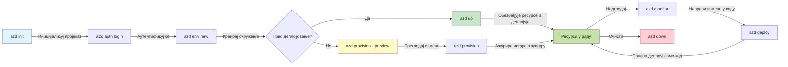
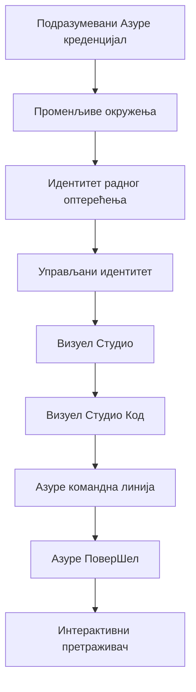

# AZD основе - Разумевање Azure Developer CLI

# AZD основе - Кључни појмови и основе

**Навигација кроз поглавља:**
- **📚 Почетна курса**: [AZD For Beginners](../../README.md)
- **📖 Текуће поглавље**: Поглавље 1 - Основа и брзи почетак
- **⬅️ Претходно**: [Course Overview](../../README.md#-chapter-1-foundation--quick-start)
- **➡️ Следеће**: [Installation & Setup](installation.md)
- **🚀 Следеће поглавље**: [Поглавље 2: Развој фокусиран на ВИ](../chapter-02-ai-development/microsoft-foundry-integration.md)

## Увод

Овај лекција уводи Azure Developer CLI (azd), моћан алат за командну линију који убрзава ваш пут од локалног развоја до развоја на Azure-у. Научићете основне појмове, кључне функције и разумети како azd поједностављује разместање cloud-native апликација.

## Циљеви учења

На крају ове лекције, бићете у стању да:
- Разумете шта је Azure Developer CLI и његову примарну сврху
- Научите основне појмове о темплејтима, окружењима и сервисима
- Истражите кључне функције укључујући развој вођен темплејтима и Infrastructure as Code
- Разумете структуру azd пројекта и радни ток
- Будете спремни да инсталирате и конфигуришете azd за своје развојно окружење

## Резултати учења

Након завршетка ове лекције, моћи ћете да:
- Објасните улогу azd у савременим cloud development радним токовима
- Идентификујете компоненте структуре azd пројекта
- Опишете како темплејти, окружења и сервиси функционишу заједно
- Разумете предности Infrastructure as Code уз azd
- Препознате различите azd команде и њихове сврхе

## Шта је Azure Developer CLI (azd)?

Azure Developer CLI (azd) је алат за командну линију дизајниран да убрза ваш пут од локалног развоја до разместања на Azure-у. Поједностављује процес израде, разместа и управљања cloud-native апликацијама на Azure-у.

### Шта можете да размещујете помоћу azd?

azd подржава широк спектар радних оптерећења — и листа се стално шири. Данас можете користити azd за разместање:

| Workload Type | Examples | Same Workflow? |
|---------------|----------|----------------|
| **Traditional applications** | Web apps, REST APIs, static sites | ✅ `azd up` |
| **Services and microservices** | Container Apps, Function Apps, multi-service backends | ✅ `azd up` |
| **AI-powered applications** | Chat apps with Microsoft Foundry Models, RAG solutions with AI Search | ✅ `azd up` |
| **Intelligent agents** | Foundry-hosted agents, multi-agent orchestrations | ✅ `azd up` |

Кључна поента је да **azd животни циклус остаје исти без обзира на то шта размешташ**. Иницијализујете пројекат, провизионишете инфраструктуру, размештате код, надгледате апликацију и чистите ресурсе — било да је у питању једноставан веб сајт или софистицирани ВИ агент.

Ова континуитет је намерно дизајниран. azd посматра ВИ могућности као још један сервис који ваша апликација може да користи, а не као нешто суштински другачије. Чат крајња тачка поткрепљена Microsoft Foundry Models из перспективе azd је само још један сервис који треба конфигурисати и разместити.

### 🎯 Зашто користити AZD? Поређење из стварног света

Поредићемо разместање једноставне веб апликације са базом података:

#### ❌ БЕЗ AZD: Ручно Azure разместање (15+ минута)

```bash
# Корак 1: Креирајте групу ресурса
az group create --name myapp-rg --location eastus

# Корак 2: Креирајте App Service план
az appservice plan create --name myapp-plan \
  --resource-group myapp-rg \
  --sku B1 --is-linux

# Корак 3: Креирајте веб апликацију
az webapp create --name myapp-web-unique123 \
  --resource-group myapp-rg \
  --plan myapp-plan \
  --runtime "NODE:18-lts"

# Корак 4: Креирајте Cosmos DB налог (10-15 минута)
az cosmosdb create --name myapp-cosmos-unique123 \
  --resource-group myapp-rg \
  --kind MongoDB

# Корак 5: Креирајте базу података
az cosmosdb mongodb database create \
  --account-name myapp-cosmos-unique123 \
  --resource-group myapp-rg \
  --name tododb

# Корак 6: Креирајте колекцију
az cosmosdb mongodb collection create \
  --account-name myapp-cosmos-unique123 \
  --resource-group myapp-rg \
  --database-name tododb \
  --name todos

# Корак 7: Добијте конекциони низ
CONN_STR=$(az cosmosdb keys list \
  --name myapp-cosmos-unique123 \
  --resource-group myapp-rg \
  --type connection-strings \
  --query "connectionStrings[0].connectionString" -o tsv)

# Корак 8: Конфигуришите подешавања апликације
az webapp config appsettings set \
  --name myapp-web-unique123 \
  --resource-group myapp-rg \
  --settings MONGODB_URI="$CONN_STR"

# Корак 9: Омогућите логовање
az webapp log config --name myapp-web-unique123 \
  --resource-group myapp-rg \
  --application-logging filesystem \
  --detailed-error-messages true

# Корак 10: Подесите Application Insights
az monitor app-insights component create \
  --app myapp-insights \
  --location eastus \
  --resource-group myapp-rg

# Корак 11: Повежите Application Insights са веб апликацијом
INSTRUMENTATION_KEY=$(az monitor app-insights component show \
  --app myapp-insights \
  --resource-group myapp-rg \
  --query "instrumentationKey" -o tsv)

az webapp config appsettings set \
  --name myapp-web-unique123 \
  --resource-group myapp-rg \
  --settings APPINSIGHTS_INSTRUMENTATIONKEY="$INSTRUMENTATION_KEY"

# Корак 12: Изградите апликацију локално
npm install
npm run build

# Корак 13: Креирајте пакет за деплој
zip -r app.zip . -x "*.git*" "node_modules/*"

# Корак 14: Разместите апликацију
az webapp deployment source config-zip \
  --resource-group myapp-rg \
  --name myapp-web-unique123 \
  --src app.zip

# Корак 15: Чекајте и молите се да ради 🙏
# (Нема аутоматске валидације, потребно ручно тестирање)
```

**Проблеми:**
- ❌ 15+ команди за памћење и извршавање по реду
- ❌ 30-45 минута ручног рада
- ❌ Лако је направити грешке (типографске, погрешни параметри)
- ❌ Низови за повезивање изложени у историји терминала
- ❌ Нема аутоматског повлачења ако нешто не успе
- ❌ Тешко за реплицирање за чланове тима
- ❌ Сваки пут другачије (нерепродуцибилно)

#### ✅ СА AZD: Аутоматизовано разместање (5 команди, 10-15 минута)

```bash
# Корак 1: Иницијализујте из шаблона
azd init --template todo-nodejs-mongo

# Корак 2: Аутентификујте се
azd auth login

# Корак 3: Креирајте окружење
azd env new dev

# Корак 4: Прегледајте измене (опционо, али препоручено)
azd provision --preview

# Корак 5: Размештите све
azd up

# ✨ Готово! Све је размештено, конфигурисано и надгледано
```

**Предности:**
- ✅ **5 команди** уместо 15+ ручних корака
- ✅ **10-15 минута** укупног времена (углавном чекање Azure-а)
- ✅ **Нула грешака** - аутоматизовано и тестирано
- ✅ **Тајне безбедно управљане** преко Key Vault-а
- ✅ **Аутоматско повлачење** при неуспеху
- ✅ **Потпуно репродуцибилно** - исти резултат сваки пут
- ✅ **Спремно за тим** - било ко може разместити истим командама
- ✅ **Infrastructure as Code** - Bicep темплејти под верзионим контролом
- ✅ **Уграђено праћење** - Application Insights конфигурисан аутоматски

### 📊 Смањење времена & грешака

| Metric | Manual Deployment | AZD Deployment | Improvement |
|:-------|:------------------|:---------------|:------------|
| **Commands** | 15+ | 5 | 67% мање |
| **Time** | 30-45 min | 10-15 min | 60% брже |
| **Error Rate** | ~40% | <5% | 88% смањење |
| **Consistency** | Low (manual) | 100% (automated) | Савршено |
| **Team Onboarding** | 2-4 hours | 30 minutes | 75% брже |
| **Rollback Time** | 30+ min (manual) | 2 min (automated) | 93% брже |

## Основни појмови

### Темплејти
Темплејти су основа azd-а. Садрже:
- **Код апликације** - Ваш изворни код и зависности
- **Дефиниције инфраструктуре** - Azure ресурси дефинисани у Bicep-у или Terraform-у
- **Конфигурациони фајлови** - Подешавања и променљиве окружења
- **Скрипте за разместање** - Аутоматизовани радни токови за разместање

### Окружења
Окружења представљају различите циљеве за разместање:
- **Development** - За тестирање и развој
- **Staging** - Пре-продукционо окружење
- **Production** - Лајв продукционо окружење

Свако окружење одржава своје:
- Azure resource group
- Configuration settings
- Deployment state

### Сервиси
Сервиси су градивни блокови ваше апликације:
- **Frontend** - Веб апликације, SPA
- **Backend** - API-ји, микросервиси
- **Database** - Решeња за складиштење података
- **Storage** - Складиште за фајлове и блобове

## Кључне функције

### 1. Развој вођен темплејтима
```bash
# Прегледајте доступне шаблоне
azd template list

# Иницијализуј из шаблона
azd init --template <template-name>
```

### 2. Infrastructure as Code
- **Bicep** - Azure-ов домен-специфични језик
- **Terraform** - Мулти-клауд алатка за инфраструктуру
- **ARM Templates** - Azure Resource Manager темплејти

### 3. Интегрисани радни токови
```bash
# Комплетан ток распоређивања
azd up            # Провизионисање + распоређивање — ово је аутоматско за прво подешавање

# 🧪 НОВО: Прегледај промене инфраструктуре пре распоређивања (БЕЗБЕДНО)
azd provision --preview    # Симулирај распоређивање инфраструктуре без уношења промена

azd provision     # Креирај Azure ресурсе ако ажурираш инфраструктуру — користи ово
azd deploy        # Распореди код апликације или поново распореди код апликације након ажурирања
azd down          # Очисти ресурсе
```

#### 🛡️ Безбедно планирање инфраструктуре уз preview
Команда `azd provision --preview` је револуционарна за безбедна разместања:
- **Суха проба (dry-run)** - Приказује шта ће бити креирано, измењено или обрисано
- **Нула ризика** - Није направљена никаква стварна промена у вашем Azure окружењу
- **Тимска сарадња** - Делите резултате preview-а пре разместања
- **Процењивање трошкова** - Разумете трошкове ресурса пре обавезивања

```bash
# Пример прегледа радног тока
azd provision --preview           # Погледајте шта ће се променити
# Прегледајте резултат, разговарајте са тимом
azd provision                     # Примените промене са поверењем
```

### 📊 Визуелно: AZD радни ток развоја


**Објашњење радног тока:**
1. **Init** - Почните са темплејтом или новим пројектом
2. **Auth** - Аутентификовати се са Azure-ом
3. **Environment** - Креирајте изоловано окружење за разместање
4. **Preview** - 🆕 Увек прегледајте измене инфраструктуре прво (безбедна пракса)
5. **Provision** - Креирање/ажурирање Azure ресурса
6. **Deploy** - Пуштате ваш апликацијски код
7. **Monitor** - Пратите перформансе апликације
8. **Iterate** - Правите измене и поново разместите код
9. **Cleanup** - Уклоните ресурсе када завршите

### 4. Управљање окружењима
```bash
# Креирајте и управљајте окружењима
azd env new <environment-name>
azd env select <environment-name>
azd env list
```

### 5. Екстензије и AI команде

azd користи систем екстензија за додавање могућности ван основне CLI функционалности. Ово је посебно корисно за ВИ радна оптерећења:

```bash
# Прикажи доступна проширења
azd extension list

# Инсталирај проширење Foundry agents
azd extension install azure.ai.agents

# Иницијализуј пројекат AI агента из манифеста
azd ai agent init -m agent-manifest.yaml

# Покрени MCP сервер за развој уз помоћ AI (Алфа)
azd mcp start
```

> Екстензије су обрађене детаљније у [Поглавље 2: Развој фокусиран на ВИ](../chapter-02-ai-development/agents.md) и у референци [AZD AI CLI Commands](../chapter-08-production/production-ai-practices.md#azd-ai-cli-commands-and-extensions).

## 📁 Структура пројекта

Типична azd структура пројекта:
```
my-app/
├── .azd/                    # azd configuration
│   └── config.json
├── .azure/                  # Azure deployment artifacts
├── .devcontainer/          # Development container config
├── .github/workflows/      # GitHub Actions
├── .vscode/               # VS Code settings
├── infra/                 # Infrastructure code
│   ├── main.bicep        # Main infrastructure template
│   ├── main.parameters.json
│   └── modules/          # Reusable modules
├── src/                  # Application source code
│   ├── api/             # Backend services
│   └── web/             # Frontend application
├── azure.yaml           # azd project configuration
└── README.md
```

## 🔧 Конфигурациони фајлови

### azure.yaml
Главни конфигурациони фајл пројекта:
```yaml
name: my-awesome-app
metadata:
  template: my-template@1.0.0

services:
  web:
    project: ./src/web
    language: js
    host: appservice
  api:
    project: ./src/api
    language: js
    host: appservice

hooks:
  preprovision:
    shell: pwsh
    run: echo "Preparing to provision..."
```

### .azure/config.json
Конфигурација специфична за окружење:
```json
{
  "version": 1,
  "defaultEnvironment": "dev",
  "environments": {
    "dev": {
      "subscriptionId": "your-subscription-id",
      "location": "eastus"
    }
  }
}
```

## 🎪 Уобичајени радни токови са практичним вежбама

> **💡 Савет за учење:** Пратите ове вежбе по реду да бисте постепено изградили AZD вештине.

### 🎯 Вежба 1: Иницијализујте свој први пројекат

**Циљ:** Креирати AZD пројекат и истражити његову структуру

**Кораци:**
```bash
# Користите проверени шаблон
azd init --template todo-nodejs-mongo

# Истражите генерисане датотеке
ls -la  # Прикажите све датотеке укључујући и скривене

# Кључне датотеке које су креиране:
# - azure.yaml (главна конфигурација)
# - infra/ (инфраструктурни код)
# - src/ (код апликације)
```

**✅ Успех:** Имaтe azure.yaml, infra/ и src/ директоријуме

---

### 🎯 Вежба 2: Разместите на Azure

**Циљ:** Комплетно end-to-end разместање

**Кораци:**
```bash
# 1. Аутентификујте се
az login && azd auth login

# 2. Креирајте окружење
azd env new dev
azd env set AZURE_LOCATION eastus

# 3. Прегледајте измене (ПРЕПОРУЧЕНО)
azd provision --preview

# 4. Објавите све
azd up

# 5. Проверите распоређивање
azd show    # Погледајте УРЛ ваше апликације
```

**Очекивано време:** 10-15 минута  
**✅ Успех:** URL апликације се отвара у прегледачу

---

### 🎯 Вежба 3: Вишestruka окружења

**Циљ:** Разместити на dev и staging

**Кораци:**
```bash
# Већ имате dev, направите staging
azd env new staging
azd env set AZURE_LOCATION westus2
azd up

# Пребацујте се између њих
azd env list
azd env select dev
```

**✅ Успех:** Две одвојене resource group-ове у Azure порталу

---

### 🛡️ Чисто почетно стање: `azd down --force --purge`

Када вам је потребно потпуно ресетовање:

```bash
azd down --force --purge
```

**Шта ради:**
- `--force`: Нема захтева за потврду
- `--purge`: Брише све локално стање и Azure ресурсе

**Користити када:**
- Разместање је пропало на пола
- Прелазите на други пројекат
- Потребан је свеж почетак

---

## 🎪 Референца оригиналног радног тока

### Покретање новог пројекта
```bash
# Метод 1: Користите постојећи шаблон
azd init --template todo-nodejs-mongo

# Метод 2: Почните од почетка
azd init

# Метод 3: Користите текући директоријум
azd init .
```

### Развојни циклус
```bash
# Подесите развојно окружење
azd auth login
azd env new dev
azd env select dev

# Размештите све
azd up

# Направите измене и поново размештите
azd deploy

# Очистите када завршите
azd down --force --purge # Команда у Azure Developer CLI је **потпуно враћање на почетно стање** за ваше окружење — посебно корисно када решавате проблеме са неуспелим размештањима, чистите напуштене ресурсе или припремате окружење за ново размештање.
```

## Разумевање `azd down --force --purge`
Команда `azd down --force --purge` је моћан начин да потпуно срушите своје azd окружење и све повезане ресурсе. Ево распада шта сваки флаг ради:
```
--force
```
- Прелази преко упита за потврду.
- Корисно за аутоматизацију или скриптовање где ручни унос није изводљив.
- Осигурава да рушење настави без прекида, чак и ако CLI детектује неконзистентности.

```
--purge
```
Брише **сву повезану метаподатке**, укључујући:
Стање окружења
Локални `.azure` фолдер
Кеширане информације о разместању
Спрема azd да „не памти“ претходна разместања, што може изазвати проблеме као што су несуслашена resource group имена или застарела референца регистара.


### Зашто користити оба?
Када наиђете на зид са `azd up` због преосталог стања или делимичних разместаја, ова комбинација осигурава **чист почетак**.

Посебно је корисно након ручних брисања ресурса у Azure порталу или када мењате темплејте, окружења или конвенције именовања resource group-ова.


### Управљање вишеструким окружењима
```bash
# Креирај припремно окружење
azd env new staging
azd env select staging
azd up

# Врати се на развојно окружење
azd env select dev

# Упореди окружења
azd env list
```

## 🔐 Аутентикација и креденцијали

Разумевање аутентикације је кључно за успешна azd разместања. Azure користи више метода аутентикације, а azd користи исти ланац креденцијала који користе и други Azure алати.

### Azure CLI аутентикација (`az login`)

Пре коришћења azd-а, потребно је аутентификовати се на Azure. Најчешћи начин је коришћење Azure CLI:

```bash
# Интерактивна пријава (отвара прегледач)
az login

# Пријава са одређеним тенантом
az login --tenant <tenant-id>

# Пријава помоћу сервисног принципала
az login --service-principal -u <app-id> -p <password> --tenant <tenant-id>

# Провери тренутни статус пријаве
az account show

# Прикажи доступне претплате
az account list --output table

# Постави подразумевану претплату
az account set --subscription <subscription-id>
```

### Флукс аутентикације
1. **Интерактивни логин**: Отвара ваш подразумевани прегледач за аутентификацију
2. **Device Code Flow**: За окружења без приступа прегледачу
3. **Service Principal**: За аутоматизацију и CI/CD сценарије
4. **Managed Identity**: За апликације које се покрећу на Azure ресурсима

### Ланац DefaultAzureCredential

`DefaultAzureCredential` је тип креденцијала који пружа поједностављено искуство аутентикације тако што аутоматски покушава више извора креденцијала у одређеном редоследу:

#### Редослед ланца креденцијала

#### 1. Переметри окружења
```bash
# Поставите променљиве окружења за службени налог
export AZURE_CLIENT_ID="<app-id>"
export AZURE_CLIENT_SECRET="<password>"
export AZURE_TENANT_ID="<tenant-id>"
```

#### 2. Workload Identity (Kubernetes/GitHub Actions)
Користи се аутоматски у:
- Azure Kubernetes Service (AKS) са Workload Identity
- GitHub Actions са OIDC федерацијом
- Остали сценарији са федеративним идентитетом

#### 3. Managed Identity
За Azure ресурсе као што су:
- Виртуалне машине
- App Service
- Azure Functions
- Container Instances

```bash
# Провери да ли се покреће на Azure ресурсу са управљеним идентитетом
az account show --query "user.type" --output tsv
# Враћа: "servicePrincipal" ако користи управљани идентитет
```

#### 4. Интеграција са алаткама за развој
- **Visual Studio**: Аутоматски користи пријављени налог
- **VS Code**: Користи креденцијале Azure Account екстензије
- **Azure CLI**: Користи `az login` креденцијале (најчешће за локални развој)

### Подешавање аутентикације у AZD

```bash
# Метод 1: Користите Azure CLI (Препоручено за развој)
az login
azd auth login  # Користи постојеће податке за пријаву Azure CLI

# Метод 2: Директна azd аутентификација
azd auth login --use-device-code  # За окружења без графичког интерфејса

# Метод 3: Проверите статус аутентификације
azd auth login --check-status

# Метод 4: Одјавите се и поново се аутентификујте
azd auth logout
azd auth login
```

### Најбоље праксе за аутентикацију

#### За локални развој
```bash
# 1. Пријавите се помоћу Azure CLI
az login

# 2. Проверите исправну претплату
az account show
az account set --subscription "Your Subscription Name"

# 3. Користите azd са постојећим акредитивима
azd auth login
```

#### За CI/CD пайплајне
```yaml
# GitHub Actions example
- name: Azure Login
  uses: azure/login@v1
  with:
    creds: ${{ secrets.AZURE_CREDENTIALS }}

- name: Deploy with azd
  run: |
    azd auth login --client-id ${{ secrets.AZURE_CLIENT_ID }} \
                    --client-secret ${{ secrets.AZURE_CLIENT_SECRET }} \
                    --tenant-id ${{ secrets.AZURE_TENANT_ID }}
    azd up --no-prompt
```

#### За продукциона окружења
- Користите **Managed Identity** када покрећете на Azure ресурсима
- Користите **Service Principal** за аутоматизацију
- Избегавајте чување креденцијала у коду или конфигурационим фајловима
- Користите **Azure Key Vault** за осетљиву конфигурацију

### Уобичајени проблеми са аутентикацијом и решења

#### Проблем: "No subscription found"
```bash
# Решење: Подесите подразумевану претплату
az account list --output table
az account set --subscription "<subscription-id>"
azd env set AZURE_SUBSCRIPTION_ID "<subscription-id>"
```

#### Проблем: "Insufficient permissions"
```bash
# Решење: Проверите и доделите потребне улоге
az role assignment list --assignee $(az account show --query user.name --output tsv)

# Уобичајене потребне улоге:
# - Contributor (за управљање ресурсима)
# - User Access Administrator (за доделу улога)
```

#### Проблем: "Token expired"
```bash
# Решење: Поново се аутентификујте
az logout
az login
azd auth logout
azd auth login
```

### Аутентикација у различитим сценаријима

#### Локални развој
```bash
# Налог за лични развој
az login
azd auth login
```

#### Тимски развој
```bash
# Користите одређеног тенанта за организацију
az login --tenant contoso.onmicrosoft.com
azd auth login
```

#### Мулти-тенант сценарији
```bash
# Пребацивање између тенаната
az login --tenant tenant1.onmicrosoft.com
# Размештање на тенант 1
azd up

az login --tenant tenant2.onmicrosoft.com  
# Размештање на тенант 2
azd up
```

### Безбедносне разматрања
1. **Складиштење акредитива**: Никад не чувајте акредитиве у изворном коду
2. **Ограничење опсега**: Користите принцип најмањих привилегија за сервисне налоге
3. **Ротација токена**: Редовно мењајте тајне сервисних налога
4. **Записи ревизије**: Надгледајте активности аутентификације и размењивања
5. **Безбедност мреже**: Користите приватне крајње тачке када је могуће

### Решавање проблема са аутентификацијом

```bash
# Отклањање грешака при аутентификацији
azd auth login --check-status
az account show
az account get-access-token

# Уобичајене дијагностичке команде
whoami                          # Текући контекст корисника
az ad signed-in-user show      # Подаци о кориснику Azure AD
az group list                  # Тестирање приступа ресурсу
```

## Разумевање `azd down --force --purge`

### Откривање
```bash
azd template list              # Прегледај шаблоне
azd template show <template>   # Детаљи шаблона
azd init --help               # Опције иницијализације
```

### Управљање пројектом
```bash
azd show                     # Преглед пројекта
azd env show                 # Тренутно окружење
azd config list             # Подешавања конфигурације
```

### Надгледање
```bash
azd monitor                  # Отворите мониторинг Azure портала
azd monitor --logs           # Погледајте логове апликације
azd monitor --live           # Погледајте метрике у реалном времену
azd pipeline config          # Подесите CI/CD
```

## Најбоље праксе

### 1. Користите смислена имена
```bash
# Добро
azd env new production-east
azd init --template web-app-secure

# Избегавајте
azd env new env1
azd init --template template1
```

### 2. Искористите шаблоне
- Почните са постојећим шаблонима
- Прилагодите их вашим потребама
- Направите поново употребљиве шаблоне за вашу организацију

### 3. Изолација окружења
- Користите одвојена окружења за dev/staging/prod
- Никад не распоређујте директно у продукцију са локалне машине
- Користите CI/CD pipeline-ове за продукциона размествaња

### 4. Управљање конфигурацијом
- Користите променљиве окружења за осетљиве податке
- Чувајте конфигурацију у систему контроле верзија
- Документирајте подешавања специфична за окружење

## Напредовање у учењу

### Почетник (Недеља 1-2)
1. Инсталирајте azd и аутентификујте се
2. Распоредите једноставан шаблон
3. Разумете структуру пројекта
4. Научите основне команде (up, down, deploy)

### Средњи (Недеља 3-4)
1. Прилагодите шаблоне
2. Управљајте више окружења
3. Разумете инфраструктурни код
4. Подесите CI/CD pipeline-ове

### Напредни (Недеља 5+)
1. Направите прилагођене шаблоне
2. Напредни инфраструктурни обрасци
3. Распоређивања у више региона
4. Конфигурације корпоративног нивоа

## Следећи кораци

**📖 Наставите учење Поглавља 1:**
- [Инсталација и подешавање](installation.md) - Инсталирајте и конфигуришите azd
- [Ваш први пројекат](first-project.md) - Завршите практични туторијал
- [Водич за конфигурацију](configuration.md) - Напредне опције конфигурације

**🎯 Спремни за следеће поглавље?**
- [Поглавље 2: Развој вођен вештачком интелигенцијом](../chapter-02-ai-development/microsoft-foundry-integration.md) - Почните да правите AI апликације

## Додатни ресурси

- [Преглед Azure Developer CLI](https://learn.microsoft.com/en-us/azure/developer/azure-developer-cli/)
- [Галерија шаблона](https://azure.github.io/awesome-azd/)
- [Примери заједнице](https://github.com/Azure-Samples)

---

## 🙋 Често постављана питања

### Општа питања

**П: Која је разлика између AZD и Azure CLI?**

О: Azure CLI (`az`) служи за управљање појединачним Azure ресурсима. AZD (`azd`) служи за управљање целим апликацијама:

```bash
# Azure CLI - управљање ресурсима ниског нивоа
az webapp create --name myapp --resource-group rg
az sql server create --name myserver --resource-group rg
# ...потребно је још много команди

# AZD - управљање на нивоу апликације
azd up  # Распоређује целу апликацију са свим ресурсима
```

**Замислите то овако:**
- `az` = Руковање појединачним коцкицама Лего
- `azd` = Рад са комплетним Лего сетовима

---

**П: Да ли треба да знам Bicep или Terraform да бих користио AZD?**

О: Не! Почните са шаблонima:
```bash
# Користите постојећи шаблон - није потребно знање о инфраструктури као коду
azd init --template todo-nodejs-mongo
azd up
```

Можете научити Bicep касније да прилагодите инфраструктуру. Шаблони пружају функционалне примере са којих можете учити.

---

**П: Колико кошта покретање AZD шаблона?**

О: Трошкови зависе од шаблона. Већина шаблона за развој кошта $50-150/месечно:

```bash
# Прегледајте трошкове пре распоређивања
azd provision --preview

# Увек очистите када не користите
azd down --force --purge  # Уклања све ресурсе
```

**Стручни савет:** Користите бесплатне нивое где су доступни:
- App Service: F1 (Free) ниво
- Microsoft Foundry Models: Azure OpenAI 50,000 tokens/месечно бесплатно
- Cosmos DB: 1000 RU/s бесплатни ниво

---

**П: Могу ли користити AZD са постојећим Azure ресурсима?**

О: Да, али је лакше почети из почетка. AZD најбоље функционише када управља целим животним циклусом. За постојеће ресурсе:

```bash
# Опција 1: Увези постојеће ресурсе (напредно)
azd init
# Затим измените infra/ да указује на постојеће ресурсе

# Опција 2: Почни изнова (препоручено)
azd init --template matching-your-stack
azd up  # Креира ново окружење
```

---

**П: Како да поделим пројекат са члановима тима?**

О: Комитујте AZD пројекат у Git (али НЕ `.azure/` фасциклу):

```bash
# Већ је подразумевано у .gitignore
.azure/        # Садржи тајне и податке о окружењу
*.env          # Променљиве окружења

# Чланови тима тада:
git clone <your-repo>
azd auth login
azd env new <their-name>-dev
azd up
```

Сви добијају идентичну инфраструктуру из истих шаблона.

---

### Питања о решавању проблема

**П: "azd up" није успео до краја. Шта да радим?**

О: Проверите грешку, исправите је, па покушајте поново:

```bash
# Погледај детаљне записе
azd show

# Уобичајена решења:

# 1. Ако је квота премашена:
azd env set AZURE_LOCATION "westus2"  # Покушајте другу регију

# 2. Ако постоји конфликт имена ресурса:
azd down --force --purge  # Почистите све
azd up  # Покушајте поново

# 3. Ако је аутентификација истекла:
az login
azd auth login
azd up
```

**Најчешћи проблем:** Одабрана је погрешна Azure претплата
```bash
az account list --output table
az account set --subscription "<correct-subscription>"
```

---

**П: Како да распоредим само промене у коду без поновног провизионисања?**

О: Користите `azd deploy` уместо `azd up`:

```bash
azd up          # Први пут: припрема + распоређивање (споро)

# Направите измене у коду...

azd deploy      # Следећи пут: само распоређивање (брзо)
```

Поређење брзине:
- `azd up`: 10-15 минута (провизионише инфраструктуру)
- `azd deploy`: 2-5 минута (само код)

---

**П: Могу ли прилагодити инфраструктурне шаблоне?**

О: Да! Измените Bicep фајлове у `infra/`:

```bash
# После azd init
cd infra/
code main.bicep  # Уреди у VS Code

# Прегледај промене
azd provision --preview

# Примени промене
azd provision
```

**Савет:** Почните мало - прво мењајте SKU-ове:
```bicep
// infra/main.bicep
sku: {
  name: 'B1'  // Change to 'P1V2' for production
}
```

---

**П: Како да избришем све што је AZD креирао?**

О: Једна команда уклања све ресурсе:

```bash
azd down --force --purge

# Ово брише:
# - Све Azure ресурсе
# - Ресурсну групу
# - Локално стање окружења
# - Кеширане податке о деплојменту
```

**Увек покрените ово када:**
- Завршили сте тестирање шаблона
- Прелазите на други пројекат
- Желите почети из почетка

**Уштеда трошкова:** Брисање неискоришћених ресурса = $0 трошкова

---

**П: Шта ако случајно избришем ресурсе у Azure порталу?**

О: Стање AZD-а може бити неусклађено. Препоручује се приступ „чисте плоче“:
```bash
# 1. Уклони локално стање
azd down --force --purge

# 2. Почни изнова
azd up

# Алтернатива: Нека AZD открије и исправи
azd provision  # Креираће недостајуће ресурсе
```

---

### Напредна питања

**П: Могу ли користити AZD у CI/CD pipeline-овима?**

О: Да! Пример за GitHub Actions:

```yaml
# .github/workflows/deploy.yml
name: Deploy with AZD

on:
  push:
    branches: [main]

jobs:
  deploy:
    runs-on: ubuntu-latest
    steps:
      - uses: actions/checkout@v2
      
      - name: Install azd
        run: curl -fsSL https://aka.ms/install-azd.sh | bash
      
      - name: Azure Login
        run: |
          azd auth login \
            --client-id ${{ secrets.AZURE_CLIENT_ID }} \
            --client-secret ${{ secrets.AZURE_CLIENT_SECRET }} \
            --tenant-id ${{ secrets.AZURE_TENANT_ID }}
      
      - name: Deploy
        run: azd up --no-prompt
```

---

**П: Како да управљам тајнама и осетљивим подацима?**

О: AZD се аутоматски интегрише са Azure Key Vault-ом:

```bash
# Тајне се чувају у Key Vault-у, а не у коду
azd env set DATABASE_PASSWORD "$(openssl rand -base64 32)"

# AZD аутоматски:
# 1. Креира Key Vault
# 2. Чува тајну
# 3. Даје апликацији приступ помоћу управљеног идентитета
# 4. Убацује током извршавања
```

**Никад не комитујте:**
- `.azure/` фолдер (садржи податке о окружењу)
- `.env` фајлови (локалне тајне)
- низови за повезивање

---

**П: Могу ли распоредити у више региона?**

О: Да, креирајте окружење по региону:

```bash
# Окружење Источних САД
azd env new prod-eastus
azd env set AZURE_LOCATION eastus
azd up

# Окружење Западне Европе
azd env new prod-westeurope
azd env set AZURE_LOCATION westeurope
azd up

# Свако окружење је независно
azd env list
```

За праве апликације у више регија, прилагодите Bicep шаблоне да распоређују у више региона истовремено.

---

**П: Где могу добити помоћ ако запнем?**

1. **Документација AZD-а:** https://learn.microsoft.com/azure/developer/azure-developer-cli/
2. **GitHub Issues:** https://github.com/Azure/azure-dev/issues
3. **Discord:** [Azure Discord](https://discord.gg/microsoft-azure) - канал #azure-developer-cli
4. **Stack Overflow:** Таг `azure-developer-cli`
5. **Овaј курс:** [Водич за решавање проблема](../chapter-07-troubleshooting/common-issues.md)

**Стручни савет:** Пре него што питате, покрените:
```bash
azd show       # Приказује тренутно стање
azd version    # Приказује вашу верзију
```
Укључите ове информације у ваше питање за бржу помоћ.

---

## 🎓 Шта следи?

Сада разумете основе AZD-а. Изаберите свој пут:

### 🎯 За почетнике:
1. **Следеће:** [Инсталација и подешавање](installation.md) - Инсталирајте AZD на ваш рачунар
2. **Затим:** [Ваш први пројекат](first-project.md) - Распоредите своју прву апликацију
3. **Вежба:** Завршите сва 3 задатка у овој лекцији

### 🚀 За AI развојаче:
1. **Прескочите на:** [Поглавље 2: Развој вођен вештачком интелигенцијом](../chapter-02-ai-development/microsoft-foundry-integration.md)
2. **Распоредите:** Почните са `azd init --template get-started-with-ai-chat`
3. **Учите:** Градите док распоређујете

### 🏗️ За искусне програмере:
1. **Преглед:** [Водич за конфигурацију](configuration.md) - Напредна подешавања
2. **Истражите:** [Инфраструктура као код](../chapter-04-infrastructure/provisioning.md) - Дубински преглед Bicep-а
3. **Изградите:** Направите прилагођене шаблоне за ваш стек

---

**Навигација поглавља:**
- **📚 Почетна страница курса**: [AZD за почетнике](../../README.md)
- **📖 Тренутно поглавље**: Поглавље 1 - Основе и брзи почетак  
- **⬅️ Претходно**: [Преглед курса](../../README.md#-chapter-1-foundation--quick-start)
- **➡️ Следеће**: [Инсталација и подешавање](installation.md)
- **🚀 Следеће поглавље**: [Поглавље 2: Развој вођен вештачком интелигенцијом](../chapter-02-ai-development/microsoft-foundry-integration.md)

---

<!-- CO-OP TRANSLATOR DISCLAIMER START -->
**Одрицање одговорности**:
Овај документ је преведен помоћу сервиса за превођење на бази вештачке интелигенције [Co-op Translator](https://github.com/Azure/co-op-translator). Иако тежимо тачности, имајте у виду да аутоматски преводи могу садржати грешке или нетачности. Оригинални документ на његовом изворном језику треба сматрати ауторитетним извором. За критичне информације препоручује се професионалан људски превод. Нисмо одговорни за било какве неспоразуме или погрешне тумачења која произилазе из коришћења овог превода.
<!-- CO-OP TRANSLATOR DISCLAIMER END -->