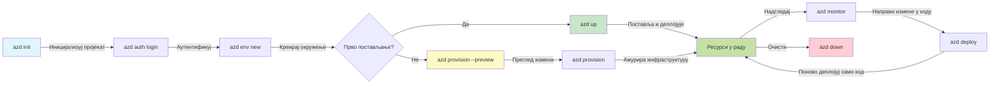
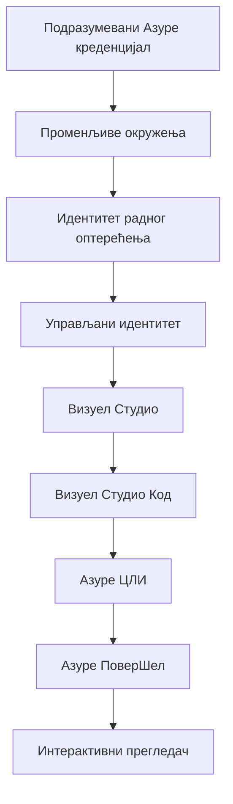

# AZD Basics - Understanding Azure Developer CLI

# AZD Basics - Core Concepts and Fundamentals

**Chapter Navigation:**
- **📚 Почетна страница курса**: [AZD за почетнике](../../README.md)
- **📖 Тренутно поглавље**: Поглавље 1 - Основа и Брзи Почетак
- **⬅️ Претходно**: [Преглед курса](../../README.md#-chapter-1-foundation--quick-start)
- **➡️ Следеће**: [Инсталација и Подешавање](installation.md)
- **🚀 Следеће поглавље**: [Поглавље 2: Развој оријентисан на вештачку интелигенцију](../chapter-02-ai-development/microsoft-foundry-integration.md)

## Увод

Овај час вам представља Azure Developer CLI (azd), моћан алат командне линије који убрзава ваш пут од локалног развоја до деплоја на Azure. Научићете основне концепте, кључне функције и разумети како azd поједностављује постављање cloud-native апликација.

## Циљеви учења

На крају овог часа, ви ћете:
- Разумети шта је Azure Developer CLI и његову основну сврху
- Научити основне концепте шаблона, окружења и услуга
- Истражити кључне функције укључујући развој вођен шаблонима и Инфраструктуру као код
- Разумети структуру azd пројекта и ток рада
- Бити припремљени за инсталацију и конфигурацију azd за ваше развојно окружење

## Исходи учења

Након завршетка овог часа, моћи ћете да:
- Објасните улогу azd у модерним cloud развојним токовима
- Идентификујете компоненте azd структуре пројекта
- Описете како шаблони, окружења и услуге сарађују
- Разумете предности Инфраструктуре као кода уз azd
- Препознајете различите azd команде и њихову сврху

## Шта је Azure Developer CLI (azd)?

Azure Developer CLI (azd) је алат командне линије дизајниран да убрза ваш пут од локалног развоја до деплоја на Azure. Поједностављује процес изградње, деплоја и управљања cloud-native апликацијама на Azure.

### 🎯 Зашто користити AZD? Поређење из реалног света

Упоредићемо деплој једноставне веб апликације са базом података:

#### ❌ БЕЗ AZD: Ручни Azure деплој (30+ минута)

```bash
# Корак 1: Креирајте групу ресурса
az group create --name myapp-rg --location eastus

# Корак 2: Креирајте App Service план
az appservice plan create --name myapp-plan \
  --resource-group myapp-rg \
  --sku B1 --is-linux

# Корак 3: Креирајте веб апликацију
az webapp create --name myapp-web-unique123 \
  --resource-group myapp-rg \
  --plan myapp-plan \
  --runtime "NODE:18-lts"

# Корак 4: Креирајте Cosmos DB налог (10-15 минута)
az cosmosdb create --name myapp-cosmos-unique123 \
  --resource-group myapp-rg \
  --kind MongoDB

# Корак 5: Креирајте базу података
az cosmosdb mongodb database create \
  --account-name myapp-cosmos-unique123 \
  --resource-group myapp-rg \
  --name tododb

# Корак 6: Креирајте колекцију
az cosmosdb mongodb collection create \
  --account-name myapp-cosmos-unique123 \
  --resource-group myapp-rg \
  --database-name tododb \
  --name todos

# Корак 7: Добијте конекциони низ
CONN_STR=$(az cosmosdb keys list \
  --name myapp-cosmos-unique123 \
  --resource-group myapp-rg \
  --type connection-strings \
  --query "connectionStrings[0].connectionString" -o tsv)

# Корак 8: Конфигуришите подешавања апликације
az webapp config appsettings set \
  --name myapp-web-unique123 \
  --resource-group myapp-rg \
  --settings MONGODB_URI="$CONN_STR"

# Корак 9: Омогућите логовање
az webapp log config --name myapp-web-unique123 \
  --resource-group myapp-rg \
  --application-logging filesystem \
  --detailed-error-messages true

# Корак 10: Подесите Application Insights
az monitor app-insights component create \
  --app myapp-insights \
  --location eastus \
  --resource-group myapp-rg

# Корак 11: Повежите Application Insights са веб апликацијом
INSTRUMENTATION_KEY=$(az monitor app-insights component show \
  --app myapp-insights \
  --resource-group myapp-rg \
  --query "instrumentationKey" -o tsv)

az webapp config appsettings set \
  --name myapp-web-unique123 \
  --resource-group myapp-rg \
  --settings APPINSIGHTS_INSTRUMENTATIONKEY="$INSTRUMENTATION_KEY"

# Корак 12: Изградите апликацију локално
npm install
npm run build

# Корак 13: Креирајте пакет за распоређивање
zip -r app.zip . -x "*.git*" "node_modules/*"

# Корак 14: Распоредите апликацију
az webapp deployment source config-zip \
  --resource-group myapp-rg \
  --name myapp-web-unique123 \
  --src app.zip

# Корак 15: Чекајте и молите се да ради 🙏
# (Нема аутоматизоване валидације, потребно је ручно тестирање)
```

**Проблеми:**
- ❌ 15+ команди које треба запамтити и извршити по реду
- ❌ 30-45 минута ручног рада
- ❌ Лако је направити грешке (типографске грешке, погрешни параметри)
- ❌ Подаци за повезивање изложени у историји терминала
- ❌ Нема аутоматског враћања у случају грешке
- ❌ Тешко реплицирати за чланове тима
- ❌ Различито сваког пута (није репродуктивно)

#### ✅ СА AZD: Аутоматизовани деплој (5 команди, 10-15 минута)

```bash
# Корак 1: Иницијализујте из шаблона
azd init --template todo-nodejs-mongo

# Корак 2: Аутентификујте се
azd auth login

# Корак 3: Креирајте окружење
azd env new dev

# Корак 4: Прегледајте измене (необавезно, али препоручљиво)
azd provision --preview

# Корак 5: Деплојујте све
azd up

# ✨ Готово! Све је распоређено, конфигурисано и надгледано
```

**Предности:**
- ✅ **5 команди** уместо 15+ ручних корака
- ✅ **10-15 минута** укупног времена (углавном чекање Azure)
- ✅ **Нула грешака** - аутоматизовано и тестирано
- ✅ **Секрети безбедно управљани** преко Key Vault-а
- ✅ **Аутоматско враћање (rollback)** при неуспеху
- ✅ **Потпуно репродуктивно** - исти резултат сваки пут
- ✅ **Спремно за тим** - било ко може деплојовати са истим командама
- ✅ **Инфраструктура као код** - верзионисани Bicep шаблони
- ✅ **Уграђено праћење** - Application Insights аутоматски конфигурисан

### 📊 Смањење времена и грешака

| Metric | Manual Deployment | AZD Deployment | Improvement |
|:-------|:------------------|:---------------|:------------|
| **Commands** | 15+ | 5 | 67% fewer |
| **Time** | 30-45 min | 10-15 min | 60% faster |
| **Error Rate** | ~40% | <5% | 88% reduction |
| **Consistency** | Low (manual) | 100% (automated) | Perfect |
| **Team Onboarding** | 2-4 hours | 30 minutes | 75% faster |
| **Rollback Time** | 30+ min (manual) | 2 min (automated) | 93% faster |

## Језгро концепата

### Шаблони
Шаблони су темељ azd-а. Они садрже:
- **Код апликације** - Ваш изворни код и зависности
- **Дефиниције инфраструктуре** - Azure ресурси дефинисани у Bicep-у или Terraform-у
- **Конфигурационе датотеке** - Поставке и променљиве окружења
- **Скрипте за деплој** - Аутоматизовани радни токови деплоја

### Окружења
Окружења представљају различите циљеве деплоја:
- **Development** - За тестирање и развој
- **Staging** - Пре-продукционо окружење
- **Production** - Живо продукционо окружење

Свако окружење одржава своје:
- Azure resource group
- Конфигурационе поставке
- Стање деплоја

### Услуге
Услуге су грађевни блокови ваше апликације:
- **Frontend** - Веб апликације, SPA-ови
- **Backend** - API-ји, микросервиси
- **Database** - Решенија за чување података
- **Storage** - Складиштење фајлова и blob-ова

## Кључне карактеристике

### 1. Развој вођен шаблонима
```bash
# Прегледајте доступне шаблоне
azd template list

# Иницијализујте из шаблона
azd init --template <template-name>
```

### 2. Инфраструктура као код
- **Bicep** - домен-специфични језик за Azure
- **Terraform** - алат за инфраструктуру на више облака
- **ARM Templates** - Azure Resource Manager шаблони

### 3. Интегрисани токови посла
```bash
# Комплетан ток рада за распоређивање
azd up            # Обезбеђивање + распоређивање — ово је аутоматски процес за прво подешавање

# 🧪 НОВО: Прегледајте измене инфраструктуре пре распоређивања (БЕЗБЕДНО)
azd provision --preview    # Симулација распоређивања инфраструктуре без прављења промена

azd provision     # Креирајте Azure ресурсе — ако ажурирате инфраструктуру, користите ово
azd deploy        # Распоредите код апликације или поново распоредите код апликације након ажурирања
azd down          # Очистите ресурсе
```

#### 🛡️ Безбедно планирање инфраструктуре уз преглед
Команда `azd provision --preview` је пресудна за безбедне деплоје:
- **Анализа сувог покретања** - Приказује шта ће бити креирано, измењено или избрисано
- **Нула ризика** - Није направљена стварна промена у вашем Azure окружењу
- **Сарадња у тиму** - Делите резултате прегледа пре деплоја
- **Процена трошкова** - Разумете трошкове ресурса пре обавезивања

```bash
# Пример прегледног тока рада
azd provision --preview           # Погледајте шта ће се променити
# Прегледајте резултат, разговарајте са тимом
azd provision                     # Примените измене са поверењем
```

### 📊 Визуелно: AZD развојни ток посла


**Објашњење тока рада:**
1. **Init** - Почните са шаблоном или новим пројектом
2. **Auth** - Аутентификујте се са Azure
3. **Environment** - Креирајте изоловано окружење за деплој
4. **Preview** - 🆕 Увек прво прегледајте промене инфраструктуре (безбедна пракса)
5. **Provision** - Креирајте/ажурирајте Azure ресурсе
6. **Deploy** - Отпремите ваш апликациони код
7. **Monitor** - Посматрајте перформансе апликације
8. **Iterate** - Направите измене и поново деплојујте код
9. **Cleanup** - Уклоните ресурсе када завршите

### 4. Управљање окружењима
```bash
# Креирајте и управљајте окружењима
azd env new <environment-name>
azd env select <environment-name>
azd env list
```

## 📁 Структура пројекта

Типична azd структура пројекта:
```
my-app/
├── .azd/                    # azd configuration
│   └── config.json
├── .azure/                  # Azure deployment artifacts
├── .devcontainer/          # Development container config
├── .github/workflows/      # GitHub Actions
├── .vscode/               # VS Code settings
├── infra/                 # Infrastructure code
│   ├── main.bicep        # Main infrastructure template
│   ├── main.parameters.json
│   └── modules/          # Reusable modules
├── src/                  # Application source code
│   ├── api/             # Backend services
│   └── web/             # Frontend application
├── azure.yaml           # azd project configuration
└── README.md
```

## 🔧 Конфигурациони фајлови

### azure.yaml
Главни конфигурациони фајл пројекта:
```yaml
name: my-awesome-app
metadata:
  template: my-template@1.0.0

services:
  web:
    project: ./src/web
    language: js
    host: appservice
  api:
    project: ./src/api
    language: js
    host: appservice

hooks:
  preprovision:
    shell: pwsh
    run: echo "Preparing to provision..."
```

### .azure/config.json
Конфигурација специфична за окружење:
```json
{
  "version": 1,
  "defaultEnvironment": "dev",
  "environments": {
    "dev": {
      "subscriptionId": "your-subscription-id",
      "location": "eastus"
    }
  }
}
```

## 🎪 Уобичајени токови посла са практичним вежбама

> **💡 Савет за учење:** Следите ове вежбе по реду да бисте постепено изградили своје AZD вештине.

### 🎯 Вежба 1: Иницијализујте свој први пројекат

**Циљ:** Креирајте AZD пројекат и истражите његову структуру

**Кораци:**
```bash
# Користите проверени шаблон
azd init --template todo-nodejs-mongo

# Истражите генерисане датотеке
ls -la  # Прикажите све датотеке, укључујући и скривене

# Кључне датотеке које су креиране:
# - azure.yaml (главна конфигурација)
# - infra/ (инфраструктурни код)
# - src/ (код апликације)
```

**✅ Успех:** Имате azure.yaml, infra/, и src/ директоријуме

---

### 🎯 Вежба 2: Деплој на Azure

**Циљ:** Комплетан end-to-end деплој

**Кораци:**
```bash
# 1. Аутентификујте се
az login && azd auth login

# 2. Креирајте окружење
azd env new dev
azd env set AZURE_LOCATION eastus

# 3. Прегледајте измене (ПРЕПОРУЧЕНО)
azd provision --preview

# 4. Разместите све
azd up

# 5. Проверите размештање
azd show    # 6. Погледајте УРЛ ваше апликације
```

**Очекивано време:** 10-15 минута  
**✅ Успех:** URL апликације се отвори у прегледачу

---

### 🎯 Вежба 3: Више окружења

**Циљ:** Деплој на dev и staging

**Кораци:**
```bash
# Већ постоји dev, креирај staging
azd env new staging
azd env set AZURE_LOCATION westus2
azd up

# Пређите између њих
azd env list
azd env select dev
```

**✅ Успех:** Две одвојене групе ресурса у Azure порталу

---

### 🛡️ Чист почетак: `azd down --force --purge`

Када треба потпуно ресетовати:

```bash
azd down --force --purge
```

**Шта ради:**
- `--force`: Без упита за потврду
- `--purge`: Брише сва локална стања и Azure ресурсе

**Користити када:**
- Деплој је пао на пола пута
- Прелазите на друге пројекте
- Потребан је чист почетак

---

## 🎪 Оригинални референтни ток

### Почетак новог пројекта
```bash
# Метод 1: Користи постојећи шаблон
azd init --template todo-nodejs-mongo

# Метод 2: Почни од нуле
azd init

# Метод 3: Користи тренутни директоријум
azd init .
```

### Развојни циклус
```bash
# Подесите развојно окружење
azd auth login
azd env new dev
azd env select dev

# Разместите све
azd up

# Направите измене и поново разместите
azd deploy

# Очистите када завршите
azd down --force --purge # команда у Azure Developer CLI је **хард ресет** за ваше окружење — посебно корисна када отклањате проблеме са неуспелим распоређивањима, чистите напуштене ресурсе или припремате окружење за поновно распоређивање.
```

## Разумевање `azd down --force --purge`
Команда `azd down --force --purge` је моћан начин да потпуно уклоните ваше azd окружење и све повезане ресурсе. Ево прегледа шта сваки флаг ради:
```
--force
```
- Прескаче захтеве за потврду.
- Корисно за аутоматизацију или скриптовање где ручни унос није изводљив.
- Осигурава да расклапање настави без прекида, чак и ако CLI открије неконзистентности.

```
--purge
```
Брише **све повезане метаподатке**, укључујући:
Стање окружења
Локална `.azure` фасцикла
Кеширане информације о деплоју
Спира azd-а да „памти“ претходне деплоје, што може изазвати проблеме као што су неусклађене групе ресурса или застареле референце регистра.

### Зашто користити оба?
Када сте запели са `azd up` због преосталог стања или делимичних деплоја, ова комбинација обезбеђује **чист почетак**.

Посебно је корисно након ручних брисања ресурса у Azure порталу или када мењате шаблоне, окружења или конвенције именовања група ресурса.

### Управљање више окружења
```bash
# Креирај стејџинг окружење
azd env new staging
azd env select staging
azd up

# Врати се на дев
azd env select dev

# Упореди окружења
azd env list
```

## 🔐 Аутентификација и акредитиви

Разумевање аутентификације је кључно за успешне azd деплоје. Azure користи више метода аутентификације, а azd користи исти ланац акредитива као и остали Azure алати.

### Аутентификација преко Azure CLI (`az login`)

Пре коришћења azd, потребно је да се аутентификујете са Azure-ом. Најчешћа метода је коришћење Azure CLI-а:

```bash
# Интерактивно пријављивање (отвара прегледач)
az login

# Пријави се са одређеним тенантом
az login --tenant <tenant-id>

# Пријави се помоћу сервисног налога
az login --service-principal -u <app-id> -p <password> --tenant <tenant-id>

# Провери тренутни статус пријаве
az account show

# Прикажи доступне претплате
az account list --output table

# Постави подразумевану претплату
az account set --subscription <subscription-id>
```

### Ток аутентификације
1. **Interactive Login**: Отвара ваш подразумевани прегледач за аутентификацију
2. **Device Code Flow**: За окружења без приступа прегледачу
3. **Service Principal**: За аутоматизацију и CI/CD сценарије
4. **Managed Identity**: За апликације хостоване на Azure-у

### DefaultAzureCredential ланац

`DefaultAzureCredential` је тип акредитива који пружа поједностављено искуство аутентификације аутоматским покушајем више извора акредитива у одређеном редоследу:

#### Редослед ланца акредитива

#### 1. Environment Variables
```bash
# Поставите променљиве окружења за сервисни налог
export AZURE_CLIENT_ID="<app-id>"
export AZURE_CLIENT_SECRET="<password>"
export AZURE_TENANT_ID="<tenant-id>"
```

#### 2. Workload Identity (Kubernetes/GitHub Actions)
Користи се аутоматски у:
- Azure Kubernetes Service (AKS) са Workload Identity
- GitHub Actions са OIDC федерацијом
- Други сценарији федеративног идентитета

#### 3. Managed Identity
За Azure ресурсе као што су:
- Virtual Machines
- App Service
- Azure Functions
- Container Instances

```bash
# Провери да ли се покреће на Azure ресурсу са управљаним идентитетом
az account show --query "user.type" --output tsv
# Враћа: "servicePrincipal" ако користи управљани идентитет
```

#### 4. Интеграција развојних алата
- **Visual Studio**: Аутоматски користи пријављени налог
- **VS Code**: Користи креденцијале Azure Account екстензије
- **Azure CLI**: Користи `az login` креденцијале (најчешће за локални развој)

### Подешавање AZD аутентификације

```bash
# Метод 1: Користите Azure CLI (Препоручено за развој)
az login
azd auth login  # Користи постојеће Azure CLI акредитиве

# Метод 2: Директна azd аутентификација
azd auth login --use-device-code  # За headless окружења

# Метод 3: Проверите статус аутентификације
azd auth login --check-status

# Метод 4: Одјавите се и поново се аутентификујте
azd auth logout
azd auth login
```

### Најбоље праксе за аутентификацију

#### За локални развој
```bash
# 1. Пријавите се помоћу Azure CLI
az login

# 2. Проверите исправну претплату
az account show
az account set --subscription "Your Subscription Name"

# 3. Користите azd са постојећим креденцијалима
azd auth login
```

#### За CI/CD пайплане
```yaml
# GitHub Actions example
- name: Azure Login
  uses: azure/login@v1
  with:
    creds: ${{ secrets.AZURE_CREDENTIALS }}

- name: Deploy with azd
  run: |
    azd auth login --client-id ${{ secrets.AZURE_CLIENT_ID }} \
                    --client-secret ${{ secrets.AZURE_CLIENT_SECRET }} \
                    --tenant-id ${{ secrets.AZURE_TENANT_ID }}
    azd up --no-prompt
```

#### За продукцијска окружења
- Користите **Managed Identity** када покрећете на Azure ресурсима
- Користите **Service Principal** за аутоматизацију сценарија
- Избегавајте чување креденцијала у коду или конфигурационим фајловима
- Користите **Azure Key Vault** за осетљиве поставке

### Уобичајени проблеми са аутентификацијом и решења

#### Проблем: "No subscription found"
```bash
# Решење: Подесите подразумевану претплату
az account list --output table
az account set --subscription "<subscription-id>"
azd env set AZURE_SUBSCRIPTION_ID "<subscription-id>"
```

#### Проблем: "Insufficient permissions"
```bash
# Решење: Проверите и доделите потребне улоге
az role assignment list --assignee $(az account show --query user.name --output tsv)

# Често потребне улоге:
# - Contributor (за управљање ресурсима)
# - User Access Administrator (за доделу улога)
```

#### Проблем: "Token expired"
```bash
# Решење: Поновна аутентификација
az logout
az login
azd auth logout
azd auth login
```

### Аутентификација у различитим сценаријима

#### Локални развој
```bash
# Рачун за лични развој
az login
azd auth login
```

#### Тимски развој
```bash
# Користите одређени тенант за организацију
az login --tenant contoso.onmicrosoft.com
azd auth login
```

#### Мулти-тенант сценарији
```bash
# Пребацивање између тенаната
az login --tenant tenant1.onmicrosoft.com
# Размешти на тенанта 1
azd up

az login --tenant tenant2.onmicrosoft.com  
# Размешти на тенанта 2
azd up
```

### Безбедносне примедбе

1. **Чување акредитива**: Никада не чувати акредитиве у изворном коду
2. **Ограничење опсега**: Користити принцип најмањих привилегија за service principal-ове
3. **Ротација токена**: Редовно ротирати service principal тајне
4. **Аудит трага**: Праћите аутентификационе и деплој активности
5. **Мрежна безбедност**: Користите приватне крајње тачке када је могуће

### Решавање проблема са аутентификацијом

```bash
# Отстрањивање проблема са аутентификацијом
azd auth login --check-status
az account show
az account get-access-token

# Уобичајене дијагностичке команде
whoami                          # Тренутни контекст корисника
az ad signed-in-user show      # Детаљи корисника Azure AD
az group list                  # Тестирање приступа ресурсу
```

## Разумевање `azd down --force --purge`

### Откривање
```bash
azd template list              # Прегледајте шаблоне
azd template show <template>   # Детаљи шаблона
azd init --help               # Опције иницијализације
```

### Управљање пројектом
```bash
azd show                     # Преглед пројекта
azd env show                 # Тренутно окружење
azd config list             # Подешавања конфигурације
```

### Праћење
```bash
azd monitor                  # Отворите надгледање у Азуре порталу
azd monitor --logs           # Прегледајте записе апликације
azd monitor --live           # Прегледајте метрике у реалном времену
azd pipeline config          # Подесите CI/CD
```

## Најбоље праксе

### 1. Користите значајна имена
```bash
# Добро
azd env new production-east
azd init --template web-app-secure

# Избегавај
azd env new env1
azd init --template template1
```

### 2. Искористите шаблоне
- Почните са постојећим шаблонима
- Прилагодите за ваше потребе
- Креирајте поново употребљиве шаблоне за вашу организацију

### 3. Изолација окружења
- Користите засебна окружења за dev/staging/prod
- Никада не деплојујте директно у продукцију са локалне машине
- Користите CI/CD пайплане за продукционе деплоје

### 4. Управљање конфигурацијом
- Користите променљиве окружења за осетљиве податке
- Држите конфигурацију под верзионим контролом
- Документујте поставке специфичне за окружење

## Прогрес учења

### Почетник (1-2 недеље)
1. Инсталирајте azd и аутентификујте се
2. Деплојујте једноставан шаблон
3. Разумете структуру пројекта
4. Научите основне команде (up, down, deploy)

### Средњи (3-4 недеље)
1. Прилагодите шаблоне
2. Управљајте више окружења
3. Разумете инфраструктурни код
4. Подесите CI/CD пайплане

### Напредни (5+ недеља)
1. Креирајте прилагођене шаблоне
2. Напредни инфраструктурни обрасци
3. Деплоји у више региона
4. Конфигурације на нивоу предузећа

## Следећи кораци

**📖 Наставите са учењем Поглавља 1:**
- [Инсталација и подешавање](installation.md) - Инсталирајте и конфигуришите azd
- [Ваш први пројекат](first-project.md) - Завршите практичан туторијал
- [Водич за конфигурацију](configuration.md) - Напредне опције конфигурације

**🎯 Спремни за следеће поглавље?**
- [Поглавље 2: Развој вођен вештачком интелигенцијом](../chapter-02-ai-development/microsoft-foundry-integration.md) - Почните да правите апликације са вештачком интелигенцијом

## Додатни ресурси

- [Преглед Azure Developer CLI](https://learn.microsoft.com/en-us/azure/developer/azure-developer-cli/)
- [Галерија шаблона](https://azure.github.io/awesome-azd/)
- [Примери из заједнице](https://github.com/Azure-Samples)

---

## 🙋 Често постављана питања

### Општа питања

**П: Која је разлика између AZD и Azure CLI?**

О: Azure CLI (`az`) служи за управљање појединачним Azure ресурсима. AZD (`azd`) служи за управљање целокупним апликацијама:

```bash
# Azure CLI - управљање ресурсима ниског нивоа
az webapp create --name myapp --resource-group rg
az sql server create --name myserver --resource-group rg
# ...потребно је још много команди

# AZD - управљање на нивоу апликације
azd up  # Размешта целу апликацију са свим ресурсима
```

**Размислите о томе овако:**
- `az` = Рад са појединачним Лего коцкама
- `azd` = Рад са комплетним Лего сетовима

---

**П: Да ли ми је потребно знање Bicep или Terraform да бих користио AZD?**

О: Не! Почните са шаблонима:
```bash
# Користите постојећи шаблон - није потребно познавање IaC
azd init --template todo-nodejs-mongo
azd up
```

Bicep можете научити касније за прилагођавање инфраструктуре. Шаблони пружају радне примере од којих можете учити.

---

**П: Колико кошта покретање AZD шаблона?**

О: Трошкови варирају у зависности од шаблона. Већина развојних шаблона кошта $50-150/месечно:

```bash
# Прегледајте трошкове пре распоређивања
azd provision --preview

# Увек очистите када не користите
azd down --force --purge  # Укана све ресурсе
```

**Корисан савет:** Користите бесплатне нивое где су доступни:
- App Service: F1 (бесплатан) ниво
- Azure OpenAI: 50,000 токена/месечно бесплатно
- Cosmos DB: 1000 RU/s бесплатан ниво

---

**П: Могу ли користити AZD са постојећим Azure ресурсима?**

О: Да, али је лакше почети из почетка. AZD најбоље функционише када управља целим животним циклусом. За постојеће ресурсе:

```bash
# Опција 1: Увези постојеће ресурсе (напредно)
azd init
# Затим измените infra/ да упућује на постојеће ресурсе

# Опција 2: Почните из почетка (препоручено)
azd init --template matching-your-stack
azd up  # Креира ново окружење
```

---

**П: Како да делим свој пројекат са члановима тима?**

О: Комитујте AZD пројекат у Git (али НЕ `.azure` фасциклу):

```bash
# Већ је подразумевано у .gitignore
.azure/        # Садржи тајне и податке о окружењу
*.env          # Променљиве окружења

# Тадашњи чланови тима:
git clone <your-repo>
azd auth login
azd env new <their-name>-dev
azd up
```

Свако добија идентичну инфраструктуру из истих шаблона.

---

### Питања за решавање проблема

**П: "azd up" није успео до краја. Шта да радим?**

О: Прегледајте грешку, исправите је, затим покушајте поново:

```bash
# Прикажите детаљне записе
azd show

# Уобичајена решења:

# 1. Ако је квота прекорачена:
azd env set AZURE_LOCATION "westus2"  # Пробајте другу регију

# 2. Ако постоји конфликт имена ресурса:
azd down --force --purge  # Почните из почетка
azd up  # Покушајте поново

# 3. Ако је аутентификација истекла:
az login
azd auth login
azd up
```

**Најчешћи проблем:** Изабрана је погрешна Azure претплата
```bash
az account list --output table
az account set --subscription "<correct-subscription>"
```

---

**П: Како да деплојујем само измене кода без поновног провизионисања?**

О: Користите `azd deploy` уместо `azd up`:

```bash
azd up          # Први пут: припрема и распоређивање (споро)

# Направите измене у коду...

azd deploy      # Наредни пут: само распоређивање (брзо)
```

Упоређивање брзине:
- `azd up`: 10-15 минута (поставља инфраструктуру)
- `azd deploy`: 2-5 минута (само код)

---

**П: Могу ли прилагодити шаблоне инфраструктуре?**

О: Да! Уредите Bicep фајлове у `infra/`:

```bash
# После azd init
cd infra/
code main.bicep  # Уреди у VS Code

# Прегледај промене
azd provision --preview

# Примени промене
azd provision
```

**Савет:** Почните с малим изменама — прво мењајте SKUs:
```bicep
// infra/main.bicep
sku: {
  name: 'B1'  // Change to 'P1V2' for production
}
```

---

**П: Како да избришем све што је AZD креирао?**

О: Једна команда уклања све ресурсе:

```bash
azd down --force --purge

# Ово брише:
# - Сви Azure ресурси
# - Група ресурса
# - Локално стање окружења
# - Кеширани подаци о распоређивању
```

**Увек покрените ово када:**
- Завршили сте са тестирањем шаблона
- Прелазите на други пројекат
- Желите почети из почетка

**Уштеда трошкова:** Брисање неискоришћених ресурса = $0 трошкова

---

**П: Шта ако случајно избришем ресурсе у Azure порталу?**

О: AZD стање може постати несинхронизовано. Приступ чистог листа:

```bash
# 1. Уклони локално стање
azd down --force --purge

# 2. Почни изнова
azd up

# Алтернатива: Нека AZD открије и исправи
azd provision  # Креираће недостајуће ресурсе
```

---

### Напредна питања

**П: Могу ли користити AZD у CI/CD пайплајновима?**

О: Да! Пример GitHub Actions:

```yaml
# .github/workflows/deploy.yml
name: Deploy with AZD

on:
  push:
    branches: [main]

jobs:
  deploy:
    runs-on: ubuntu-latest
    steps:
      - uses: actions/checkout@v2
      
      - name: Install azd
        run: curl -fsSL https://aka.ms/install-azd.sh | bash
      
      - name: Azure Login
        run: |
          azd auth login \
            --client-id ${{ secrets.AZURE_CLIENT_ID }} \
            --client-secret ${{ secrets.AZURE_CLIENT_SECRET }} \
            --tenant-id ${{ secrets.AZURE_TENANT_ID }}
      
      - name: Deploy
        run: azd up --no-prompt
```

---

**П: Како да управљам тајнама и осетљивим подацима?**

О: AZD се аутоматски интегрише са Azure Key Vault-ом:

```bash
# Тајне се чувају у Key Vault-у, а не у коду
azd env set DATABASE_PASSWORD "$(openssl rand -base64 32)"

# AZD аутоматски:
# 1. Креира Key Vault
# 2. Чува тајну
# 3. Даје апликацији приступ помоћу Managed Identity
# 4. Инјектује у време извођења
```

**Никада не комитујте:**
- `.azure/` folder (садржи податке о окружењу)
- `.env` files (локалне тајне)
- Connection strings

---

**П: Могу ли деплојати у више региона?**

О: Да, креирајте окружење за сваку регију:

```bash
# Окружење у Источним САД
azd env new prod-eastus
azd env set AZURE_LOCATION eastus
azd up

# Окружење у Западној Европи
azd env new prod-westeurope
azd env set AZURE_LOCATION westeurope
azd up

# Свако окружење је независно
azd env list
```

За праве мултирегионалне апликације, прилагодите Bicep шаблоне да распоређују ресурсе у више регија истовремено.

---

**П: Где могу добити помоћ ако запнем?**

1. **AZD документација:** https://learn.microsoft.com/azure/developer/azure-developer-cli/
2. **GitHub Issues:** https://github.com/Azure/azure-dev/issues
3. **Discord:** [Azure Discord](https://discord.gg/microsoft-azure) - #azure-developer-cli канал
4. **Stack Overflow:** Таг `azure-developer-cli`
5. **Овај курс:** [Водич за решавање проблема](../chapter-07-troubleshooting/common-issues.md)

**Корисан савет:** Пре него што питате, покрените:
```bash
azd show       # Приказује тренутно стање
azd version    # Приказује вашу верзију
```
Укључите ове информације у ваше питање за бржу помоћ.

---

## 🎓 Шта следи?

Сада разумете основе AZD-а. Изаберите свој пут:

### 🎯 За почетнике:
1. **Следеће:** [Инсталација и подешавање](installation.md) - Инсталирајте AZD на ваш рачунар
2. **Затим:** [Ваш први пројекат](first-project.md) - Деплојујте вашу прву апликацију
3. **Вежба:** Завршите све 3 вежбе у овој лекцији

### 🚀 За AI програмере:
1. **Прескочите на:** [Поглавље 2: Развој вођен вештачком интелигенцијом](../chapter-02-ai-development/microsoft-foundry-integration.md)
2. **Покрените:** Започните са `azd init --template get-started-with-ai-chat`
3. **Учите:** Градите док деплојујете

### 🏗️ За искусне програмере:
1. **Прегледајте:** [Водич за конфигурацију](configuration.md) - Напредна подешавања
2. **Истражите:** [Инфраструктура као код](../chapter-04-infrastructure/provisioning.md) - Детаљан увид у Bicep
3. **Креирајте:** Креирајте прилагођене шаблоне за ваш стек

---

**Навигација поглављима:**
- **📚 Почетак курса**: [AZD за почетнике](../../README.md)
- **📖 Текуће поглавље**: Поглавље 1 - Основе и брзи почетак  
- **⬅️ Претходно**: [Преглед курса](../../README.md#-chapter-1-foundation--quick-start)
- **➡️ Следеће**: [Инсталација и подешавање](installation.md)
- **🚀 Следеће поглавље**: [Поглавље 2: Развој вођен вештачком интелигенцијом](../chapter-02-ai-development/microsoft-foundry-integration.md)

---

<!-- CO-OP TRANSLATOR DISCLAIMER START -->
Искључење одговорности:
Овај документ је преведен помоћу услуге за превођење помоћу вештачке интелигенције Co-op Translator (https://github.com/Azure/co-op-translator). Иако тежимо тачности, имајте у виду да аутоматски преводи могу садржати грешке или нетачности. Изворни документ на његовом оригиналном језику треба сматрати ауторитетним извором. За критичне информације препоручује се професионални превод од стране људског преводиоца. Не сносимо одговорност за било какве неспоразуме или погрешне тумачења настала употребом овог превода.
<!-- CO-OP TRANSLATOR DISCLAIMER END -->