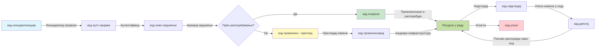
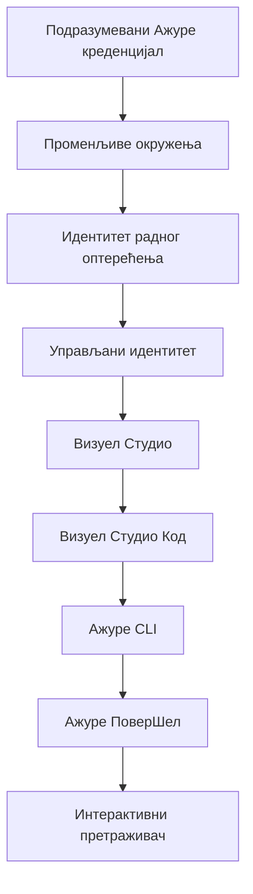

# AZD Basics - Разумевање Azure Developer CLI

# AZD Basics - Основни појмови и теме

**Навигација поглавља:**
- **📚 Почетна страница курса**: [AZD за почетнике](../../README.md)
- **📖 Тренутно поглавље**: Поглавље 1 - Основа & Брзи почетак
- **⬅️ Претходно**: [Course Overview](../../README.md#-chapter-1-foundation--quick-start)
- **➡️ Следеће**: [Installation & Setup](installation.md)
- **🚀 Следеће поглавље**: [Поглавље 2: AI-прво развој](../chapter-02-ai-development/microsoft-foundry-integration.md)

## Увод

Ова лекција вам представља Azure Developer CLI (azd), моћан алат командне линије који убрзава ваш пут од локалног развоја до деплоја на Azure. Научићете основне појмове, кључне функције и разумети како azd поједностављује постављање cloud-native апликација.

## Циљеви учења

На крају ове лекције, ви ћете:
- Разумети шта је Azure Developer CLI и његову примарну сврху
- Научити основне појмове о шаблонима, окружењима и сервисима
- Истражити кључне функције укључујући развој вођен шаблонима и Infrastructure as Code
- Разумети структуру azd пројекта и ток рада
- Бити припремљени да инсталирате и конфигуришете azd за ваше развојно окружење

## Резултати учења

Након завршетка ове лекције, моћи ћете да:
- Објасните улогу azd у модерним cloud развојним токовима
- Идентификујете компоненте структуре azd пројекта
- Описете како шаблони, окружења и сервиси функционишу заједно
- Разумете предности Infrastructure as Code уз azd
- Препознате различите azd команде и њихове сврхе

## Шта је Azure Developer CLI (azd)?

Azure Developer CLI (azd) је алат командне линије дизајниран да убрза ваш пут од локалног развоја до деплоја на Azure. Он поједностављује процес изградње, постављања и управљања cloud-native апликацијама на Azure.

### Шта можете да поставите помоћу azd?

azd подржава широк спектар радних оптерећења — и листа се наставља да расте. Данас можете користити azd за постављање:

| Workload Type | Examples | Same Workflow? |
|---------------|----------|----------------|
| **Традиционалне апликације** | Веб апликације, REST API-ји, статичке странице | ✅ `azd up` |
| **Сервиси и микросервиси** | Container Apps, Function Apps, мулти-сервисни бекендови | ✅ `azd up` |
| **AI-покренуте апликације** | Чет апликације са Microsoft Foundry Models, RAG решења са AI Search | ✅ `azd up` |
| **Интелигентни агенти** | Агенти хостовани у Foundry-у, мулти-агентске оркестрације | ✅ `azd up` |

Кључна поента је да **azd животни циклус остаје исти без обзира на то шта постављате**. Иницијализујете пројекат, провизионишете инфраструктуру, деплојујете код, праћете апликацију и чистите ресурсе—било да је у питању једноставан сајт или сложени AI агент.

Ова континуитет је дизајниран сврсисходно. azd третира AI могућности као још једну врсту сервиса коју ваша апликација може користити, а не као нешто фундаментално другачије. Чет endpoint који користи Microsoft Foundry Models, из azd перспективе, је само још један сервис који треба конфигурисати и поставити.

### 🎯 Зашто користити AZD? Поређење из стварног света

Хајде да упоредимо постављање једноставне веб апликације са базом података:

#### ❌ БЕЗ AZD: Ручно постављање на Azure (30+ минута)

```bash
# Корак 1: Креирајте групу ресурса
az group create --name myapp-rg --location eastus

# Корак 2: Креирајте App Service план
az appservice plan create --name myapp-plan \
  --resource-group myapp-rg \
  --sku B1 --is-linux

# Корак 3: Креирајте веб апликацију
az webapp create --name myapp-web-unique123 \
  --resource-group myapp-rg \
  --plan myapp-plan \
  --runtime "NODE:18-lts"

# Корак 4: Креирајте налог за Cosmos DB (10-15 минута)
az cosmosdb create --name myapp-cosmos-unique123 \
  --resource-group myapp-rg \
  --kind MongoDB

# Корак 5: Креирајте базу података
az cosmosdb mongodb database create \
  --account-name myapp-cosmos-unique123 \
  --resource-group myapp-rg \
  --name tododb

# Корак 6: Креирајте колекцију
az cosmosdb mongodb collection create \
  --account-name myapp-cosmos-unique123 \
  --resource-group myapp-rg \
  --database-name tododb \
  --name todos

# Корак 7: Добијте низ за повезивање
CONN_STR=$(az cosmosdb keys list \
  --name myapp-cosmos-unique123 \
  --resource-group myapp-rg \
  --type connection-strings \
  --query "connectionStrings[0].connectionString" -o tsv)

# Корак 8: Конфигуришите подешавања апликације
az webapp config appsettings set \
  --name myapp-web-unique123 \
  --resource-group myapp-rg \
  --settings MONGODB_URI="$CONN_STR"

# Корак 9: Омогућите логовање
az webapp log config --name myapp-web-unique123 \
  --resource-group myapp-rg \
  --application-logging filesystem \
  --detailed-error-messages true

# Корак 10: Подесите Application Insights
az monitor app-insights component create \
  --app myapp-insights \
  --location eastus \
  --resource-group myapp-rg

# Корак 11: Повежите App Insights са веб апликацијом
INSTRUMENTATION_KEY=$(az monitor app-insights component show \
  --app myapp-insights \
  --resource-group myapp-rg \
  --query "instrumentationKey" -o tsv)

az webapp config appsettings set \
  --name myapp-web-unique123 \
  --resource-group myapp-rg \
  --settings APPINSIGHTS_INSTRUMENTATIONKEY="$INSTRUMENTATION_KEY"

# Корак 12: Изградите апликацију локално
npm install
npm run build

# Корак 13: Креирајте пакет за распоређивање
zip -r app.zip . -x "*.git*" "node_modules/*"

# Корак 14: Распоредите апликацију
az webapp deployment source config-zip \
  --resource-group myapp-rg \
  --name myapp-web-unique123 \
  --src app.zip

# Корак 15: Чекајте и молите се да све ради 🙏
# (Нема аутоматске валидације, потребно ручно тестирање)
```

**Проблеми:**
- ❌ 15+ команди које треба запамтити и извршити по реду
- ❌ 30-45 минута ручног рада
- ❌ Лако до грешака (типо, погрешни параметри)
- ❌ Подаци за повезивање изложени у историји терминала
- ❌ Нема аутоматског враћања ако нешто закаже
- ❌ Тешко за поновно креирање од стране чланова тима
- ❌ Различито сваки пут (није репродуктивно)

#### ✅ SА AZD: Аутоматизовано постављање (5 команди, 10-15 минута)

```bash
# Корак 1: Иницијализујте из шаблона
azd init --template todo-nodejs-mongo

# Корак 2: Аутентификујте се
azd auth login

# Корак 3: Креирајте окружење
azd env new dev

# Корак 4: Прегледајте измене (опционо, али препоручљиво)
azd provision --preview

# Корак 5: Деплојујте све
azd up

# ✨ Готово! Све је деплојовано, конфигурисано и надгледано
```

**Предности:**
- ✅ **5 команди** vs. 15+ ручних корака
- ✅ **10-15 минута** укупно (већином чекање на Azure)
- ✅ **Мање ручних грешака** - конзистентан, шаблонски вођен ток рада
- ✅ **Сигурно руковање тајнама** - многи шаблони користе Azure-managed складиште за тајне
- ✅ **Поновљива постављања** - иста радна процедура сваки пут
- ✅ **Потпуно репродуктивно** - исти резултат сваки пут
- ✅ **Спремно за тим** - било ко може да постави са истим командама
- ✅ **Инфраструктура као код** - Bicep шаблони под верзионим надзором
- ✅ **Уграђено праћење** - Application Insights конфигурисан аутоматски

### 📊 Смањење времена и грешака

| Metric | Manual Deployment | AZD Deployment | Improvement |
|:-------|:------------------|:---------------|:------------|
| **Команде** | 15+ | 5 | 67% мање |
| **Време** | 30-45 min | 10-15 min | 60% брже |
| **Стопа грешака** | ~40% | <5% | 88% смањење |
| **Конзистентност** | Ниска (ручна) | 100% (аутоматизовано) | Савршено |
| **Увођење тима** | 2-4 сата | 30 минута | 75% брже |
| **Време враћања** | 30+ min (ручно) | 2 min (аутоматизовано) | 93% брже |

## Основни појмови

### Шаблони
Шаблони су темељ azd-а. Они садрже:
- **Код апликације** - Ваш изворни код и зависности
- **Дефиниције инфраструктуре** - Azure ресурси дефинисани у Bicep-у или Terraform-у
- **Фајлови конфигурације** - Подешавања и променљиве окружења
- **Скрипте за постављање** - Аутоматизовани токови за деплој

### Окружења
Окружења представљају различите циљеве деплоја:
- **Развој** - За тестирање и развој
- **Staging** - Предпроизводно окружење
- **Продукција** - Живо продукционо окружење

Свако окружење одржава своје:
- групу ресурса у Azure-у
- подешавања конфигурације
- стање постављања

### Услуге
Услуге су градивни блокови ваше апликације:
- **Фронтенд** - Веб апликације, SPA-ови
- **Бекенд** - API-ји, микросервиси
- **База података** - Решeња за складиштење података
- **Складиште** - Фајл и blob складиштење

## Кључне функције

### 1. Развој вођен шаблонима
```bash
# Прегледајте доступне шаблоне
azd template list

# Иницијализујте помоћу шаблона
azd init --template <template-name>
```

### 2. Инфраструктура као код
- **Bicep** - Azure-ов домен-специфични језик
- **Terraform** - Алат за инфраструктуру за више облака
- **ARM Templates** - Azure Resource Manager шаблони

### 3. Интегрисани токови рада
```bash
# Комплетан ток размештања
azd up            # Провизионисање + размештање — ово је без потребе за ручном интервенцијом за прво подешавање

# 🧪 НОВО: Преглед измена инфраструктуре пре размештања (БЕЗБЕДНО)
azd provision --preview    # Симулирајте размештање инфраструктуре без прављења промена

azd provision     # Креирајте Azure ресурсе; ако ажурирате инфраструктуру, користите ово
azd deploy        # Разместите код апликације или га поново разместите након ажурирања
azd down          # Очистите ресурсе
```

#### 🛡️ Безбедно планирање инфраструктуре са прегледом
Команда `azd provision --preview` је револуционарна за безбедна постављања:
- **Симулирана анализа** - Приказује шта ће бити креирано, измењено или избрисано
- **Нула ризика** - Нема стварних промена у вашем Azure окружењу
- **Сарадња тима** - Делите резултате прегледа пре деплоја
- **Процена трошкова** - Разумете трошкове ресурса пре обавезивања

```bash
# Пример радног тока за преглед
azd provision --preview           # Погледајте шта ће се променити
# Прегледајте резултат, разговарајте са тимом
azd provision                     # Примените промене са поверењем
```

### 📊 Визуелно: AZD ток развоја



**Објашњење тока рада:**
1. **Init** - Почните са шаблоном или новим пројектом
2. **Auth** - Аутентификујте се у Azure
3. **Environment** - Креирајте изоловано окружење за постављање
4. **Preview** - 🆕 Увек прво прегледајте измене инфраструктуре (сигурна пракса)
5. **Provision** - Креирајте/ажурирајте Azure ресурсе
6. **Deploy** - Пошаљите ваш код апликације
7. **Monitor** - Посматрајте перформансе апликације
8. **Iterate** - Направите измене и поново деплојујте код
9. **Cleanup** - Уклоните ресурсе када завршите

### 4. Управљање окружењима
```bash
# Креирајте и управљајте окружењима
azd env new <environment-name>
azd env select <environment-name>
azd env list
```

### 5. Проширења и AI команде

azd користи систем проширења да додаје могућности ван основног CLI-а. Ово је посебно корисно за AI радна оптерећења:

```bash
# Прикажи доступне екстензије
azd extension list

# Инсталирај екстензију Foundry Agents
azd extension install azure.ai.agents

# Иницијализуј пројекат AI агента из манифеста
azd ai agent init -m agent-manifest.yaml

# Тестирај постављеног агента (приказује латенцију и време до првог бајта)
azd ai agent invoke

# Покрени MCP сервер за развој уз помоћ AI (Алфа)
azd mcp start
```

**Животни циклус агента, од почетка до краја.** Када инсталирате `azure.ai.agents`, један ток рада вас води од идеје до покренутог, праћеног агента. Не морате све ово одмах—само знајте да постоји:

| Фаза | Команда | Шта ради |
|-------|---------|---------|
| **Генерисање** | `azd ai agent init -m <manifest>` | Генерише агент пројекат из манифеста |
| **Тестирање** | `azd ai agent invoke` | Позове агента и прикаже време одговора |
| **Мерење** | `azd ai agent eval generate` | Креира евалуациони скуп података за агента |
| **Унапређење** | `azd ai agent optimize` | Оптимизује упутства агента у односу на ваше податке |
| **Инспекција** | `azd ai agent endpoint show` | Прикаже конфигурацију живог endpoint-а |
| **Чишћење** | `azd ai agent delete` | Обрише хостованог агента и све његове верзије |

> Проширења су обрађена детаљније у [Поглавље 2: AI-прво развој](../chapter-02-ai-development/agents.md) и у референци [AZD AI CLI команде](../chapter-08-production/production-ai-practices.md#azd-ai-cli-commands-and-extensions).

## 📁 Структура пројекта

Типична структура azd пројекта:
```
my-app/
├── .azd/                    # azd configuration
│   └── config.json
├── .azure/                  # Azure deployment artifacts
├── .devcontainer/          # Development container config
├── .github/workflows/      # GitHub Actions
├── .vscode/               # VS Code settings
├── infra/                 # Infrastructure code
│   ├── main.bicep        # Main infrastructure template
│   ├── main.parameters.json
│   └── modules/          # Reusable modules
├── src/                  # Application source code
│   ├── api/             # Backend services
│   └── web/             # Frontend application
├── azure.yaml           # azd project configuration
└── README.md
```

## 🔧 Фајлови конфигурације

### azure.yaml
Главни фајл конфигурације пројекта:
```yaml
name: my-awesome-app
metadata:
  template: my-template@1.0.0

services:
  web:
    project: ./src/web
    language: js
    host: appservice
  api:
    project: ./src/api
    language: js
    host: appservice

hooks:
  preprovision:
    shell: pwsh
    run: echo "Preparing to provision..."
```

### .azure/config.json
Конфигурација специфична за окружење:
```json
{
  "version": 1,
  "defaultEnvironment": "dev",
  "environments": {
    "dev": {
      "subscriptionId": "your-subscription-id",
      "location": "eastus"
    }
  }
}
```

## 🎪 Уобичајени токови рада са практичним вежбама

> **💡 Савет за учење:** Пратите ове вежбе по редоследу да бисте постепено изградили своје AZD вештине.

### 🎯 Вежба 1: Иницијализујте ваш први пројекат

**Циљ:** Креирајте AZD пројекат и истражите његову структуру

**Кораци:**
```bash
# Користите проверени шаблон
azd init --template todo-nodejs-mongo

# Истражите генерисане датотеке
ls -la  # Прегледајте све датотеке, укључујући и скривене

# Кључне датотеке које су креиране:
# - azure.yaml (главна конфигурација)
# - infra/ (инфраструктурни код)
# - src/ (код апликације)
```

**✅ Успех:** Имате azure.yaml, infra/ и src/ директоријуме

---

### 🎯 Вежба 2: Деплојујте на Azure

**Циљ:** Завршити енд-то-енд деплој

**Кораци:**
```bash
# 1. Аутентификујте се
az login && azd auth login

# 2. Креирајте окружење
azd env new dev
azd env set AZURE_LOCATION eastus

# 3. Прегледајте измене (ПРЕПОРУЧЕНО)
azd provision --preview

# 4. Деплојујте све
azd up

# 5. Проверите распоређивање
azd show    # Погледајте URL ваше апликације
```

**Очекивано време:** 10-15 минута  
**✅ Успех:** URL апликације се отвори у прегледачу

---

### 🎯 Вежба 3: Вишеструка окружења

**Циљ:** Деплојујте у dev и staging

**Кораци:**
```bash
# Већ имамо dev, креирајте staging
azd env new staging
azd env set AZURE_LOCATION westus2
azd up

# Пребацујте се између њих
azd env list
azd env select dev
```

**✅ Успех:** Две посебне групе ресурса у Azure порталу

---

### 🛡️ Чист почетак: `azd down --force --purge`

Када вам је потребно потпуно ресетовање:

```bash
azd down --force --purge
```

**Шта ради:**
- `--force`: Без упита за потврду
- `--purge`: Брише све локално стање и Azure ресурсе

**Користити када:**
- Постављање је пропало усред процеса
- Промена пројеката
- Потребан је чист почетак

---

## 🎪 Референца оригиналног тока рада

### Покретање новог пројекта
```bash
# Метод 1: Користите постојећи шаблон
azd init --template todo-nodejs-mongo

# Метод 2: Почните од почетка
azd init

# Метод 3: Користите тренутни директоријум
azd init .
```

### Развојни циклус
```bash
# Подесите развојно окружење
azd auth login
azd env new dev
azd env select dev

# Разместите све
azd up

# Унесите измене и поново разместите
azd deploy

# Очистите када завршите
azd down --force --purge # Команда у Azure Developer CLI-ју је потпуно ресетовање за ваше окружење — посебно корисна када решавате проблеме са неуспелим распоређивањима, чистите напуштене ресурсе или припремате окружење за чисто поновно распоређивање.
```

## Разумевање `azd down --force --purge`
Команда `azd down --force --purge` је моћан начин да потпуно срушите ваше azd окружење и све повезане ресурсе. Ево распада шта сваки флаг ради:
```
--force
```

- Прескаче упите за потврду.
- Корисно за аутоматизацију или скриптовање где ручни унос није изводљив.
- Осигурава да демонтажа настави без прекида, чак и ако CLI открије неконсистентности.

```
--purge
```

Брише **све повезане метаподатке**, укључујући:
- Стање окружења
- Локални `.azure` фолдер
- Кеширане информације о постављању
- Спрема azd да "не памти" претходна постављања, што може изазвати проблеме као што су неусклађене групе ресурса или застарела референца регистара.

### Зашто користити оба?
Када запнете са `azd up` због заостајања стања или делимичних деплоја, ова комбинација обезбеђује **чист почетак**.

Посебно је корисно након ручног брисања ресурса у Azure порталу или када мењате шаблоне, окружења или конвенције именовања група ресурса.

### Управљање вишеструким окружењима
```bash
# Креирајте предпродукционо окружење
azd env new staging
azd env select staging
azd up

# Вратите се на развојно окружење
azd env select dev

# Упоредите окружења
azd env list
```

## 🔐 Аутентификација и креденцијали

Разумевање аутентификације је кључно за успешна azd постављања. Azure користи више метода аутентификације, а azd користи исти низ креденцијала као и други Azure алати.

### Azure CLI аутентификација (`az login`)

Пре коришћења azd, потребно је да се аутентификујете у Azure. Најчешћи метод је коришћење Azure CLI-а:

```bash
# Интерактивна пријава (отвара прегледач)
az login

# Пријава са одређеним тенантом
az login --tenant <tenant-id>

# Пријава помоћу сервисног принципала
az login --service-principal -u <app-id> -p <password> --tenant <tenant-id>

# Провера тренутног статуса пријаве
az account show

# Листа доступних претплата
az account list --output table

# Постави подразумевану претплату
az account set --subscription <subscription-id>
```

### Ток аутентификације
1. **Интерактивна пријава**: Отвара ваш подразумевани прегледач за аутентификацију
2. **Device Code Flow**: За окружења без приступа прегледачу
3. **Service Principal**: За аутоматизацију и CI/CD сценарије
4. **Managed Identity**: За апликације хостоване на Azure

### DefaultAzureCredential ланац

`DefaultAzureCredential` је тип креденцијала који пружа поједностављено искуство аутентификације аутоматским испробавањем више извора креденцијала у одређеном редоследу:

#### Редослед у ланцу креденцијала


#### 1. Променљиве окружења
```bash
# Поставите променљиве окружења за сервисни налог
export AZURE_CLIENT_ID="<app-id>"
export AZURE_CLIENT_SECRET="<password>"
export AZURE_TENANT_ID="<tenant-id>"
```

#### 2. Workload Identity (Kubernetes/GitHub Actions)
Користи се аутоматски у:
- Azure Kubernetes Service (AKS) са Workload Identity
- GitHub Actions са OIDC федерацијом
- Други сценарији федерисаног идентитета

#### 3. Managed Identity
За Azure ресурсе као што су:
- Виртуелне машине
- App Service
- Azure Functions
- Container Instances

```bash
# Проверите да ли се покреће на Azure ресурсу са управљеним идентитетом
az account show --query "user.type" --output tsv
# Враћа: "servicePrincipal" ако се користи управљени идентитет
```

#### 4. Интеграција са алатима за развој
- **Visual Studio**: Аутоматски користи пријављени налог
- **VS Code**: Користи креденцијале из Azure Account екстензије
- **Azure CLI**: Користи `az login` креденцијале (најчешће за локални развој)

### Подешавање аутентификације за AZD

```bash
# Метод 1: Користите Azure CLI (Препоручено за развој)
az login
azd auth login  # Користи постојеће Azure CLI акредитиве

# Метод 2: Директна аутентификација azd
azd auth login --use-device-code  # За безглавна окружења

# Метод 3: Проверите статус аутентификације
azd auth login --check-status

# Метод 4: Одјавите се и поново се аутентификујте
azd auth logout
azd auth login
```

### Најбоље праксе аутентификације

#### За локални развој
```bash
# 1. Пријавите се помоћу Azure CLI
az login

# 2. Проверите исправну претплату
az account show
az account set --subscription "Your Subscription Name"

# 3. Користите azd са постојећим акредитивима
azd auth login
```

#### За CI/CD пайплајнове
```yaml
# GitHub Actions example
- name: Azure Login
  uses: azure/login@v1
  with:
    creds: ${{ secrets.AZURE_CREDENTIALS }}

- name: Deploy with azd
  run: |
    azd auth login --client-id ${{ secrets.AZURE_CLIENT_ID }} \
                    --client-secret ${{ secrets.AZURE_CLIENT_SECRET }} \
                    --tenant-id ${{ secrets.AZURE_TENANT_ID }}
    azd up --no-prompt
```

#### За продукциона окружења
- Користите **Managed Identity** када се извршава на Azure ресурсима
- Користите **Service Principal** за сценарије аутоматизације
- Не чувајте креденцијале у коду или конфигурационим фајловима
- Користите **Azure Key Vault** за осетљиву конфигурацију

### Уобичајени проблеми са аутентикацијом и решења

#### Проблем: "No subscription found"
```bash
# Решење: Подесите подразумевану претплату
az account list --output table
az account set --subscription "<subscription-id>"
azd env set AZURE_SUBSCRIPTION_ID "<subscription-id>"
```

#### Проблем: "Insufficient permissions"
```bash
# Решење: Проверите и доделите потребне улоге
az role assignment list --assignee $(az account show --query user.name --output tsv)

# Уобичајено потребне улоге:
# - Contributor (за управљање ресурсима)
# - User Access Administrator (за додељивање улога)
```

#### Проблем: "Token expired"
```bash
# Решење: Поново се аутентификујте
az logout
az login
azd auth logout
azd auth login
```

### Аутентикација у различитим сценаријима

#### Локални развој
```bash
# Рачун за лични развој
az login
azd auth login
```

#### Тимски развој
```bash
# Користите одређеног тенанта за организацију
az login --tenant contoso.onmicrosoft.com
azd auth login
```

#### Сценарији мулти-тенант окружења
```bash
# Пребацивање између закупаца
az login --tenant tenant1.onmicrosoft.com
# Размешти на закупца 1
azd up

az login --tenant tenant2.onmicrosoft.com  
# Размешти на закупца 2
azd up
```

### Безбедносна разматрања

1. **Складиштење креденцијала**: Никад не чувајте креденцијале у изворном коду
2. **Ограничење опсега**: Користите принцип најмањих привилегија за service principals
3. **Ротација токена**: Редовно мењајте тајне service principals-а
4. **Аудитни трагови**: Надгледајте активности аутентикације и деплоя
5. **Мрежна безбедност**: Користите приватне ендпоинте кад год је могуће

### Решавање проблема са аутентикацијом

```bash
# Дијагностика проблема са аутентификацијом
azd auth login --check-status
az account show
az account get-access-token

# Уобичајене дијагностичке команде
whoami                          # Тренутни контекст корисника
az ad signed-in-user show      # Детаљи корисника Microsoft Entra ID
az group list                  # Тестирање приступа ресурсу
```

## Разумевање `azd down --force --purge`

### Откривање
```bash
azd template list              # Преглед шаблона
azd template show <template>   # Детаљи шаблона
azd init --help               # Опције иницијализације
```

### Управљање пројектом
```bash
azd show                     # Преглед пројекта
azd env list                # Доступна окружења и подразумевани избор
azd config show            # Подешавања конфигурације
```

### Мониторинг
```bash
azd monitor                  # Отворите мониторинг на Azure порталу
azd monitor --logs           # Погледајте записе апликације
azd monitor --live           # Погледајте метрике уживо
azd pipeline config          # Подесите CI/CD
```

## Најбоље праксе

### 1. Користите смислена имена
```bash
# Добро
azd env new production-east
azd init --template web-app-secure

# Избегавајте
azd env new env1
azd init --template template1
```

### 2. Искористите шаблоне
- Почните са постојећим шаблонима
- Прилагодите их вашим потребама
- Креирајте поново употребљиве шаблоне за вашу организацију

### 3. Изолација окружења
- Користите одвојена окружења за dev/staging/prod
- Никад не деплојирајте директно у продукцију са локалне машине
- Користите CI/CD пайплајнове за деплоје у продукцију

### 4. Управљање конфигурацијом
- Користите променљиве окружења за осетљиве податке
- Чувајте конфигурацију у систему контроле верзија
- Документујте подешавања специфична за окружење

## Напредак у учењу

### Почетник (Недеља 1-2)
1. Инсталирајте azd и аутентификујте се
2. Разместите једноставан шаблон
3. Разумите структуру пројекта
4. Научите основне команде (up, down, deploy)

### Средњи ниво (Недеља 3-4)
1. Прилагодите шаблоне
2. Управљајте више окружења
3. Разумите инфраструктурни код
4. Подесите CI/CD пайплајнове

### Напредни (Недеља 5+)
1. Креирајте прилагођене шаблоне
2. Напредни инфраструктурни шаблони
3. Размештање у више региона
4. Конфигурације за ниво предузећа

## Следећи кораци

**📖 Наставите учење Поглавља 1:**
- [Инсталација и подешавање](installation.md) - Инсталирајте и конфигуришите azd
- [Ваш први пројекат](first-project.md) - Завршите практичан туторијал
- [Водич за конфигурацију](configuration.md) - Напредне опције конфигурације

**🎯 Спремни за следеће поглавље?**
- [Поглавље 2: AI-први развој](../chapter-02-ai-development/microsoft-foundry-integration.md) - Почните градити AI апликације

## Додатни ресурси

- [Преглед Azure Developer CLI](https://learn.microsoft.com/en-us/azure/developer/azure-developer-cli/)
- [Галерија шаблона](https://azure.github.io/awesome-azd/)
- [Примери заједнице](https://github.com/Azure-Samples)

---

## 🙋 Често постављана питања

### Општа питања

**П: Која је разлика између AZD и Azure CLI?**

О: Azure CLI (`az`) служи за управљање појединачним Azure ресурсима. AZD (`azd`) служи за управљање целим апликацијама:

```bash
# Azure CLI - управљање ресурсима ниског нивоа
az webapp create --name myapp --resource-group rg
az sql server create --name myserver --resource-group rg
# ...потребно је још много команди

# AZD - управљање на нивоу апликације
azd up  # Распоређује целу апликацију са свим ресурсима
```

**Замислите то овако:**
- `az` = Рад са појединачним Лего коцкама
- `azd` = Рад са комплетним Лего сетовима

---

**П: Да ли ми је потребно знање Bicep-а или Terraform-а да бих користио AZD?**

О: Не! Почните са шаблонима:
```bash
# Користите постојећи шаблон - није потребно знање IaC-а
azd init --template todo-nodejs-mongo
azd up
```

Можете касније научити Bicep да прилагодите инфраструктуру. Шаблони пружају радне примере од којих можете учити.

---

**П: Колико кошта покретање AZD шаблона?**

О: Трошкови зависе од шаблона. Већина развојних шаблона кошта $50-150/месечно:

```bash
# Прегледајте трошкове пре распоређивања
azd provision --preview

# Увек очистите када не користите
azd down --force --purge  # Уклања све ресурсе
```

**Про савет:** Користите бесплатне нивое где је доступно:
- App Service: F1 (Free) ниво
- Microsoft Foundry Models: Azure OpenAI 50,000 tokens/месечно бесплатно
- Cosmos DB: 1000 RU/s бесплатни ниво

---

**П: Могу ли да користим AZD са постојећим Azure ресурсима?**

О: Да, али је лакше почети из почетка. AZD најбоље функционише када управља целим животним циклом. За постојеће ресурсе:

```bash
# Опција 1: Увези постојеће ресурсе (напредно)
azd init
# Затим измените infra/ да би упућивао на постојеће ресурсе

# Опција 2: Почни из почетка (препоручено)
azd init --template matching-your-stack
azd up  # Креира ново окружење
```

---

**П: Како да поделим пројекат са члановима тима?**

О: Пошаљите AZD пројекат у Git (али НЕ .azure фолдер):

```bash
# Већ је по подразумеваној поставци у .gitignore
.azure/        # Садржи тајне и податке о окружењу
*.env          # Променљиве окружења

# Тадашњи чланови тима:
git clone <your-repo>
azd auth login
azd env new <their-name>-dev
azd up
```

Сви добијају идентичну инфраструктуру из истих шаблона.

---

### Питања за решавање проблема

**П: "azd up" није успео до краја. Шта да радим?**

О: Проверите грешку, исправите је, па покушајте поново:

```bash
# Прикажи детаљне записе
azd show

# Уобичајена решења:

# 1. Ако је квота прекорачена:
azd env set AZURE_LOCATION "westus2"  # Пробај другу регију

# 2. Ако постоји конфликт имена ресурса:
azd down --force --purge  # Почни испочетка
azd up  # Покушај поново

# 3. Ако је аутентификација истекла:
az login
azd auth login
azd up
```

**Најчешћи проблем:** Изабрана је погрешна Azure претплата
```bash
az account list --output table
az account set --subscription "<correct-subscription>"
```

---

**П: Како да деплојујем само измене кода без поновног провизионисања?**

О: Користите `azd deploy` уместо `azd up`:

```bash
azd up          # Први пут: припрема и распоређивање (споро)

# Направите измене у коду...

azd deploy      # Следећи пут: само распоређивање (брзо)
```

Поређење брзине:
- `azd up`: 10-15 минута (провизионише инфраструктуру)
- `azd deploy`: 2-5 минута (само код)

---

**П: Могу ли да прилагодим инфраструктурне шаблоне?**

О: Да! Уредите Bicep фајлове у `infra/`:

```bash
# Након azd init
cd infra/
code main.bicep  # Уреди у VS Code

# Прегледај промене
azd provision --preview

# Примени промене
azd provision
```

**Савет:** Почните мало - прво промените SKU-ове:
```bicep
// infra/main.bicep
sku: {
  name: 'B1'  // Change to 'P1V2' for production
}
```

---

**П: Како да избришем све што је AZD креирао?**

О: Једна команда уклања све ресурсе:

```bash
azd down --force --purge

# Ово брише:
# - Све Azure ресурсе
# - Групу ресурса
# - Стање локалног окружења
# - Кеширани подаци о распоређивању
```

**Увек покрените ово када:**
- Завршили сте тестирање шаблона
- Прелазите на други пројекат
- Желите да почнете из почетка

**Уштеда трошкова:** Брисање неискоришћених ресурса = $0 трошкова

---

**П: Шта ако случајно обришем ресурсе у Azure порталу?**

О: Стање AZD-а може бити несинхронизовано. Приступ чистог стања:

```bash
# 1. Уклони локално стање
azd down --force --purge

# 2. Почни изнова
azd up

# Алтернатива: Дозволи AZD-у да открије и исправи
azd provision  # Креираће недостајуће ресурсе
```

---

### Напредна питања

**П: Могу ли да користим AZD у CI/CD пайплајновима?**

О: Да! Пример GitHub Actions:

```yaml
# .github/workflows/deploy.yml
name: Deploy with AZD

on:
  push:
    branches: [main]

jobs:
  deploy:
    runs-on: ubuntu-latest
    steps:
      - uses: actions/checkout@v2
      
      - name: Install azd
        run: curl -fsSL https://aka.ms/install-azd.sh | bash
      
      - name: Azure Login
        run: |
          azd auth login \
            --client-id ${{ secrets.AZURE_CLIENT_ID }} \
            --client-secret ${{ secrets.AZURE_CLIENT_SECRET }} \
            --tenant-id ${{ secrets.AZURE_TENANT_ID }}
      
      - name: Deploy
        run: azd up --no-prompt
```

---

**П: Како да управљам тајнама и осетљивим подацима?**

О: AZD се аутоматски интегрише са Azure Key Vault-ом:

```bash
# Тајне се чувају у Key Vault-у, а не у коду
azd env set DATABASE_PASSWORD "$(openssl rand -base64 32)"

# AZD аутоматски:
# 1. Креира Key Vault
# 2. Чува тајну
# 3. Омогућава апликацији приступ преко Managed Identity
# 4. Убацује при извршавању
```

**Никад не комитујте:**
- `.azure/` фолдер (садржи податке о окружењу)
- `.env` фајлове (локалне тајне)
- Конекциони стрингови

---

**П: Могу ли да деплојујем у више региона?**

О: Да, креирајте окружење по региону:

```bash
# Окружење у Источним САД
azd env new prod-eastus
azd env set AZURE_LOCATION eastus
azd up

# Окружење у Западној Европи
azd env new prod-westeurope
azd env set AZURE_LOCATION westeurope
azd up

# Свако окружење је независно
azd env list
```

За праве апликације у више региона прилагодите Bicep шаблоне да истовремено деплојују у више региона.

---

**П: Где могу добити помоћ ако запнем?**

1. **AZD документација:** https://learn.microsoft.com/azure/developer/azure-developer-cli/
2. **GitHub Issues:** https://github.com/Azure/azure-dev/issues
3. **Discord:** [Azure Discord](https://discord.gg/microsoft-azure) - канал #azure-developer-cli
4. **Stack Overflow:** Таг `azure-developer-cli`
5. **Овај курс:** [Водич за решавање проблема](../chapter-07-troubleshooting/common-issues.md)

**Про савет:** Пре питања, покрените:
```bash
azd show       # Приказује тренутно стање
azd version    # Приказује вашу верзију
```
Укључите ове информације у ваше питање за бржу помоћ.

---

## 🎓 Шта следи?

Сада разумете основе AZD-а. Одаберите свој пут:

### 🎯 За почетнике:
1. **Даље:** [Инсталација и подешавање](installation.md) - Инсталирајте AZD на вашу машину
2. **Затим:** [Ваш први пројекат](first-project.md) - Разместите вашу прву апликацију
3. **Вежба:** Завршите свa 3 вежбе у овој лекцији

### 🚀 За AI развојне програмере:
1. **Прескочите на:** [Поглавље 2: AI-први развој](../chapter-02-ai-development/microsoft-foundry-integration.md)
2. **Деплој:** Почните са `azd init --template get-started-with-ai-chat`
3. **Учите:** Градите док вршите деплој

### 🏗️ За искусне програмере:
1. **Преглед:** [Водич за конфигурацију](configuration.md) - Напредна подешавања
2. **Истражите:** [Инфраструктура као код](../chapter-04-infrastructure/provisioning.md) - Дубинско проучавање Bicep-а
3. **Изградите:** Креирајте прилагођене шаблоне за ваш стек

---

**Навигација по поглављима:**
- **📚 Почетна страна курса**: [AZD за почетнике](../../README.md)
- **📖 Тренутно поглавље**: Поглавље 1 - Основа & Брзи почетак  
- **⬅️ Претходно**: [Преглед курса](../../README.md#-chapter-1-foundation--quick-start)
- **➡️ Следеће**: [Инсталација и подешавање](installation.md)
- **🚀 Следеће поглавље**: [Поглавље 2: AI-први развој](../chapter-02-ai-development/microsoft-foundry-integration.md)

---

<!-- CO-OP TRANSLATOR DISCLAIMER START -->
**Изјава о одрицању одговорности**:
Овај документ је преведен коришћењем услуге за аутоматски превод [Co-op Translator](https://github.com/Azure/co-op-translator). Иако тежимо тачности, имајте у виду да аутоматски преводи могу садржати грешке или нетачности. Оригинални документ на његовом изворном језику треба сматрати ауторитативним извором. За критичне информације препоручује се професионални људски превод. Нисмо одговорни за било каква неспоразума или погрешна тумачења која произилазе из коришћења овог превода.
<!-- CO-OP TRANSLATOR DISCLAIMER END -->