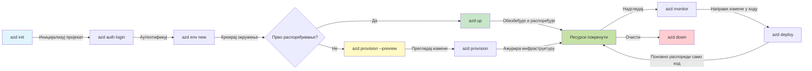
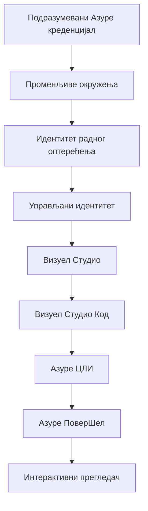

# AZD Basics - Разумевање Azure Developer CLI

# AZD Basics - Основни појмови и основе

**Навигација по поглављима:**
- **📚 Почетна страница курса**: [AZD за почетнике](../../README.md)
- **📖 Тренутно поглавље**: Поглавље 1 - Основа и Брзи почетак
- **⬅️ Претходно**: [Преглед курса](../../README.md#-chapter-1-foundation--quick-start)
- **➡️ Следеће**: [Инсталација и подешавање](installation.md)
- **🚀 Следеће поглавље**: [Поглавље 2: Развој усмерен на AI](../chapter-02-ai-development/microsoft-foundry-integration.md)

## Увод

Ова лекција вас упознаје са Azure Developer CLI (azd), моћним алатом командне линије који убрзава ваш пут од локалног развоја до распореда на Azure. Учићете основне појмове, кључне могућности и разумети како azd поједностављује распоређивање cloud-native апликација.

## Циљеви учења

На крају ове лекције, ви ћете:
- Разумети шта је Azure Developer CLI и његову примарну сврху
- Научити основне појмове о шаблонима, окружењима и услугама
- Истражити кључне функције укључујући развој вођен шаблонима и Infrastructure as Code
- Разумети структуру azd пројекта и ток рада
- Бити припремљени да инсталирате и конфигуришете azd за ваше развојно окружење

## Резултати учења

Након завршетка ове лекције, бићете у стању да:
- Објасните улогу azd у модерним cloud програмским токовима рада
- Идентификујете компоненте структуре azd пројекта
- Описете како шаблони, окружења и услуге функционишу заједно
- Разумете предности Infrastructure as Code са azd
- Препознате различите azd команде и њихове сврхе

## Шта је Azure Developer CLI (azd)?

Azure Developer CLI (azd) је алат командне линије дизајниран да убрза ваш пут од локалног развоја до распореда на Azure. Поједностављује процес изградње, распоређивања и управљања cloud-native апликацијама на Azure-у.

### Шта можете да распоредите помоћу azd?

azd подржава широк спектар радних оптерећења — и листа се стално увећава. Данас, можете користити azd за распоређивање:

| Тип оптерећења | Примери | Исти ток рада? |
|---------------|----------|----------------|
| **Традиционалне апликације** | Веб апликације, REST API-ји, статичке странице | ✅ `azd up` |
| **Услуге и микросервиси** | Container Apps, Function Apps, мултисервисни бекендови | ✅ `azd up` |
| **AI-покренуте апликације** | Чат апликације са Microsoft Foundry моделима, RAG решења са AI Search | ✅ `azd up` |
| **Интелигентни агенти** | Агенти хостовани у Foundry-у, оркестрације више агената | ✅ `azd up` |

Кључни увид је да **азд животни циклус остаје исти без обзира на то шта распоређујете**. Иницијализујете пројекат, обезбеђујете инфраструктуру, распоређујете код, пратите апликацију и чистите ресурсе — било да је у питању једноставан сајт или сложени AI агент.

Ова континуитет је намеран. azd третира AI могућности као још једну врсту услуге коју ваша апликација може користити, а не као нешто фундаментално другачије. Чат крајна тачка поткрепљена Microsoft Foundry моделима је, из угла azd-а, само још једна услуга коју треба конфигурисати и распоредити.

### 🎯 Зашто користити AZD? Поређење из стварног света

Упоредимо распоређивање једноставне веб апликације са базом података:

#### ❌ БЕЗ AZD: Ручно распоређивање на Azure-у (30+ минута)

```bash
# Корак 1: Креирајте ресурсну групу
az group create --name myapp-rg --location eastus

# Корак 2: Креирајте App Service план
az appservice plan create --name myapp-plan \
  --resource-group myapp-rg \
  --sku B1 --is-linux

# Корак 3: Креирајте веб апликацију
az webapp create --name myapp-web-unique123 \
  --resource-group myapp-rg \
  --plan myapp-plan \
  --runtime "NODE:18-lts"

# Корак 4: Креирајте Cosmos DB налог (10-15 минута)
az cosmosdb create --name myapp-cosmos-unique123 \
  --resource-group myapp-rg \
  --kind MongoDB

# Корак 5: Креирајте базу података
az cosmosdb mongodb database create \
  --account-name myapp-cosmos-unique123 \
  --resource-group myapp-rg \
  --name tododb

# Корак 6: Креирајте колекцију
az cosmosdb mongodb collection create \
  --account-name myapp-cosmos-unique123 \
  --resource-group myapp-rg \
  --database-name tododb \
  --name todos

# Корак 7: Добијте низ за повезивање
CONN_STR=$(az cosmosdb keys list \
  --name myapp-cosmos-unique123 \
  --resource-group myapp-rg \
  --type connection-strings \
  --query "connectionStrings[0].connectionString" -o tsv)

# Корак 8: Конфигуришите подешавања апликације
az webapp config appsettings set \
  --name myapp-web-unique123 \
  --resource-group myapp-rg \
  --settings MONGODB_URI="$CONN_STR"

# Корак 9: Омогућите логовање
az webapp log config --name myapp-web-unique123 \
  --resource-group myapp-rg \
  --application-logging filesystem \
  --detailed-error-messages true

# Корак 10: Подесите Application Insights
az monitor app-insights component create \
  --app myapp-insights \
  --location eastus \
  --resource-group myapp-rg

# Корак 11: Повежите Application Insights са веб апликацијом
INSTRUMENTATION_KEY=$(az monitor app-insights component show \
  --app myapp-insights \
  --resource-group myapp-rg \
  --query "instrumentationKey" -o tsv)

az webapp config appsettings set \
  --name myapp-web-unique123 \
  --resource-group myapp-rg \
  --settings APPINSIGHTS_INSTRUMENTATIONKEY="$INSTRUMENTATION_KEY"

# Корак 12: Изградите апликацију локално
npm install
npm run build

# Корак 13: Креирајте пакет за распоређивање
zip -r app.zip . -x "*.git*" "node_modules/*"

# Корак 14: Разместите апликацију
az webapp deployment source config-zip \
  --resource-group myapp-rg \
  --name myapp-web-unique123 \
  --src app.zip

# Корак 15: Чекајте и молите се да ради 🙏
# (Нема аутоматске валидације, потребно ручно тестирање)
```

**Проблеми:**
- ❌ Више од 15 команди које треба запамтити и извршити по реду
- ❌ 30–45 минута ручног рада
- ❌ Лако је направити грешке (правописне грешке, погрешни параметри)
- ❌ Низови за повезивање изложени у историји терминала
- ❌ Нема аутоматског повлачења у случају грешке
- ❌ Тешко је реплицирати за чланове тима
- ❌ Сваки пут различито (није репродуктивно)

#### ✅ СА AZD: Аутоматизовано распоређивање (5 команди, 10-15 минута)

```bash
# Корак 1: Иницијализујте из шаблона
azd init --template todo-nodejs-mongo

# Корак 2: Аутентификујте се
azd auth login

# Корак 3: Креирајте окружење
azd env new dev

# Корак 4: Прегледајте измене (опционо, али препоручено)
azd provision --preview

# Корак 5: Деплојујте све
azd up

# ✨ Готово! Све је распоређено, конфигурисано и надгледано
```

**Предности:**
- ✅ **5 команди** у односу на 15+ ручних корака
- ✅ **10–15 минута** укупно (углавном чекање Azure-а)
- ✅ **Мање ручних грешака** - конзистентан, шаблонама вођен ток рада
- ✅ **Безбедно руковање тајнама** - многи шаблони користе складиште тајни којим управља Azure
- ✅ **Поновљива распоређивања** - исти ток рада сваки пут
- ✅ **Потпуно репродуктивно** - исти резултат сваки пут
- ✅ **Спремно за тим** - било ко може да распореди са истим командама
- ✅ **Инфраструктура као код** - Bicep шаблони под верзионим контролом
- ✅ **Уграђено праћење** - Application Insights аутоматски конфигурисан

### 📊 Смањење времена и грешака

| Метрика | Ручно распоређивање | AZD распоређивање | Побољшање |
|:-------|:------------------|:---------------|:------------|
| **Команде** | 15+ | 5 | 67% мање |
| **Време** | 30–45 мин | 10–15 мин | 60% брже |
| **Стопа грешака** | ~40% | <5% | 88% смањење |
| **Конзистентност** | Ниска (ручно) | 100% (аутоматизовано) | Савршено |
| **Увођење тима** | 2–4 сата | 30 минута | 75% брже |
| **Време повлачења** | 30+ мин (ручно) | 2 мин (аутоматизовано) | 93% брже |

## Основни појмови

### Шаблони
Шаблони су основа azd-а. Они садрже:
- **Код апликације** - Ваш изворни код и зависности
- **Дефиниције инфраструктуре** - Azure ресурси дефинисани у Bicep или Terraform
- **Конфигурационе датотеке** - Подешавања и променљиве окружења
- **Скрипте за распоређивање** - Аутоматизовани токови рада за распоређивање

### Окружења
Окружења представљају различите циљеве распоређивања:
- **Development** - За тестирање и развој
- **Staging** - Пред-продукционо окружење
- **Production** - Продукционо окружење

Свако окружење одржава своје:
- Групу ресурса у Azure-у
- Конфигурациона подешавања
- Стање распоређивања

### Услуге
Услуге су градивни блокови ваше апликације:
- **Frontend** - Веб апликације, SPA-ови
- **Backend** - API-ји, микросервиси
- **База података** - Решeња за складиштење података
- **Складиште** - Складиштење фајлова и blob-ова

## Кључне карактеристике

### 1. Развој вођен шаблонима
```bash
# Прегледајте доступне шаблоне
azd template list

# Иницијализуј из шаблона
azd init --template <template-name>
```

### 2. Инфраструктура као код
- **Bicep** - језик специфичан за домен Azure-а
- **Terraform** - Алат за инфраструктуру у више облака
- **ARM Templates** - шаблони Azure Resource Manager-а

### 3. Интегрисани токови рада
```bash
# Комплетан радни ток распоређивања
azd up            # Обезбеђивање + распоређивање, ово је без ручне интервенције за прво подешавање

# 🧪 НОВО: Преглед промена инфраструктуре пре распоређивања (БЕЗБЕДНО)
azd provision --preview    # Симулирајте распоређивање инфраструктуре без прављења измена

azd provision     # Креирајте Azure ресурсе — ако ажурирате инфраструктуру, користите ово
azd deploy        # Распоредите или поново распоредите код апликације након ажурирања
azd down          # Очистите ресурсе
```

#### 🛡️ Безбедно планирање инфраструктуре са прегледом (Preview)
Команда `azd provision --preview` мења правила игре за безбедна распоређивања:
- **Анализа без извођења (dry-run)** - Приказује шта ће бити креирано, измењено или избрисано
- **Нула ризика** - Ништа стварно се не мења у вашем Azure окружењу
- **Сарадња тима** - Делите резултате прегледа пре распоређивања
- **Процена трошкова** - Разумете трошкове ресурса пре обавезивања

```bash
# Пример прегледа радног тока
azd provision --preview           # Погледајте шта ће се променити
# Прегледајте излаз, разговарајте са тимом
azd provision                     # Примените измене са поверењем
```

### 📊 Визуелно: AZD ток развоја


**Објашњење тока рада:**
1. **Init** - Започните са шаблоном или новим пројектом
2. **Auth** - Аутентификујте се на Azure
3. **Environment** - Креирајте изоловано окружење за распоређивање
4. **Preview** - 🆕 Увек прво прегледајте измене инфраструктуре (безбедна пракса)
5. **Provision** - Креирајте/ажурирајте Azure ресурсе
6. **Deploy** - Деплојујте ваш код апликације
7. **Monitor** - Посматрајте перформансе апликације
8. **Iterate** - Правите измене и поново деплојујте код
9. **Cleanup** - Уклоните ресурсе када завршите

### 4. Управљање окружењима
```bash
# Креирајте и управљајте окружењима
azd env new <environment-name>
azd env select <environment-name>
azd env list
```

### 5. Екстензије и AI команде

azd користи систем екстензија да додa могућности ван основног CLI-ја. Ово је нарочито корисно за AI радна оптерећења:

```bash
# Прикажи доступне екстензије
azd extension list

# Инсталирај екстензију Foundry agents
azd extension install azure.ai.agents

# Иницијализуј пројекат AI агента из манифеста
azd ai agent init -m agent-manifest.yaml

# Покрени MCP сервер за развој уз помоћ AI-а (Алфа)
azd mcp start
```

> Екстензије су детаљно описане у [Поглавље 2: Развој усмерен на AI](../chapter-02-ai-development/agents.md) и у референци [AZD AI CLI команде](../chapter-08-production/production-ai-practices.md#azd-ai-cli-commands-and-extensions).

## 📁 Структура пројекта

Типична структура azd пројекта:
```
my-app/
├── .azd/                    # azd configuration
│   └── config.json
├── .azure/                  # Azure deployment artifacts
├── .devcontainer/          # Development container config
├── .github/workflows/      # GitHub Actions
├── .vscode/               # VS Code settings
├── infra/                 # Infrastructure code
│   ├── main.bicep        # Main infrastructure template
│   ├── main.parameters.json
│   └── modules/          # Reusable modules
├── src/                  # Application source code
│   ├── api/             # Backend services
│   └── web/             # Frontend application
├── azure.yaml           # azd project configuration
└── README.md
```

## 🔧 Конфигурационе датотеке

### azure.yaml
Главна конфигурациона датотека пројекта:
```yaml
name: my-awesome-app
metadata:
  template: my-template@1.0.0

services:
  web:
    project: ./src/web
    language: js
    host: appservice
  api:
    project: ./src/api
    language: js
    host: appservice

hooks:
  preprovision:
    shell: pwsh
    run: echo "Preparing to provision..."
```

### .azure/config.json
Конфигурација специфична за окружење:
```json
{
  "version": 1,
  "defaultEnvironment": "dev",
  "environments": {
    "dev": {
      "subscriptionId": "your-subscription-id",
      "location": "eastus"
    }
  }
}
```

## 🎪 Уобичајени токови рада са практичним вежбама

> **💡 Савет за учење:** Пратите ове вежбе по реду да бисте постепено изградили своје AZD вештине.

### 🎯 Вежба 1: Иницијализујте ваш први пројекат

**Циљ:** Креирати AZD пројекат и истражити његову структуру

**Кораци:**
```bash
# Користите проверен шаблон
azd init --template todo-nodejs-mongo

# Истражите генерисане датотеке
ls -la  # Прикажите све датотеке укључујући скривене

# Кључне креиране датотеке:
# - azure.yaml (главна конфигурација)
# - infra/ (инфраструктурни код)
# - src/ (апликацијски код)
```

**✅ Успех:** Имате azure.yaml, infra/ и src/ директоријуме

---

### 🎯 Вежба 2: Распоредите на Azure

**Циљ:** Завршити распоређивање од почетка до краја

**Кораци:**
```bash
# 1. Аутентификујте се
az login && azd auth login

# 2. Креирајте окружење
azd env new dev
azd env set AZURE_LOCATION eastus

# 3. Прегледајте промене (ПРЕПОРУЧЕНО)
azd provision --preview

# 4. Деплојујте све
azd up

# 5. Проверите распоређивање
azd show    # Погледајте УРЛ ваше апликације
```

**Очекивано време:** 10–15 минута  
**✅ Успех:** URL апликације се отвара у прегледачу

---

### 🎯 Вежба 3: Вишеструка окружења

**Циљ:** Распоредити на dev и staging

**Кораци:**
```bash
# Већ имамо dev, креирај staging
azd env new staging
azd env set AZURE_LOCATION westus2
azd up

# Пребацивај се између њих
azd env list
azd env select dev
```

**✅ Успех:** Две одвојене групе ресурса у Azure порталу

---

### 🛡️ Потпуно чишћење: `azd down --force --purge`

Када треба потпуно ресетовати:

```bash
azd down --force --purge
```

**Шта ради:**
- `--force`: Нема упита за потврду
- `--purge`: Брише све локално стање и Azure ресурсе

**Користите када:**
- Распоређивање је било неуспешно на пола пута
- Пребацивање пројеката
- Потребан је свеж почетак

---

## 🎪 Референца оригиналног тока рада

### Започните нови пројекат
```bash
# Метод 1: Користите постојећи шаблон
azd init --template todo-nodejs-mongo

# Метод 2: Почните од нуле
azd init

# Метод 3: Користите тренутни директоријум
azd init .
```

### Циклус развоја
```bash
# Подесите развојно окружење
azd auth login
azd env new dev
azd env select dev

# Размештите све
azd up

# Направите измене и поново разместите
azd deploy

# Очистите када завршите
azd down --force --purge # команда у Azure Developer CLI је **потпуно ресетовање** за ваше окружење—посебно корисна када решавате проблеме са неуспелим распоређивањима, чистите напуштене ресурсе или припремате окружење за ново, чисто распоређивање.
```

## Разумевање `azd down --force --purge`
Команда `azd down --force --purge` је моћан начин да потпуно срушите ваше azd окружење и све повезане ресурсе. Ево објашњења шта свака опција ради:
```
--force
```
- Прескаче упите за потврду.
- Корисно за аутоматизацију или скриптовање где ручни унос није изводљив.
- Обезбеђује да рушење настави без прекида, чак и ако CLI детектује неконзистентности.

```
--purge
```
Брише **све повезане метаподатке**, укључујући:
Стање окружења
Локални фолдер `.azure`
Кеширане информације о распоређивању
Онемогућава azd да "памти" претходна распоређивања, што може изазвати проблеме као што су неслагање група ресурса или застареле референце регистра.


### Зашто користити оба?
Када заглавите са `azd up` због заосталог стања или делимичних распоређивања, ова комбинација обезбеђује **чисто почетно стање**.

Посебно је корисна након ручних брисања ресурса у Azure порталу или при промени шаблона, окружења или конвенција именовања група ресурса.

### Управљање вишеструким окружењима
```bash
# Креирајте стејџинг окружење
azd env new staging
azd env select staging
azd up

# Вратите се на dev
azd env select dev

# Упоредите окружења
azd env list
```

## 🔐 Аутентификација и креденцијали

Разумевање аутентификације је пресудно за успешно распоређивање помоћу azd. Azure користи више метода аутентификације, а azd користи исти ланац креденцијала који користе и други Azure алати.

### Аутентификација преко Azure CLI (`az login`)

Пре коришћења azd, потребно је да се аутентификујете на Azure. Најчешћи метод је коришћење Azure CLI-а:

```bash
# Интерактивна пријава (отвара прегледач)
az login

# Пријава са одређеним тенантом
az login --tenant <tenant-id>

# Пријава помоћу сервисног принципала
az login --service-principal -u <app-id> -p <password> --tenant <tenant-id>

# Провери тренутни статус пријаве
az account show

# Прикажи доступне претплате
az account list --output table

# Постави подразумевану претплату
az account set --subscription <subscription-id>
```

### Ток аутентификације
1. **Интерактивна пријава (Interactive Login)**: Отвара ваш подразумевани прегледач за аутентификацију
2. **Device Code Flow**: За окружења без приступа прегледачу
3. **Service Principal**: За аутоматизацију и CI/CD сценарије
4. **Managed Identity**: За апликације хостоване на Azure-у

### DefaultAzureCredential ланац

`DefaultAzureCredential` је тип креденцијала који омогућава поједностављено искуство аутентификације аутоматским испробавањем више извора креденцијала у одређеном редоследу:

#### Редослед извора креденцијала

#### 1. Променљиве окружења
```bash
# Подесите променљиве окружења за сервисни принципал
export AZURE_CLIENT_ID="<app-id>"
export AZURE_CLIENT_SECRET="<password>"
export AZURE_TENANT_ID="<tenant-id>"
```

#### 2. Workload Identity (Kubernetes/GitHub Actions)
Аутоматски се користи у:
- Azure Kubernetes Service (AKS) са Workload Identity
- GitHub Actions са OIDC федерацијом
- Остали сценарији федеративних идентитета

#### 3. Managed Identity
За Azure ресурсе као што су:
- Виртуелне машине
- App Service
- Azure Functions
- Container Instances

```bash
# Провери да ли се покреће на Azure ресурсу са управљеним идентитетом
az account show --query "user.type" --output tsv
# Враћа: "servicePrincipal" ако се користи управљени идентитет
```

#### 4. Интеграција са алатима за развој
- **Visual Studio**: Аутоматски користи пријављени налог
- **VS Code**: Користи креденцијале Azure Account екстензије
- **Azure CLI**: Користи `az login` креденцијале (најчешће за локални развој)

### Подешавање аутентификације за AZD

```bash
# Метод 1: Користите Azure CLI (Препоручено за развој)
az login
azd auth login  # Користи постојеће Azure CLI креденцијале

# Метод 2: Директна azd аутентификација
azd auth login --use-device-code  # За окружења без корисничког интерфејса

# Метод 3: Проверите статус аутентификације
azd auth login --check-status

# Метод 4: Одјавите се и поново се аутентификујте
azd auth logout
azd auth login
```

### Најбоље праксе аутентификације

#### За локални развој
```bash
# 1. Пријавите се помоћу Azure CLI
az login

# 2. Проверите да ли је претплата исправна
az account show
az account set --subscription "Your Subscription Name"

# 3. Користите azd са постојећим креденцијалима
azd auth login
```

#### За CI/CD пайплајнове
```yaml
# GitHub Actions example
- name: Azure Login
  uses: azure/login@v1
  with:
    creds: ${{ secrets.AZURE_CREDENTIALS }}

- name: Deploy with azd
  run: |
    azd auth login --client-id ${{ secrets.AZURE_CLIENT_ID }} \
                    --client-secret ${{ secrets.AZURE_CLIENT_SECRET }} \
                    --tenant-id ${{ secrets.AZURE_TENANT_ID }}
    azd up --no-prompt
```

#### За продукциона окружења
- Користите **Managed Identity** када се извршава на Azure ресурсима
- Користите **Service Principal** за сценарије аутоматизације
- Избегавајте чување креденцијала у коду или конфигурационим фајловима
- Користите **Azure Key Vault** за осетљиву конфигурацију

### Уобичајени проблеми са аутентификацијом и решења

#### Проблем: "Није пронађена претплата"
```bash
# Решење: Подесите подразумевану претплату
az account list --output table
az account set --subscription "<subscription-id>"
azd env set AZURE_SUBSCRIPTION_ID "<subscription-id>"
```

#### Проблем: "Недовољне дозволе"
```bash
# Решење: Проверите и доделите потребне улоге
az role assignment list --assignee $(az account show --query user.name --output tsv)

# Уобичајено потребне улоге:
# - Contributor (за управљање ресурсима)
# - User Access Administrator (за доделу улога)
```

#### Проблем: "Токен је истекао"
```bash
# Решење: Поновна аутентификација
az logout
az login
azd auth logout
azd auth login
```

### Аутентификација у различитим сценаријима

#### Локални развој
```bash
# Налог за лични развој
az login
azd auth login
```

#### Тимски развој
```bash
# Користи одређеног тенанта за организацију
az login --tenant contoso.onmicrosoft.com
azd auth login
```

#### Мулти-тенант сценарији
```bash
# Пребаци између закупаца
az login --tenant tenant1.onmicrosoft.com
# Размести за закупца 1
azd up

az login --tenant tenant2.onmicrosoft.com  
# Размести за закупца 2
azd up
```

### Безбедносни аспекти
1. **Складиште акредитива**: Никада не чувати акредитиве у изворном коду
2. **Ограничење опсега**: Користите принцип најмањих привилегија за service principals
3. **Ротација токена**: Редовно ротирајте тајне service principal-а
4. **Аудитни траг**: Надгледајте активности аутентификације и распоређивања
5. **Безбедност мреже**: Користите приватне крајње тачке када је могуће

### Решавање проблема са аутентификацијом

```bash
# Отстрањивање проблема са аутентификацијом
azd auth login --check-status
az account show
az account get-access-token

# Уобичајене дијагностичке команде
whoami                          # Тренутни контекст корисника
az ad signed-in-user show      # Детаљи корисника Azure AD
az group list                  # Тестирање приступа ресурсу
```

## Разумевање `azd down --force --purge`

### Откривање
```bash
azd template list              # Преглед шаблона
azd template show <template>   # Детаљи шаблона
azd init --help               # Опције иницијализације
```

### Управљање пројектом
```bash
azd show                     # Преглед пројекта
azd env list                # Доступна окружења и изабрано подразумевано окружење
azd config show            # Подешавања конфигурације
```

### Надгледање
```bash
azd monitor                  # Отворите мониторинг на Azure порталу
azd monitor --logs           # Погледајте логове апликације
azd monitor --live           # Погледајте метрике уживо
azd pipeline config          # Поставите CI/CD
```

## Најбоље праксе

### 1. Користите смислена имена
```bash
# Добро
azd env new production-east
azd init --template web-app-secure

# Избегавајте
azd env new env1
azd init --template template1
```

### 2. Искористите шаблоне
- Почните са постојећим шаблонима
- Прилагодите их својим потребама
- Креирајте поново употребљиве шаблоне за вашу организацију

### 3. Изолација окружења
- Користите одвојена окружења за dev/staging/prod
- Никада не распоређујте директно у продукцију са локалне машине
- Користите CI/CD пајплајнове за распоређивање у продукцију

### 4. Управљање конфигурацијом
- Користите променљиве окружења за осетљиве податке
- Чувајте конфигурацију у систему за контролу верзија
- Документујте подешавања специфична за окружење

## Напредовање у учењу

### Почетник (недеља 1-2)
1. Инсталирајте azd и аутентификујте се
2. Распоредите једноставан шаблон
3. Разумети структуру пројекта
4. Научите основне команде (up, down, deploy)

### Средњи ниво (недеља 3-4)
1. Прилагодите шаблоне
2. Управљајте више окружења
3. Разумети код инфраструктуре
4. Подесите CI/CD пајплајнове

### Напредни (недеља 5+)
1. Креирајте прилагођене шаблоне
2. Напредни шаблони инфраструктуре
3. Распоређивања у више региона
4. Конфигурације за ниво предузећа

## Следећи кораци

**📖 Наставите са учењем поглавља 1:**
- [Инсталација и подешавање](installation.md) - Инсталирајте и конфигуришите azd
- [Ваш први пројекат](first-project.md) - Завршите практични туторијал
- [Водич за конфигурацију](configuration.md) - Напредне опције конфигурације

**🎯 Спремни за следеће поглавље?**
- [Поглавље 2: Развој оријентисан на AI](../chapter-02-ai-development/microsoft-foundry-integration.md) - Почните да правите AI апликације

## Додатни ресурси

- [Преглед Azure Developer CLI](https://learn.microsoft.com/en-us/azure/developer/azure-developer-cli/)
- [Галерија шаблона](https://azure.github.io/awesome-azd/)
- [Примери заједнице](https://github.com/Azure-Samples)

---

## 🙋 Често постављана питања

### Општа питања

**П: Која је разлика између AZD и Azure CLI?**

О: Azure CLI (`az`) служи за управљање појединачним Azure ресурсима. AZD (`azd`) служи за управљање целим апликацијама:

```bash
# Azure CLI - ниског нивоа управљања ресурсима
az webapp create --name myapp --resource-group rg
az sql server create --name myserver --resource-group rg
# ...потребно је још много команди

# AZD - управљање на нивоу апликације
azd up  # Распоређује целу апликацију са свим ресурсима
```

**Замислите то овако:**
- `az` = Рад са појединачним Лего коцкицама
- `azd` = Рад са комплетним Лего сетовима

---

**П: Да ли треба да знам Bicep или Terraform да бих користио AZD?**

О: Не! Почните са шаблонима:
```bash
# Користите постојећи шаблон - није потребно познавање IaC-а
azd init --template todo-nodejs-mongo
azd up
```

Можете касније учити Bicep да бисте прилагодили инфраструктуру. Шаблони пружају радне примере од којих можете учити.

---

**П: Колико кошта покретање AZD шаблона?**

О: Трошкови варирају у зависности од шаблона. Већина развојних шаблона кошта $50-150/месец:

```bash
# Прегледајте трошкове пре распоређивања
azd provision --preview

# Увек очистите када не користите
azd down --force --purge  # Уклања све ресурсе
```

**Практичан савет:** Користите бесплатне нивое где је доступно:
- App Service: F1 (Free) tier
- Microsoft Foundry Models: Azure OpenAI 50,000 tokens/month free
- Cosmos DB: 1000 RU/s free tier

---

**П: Могу ли користити AZD са постојећим Azure ресурсима?**

О: Да, али је лакше почети изнова. AZD најбоље функционише када управља потпуном животним циклусом. За постојеће ресурсе:

```bash
# Опција 1: Увоз постојећих ресурса (напредно)
azd init
# Затим измените infra/ да упућује на постојеће ресурсе

# Опција 2: Почните из почетка (препоручено)
azd init --template matching-your-stack
azd up  # Креира ново окружење
```

---

**П: Како да поделим свој пројекат са члановима тима?**

О: Извршите commit AZD пројекта у Git (али НЕ фасциклу .azure):

```bash
# Већ је подразумевано у .gitignore-у
.azure/        # Садржи тајне и податке о окружењу
*.env          # Променљиве окружења

# Чланови тима тада:
git clone <your-repo>
azd auth login
azd env new <their-name>-dev
azd up
```

Сви добијају идентичну инфраструктуру из истих шаблона.

---

### Питања за решавање проблема

**П: "azd up" је неуспешан на половини. Шта да урадим?**

О: Проверите грешку, исправите је, па покушајте поново:

```bash
# Погледајте детаљне логове
azd show

# Уобичајена решења:

# 1. Ако је квота прекорачена:
azd env set AZURE_LOCATION "westus2"  # Пробајте другу регију

# 2. Ако постоји конфликт имена ресурса:
azd down --force --purge  # Вратите у почетно стање
azd up  # Покушајте поново

# 3. Ако је аутентификација истекла:
az login
azd auth login
azd up
```

**Најчешћи проблем:** Изабрана је погрешна Azure претплата
```bash
az account list --output table
az account set --subscription "<correct-subscription>"
```

---

**П: Како да распоредим само промене у коду без поновног провизионисања?**

О: Користите `azd deploy` уместо `azd up`:

```bash
azd up          # Први пут: провизионисање + распоређивање (споро)

# Направите измене у коду...

azd deploy      # При следећим покретањима: само распоређивање (брзо)
```

Поређење брзине:
- `azd up`: 10-15 минута (провизионише инфраструктуру)
- `azd deploy`: 2-5 минута (само код)

---

**П: Могу ли прилагодити шаблоне инфраструктуре?**

О: Да! Уредите Bicep фајлове у `infra/`:

```bash
# Након azd init
cd infra/
code main.bicep  # Уреди у VS Code

# Прегледај промене
azd provision --preview

# Примени промене
azd provision
```

**Савет:** Почните мало - прво промените SKUs:
```bicep
// infra/main.bicep
sku: {
  name: 'B1'  // Change to 'P1V2' for production
}
```

---

**П: Како да избришем све што је AZD креирао?**

О: Једна команда уклања све ресурсе:

```bash
azd down --force --purge

# Ово брише:
# - Све ресурсе у Azure-у
# - Групу ресурса
# - Стање локалног окружења
# - Кеширани подаци о распоређивању
```

**Увек покрените ово када:**
- Завршили сте тестирање шаблона
- Прелазите на други пројекат
- Желите да почнете изнова

**Уштеда трошкова:** Брисање неискоришћених ресурса = $0 трошкова

---

**П: Шта ако сам случајно избрисао ресурсе у Azure порталу?**

О: AZD стање може бити ван синхронизације. Приступ чистог стања:

```bash
# 1. Уклони локално стање
azd down --force --purge

# 2. Почни изнова
azd up

# Алтернатива: Дозволи AZD-у да открије и исправи
azd provision  # Креираће недостајуће ресурсе
```

---

### Напредна питања

**П: Могу ли користити AZD у CI/CD пајплајновима?**

О: Да! Пример за GitHub Actions:

```yaml
# .github/workflows/deploy.yml
name: Deploy with AZD

on:
  push:
    branches: [main]

jobs:
  deploy:
    runs-on: ubuntu-latest
    steps:
      - uses: actions/checkout@v2
      
      - name: Install azd
        run: curl -fsSL https://aka.ms/install-azd.sh | bash
      
      - name: Azure Login
        run: |
          azd auth login \
            --client-id ${{ secrets.AZURE_CLIENT_ID }} \
            --client-secret ${{ secrets.AZURE_CLIENT_SECRET }} \
            --tenant-id ${{ secrets.AZURE_TENANT_ID }}
      
      - name: Deploy
        run: azd up --no-prompt
```

---

**П: Како да управљам тајнама и осетљивим подацима?**

О: AZD се аутоматски интегрише са Azure Key Vault-ом:

```bash
# Тајне се чувају у Key Vault-у, не у коду
azd env set DATABASE_PASSWORD "$(openssl rand -base64 32)"

# AZD аутоматски:
# 1. Креира Key Vault
# 2. Чува тајну
# 3. Омогућава апликацији приступ преко Managed Identity
# 4. Инјектује током извршавања
```

**Никада не правите commit:**
- `.azure/` фолдер (садржи податке о окружењу)
- `.env` фајлови (локалне тајне)
- Connection strings

---

**П: Могу ли распоредити у више региона?**

О: Да, креирајте окружење по региону:

```bash
# Окружење источних САД
azd env new prod-eastus
azd env set AZURE_LOCATION eastus
azd up

# Окружење западне Европе
azd env new prod-westeurope
azd env set AZURE_LOCATION westeurope
azd up

# Свако окружење је независно
azd env list
```

За праве мултирегионалне апликације, прилагодите Bicep шаблоне да распоређују у више региона истовремено.

---

**П: Где могу добити помоћ ако запнем?**

1. **AZD документација:** https://learn.microsoft.com/azure/developer/azure-developer-cli/
2. **GitHub Issues:** https://github.com/Azure/azure-dev/issues
3. **Discord:** [Azure Discord](https://discord.gg/microsoft-azure) - канал #azure-developer-cli
4. **Stack Overflow:** Ознака `azure-developer-cli`
5. **Овај курс:** [Водич за решавање проблема](../chapter-07-troubleshooting/common-issues.md)

**Практичан савет:** Пре него што питате, покрените:
```bash
azd show       # Приказује тренутно стање
azd version    # Приказује вашу верзију
```
Укључите ове информације у своје питање за бржу помоћ.

---

## 🎓 Шта следи?

Сада разумете основе AZD. Изаберите свој пут:

### 🎯 За почетнике:
1. **Следеће:** [Инсталација и подешавање](installation.md) - Инсталирајте AZD на ваш рачунар
2. **Затим:** [Ваш први пројекат](first-project.md) - Распоредите своју прву апликацију
3. **Практикујте:** Завршите сва 3 вежбе у овој лекцији

### 🚀 За AI програмере:
1. **Прескочите на:** [Поглавље 2: Развој оријентисан на AI](../chapter-02-ai-development/microsoft-foundry-integration.md)
2. **Распоредите:** Почните са `azd init --template get-started-with-ai-chat`
3. **Учите:** Градите док распоређујете

### 🏗️ За искусне програмере:
1. **Прегледајте:** [Водич за конфигурацију](configuration.md) - Напредна подешавања
2. **Истражите:** [Инфраструктура као код](../chapter-04-infrastructure/provisioning.md) - Детаљан увид у Bicep
3. **Градите:** Креирајте прилагођене шаблоне за ваш стек

---

**Навигација поглављем:**
- **📚 Почетна страна курса**: [AZD For Beginners](../../README.md)
- **📖 Текуће поглавље**: Поглавље 1 - Основа & Брзи почетак  
- **⬅️ Претходно**: [Преглед курса](../../README.md#-chapter-1-foundation--quick-start)
- **➡️ Следеће**: [Инсталација и подешавање](installation.md)
- **🚀 Следеће поглавље**: [Поглавље 2: Развој оријентисан на AI](../chapter-02-ai-development/microsoft-foundry-integration.md)

---

<!-- CO-OP TRANSLATOR DISCLAIMER START -->
**Одрицање одговорности**:
Овај документ је преведен помоћу сервиса за превођење заснованог на вештачкој интелигенцији [Co-op Translator](https://github.com/Azure/co-op-translator). Иако се трудимо да будемо прецизни, имајте на уму да аутоматски преводи могу садржати грешке или нетачности. Оригинални документ на његовом изворном језику треба сматрати ауторитетним извором. За критичне информације препоручује се професионални људски превод. Не сносимо одговорност за било какве неспоразуме или погрешна тумачења која проистекну из коришћења овог превода.
<!-- CO-OP TRANSLATOR DISCLAIMER END -->