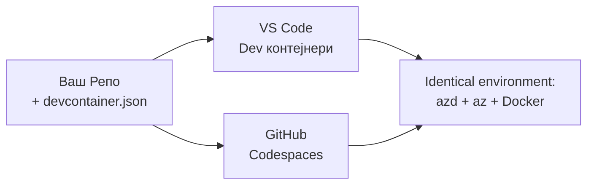

# Дев контејнери и GitHub Codespaces за azd

**Навигација по поглављима:**
- **📚 Почетна курсa**: [AZD за почетнике](../../README.md)
- **📖 Текуће поглавље**: Поглавље 1 - Основа и брзи почетак
- **⬅️ Претходно**: [Доведите своју апликацију](bring-your-own-app.md)
- **🚀 Следеће поглавље**: [Поглавље 2: AI-прво развијање](../chapter-02-ai-development/README.md)

> Верификовано са `azd 1.27.1` у јулу 2026.

## Увод

Инсталирање azd, одговарајућег извршног окружења за језик, Dockera и Azure CLI на сваком рачунару је заморно — и то је главни разлог зашто туторијал који "ради на мом рачунару" не функционише за неког другог. **Дев контејнер** то решава тако што описује цео ваш алатски ланац у једној датотеци. Свако ко отвори пројекат у VS Code или GitHub Codespaces добија потпуно исто окружење, са већ инсталираним azd-ом. Овај час вам показује како да га додате.

## Циљеви учења

На крају овог часа ћете:
- Разумети шта је дев контејнер и зашто помаже са azd-ом
- Додати минимални `.devcontainer/devcontainer.json` у пројекат
- Укључити azd, Azure CLI и Docker преко функција Дев Контејнера
- Отворити пројекат у GitHub Codespaces или VS Code

## Резултати учења

Након завршетка овог часа, моћи ћете да:
- Креирате `devcontainer.json` за azd пројекат
- Додате azd и Azure алате без ручних инсталација
- Покренете `azd up` изнутра контејнера или Codespace-а

---

## Шта је дев контејнер?

Дев контејнер је Docker-базирано развојно окружење дефинисано помоћу датотеке `.devcontainer/devcontainer.json` у вашем репозиторијуму. Када отворите пројекат:

- **VS Code** (са додатком Dev Containers) гради контејнер и прикључује се на њега.
- **GitHub Codespaces** гради исти контејнер у облаку и пружа вам едитор у претраживачу.

У оба случаја, сваки сарадник добија идентичне алате — нема "да ли си инсталирао azd?" дијагностицирања.



---

## Корак 1: Креирајте девконтејнер датотеку

Направите `.devcontainer/devcontainer.json` у корену вашег пројекта:

```json
{
  "name": "azd-project",
  "image": "mcr.microsoft.com/devcontainers/base:bookworm",
  "features": {
    "ghcr.io/devcontainers/features/azure-cli:1": {},
    "ghcr.io/azure/azure-dev/azd:latest": {},
    "ghcr.io/devcontainers/features/docker-in-docker:2": {},
    "ghcr.io/devcontainers/features/node:1": {}
  },
  "customizations": {
    "vscode": {
      "extensions": [
        "ms-azuretools.azure-dev",
        "ms-azuretools.vscode-bicep"
      ]
    }
  },
  "forwardPorts": [3000],
  "postCreateCommand": "azd version"
}
```

Шта која ставка ради:

| Кључ | Сврха |
|-----|---------|
| `image` | Основни ОС за контејнер |
| `features` | Предуграђени инсталатери — овде: Azure CLI, **azd**, Docker и Node.js |
| `customizations.vscode.extensions` | Аутоматска инсталација azd и Bicep додатака за VS Code |
| `forwardPorts` | Излаже порт ваше апликације претраживачу |
| `postCreateCommand` | Покреће се једном након што је контејнер изграђен (овде, провера исправности) |

> `ghcr.io/azure/azure-dev/azd:latest` функција је званични начин да добијете azd унутар контејнера. За репродуцибилност, закључајте одређену верзију (на пример `azd:1.27.1`).

---

## Корак 2: Ускладите функцију са језиком ваше апликације

Промените `node` функцију према језику који ваша апликација користи:

```jsonc
// Python project
"ghcr.io/devcontainers/features/python:1": {},

// .NET project
"ghcr.io/devcontainers/features/dotnet:2": {},

// Java project
"ghcr.io/devcontainers/features/java:1": {},

// Go project
"ghcr.io/devcontainers/features/go:1": {}
```

Задржите `docker-in-docker` ако је ваш `host` `containerapp`, `aks` или било шта што гради контејнер слику — azd треба Docker за изградњу и пушовање слика.

---

## Корак 3: Отворите га

**У VS Code:**
1. Инсталирајте додатак **Dev Containers**.
2. Отворите фасциклу пројекта.
3. Кликните на **Reopen in Container** када вам буде понуђено (или покрените *Dev Containers: Reopen in Container*).

**У GitHub Codespaces:**
1. Потисните репо на GitHub.
2. Кликните на **Code → Codespaces → Create codespace on main**.
3. Сачекајте да се контејнер изгради — azd је спреман у терминалу.

---

## Корак 4: Деплој са унутрашњости контејнера

Контејнер има преинсталиран azd, па нормални ток рада просто функционише:

```bash
azd auth login --use-device-code   # код уређаја је згодан унутар Codespaces
azd up
```

> **Зашто `--use-device-code`?** У удаљеном контејнеру или Codespace-у нема локалног претраживача за преусмеравање, па је пријава преко уређаја поуздан пут. Унијећете код у претраживачу да бисте завршили пријаву.

---

## Уобичајене замке

| Замка | Решење |
|---------|-----|
| `azd up` не може да изгради слику | Додајте функцију `docker-in-docker` |
| Пријава у претраживачу зарежава у Codespaces | Користите `azd auth login --use-device-code` |
| Алатке се разликују између чланова тима | Закључајте верзије функција (нпр. `azd:1.27.1`) |
| Апликација није доступна у претраживачу | Додајте порт у `forwardPorts` |

---

## Резиме

- Дев контејнер чини ваш azd алатски ланац репродуцибилним за све.
- Додајте azd, Azure CLI и Docker преко функција Дев контејнера.
- Ускладите функцију језика са вашом апликацијом и задржите `docker-in-docker` за хостове контејнера.
- Користите пријаву преко уређаја када сте у Codespaces.

---

## 🔗 Навигација

| Правaц | Ресурс |
|-----------|----------|
| **Претходно** | [Доведите своју апликацију](bring-your-own-app.md) |
| **Почетак поглавља** | [Поглавље 1: Основа и брзи почетак](README.md) |
| **Следеће поглавље** | [Поглавље 2: AI-прво развијање](../chapter-02-ai-development/README.md) |

## 📖 Повезани ресурси

- [Инсталација и подешавање](installation.md)
- [Командни подсетник](../../resources/cheat-sheet.md)
- [Званична спецификација Дев Контејнера](https://containers.dev/)
- [azd Дев Контејнер функција](https://github.com/Azure/azure-dev/tree/main/ext/devcontainer)

---

<!-- CO-OP TRANSLATOR DISCLAIMER START -->
**Изјава о одрицању одговорности**:
Овај документ је преведен коришћењем услуге за аутоматски превод [Co-op Translator](https://github.com/Azure/co-op-translator). Иако тежимо тачности, имајте у виду да аутоматски преводи могу садржати грешке или нетачности. Оригинални документ на његовом изворном језику треба сматрати ауторитативним извором. За критичне информације препоручује се професионални људски превод. Нисмо одговорни за било каква неспоразума или погрешна тумачења која произилазе из коришћења овог превода.
<!-- CO-OP TRANSLATOR DISCLAIMER END -->