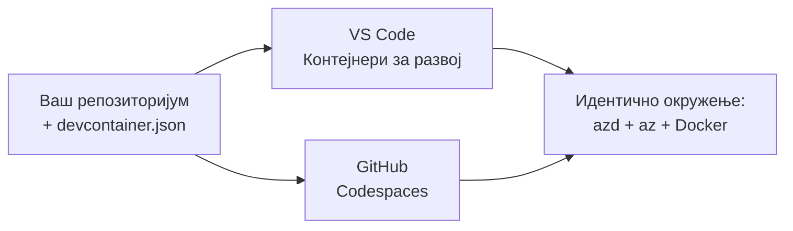

# Dev Containers & GitHub Codespaces for azd

**Chapter Navigation:**
- **📚 Course Home**: [AZD за почетнике](../../README.md)
- **📖 Current Chapter**: Поглавље 1 - Основе и брзи почетак
- **⬅️ Previous**: [Користите сопствену апликацију](bring-your-own-app.md)
- **🚀 Next Chapter**: [Поглавље 2: Развој оријентисан на AI](../chapter-02-ai-development/README.md)

> Потврђено против `azd 1.25.6` у јуну 2026.

## Увод

Инсталирање azd, одговарајућег runtime-а за језик, Docker-а и Azure CLI на сваком рачунару је напорно — и то је главни разлог зашто туторијал који "ради на мом рачунару" не успе за некога другог. Један **dev контејнер** решава овај проблем тако што описује цео ваш алатски ланац у фајлу. Свако ко отвори пројекат у VS Code-у или GitHub Codespaces добије потпуно исто окружење, са већ инсталираним azd. Ова лекција показује како да га додате.

## Циљеви учења

До краја ове лекције, ви ћете:
- Разумети шта је dev контејнер и зашто помаже са azd
- Додати минималан `.devcontainer/devcontainer.json` у пројекат
- Укључити azd, Azure CLI и Docker преко Dev Container *features*
- Отворити пројекат у GitHub Codespaces или VS Code-у

## Резултати учења

Након завршетка ове лекције, моћи ћете да:
- Напишете `devcontainer.json` за azd пројекат
- Додате azd и Azure алате без ручне инсталације
- Покренете `azd up` изнутра контејнера или Codespace-а

---

## Шта је dev контејнер?

Dev контејнер је развојно окружење засновано на Docker-у дефинисано фајлом `.devcontainer/devcontainer.json` у вашем репозиторијуму. Када отворите пројекат:

- **VS Code** (са екстензијом Dev Containers) гради контејнер и прикачује се на њега.
- **GitHub Codespaces** гради исти контејнер у облаку и даје вам уређивач у прегледачу.

У оба случаја, сваки сарадник добија идентичне алате — нема питања типа "да ли си инсталирао azd?".



---

## Корак 1: Креирајте devcontainer фајл

Креирајте `.devcontainer/devcontainer.json` у корену вашег пројекта:

```json
{
  "name": "azd-project",
  "image": "mcr.microsoft.com/devcontainers/base:bookworm",
  "features": {
    "ghcr.io/devcontainers/features/azure-cli:1": {},
    "ghcr.io/azure/azure-dev/azd:latest": {},
    "ghcr.io/devcontainers/features/docker-in-docker:2": {},
    "ghcr.io/devcontainers/features/node:1": {}
  },
  "customizations": {
    "vscode": {
      "extensions": [
        "ms-azuretools.azure-dev",
        "ms-azuretools.vscode-bicep"
      ]
    }
  },
  "forwardPorts": [3000],
  "postCreateCommand": "azd version"
}
```

Шта сваки део ради:

| Key | Purpose |
|-----|---------|
| `image` | Основни ОС за контејнер |
| `features` | Унапред припремљени инсталатери — овде: Azure CLI, **azd**, Docker и Node.js |
| `customizations.vscode.extensions` | Аутоматски инсталира azd и Bicep екстензије за VS Code |
| `forwardPorts` | Излаже порт ваше апликације у прегледач |
| `postCreateCommand` | Покреће се једном након што је контејнер изграђен (овде, провера исправности) |

> Феатура `ghcr.io/azure/azure-dev/azd:latest` је званични начин да добијете azd у контејнеру. Ако вам треба понављивост, закључајте специфичну верзију (на пример `azd:1.25.6`).

---

## Корак 2: Ускладите феатуру са језиком ваше апликације

Замените `node` феатуру са оним што ваша апликација користи:

```jsonc
// Python project
"ghcr.io/devcontainers/features/python:1": {},

// .NET project
"ghcr.io/devcontainers/features/dotnet:2": {},

// Java project
"ghcr.io/devcontainers/features/java:1": {},

// Go project
"ghcr.io/devcontainers/features/go:1": {}
```

Задржите `docker-in-docker` ако је ваш `host` `containerapp`, `aks`, или било шта што гради слику контејнера — azd треба Docker да би градио и пушовао слике контејнера.

---

## Корак 3: Отворите га

**У VS Code-у:**
1. Инсталирајте **Dev Containers** екстензију.
2. Отворите фасциклу пројекта.
3. Кликните **Поново отвори у контејнеру** када вас систем упита (или покрените *Dev Containers: Поново отвори у контејнеру*).

**У GitHub Codespaces:**
1. Пошаљите репозиторијум на GitHub.
2. Кликните **Code → Codespaces → Креирај codespace на main**.
3. Сачекајте да се контејнер изгради — azd је спреман у терминалу.

---

## Корак 4: Деплој изнутра контејнера

Контејнер има прединсталиран azd, тако да нормалан радни ток једноставно функционише:

```bash
azd auth login --use-device-code   # код уређаја је практичан унутар Codespaces
azd up
```

> **Зашто `--use-device-code`?** У удаљеном контејнеру или Codespace-у нема локалног прегледача за преусмеравање, па је пријава помоћу device-кода поуздан пут. Налепићете код у таб прегледача да бисте завршили пријаву.

---

## Чести проблеми

| Проблем | Решење |
|---------|--------|
| `azd up` не може да изгради слику | Додајте `docker-in-docker` феатуру |
| Пријава у прегледачу запне у Codespaces-у | Користите `azd auth login --use-device-code` |
| Алатке се разликују међу члановима тима | Закључајте верзије феатура (нпр. `azd:1.25.6`) |
| Апликација није доступна у прегледачу | Додајте порт у `forwardPorts` |

---

## Резиме

- Dev контејнер чини ваш azd алатски ланац понављивим за све.
- Додајте azd, Azure CLI и Docker кроз Dev Container *features*.
- Ускладите језичку феатуру са вашом апликацијом и задржите `docker-in-docker` за host-ове који граде контејнере.
- Користите пријаву помоћу device-кода када радите унутар Codespaces-а.

---

## 🔗 Навигација

| Смер | Ресурс |
|-----------|----------|
| **Претходно** | [Користите сопствену апликацију](bring-your-own-app.md) |
| **Почетак поглавља** | [Поглавље 1: Основе и брзи почетак](README.md) |
| **Следеће поглавље** | [Поглавље 2: Развој оријентисан на AI](../chapter-02-ai-development/README.md) |

## 📖 Повезани ресурси

- [Инсталација и подешавање](installation.md)
- [Сажетак команди](../../resources/cheat-sheet.md)
- [Званична спецификација Dev Containers](https://containers.dev/)
- [azd Dev Container феатура](https://github.com/Azure/azure-dev/tree/main/ext/devcontainer)

---

<!-- CO-OP TRANSLATOR DISCLAIMER START -->
**Изјава о одрицању одговорности**:
Овај документ је преведен коришћењем услуге за аутоматски превод [Co-op Translator](https://github.com/Azure/co-op-translator). Иако тежимо тачности, имајте у виду да аутоматски преводи могу садржати грешке или нетачности. Оригинални документ на његовом изворном језику треба сматрати ауторитативним извором. За критичне информације препоручује се професионални људски превод. Нисмо одговорни за било каква неспоразума или погрешна тумачења која произилазе из коришћења овог превода.
<!-- CO-OP TRANSLATOR DISCLAIMER END -->