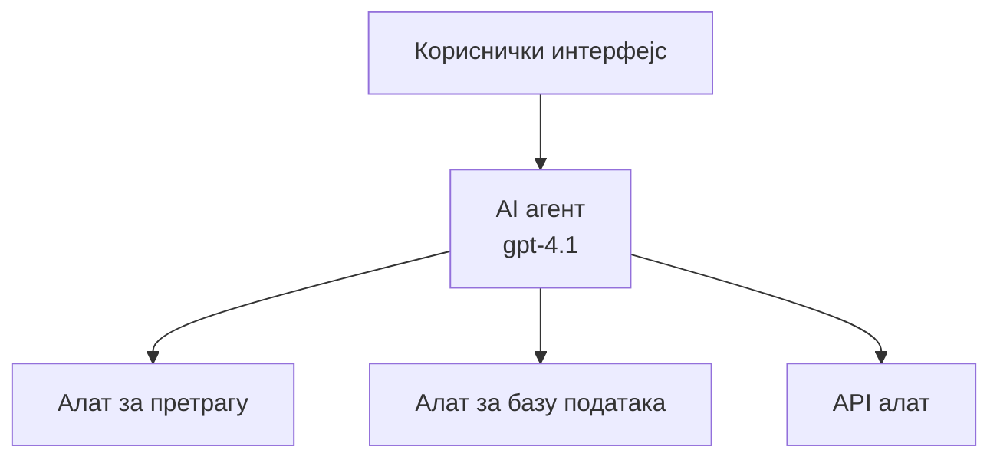
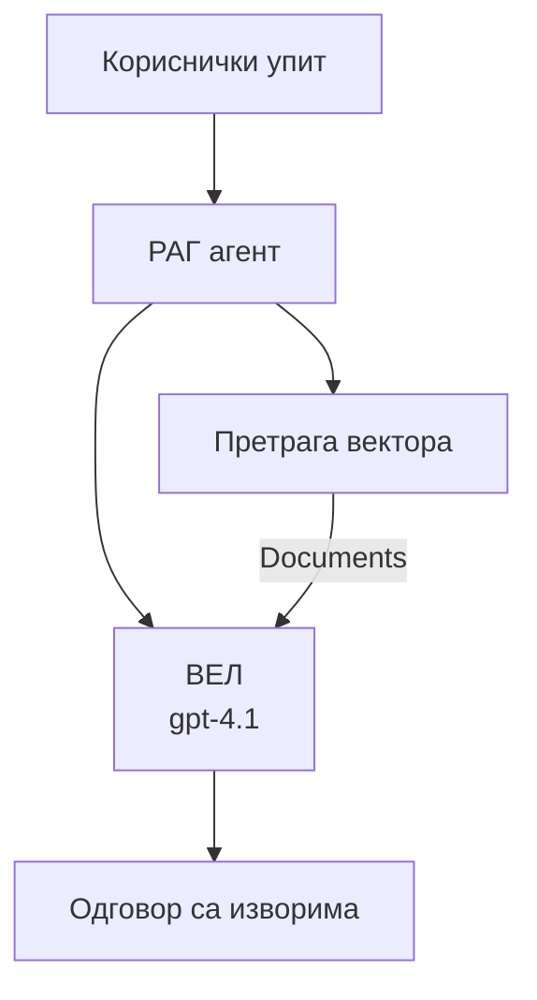
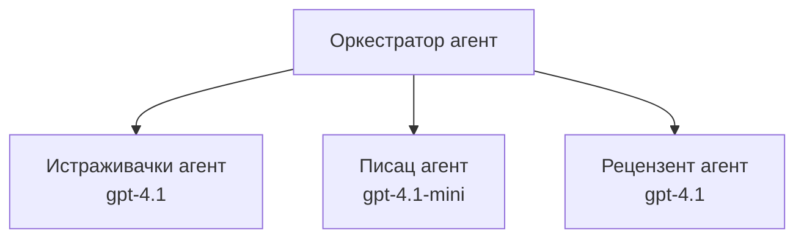

# AI агентi са Azure Developer CLI

**Навигација по поглављима:**
- **📚 Почетна курса**: [AZD За почетнике](../../README.md)
- **📖 Тренутно поглавље**: Поглавље 2 - AI-први развој
- **⬅️ Претходно**: [Microsoft Foundry интеграција](microsoft-foundry-integration.md)
- **➡️ Следеће**: [Деплоај AI модела](ai-model-deployment.md)
- **🚀 Напредно**: [Решења са више агената](../../examples/retail-scenario.md)

---

## Увод

AI агенти су аутономни програми који могу да перципирају своје окружење, доносе одлуке и предузимају акције да би достигли специфичне циљеве. За разлику од једноставних ћаскајућих ботова који одговарају на упите, агенти могу:

- **Користити алате** - Позивати API-је, претраживати базе података, извршавати код
- **Планирати и размишљати** - Разбити сложене задатке на кораке
- **Учити из контекста** - Одржавати меморију и прилагођавати понашање
- **Сарадивати** - Радити са другим агентима (системи са више агената)

Овај водич приказује како да распоредите AI агенте на Azure користећи Azure Developer CLI (azd).

> **Напомена валидације (2026-07-13):** Овај водич је прегледан са `azd` `1.27.1` и `azure.ai.agents` `1.0.0-beta.5`. Искуство `azd ai` је још увек у прегледној фази, зато проверите помоћ екстензије ако се ваши инсталирани флаги разликују.

## Циљеви учења

Завршавањем овог водича научићете:
- Разумети шта су AI агенти и како се разликују од ботова за ћаскање
- Распоредити унапред изграђене шаблоне AI агената користећи AZD
- Конфигурисати Foundry агенте за прилагођене агенте
- Имплементирати основне агентске шаблоне (коришћење алата, RAG, систем са више агената)
- Пратити и дебаговати распоређене агенте

## Резултати учења

По завршетку ћете бити у стању да:
- Распоредите AI агентске апликације на Azure једном командом
- Конфигуришете алате и могућности агената
- Имплементирате генерацију обогаћену претрагом (RAG) са агентима
- Дизајнирате архитектуре са више агената за сложене токове рада
- Решавате уобичајене проблеме при распоређивању агената

---

## 🤖 Шта агента разликује од ћаскајућег бота?

| Карактеристика | Ћаскајући бот | AI агент |
|---------|---------|----------|
| **Понашање** | Одговара на упите | Предузима аутономне акције |
| **Алати** | Нема | Може позивати API-је, претраживати, извршавати код |
| **Меморија** | Само заснована на сесији | Постојећа меморија између сесија |
| **Планирање** | Један одговор | Вишестепено размишљање |
| **Сарадња** | Један ентитет | Може радити са другим агентима |

### Једноставна аналогија

- **Ћаскајући бот** = Корисна особа која одговара на питања на информативном шалтера
- **AI агент** = Лични асистент који може да зове, резервише термин и обавља задатке за вас

---

## 🚀 Брзи почетак: Распоредите свог првог агента

### Опција 1: Foundry Agents шаблон (препоручено)

```bash
# Иницијализујте шаблон АИ агената
azd init --template get-started-with-ai-agents

# Распоредите на Азуре
azd up
```

**Шта се распоређује:**
- ✅ Foundry Agents
- ✅ Microsoft Foundry модели (gpt-4.1)
- ✅ Azure AI Search (за RAG)
- ✅ Azure Container Apps (веб интерфејс)
- ✅ Application Insights (надгледање)

**Време:** ~15-20 минута
**Трошак:** ~$100-150/месечно (развој)

### Опција 2: OpenAI агент са Prompty

```bash
# Иницијализујте шаблон агента заснованог на Prompty-у
azd init --template agent-openai-python-prompty

# Деплојујте на Azure
azd up
```

**Шта се распоређује:**
- ✅ Azure Functions (без серверско извршавање агента)
- ✅ Microsoft Foundry модели
- ✅ Prompty конфигурациони фајлови
- ✅ Пример имплементације агента

**Време:** ~10-15 минута
**Трошак:** ~$50-100/месечно (развој)

### Опција 3: RAG Chat агент

```bash
# Инициализуј шаблон RAG ћаскања
azd init --template azure-search-openai-demo

# Распореди на Azure
azd up
```

**Шта се распоређује:**
- ✅ Microsoft Foundry модели
- ✅ Azure AI Search са примером података
- ✅ Постојећи процес документног обрађивања
- ✅ Чет интерфејс са цитатима

**Време:** ~15-25 минута
**Трошак:** ~$80-150/месечно (развој)

### Опција 4: AZD AI Agent Init (преглед заснован на манифесту или шаблону)

Ако имате манифест агента, можете користити команду `azd ai` да иницирате пројекат Foundry Agent Service директно. Недавна издања претвора такође су додала подршку за иницијализацију засновану на шаблону, тако да тачан ток упита може мало да се разликује у зависности од верзије инсталиране екстензије.

```bash
# Инсталирајте проширење за AI агенте
azd extension install azure.ai.agents

# Опционо: проверите инсталирану прегледну верзију
azd extension show azure.ai.agents

# Иницијализујте из манифеста агента
azd ai agent init -m agent-manifest.yaml

# Деплојујте на Azure
azd up

# Тестирајте постављеног агента (приказује латенцију + време до првог бајта)
azd ai agent invoke
```

**Када користити `azd ai agent init` уместо `azd init --template`:**

| Приступ | Најбоље за | Како функционише |
|----------|----------|------|
| `azd init --template` | Почетак од радеће пример апликације | Клонира цео шаблон репо са кодом + инфраструктуром |
| `azd ai agent init -m` | Изградња из сопственог манифеста агента | Скелира структуру пројекта из ваше дефиниције агента |

> **Савет:** Користите `azd init --template` када учите (Опције 1-3 горе). Користите `azd ai agent init` када правите продукционе агенте са својим манифестима.

Након `azd up`, иста екстензија вас води кроз остатак животног циклуса агента: `azd ai agent invoke` за тестирање, `azd ai agent eval generate` и `azd ai agent optimize` за мерење и побољшање квалитета, и `azd ai agent delete` за чишћење. Погледајте [AZD AI CLI команде](../chapter-08-production/production-ai-practices.md#azd-ai-cli-commands-and-extensions) за пуну референцу.

---

## 🏗️ Образци архитектуре агената

### Образац 1: Један агент са алатима

Најједноставнији образац агента - један агент који може користити више алата.



**Најбоље за:**
- Ботови за корисничку подршку
- Истраживачки асистенти
- Аналитичари података

**AZD шаблон:** `azure-search-openai-demo`

### Образац 2: RAG агент (генерација обогаћена претрагом)

Агенат који преузима релевантне документе пре него што генерише одговоре.



**Најбоље за:**
- Пословне базе знања
- Системи питања и одговора докумената
- Усклађеност и правна истраживања

**AZD шаблон:** `azure-search-openai-demo`

### Образац 3: Систем више агената

Више специјализованих агената који раде заједно на сложеним задацима.



**Најбоље за:**
- Комплексна генерисања садржаја
- Вишестепени токови рада
- Задатке који захтевају различите експертизе

**Сазнајте више:** [Образци координације више агената](../chapter-06-pre-deployment/coordination-patterns.md)

---

## ⚙️ Конфигурисање алата агента

Агенти постају моћни када могу користити алате. Ево како да конфигуришете уобичајене алате:

### Конфигурација алата у Foundry Agents

```python
# agent_config.py
from azure.ai.projects import AIProjectClient
from azure.ai.projects.models import FunctionTool, CodeInterpreterTool

# Дефинишите прилагођене алате
search_tool = FunctionTool(
    name="search_knowledge_base",
    description="Search the company knowledge base for relevant documents",
    parameters={
        "type": "object",
        "properties": {
            "query": {
                "type": "string",
                "description": "The search query"
            }
        },
        "required": ["query"]
    }
)

# Креирајте агента са алатима
agent = project_client.agents.create_agent(
    model="gpt-4.1",
    name="Support Agent",
    instructions="You are a helpful support agent. Use the search tool to find relevant information.",
    tools=[search_tool, CodeInterpreterTool()]
)
```

### Конфигурација окружења

```bash
# Подешавање променљивих окружења специфичних за агента
azd env set AZURE_OPENAI_MODEL "gpt-4.1"
azd env set AGENT_INSTRUCTIONS "You are a helpful assistant..."
azd env set ENABLE_CODE_INTERPRETER "true"
azd env set ENABLE_FILE_SEARCH "true"

# Деплој са ажурираним конфигурацијама
azd deploy
```

---

## 📊 Праћење агената

### Интеграција Application Insights

Сви AZD шаблони агената укључују Application Insights за праћење:

```bash
# Отворите контролну таблу за праћење
azd monitor --overview

# Погледајте уживо дневнике
azd monitor --logs

# Погледајте уживо метрике
azd monitor --live
```

### Кључне метрике за праћење

| Метрика | Опис | Циљ |
|--------|-------------|--------|
| Латенција одговора | Време потребно да се генерише одговор | < 5 секунди |
| Потрошња токена | Токени по упиту | Пратите због трошкова |
| Проценат успешних позива алата | % успешног извршавања алата | > 95% |
| Стопа грешака | Неуспели захтеви агента | < 1% |
| Задовољство корисника | Оцене повратних информација | > 4.0/5.0 |

### Прилагођено логовање за агенте

```python
import os
from azure.monitor.opentelemetry import configure_azure_monitor
from opentelemetry import trace

# Конфигуришите Azure Monitor помоћу OpenTelemetry
configure_azure_monitor(
    connection_string=os.environ["APPLICATIONINSIGHTS_CONNECTION_STRING"]
)

tracer = trace.get_tracer(__name__)

def log_agent_interaction(user_query, agent_response, tools_used, latency_ms):
    with tracer.start_as_current_span("agent_interaction") as span:
        span.set_attributes({
            "user_query": user_query,
            "response_length": len(agent_response),
            "tools_used": tools_used,
            "latency_ms": latency_ms
        })
```

> **Напомена:** Инсталирајте потребне пакете: `pip install azure-monitor-opentelemetry opentelemetry`

---

## 💰 Разматрања трошкова

### Процењени месечни трошкови по образцу

| Образац | Дев окружење | Продукција |
|---------|-----------------|------------|
| Један агент | $50-100 | $200-500 |
| RAG агент | $80-150 | $300-800 |
| Вишеструки агенти (2-3 агента) | $150-300 | $500-1,500 |
| Пословни вишеструки агенти | $300-500 | $1,500-5,000+ |

### Савети за оптимизацију трошкова

1. **Користите gpt-4.1-mini за једноставне задатке**
   ```bash
   azd env set AZURE_OPENAI_MODEL "gpt-4.1-mini"
   ```

2. **Имплементирајте кеширање за поновљене упите**
   ```python
   from functools import lru_cache
   
   @lru_cache(maxsize=1000)
   def get_cached_response(query_hash):
       return agent.run(query_hash)
   ```

3. **Установите лимите токена по извршењу**
   ```python
   # Поставите max_completion_tokens приликом покретања агента, не током креирања
   run = project_client.agents.create_run(
       thread_id=thread.id,
       agent_id=agent.id,
       max_completion_tokens=1000  # Ограничите дужину одговора
   )
   ```

4. **Смањите на нулу када се не користи**
   ```bash
   # Контейнер апликације аутоматски се скалирају до нуле
   azd env set MIN_REPLICAS "0"
   ```

---

## 🔧 Решавање проблема са агентима

### Уобичајени проблеми и решења

<details>
<summary><strong>❌ Агент не одговара на позиве алата</strong></summary>

```bash
# Проверите да ли су алати исправно регистровани
azd show

# Верификујте OpenAI распоређивање
az cognitiveservices account deployment list \
  --name $AZURE_OPENAI_NAME \
  --resource-group $RG_NAME

# Проверите евиденцију агента
azd monitor --logs
```

**Чести узроци:**
- Неслагање потписа функције алата
- Недостају неопходне дозволе
- API крајња тачка није доступна
</details>

<details>
<summary><strong>❌ Висока латенција у одговорима агента</strong></summary>

```bash
# Проверите Application Insights за uska grla
azd monitor --live

# Размислите о коришћењу бржег модела
azd env set AZURE_OPENAI_MODEL "gpt-4.1-mini"
azd deploy
```

**Савети за оптимизацију:**
- Користите стриминг одговоре
- Имплементирајте кеширање одговора
- Смањите величину контекстног прозора
</details>

<details>
<summary><strong>❌ Агент враћа нетачне или халуциниране информације</strong></summary>

```python
# Побољшати са бољим системским упутствима
instructions = """
You are a helpful assistant. IMPORTANT:
- Only answer based on provided context
- If you don't know, say "I don't know"
- Always cite your sources
- Never make up information
"""

# Додати преузимање за учвршћивање основе
agent = project_client.agents.create_agent(
    model="gpt-4.1",
    instructions=instructions,
    tools=[FileSearchTool()]  # Основати одговоре у документима
)
```
</details>

<details>
<summary><strong>❌ Грешке због прекорачења лимита токена</strong></summary>

```python
# Имплементирати управљање контекстним прозором
def truncate_context(messages, max_tokens=8000, model="gpt-4.1"):
    """Keep only recent messages within token limit."""
    import tiktoken
    encoding = tiktoken.encoding_for_model(model)
    total_tokens = 0
    truncated = []
    
    for msg in reversed(messages):
        msg_tokens = len(encoding.encode(msg.content))
        if total_tokens + msg_tokens > max_tokens:
            break
        truncated.insert(0, msg)
        total_tokens += msg_tokens
    
    return truncated
```
</details>

---

## 🎓 Вежбе са практичним радом

### Вежба 1: Распоредите основног агента (20 минута)

**Циљ:** Распоредите свог првог AI агента користећи AZD

```bash
# Корак 1: Иницијализуј шаблон
azd init --template get-started-with-ai-agents

# Корак 2: Пријавите се у Azure
azd auth login
# Ако радите преко закупаца, додајте --tenant-id <tenant-id>

# Корак 3: Деплоy
azd up

# Корак 4: Тестирање агента
# Очекује се излаз након деплоyа:
#   Деплоy је завршен!
#   Ендпоинт: https://<app-name>.<region>.azurecontainerapps.io
# Отворите УРЛ приказан у излазу и покушајте да поставите питање

# Корак 5: Погледајте мониторинг
azd monitor --overview

# Корак 6: Очистите окружење
azd down --force --purge
```

**Критеријуми успеха:**
- [ ] Агент одговара на питања
- [ ] Може приступити контролној табли за праћење преко `azd monitor`
- [ ] Ресурси су успешно очишћени

### Вежба 2: Додајте прилагођени алат (30 минута)

**Циљ:** Про проширити агента са прилагођеним алатом

1. Распоредите агента шаблона:
   ```bash
   azd init --template get-started-with-ai-agents
   azd up
   ```
2. Креирајте нову функцију алата у вашем коду агента:
   ```python
   def get_weather(location: str) -> str:
       """Get current weather for a location."""
       # Позив АПИ-ју за сервис временске прогнозе
       return f"Weather in {location}: Sunny, 72°F"
   ```
3. Региструјте алат са агентом:
   ```python
   from azure.ai.projects.models import FunctionTool

   weather_tool = FunctionTool(
       name="get_weather",
       description="Get current weather for a location",
       parameters={
           "type": "object",
           "properties": {
               "location": {"type": "string", "description": "City name"}
           },
           "required": ["location"]
       }
   )

   agent = project_client.agents.create_agent(
       model="gpt-4.1",
       name="Weather Agent",
       tools=[weather_tool]
   )
   ```
4. Поново распоредите и тестирате:
   ```bash
   azd deploy
   # Питај: "Какво је време у Сијетлу?"
   # Очекује се: Агента позива get_weather("Seattle") и враћа информације о времену
   ```

**Критеријуми успеха:**
- [ ] Агент препознаје упите везане за време
- [ ] Алат се исправно позива
- [ ] Одговор садржи информације о времену

### Вежба 3: Направите RAG агента (45 минута)

**Циљ:** Направите агента који одговара на питања из ваших докумената

```bash
# Корак 1: Распоредите RAG шаблон
azd init --template azure-search-openai-demo
azd up

# Корак 2: Учитајте своје документе
# Ставите PDF/TXT датотеке у директоријум data/, затим покрените:
python scripts/prepdocs.py

# Корак 3: Тестирајте са питањима специфичним за домен
# Отворите URL веб апликације из azd up излаза
# Постављајте питања о вашим учитаним документима
# Одговори треба да укључују референце на изворе као што је [doc.pdf]
```

**Критеријуми успеха:**
- [ ] Агент одговара на основу постављених докумената
- [ ] Одговори садрже цитате
- [ ] Без халуцинација на питања изван домена

---

## 📚 Следећи кораци

Сада када разумете AI агенте, истражите ове напредне теме:

| Тема | Опис | Линк |
|-------|-------------|------|
| **Системи више агената** | Направите системе са више сарадничких агената | [Пример више агената у малопродаји](../../examples/retail-scenario.md) |
| **Образци координације** | Научите шаблоне оркестрације и комуникације | [Образци координације](../chapter-06-pre-deployment/coordination-patterns.md) |
| **Продукционо распоређивање** | Распоређивање агената спремних за посао | [Практичне примере AI за продукцију](../chapter-08-production/production-ai-practices.md) |
| **Евалуација агената** | Тестирајте и вреднујте перформансе агената | [Решавање проблема са AI](../chapter-07-troubleshooting/ai-troubleshooting.md) |
| **AI радионица** | Практичан рад: Припремите своје AI решење за AZD | [AI радионица](ai-workshop-lab.md) |

---

## 📖 Додатни ресурси

### Званична документација
- [Microsoft Foundry Agent Service](https://learn.microsoft.com/azure/ai-services/agents/)
- [Microsoft Foundry Agent Service Quickstart](https://learn.microsoft.com/azure/ai-services/agents/quickstart)
- [Semantic Kernel Agent Framework](https://learn.microsoft.com/semantic-kernel/)

### AZD шаблони за агенте
- [Почните са AI агентима](https://github.com/Azure-Samples/get-started-with-ai-agents)
- [Agent OpenAI Python Prompty](https://github.com/Azure-Samples/agent-openai-python-prompty)
- [Azure Search OpenAI Demo](https://github.com/Azure-Samples/azure-search-openai-demo)

### Заједнички ресурси
- [Одлични AZD - шаблони агената](https://azure.github.io/awesome-azd/?tags=ai-agents)
- [Azure AI Discord](https://discord.gg/microsoft-azure)
- [Microsoft Foundry Discord](https://discord.gg/nTYy5BXMWG)

### Вештине агената за ваш уредник
- [**Microsoft Azure Agent Skills**](https://skills.sh/microsoft/github-copilot-for-azure) - Инсталирајте реусабл AI агент вештине за Azure развој у GitHub Copilot, Cursor или било који подржани агент. Обухвата вештине за [Azure AI](https://skills.sh/microsoft/github-copilot-for-azure/azure-ai), [Microsoft Foundry](https://skills.sh/microsoft/github-copilot-for-azure/microsoft-foundry), [деплоај](https://skills.sh/microsoft/github-copilot-for-azure/azure-deploy), и [дијагностику](https://skills.sh/microsoft/github-copilot-for-azure/azure-diagnostics):
  ```bash
  npx skills add microsoft/github-copilot-for-azure
  ```

---

**Навигација**
- **Претходна лекција**: [Microsoft Foundry интеграција](microsoft-foundry-integration.md)
- **Следећа лекција**: [Деплоај AI модела](ai-model-deployment.md)

---

<!-- CO-OP TRANSLATOR DISCLAIMER START -->
**Изјава о одрицању одговорности**:
Овај документ је преведен коришћењем услуге за аутоматски превод [Co-op Translator](https://github.com/Azure/co-op-translator). Иако тежимо тачности, имајте у виду да аутоматски преводи могу садржати грешке или нетачности. Оригинални документ на његовом изворном језику треба сматрати ауторитативним извором. За критичне информације препоручује се професионални људски превод. Нисмо одговорни за било каква неспоразума или погрешна тумачења која произилазе из коришћења овог превода.
<!-- CO-OP TRANSLATOR DISCLAIMER END -->