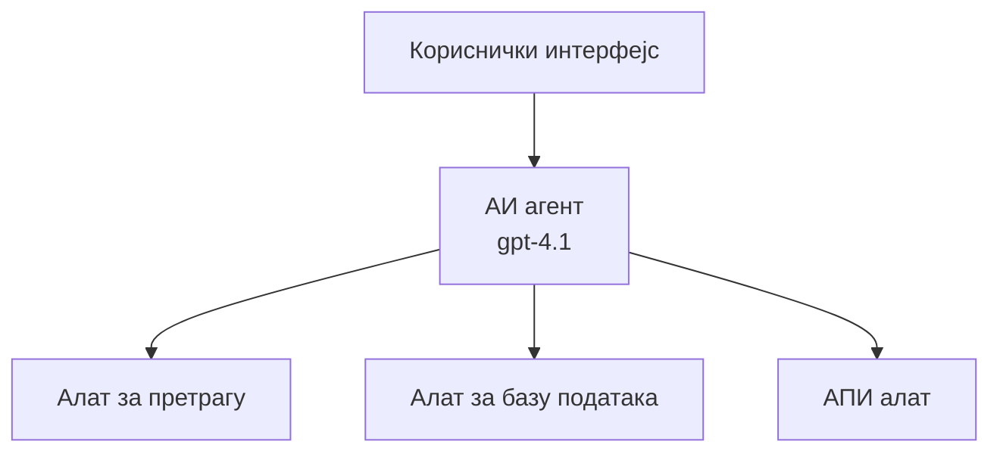
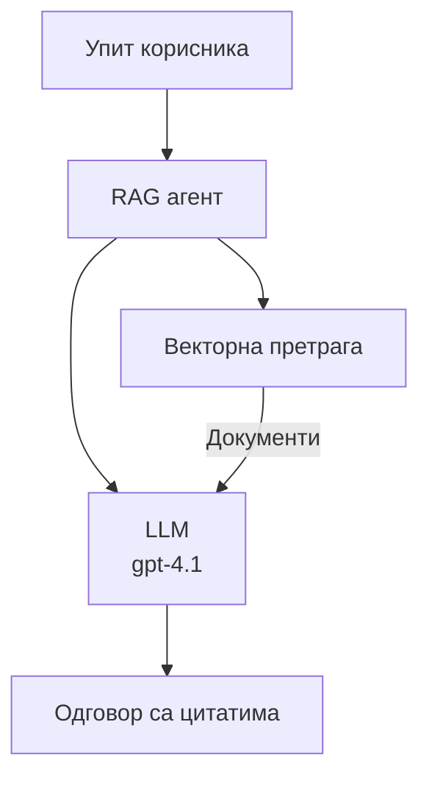
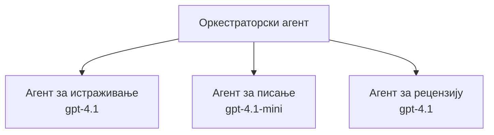

# AI агенти са Azure Developer CLI

**Навигација кроз поглавља:**
- **📚 Почетак курса**: [AZD за почетнике](../../README.md)
- **📖 Тренутно поглавље**: Поглавље 2 - Развој вођен вештачком интелигенцијом
- **⬅️ Претходно**: [Microsoft Foundry Integration](microsoft-foundry-integration.md)
- **➡️ Следеће**: [AI Model Deployment](ai-model-deployment.md)
- **🚀 Напредно**: [Решења са више агената](../../examples/retail-scenario.md)

---

## Увод

AI агенти су аутономни програми који могу да перципирају своје окружење, доносе одлуке и предузимају радње како би постигли одређене циљеве. За разлику од једноставних четботова који одговарају на упите, агенти могу:

- **Користе алате** - Позивати API-је, претраживати базе података, извршавати код
- **Планирају и размишљају** - Разлажу сложене задатке на кораке
- **Уче из контекста** - Одржавају меморију и прилагођавају понашање
- **Сарађују** - Раде са другим агентима (системи са више агената)

Овај водич показује како да размештате AI агенте на Azure користећи Azure Developer CLI (azd).

> **Напомена о валидацији (2026-03-25):** Овај водич је прегледан у односу на `azd` `1.23.12` и `azure.ai.agents` `0.1.18-preview`. `azd ai` искуство је још увек вођено preview верзијама, па проверите помоћ екстензије ако се ваши инсталирани флагови разликују.

## Циљеви учења

Постаћи овај водич, бићете у стању да:
- Разумете шта су AI агенти и како се разликују од четботова
- Размештате преднаправљене шаблоне AI агената користећи AZD
- Конфигуришете Foundry агенте за прилагођене агенте
- Имплементирате основне обрасце агената (коришћење алата, RAG, мулти-агент)
- Праћете и дебагујете размештене агенте

## Исходи учења

По завршетку, моћи ћете да:
- Размештате AI агент апликације на Azure са једном командом
- Конфигуришете алате и могућности агената
- Имплементирате retrieval-augmented generation (RAG) са агентима
- Дизајнирате архитектуре са више агената за сложене токове рада
- Решавате уобичајене проблеме приликом размештања агената

---

## 🤖 Шта чини агента другачијим од четбота?

| Особина | Четбот | AI агент |
|---------|---------|----------|
| **Понашање** | Одговара на упите | Предузима аутономне акције |
| **Алати** | Нема | Може позивати API-је, претраживати, извршавати код |
| **Меморија** | Само заснована на сесији | Постојана меморија између сесија |
| **Планирање** | Један одговор | Расуђивање у више корака |
| **Сарадња** | Јединица | Може радити са другим агентима |

### Једноставна аналогија

- **Четбот** = Корисна особа која одговара на питања на информационом пулту
- **AI агент** = Приватни асистент који може да телефонира, закаже састанке и заврши задатке за вас

---

## 🚀 Брзи почетак: Разместите свог првог агента

### Опција 1: Foundry Agents Template (Препоручено)

```bash
# Иницијализуј шаблон агената вештачке интелигенције
azd init --template get-started-with-ai-agents

# Распореди на Azure
azd up
```

**Шта се размешта:**
- ✅ Foundry Agents
- ✅ Microsoft Foundry Models (gpt-4.1)
- ✅ Azure AI Search (за RAG)
- ✅ Azure Container Apps (веб интерфејс)
- ✅ Application Insights (праћење)

**Време:** ~15-20 минута
**Трошкови:** ~$100-150/месечно (за развој)

### Опција 2: OpenAI Agent with Prompty

```bash
# Иницијализујте шаблон агента заснован на Prompty-у
azd init --template agent-openai-python-prompty

# Разместите на Azure
azd up
```

**Шта се размешта:**
- ✅ Azure Functions (serverless извршавање агента)
- ✅ Microsoft Foundry Models
- ✅ Prompty конфигурационе датотеке
- ✅ Пример имплементације агента

**Време:** ~10-15 минута
**Трошкови:** ~$50-100/месечно (за развој)

### Опција 3: RAG Chat Agent

```bash
# Иницијализујте RAG шаблон за ћаскање
azd init --template azure-search-openai-demo

# Распоредите на Azure
azd up
```

**Шта се размешта:**
- ✅ Microsoft Foundry Models
- ✅ Azure AI Search са пример подацима
- ✅ Пипелајн за обраду докумената
- ✅ Чет интерфејс са цитатима

**Време:** ~15-25 минута
**Трошкови:** ~$80-150/месечно (за развој)

### Опција 4: AZD AI Agent Init (Предвиев заснован на манифесту или шаблону)

Ако имате датотеку манифеста агента, можете користити команду `azd ai` да директно скелетонирате Foundry Agent Service пројекат. Недавна preview издања такође су додала подршку за иницијализацију засновану на шаблонима, тако да се тачан ток упита може мало разликовати у зависности од инсталиране верзије екстензије.

```bash
# Инсталирајте екстензију за AI агенте
azd extension install azure.ai.agents

# Опционо: проверите инсталирану прегледну верзију
azd extension show azure.ai.agents

# Иницијализујте из манифеста агента
azd ai agent init -m agent-manifest.yaml

# Разместите на Azure
azd up
```

**Када користити `azd ai agent init` vs `azd init --template`:**

| Приступ | Најбоље за | Како функционише |
|----------|----------|------|
| `azd init --template` | Почетак од радне пример апликације | Клонира пун репо са шаблоном који укључује код и инфраструктуру |
| `azd ai agent init -m` | Изградња из сопственог манифеста агента | Креира структуру пројекта на основу ваше дефиниције агента |

> **Савет:** Користите `azd init --template` када учите (Опције 1-3 изнад). Користите `azd ai agent init` када градите продукционе агенте са сопственим манифестима. Погледајте [AZD AI CLI Commands](../chapter-08-production/production-ai-practices.md#azd-ai-cli-commands-and-extensions) за комплетну референцу.

---

## 🏗️ Обрасци архитектуре агената

### Образац 1: Један агент са алатима

Најједноставнији образац агента - један агент који може да користи више алата.


**Најпогодније за:**
- Ботове за корисничку подршку
- Истраживачке асистенте
- Агенте за анализу података

**AZD шаблон:** `azure-search-openai-demo`

### Образац 2: RAG агент (Retrieval-Augmented Generation)

Агент који пре генерисања одговора преузима релевантне документе.


**Најпогодније за:**
- Корпоративне базе знања
- Системе за питања и одговоре на документима
- Усаглашеност и правна истраживања

**AZD шаблон:** `azure-search-openai-demo`

### Образац 3: Систем са више агената

Више специјализованих агената који сарађују на сложеним задацима.


**Најпогодније за:**
- Сложено генерисање садржаја
- Мулти-степене токове рада
- Задатке који захтевају различите области експертизе

**Сазнајте више:** [Multi-Agent Coordination Patterns](../chapter-06-pre-deployment/coordination-patterns.md)

---

## ⚙️ Конфигурисање алата агента

Агенти постају моћни када могу да користе алате. Ево како да конфигуришете уобичајене алате:

### Конфигурација алата у Foundry агентима

```python
# agent_config.py
from azure.ai.projects import AIProjectClient
from azure.ai.projects.models import FunctionTool, CodeInterpreterTool

# Дефинишите прилагођене алате
search_tool = FunctionTool(
    name="search_knowledge_base",
    description="Search the company knowledge base for relevant documents",
    parameters={
        "type": "object",
        "properties": {
            "query": {
                "type": "string",
                "description": "The search query"
            }
        },
        "required": ["query"]
    }
)

# Креирајте агента са алатима
agent = project_client.agents.create_agent(
    model="gpt-4.1",
    name="Support Agent",
    instructions="You are a helpful support agent. Use the search tool to find relevant information.",
    tools=[search_tool, CodeInterpreterTool()]
)
```

### Конфигурација окружења

```bash
# Подесите променљиве окружења специфичне за агента
azd env set AZURE_OPENAI_MODEL "gpt-4.1"
azd env set AGENT_INSTRUCTIONS "You are a helpful assistant..."
azd env set ENABLE_CODE_INTERPRETER "true"
azd env set ENABLE_FILE_SEARCH "true"

# Разместите са ажурираном конфигурацијом
azd deploy
```

---

## 📊 Праћење агената

### Интеграција са Application Insights

Сви AZD шаблони агената укључују Application Insights за праћење:

```bash
# Отвори контролну таблу за праћење
azd monitor --overview

# Прикажи логове у реалном времену
azd monitor --logs

# Прикажи метрике у реалном времену
azd monitor --live
```

### Кључне метрике за праћење

| Метрика | Опис | Циљ |
|--------|-------------|--------|
| Време одзива | Време за генерисање одговора | < 5 секунди |
| Коришћење токена | Токени по захтеву | Пратите због трошкова |
| Стопа успешности позива алата | % успешних извршења алата | > 95% |
| Стопа грешака | Неуспели захтеви агента | < 1% |
| Задовољство корисника | Оцене повратних информација | > 4.0/5.0 |

### Прилагођено логовање за агенте

```python
import os
from azure.monitor.opentelemetry import configure_azure_monitor
from opentelemetry import trace

# Конфигуришите Azure Monitor са OpenTelemetry
configure_azure_monitor(
    connection_string=os.environ["APPLICATIONINSIGHTS_CONNECTION_STRING"]
)

tracer = trace.get_tracer(__name__)

def log_agent_interaction(user_query, agent_response, tools_used, latency_ms):
    with tracer.start_as_current_span("agent_interaction") as span:
        span.set_attributes({
            "user_query": user_query,
            "response_length": len(agent_response),
            "tools_used": tools_used,
            "latency_ms": latency_ms
        })
```

> **Напомена:** Инсталирајте потребне пакете: `pip install azure-monitor-opentelemetry opentelemetry`

---

## 💰 Разматрања трошкова

### Процењени месечни трошкови по обрасцу

| Образац | Развојно окружење | Продукција |
|---------|-----------------|------------|
| Један агент | $50-100 | $200-500 |
| RAG агент | $80-150 | $300-800 |
| Више-агентни (2-3 агента) | $150-300 | $500-1,500 |
| Ентерпрајз више-агентни | $300-500 | $1,500-5,000+ |

### Савети за оптимизацију трошкова

1. **Користите gpt-4.1-mini за једноставне задатке**
   ```bash
   azd env set AZURE_OPENAI_MODEL "gpt-4.1-mini"
   ```

2. **Имплементирајте кеширање за понављане упите**
   ```python
   from functools import lru_cache
   
   @lru_cache(maxsize=1000)
   def get_cached_response(query_hash):
       return agent.run(query_hash)
   ```

3. **Поставите лимите токена по покретању**
   ```python
   # Поставите max_completion_tokens када покрећете агента, а не током његовог креирања
   run = project_client.agents.create_run(
       thread_id=thread.id,
       agent_id=agent.id,
       max_completion_tokens=1000  # Ограничите дужину одговора
   )
   ```

4. **Скалирајте на нулу када није у употреби**
   ```bash
   # Container Apps се аутоматски скалирају до нуле.
   azd env set MIN_REPLICAS "0"
   ```

---

## 🔧 Решавање проблема агената

### Чести проблеми и решења

<details>
<summary><strong>❌ Агент не одговара на позиве алата</strong></summary>

```bash
# Проверите да ли су алати правилно регистровани
azd show

# Проверите OpenAI размештање
az cognitiveservices account deployment list \
  --name $AZURE_OPENAI_NAME \
  --resource-group $RG_NAME

# Проверите логове агента
azd monitor --logs
```

**Уобичајени узроци:**
- Неподударност сигнатуре функције алата
- Недостајуће потребне дозволе
- API крајња тачка није приступачна
</details>

<details>
<summary><strong>❌ Висока латенција у одговорима агента</strong></summary>

```bash
# Проверите Application Insights за уска грла
azd monitor --live

# Размотрите коришћење бржег модела
azd env set AZURE_OPENAI_MODEL "gpt-4.1-mini"
azd deploy
```

**Савети за оптимизацију:**
- Користите стриминг одговоре
- Имплементирајте кеширање одговора
- Смањите величину контекст прозора
</details>

<details>
<summary><strong>❌ Агент враћа нетачне или халуцинације у информацијама</strong></summary>

```python
# Унапредити помоћу бољих системских упита
instructions = """
You are a helpful assistant. IMPORTANT:
- Only answer based on provided context
- If you don't know, say "I don't know"
- Always cite your sources
- Never make up information
"""

# Додати дохватање ради утемељења
agent = project_client.agents.create_agent(
    model="gpt-4.1",
    instructions=instructions,
    tools=[FileSearchTool()]  # Утемељити одговоре у документима
)
```
</details>

<details>
<summary><strong>❌ Грешке: премашен лимит токена</strong></summary>

```python
# Имплементирај управљање контекстним прозором
def truncate_context(messages, max_tokens=8000, model="gpt-4.1"):
    """Keep only recent messages within token limit."""
    import tiktoken
    encoding = tiktoken.encoding_for_model(model)
    total_tokens = 0
    truncated = []
    
    for msg in reversed(messages):
        msg_tokens = len(encoding.encode(msg.content))
        if total_tokens + msg_tokens > max_tokens:
            break
        truncated.insert(0, msg)
        total_tokens += msg_tokens
    
    return truncated
```
</details>

---

## 🎓 Практичне вежбе

### Вежба 1: Разместите основног агента (20 минута)

**Циљ:** Разместите свог првог AI агента користећи AZD

```bash
# Корак 1: Иницијализујте шаблон
azd init --template get-started-with-ai-agents

# Корак 2: Пријавите се у Azure
azd auth login
# Ако радите преко више tenant-а, додајте --tenant-id <tenant-id>

# Корак 3: Размештање
azd up

# Корак 4: Тестирајте агента
# Очекивани излаз након размештања:
#   Размештање завршено!
#   Крајња тачка: https://<app-name>.<region>.azurecontainerapps.io
# Отворите URL приказан у излазу и покушајте да поставите питање

# Корак 5: Погледајте надгледање
azd monitor --overview

# Корак 6: Очистите ресурсе
azd down --force --purge
```

**Критеријуми успеха:**
- [ ] Агент одговара на питања
- [ ] Може приступити контролној табли за праћење преко `azd monitor`
- [ ] Ресурси успешно очишћени

### Вежба 2: Додајте прилагођени алат (30 минута)

**Циљ:** Проширите агента прилагођеним алатом

1. Разместите шаблон агента:
   ```bash
   azd init --template get-started-with-ai-agents
   azd up
   ```
2. Направите нову функцију алата у вашем коду агента:
   ```python
   def get_weather(location: str) -> str:
       """Get current weather for a location."""
       # API позив сервису за временску прогнозу
       return f"Weather in {location}: Sunny, 72°F"
   ```
3. Региструјте алат код агента:
   ```python
   from azure.ai.projects.models import FunctionTool

   weather_tool = FunctionTool(
       name="get_weather",
       description="Get current weather for a location",
       parameters={
           "type": "object",
           "properties": {
               "location": {"type": "string", "description": "City name"}
           },
           "required": ["location"]
       }
   )

   agent = project_client.agents.create_agent(
       model="gpt-4.1",
       name="Weather Agent",
       tools=[weather_tool]
   )
   ```
4. Редеплоy и тестирајте:
   ```bash
   azd deploy
   # Питање: "Какво је време у Сијетлу?"
   # Очекује се: Агент позива get_weather("Seattle") и враћа информације о времену
   ```

**Критеријуми успеха:**
- [ ] Агент препознаје упите везане за временску прогнозу
- [ ] Алат се исправно позива
- [ ] Одговор садржи информације о времену

### Вежба 3: Израдите RAG агента (45 минута)

**Циљ:** Креирајте агента који одговара на питања из ваших докумената

```bash
# Корак 1: Разместите RAG шаблон
azd init --template azure-search-openai-demo
azd up

# Корак 2: Отпремите своје документе
# Поставите PDF/TXT датотеке у директоријум data/, затим покрените:
python scripts/prepdocs.py

# Корак 3: Тестирајте са питањима специфичним за домен
# Отворите URL веб апликације из излаза azd up
# Постављајте питања о вашим отпремљеним документима
# Одговори треба да укључују референце цитата попут [doc.pdf]
```

**Критеријуми успеха:**
- [ ] Агент одговара на основу отпремљених докумената
- [ ] Одговори садрже цитате
- [ ] Без халуцинација за питања ван опсега

---

## 📚 Следећи кораци

Сада када разумете AI агенте, истражите ове напредне теме:

| Тема | Опис | Веза |
|-------|-------------|------|
| **Системи са више агената** | Изградите системе са више сарадничких агената | [Пример више-агентног решења за малопродају](../../examples/retail-scenario.md) |
| **Обрасци координације** | Упознајте оркестрационе и комуникационе обрасце | [Coordination Patterns](../chapter-06-pre-deployment/coordination-patterns.md) |
| **Продукционо размештање** | Деплоy агената спремних за ентерпрајз | [Production AI Practices](../chapter-08-production/production-ai-practices.md) |
| **Евалуација агената** | Тестирање и евалуација перформанси агената | [AI Troubleshooting](../chapter-07-troubleshooting/ai-troubleshooting.md) |
| **AI радионица - лабораторија** | Практично: Припремите ваше AI решење за AZD | [AI Workshop Lab](ai-workshop-lab.md) |

---

## 📖 Додатни ресурси

### Званична документација
- [Azure AI Agent Service](https://learn.microsoft.com/azure/ai-services/agents/)
- [Azure AI Foundry Agent Service Quickstart](https://learn.microsoft.com/azure/ai-services/agents/quickstart)
- [Semantic Kernel Agent Framework](https://learn.microsoft.com/semantic-kernel/)

### AZD шаблони за агенте
- [Get Started with AI Agents](https://github.com/Azure-Samples/get-started-with-ai-agents)
- [Agent OpenAI Python Prompty](https://github.com/Azure-Samples/agent-openai-python-prompty)
- [Azure Search OpenAI Demo](https://github.com/Azure-Samples/azure-search-openai-demo)

### Заједнички ресурси
- [Awesome AZD - Agent Templates](https://azure.github.io/awesome-azd/?tags=ai-agents)
- [Azure AI Discord](https://discord.gg/microsoft-azure)
- [Microsoft Foundry Discord](https://discord.gg/nTYy5BXMWG)

### Вештине агента за ваш уређивач
- [**Microsoft Azure Agent Skills**](https://skills.sh/microsoft/github-copilot-for-azure) - Инсталирајте поновно употребљиве вештине AI агената за Azure развој у GitHub Copilot, Cursor или било ком подржаном агенту. Укључује вештине за [Azure AI](https://skills.sh/microsoft/github-copilot-for-azure/azure-ai), [Microsoft Foundry](https://skills.sh/microsoft/github-copilot-for-azure/microsoft-foundry), [deployment](https://skills.sh/microsoft/github-copilot-for-azure/azure-deploy), и [diagnostics](https://skills.sh/microsoft/github-copilot-for-azure/azure-diagnostics):
  ```bash
  npx skills add microsoft/github-copilot-for-azure
  ```

---

**Навигација**
- **Претходна лекција**: [Microsoft Foundry Integration](microsoft-foundry-integration.md)
- **Следећа лекција**: [AI Model Deployment](ai-model-deployment.md)

---

<!-- CO-OP TRANSLATOR DISCLAIMER START -->
**Одрицање одговорности**:
Овај документ је преведен помоћу AI сервиса за превођење [Co-op Translator](https://github.com/Azure/co-op-translator). Иако тежимо тачности, молимо имајте у виду да аутоматски преводи могу садржати грешке или нетачности. Изворни документ на његовом матичном језику треба сматрати званичним извором. За критичне информације препоручује се професионални људски превод. Нисмо одговорни за било какве неспоразуме или погрешна тумачења која произилазе из употребе овог превода.
<!-- CO-OP TRANSLATOR DISCLAIMER END -->