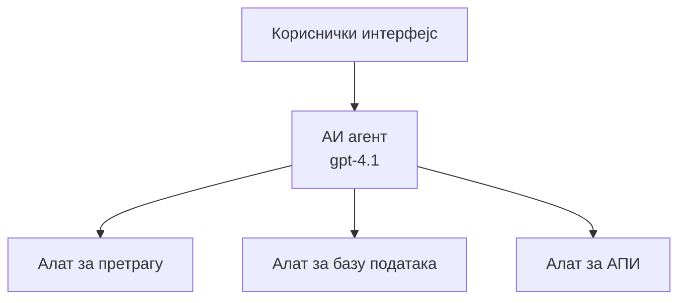
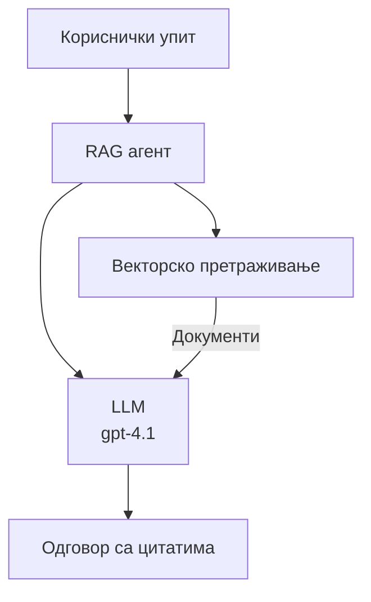
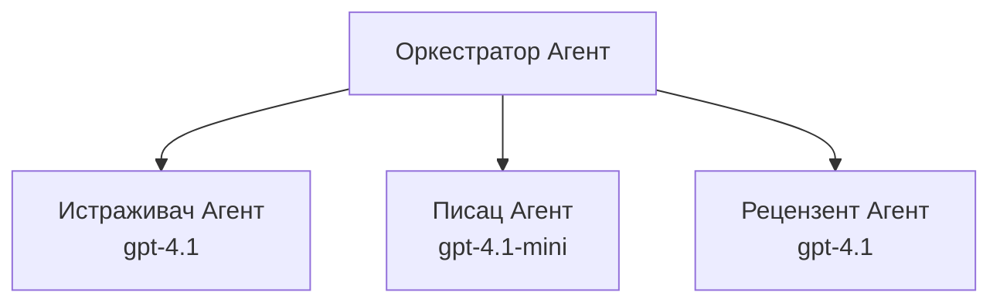

# AI агенти уз Azure Developer CLI

**Навигација поглавља:**
- **📚 Почетна страница курса**: [AZD For Beginners](../../README.md)
- **📖 Тренутно поглавље**: Chapter 2 - AI-First Development
- **⬅️ Претходно**: [Microsoft Foundry Integration](microsoft-foundry-integration.md)
- **➡️ Следеће**: [AI Model Deployment](ai-model-deployment.md)
- **🚀 Напредно**: [Multi-Agent Solutions](../../examples/retail-scenario.md)

---

## Увод

AI агенти су аутономни програми који могу да перципирају своје окружење, доносе одлуке и предузимају акције како би постигли одређене циљеве. За разлику од једноставних четботова који одговарају на упите, агенти могу:

- **Користе алате** - Позивати API-је, претраживати базе података, извршавати код
- **Планирају и размишљају** - Разлажу комплексне задатке на кораке
- **Учe из контекста** - Одржавају меморију и прилагођавају понашање
- **Сарадња** - Раде са другим агентима (мулти-агентни системи)

Ово упутство показује како да размештате AI агенте на Azure користећи Azure Developer CLI (azd).

## Циљеви учења

По завршетку овог упутства, ви ћете:
- Разумети шта су AI агенти и како се разликују од четботова
- Разместити унапред направљене шаблоне AI агената користећи AZD
- Конфигурисати Foundry агенте за прилагођене агенте
- Имплементирати основне обрасце агената (коришћење алата, RAG, мулти-агент)
- Надгледати и отклањати грешке распоређених агената

## Резултати учења

По завршетку, моћи ћете да:
- Разместите AI агент апликације на Azure једном командом
- Конфигуришете алате и могућности агента
- Имплементирате retrieval-augmented generation (RAG) са агентима
- Дизајнирате мулти-агентне архитектуре за комплексне токове посла
- Решавате уобичајене проблеме при размештању агената

---

## 🤖 Шта чини агента другачијим од четбота?

| Карактеристика | Четбот | AI агент |
|---------|---------|----------|
| **Понашање** | Одговара на упите | Пружа аутономне акције |
| **Алатке** | Нема | Може позивати API-је, претраживати, извршавати код |
| **Меморија** | Само по сесијама | Перзистентна меморија између сесија |
| **Планирање** | Један одговор | Вишестепено размишљање |
| **Сарадња** | Један ентитет | Може радити са другим агентима |

### Једноставна аналогија

- **Четбот** = Корисна особа која одговара на питања на информационом пулту
- **AI агент** = Лични асистент који може да телефонира, закаже састанке и обави задатке у ваше име

---

## 🚀 Брзи почетак: Разместите свог првог агента

### Опција 1: Foundry Agents шаблон (Препоручено)

```bash
# Иницијализујте шаблон AI агената
azd init --template get-started-with-ai-agents

# Размештите на Azure
azd up
```

**Шта се распоређује:**
- ✅ Foundry агенти
- ✅ Microsoft Foundry модели (gpt-4.1)
- ✅ Azure AI Search (за RAG)
- ✅ Azure Container Apps (веб интерфејс)
- ✅ Application Insights (надгледање)

**Време:** ~15-20 минута
**Трошак:** ~100-150$/месечно (развој)

### Опција 2: OpenAI агент са Prompty

```bash
# Иницијализујте шаблон агента заснован на Prompty
azd init --template agent-openai-python-prompty

# Распоредите на Azure
azd up
```

**Шта се распоређује:**
- ✅ Azure Functions (serverless извођење агента)
- ✅ Microsoft Foundry модели
- ✅ Prompty конфигурациони фајлови
- ✅ Пример имплементације агента

**Време:** ~10-15 минута
**Трошак:** ~50-100$/месечно (развој)

### Опција 3: RAG чет агент

```bash
# Иницијализовати RAG шаблон за ћаскање
azd init --template azure-search-openai-demo

# Распоредити на Azure
azd up
```

**Шта се распоређује:**
- ✅ Microsoft Foundry модели
- ✅ Azure AI Search са примером података
- ✅ Пайплајн за обраду докумената
- ✅ Чет интерфејс са цитатима

**Време:** ~15-25 минута
**Трошак:** ~80-150$/месечно (развој)

### Опција 4: AZD AI Agent Init (на бази манифеста)

Ако имате фајл манифеста агента, можете користити команду `azd ai` да директно сгенеришете структуру пројекта Foundry Agent Service:

```bash
# Инсталирајте екстензију за AI агенте
azd extension install azure.ai.agents

# Иницијализујте из манифеста агента
azd ai agent init -m agent-manifest.yaml

# Разместите у Azure
azd up
```

**Када користити `azd ai agent init` уместо `azd init --template`:**

| Приступ | Најбоље за | Како ради |
|----------|----------|------|
| `azd init --template` | Почетак од радног примерка апликације | Клонира цео репозиторијум шаблона са кодом и инфраструктуром |
| `azd ai agent init -m` | Изградњу из вашег манифеста агента | Генерише структуру пројекта из дефиниције агента |

> **Савет:** Користите `azd init --template` при учењу (Опције 1-3 горе). Користите `azd ai agent init` при изградњи продукционих агената са вашим манифестима. Погледајте [AZD AI CLI команде](../chapter-08-production/production-ai-practices.md#azd-ai-cli-commands-and-extensions) за пуну референцу.

---

## 🏗️ Обрасци архитектуре агената

### Образац 1: Један агент са алатима

Најједноставнији образац агента - један агент који може да користи више алата.


**Најбоље за:**
- Цустомер сапорт ботове
- Истраживачке асистенте
- Агенте за анализу података

**AZD шаблон:** `azure-search-openai-demo`

### Образац 2: RAG агент (Retrieval-Augmented Generation)

Агент који пре генерисања одговора преузима релевантне документе.


**Најбоље за:**
- Корпоративне базе знања
- Системе за питања и одговоре на документима
- Комплајанс и правна истраживања

**AZD шаблон:** `azure-search-openai-demo`

### Образац 3: Мулти-агентни систем

Више специјализованих агената који раде заједно на комплексним задацима.


**Најбоље за:**
- Комплексно генерисање садржаја
- Вишестепене токове посла
- Задаће које захтевају различите области експертизе

**Сазнајте више:** [Обрасци координације за више агената](../chapter-06-pre-deployment/coordination-patterns.md)

---

## ⚙️ Конфигурисање алата агента

Агенти постају моћни када могу да користе алате. Ево како да конфигуришете уобичајене алате:

### Конфигурација алата у Foundry агентима

```python
# agent_config.py
from azure.ai.projects import AIProjectClient
from azure.ai.projects.models import FunctionTool, CodeInterpreterTool

# Дефинишите прилагођене алате
search_tool = FunctionTool(
    name="search_knowledge_base",
    description="Search the company knowledge base for relevant documents",
    parameters={
        "type": "object",
        "properties": {
            "query": {
                "type": "string",
                "description": "The search query"
            }
        },
        "required": ["query"]
    }
)

# Креирајте агента са алатима
agent = project_client.agents.create_agent(
    model="gpt-4.1",
    name="Support Agent",
    instructions="You are a helpful support agent. Use the search tool to find relevant information.",
    tools=[search_tool, CodeInterpreterTool()]
)
```

### Конфигурација окружења

```bash
# Подесите променљиве окружења специфичне за агента
azd env set AZURE_OPENAI_MODEL "gpt-4.1"
azd env set AGENT_INSTRUCTIONS "You are a helpful assistant..."
azd env set ENABLE_CODE_INTERPRETER "true"
azd env set ENABLE_FILE_SEARCH "true"

# Разместите уз ажурирану конфигурацију
azd deploy
```

---

## 📊 Надгледање агената

### Интеграција Application Insights

Сви AZD шаблони агената укључују Application Insights за надгледање:

```bash
# Отворите контролну таблу за праћење
azd monitor --overview

# Погледајте логове у реалном времену
azd monitor --logs

# Погледајте метрике у реалном времену
azd monitor --live
```

### Кључне метрике за праћење

| Метрика | Опис | Циљ |
|--------|-------------|--------|
| Време одговора | Време за генерисање одговора | < 5 секунди |
| Употреба токена | Токени по захтеву | Пратите због трошкова |
| Стопа успешних позива алата | % успешних извршења алата | > 95% |
| Стопа грешака | Неуспели захтеви агента | < 1% |
| Задовољство корисника | Оцена повратних информација | > 4.0/5.0 |

### Прилагођено логовање за агенте

```python
import os
from azure.monitor.opentelemetry import configure_azure_monitor
from opentelemetry import trace

# Конфигуришите Azure Monitor помоћу OpenTelemetry
configure_azure_monitor(
    connection_string=os.environ["APPLICATIONINSIGHTS_CONNECTION_STRING"]
)

tracer = trace.get_tracer(__name__)

def log_agent_interaction(user_query, agent_response, tools_used, latency_ms):
    with tracer.start_as_current_span("agent_interaction") as span:
        span.set_attributes({
            "user_query": user_query,
            "response_length": len(agent_response),
            "tools_used": tools_used,
            "latency_ms": latency_ms
        })
```

> **Напомена:** Инсталирајте потребне пакете: `pip install azure-monitor-opentelemetry opentelemetry`

---

## 💰 Разматрање трошкова

### Процењени месечни трошкови по обрасцу

| Образац | Развојно окружење | Продукција |
|---------|-----------------|------------|
| Један агент | $50-100 | $200-500 |
| RAG агент | $80-150 | $300-800 |
| Мулти-агент (2-3 агента) | $150-300 | $500-1,500 |
| Ентерпрајз мулти-агент | $300-500 | $1,500-5,000+ |

### Савети за оптимизацију трошкова

1. **Користите gpt-4.1-mini за једноставне задатке**
   ```bash
   azd env set AZURE_OPENAI_MODEL "gpt-4.1-mini"
   ```

2. **Имплементирајте кеширање за поновљене упите**
   ```python
   from functools import lru_cache
   
   @lru_cache(maxsize=1000)
   def get_cached_response(query_hash):
       return agent.run(query_hash)
   ```

3. **Поставите лимите токена по извршавању**
   ```python
   # Подесите max_completion_tokens приликом покретања агента, а не током креирања
   run = project_client.agents.create_run(
       thread_id=thread.id,
       agent_id=agent.id,
       max_completion_tokens=1000  # Ограничите дужину одговора
   )
   ```

4. **Скалирајте на нулу када се не користи**
   ```bash
   # Container Apps се аутоматски скалирају на нулу
   azd env set MIN_REPLICAS "0"
   ```

---

## 🔧 Отстрањивање проблема са агентима

### Уобичајени проблеми и решења

<details>
<summary><strong>❌ Агент не одговара на позиве алата</strong></summary>

```bash
# Проверите да ли су алати правилно регистровани
azd show

# Проверите распоређивање OpenAI-а
az cognitiveservices account deployment list \
  --name $AZURE_OPENAI_NAME \
  --resource-group $RG_NAME

# Проверите логове агента
azd monitor --logs
```

**Уобичајени узроци:**
- Неслагање потписа функције алата
- Недостају потребне дозволе
- API крајња тачка није доступна
</details>

<details>
<summary><strong>❌ Висока латенција у одговорима агента</strong></summary>

```bash
# Проверите Application Insights због уских грла
azd monitor --live

# Размотрите коришћење бржег модела
azd env set AZURE_OPENAI_MODEL "gpt-4.1-mini"
azd deploy
```

**Савети за оптимизацију:**
- Користите стриминг одговоре
- Имплементирајте кеширање одговора
- Смањите величину прозора контекста
</details>

<details>
<summary><strong>❌ Агент враћа нетачне или халуцинаторне информације</strong></summary>

```python
# Побољшати помоћу бољих системских упутстава
instructions = """
You are a helpful assistant. IMPORTANT:
- Only answer based on provided context
- If you don't know, say "I don't know"
- Always cite your sources
- Never make up information
"""

# Додај претраживање за утемљење
agent = project_client.agents.create_agent(
    model="gpt-4.1",
    instructions=instructions,
    tools=[FileSearchTool()]  # Утемељи одговоре у документима
)
```
</details>

<details>
<summary><strong>❌ Грешке због преласка лимита токена</strong></summary>

```python
# Имплементирај управљање контекстним прозором
def truncate_context(messages, max_tokens=8000, model="gpt-4.1"):
    """Keep only recent messages within token limit."""
    import tiktoken
    encoding = tiktoken.encoding_for_model(model)
    total_tokens = 0
    truncated = []
    
    for msg in reversed(messages):
        msg_tokens = len(encoding.encode(msg.content))
        if total_tokens + msg_tokens > max_tokens:
            break
        truncated.insert(0, msg)
        total_tokens += msg_tokens
    
    return truncated
```
</details>

---

## 🎓 Практични задаци

### Вежба 1: Размештање основног агента (20 минута)

**Циљ:** Разместити ваш први AI агент користећи AZD

```bash
# Корак 1: Иницијализујте шаблон
azd init --template get-started-with-ai-agents

# Корак 2: Пријавите се у Azure
azd auth login

# Корак 3: Разместите
azd up

# Корак 4: Тестирајте агента
# Очекивани излаз након распоређивања:
#   Распоређивање завршено!
#   Ендпоинт: https://<app-name>.<region>.azurecontainerapps.io
# Отворите URL приказан у излазу и покушајте да поставите питање

# Корак 5: Погледајте мониторинг
azd monitor --overview

# Корак 6: Очистите
azd down --force --purge
```

**Критеријуми успеха:**
- [ ] Агент одговара на питања
- [ ] Може приступити контролној табли за надгледање преко `azd monitor`
- [ ] Ресурси успешно очишћени

### Вежба 2: Додавање прилагођеног алата (30 минута)

**Циљ:** Проширити агента прилагођеним алатом

1. Разместите шаблон агента:
   ```bash
   azd init --template get-started-with-ai-agents
   azd up
   ```
2. Креирајте нову функцију алата у коду вашег агента:
   ```python
   def get_weather(location: str) -> str:
       """Get current weather for a location."""
       # API позив ка сервису за временску прогнозу
       return f"Weather in {location}: Sunny, 72°F"
   ```
3. Региструјте алат са агентом:
   ```python
   from azure.ai.projects.models import FunctionTool

   weather_tool = FunctionTool(
       name="get_weather",
       description="Get current weather for a location",
       parameters={
           "type": "object",
           "properties": {
               "location": {"type": "string", "description": "City name"}
           },
           "required": ["location"]
       }
   )

   agent = project_client.agents.create_agent(
       model="gpt-4.1",
       name="Weather Agent",
       tools=[weather_tool]
   )
   ```
4. Поново разместите и тестирате:
   ```bash
   azd deploy
   # Питај: "Какво је време у Сијетлу?"
   # Очекивано: Агент позива get_weather("Seattle") и враћа информације о времену
   ```

**Критеријуми успеха:**
- [ ] Агент препознаје упите везане за временску прогнозу
- [ ] Алат се позива исправно
- [ ] Одговор садржи информације о времену

### Вежба 3: Направите RAG агента (45 минута)

**Циљ:** Направити агента који одговара на питања из ваших докумената

```bash
# Корак 1: Распореди RAG шаблон
azd init --template azure-search-openai-demo
azd up

# Корак 2: Отпремите своје документе
# Ставите PDF/TXT фајлове у директоријум data/, затим покрените:
python scripts/prepdocs.py

# Корак 3: Тестирајте са питањима специфичним за домен
# Отворите URL веб апликације из излаза azd up
# Питајте о вашим отпремљеним документима
# Одговори би требало да садрже референце за цитирање као [doc.pdf]
```

**Критеријуми успеха:**
- [ ] Агент одговара на основу отпремљених докумената
- [ ] Одговори садрже цитате
- [ ] Нема халуцинација за питања ван домена

---

## 📚 Следећи кораци

Сада када разумете AI агенте, истражите ове напредне теме:

| Тема | Опис | Линк |
|-------|-------------|------|
| **Мулти-агентни системи** | Израдите системе са више сарађујућих агената | [Пример мулти-агентног решења за малопродају](../../examples/retail-scenario.md) |
| **Обрасци координације** | Научите оркестрацију и обрасце комуникације | [Обрасци координације](../chapter-06-pre-deployment/coordination-patterns.md) |
| **Продукционо размештање** | Размештање агената погодних за ентерпрајз | [Практике продукционог AI](../chapter-08-production/production-ai-practices.md) |
| **Евалуација агената** | Тестирајте и евалуирајте перформансе агента | [Отстрањивање проблема са AI](../chapter-07-troubleshooting/ai-troubleshooting.md) |
| **AI радионица** | Практично: Припремите ваше AI решење за AZD | [AI радионица](ai-workshop-lab.md) |

---

## 📖 Додатни ресурси

### Званична документација
- [Услуга Azure AI Agent](https://learn.microsoft.com/azure/ai-services/agents/)
- [Azure AI Foundry Agent Service Quickstart](https://learn.microsoft.com/azure/ai-services/agents/quickstart)
- [Semantic Kernel Agent Framework](https://learn.microsoft.com/semantic-kernel/)

### AZD шаблони за агенте
- [Get Started with AI Agents](https://github.com/Azure-Samples/get-started-with-ai-agents)
- [Agent OpenAI Python Prompty](https://github.com/Azure-Samples/agent-openai-python-prompty)
- [Azure Search OpenAI Demo](https://github.com/Azure-Samples/azure-search-openai-demo)

### Заједнички ресурси
- [Awesome AZD - Agent Templates](https://azure.github.io/awesome-azd/?tags=ai-agents)
- [Azure AI Discord](https://discord.gg/microsoft-azure)
- [Microsoft Foundry Discord](https://discord.gg/nTYy5BXMWG)

### Veštine агента за ваш едитор
- [**Microsoft Azure Agent Skills**](https://skills.sh/microsoft/github-copilot-for-azure) - Инсталирајте поновно употребљиве вештине AI агента за Azure развој у GitHub Copilot, Cursor или било којем подржаном агенту. Укључује вештине за [Azure AI](https://skills.sh/microsoft/github-copilot-for-azure/azure-ai), [Microsoft Foundry](https://skills.sh/microsoft/github-copilot-for-azure/microsoft-foundry), [размештање](https://skills.sh/microsoft/github-copilot-for-azure/azure-deploy), и [дијагностику](https://skills.sh/microsoft/github-copilot-for-azure/azure-diagnostics):
  ```bash
  npx skills add microsoft/github-copilot-for-azure
  ```

---

**Навигација**
- **Претходна лекција**: [Microsoft Foundry Integration](microsoft-foundry-integration.md)
- **Следећа лекција**: [AI Model Deployment](ai-model-deployment.md)

---

<!-- CO-OP TRANSLATOR DISCLAIMER START -->
**Ограничење одговорности**:
Овај документ је преведен помоћу услуге вештачке интелигенције за превођење [Co-op Translator](https://github.com/Azure/co-op-translator). Иако настојимо да обезбедимо тачност, молимо имајте у виду да аутоматски преводи могу садржати грешке или нетачности. Изворни документ на његовом матерњем језику треба сматрати званичним извором. За критичне информације препоручује се професионални људски превод. Не сносимо одговорност за било какве неспоразуме или погрешна тумачења настала употребом овог превода.
<!-- CO-OP TRANSLATOR DISCLAIMER END -->