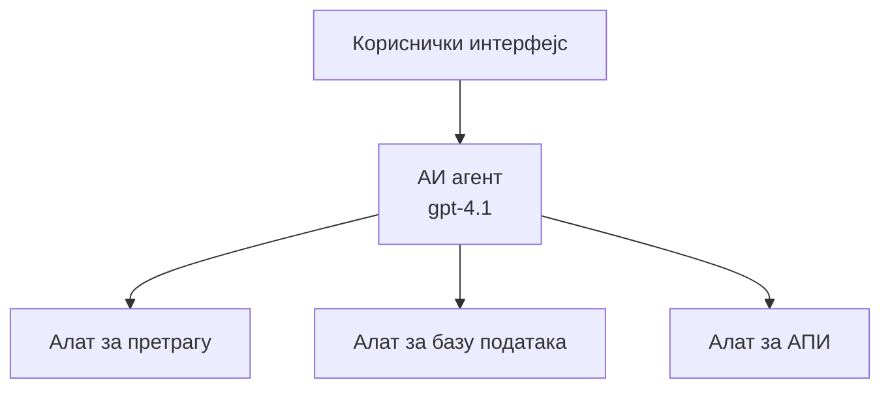
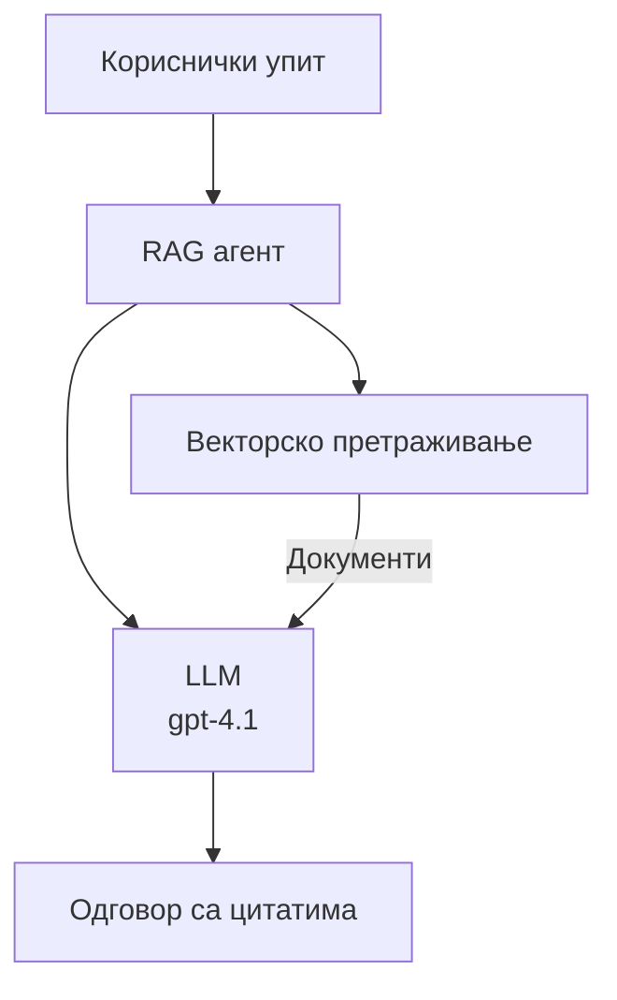
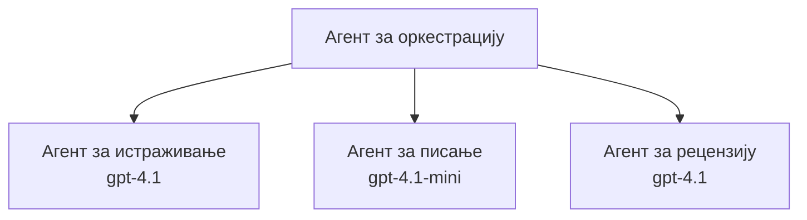

# AI агенти са Azure Developer CLI

**Навигација поглавља:**
- **📚 Почетна курса**: [AZD за почетнике](../../README.md)
- **📖 Тренутно поглавље**: Поглавље 2 - AI-First Development
- **⬅️ Претходно**: [Microsoft Foundry Integration](microsoft-foundry-integration.md)
- **➡️ Следеће**: [AI Model Deployment](ai-model-deployment.md)
- **🚀 Напредно**: [Мулти-агентска решења](../../examples/retail-scenario.md)

---

## Увод

AI агенти су аутономни програми који могу да перципирају своје окружење, доносе одлуке и предузимају радње како би постигли конкретне циљеве. За разлику од једноставних чатботова који одговарају на упите, агенти могу:

- **Користе алате** - Позивају API-је, претражују базе података, извршавају код
- **План и резоновање** - Разлажу комплексне задатке на кораке
- **Учe из контекста** - Одржавају меморију и прилагођавају понашање
- **Сарадња** - Рад са другим агентима (мулти-агентски системи)

Овај водич показује како да распоредите AI агенте на Azure користећи Azure Developer CLI (azd).

> **Напомена о валидацији (2026-03-25):** Овај водич је прегледан у односу на `azd` `1.23.12` и `azure.ai.agents` `0.1.18-preview`. `azd ai` искуство је још увек у прегледној фази, па проверите помоћ екстензије ако се ваши инсталирани флагови разликују.

## Циљеви учења

Након завршетка овог водича, бићете у стању да:
- Разумете шта су AI агенти и како се разликују од чатботова
- Распоредите унапред направљене шаблоне AI агената користећи AZD
- Конфигуришете Foundry агенте за прилагођене агенте
- Имплементирате основне шаблоне за агенте (коришћење алата, RAG, мулти-агент)
- Надгледате и дебагујете распоређене агенте

## Исходи учења

По завршетку, моћи ћете да:
- Распоредите AI агент апликације на Azure једном командом
- Конфигуришете алате и могућности агената
- Имплементирате retrieval-augmented generation (RAG) са агентима
- Дизајнирате мулти-агентске архитектуре за сложене токове рада
- Решавате уобичајене проблеме при распоређивању агената

---

## 🤖 Шта чини агента другачијим у односу на чатбот?

| Особина | Чатбот | AI агент |
|---------|---------|----------|
| **Понашање** | Одговара на упите | Предузима аутономне акције |
| **Алатке** | Нема | Може позивати API-је, претраживати, извршавати код |
| **Меморија** | Само засновано на сесији | Постојана меморија преко сесија |
| **Планирање** | Једнократни одговор | Рazonовање у више корака |
| **Сарадња** | Један ентитет | Може радити са другим агентима |

### Једноставна аналогија

- **Чатбот** = Љубазан човек који одговара на питања на информационом пулту
- **AI агент** = Лични асистент који може да обавља позиве, заказује термине и завршава задатке у ваше име

---

## 🚀 Брзи почетак: Распоредите свог првог агента

### Опција 1: Foundry Agents шаблон (Препоручено)

```bash
# Иницијализујте шаблон агената вештачке интелигенције
azd init --template get-started-with-ai-agents

# Распоредите на Azure
azd up
```

**Шта се распоређује:**
- ✅ Foundry Agents
- ✅ Microsoft Foundry Models (gpt-4.1)
- ✅ Azure AI Search (за RAG)
- ✅ Azure Container Apps (веб интерфејс)
- ✅ Application Insights (надгледање)

**Време:** ~15-20 минута
**Трошак:** ~$100-150/месечно (развојно)

### Опција 2: OpenAI Agent with Prompty

```bash
# Иницијализуј шаблон агента заснован на Prompty
azd init --template agent-openai-python-prompty

# Размешти на Azure
azd up
```

**Шта се распоређује:**
- ✅ Azure Functions (serverless извршавање агента)
- ✅ Microsoft Foundry Models
- ✅ Prompty конфигурациони фајлови
- ✅ Пример имплементације агента

**Време:** ~10-15 минута
**Трошак:** ~$50-100/месечно (развојно)

### Опција 3: RAG Chat Agent

```bash
# Иницијализуј RAG шаблон за ћаскање
azd init --template azure-search-openai-demo

# Распореди на Azure
azd up
```

**Шта се распоређује:**
- ✅ Microsoft Foundry Models
- ✅ Azure AI Search са пример подацима
- ✅ Пайплајн за обраду докумената
- ✅ Чет интерфејс са цитатима

**Време:** ~15-25 минута
**Трошак:** ~$80-150/месечно (развојно)

### Опција 4: AZD AI Agent Init (Preview заснован на манифесту или шаблону)

Ако имате фајл агента манифеста, можете користити команду `azd ai` да иницијализујете Foundry Agent Service пројекат директно. Недавна preview издања такође додају подршку за иницијализацију засновану на шаблонима, тако да се тачан ток упита може мало разликовати у зависности од верзије екстензије коју сте инсталирали.

```bash
# Инсталирајте проширење за AI агенте
azd extension install azure.ai.agents

# Опционо: проверите инсталирану верзију у претпрегледу
azd extension show azure.ai.agents

# Иницијализујте из манифеста агента
azd ai agent init -m agent-manifest.yaml

# Разместите на Azure
azd up

# Тестирајте распоређеног агента (приказује кашњење и време до првог бајта)
azd ai agent invoke
```

**Када користити `azd ai agent init` уместо `azd init --template`:**

| Приступ | Најбоље за | Како ради |
|----------|----------|------|
| `azd init --template` | Почиње од радне пример апликације | Клонира целокупни репо шаблона са кодом и инфраструктуром |
| `azd ai agent init -m` | Изградња из вашег агента манифеста | Скелефолдује структуру пројекта из ваше дефиниције агента |

> **Савет:** Користите `azd init --template` када учите (Опције 1-3 изнад). Користите `azd ai agent init` када градите производне агенте са сопственим манифестима.

Након `azd up`, иста екстензија вас води кроз остатак животног циклуса агента: `azd ai agent invoke` за тестирање, `azd ai agent eval generate` и `azd ai agent optimize` за мерење и побољшање квалитета, и `azd ai agent delete` за чишћење. Видите [AZD AI CLI Commands](../chapter-08-production/production-ai-practices.md#azd-ai-cli-commands-and-extensions) за целу референцу.

---

## 🏗️ Архитектонски обрасци агената

### Образац 1: Један агент са алатима

Најједноставнији образац агента - један агент који може да користи више алата.



**Најпогодније за:**
- Ботове за корисничку подршку
- Истраживачке асистенте
- Агенте за анализу података

**AZD шаблон:** `azure-search-openai-demo`

### Образац 2: RAG агент (Retrieval-Augmented Generation)

Агент који пре генерисања одговора преузима релевантне документе.



**Најпогодније за:**
- Ентерпрајз базе знања
- Системе за питања и одговоре над документима
- Ресерч у области усаглашености и права

**AZD шаблон:** `azure-search-openai-demo`

### Образац 3: Мулти-агентски систем

Више специјализованих агената који сарађују на сложеним задацима.



**Најпогодније за:**
- Сложено генерисање садржаја
- Вишестепене токове рада
- Задатке који захтевају различита експертиза

**Сазнајте више:** [Multi-Agent Coordination Patterns](../chapter-06-pre-deployment/coordination-patterns.md)

---

## ⚙️ Конфигурисање алата агената

Агенти постају моћни када могу да користе алате. Ево како да конфигуришете уобичајене алате:

### Конфигурација алата у Foundry Agents

```python
# агент_конфиг.py
from azure.ai.projects import AIProjectClient
from azure.ai.projects.models import FunctionTool, CodeInterpreterTool

# Дефинишите прилагођене алате
search_tool = FunctionTool(
    name="search_knowledge_base",
    description="Search the company knowledge base for relevant documents",
    parameters={
        "type": "object",
        "properties": {
            "query": {
                "type": "string",
                "description": "The search query"
            }
        },
        "required": ["query"]
    }
)

# Креирајте агента са алаткама
agent = project_client.agents.create_agent(
    model="gpt-4.1",
    name="Support Agent",
    instructions="You are a helpful support agent. Use the search tool to find relevant information.",
    tools=[search_tool, CodeInterpreterTool()]
)
```

### Конфигурација окружења

```bash
# Подесити променљиве окружења специфичне за агента
azd env set AZURE_OPENAI_MODEL "gpt-4.1"
azd env set AGENT_INSTRUCTIONS "You are a helpful assistant..."
azd env set ENABLE_CODE_INTERPRETER "true"
azd env set ENABLE_FILE_SEARCH "true"

# Распоредити са ажурираном конфигурацијом
azd deploy
```

---

## 📊 Надгледање агената

### Интеграција са Application Insights

Сви AZD шаблони агената укључују Application Insights за надгледање:

```bash
# Отворите контролну таблу за надгледање
azd monitor --overview

# Погледајте уживо логове
azd monitor --logs

# Погледајте уживо метрике
azd monitor --live
```

### Кључне метрике које треба пратити

| Метрика | Опис | Циљ |
|--------|-------------|--------|
| Каšnjenje одговора | Време за генерисање одговора | < 5 секунди |
| Коришћење токена | Токени по захтеву | Пратите због трошкова |
| Стопа успешности позива алата | % успешних извршења алата | > 95% |
| Стопа грешака | Неуспели захтеви агента | < 1% |
| Задовољство корисника | Оцене повратних информација | > 4.0/5.0 |

### Прилагођено логовање за агенте

```python
import os
from azure.monitor.opentelemetry import configure_azure_monitor
from opentelemetry import trace

# Конфигуришите Azure Monitor помоћу OpenTelemetry
configure_azure_monitor(
    connection_string=os.environ["APPLICATIONINSIGHTS_CONNECTION_STRING"]
)

tracer = trace.get_tracer(__name__)

def log_agent_interaction(user_query, agent_response, tools_used, latency_ms):
    with tracer.start_as_current_span("agent_interaction") as span:
        span.set_attributes({
            "user_query": user_query,
            "response_length": len(agent_response),
            "tools_used": tools_used,
            "latency_ms": latency_ms
        })
```

> **Напомена:** Инсталирајте потребне пакете: `pip install azure-monitor-opentelemetry opentelemetry`

---

## 💰 Разматрања трошкова

### Процењени месечни трошкови по обрасцу

| Образац | Развојно окружење | Производња |
|---------|-----------------|------------|
| Један агент | $50-100 | $200-500 |
| RAG агент | $80-150 | $300-800 |
| Мулти-агент (2-3 агента) | $150-300 | $500-1,500 |
| Ентерпрајз мулти-агент | $300-500 | $1,500-5,000+ |

### Савети за оптимизацију трошкова

1. **Користите gpt-4.1-mini за једноставне задатке**
   ```bash
   azd env set AZURE_OPENAI_MODEL "gpt-4.1-mini"
   ```

2. **Имплементирајте кеширање за понављане упите**
   ```python
   from functools import lru_cache
   
   @lru_cache(maxsize=1000)
   def get_cached_response(query_hash):
       return agent.run(query_hash)
   ```

3. **Подесите лимите токена по извршавању**
   ```python
   # Подесите max_completion_tokens приликом покретања агента, а не при креирању
   run = project_client.agents.create_run(
       thread_id=thread.id,
       agent_id=agent.id,
       max_completion_tokens=1000  # Ограничите дужину одговора
   )
   ```

4. **Скалирајте на нулу када није у употреби**
   ```bash
   # Container Apps се аутоматски скалирају до нуле
   azd env set MIN_REPLICAS "0"
   ```

---

## 🔧 Решавање проблема са агентима

### Уобичајени проблеми и решења

<details>
<summary><strong>❌ Агент не одговара на позиве алата</strong></summary>

```bash
# Проверите да ли су алати правилно регистровани
azd show

# Проверите распоређивање OpenAI-а
az cognitiveservices account deployment list \
  --name $AZURE_OPENAI_NAME \
  --resource-group $RG_NAME

# Проверите логове агента
azd monitor --logs
```

**Уобичајени узроци:**
- Неусклађеност потписа функције алата
- Недостају потребне дозволе
- API крајња тачка није доступна
</details>

<details>
<summary><strong>❌ Високо кашњење у одговорима агента</strong></summary>

```bash
# Проверите Application Insights због уских грла
azd monitor --live

# Размислите о коришћењу бржег модела
azd env set AZURE_OPENAI_MODEL "gpt-4.1-mini"
azd deploy
```

**Савети за оптимизацију:**
- Користите стриминг одговоре
- Имплементирајте кеширање одговора
- Смањите величину контекстног прозора
</details>

<details>
<summary><strong>❌ Агент враћа нетачне или халиуцинарне информације</strong></summary>

```python
# Побољшати помоћу бољих системских упутстава
instructions = """
You are a helpful assistant. IMPORTANT:
- Only answer based on provided context
- If you don't know, say "I don't know"
- Always cite your sources
- Never make up information
"""

# Додати механизам за претрагу ради утемељења
agent = project_client.agents.create_agent(
    model="gpt-4.1",
    instructions=instructions,
    tools=[FileSearchTool()]  # Утемељити одговоре у документима
)
```
</details>

<details>
<summary><strong>❌ Грешке због прекорачења лимита токена</strong></summary>

```python
# Имплементирајте управљање прозором контекста
def truncate_context(messages, max_tokens=8000, model="gpt-4.1"):
    """Keep only recent messages within token limit."""
    import tiktoken
    encoding = tiktoken.encoding_for_model(model)
    total_tokens = 0
    truncated = []
    
    for msg in reversed(messages):
        msg_tokens = len(encoding.encode(msg.content))
        if total_tokens + msg_tokens > max_tokens:
            break
        truncated.insert(0, msg)
        total_tokens += msg_tokens
    
    return truncated
```
</details>

---

## 🎓 Практични задаци

### Вежба 1: Распоредите основног агента (20 минута)

**Циљ:** Распоредите свог првог AI агента користећи AZD

```bash
# Корак 1: Иницијализујте шаблон
azd init --template get-started-with-ai-agents

# Корак 2: Пријавите се у Azure
azd auth login
# Ако радите са више најамника, додајте --tenant-id <tenant-id>

# Корак 3: Размештите
azd up

# Корак 4: Тестирајте агента
# Очекујани излаз након размештања:
#   Размештање завршено!
#   Крајња тачка: https://<app-name>.<region>.azurecontainerapps.io
# Отворите URL приказан у излазу и покушајте да поставите питање

# Корак 5: Погледајте мониторинг
azd monitor --overview

# Корак 6: Очистите
azd down --force --purge
```

**Критеријуми успеха:**
- [ ] Агент одговара на питања
- [ ] Може приступити контрольној табли надгледања преко `azd monitor`
- [ ] Ресурси успешно очишћени

### Вежба 2: Додајте прилагођени алат (30 минута)

**Циљ:** Проширите агента прилагођеним алатом

1. Распоредите шаблон агента:
   ```bash
   azd init --template get-started-with-ai-agents
   azd up
   ```
2. Направите нову функцију алата у коду вашег агента:
   ```python
   def get_weather(location: str) -> str:
       """Get current weather for a location."""
       # API позив сервису за временску прогнозу
       return f"Weather in {location}: Sunny, 72°F"
   ```
3. Региструјте алат са агентом:
   ```python
   from azure.ai.projects.models import FunctionTool

   weather_tool = FunctionTool(
       name="get_weather",
       description="Get current weather for a location",
       parameters={
           "type": "object",
           "properties": {
               "location": {"type": "string", "description": "City name"}
           },
           "required": ["location"]
       }
   )

   agent = project_client.agents.create_agent(
       model="gpt-4.1",
       name="Weather Agent",
       tools=[weather_tool]
   )
   ```
4. Поново распоредите и тестирате:
   ```bash
   azd deploy
   # Питајте: "Какво је време у Сијетлу?"
   # Очекује се: Агент позива get_weather("Seattle") и враћа информације о времену
   ```

**Критеријуми успеха:**
- [ ] Агент препознаје упите везане за временску прогнозу
- [ ] Алат се позива правилно
- [ ] Одговор садржи информације о времену

### Вежба 3: Изградите RAG агента (45 минута)

**Циљ:** Направите агента који одговара на питања из ваших докумената

```bash
# Корак 1: Разместите RAG шаблон
azd init --template azure-search-openai-demo
azd up

# Корак 2: Отпремите своје документе
# Ставите PDF/TXT датотеке у директоријум data/, затим покрените:
python scripts/prepdocs.py

# Корак 3: Тестирајте са питањима специфичним за домен
# Отворите URL веб апликације који је приказан у излазу 'azd up'
# Питајте о вашим отпремљеним документима
# Одговори треба да укључују референце за цитирање попут [doc.pdf]
```

**Критеријуми успеха:**
- [ ] Агент одговара из отпремљених докумената
- [ ] Одговори садрже цитате
- [ ] Нема халицинација за питања изван опсега

---

## 📚 Следећи кораци

Сада када разумете AI агенте, истражите ове напредне теме:

| Тема | Опис | Линк |
|-------|-------------|------|
| **Мулти-агентски системи** | Изградите системе са више сарађујућих агената | [Retail Multi-Agent Example](../../examples/retail-scenario.md) |
| **Обрасци оркестрације** | Научите обрасце оркестрације и комуникације | [Coordination Patterns](../chapter-06-pre-deployment/coordination-patterns.md) |
| **Продукционо распоредење** | Распоређивање агената спремно за ентерпрајз | [Production AI Practices](../chapter-08-production/production-ai-practices.md) |
| **Евалуација агената** | Тестирајте и евалуирајте перформансе агената | [AI Troubleshooting](../chapter-07-troubleshooting/ai-troubleshooting.md) |
| **AI Workshop Lab** | Практично: Припремите своје AI решење за AZD | [AI Workshop Lab](ai-workshop-lab.md) |

---

## 📖 Допунски ресурси

### Званична документација
- [Microsoft Foundry Agent Service](https://learn.microsoft.com/azure/ai-services/agents/)
- [Microsoft Foundry Agent Service Quickstart](https://learn.microsoft.com/azure/ai-services/agents/quickstart)
- [Semantic Kernel Agent Framework](https://learn.microsoft.com/semantic-kernel/)

### AZD шаблони за агенте
- [Get Started with AI Agents](https://github.com/Azure-Samples/get-started-with-ai-agents)
- [Agent OpenAI Python Prompty](https://github.com/Azure-Samples/agent-openai-python-prompty)
- [Azure Search OpenAI Demo](https://github.com/Azure-Samples/azure-search-openai-demo)

### Заједнички ресурси
- [Awesome AZD - Agent Templates](https://azure.github.io/awesome-azd/?tags=ai-agents)
- [Azure AI Discord](https://discord.gg/microsoft-azure)
- [Microsoft Foundry Discord](https://discord.gg/nTYy5BXMWG)

### Вештине агената за ваш уређивач
- [**Microsoft Azure Agent Skills**](https://skills.sh/microsoft/github-copilot-for-azure) - Инсталирајте поновно употребљиве вештине AI агената за Azure развој у GitHub Copilot, Cursor или било ком подржаном агенту. Укључује вештине за [Azure AI](https://skills.sh/microsoft/github-copilot-for-azure/azure-ai), [Microsoft Foundry](https://skills.sh/microsoft/github-copilot-for-azure/microsoft-foundry), [deployment](https://skills.sh/microsoft/github-copilot-for-azure/azure-deploy), и [diagnostics](https://skills.sh/microsoft/github-copilot-for-azure/azure-diagnostics):
  ```bash
  npx skills add microsoft/github-copilot-for-azure
  ```

---

**Навигација**
- **Претходна лекција**: [Microsoft Foundry Integration](microsoft-foundry-integration.md)
- **Следећа лекција**: [AI Model Deployment](ai-model-deployment.md)

---

<!-- CO-OP TRANSLATOR DISCLAIMER START -->
**Изјава о одрицању одговорности**:
Овај документ је преведен коришћењем услуге за аутоматски превод [Co-op Translator](https://github.com/Azure/co-op-translator). Иако тежимо тачности, имајте у виду да аутоматски преводи могу садржати грешке или нетачности. Оригинални документ на његовом изворном језику треба сматрати ауторитативним извором. За критичне информације препоручује се професионални људски превод. Нисмо одговорни за било каква неспоразума или погрешна тумачења која произилазе из коришћења овог превода.
<!-- CO-OP TRANSLATOR DISCLAIMER END -->