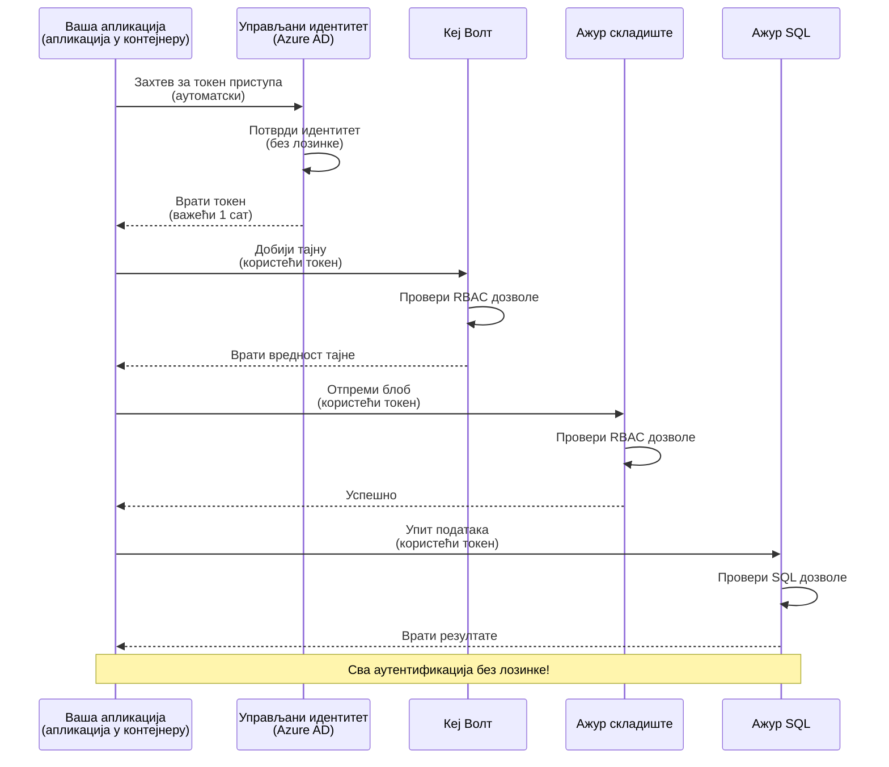
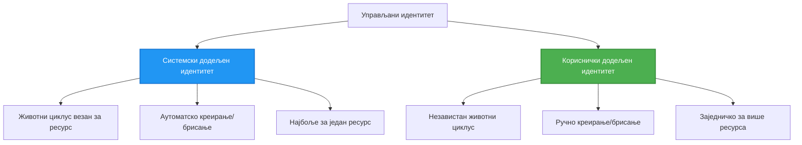

# Обрасци аутентикације и управљани идентитет

⏱️ **Процењено време**: 45-60 минута | 💰 **Утицај на трошкове**: Бесплатно (без додатних накнада) | ⭐ **Комплексност**: Средњи

**📚 Пут учења:**
- ← Претходно: [Управљање конфигурацијом](configuration.md) - Управљање променљивим окружења и тајнама
- 🎯 **Тренутно:** Аутентификација и безбедност (управљани идентитет, Key Vault, безбедни обрасци)
- → Следеће: [Први пројекат](first-project.md) - Израдите своју прву AZD апликацију
- 🏠 [Почетна курса](../../README.md)

---

## Шта ћете научити

Попуњавањем ове лекције ћете:
- Разумети Azure обрасце аутентификације (кључеви, connection strings, управљани идентитет)
- Имплементирати **управљани идентитет** за аутентификацију без лозинки
- Заштитити тајне интеграцијом са **Azure Key Vault**
- Конфигурисати **контролу приступа засновану на улогама (RBAC)** за AZD размештања
- Примeнити најбоље безбедносне праксе у Container Apps и Azure сервисима
- Мигрирати са аутентикације засноване на кључу на аутентификацију засновану на идентитету

## Зашто је управљани идентитет важан

### Проблем: Традиционална аутентификација

**Пре управљаног идентитета:**
```javascript
// ❌ РИЗИК БЕЗБЕДНОСТИ: Тврдо уграђене тајне у коду
const connectionString = "Server=mydb.database.windows.net;User=admin;Password=P@ssw0rd123";
const storageKey = "xK7mN9pQ2wR5tY8uI0oP3aS6dF1gH4jK...";
const cosmosKey = "C2x7B9n4M1p8Q5w3E6r0T2y5U8i1O4p7...";
```

**Проблеми:**
- 🔴 **Изложене тајне** у коду, конфигурационим фајловима, променљивим окружењима
- 🔴 **Ротација креденцијала** захтева измене кода и поновно распоређивање
- 🔴 **Ноћне море за ревизију** - ко је приступио чему и када?
- 🔴 **Распростирање** - тајне расуте по више система
- 🔴 **Ризици усклађености** - не прође безбедносне ревизије

### Решење: Управљани идентитет

**После управљаног идентитета:**
```javascript
// ✅ СИГУРНО: Нема тајни у коду
const credential = new DefaultAzureCredential();
const client = new BlobServiceClient(
  "https://mystorageaccount.blob.core.windows.net",
  credential  // Azure аутоматски управља аутентификацијом
);
```

**Предности:**
- ✅ **Нема тајни** у коду или конфигурацији
- ✅ **Аутоматска ротација** - Azure то обрађује
- ✅ **Потпун траг ревизије** у Azure AD логовима
- ✅ **Централизована безбедност** - управљање у Azure порталу
- ✅ **Спремно за усклађеност** - испуњава безбедносне стандарде

**Аналогија**: Традиционална аутентификација је као ношење више физичких кључева за различита врата. Управљани идентитет је као сигурносна пропусница која аутоматски даје приступ на основу тога ко сте — нема кључева које можете изгубити, копирати или ротирати.

---

## Преглед архитектуре

### Ток аутентификације са управљаним идентитетом


### Типови управљаних идентитета


| Карактеристика | System-Assigned | User-Assigned |
|---------|----------------|---------------|
| **Животни циклус** | Повезан са ресурсом | Независан |
| **Креирање** | Аутоматски са ресурсом | Ручно креирање |
| **Брисање** | Брише се са ресурсом | Опстаје након брисања ресурса |
| **Дељење** | Само један ресурс | Више ресурса |
| **Случај употребе** | Једноставни сценарији | Комплексни сценарији са више ресурса |
| **AZD подразумевано** | ✅ Препоручено | Опционо |

---

## Претпоставке

### Потребни алати

Требало би да већ имате ово инсталирано из претходних лекција:

```bash
# Проверите Azure Developer CLI
azd version
# ✅ Очекује се: azd верзија 1.0.0 или новија

# Проверите Azure CLI
az --version
# ✅ Очекује се: azure-cli верзија 2.50.0 или новија
```

### Захтеви за Azure

- Активна Azure претплата
- Дозволе за:
  - Креирање управљаних идентитета
  - Додељивање RBAC улога
  - Креирање Key Vault ресурса
  - Размештање Container Apps

### Потребно предзнање

Требало би да сте завршили:
- [Водич за инсталацију](installation.md) - AZD подешавање
- [Основе AZD](azd-basics.md) - Основни концепти
- [Управљање конфигурацијом](configuration.md) - Променљиве окружења

---

## Лекција 1: Разумевање образаца аутентификације

### Образац 1: Connection Strings (застарело - избегавајте)

**Како функционише:**
```bash
# Конекцијски низ садржи приступне податке
STORAGE_CONNECTION_STRING="DefaultEndpointsProtocol=https;AccountName=myaccount;AccountKey=xK7mN9pQ2wR5..."
COSMOS_CONNECTION_STRING="AccountEndpoint=https://myaccount.documents.azure.com:443/;AccountKey=C2x7..."
SQL_CONNECTION_STRING="Server=myserver.database.windows.net;User=admin;Password=P@ssw0rd..."
```

**Проблеми:**
- ❌ Тајне видљиве у променљивим окружењима
- ❌ Записује се у логовима система за распоређивање
- ❌ Тешко за ротирање
- ❌ Нема трага ревизије приступа

**Када користити:** Само за локални развој, никада у продукцији.

---

### Образац 2: Референце Key Vault-а (боље)

**Како функционише:**
```bicep
// Store secret in Key Vault
resource keyVault 'Microsoft.KeyVault/vaults@2023-02-01' = {
  name: 'mykv'
  properties: {
    enableRbacAuthorization: true
  }
}

// Reference in Container App
env: [
  {
    name: 'STORAGE_KEY'
    secretRef: 'storage-key'  // References Key Vault
  }
]
```

**Предности:**
- ✅ Тајне безбедно складиштене у Key Vault-у
- ✅ Централизовано управљање тајнама
- ✅ Ротација без измена кода

**Ограничења:**
- ⚠️ И даље се користе кључеви/лозинке
- ⚠️ Потребно је управљати приступом Key Vault-у

**Када користити:** Прелазни корак од connection strings ка управљаном идентитету.

---

### Образац 3: Управљани идентитет (најбоља пракса)

**Како функционише:**
```bicep
// Enable managed identity
resource containerApp 'Microsoft.App/containerApps@2023-05-01' = {
  name: 'myapp'
  identity: {
    type: 'SystemAssigned'  // Automatically creates identity
  }
}

// Grant permissions
resource roleAssignment 'Microsoft.Authorization/roleAssignments@2022-04-01' = {
  scope: storageAccount
  properties: {
    roleDefinitionId: storageBlobDataContributorRole
    principalId: containerApp.identity.principalId
  }
}
```

**Код апликације:**
```javascript
// Нема потребе за тајнама!
const { DefaultAzureCredential } = require('@azure/identity');
const { BlobServiceClient } = require('@azure/storage-blob');

const credential = new DefaultAzureCredential();
const blobServiceClient = new BlobServiceClient(
  'https://mystorageaccount.blob.core.windows.net',
  credential
);
```

**Предности:**
- ✅ Нема тајни у коду/конфигурацији
- ✅ Аутоматска ротација креденцијала
- ✅ Потпун траг ревизије
- ✅ Дозволе засноване на RBAC
- ✅ Спремно за усклађеност

**Када користити:** Увек, за продукцијске апликације.

---

## Лекција 2: Имплементација управљаног идентитета са AZD

### Имплементација корак по корак

Хајде да направимо безбедан Container App који користи управљани идентитет за приступ Azure Storage-у и Key Vault-у.

### Структура пројекта

```
secure-app/
├── azure.yaml                 # AZD configuration
├── infra/
│   ├── main.bicep            # Main infrastructure
│   ├── core/
│   │   ├── identity.bicep    # Managed identity setup
│   │   ├── keyvault.bicep    # Key Vault configuration
│   │   └── storage.bicep     # Storage with RBAC
│   └── app/
│       └── container-app.bicep
└── src/
    ├── app.js                # Application code
    ├── package.json
    └── Dockerfile
```

### 1. Конфигуришите AZD (azure.yaml)

```yaml
name: secure-app
metadata:
  template: secure-app@1.0.0

services:
  api:
    project: ./src
    language: js
    host: containerapp

# Enable managed identity (AZD handles this automatically)
```

### 2. Инфраструктура: Омогућите управљани идентитет

**Фајл: `infra/main.bicep`**

```bicep
targetScope = 'subscription'

param environmentName string
param location string = 'eastus'

var tags = { 'azd-env-name': environmentName }

// Resource group
resource rg 'Microsoft.Resources/resourceGroups@2021-04-01' = {
  name: 'rg-${environmentName}'
  location: location
  tags: tags
}

// Storage Account
module storage './core/storage.bicep' = {
  name: 'storage'
  scope: rg
  params: {
    name: 'st${uniqueString(rg.id)}'
    location: location
    tags: tags
  }
}

// Key Vault
module keyVault './core/keyvault.bicep' = {
  name: 'keyvault'
  scope: rg
  params: {
    name: 'kv-${uniqueString(rg.id)}'
    location: location
    tags: tags
  }
}

// Container App with Managed Identity
module containerApp './app/container-app.bicep' = {
  name: 'container-app'
  scope: rg
  params: {
    name: 'ca-${environmentName}'
    location: location
    tags: tags
    storageAccountName: storage.outputs.name
    keyVaultName: keyVault.outputs.name
  }
}

// Grant Container App access to Storage
module storageRoleAssignment './core/role-assignment.bicep' = {
  name: 'storage-role'
  scope: rg
  params: {
    principalId: containerApp.outputs.identityPrincipalId
    roleDefinitionId: 'ba92f5b4-2d11-453d-a403-e96b0029c9fe'  // Storage Blob Data Contributor
    targetResourceId: storage.outputs.id
  }
}

// Grant Container App access to Key Vault
module kvRoleAssignment './core/role-assignment.bicep' = {
  name: 'kv-role'
  scope: rg
  params: {
    principalId: containerApp.outputs.identityPrincipalId
    roleDefinitionId: '4633458b-17de-408a-b874-0445c86b69e6'  // Key Vault Secrets User
    targetResourceId: keyVault.outputs.id
  }
}

// Outputs
output AZURE_STORAGE_ACCOUNT_NAME string = storage.outputs.name
output AZURE_KEY_VAULT_NAME string = keyVault.outputs.name
output APP_URL string = containerApp.outputs.url
```

### 3. Container App са System-Assigned идентитетом

**Фајл: `infra/app/container-app.bicep`**

```bicep
param name string
param location string
param tags object = {}
param storageAccountName string
param keyVaultName string

resource containerApp 'Microsoft.App/containerApps@2023-05-01' = {
  name: name
  location: location
  tags: tags
  identity: {
    type: 'SystemAssigned'  // 🔑 Enable managed identity
  }
  properties: {
    configuration: {
      ingress: {
        external: true
        targetPort: 3000
      }
    }
    template: {
      containers: [
        {
          name: 'api'
          image: 'myregistry.azurecr.io/api:latest'
          resources: {
            cpu: json('0.5')
            memory: '1Gi'
          }
          env: [
            {
              name: 'AZURE_STORAGE_ACCOUNT_NAME'
              value: storageAccountName
            }
            {
              name: 'AZURE_KEY_VAULT_NAME'
              value: keyVaultName
            }
            // 🔑 No secrets - managed identity handles authentication!
          ]
        }
      ]
    }
  }
}

// Output the identity for RBAC assignments
output identityPrincipalId string = containerApp.identity.principalId
output id string = containerApp.id
output url string = 'https://${containerApp.properties.configuration.ingress.fqdn}'
```

### 4. Модул за доделу RBAC улога

**Фајл: `infra/core/role-assignment.bicep`**

```bicep
param principalId string
param roleDefinitionId string  // Azure built-in role ID
param targetResourceId string

resource roleAssignment 'Microsoft.Authorization/roleAssignments@2022-04-01' = {
  name: guid(principalId, roleDefinitionId, targetResourceId)
  scope: resourceId('Microsoft.Resources/resourceGroups', resourceGroup().name)
  properties: {
    roleDefinitionId: subscriptionResourceId('Microsoft.Authorization/roleDefinitions', roleDefinitionId)
    principalId: principalId
    principalType: 'ServicePrincipal'
  }
}

output id string = roleAssignment.id
```

### 5. Код апликације са управљаним идентитетом

**Фајл: `src/app.js`**

```javascript
const express = require('express');
const { DefaultAzureCredential } = require('@azure/identity');
const { BlobServiceClient } = require('@azure/storage-blob');
const { SecretClient } = require('@azure/keyvault-secrets');

const app = express();
const PORT = process.env.PORT || 3000;

// 🔑 Иницијализујте креденцијал (ради аутоматски са управљеним идентитетом)
const credential = new DefaultAzureCredential();

// Подешавање Azure Storage-а
const storageAccountName = process.env.AZURE_STORAGE_ACCOUNT_NAME;
const blobServiceClient = new BlobServiceClient(
  `https://${storageAccountName}.blob.core.windows.net`,
  credential  // Кључеви нису потребни!
);

// Подешавање Key Vault-а
const keyVaultName = process.env.AZURE_KEY_VAULT_NAME;
const secretClient = new SecretClient(
  `https://${keyVaultName}.vault.azure.net`,
  credential  // Кључеви нису потребни!
);

// Провера здравља
app.get('/health', (req, res) => {
  res.json({ status: 'healthy', authentication: 'managed-identity' });
});

// Отпремите датотеку у Blob складиште
app.post('/upload', async (req, res) => {
  try {
    const containerClient = blobServiceClient.getContainerClient('uploads');
    await containerClient.createIfNotExists();
    
    const blobName = `file-${Date.now()}.txt`;
    const blockBlobClient = containerClient.getBlockBlobClient(blobName);
    
    await blockBlobClient.upload('Hello from managed identity!', 30);
    
    res.json({
      success: true,
      blobName: blobName,
      message: 'File uploaded using managed identity!'
    });
  } catch (error) {
    console.error('Upload error:', error);
    res.status(500).json({ error: error.message });
  }
});

// Добијте тајну из Key Vault-а
app.get('/secret/:name', async (req, res) => {
  try {
    const secretName = req.params.name;
    const secret = await secretClient.getSecret(secretName);
    
    res.json({
      name: secretName,
      value: secret.value,
      message: 'Secret retrieved using managed identity!'
    });
  } catch (error) {
    console.error('Secret error:', error);
    res.status(500).json({ error: error.message });
  }
});

// Листај blob контејнере (показује приступ за читање)
app.get('/containers', async (req, res) => {
  try {
    const containers = [];
    for await (const container of blobServiceClient.listContainers()) {
      containers.push(container.name);
    }
    
    res.json({
      containers: containers,
      count: containers.length,
      message: 'Containers listed using managed identity!'
    });
  } catch (error) {
    console.error('List error:', error);
    res.status(500).json({ error: error.message });
  }
});

app.listen(PORT, () => {
  console.log(`Secure API listening on port ${PORT}`);
  console.log('Authentication: Managed Identity (passwordless)');
});
```

**Фајл: `src/package.json`**

```json
{
  "name": "secure-app",
  "version": "1.0.0",
  "dependencies": {
    "express": "^4.18.2",
    "@azure/identity": "^4.0.0",
    "@azure/storage-blob": "^12.17.0",
    "@azure/keyvault-secrets": "^4.7.0"
  },
  "scripts": {
    "start": "node app.js"
  }
}
```

### 6. Размештање и тестирање

```bash
# Иницијализујте AZD окружење
azd init

# Размештите инфраструктуру и апликацију
azd up

# Добијте URL апликације
APP_URL=$(azd env get-values | grep APP_URL | cut -d '=' -f2 | tr -d '"')

# Тестирајте проверу здравља
curl $APP_URL/health
```

**✅ Очекивани излаз:**
```json
{
  "status": "healthy",
  "authentication": "managed-identity"
}
```

**Тест: отпремање блоба:**
```bash
curl -X POST $APP_URL/upload
```

**✅ Очекивани излаз:**
```json
{
  "success": true,
  "blobName": "file-1700404800000.txt",
  "message": "File uploaded using managed identity!"
}
```

**Тест: листа контејнера:**
```bash
curl $APP_URL/containers
```

**✅ Очекивани излаз:**
```json
{
  "containers": ["uploads"],
  "count": 1,
  "message": "Containers listed using managed identity!"
}
```

---

## Уобичајене Azure RBAC улоге

### Уграђени ID-јеви улога за управљани идентитет

| Сервис | Назив улоге | ИД улоге | Дозволе |
|---------|-----------|---------|-------------|
| **Storage** | Storage Blob Data Reader | `2a2b9908-6b94-4a3d-8e5a-a7d8f8cc8a12` | Читање блобова и контејнера |
| **Storage** | Storage Blob Data Contributor | `ba92f5b4-2d11-453d-a403-e96b0029c9fe` | Читање, писање, брисање блобова |
| **Storage** | Storage Queue Data Contributor | `974c5e8b-45b9-4653-ba55-5f855dd0fb88` | Читање, писање, брисање порука у реду |
| **Key Vault** | Key Vault Secrets User | `4633458b-17de-408a-b874-0445c86b69e6` | Читање тајни |
| **Key Vault** | Key Vault Secrets Officer | `b86a8fe4-44ce-4948-aee5-eccb2c155cd7` | Читање, писање, брисање тајни |
| **Cosmos DB** | Cosmos DB Built-in Data Reader | `00000000-0000-0000-0000-000000000001` | Читање података у Cosmos DB |
| **Cosmos DB** | Cosmos DB Built-in Data Contributor | `00000000-0000-0000-0000-000000000002` | Читање, писање података у Cosmos DB |
| **SQL Database** | SQL DB Contributor | `9b7fa17d-e63e-47b0-bb0a-15c516ac86ec` | Управљање SQL базама података |
| **Service Bus** | Azure Service Bus Data Owner | `090c5cfd-751d-490a-894a-3ce6f1109419` | Слање, примање и управљање порукама |

### Како пронаћи ID-јеве улога

```bash
# Прикажи све уграђене улоге
az role definition list --query "[].{Name:roleName, ID:name}" --output table

# Претражи одређену улогу
az role definition list --query "[?contains(roleName, 'Storage Blob')].{Name:roleName, ID:name}" --output table

# Добиј детаље улоге
az role definition list --name "Storage Blob Data Contributor"
```

---

## Практични задаци

### Вежба 1: Омогућите управљани идентитет за постојећу апликацију ⭐⭐ (Средње)

**Циљ**: Додајте управљани идентитет постојећем Container App размештању

**Сценарио**: Имате Container App који користи connection strings. Конвертујте га у управљани идентитет.

**Почетна тачка**: Container App са овом конфигурацијом:

```bicep
// ❌ Current: Using connection string
env: [
  {
    name: 'STORAGE_CONNECTION_STRING'
    secretRef: 'storage-connection'
  }
]
```

**Кораци**:

1. **Омогућите управљани идентитет у Bicep:**

```bicep
resource containerApp 'Microsoft.App/containerApps@2023-05-01' = {
  name: 'myapp'
  identity: {
    type: 'SystemAssigned'  // Add this
  }
  // ... rest of configuration
}
```

2. **Додајте приступ Storage-у:**

```bicep
// Get storage account reference
resource storageAccount 'Microsoft.Storage/storageAccounts@2023-01-01' existing = {
  name: storageAccountName
}

// Assign role
resource roleAssignment 'Microsoft.Authorization/roleAssignments@2022-04-01' = {
  name: guid(containerApp.id, 'ba92f5b4-2d11-453d-a403-e96b0029c9fe', storageAccount.id)
  scope: storageAccount
  properties: {
    roleDefinitionId: subscriptionResourceId('Microsoft.Authorization/roleDefinitions', 'ba92f5b4-2d11-453d-a403-e96b0029c9fe')
    principalId: containerApp.identity.principalId
    principalType: 'ServicePrincipal'
  }
}
```

3. **Ажурирајте код апликације:**

**Пре (connection string):**
```javascript
const { BlobServiceClient } = require('@azure/storage-blob');

const blobServiceClient = BlobServiceClient.fromConnectionString(
  process.env.STORAGE_CONNECTION_STRING
);
```

**После (управљани идентитет):**
```javascript
const { DefaultAzureCredential } = require('@azure/identity');
const { BlobServiceClient } = require('@azure/storage-blob');

const credential = new DefaultAzureCredential();
const blobServiceClient = new BlobServiceClient(
  `https://${process.env.STORAGE_ACCOUNT_NAME}.blob.core.windows.net`,
  credential
);
```

4. **Ажурирајте променљиве окружења:**

```bicep
env: [
  {
    name: 'STORAGE_ACCOUNT_NAME'
    value: storageAccountName  // Just the name, no secrets!
  }
  // Remove STORAGE_CONNECTION_STRING
]
```

5. **Размештање и тестирање:**

```bash
# Поново распоредити
azd up

# Проверити да ли и даље ради
curl https://myapp.azurecontainerapps.io/upload
```

**✅ Критеријуми успеха:**
- ✅ Апликација се размешта без грешака
- ✅ Операције над Storage-ом функционишу (отпремање, листање, преузимање)
- ✅ Нема connection strings у променљивим окружења
- ✅ Идентитет видљив у Azure порталу под картицом "Identity"

**Верификација:**

```bash
# Проверите да ли је управљани идентитет омогућен
az containerapp show \
  --name myapp \
  --resource-group rg-myapp \
  --query "identity.type"
# ✅ Очекује се: "SystemAssigned"

# Проверите доделу улога
az role assignment list \
  --assignee $(az containerapp show --name myapp --resource-group rg-myapp --query "identity.principalId" -o tsv) \
  --scope /subscriptions/{sub-id}/resourceGroups/rg-myapp/providers/Microsoft.Storage/storageAccounts/mystorageaccount
# ✅ Очекује се: Приказује улогу "Storage Blob Data Contributor"
```

**Време**: 20-30 минута

---

### Вежба 2: Приступ више сервиса са User-Assigned идентитетом ⭐⭐⭐ (Напредно)

**Циљ**: Креирајте user-assigned идентитет који се дели између више Container App-ова

**Сценарио**: Имате 3 микросервиса којима је свима потребан приступ истом Storage налогу и Key Vault-у.

**Кораци**:

1. **Креирајте user-assigned идентитет:**

**Фајл: `infra/core/identity.bicep`**

```bicep
param name string
param location string
param tags object = {}

resource userAssignedIdentity 'Microsoft.ManagedIdentity/userAssignedIdentities@2023-01-31' = {
  name: name
  location: location
  tags: tags
}

output id string = userAssignedIdentity.id
output principalId string = userAssignedIdentity.properties.principalId
output clientId string = userAssignedIdentity.properties.clientId
```

2. **Доделите улоге user-assigned идентитету:**

```bicep
// In main.bicep
module userIdentity './core/identity.bicep' = {
  name: 'user-identity'
  scope: rg
  params: {
    name: 'id-${environmentName}'
    location: location
    tags: tags
  }
}

// Grant Storage access
resource storageRoleAssignment 'Microsoft.Authorization/roleAssignments@2022-04-01' = {
  name: guid(userIdentity.outputs.principalId, 'storage-contributor')
  scope: storageAccount
  properties: {
    roleDefinitionId: subscriptionResourceId('Microsoft.Authorization/roleDefinitions', 'ba92f5b4-2d11-453d-a403-e96b0029c9fe')
    principalId: userIdentity.outputs.principalId
    principalType: 'ServicePrincipal'
  }
}

// Grant Key Vault access
resource kvRoleAssignment 'Microsoft.Authorization/roleAssignments@2022-04-01' = {
  name: guid(userIdentity.outputs.principalId, 'kv-secrets-user')
  scope: keyVault
  properties: {
    roleDefinitionId: subscriptionResourceId('Microsoft.Authorization/roleDefinitions', '4633458b-17de-408a-b874-0445c86b69e6')
    principalId: userIdentity.outputs.principalId
    principalType: 'ServicePrincipal'
  }
}
```

3. **Доделите идентитет више Container App-овима:**

```bicep
resource apiGateway 'Microsoft.App/containerApps@2023-05-01' = {
  name: 'api-gateway'
  identity: {
    type: 'UserAssigned'
    userAssignedIdentities: {
      '${userIdentity.outputs.id}': {}
    }
  }
  // ... rest of config
}

resource productService 'Microsoft.App/containerApps@2023-05-01' = {
  name: 'product-service'
  identity: {
    type: 'UserAssigned'
    userAssignedIdentities: {
      '${userIdentity.outputs.id}': {}
    }
  }
  // ... rest of config
}

resource orderService 'Microsoft.App/containerApps@2023-05-01' = {
  name: 'order-service'
  identity: {
    type: 'UserAssigned'
    userAssignedIdentities: {
      '${userIdentity.outputs.id}': {}
    }
  }
  // ... rest of config
}
```

4. **Код апликације (сви сервиси користе исти образац):**

```javascript
const { DefaultAzureCredential, ManagedIdentityCredential } = require('@azure/identity');

// За кориснички додељени идентитет, наведите ИД клијента
const credential = new ManagedIdentityCredential(
  process.env.AZURE_CLIENT_ID  // ИД клијента кориснички додељеног идентитета
);

// Или користите DefaultAzureCredential (аутоматски открива)
const credential = new DefaultAzureCredential();

const blobServiceClient = new BlobServiceClient(
  `https://${process.env.STORAGE_ACCOUNT_NAME}.blob.core.windows.net`,
  credential
);
```

5. **Размештање и верификација:**

```bash
azd up

# Проверити да ли све услуге могу да приступе складишту
curl https://api-gateway.azurecontainerapps.io/upload
curl https://product-service.azurecontainerapps.io/upload
curl https://order-service.azurecontainerapps.io/upload
```

**✅ Критеријуми успеха:**
- ✅ Један идентитет који деле 3 сервиса
- ✅ Сви сервиси могу да приступе Storage-у и Key Vault-у
- ✅ Идентитет опстаје ако обришете један сервис
- ✅ Централизовано управљање дозволама

**Предности user-assigned идентитета:**
- Један идентитет за управљање
- Конзистентне дозволе међу сервисима
- Опстаје након брисања сервиса
- Боље за комплексну архитектуру

**Време**: 30-40 минута

---

### Вежба 3: Имплементација ротације тајни у Key Vault-у ⭐⭐⭐ (Напредно)

**Циљ**: Складиштите API кључеве трећих страна у Key Vault-у и приступајте им користећи управљани идентитет

**Сценарио**: Ваша апликација треба да позове екстерни API (OpenAI, Stripe, SendGrid) који захтева API кључеве.

**Кораци**:

1. **Креирајте Key Vault са RBAC-ом:**

**Фајл: `infra/core/keyvault.bicep`**

```bicep
param name string
param location string
param tags object = {}

resource keyVault 'Microsoft.KeyVault/vaults@2023-02-01' = {
  name: name
  location: location
  tags: tags
  properties: {
    enableRbacAuthorization: true  // Use RBAC instead of access policies
    sku: {
      family: 'A'
      name: 'standard'
    }
    tenantId: subscription().tenantId
    enableSoftDelete: true
    softDeleteRetentionInDays: 90
  }
}

// Allow Container App to read secrets
output id string = keyVault.id
output name string = keyVault.name
output uri string = keyVault.properties.vaultUri
```

2. **Сачувајте тајне у Key Vault-у:**

```bash
# Добијте име Key Vault-а
KV_NAME=$(azd env get-values | grep AZURE_KEY_VAULT_NAME | cut -d '=' -f2 | tr -d '"')

# Сачувајте API кључеве трећих страна
az keyvault secret set \
  --vault-name $KV_NAME \
  --name "OpenAI-ApiKey" \
  --value "sk-proj-xxxxxxxxxxxxx"

az keyvault secret set \
  --vault-name $KV_NAME \
  --name "Stripe-ApiKey" \
  --value "sk_live_xxxxxxxxxxxxx"

az keyvault secret set \
  --vault-name $KV_NAME \
  --name "SendGrid-ApiKey" \
  --value "SG.xxxxxxxxxxxxx"
```

3. **Код апликације за преузимање тајни:**

**Фајл: `src/config.js`**

```javascript
const { DefaultAzureCredential } = require('@azure/identity');
const { SecretClient } = require('@azure/keyvault-secrets');

class Config {
  constructor() {
    this.credential = new DefaultAzureCredential();
    this.secretClient = new SecretClient(
      `https://${process.env.AZURE_KEY_VAULT_NAME}.vault.azure.net`,
      this.credential
    );
    this.cache = {};
  }

  async getSecret(secretName) {
    // Прво провери кеш
    if (this.cache[secretName]) {
      return this.cache[secretName];
    }

    try {
      const secret = await this.secretClient.getSecret(secretName);
      this.cache[secretName] = secret.value;
      console.log(`✅ Retrieved secret: ${secretName}`);
      return secret.value;
    } catch (error) {
      console.error(`❌ Failed to get secret ${secretName}:`, error.message);
      throw error;
    }
  }

  async getOpenAIKey() {
    return this.getSecret('OpenAI-ApiKey');
  }

  async getStripeKey() {
    return this.getSecret('Stripe-ApiKey');
  }

  async getSendGridKey() {
    return this.getSecret('SendGrid-ApiKey');
  }
}

module.exports = new Config();
```

4. **Користите тајне у апликацији:**

**Фајл: `src/app.js`**

```javascript
const express = require('express');
const config = require('./config');
const { OpenAI } = require('openai');

const app = express();

// Иницијализујте OpenAI помоћу кључа из Key Vault-а
let openaiClient;

async function initializeServices() {
  const openaiKey = await config.getOpenAIKey();
  openaiClient = new OpenAI({ apiKey: openaiKey });
  console.log('✅ Services initialized with secrets from Key Vault');
}

// Позовите при покретању
initializeServices().catch(console.error);

app.post('/chat', async (req, res) => {
  try {
    const completion = await openaiClient.chat.completions.create({
      model: 'gpt-4',
      messages: [{ role: 'user', content: 'Hello!' }]
    });
    
    res.json({
      response: completion.choices[0].message.content,
      authentication: 'Key from Key Vault via Managed Identity'
    });
  } catch (error) {
    res.status(500).json({ error: error.message });
  }
});

app.listen(3000, () => {
  console.log('Secure API with Key Vault integration running');
});
```

5. **Размештање и тестирање:**

```bash
azd up

# Проверите да ли АПИ кључеви функционишу
curl -X POST https://myapp.azurecontainerapps.io/chat \
  -H "Content-Type: application/json" \
  -d '{"message":"Hello AI"}'
```

**✅ Критеријуми успеха:**
- ✅ Нема API кључева у коду или променљивим окружења
- ✅ Апликација преузима кључеве из Key Vault-а
- ✅ API-ји трећих страна раде исправно
- ✅ Можете ротирати кључеве без промена у коду

**Ротирајте тајну:**

```bash
# Ажурирај тајну у Key Vault-у
az keyvault secret set \
  --vault-name $KV_NAME \
  --name "OpenAI-ApiKey" \
  --value "sk-proj-NEW_KEY_HERE"

# Поново покрени апликацију да учита нови кључ
az containerapp revision restart \
  --name myapp \
  --resource-group rg-myapp
```

**Време**: 25-35 минута

---

## Провера знања

### 1. Обрасци аутентификације ✓

Тестирајте своје разумевање:

- [ ] **Q1**: Која су три главна образаца аутентификације? 
  - **A**: Connection strings (застарело), Key Vault references (прелазно), Managed Identity (најбоље)

- [ ] **Q2**: Зашто је управљани идентитет бољи од connection strings?
  - **A**: Нема тајни у коду, аутоматска ротација, потпун траг ревизије, дозволе засноване на RBAC

- [ ] **Q3**: Када бисте користили user-assigned идентитет уместо system-assigned?
  - **A**: Када делите идентитет између више ресурса или када је животни циклус идентитета независан од животног циклуса ресурса

**Практична верификација:**
```bash
# Проверите који тип идентитета ваша апликација користи
az containerapp show \
  --name myapp \
  --resource-group rg-myapp \
  --query "identity.type"

# Прикажите све доделе улога за идентитет
az role assignment list \
  --assignee $(az containerapp show --name myapp --resource-group rg-myapp --query "identity.principalId" -o tsv)
```

---

### 2. RBAC и дозволе ✓

Тестирајте своје разумевање:

- [ ] **Q1**: Који је ID улоге за "Storage Blob Data Contributor"?
  - **A**: `ba92f5b4-2d11-453d-a403-e96b0029c9fe`

- [ ] **Q2**: Које дозволе пружа "Key Vault Secrets User"?
  - **A**: Само читање тајни (не може да креира, ажурира или брише)

- [ ] **Q3**: Како доделити Container App-у приступ Azure SQL?
  - **A**: Доделите улогу "SQL DB Contributor" или конфигуришите Azure AD аутентификацију за SQL

**Практична верификација:**
```bash
# Пронађи одређену улогу
az role definition list --name "Storage Blob Data Contributor"

# Провери које улоге су додељене вашем идентитету
PRINCIPAL_ID=$(az containerapp show --name myapp --resource-group rg-myapp --query "identity.principalId" -o tsv)
az role assignment list --assignee $PRINCIPAL_ID --output table
```

---

### 3. Интеграција са Key Vault-ом ✓

Тестирајте своје разумевање:
- [ ] **Q1**: Како омогућите RBAC за Key Vault уместо приступних политика?
  - **A**: Set `enableRbacAuthorization: true` in Bicep

- [ ] **Q2**: Која Azure SDK библиотека обрађује аутентификацију менаџисаног идентитета?
  - **A**: `@azure/identity` with `DefaultAzureCredential` class

- [ ] **Q3**: Колико дуго тајне из Key Vault-a остају у кешу?
  - **A**: Application-dependent; implement your own caching strategy

**Hands-On Verification:**
```bash
# Тестирај приступ Key Vault-у
az keyvault secret show \
  --vault-name $KV_NAME \
  --name "OpenAI-ApiKey" \
  --query "value"

# Провери да ли је RBAC омогућен
az keyvault show \
  --name $KV_NAME \
  --query "properties.enableRbacAuthorization"
# ✅ Очекује се: true
```

---

## Безбедносне најбоље праксе

### ✅ URADITE:

1. **Увек користите менаџисани идентитет у продукцији**
   ```bicep
   identity: {
     type: 'SystemAssigned'
   }
   ```

2. **Користите RBAC улоге са најмање привилегија**
   - Користите "Reader" улоге кад год је могуће
   - Избегавајте "Owner" или "Contributor" осим ако је неопходно

3. **Чувајте кључеве трећих страна у Key Vault-у**
   ```javascript
   const apiKey = await secretClient.getSecret('ThirdPartyApiKey');
   ```

4. **Омогућите audit logovanje**
   ```bicep
   diagnosticSettings: {
     logs: [{ category: 'AuditEvent', enabled: true }]
   }
   ```

5. **Користите различите идентитете за dev/staging/prod**
   ```bash
   azd env new dev
   azd env new staging
   azd env new prod
   ```

6. **Редовно ротирајте тајне**
   - Поставите датуме истека за тајне у Key Vault-у
   - Аутоматизујте ротацију помоћу Azure Functions

### ❌ NEMOJTE:

1. **Никада не hardкодирајте тајне**
   ```javascript
   // ❌ ЛОШЕ
   const apiKey = "sk-proj-xxxxxxxxxxxxx";
   ```

2. **Не користите connection strings у продукцији**
   ```javascript
   // ❌ ЛОШ
   BlobServiceClient.fromConnectionString(process.env.STORAGE_CONNECTION_STRING)
   ```

3. **Не дајте прекомерне дозволе**
   ```bicep
   // ❌ BAD - too much access
   roleDefinitionId: 'Owner'
   
   // ✅ GOOD - least privilege
   roleDefinitionId: 'Storage Blob Data Reader'
   ```

4. **Не логујте тајне**
   ```javascript
   // ❌ ЛОШЕ
   console.log('API Key:', apiKey);
   
   // ✅ ДОБРО
   console.log('API Key retrieved successfully');
   ```

5. **Не делите продукционе идентитете између окружења**
   ```bicep
   // ❌ BAD - same identity for dev and prod
   // ✅ GOOD - separate identities per environment
   ```

---

## Водич за решавање проблема

### Problem: "Unauthorized" when accessing Azure Storage

**Simptomi:**
```
Error: Unauthorized (403)
AuthorizationPermissionMismatch: This request is not authorized to perform this operation
```

**Dijagnoza:**

```bash
# Проверите да ли је управљани идентитет омогућен
az containerapp show \
  --name myapp \
  --resource-group rg-myapp \
  --query "identity.type"
# ✅ Очекује се: "SystemAssigned" или "UserAssigned"

# Проверите доделе улога
PRINCIPAL_ID=$(az containerapp show --name myapp --resource-group rg-myapp --query "identity.principalId" -o tsv)
az role assignment list --assignee $PRINCIPAL_ID

# Очекује се: Требало би да видите "Storage Blob Data Contributor" или сличну улогу
```

**Rešenja:**

1. **Dodelite ispravnu RBAC ulogu:**
```bash
STORAGE_ID=$(az storage account show --name mystorageaccount --resource-group rg-myapp --query "id" -o tsv)
az role assignment create \
  --assignee $PRINCIPAL_ID \
  --role "Storage Blob Data Contributor" \
  --scope $STORAGE_ID
```

2. **Sačekajte propagaciju (može potrajati 5-10 minuta):**
```bash
# Проверите статус доделе улоге
az role assignment list --assignee $PRINCIPAL_ID --scope $STORAGE_ID
```

3. **Proverite da aplikacija koristi ispravne kredencijale:**
```javascript
// Уверите се да користите DefaultAzureCredential
const credential = new DefaultAzureCredential();
```

---

### Problem: Pristup Key Vault-u odbijen

**Simptomi:**
```
Error: Forbidden (403)
The user, group or application does not have secrets get permission
```

**Dijagnoza:**

```bash
# Провери да ли је RBAC за Key Vault омогућен
az keyvault show \
  --name $KV_NAME \
  --query "properties.enableRbacAuthorization"
# ✅ Очекује се: true

# Провери доделе улога
az role assignment list \
  --assignee $PRINCIPAL_ID \
  --scope /subscriptions/{sub-id}/resourceGroups/rg-myapp/providers/Microsoft.KeyVault/vaults/$KV_NAME
```

**Rešenja:**

1. **Omogućite RBAC na Key Vault-u:**
```bash
az keyvault update \
  --name $KV_NAME \
  --enable-rbac-authorization true
```

2. **Dodelite ulogu Key Vault Secrets User:**
```bash
KV_ID=$(az keyvault show --name $KV_NAME --query "id" -o tsv)
az role assignment create \
  --assignee $PRINCIPAL_ID \
  --role "Key Vault Secrets User" \
  --scope $KV_ID
```

---

### Problem: DefaultAzureCredential fails locally

**Simptomi:**
```
Error: DefaultAzureCredential failed to retrieve a token
CredentialUnavailableError: No credential available
```

**Dijagnoza:**

```bash
# Проверите да ли сте пријављени
az account show

# Проверите аутентификацију Azure CLI
az ad signed-in-user show
```

**Rešenja:**

1. **Prijavite se u Azure CLI:**
```bash
az login
```

2. **Podesite Azure pretplatu:**
```bash
az account set --subscription "Your Subscription Name"
```

3. **Za lokalni razvoj, koristite promenljive okruženja:**
```bash
export AZURE_TENANT_ID="your-tenant-id"
export AZURE_CLIENT_ID="your-client-id"
export AZURE_CLIENT_SECRET="your-client-secret"
```

4. **Ili koristite drugačiji kredencijal lokalno:**
```javascript
const { DefaultAzureCredential, AzureCliCredential } = require('@azure/identity');

// Користите AzureCliCredential за локални развој
const credential = process.env.NODE_ENV === 'production' 
  ? new DefaultAzureCredential()
  : new AzureCliCredential();
```

---

### Problem: Dodeljivanje uloge traje predugo da se propagira

**Simptomi:**
- Uloga je uspešno dodeljena
- I dalje dobijate 403 greške
- Povremen pristup (ponekad radi, ponekad ne)

**Objašnjenje:**
Promene u Azure RBAC-u mogu potrajati 5-10 minuta da se propagiraju globalno.

**Rešenje:**

```bash
# Сачекајте и покушајте поново
echo "Waiting for RBAC propagation..."
sleep 300  # Сачекајте 5 минута

# Тестирајте приступ
curl https://myapp.azurecontainerapps.io/upload

# Ако и даље не ради, поново покрените апликацију
az containerapp revision restart \
  --name myapp \
  --resource-group rg-myapp
```

---

## Razmatranja troškova

### Troškovi menadžисаног идентитета

| Resurs | Trošak |
|----------|------|
| **Menadžisani identitet** | 🆓 **BESPLATNO** - Bez naknade |
| **Dodeljivanje RBAC uloga** | 🆓 **BESPLATNO** - Bez naknade |
| **Azure AD zahtevi za tokene** | 🆓 **BESPLATNO** - Uključeno |
| **Operacije Key Vault-a** | $0.03 po 10.000 operacija |
| **Skladištenje u Key Vault-u** | $0.024 po tajni mesečno |

**Menadžisani identitet štedi novac time što:**
- ✅ Eliminacijom Key Vault operacija za autentifikaciju servis-servis
- ✅ Smanjenjem bezbednosnih incidenata (nema procurelih kredencijala)
- ✅ Smanjenjem operativног оптерећења (нема ручне ротације)

**Primer poređenja troškova (mesečno):**

| Scenarij | Stringovi za konekciju | Menadžisani identitet | Ušteda |
|----------|-------------------|-----------------|---------|
| Mala aplikacija (1M zahteva) | ~$50 (Key Vault + operacije) | ~$0 | $50/mesec |
| Srednja aplikacija (10M zahteva) | ~$200 | ~$0 | $200/mesec |
| Velika aplikacija (100M zahteva) | ~$1,500 | ~$0 | $1,500/mesec |

---

## Saznajte više

### Službena dokumentacija
- [Menadžisani identitet Azure-a](https://learn.microsoft.com/entra/identity/managed-identities-azure-resources/overview)
- [Azure RBAC](https://learn.microsoft.com/azure/role-based-access-control/overview)
- [Azure Key Vault](https://learn.microsoft.com/azure/key-vault/general/overview)
- [DefaultAzureCredential](https://learn.microsoft.com/dotnet/api/azure.identity.defaultazurecredential)

### SDK dokumentacija
- [@azure/identity (Node.js)](https://www.npmjs.com/package/@azure/identity)
- [Azure.Identity (C#)](https://www.nuget.org/packages/Azure.Identity/)
- [azure-identity (Python)](https://pypi.org/project/azure-identity/)

### Sledeći koraci u ovom kursu
- ← Prethodno: [Upravljanje konfiguracijom](configuration.md)
- → Sledeće: [Prvi projekat](first-project.md)
- 🏠 [Početna stranica kursa](../../README.md)

### Povezani primeri
- [Primer Azure OpenAI četa](../../../../examples/azure-openai-chat) - Koristi menadžisani identitet za Azure OpenAI
- [Primer mikroservisa](../../../../examples/microservices) - Šabloni autentifikacije više servisa

---

## Sažetak

**Naučili ste:**
- ✅ Tri obrasca autentifikacije (stringovi za konekciju, Key Vault, menadžisani identitet)
- ✅ Kako omogućiti i konfigurisati menadžisani identitet u AZD
- ✅ RBAC dodeljivanje uloga za Azure servise
- ✅ Integraciju Key Vault-a za tajne trećih strana
- ✅ Korisnički dodeljeni vs sistemski dodeljeni identiteti
- ✅ Najbolje bezbednosne prakse i rešavanje problema

**Ključni zaključci:**
1. **Увек користите менаџисани идентитет у продукцији** - Нема тајни, аутоматска ротација
2. **Користите RBAC улоге са најмање привилегија** - Додајте само неопходне дозволе
3. **Складиштите кључеве трећих страна у Key Vault-у** - Централизовано управљање тајнама
4. **Одвојите идентитете по окружењу** - Изолација за dev, staging, prod
5. **Омогућите audit logovanje** - Пратите ко је шта приступао

**Sledeći koraci:**
1. Završite praktične vežbe iznad
2. Migrirajte postojeću aplikaciju sa connection strings na menadžisani identitet
3. Napravite svoj prvi AZD projekat sa bezbednošću od prvog dana: [Prvi projekat](first-project.md)

---

<!-- CO-OP TRANSLATOR DISCLAIMER START -->
Изјава о одрицању одговорности:
Овај документ је преведен уз помоћ сервиса за превод који користи вештачку интелигенцију [Co-op Translator](https://github.com/Azure/co-op-translator). Иако тежимо прецизности, имајте у виду да аутоматски преводи могу садржати грешке или нетачности. Оригинални документ на његовом изворном језику треба сматрати званичним извором. За критичне информације препоручује се професионалан људски превод. Не одговарамо за било каква непоразумевања или погрешна тумачења која произилазе из коришћења овог превода.
<!-- CO-OP TRANSLATOR DISCLAIMER END -->