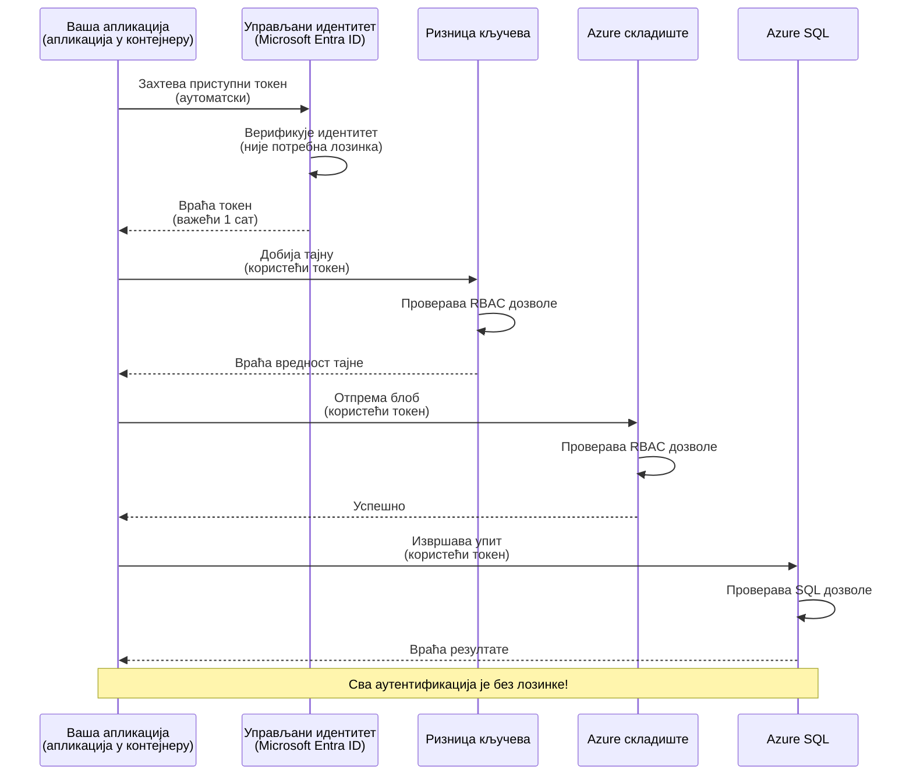
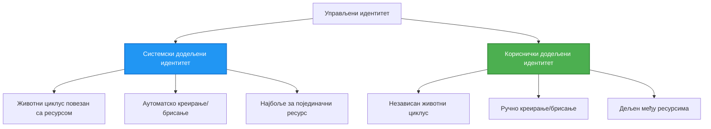

# Аутентификациони обрасци и Managed Identity

⏱️ **Процењено време**: 45-60 минута | 💰 **Утицај на трошкове**: Бесплатно (без додатних трошкова) | ⭐ **Комплексност**: Средњи

**📚 Пут учења:**
- ← Претходно: [Управљање конфигурацијом](configuration.md) - Управљање променљивим окружења и тајна
- 🎯 **Ви сте овде**: Аутентификација и безбедност (Managed Identity, Key Vault, сигурни обрасци)
- → Следеће: [Први пројекат](first-project.md) - Направите своју прву AZD апликацију
- 🏠 [Почетна страница курса](../../README.md)

---

## Шта ћете научити

Завршетком овог часа ви ћете:
- Разумети Azure аутентификационе обрасце (кључеви, connection string-ови, managed identity)
- Имплементирати **Managed Identity** за аутентификацију без лозинки
- Заштитити тајне интеграцијом са **Azure Key Vault**
- Конфигурисати **контролу приступа засновану на улогама (RBAC)** за AZD деплоје
- Применити најбоље безбедносне праксе у Container Apps и Azure сервисима
- Мигрирати са аутентификације засноване на кључевима на аутентификацију засновану на идентитету

## Зашто је Managed Identity важан

### Проблем: Традиционална аутентификација

**Пре Managed Identity:**
```javascript
// ❌ РИЗИК ЗА БЕЗБЕДНОСТ: Тајне уписане директно у код
const connectionString = "Server=mydb.database.windows.net;User=admin;Password=P@ssw0rd123";
const storageKey = "xK7mN9pQ2wR5tY8uI0oP3aS6dF1gH4jK...";
const cosmosKey = "C2x7B9n4M1p8Q5w3E6r0T2y5U8i1O4p7...";
```

**Проблеми:**
- 🔴 **Откривене тајне** у коду, конфигурационим фајловима, променљивим окружења
- 🔴 **Ротација креденцијала** захтева измене у коду и поновно постављање
- 🔴 **Кошмар ревизије** - ко је приступио чему и када?
- 🔴 **Расута решења** - тајне расуте по више система
- 🔴 **Ризици усклађености** - не пролази безбедносне ревизије

### Решење: Managed Identity

**После Managed Identity:**
```javascript
// ✅ БЕЗБЕДНО: У коду нема тајни
const credential = new DefaultAzureCredential();
const client = new BlobServiceClient(
  "https://mystorageaccount.blob.core.windows.net",
  credential  // Azure аутоматски управља аутентификацијом
);
```

**Предности:**
- ✅ **Нема тајни** у коду или конфигурацији
- ✅ **Аутоматска ротација** - Azure то обавља
- ✅ **Пун траг ревизије** у Microsoft Entra ID логовима
- ✅ **Централизована безбедност** - управљање у Azure порталу
- ✅ **Спремно за усклађеност** - испуњава безбедносне стандарде

**Аналогија**: Традиционална аутентификација је као ношење више физичких кључева за различита врата. Managed Identity је као безбедносна картица која аутоматски даје приступ на основу тога ко сте — нема кључева које можете изгубити, копирати или ротирати.

---

## Преглед архитектуре

### Ток аутентификације са Managed Identity



### Врсте Managed Identities



| Карактеристика | Додељено систему | Додељено кориснику |
|---------|----------------|---------------|
| **Животни циклус** | Везано за ресурс | Независно |
| **Креирање** | Аутоматски са ресурсом | Ручно креирање |
| **Брисање** | Брише се са ресурсом | Постоји након брисања ресурса |
| **Дељење** | Само један ресурс | Више ресурса |
| **Употребни случај** | Једноставни сценарији | Сложени сценарији са више ресурса |
| **AZD подразумевано** | ✅ Препоручено | Опционо |

---

## Претпоставке

### Потребни алати

Већ бисте требали имати инсталирано ово из претходних лекција:

```bash
# Проверите Azure Developer CLI
azd version
# ✅ Очекује се: azd верзија 1.0.0 или новија

# Проверите Azure CLI
az --version
# ✅ Очекује се: azure-cli 2.50.0 или новија
```

### Azure захтеви

- Активна Azure претплата
- Дозволе за:
  - Креирање managed identities
  - Додељивање RBAC улога
  - Креирање Key Vault ресурса
  - Деплој Container Apps

### Предзнање

Требало би да сте завршили:
- [Инсталациони водич](installation.md) - подешавање AZD
- [AZD основе](azd-basics.md) - Основни концепти
- [Управљање конфигурацијом](configuration.md) - Променљиве окружења

---

## Лекција 1: Разумевање аутентификационих образаца

### Образац 1: Connection Strings (Застарело - избегавајте)

**Како функционише:**
```bash
# Низ за повезивање садржи податке за пријаву
STORAGE_CONNECTION_STRING="DefaultEndpointsProtocol=https;AccountName=myaccount;AccountKey=xK7mN9pQ2wR5..."
COSMOS_CONNECTION_STRING="AccountEndpoint=https://myaccount.documents.azure.com:443/;AccountKey=C2x7..."
SQL_CONNECTION_STRING="Server=myserver.database.windows.net;User=admin;Password=P@ssw0rd..."
```

**Проблеми:**
- ❌ Тајне видљиве у променљивим окружења
- ❌ Логоване у системима за деплој
- ❌ Тешко их је ротирати
- ❌ Нема трага ревизије приступа

**Када користити:** Само за локални развој, никад у продукцији.

---

### Образац 2: Key Vault Reference (Боље)

**Како функционише:**
```bicep
// Store secret in Key Vault
resource keyVault 'Microsoft.KeyVault/vaults@2023-02-01' = {
  name: 'mykv'
  properties: {
    enableRbacAuthorization: true
  }
}

// Reference in Container App
env: [
  {
    name: 'STORAGE_KEY'
    secretRef: 'storage-key'  // References Key Vault
  }
]
```

**Предности:**
- ✅ Тајне сигурно складиштене у Key Vault
- ✅ Централизовано управљање тајнама
- ✅ Ротација без промена у коду

**Ограничења:**
- ⚠️ Још увек се користе кључеви/лозинке
- ⚠️ Потребно је управљати приступом Key Vault-у

**Када користити:** Прелазни корак од connection string-ова ка managed identity-ју.

---

### Образац 3: Managed Identity (Најбоља пракса)

**Како функционише:**
```bicep
// Enable managed identity
resource containerApp 'Microsoft.App/containerApps@2023-05-01' = {
  name: 'myapp'
  identity: {
    type: 'SystemAssigned'  // Automatically creates identity
  }
}

// Grant permissions
resource roleAssignment 'Microsoft.Authorization/roleAssignments@2022-04-01' = {
  scope: storageAccount
  properties: {
    roleDefinitionId: storageBlobDataContributorRole
    principalId: containerApp.identity.principalId
  }
}
```

**Апликациони код:**
```javascript
// Нема потребе за тајнама!
const { DefaultAzureCredential } = require('@azure/identity');
const { BlobServiceClient } = require('@azure/storage-blob');

const credential = new DefaultAzureCredential();
const blobServiceClient = new BlobServiceClient(
  'https://mystorageaccount.blob.core.windows.net',
  credential
);
```

**Предности:**
- ✅ Нема тајни у коду/конфигурацији
- ✅ Аутоматска ротација креденцијала
- ✅ Пун траг ревизије
- ✅ Овлашћења заснована на RBAC
- ✅ Спремно за усклађеност

**Када користити:** Увек, за продукцијске апликације.

---

### Образац 4: Service Principals (CI/CD & аутоматизација)

Managed identity је златни стандард за ресурсе који раде унутар Azure-а. Али шта са стварима које раде ван Azure-а — попут CI/CD pipeline-а на build агенту, или скрипте на вашем лаптопу која не може користити интерактивну пријаву? Ту улази **service principal**: не-хумани идентитет са својим креденцијалима којим се аутоматизовани процес може пријавити.

**Како функционише:**

Креирајте service principal ограничен на групу ресурса (најмање привилегије):

```bash
az ad sp create-for-rbac \
  --name "myapp-cicd" \
  --role contributor \
  --scopes /subscriptions/<sub-id>/resourceGroups/<rg-name>
```

Ово исписује client ID, client secret и tenant ID. azd може да се пријави неинтерактивно помоћу њих:

```bash
azd auth login \
  --client-id "<appId>" \
  --client-secret "<password>" \
  --tenant-id "<tenant>"
```

**Дајте предност федеративним акредитивима (OIDC) уместо тајни.** Уместо дугорочног client secret-а, конфигуришите федеративни акредитив тако да pipeline размењује краткотрајни токен — нема тајне која може да процури или коју треба ротирати:

```bash
azd auth login \
  --client-id "<appId>" \
  --federated-credential-provider "github" \
  --tenant-id "<tenant>"
```

> `azd pipeline config` поставља ово за вас аутоматски. Погледајте CI/CD водиче у [Поглавље 8](../chapter-08-production/production-ai-practices.md).

**Предности:**
- ✅ Ради ван Azure-а (build агенти, on-prem, друге облаке)
- ✅ Може се ограничити на једну групу ресурса са једном улогом
- ✅ Федеративна (OIDC) варијанта не користи сачуване тајне

**Компромиси:**
- ⚠️ Варијанта заснована на тајнама захтева пажљиво складиштење и ротацију
- ⚠️ Процурела тајна даје шта год SP може да уради — држите домете уским

**Када користити:** CI/CD pipeline-ови и аутоматизација која не може да користи managed identity. Увек преферирајте **federated/OIDC** варијанту уместо client secret-а, и преферирајте managed identity кад год workload ради унутар Azure-а.

**Сигурно складиштење креденцијала:**
- Никад не комитујте тајне — користите тајни продавницу вашег pipeline-а (GitHub Actions secrets, Azure DevOps variable groups / Key Vault).
- Ограничите SP на најмању улогу и групу ресурса која му је потребна.
- Поставите рок важења и ротирајте, или у потпуности елиминишите тајну помоћу OIDC.

---

## Лекција 2: Имплементација Managed Identity са AZD

### Корак по корак имплементација

Хајде да изградимо сигуран Container App који користи managed identity за приступ Azure Storage-у и Key Vault-у.

### Структура пројекта

```
secure-app/
├── azure.yaml                 # AZD configuration
├── infra/
│   ├── main.bicep            # Main infrastructure
│   ├── core/
│   │   ├── identity.bicep    # Managed identity setup
│   │   ├── keyvault.bicep    # Key Vault configuration
│   │   └── storage.bicep     # Storage with RBAC
│   └── app/
│       └── container-app.bicep
└── src/
    ├── app.js                # Application code
    ├── package.json
    └── Dockerfile
```

### 1. Конфигуришите AZD (azure.yaml)

```yaml
name: secure-app
metadata:
  template: secure-app@1.0.0

services:
  api:
    project: ./src
    language: js
    host: containerapp

# Enable managed identity (AZD handles this automatically)
```

### 2. Инфраструктура: Омогућите Managed Identity

**Фајл: `infra/main.bicep`**

```bicep
targetScope = 'subscription'

param environmentName string
param location string = 'eastus'

var tags = { 'azd-env-name': environmentName }

// Resource group
resource rg 'Microsoft.Resources/resourceGroups@2021-04-01' = {
  name: 'rg-${environmentName}'
  location: location
  tags: tags
}

// Storage Account
module storage './core/storage.bicep' = {
  name: 'storage'
  scope: rg
  params: {
    name: 'st${uniqueString(rg.id)}'
    location: location
    tags: tags
  }
}

// Key Vault
module keyVault './core/keyvault.bicep' = {
  name: 'keyvault'
  scope: rg
  params: {
    name: 'kv-${uniqueString(rg.id)}'
    location: location
    tags: tags
  }
}

// Container App with Managed Identity
module containerApp './app/container-app.bicep' = {
  name: 'container-app'
  scope: rg
  params: {
    name: 'ca-${environmentName}'
    location: location
    tags: tags
    storageAccountName: storage.outputs.name
    keyVaultName: keyVault.outputs.name
  }
}

// Grant Container App access to Storage
module storageRoleAssignment './core/role-assignment.bicep' = {
  name: 'storage-role'
  scope: rg
  params: {
    principalId: containerApp.outputs.identityPrincipalId
    roleDefinitionId: 'ba92f5b4-2d11-453d-a403-e96b0029c9fe'  // Storage Blob Data Contributor
    targetResourceId: storage.outputs.id
  }
}

// Grant Container App access to Key Vault
module kvRoleAssignment './core/role-assignment.bicep' = {
  name: 'kv-role'
  scope: rg
  params: {
    principalId: containerApp.outputs.identityPrincipalId
    roleDefinitionId: '4633458b-17de-408a-b874-0445c86b69e6'  // Key Vault Secrets User
    targetResourceId: keyVault.outputs.id
  }
}

// Outputs
output AZURE_STORAGE_ACCOUNT_NAME string = storage.outputs.name
output AZURE_KEY_VAULT_NAME string = keyVault.outputs.name
output APP_URL string = containerApp.outputs.url
```

### 3. Container App са системски додељеним идентитетом

**Фајл: `infra/app/container-app.bicep`**

```bicep
param name string
param location string
param tags object = {}
param storageAccountName string
param keyVaultName string

resource containerApp 'Microsoft.App/containerApps@2023-05-01' = {
  name: name
  location: location
  tags: tags
  identity: {
    type: 'SystemAssigned'  // 🔑 Enable managed identity
  }
  properties: {
    configuration: {
      ingress: {
        external: true
        targetPort: 3000
      }
    }
    template: {
      containers: [
        {
          name: 'api'
          image: 'myregistry.azurecr.io/api:latest'
          resources: {
            cpu: json('0.5')
            memory: '1Gi'
          }
          env: [
            {
              name: 'AZURE_STORAGE_ACCOUNT_NAME'
              value: storageAccountName
            }
            {
              name: 'AZURE_KEY_VAULT_NAME'
              value: keyVaultName
            }
            // 🔑 No secrets - managed identity handles authentication!
          ]
        }
      ]
    }
  }
}

// Output the identity for RBAC assignments
output identityPrincipalId string = containerApp.identity.principalId
output id string = containerApp.id
output url string = 'https://${containerApp.properties.configuration.ingress.fqdn}'
```

### 4. Модул за доделу RBAC улога

**Фајл: `infra/core/role-assignment.bicep`**

```bicep
param principalId string
param roleDefinitionId string  // Azure built-in role ID
param targetResourceId string

resource roleAssignment 'Microsoft.Authorization/roleAssignments@2022-04-01' = {
  name: guid(principalId, roleDefinitionId, targetResourceId)
  scope: resourceId('Microsoft.Resources/resourceGroups', resourceGroup().name)
  properties: {
    roleDefinitionId: subscriptionResourceId('Microsoft.Authorization/roleDefinitions', roleDefinitionId)
    principalId: principalId
    principalType: 'ServicePrincipal'
  }
}

output id string = roleAssignment.id
```

### 5. Апликациони код са Managed Identity

**Фајл: `src/app.js`**

```javascript
const express = require('express');
const { DefaultAzureCredential } = require('@azure/identity');
const { BlobServiceClient } = require('@azure/storage-blob');
const { SecretClient } = require('@azure/keyvault-secrets');

const app = express();
const PORT = process.env.PORT || 3000;

// 🔑 Иницијализујте креденцијал (функционише аутоматски са управљаним идентитетом)
const credential = new DefaultAzureCredential();

// Подешавање Azure Storage-а
const storageAccountName = process.env.AZURE_STORAGE_ACCOUNT_NAME;
const blobServiceClient = new BlobServiceClient(
  `https://${storageAccountName}.blob.core.windows.net`,
  credential  // Кључеви нису потребни!
);

// Подешавање Key Vault-а
const keyVaultName = process.env.AZURE_KEY_VAULT_NAME;
const secretClient = new SecretClient(
  `https://${keyVaultName}.vault.azure.net`,
  credential  // Кључеви нису потребни!
);

// Провера здравља
app.get('/health', (req, res) => {
  res.json({ status: 'healthy', authentication: 'managed-identity' });
});

// Отпреми датотеку у Blob Storage
app.post('/upload', async (req, res) => {
  try {
    const containerClient = blobServiceClient.getContainerClient('uploads');
    await containerClient.createIfNotExists();
    
    const blobName = `file-${Date.now()}.txt`;
    const blockBlobClient = containerClient.getBlockBlobClient(blobName);
    
    await blockBlobClient.upload('Hello from managed identity!', 30);
    
    res.json({
      success: true,
      blobName: blobName,
      message: 'File uploaded using managed identity!'
    });
  } catch (error) {
    console.error('Upload error:', error);
    res.status(500).json({ error: error.message });
  }
});

// Добиј тајну из Key Vault-а
app.get('/secret/:name', async (req, res) => {
  try {
    const secretName = req.params.name;
    const secret = await secretClient.getSecret(secretName);
    
    res.json({
      name: secretName,
      value: secret.value,
      message: 'Secret retrieved using managed identity!'
    });
  } catch (error) {
    console.error('Secret error:', error);
    res.status(500).json({ error: error.message });
  }
});

// Листа Blob контејнера (демонстрира приступ за читање)
app.get('/containers', async (req, res) => {
  try {
    const containers = [];
    for await (const container of blobServiceClient.listContainers()) {
      containers.push(container.name);
    }
    
    res.json({
      containers: containers,
      count: containers.length,
      message: 'Containers listed using managed identity!'
    });
  } catch (error) {
    console.error('List error:', error);
    res.status(500).json({ error: error.message });
  }
});

app.listen(PORT, () => {
  console.log(`Secure API listening on port ${PORT}`);
  console.log('Authentication: Managed Identity (passwordless)');
});
```

**Фајл: `src/package.json`**

```json
{
  "name": "secure-app",
  "version": "1.0.0",
  "dependencies": {
    "express": "^4.18.2",
    "@azure/identity": "^4.0.0",
    "@azure/storage-blob": "^12.17.0",
    "@azure/keyvault-secrets": "^4.7.0"
  },
  "scripts": {
    "start": "node app.js"
  }
}
```

### 6. Деплој и тест

```bash
# Иницијализуј AZD окружење
azd init

# Размести инфраструктуру и апликацију
azd up

# Добиј URL апликације
APP_URL=$(azd env get-values | grep APP_URL | cut -d '=' -f2 | tr -d '"')

# Тестирај проверу здравља
curl $APP_URL/health
```

**✅ Очекујани излаз:**
```json
{
  "status": "healthy",
  "authentication": "managed-identity"
}
```

**Тест: отпремање блоба:**
```bash
curl -X POST $APP_URL/upload
```

**✅ Очекујани излаз:**
```json
{
  "success": true,
  "blobName": "file-1700404800000.txt",
  "message": "File uploaded using managed identity!"
}
```

**Тест: листање контејнера:**
```bash
curl $APP_URL/containers
```

**✅ Очекујани излаз:**
```json
{
  "containers": ["uploads"],
  "count": 1,
  "message": "Containers listed using managed identity!"
}
```

---

## Уобичајене Azure RBAC улоге

### Уграђени ID-ови улога за Managed Identity

| Service | Role Name | Role ID | Permissions |
|---------|-----------|---------|-------------|
| **Storage** | Storage Blob Data Reader | `2a2b9908-6b94-4a3d-8e5a-a7d8f8cc8a12` | Чита BLOB-ове и контејнере |
| **Storage** | Storage Blob Data Contributor | `ba92f5b4-2d11-453d-a403-e96b0029c9fe` | Чита, пише, брише BLOB-ове |
| **Storage** | Storage Queue Data Contributor | `974c5e8b-45b9-4653-ba55-5f855dd0fb88` | Чита, пише, брише поруке у queue-у |
| **Key Vault** | Key Vault Secrets User | `4633458b-17de-408a-b874-0445c86b69e6` | Чита тајне |
| **Key Vault** | Key Vault Secrets Officer | `b86a8fe4-44ce-4948-aee5-eccb2c155cd7` | Чита, пише, брише тајне |
| **Cosmos DB** | Cosmos DB Built-in Data Reader | `00000000-0000-0000-0000-000000000001` | Чита податке у Cosmos DB |
| **Cosmos DB** | Cosmos DB Built-in Data Contributor | `00000000-0000-0000-0000-000000000002` | Чита и пише податке у Cosmos DB |
| **SQL Database** | SQL DB Contributor | `9b7fa17d-e63e-47b0-bb0a-15c516ac86ec` | Управља SQL базама података |
| **Service Bus** | Azure Service Bus Data Owner | `090c5cfd-751d-490a-894a-3ce6f1109419` | Слање, примање и управљање порукама |

### Како пронаћи ID-ове улога

```bash
# Списак свих уграђених улога
az role definition list --query "[].{Name:roleName, ID:name}" --output table

# Претрага одређене улоге
az role definition list --query "[?contains(roleName, 'Storage Blob')].{Name:roleName, ID:name}" --output table

# Детаљи улоге
az role definition list --name "Storage Blob Data Contributor"
```

---

## Практични задаци

### Задатак 1: Омогућите Managed Identity за постојећу апликацију ⭐⭐ (Средње)

**Циљ**: Додајте managed identity постојећем Container App деплоју

**Сценарио**: Имате Container App који користи connection string-ове. Конвертујте га на managed identity.

**Почетна тачка**: Container App са овом конфигурацијом:

```bicep
// ❌ Current: Using connection string
env: [
  {
    name: 'STORAGE_CONNECTION_STRING'
    secretRef: 'storage-connection'
  }
]
```

**Кораци**:

1. **Омогућите managed identity у Bicep-у:**

```bicep
resource containerApp 'Microsoft.App/containerApps@2023-05-01' = {
  name: 'myapp'
  identity: {
    type: 'SystemAssigned'  // Add this
  }
  // ... rest of configuration
}
```

2. **Додајте приступ Storage-у:**

```bicep
// Get storage account reference
resource storageAccount 'Microsoft.Storage/storageAccounts@2023-01-01' existing = {
  name: storageAccountName
}

// Assign role
resource roleAssignment 'Microsoft.Authorization/roleAssignments@2022-04-01' = {
  name: guid(containerApp.id, 'ba92f5b4-2d11-453d-a403-e96b0029c9fe', storageAccount.id)
  scope: storageAccount
  properties: {
    roleDefinitionId: subscriptionResourceId('Microsoft.Authorization/roleDefinitions', 'ba92f5b4-2d11-453d-a403-e96b0029c9fe')
    principalId: containerApp.identity.principalId
    principalType: 'ServicePrincipal'
  }
}
```

3. **Ажурирајте апликациони код:**

**Пре (connection string):**
```javascript
const { BlobServiceClient } = require('@azure/storage-blob');

const blobServiceClient = BlobServiceClient.fromConnectionString(
  process.env.STORAGE_CONNECTION_STRING
);
```

**После (managed identity):**
```javascript
const { DefaultAzureCredential } = require('@azure/identity');
const { BlobServiceClient } = require('@azure/storage-blob');

const credential = new DefaultAzureCredential();
const blobServiceClient = new BlobServiceClient(
  `https://${process.env.STORAGE_ACCOUNT_NAME}.blob.core.windows.net`,
  credential
);
```

4. **Ажурирајте променљиве окружења:**

```bicep
env: [
  {
    name: 'STORAGE_ACCOUNT_NAME'
    value: storageAccountName  // Just the name, no secrets!
  }
  // Remove STORAGE_CONNECTION_STRING
]
```

5. **Деплој и тест:**

```bash
# Поновно распоређивање
azd up

# Тестирајте да ли и даље ради
curl https://myapp.azurecontainerapps.io/upload
```

**✅ Критеријуми успеха:**
- ✅ Апликација се деплојује без грешака
- ✅ Операције над Storage-ом раде (отпремање, листање, преузимање)
- ✅ Нема connection string-ова у променљивим окружења
- ✅ Идентитет је видљив у Azure порталу у одељку "Identity"

**Верификација:**

```bash
# Проверите да ли је управљани идентитет омогућен
az containerapp show \
  --name myapp \
  --resource-group rg-myapp \
  --query "identity.type"
# ✅ Очекује се: "SystemAssigned"

# Проверите доделу улоге
az role assignment list \
  --assignee $(az containerapp show --name myapp --resource-group rg-myapp --query "identity.principalId" -o tsv) \
  --scope /subscriptions/{sub-id}/resourceGroups/rg-myapp/providers/Microsoft.Storage/storageAccounts/mystorageaccount
# ✅ Очекује се: Приказује улогу "Storage Blob Data Contributor"
```

**Време**: 20-30 минута

---

### Задатак 2: Приступ више сервиса са User-Assigned Identity ⭐⭐⭐ (Напредно)

**Циљ**: Креирајте user-assigned identity која се дели између више Container Apps

**Сценарио**: Имате 3 микросервиса која сва треба да приступе истом Storage налогу и Key Vault-у.

**Кораци**:

1. **Креирајте user-assigned identity:**

**Фајл: `infra/core/identity.bicep`**

```bicep
param name string
param location string
param tags object = {}

resource userAssignedIdentity 'Microsoft.ManagedIdentity/userAssignedIdentities@2023-01-31' = {
  name: name
  location: location
  tags: tags
}

output id string = userAssignedIdentity.id
output principalId string = userAssignedIdentity.properties.principalId
output clientId string = userAssignedIdentity.properties.clientId
```

2. **Доделите улоге user-assigned identity-ју:**

```bicep
// In main.bicep
module userIdentity './core/identity.bicep' = {
  name: 'user-identity'
  scope: rg
  params: {
    name: 'id-${environmentName}'
    location: location
    tags: tags
  }
}

// Grant Storage access
resource storageRoleAssignment 'Microsoft.Authorization/roleAssignments@2022-04-01' = {
  name: guid(userIdentity.outputs.principalId, 'storage-contributor')
  scope: storageAccount
  properties: {
    roleDefinitionId: subscriptionResourceId('Microsoft.Authorization/roleDefinitions', 'ba92f5b4-2d11-453d-a403-e96b0029c9fe')
    principalId: userIdentity.outputs.principalId
    principalType: 'ServicePrincipal'
  }
}

// Grant Key Vault access
resource kvRoleAssignment 'Microsoft.Authorization/roleAssignments@2022-04-01' = {
  name: guid(userIdentity.outputs.principalId, 'kv-secrets-user')
  scope: keyVault
  properties: {
    roleDefinitionId: subscriptionResourceId('Microsoft.Authorization/roleDefinitions', '4633458b-17de-408a-b874-0445c86b69e6')
    principalId: userIdentity.outputs.principalId
    principalType: 'ServicePrincipal'
  }
}
```

3. **Доделите идентитет више Container Apps-овима:**

```bicep
resource apiGateway 'Microsoft.App/containerApps@2023-05-01' = {
  name: 'api-gateway'
  identity: {
    type: 'UserAssigned'
    userAssignedIdentities: {
      '${userIdentity.outputs.id}': {}
    }
  }
  // ... rest of config
}

resource productService 'Microsoft.App/containerApps@2023-05-01' = {
  name: 'product-service'
  identity: {
    type: 'UserAssigned'
    userAssignedIdentities: {
      '${userIdentity.outputs.id}': {}
    }
  }
  // ... rest of config
}

resource orderService 'Microsoft.App/containerApps@2023-05-01' = {
  name: 'order-service'
  identity: {
    type: 'UserAssigned'
    userAssignedIdentities: {
      '${userIdentity.outputs.id}': {}
    }
  }
  // ... rest of config
}
```

4. **Апликациони код (сви сервиси користе исти образац):**

```javascript
const { DefaultAzureCredential, ManagedIdentityCredential } = require('@azure/identity');

// За кориснички додељен идентитет, наведите ИД клијента
const credential = new ManagedIdentityCredential(
  process.env.AZURE_CLIENT_ID  // ИД клијента кориснички додељеног идентитета
);

// Или користите DefaultAzureCredential (аутоматски открива)
const credential = new DefaultAzureCredential();

const blobServiceClient = new BlobServiceClient(
  `https://${process.env.STORAGE_ACCOUNT_NAME}.blob.core.windows.net`,
  credential
);
```

5. **Деплој и верификујте:**

```bash
azd up

# Проверите да ли све услуге могу да приступе складишту
curl https://api-gateway.azurecontainerapps.io/upload
curl https://product-service.azurecontainerapps.io/upload
curl https://order-service.azurecontainerapps.io/upload
```

**✅ Критеријуми успеха:**
- ✅ Један идентитет који деле 3 сервиса
- ✅ Сви сервиси могу да приступе Storage-у и Key Vault-у
- ✅ Идентитет опстане ако обришете један сервис
- ✅ Централизовано управљање дозволама

**Предности User-Assigned Identity:**
- Један идентитет за управљање
- Конзистентне дозволе између сервиса
- Опстанак након брисања сервиса
- Боље за сложене архитектуре

**Време**: 30-40 минута

---

### Задатак 3: Имплементирајте ротацију тајни у Key Vault-у ⭐⭐⭐ (Напредно)

**Циљ**: Складиштите трећепартијске API кључеве у Key Vault и приступите им помоћу managed identity

**Сценарио**: Ваша апликација треба да позива спољни API (OpenAI, Stripe, SendGrid) који захтева API кључеве.

**Кораци**:

1. **Креирајте Key Vault са RBAC-ом:**

**Фајл: `infra/core/keyvault.bicep`**

```bicep
param name string
param location string
param tags object = {}

resource keyVault 'Microsoft.KeyVault/vaults@2023-02-01' = {
  name: name
  location: location
  tags: tags
  properties: {
    enableRbacAuthorization: true  // Use RBAC instead of access policies
    sku: {
      family: 'A'
      name: 'standard'
    }
    tenantId: subscription().tenantId
    enableSoftDelete: true
    softDeleteRetentionInDays: 90
  }
}

// Allow Container App to read secrets
output id string = keyVault.id
output name string = keyVault.name
output uri string = keyVault.properties.vaultUri
```

2. **Сачувајте тајне у Key Vault:**

```bash
# Добијте име Key Vault-а
KV_NAME=$(azd env get-values | grep AZURE_KEY_VAULT_NAME | cut -d '=' -f2 | tr -d '"')

# Сачувајте API кључеве трећих страна
az keyvault secret set \
  --vault-name $KV_NAME \
  --name "OpenAI-ApiKey" \
  --value "sk-proj-xxxxxxxxxxxxx"

az keyvault secret set \
  --vault-name $KV_NAME \
  --name "Stripe-ApiKey" \
  --value "sk_live_xxxxxxxxxxxxx"

az keyvault secret set \
  --vault-name $KV_NAME \
  --name "SendGrid-ApiKey" \
  --value "SG.xxxxxxxxxxxxx"
```

3. **Апликациони код за преузимање тајни:**

**Фајл: `src/config.js`**

```javascript
const { DefaultAzureCredential } = require('@azure/identity');
const { SecretClient } = require('@azure/keyvault-secrets');

class Config {
  constructor() {
    this.credential = new DefaultAzureCredential();
    this.secretClient = new SecretClient(
      `https://${process.env.AZURE_KEY_VAULT_NAME}.vault.azure.net`,
      this.credential
    );
    this.cache = {};
  }

  async getSecret(secretName) {
    // Прво проверите кеш
    if (this.cache[secretName]) {
      return this.cache[secretName];
    }

    try {
      const secret = await this.secretClient.getSecret(secretName);
      this.cache[secretName] = secret.value;
      console.log(`✅ Retrieved secret: ${secretName}`);
      return secret.value;
    } catch (error) {
      console.error(`❌ Failed to get secret ${secretName}:`, error.message);
      throw error;
    }
  }

  async getOpenAIKey() {
    return this.getSecret('OpenAI-ApiKey');
  }

  async getStripeKey() {
    return this.getSecret('Stripe-ApiKey');
  }

  async getSendGridKey() {
    return this.getSecret('SendGrid-ApiKey');
  }
}

module.exports = new Config();
```

4. **Користите тајне у апликацији:**

**Фајл: `src/app.js`**

```javascript
const express = require('express');
const config = require('./config');
const { OpenAI } = require('openai');

const app = express();

// Иницијализујте OpenAI помоћу кључа из Key Vault-а
let openaiClient;

async function initializeServices() {
  const openaiKey = await config.getOpenAIKey();
  openaiClient = new OpenAI({ apiKey: openaiKey });
  console.log('✅ Services initialized with secrets from Key Vault');
}

// Позвати при покретању
initializeServices().catch(console.error);

app.post('/chat', async (req, res) => {
  try {
    const completion = await openaiClient.chat.completions.create({
      model: 'gpt-4.1',
      messages: [{ role: 'user', content: 'Hello!' }]
    });
    
    res.json({
      response: completion.choices[0].message.content,
      authentication: 'Key from Key Vault via Managed Identity'
    });
  } catch (error) {
    res.status(500).json({ error: error.message });
  }
});

app.listen(3000, () => {
  console.log('Secure API with Key Vault integration running');
});
```

5. **Деплој и тест:**

```bash
azd up

# Проверити да ли API кључеви функционишу
curl -X POST https://myapp.azurecontainerapps.io/chat \
  -H "Content-Type: application/json" \
  -d '{"message":"Hello AI"}'
```

**✅ Критеријуми успеха:**
- ✅ Нема API кључева у коду или променљивима окружења
- ✅ Апликација преузима кључеве из Key Vault
- ✅ API-ји трећих страна раде исправно
- ✅ Могуће ротирати кључеве без измена у коду

**Ротирајте тајну:**

```bash
# Ажурирајте тајну у Кеј Волт
az keyvault secret set \
  --vault-name $KV_NAME \
  --name "OpenAI-ApiKey" \
  --value "sk-proj-NEW_KEY_HERE"

# Поново покрените апликацију да би преузела нови кључ
az containerapp revision restart \
  --name myapp \
  --resource-group rg-myapp
```

**Време**: 25-35 минута

---

## Контролна тачка знања

### 1. Обрасци аутентификације ✓

Проверите своје разумевање:

- [ ] **Q1**: Која су три главна обрасца аутентификације? 
  - **A**: конекцијски низови (застарело), референце на Key Vault (прелазно), управљани идентитет (најбоље)

- [ ] **Q2**: Зашто је управљани идентитет бољи од конекцијских низова?
  - **A**: Нема тајни у коду, аутоматска ротација, пун евиденцијски траг, RBAC дозволе

- [ ] **Q3**: Када бисте користили кориснички додељени идентитет уместо системски додељеног?
  - **A**: Када се идентитет дели између више ресурса или када је животни циклус идентитета независан од животног циклуса ресурса

**Практична верификација:**
```bash
# Проверите који тип идентитета ваша апликација користи
az containerapp show \
  --name myapp \
  --resource-group rg-myapp \
  --query "identity.type"

# Прикажите све доделе улога за тај идентитет
az role assignment list \
  --assignee $(az containerapp show --name myapp --resource-group rg-myapp --query "identity.principalId" -o tsv)
```

---

### 2. RBAC и дозволе ✓

Проверите своје разумевање:

- [ ] **Q1**: Који је ID улоге за "Storage Blob Data Contributor"?
  - **A**: `ba92f5b4-2d11-453d-a403-e96b0029c9fe`

- [ ] **Q2**: Које дозволе пружа "Key Vault Secrets User"?
  - **A**: Само читање приступа тајнама (не може да креира, ажурира или обрише)

- [ ] **Q3**: Како дати Container App приступ Azure SQL?
  - **A**: Доделите улогу "SQL DB Contributor" или конфигуришите Microsoft Entra ID аутентификацију за SQL

**Практична верификација:**
```bash
# Пронађите одређену улогу
az role definition list --name "Storage Blob Data Contributor"

# Проверите које улоге су додељене вашем идентитету
PRINCIPAL_ID=$(az containerapp show --name myapp --resource-group rg-myapp --query "identity.principalId" -o tsv)
az role assignment list --assignee $PRINCIPAL_ID --output table
```

---

### 3. Интеграција са Key Vault-ом ✓

Проверите своје разумевање:

- [ ] **Q1**: Како омогућити RBAC за Key Vault уместо политика приступа?
  - **A**: Поставите `enableRbacAuthorization: true` у Bicep

- [ ] **Q2**: Која Azure SDK библиотека рукује аутентификацијом управљаног идентитета?
  - **A**: `@azure/identity` са класом `DefaultAzureCredential`

- [ ] **Q3**: Колико дуго тајне из Key Vault-а остају у кешу?
  - **A**: Зависи од апликације; имплементирајте своју стратегију кеширања

**Практична верификација:**
```bash
# Тестирај приступ Key Vault-у
az keyvault secret show \
  --vault-name $KV_NAME \
  --name "OpenAI-ApiKey" \
  --query "value"

# Провери да ли је RBAC омогућен
az keyvault show \
  --name $KV_NAME \
  --query "properties.enableRbacAuthorization"
# ✅ Очекује се: тачно
```

---

## Најбоље безбедносне праксе

### ✅ РАДИТЕ:

1. **Увек користите управљани идентитет у продукцији**
   ```bicep
   identity: {
     type: 'SystemAssigned'
   }
   ```

2. **Користите RBAC улоге са најмање привилегија**
   - Користите "Reader" улоге када је могуће
   - Избегавајте "Owner" или "Contributor" осим ако није неопходно

3. **Складиштите кључеве трећих страна у Key Vault-у**
   ```javascript
   const apiKey = await secretClient.getSecret('ThirdPartyApiKey');
   ```

4. **Омогућите ревизијско логовање**
   ```bicep
   diagnosticSettings: {
     logs: [{ category: 'AuditEvent', enabled: true }]
   }
   ```

5. **Користите различите идентитете за dev/staging/prod**
   ```bash
   azd env new dev
   azd env new staging
   azd env new prod
   ```

6. **Редовно ротирајте тајне**
   - Поставите датуме истека на тајнама у Key Vault-у
   - Аутоматизујте ротацију помоћу Azure Functions

### ❌ НЕ РАДИТЕ:

1. **Никада не хардкодирајте тајне**
   ```javascript
   // ❌ ЛОШ
   const apiKey = "sk-proj-xxxxxxxxxxxxx";
   ```

2. **Не користите конекцијске низове у продукцији**
   ```javascript
   // ❌ ЛОШ
   BlobServiceClient.fromConnectionString(process.env.STORAGE_CONNECTION_STRING)
   ```

3. **Не додељујте прекомерне дозволе**
   ```bicep
   // ❌ BAD - too much access
   roleDefinitionId: 'Owner'
   
   // ✅ GOOD - least privilege
   roleDefinitionId: 'Storage Blob Data Reader'
   ```

4. **Не логнујте тајне**
   ```javascript
   // ❌ ЛОШ
   console.log('API Key:', apiKey);
   
   // ✅ ДОБАР
   console.log('API Key retrieved successfully');
   ```

5. **Не делите продукцијске идентитете између окружења**
   ```bicep
   // ❌ BAD - same identity for dev and prod
   // ✅ GOOD - separate identities per environment
   ```

---

## Водич за решавање проблема

### Проблем: "Unauthorized" при приступу Azure Storage

**Симптоми:**
```
Error: Unauthorized (403)
AuthorizationPermissionMismatch: This request is not authorized to perform this operation
```

**Дијагноза:**

```bash
# Проверите да ли је омогућен управљени идентитет
az containerapp show \
  --name myapp \
  --resource-group rg-myapp \
  --query "identity.type"
# ✅ Очекује се: "SystemAssigned" или "UserAssigned"

# Проверите доделе улога
PRINCIPAL_ID=$(az containerapp show --name myapp --resource-group rg-myapp --query "identity.principalId" -o tsv)
az role assignment list --assignee $PRINCIPAL_ID

# Очекује се: Требало би да видите "Storage Blob Data Contributor" или сличну улогу
```

**Решења:**

1. **Доделите исправну RBAC улогу:**
```bash
STORAGE_ID=$(az storage account show --name mystorageaccount --resource-group rg-myapp --query "id" -o tsv)
az role assignment create \
  --assignee $PRINCIPAL_ID \
  --role "Storage Blob Data Contributor" \
  --scope $STORAGE_ID
```

2. **Сачекајте пропагацију (може потрајати 5-10 минута):**
```bash
# Проверите статус доделе улоге
az role assignment list --assignee $PRINCIPAL_ID --scope $STORAGE_ID
```

3. **Проверите да код апликације користи исправне креденцијале:**
```javascript
// Уверите се да користите DefaultAzureCredential
const credential = new DefaultAzureCredential();
```

---

### Проблем: Приступ Key Vault-у одбијен

**Симптоми:**
```
Error: Forbidden (403)
The user, group or application does not have secrets get permission
```

**Дијагноза:**

```bash
# Проверите да ли је RBAC за Key Vault омогућен
az keyvault show \
  --name $KV_NAME \
  --query "properties.enableRbacAuthorization"
# ✅ Очекивано: true

# Проверите доделе улога
az role assignment list \
  --assignee $PRINCIPAL_ID \
  --scope /subscriptions/{sub-id}/resourceGroups/rg-myapp/providers/Microsoft.KeyVault/vaults/$KV_NAME
```

**Решења:**

1. **Омогућите RBAC на Key Vault-у:**
```bash
az keyvault update \
  --name $KV_NAME \
  --enable-rbac-authorization true
```

2. **Доделите улогу Key Vault Secrets User:**
```bash
KV_ID=$(az keyvault show --name $KV_NAME --query "id" -o tsv)
az role assignment create \
  --assignee $PRINCIPAL_ID \
  --role "Key Vault Secrets User" \
  --scope $KV_ID
```

---

### Проблем: DefaultAzureCredential не ради локално

**Симптоми:**
```
Error: DefaultAzureCredential failed to retrieve a token
CredentialUnavailableError: No credential available
```

**Дијагноза:**

```bash
# Проверите да ли сте пријављени
az account show

# Проверите аутентификацију Azure CLI
az ad signed-in-user show
```

**Решења:**

1. **Пријавите се у Azure CLI:**
```bash
az login
```

2. **Подесите Azure претплату:**
```bash
az account set --subscription "Your Subscription Name"
```

3. **За локални развој, користите променљиве окружења:**
```bash
export AZURE_TENANT_ID="your-tenant-id"
export AZURE_CLIENT_ID="your-client-id"
export AZURE_CLIENT_SECRET="your-client-secret"
```

4. **Или локално користите други креденцијал:**
```javascript
const { DefaultAzureCredential, AzureCliCredential } = require('@azure/identity');

// Користите AzureCliCredential за локални развој
const credential = process.env.NODE_ENV === 'production' 
  ? new DefaultAzureCredential()
  : new AzureCliCredential();
```

---

### Проблем: Додела улоге траје предуго да би се пропагирала

**Симптоми:**
- Улога успешно додељена
- Још увек добијате 403 грешке
- Повремени приступ (понекад ради, понекад не)

**Објашњење:**
Azure RBAC промене могу потрајати 5-10 минута да се пропагирају глобално.

**Решење:**

```bash
# Сачекајте и покушајте поново
echo "Waiting for RBAC propagation..."
sleep 300  # Сачекајте 5 минута

# Проверите приступ
curl https://myapp.azurecontainerapps.io/upload

# Ако и даље не ради, поново покрените апликацију
az containerapp revision restart \
  --name myapp \
  --resource-group rg-myapp
```

---

## Разматрања трошкова

### Трошкови управљаног идентитета

| Ресурс | Трошак |
|----------|------|
| **Managed Identity** | 🆓 **БЕСПЛАТНО** - Нема накнаде |
| **RBAC Role Assignments** | 🆓 **БЕСПЛАТНО** - Нема накнаде |
| **Microsoft Entra ID Token Requests** | 🆓 **БЕСПЛАТНО** - Укључено |
| **Key Vault Operations** | $0.03 за 10,000 операција |
| **Key Vault Storage** | $0.024 по тајни месечно |

**Управљани идентитет штеди новац јер:**
- ✅ Укида потребу за Key Vault операцијама за аутх сервис-према-сервису
- ✅ Смањује безбедносне инциденте (нема цурења креденцијала)
- ✅ Смањује оперативни надзор (нема ручне ротације)

**Пример поређења трошкова (месечно):**

| Сценарио | Конекцијски низови | Управљани идентитет | Уштеда |
|----------|-------------------|-----------------|---------|
| Мала апликација (1M requests) | ~$50 (Key Vault + ops) | ~$0 | $50/month |
| Средња апликација (10M requests) | ~$200 | ~$0 | $200/month |
| Велика апликација (100M requests) | ~$1,500 | ~$0 | $1,500/month |

---

## Сазнајте више

### Званична документација
- [Azure управљани идентитет](https://learn.microsoft.com/entra/identity/managed-identities-azure-resources/overview)
- [Azure RBAC](https://learn.microsoft.com/azure/role-based-access-control/overview)
- [Azure Key Vault](https://learn.microsoft.com/azure/key-vault/general/overview)
- [DefaultAzureCredential](https://learn.microsoft.com/dotnet/api/azure.identity.defaultazurecredential)

### SDK документација
- [@azure/identity (Node.js)](https://www.npmjs.com/package/@azure/identity)
- [Azure.Identity (C#)](https://www.nuget.org/packages/Azure.Identity/)
- [azure-identity (Python)](https://pypi.org/project/azure-identity/)

### Следећи кораци у овом курсу
- ← Претходно: [Управљање конфигурацијом](configuration.md)
- → Следеће: [Први пројекат](first-project.md)
- 🏠 [Почетна страница курса](../../README.md)

### Повезани примери
- [Microsoft Foundry Models Chat Example](../../../../examples/azure-openai-chat) - Користи управљани идентитет за Microsoft Foundry Models
- [Microservices Example](../../../../examples/microservices) - Шеме аутентификације за више сервиса

---

## Резиме

**Научили сте:**
- ✅ Три обрасца аутентификације (конекцијски низови, Key Vault, управљани идентитет)
- ✅ Како омогућити и конфигурисати управљани идентитет у AZD
- ✅ Доделе RBAC улога за Azure сервисе
- ✅ Интеграцију Key Vault-а за тајне трећих страна
- ✅ Кориснички додељени у односу на системски додељени идентитет
- ✅ Најбоље безбедносне праксе и решавање проблема

**Кључне поуке:**
1. **Увек користите управљани идентитет у продукцији** - Нема тајни, аутоматска ротација
2. **Користите RBAC улоге са најмање привилегија** - Доделите само неопходне дозволе
3. **Складиштите кључеве трећих страна у Key Vault-у** - Централизовано управљање тајнама
4. **Раздвојите идентитете по окружењима** - Изолација за dev, staging, prod
5. **Омогућите ревизијско логовање** - Пратите ко је шта приступао

**Следећи кораци:**
1. Завршите горе наведене практичне вежбе
2. Мигрирајте постојећу апликацију са конекцијских низова на управљани идентитет
3. Направите свој први AZD пројекат са безбедношћу од првог дана: [Први пројекат](first-project.md)

---

<!-- CO-OP TRANSLATOR DISCLAIMER START -->
**Изјава о одрицању одговорности**:
Овај документ је преведен коришћењем услуге за аутоматски превод [Co-op Translator](https://github.com/Azure/co-op-translator). Иако тежимо тачности, имајте у виду да аутоматски преводи могу садржати грешке или нетачности. Оригинални документ на његовом изворном језику треба сматрати ауторитативним извором. За критичне информације препоручује се професионални људски превод. Нисмо одговорни за било каква неспоразума или погрешна тумачења која произилазе из коришћења овог превода.
<!-- CO-OP TRANSLATOR DISCLAIMER END -->