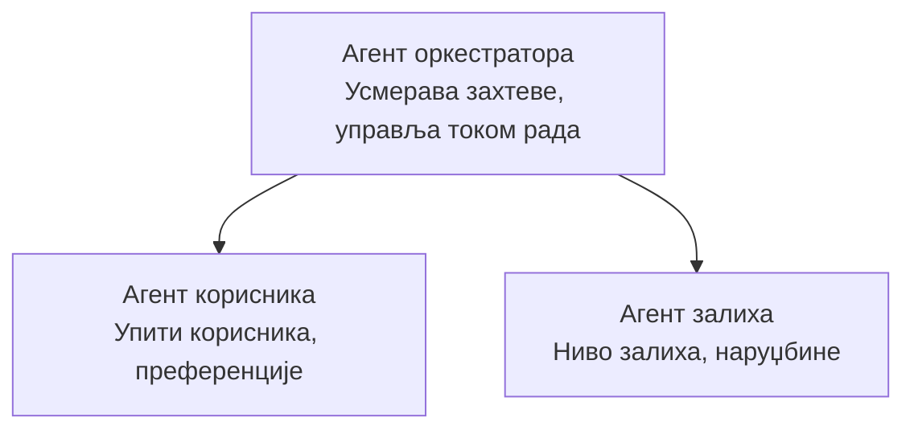

# Поглавље 5: Више-agentна AI решења

**📚 Курс**: [AZD For Beginners](../../README.md) | **⏱️ Трајање**: 2-3 сата | **⭐ Сложеност**: Напредни

---

## Преглед

Ово поглавље покрива напредне шаблоне више-agentне архитектуре, оркестрацију агената и продукционо спремне AI разгортке за сложене сценаријe.

> Верификовано против `azd 1.23.12` у марту 2026.

## Циљеви учења

Завршавањем овог поглавља, ви ћете:
- Разумети више-agentне архитектонске шаблоне
- Разместити координисане системе AI агената
- Имплементирати комуникацију агент->агент
- Изградити продукционо спремна више-agentна решења

---

## 📚 Лекције

| # | Лекција | Опис | Време |
|---|--------|-------------|------|
| 1 | [Više-agentno maloprodajno rešenje](../../examples/retail-scenario.md) | Kompletan vodič kroz implementaciju | 90 min |
| 2 | [Šabloni koordinacije](../chapter-06-pre-deployment/coordination-patterns.md) | Strategije orkestracije agenata | 30 min |
| 3 | [Razmestanje ARM šablona](../../examples/retail-multiagent-arm-template/README.md) | Razmeštanje jednim klikom | 30 min |

---

## 🚀 Brzi početak

```bash
# Опција 1: Разместите из шаблона
azd init --template agent-openai-python-prompty
azd up

# Опција 2: Разместите из манифеста агента (захтева екстензију azure.ai.agents)
azd extension install azure.ai.agents
azd ai agent init -m agent-manifest.yaml
azd up
```

> **Који приступ?** Користите `azd init --template` да почнете од радног примера. Користите `azd ai agent init` када имате свој манифест агента. Погледајте [Referenca za AZD AI CLI](../chapter-08-production/production-ai-practices.md#azd-ai-cli-commands-and-extensions) за детаљне информације.

---

## 🤖 Више-agentна архитектура



---

## 🎯 Истакнуто решење: Малопродајно више-agentно решење

[Maloprodajno više-agentno rešenje](../../examples/retail-scenario.md) демонстрира:

- **Agent za kupce**: Рукује интеракцијама са корисницима и преференцијама
- **Agent za inventar**: Управља залихама и обрадом наруџбина
- **Orkestrator**: Координише између агената
- **Deljena memorija**: Управљање контекстом између агената

### Korišćene usluge

| Usluga | Svrha |
|---------|---------|
| Microsoft Foundry Models | Razumevanje jezika |
| Azure AI Search | Katalog proizvoda |
| Cosmos DB | Stanje i memorija agenata |
| Container Apps | Hostovanje agenata |
| Application Insights | Nadgledanje |

---

## 🔗 Navigacija

| Smer | Poglavlje |
|-----------|---------|
| **Prethodno** | [Poglavlje 4: Infrastructure](../chapter-04-infrastructure/README.md) |
| **Sledeće** | [Poglavlje 6: Pre-raspoređivanje](../chapter-06-pre-deployment/README.md) |

---

## 📖 Povezani resursi

- [Vodič za AI agente](../chapter-02-ai-development/agents.md)
- [Produkcione AI prakse](../chapter-08-production/production-ai-practices.md)
- [Otklanjanje problema sa AI](../chapter-07-troubleshooting/ai-troubleshooting.md)

---

<!-- CO-OP TRANSLATOR DISCLAIMER START -->
**Одрицање од одговорности**:
Овај документ је преведен помоћу АИ сервиса за превођење [Co-op Translator](https://github.com/Azure/co-op-translator). Иако се трудимо да обезбедимо тачност, имајте у виду да аутоматизовани преводи могу садржати грешке или нетачности. Изворни документ на свом матичном језику треба сматрати меродавним извором. За критичне информације препоручује се професионални људски превод. Не сносимо одговорност за никакве неспоразууме или погрешна тумачења која произилазе из коришћења овог превода.
<!-- CO-OP TRANSLATOR DISCLAIMER END -->