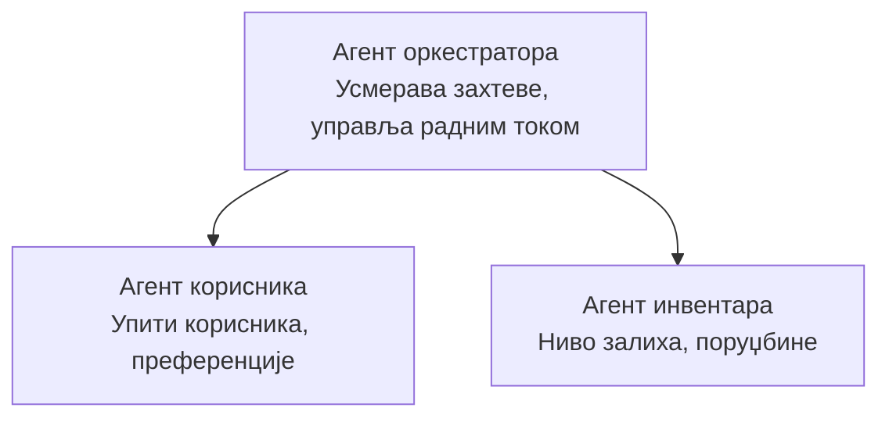

# Поглавље 5: Мулти-агентна AI решења

**📚 Курс**: [AZD за почетнике](../../README.md) | **⏱️ Трајање**: 2-3 сата | **⭐ Сложеност**: Напредно

---

## Преглед

Ово поглавље покрива напредне шеме архитектуре мулти-агента, оркестрацију агената и продукционо спремна AI решења за сложене сценарије.

> Проверено са `azd 1.25.6` у јуну 2026.

## Циљеви учења

Завршетком овог поглавља, ви ћете:
- Разумети шеме архитектуре мулти-агената
- Распоредити координисане AI агентске системе
- Имплементирати комуникацију међу агентима
- Изградити мулти-агентска решења спремна за производну употребу

---

## 📚 Лекције

| # | Лекција | Опис | Време |
|---|--------|-------------|------|
| 1 | [Основе мулти-агената](multi-agent-basics.md) | Практичан: распоредите радну мулти-агент апликацију помоћу `azd up` | 45 min |
| 2 | [Обрасци координације](../chapter-06-pre-deployment/coordination-patterns.md) | Стратегије оркестрације агената (наставља се у Поглављу 6) | 30 min |
| 3 | [Распоређивање ARM шаблона](../../examples/retail-multiagent-arm-template/README.md) | Пример распоређивања једним кликом | 30 min |

> **Почните са Лекцијом 1.** То је једина потпуно практична, распоредива лекција у овом поглављу. Лекција 2 се налази у Поглављу 6 (дели се са планирањем пре-распоређивања), а [Мулти-агент решење за малопродају](../../examples/retail-scenario.md) је архитектонски план — референца дизајна, а не шаблон за распоређивање једном командом.

---

## 🚀 Брзи почетак

```bash
# Опција 1: Размештање из шаблона
azd init --template agent-openai-python-prompty
azd up

# Опција 2: Размештање из манифеста агента (захтева проширење azure.ai.agents)
azd extension install azure.ai.agents
azd ai agent init -m agent-manifest.yaml
azd up
```

> **Који приступ?** Користите `azd init --template` да започнете из радног примера. Користите `azd ai agent init` када имате свој манифест агента. Погледајте [Референцу за AZD AI CLI](../chapter-08-production/production-ai-practices.md#azd-ai-cli-commands-and-extensions) за пуне детаље.

---

## 🤖 Архитектура мулти-агената



---

## 🎯 Истакнуто решење: Мулти-агент за малопродају

[Мулти-агент решење за малопродају](../../examples/retail-scenario.md) илуструје:

- **Агент за купце**: Руководи интеракцијама са корисницима и преференцијама
- **Агент за инвентар**: Управља залихама и обрадом поруџбина
- **Оркестратор**: Координише међу агентима
- **Заједничка меморија**: Управљање контекстом између агената

### Услуге које се користе

| Услуга | Намена |
|---------|---------|
| Microsoft Foundry Models | Разумевање језика |
| Azure AI Search | Каталог производа |
| Cosmos DB | Стање агената и меморија |
| Container Apps | Хостовање агената |
| Application Insights | Надгледање |

---

## 🔗 Навигација

| Смер | Поглавље |
|-----------|---------|
| **Претходно** | [Поглавље 4: Инфраструктура](../chapter-04-infrastructure/README.md) |
| **Следеће** | [Поглавље 6: Пе-распоређивање](../chapter-06-pre-deployment/README.md) |

---

## 📖 Повезани ресурси

- [Водич за AI агенте](../chapter-02-ai-development/agents.md)
- [Практике за производни AI](../chapter-08-production/production-ai-practices.md)
- [Решавање проблема са AI](../chapter-07-troubleshooting/ai-troubleshooting.md)

---

<!-- CO-OP TRANSLATOR DISCLAIMER START -->
**Изјава о одрицању одговорности**:
Овај документ је преведен коришћењем услуге за аутоматски превод [Co-op Translator](https://github.com/Azure/co-op-translator). Иако тежимо тачности, имајте у виду да аутоматски преводи могу садржати грешке или нетачности. Оригинални документ на његовом изворном језику треба сматрати ауторитативним извором. За критичне информације препоручује се професионални људски превод. Нисмо одговорни за било каква неспоразума или погрешна тумачења која произилазе из коришћења овог превода.
<!-- CO-OP TRANSLATOR DISCLAIMER END -->