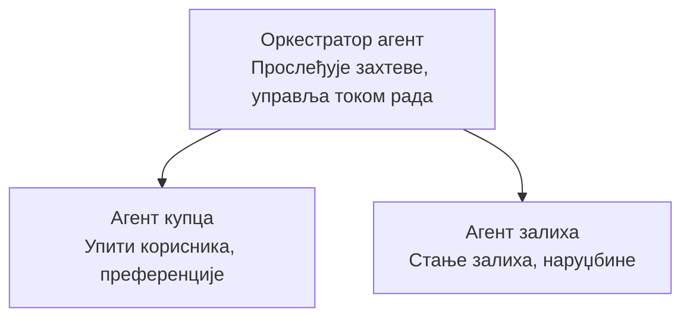

# Поглавље 5: Решења AI са више агената

**📚 Курс**: [AZD For Beginners](../../README.md) | **⏱️ Трајање**: 2-3 сата | **⭐ Сложеност**: Напредни

---

## Преглед

Ово поглавље покрива напредне архитектонске обрасце за системе са више агената, оркестрацију агената и продукциона решења за примену AI у сложеним сценаријима.

## Циљеви учења

Након завршетка овог поглавља, моћи ћете:
- Разумети архитектонске обрасце за више агената
- Распоредити координисане системе AI агената
- Имплементирати комуникацију између агената
- Израдити продукциона решења са више агената

---

## 📚 Лекције

| # | Лекција | Опис | Време |
|---|--------|-------------|------|
| 1 | [Мулти-агентско решење за малопродају](../../examples/retail-scenario.md) | Комплетан водич имплементације | 90 мин |
| 2 | [Обрасци координације](../chapter-06-pre-deployment/coordination-patterns.md) | Стратегије оркестрације агената | 30 мин |
| 3 | [Распоређивање ARM шаблона](../../examples/retail-multiagent-arm-template/README.md) | Распоређивање једним кликом | 30 мин |

---

## 🚀 Брзи почетак

```bash
# Опција 1: Распореди из шаблона
azd init --template agent-openai-python-prompty
azd up

# Опција 2: Распореди из манифеста агента (захтева екстензију azure.ai.agents)
azd extension install azure.ai.agents
azd ai agent init -m agent-manifest.yaml
azd up
```

> **Који приступ?** Користите `azd init --template` да започнете са радним примером. Користите `azd ai agent init` када имате свој манифест агента. Погледајте [Референца AZD AI CLI](../chapter-08-production/production-ai-practices.md#azd-ai-cli-commands-and-extensions) за потпуне детаље.

---

## 🤖 Архитектура мулти-агентског система


---

## 🎯 Представљено решење: Мулти-агентско решење за малопродају

The [Мулти-агентско решење за малопродају](../../examples/retail-scenario.md) демонстрира:

- **Агент купца**: Обрађује интеракције са корисником и његове преференције
- **Агент залиха**: Управља залихама и обрадом поруџбина
- **Оркестратор**: Координише рад између агената
- **Заједничка меморија**: Управљање контекстом између агената

### Коришћене услуге

| Услуга | Намена |
|---------|---------|
| Microsoft Foundry Models | Разумевање језика |
| Azure AI Search | Каталог производа |
| Cosmos DB | Стање и меморија агената |
| Container Apps | Хостовање агената |
| Application Insights | Надгледање |

---

## 🔗 Навигација

| Смер | Поглавље |
|-----------|---------|
| **Претходно** | [Поглавље 4: Инфраструктура](../chapter-04-infrastructure/README.md) |
| **Следеће** | [Поглавље 6: Пре-распоређивање](../chapter-06-pre-deployment/README.md) |

---

## 📖 Повезани ресурси

- [Водич за AI агенте](../chapter-02-ai-development/agents.md)
- [Практике продукционог AI](../chapter-08-production/production-ai-practices.md)
- [Решавање проблема са AI](../chapter-07-troubleshooting/ai-troubleshooting.md)

---

<!-- CO-OP TRANSLATOR DISCLAIMER START -->
**Одрицање одговорности**:
Овај документ је преведен уз помоћ сервиса за превод заснованог на вештачкој интелигенцији [Co-op Translator](https://github.com/Azure/co-op-translator). Иако тежимо тачности, молимо имајте у виду да аутоматски преводи могу садржати грешке или нетачности. Оригинални документ на свом изворном језику треба сматрати ауторитетним извором. За критичне информације препоручује се професионални људски превод. Нисмо одговорни за било какве неспоразуме или погрешна тумачења која произилазе из коришћења овог превода.
<!-- CO-OP TRANSLATOR DISCLAIMER END -->