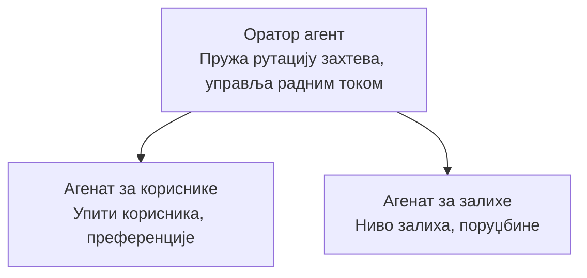

# Поглавље 5: Мулти-Агентска AI Решења

**📚 Курс**: [AZD За Почетнике](../../README.md) | **⏱️ Трајање**: 2-3 сата | **⭐ Комплексност**: Напредни

---

## Преглед

Ово поглавље обухвата напредне мулти-агентске шаблоне архитектуре, оркестрацију агената и AI имплементације спремне за продукцију за сложене сценарије.

> Верификовано са `azd 1.27.1` у јулу 2026.

## Циљеви учења

Завршетком овог поглавља, научићете:
- Разумевање мулти-агентских шаблона архитектуре
- Деплојовање координисаних AI агентских система
- Имплементацију комуникације између агената
- Изградњу мулти-агентских решења спремних за продукцију

---

## 📚 Лекције

| # | Лекција | Опис | Време |
|---|--------|-------------|------|
| 1 | [Основе мулти-агената](multi-agent-basics.md) | Практичан рад: деплојујте функционалну мулти-агент апликацију са `azd up` | 45 мин |
| 2 | [Образци координације](../chapter-06-pre-deployment/coordination-patterns.md) | Стратегије оркестрације агената (наставак у Поглављу 6) | 30 мин |
| 3 | [Деплој ARM шаблона](../../examples/retail-multiagent-arm-template/README.md) | Пример деплоја са једним кликом | 30 мин |

> **Почните са Лекцијом 1.** Једина је потпуно практична, деплојујућа лекција у овом поглављу. Лекција 2 је у Поглављу 6 (заједно са планирањем пре деплоја), а [Retail Multi-Agent Solution](../../examples/retail-scenario.md) је архитектонски план — дизајнерски шаблон, а не једнокомандни шаблон.

---

## 🚀 Брзи почетак

```bash
# Опција 1: Распореди са шаблона
azd init --template agent-openai-python-prompty
azd up

# Опција 2: Распореди са агент манифеста (захтева azure.ai.agents додатак)
azd extension install azure.ai.agents
azd ai agent init -m agent-manifest.yaml
azd up
```

> **Који приступ?** Користите `azd init --template` да започнете од функционалног примера. Користите `azd ai agent init` кад имате свој агент манифест. Погледајте [AZD AI CLI референцу](../chapter-08-production/production-ai-practices.md#azd-ai-cli-commands-and-extensions) за све детаље.

---

## 🤖 Мулти-Агентска Архитектура



---

## 🎯 Приказано решење: Retail Multi-Agent

[Retail Multi-Agent Solution](../../examples/retail-scenario.md) демонстрира:

- **Агент за купце**: Руководи интеракцијом са корисником и преференцијама
- **Агент за залихе**: Управља залихама и обрадом поруџбина
- **Оркестратор**: Координише између агената
- **Заједничка меморија**: Управља контекстом између агената

### Користе се сервиси

| Сервис | Намена |
|---------|---------|
| Microsoft Foundry Models | Разумевање језика |
| Azure AI Search | Каталог производа |
| Cosmos DB | Стање и меморија агената |
| Container Apps | Хостинг агената |
| Application Insights | Надгледање |

---

## 🔗 Навигација

| Смер | Поглавље |
|-----------|---------|
| **Претходно** | [Поглавље 4: Инфраструктура](../chapter-04-infrastructure/README.md) |
| **Следеће** | [Поглавље 6: Пре-Деплоја](../chapter-06-pre-deployment/README.md) |

---

## 📖 Повезани ресурси

- [Водич за AI Агенте](../chapter-02-ai-development/agents.md)
- [Практична AI решења за продукцију](../chapter-08-production/production-ai-practices.md)
- [Решавање проблема са AI](../chapter-07-troubleshooting/ai-troubleshooting.md)

---

<!-- CO-OP TRANSLATOR DISCLAIMER START -->
**Изјава о одрицању одговорности**:
Овај документ је преведен коришћењем услуге за аутоматски превод [Co-op Translator](https://github.com/Azure/co-op-translator). Иако тежимо тачности, имајте у виду да аутоматски преводи могу садржати грешке или нетачности. Оригинални документ на његовом изворном језику треба сматрати ауторитативним извором. За критичне информације препоручује се професионални људски превод. Нисмо одговорни за било каква неспоразума или погрешна тумачења која произилазе из коришћења овог превода.
<!-- CO-OP TRANSLATOR DISCLAIMER END -->