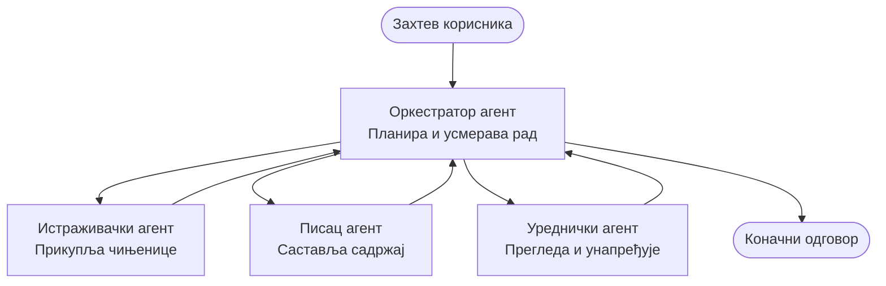

# Основе мулти-агентских система - Разместите свој први координирани AI систем

**Навигација кроз поглавља:**
- **📚 Почетна страна курса**: [AZD за почетнике](../../README.md)
- **📖 Тренутно поглавље**: Поглавље 5 - Мулти-агентска AI решења
- **⬅️ Претходно**: [Поглавље 4: Инфраструктура](../chapter-04-infrastructure/README.md)
- **➡️ Следеће**: [Обрасци координације](../chapter-06-pre-deployment/coordination-patterns.md)

> Валидација урађена са `azd 1.27.1` у јулу 2026.

## Увод

У претходним поглављима сте размештали једну апликацију—и у Поглављу 2 сте размештали једног AI агента. Ова лекција иде корак даље: размештање **мулти-агентског система**, где неколико специјализованих агената ради заједно на решавању проблема који један агент сам не би могао добро да реши.

Добра вест за почетнике: **не требају вам нове команде.** Мулти-агентско решење је и даље azd пројекат. Урадићете `azd init`, `azd up`, тестирати, и `azd down`—тачно онакав ток рада који већ познајете. Оно што се мења је *облик* апликације изнутра.

## Циљеви учења

До краја ове лекције ћете:
- Разумети шта "мулти-агентско" значи и када вреди додатна сложеност
- Препознати уобичајене улоге у мулти-агентском систему (оркестратор + специјалисти)
- Разместити прави, функционални мулти-агентски шаблон уз `azd up`
- Разумети Azure ресурсе који подупиру мулти-агентску апликацију
- Знати како безбедно проверити, прилагодити и уклонити решење

## Исходи учења

Након завршетка лекције моћи ћете да:
- Објасните разлику између једног агента и мулти-агентског система
- Изаберете између једног агента са алатима и правог мулти-агентског дизајна
- Разместите и тестирате мулти-агентски шаблон од почетка до краја са azd
- Препознате где се сваки агент извршава и како комуницирају
- Очистите све ресурсе да избегнете трошкове

---

## Шта је мулти-агентски систем?

Један AI агент је један модел са скупом инструкција и (опционо) неким алатима. То добро функционише за фокусиране задатке. Али како задатак расте—истраживање, затим писање, затим уређивање, па проверa чињеница—сви задаци у једном упиту чине агента споријим, мање поузданим и тежим за дебаговање.

**Мулти-агентски систем** раздваја посао на специјалисте који сваки добро обавља један део, уз координацију orkестратора:



### Увек ћете видети две улоге

| Улога | Посао | Пример |
|------|-------|---------|
| **Оркестратор** | Одлучује *шта следи* и усмерава посао између агената | "Прво истражи, онда пиши, па уреди" |
| **Специјалиста** | Обавља један фокусиран задатак и враћа резултат | "истраживач" који само прикупља чињенице |

### Да ли вам стварно треба више агената?

Почните једноставно. Користите мулти-агентски систем **само** када је једно од следећег тачно:

- ✅ Задатак има **различите фазе** које користе различите инструкције (истраживање, писање, преглед)
- ✅ Желите да специјалисти раде **паралелно** да бисте уштедели време
- ✅ Различити кораци захтевају **различите алате или изворе података**
- ✅ Желите да сваки корак буде **независно тестабилан и проверљив**

Ако је ваш задатак једно питање-и-одговор или једноставан позив алата, **један агент са алатима** (Поглавље 2) је једноставнији, јефтинији и лакши за коришћење.

> **Савет за почетнике:** "Више агената" није "боље." Сваки агент додаје латенцију, трошкове, и нову ствар за праћење. Додајте агенте само ако се проблем јасно раздваја на делове.

---

## Два начина за изградњу мулти-агентског система на Azure

| Приступ | Шта је | Најбоље за |
|----------|---------|----------|
| **Један агент + алати** | Један Foundry агент који позива функције/алате | Једноставни токови рада, почетна фаза |
| **Више координисаних агената** | Несколико агената са оркестратором | Различите фазе, паралелни рад, специјализација |

Ова лекција је фокусирана на други приступ користећи **спреман шаблон**, да бисте могли видети прави мулти-агентски систем у раду пре него што направите свој.

---

## Практично: Распоредите радну мулти-агентску апликацију

Разместићемо **Contoso Creative Writer**, званични Azure пример који користи више агената (истраживач, писац, уредник) координисаних да произведу чланак. Одлична је прва мулти-агентска апликација јер су улоге лаке за разумети.

### Корак 1: Иницијализација шаблона

```bash
# Направите радну фасциклу
mkdir creative-writer && cd creative-writer

# Иницијализујте из званичног мулти-агент шаблона
azd init --template contoso-creative-writer
```

> Прегледајте више мулти-агентских шаблона кад год желите у [Awesome AZD AI галерији](https://azure.github.io/awesome-azd/?tags=ai). Друге опције погодне за почетнике укључују `get-started-with-ai-agents` и `azure-ai-travel-agents`.

### Корак 2: Аутентификација

```bash
# Потребно за azd токове рада
azd auth login
```

### Корак 3: Креирање окружења

```bash
azd env new dev
```

### Корак 4: Преглед, затим размештање

```bash
# Погледајте шта ће бити креирано пре него што нешто потрошите (препоручено)
azd provision --preview

# Обезбедите инфраструктуру и поставите све агенте у једном кораку
azd up
```

`azd up` ће вас питати за претплату и регион, затим ће обезбедити Azure ресурсе и разместити апликацију. AI размештања могу трајати дуже од једноставних веб апликација—ако размешћујете веће моделе, можете продужити време за размештање:

```bash
azd deploy --timeout 1800
```

> **Напомена о трошковима и капацитету:** Мулти-агентске апликације размештају AI моделе који троше квоту и доносе трошкове. Ако `azd up` не успе због квоте модела, погледајте [AI Решавање проблема](../chapter-07-troubleshooting/ai-troubleshooting.md) за исправке региона и квоте, и Поглавље 6 [Планирање капацитета](../chapter-06-pre-deployment/capacity-planning.md).

---

## Разумевање онога што сте разместили

Типична мулти-агентска апликација као ова обезбеђује комплет Azure ресурса који директно одговарају одговорностима на горњој шеми:

| Ресурс | Зашто је ту |
|---------|--------------|
| **Microsoft Foundry / Модели** | Домаћин језичких модела које сваки агент користи |
| **Azure AI Search** | Даје агенту истраживачу основне податке за претрагу |
| **Container Apps** (или App Service) | Домаћин кода оркестратора и агената |
| **Cosmos DB** (у неким примерима) | Чува заједничко стање/памет које се преноси између агената |
| **Application Insights** | Праћење захтева *између* агената да бисте могли дебаговати проток |

### Како агенти комуницирају једни са другим

У већини azd мулти-агент примера, **оркестратор ради у вашем апликацијском коду** (на пример, користећи фрејмворк као Semantic Kernel или Microsoft Agent Framework). Оркестратор позива сваки специјализовани агент узастопно, прослеђује резултате и саставља финални одговор. Агенти деле контекст путем:

- **Позиви функција/алата** — оркестратор позива специјалисту и добија резултат назад
- **Заједничка меморија** — база података (често Cosmos DB) чува стање које оба агента могу читати
- **Поруке/догађаји** — за лабавију везу, агенти комуницирају преко реда или Service Bus-а

> **Зашто је ово важно за дебаговање:** јер је сваки корак одвојен, Application Insights вам показује *који* агент је био спор или није успео. То је један од главних разлога зашто је корисно раздвајати задатке између агената.

---

## Потврдите размештање

Потврдите да систем заиста ради пре него што наставите:

```bash
# Прикажи имплементиране крајње тачке
azd show

# Отвори контролну таблу за праћење апликације
azd monitor

# Прати записе у случају да нешто изгледа необично
azd monitor --logs
```

Затим отворите URL апликације који добијете из `azd show` и покушајте захтев који укључује све агенте (за Creative Writer, затражите да напише кратак чланак о некој теми). У Application Insights **тражи транзакције**, требало би да видите како се захтев шири преко корака истраживача, писца и уредника.

**Критеријуми успеха:**
- ✅ `azd show` приказује достижну тачку
- ✅ Захтев производи резултат који је јасно прошао кроз више фаза
- ✅ Application Insights приказује трагове више агената

---

## Прилагодите: Додајте или подесите агента

Пошто је сваки агент само скуп инструкција плус алати, прилагођавање је приступачно:

1. **Пронађите дефиниције агената** у шаблону (често у фолдерима `prompts/`, `agents/`, или фајловима са наставком `*.prompty`).
2. **Подесите упутства агента** — на пример, наредите уреднику да примењује одређени тон или број речи.
3. **Поново разместите само код** (инфраструктура остаје иста):

   ```bash
   azd deploy
   ```

За напреднију употребу, направите агенте из *својих* манифеста користећи agent extension и његов комплетан животни циклус:

```bash
azd extension install azure.ai.agents
azd ai agent init -m agent-manifest.yaml
azd up
azd ai agent invoke      # тест, са временом одговора
```

Погледајте [Поглавље 2: Агенти](../chapter-02-ai-development/agents.md) и [AZD AI CLI референцу](../chapter-08-production/production-ai-practices.md#azd-ai-cli-commands-and-extensions) за комплетан животни циклус агената (`invoke`, `eval generate`, `optimize`, `delete`).

---

## Чишћење

Мулти-агентске апликације користе више ресурса који се наплаћују. Уклоните све када завршите:

```bash
azd down --force --purge
```

Параметар `--purge` такође уклања меко обрисане AI ресурсе (као што су Foundry/Azure AI Services налози) како не би блокирали поновно размештање у будућности или наставили да доносе трошкове.

---

## Напомена о продукционим мулти-агентским системима

[Retail Multi-Agent Solution](../../examples/retail-scenario.md) у овом репозиторијуму је **архитектонски план**, а не једнокомандни шаблон—документира како би се продукциони систем за малопродају *градио* (и јасно наводи да је пуна изградња значајан напор). Користите га као референцу за дизајн *након* што сте разместили радни пример овде. За питања продукције (отпорност, трошкови, надзор, управљање), наставите са [Поглавље 8: Продукционе AI праксе](../chapter-08-production/production-ai-practices.md).

---

## Резиме

- Мулти-агентски систем дели посао између специјалиста координисаних оркестратором.
- Користите га само кад задатак има различите фазе, паралелизам, или различите алате по кораку—иначе дајте предност једном агенту.
- Ток рада azd је непромењен: `azd init` → `azd up` → тест → `azd down`.
- Прави шаблон као `contoso-creative-writer` вам данас омогућава да видите и прилагодите радну мулти-агентску апликацију.
- Праћење помоћу Application Insights преко агената је једна од највећих практичних предности мулти-агентског дизајна.

---

## 🔗 Навигација

| Правец | Лекција |
|---------|--------|
| **Претходно** | [Поглавље 4: Инфраструктура](../chapter-04-infrastructure/README.md) |
| **Следеће** | [Обрасци координације](../chapter-06-pre-deployment/coordination-patterns.md) |

## 📖 Повезани ресурси

- [Водич за AI агенте](../chapter-02-ai-development/agents.md)
- [Обрасци координације](../chapter-06-pre-deployment/coordination-patterns.md)
- [Продукционе AI праксе](../chapter-08-production/production-ai-practices.md)
- [Решавање AI проблема](../chapter-07-troubleshooting/ai-troubleshooting.md)

---

<!-- CO-OP TRANSLATOR DISCLAIMER START -->
**Изјава о одрицању одговорности**:
Овај документ је преведен коришћењем услуге за аутоматски превод [Co-op Translator](https://github.com/Azure/co-op-translator). Иако тежимо тачности, имајте у виду да аутоматски преводи могу садржати грешке или нетачности. Оригинални документ на његовом изворном језику треба сматрати ауторитативним извором. За критичне информације препоручује се професионални људски превод. Нисмо одговорни за било каква неспоразума или погрешна тумачења која произилазе из коришћења овог превода.
<!-- CO-OP TRANSLATOR DISCLAIMER END -->