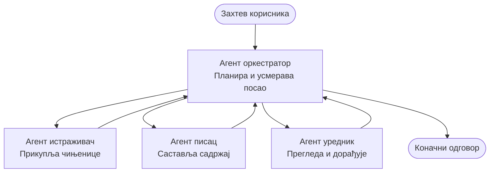

# Основе вишeагентских система - Распоредите свој први координирани AI систем

**Навигација поглављем:**
- **📚 Почетна курса**: [AZD For Beginners](../../README.md)
- **📖 Тренутно поглавље**: Поглавље 5 - Решења са више агената
- **⬅️ Претходно**: [Chapter 4: Infrastructure](../chapter-04-infrastructure/README.md)
- **➡️ Следеће**: [Coordination Patterns](../chapter-06-pre-deployment/coordination-patterns.md)

> Проверено против `azd 1.25.6` у јуну 2026.

## Увод

У ранијим поглављима сте распоредили једну апликацију—и у Поглављу 2 распоредили сте једног AI агента. Ова лекција чини следећи корак: распоређивање **вишеагентског система**, где неколико специјализованих агената сарађује да реши проблем који један агент сам не би могао добро да обави.

Добра вест за почетнике: **не требају вам нове команде.** Вишеагентско решење је и даље azd пројекат. Урадите `azd init`, `azd up`, тестирате и `azd down`—упркос томе, радни ток који већ знате остаје исти. Оно што се мења је *облик* апликације унутар пројекта.

## Циљеви учења

До краја ове лекције, моћи ћете да:
- Разумете шта значи „вишеагентско“ и када вреди додатна сложеност
- Препознате уобичајене улоге у вишеагентском систему (оркестратор + специјалисти)
- Распоредите радни вишеагентски шаблон помоћу `azd up`
- Разумете Azure ресурсе који подржавају вишеагентску апликацију
- Знате како да верификујете, прилагодите и безопасно уклоните решење

## Исходи учења

Након завршетка ове лекције, моћи ћете да:
- Објасните разлику између једног агента и вишеагентског система
- Изаберете између једног агента са алатима и истинског вишеагентског дизајна
- Распоредите и тестирате вишеагентски шаблон крај до краја помоћу azd
- Идентификујете где сваки агент ради и како комуницирају
- Очистите све ресурсе како бисте избегли сталне трошкове

---

## Шта је вишеагентски систем?

Један AI агент је један модел са скупом инструкција и (опционално) неким алатима. То добро функционише за фокусиране задатке. Али како задатак расте—истраживање, па писање, па уређивање, па провера чињеница—угуравање свега у један промпт чини агента споријим, мање поузданим и тежим за дебаговање.

Вишеагентски систем разлаже посао на специјалисте који сваки обављају један посао добро, координирани од стране оркестратора:



### Две улоге које ћете увек видети

| Улога | Задатак | Пример |
|------|-----|---------|
| **Оркестратор** | Одлучује *шта се следеће дешава* и усмерава посао између агената | "First research, then write, then edit" |
| **Специјалиста** | Обавља један фокусирани задатак и враћа резултат | "researcher" који само прикупља чињенице |

### Да ли вам заиста требају више агената?

Почните једноставно. На вишеагентске приступе се окрените **само** када важи једно од следећег:

- ✅ Задатак има **одвојене фазе** које добијају на користи од различитих инструкција (истраживање против писања против ревизије)
- ✅ Желите да специјалисти раде **паралелно** како бисте уштедели време
- ✅ Различити кораци захтевају **различите алате или изворе података**
- ✅ Потребно вам је да сваки корак буде **независно тестирајем и дебагабилан**

Ако је ваш задатак једно питање-одговор или једноставан позив алату, **један агент са алатима** (Поглавље 2) је једноставнији, јефтинији и лакши за управљање.

> **Савет за почетнике:** "Више агената" није исто што и "боље." Сваки агент додаје латенцију, трошак и нову ствар за праћење. Додајте агенте само када се проблем јасно подели на делове.

---

## Два начина изградње вишеагентског на Azure

| Приступ | Шта је то | Најбоље за |
|----------|-----------|----------|
| **Један агент + алати** | Један Foundry агент који позива функције/алате | Једноставни радни токови, почетак рада |
| **Више координираних агената** | Неколико агената са оркестратором | Одвојене фазе, паралелни рад, специјализација |

Ова лекција се фокусира на други приступ користећи **готови шаблон**, тако да можете видети прави вишеагентски систем у раду пре него што направите свој.

---

## Практично: Распоредите радну вишеагентску апликацију

Распоређиваћемо **Contoso Creative Writer**, званични Azure пример који користи више агената (истраживач, писац, уредник) координираних да произведу чланак. То је одлична прва вишеагентска апликација јер су улоге лаке за разумевање.

### Корак 1: Иницијализујте шаблон

```bash
# Креирај радни фолдер
mkdir creative-writer && cd creative-writer

# Иницијализуј из званичног шаблона за више агената
azd init --template contoso-creative-writer
```

> Претражите више вишеагентских шаблона у било ком тренутку у [галерији Awesome AZD AI](https://azure.github.io/awesome-azd/?tags=ai). Друге опције погодне за почетнике укључују `get-started-with-ai-agents` и `azure-ai-travel-agents`.

### Корак 2: Аутентификација

```bash
# Потребно за azd радне токове
azd auth login
```

### Корак 3: Креирајте окружење

```bash
azd env new dev
```

### Корак 4: Прегледајте, па распорeдите

```bash
# Погледајте шта ће бити креирано пре него што потрошите било шта (препоручено)
azd provision --preview

# Обезбедите инфраструктуру и поставите све агенте у једном кораку
azd up
```

`azd up` ће тражити претплату и регију, затим обезбедити Azure ресурсе и распоредити апликацију. AI распоредања могу трајати дуже него једноставна веб апликација—ако распорeђујете веће моделе, можете продужити време чекања за деплој:

```bash
azd deploy --timeout 1800
```

> **Напомена о трошковима и капацитету:** Вишеагентске апликације распореде AI моделе који троше квоту и генеришу трошак. Ако `azd up` не успе због квоте модела, погледајте [Решавање проблема са AI](../chapter-07-troubleshooting/ai-troubleshooting.md) за исправке региона и квота, и Поглавље 6 [Планирање капацитета](../chapter-06-pre-deployment/capacity-planning.md).

---

## Разумевање онога што сте распоредили

Типична вишеагентска апликација као ова обезбеђује низ Azure ресурса који се директно мапирају на одговорности у дијаграму изнад:

| Ресурс | Зашто је ту |
|----------|----------------|
| **Microsoft Foundry / Models** | Домаћин језичких модела које сваки агент користи |
| **Azure AI Search** | Даје истраживачком агенту основе података за претрагу |
| **Container Apps** (или App Service) | Домаћин оркестратора и кода агената |
| **Cosmos DB** (у неким примерима) | Чува заједничко стање/меморију која се прослеђује између агената |
| **Application Insights** | Праћење захтева *преко* агената да бисте могли дебаговати ток |

### Како агенти комуницирају међусобно

У већини azd вишеагентских примера, **оркестратор ради у вашем апликацијском коду** (на пример, користећи оквир као Semantic Kernel или Microsoft Agent Framework). Оркестратор позива сваког специјалистичког агента редом, прослеђује резултате и саставља коначан одговор. Агенти деле контекст кроз:

- **Позиве функција/алата** — оркестратор позива специјалисту и добија резултат назад
- **Заједничку меморију** — база података (често Cosmos DB) чува стање које оба агента могу читати
- **Поруке/догађаје** — за лабавије повезивање, агенти комуницирају преко реда или Service Bus

> **Зашто је ово важно за дебаговање:** зато што је сваки корак одvojen, Application Insights вам показује *који* агент је био спор или није успео. То је главни разлог да поделите посао између агената.

---

## Потврдите распоређивање

Потврдите да систем заиста ради пре него што наставите:

```bash
# Прикажи распоређене крајње тачке
azd show

# Отвори надзорну таблу апликације
azd monitor

# Прати логове ако нешто делује погрешно
azd monitor --logs
```

Затим отворите URL апликације из `azd show` и испробајте захтев који активира све агенте (за Creative Writer, затражите да напише кратак чланак на неку тему). У **претраги трансакција** у Application Insights требало би да видите како се захтев раштркава преко корака истраживача, писца и уредника.

**Критеријуми успеха:**
- ✅ `azd show` наводи достижан крајњи пункт
- ✅ Захтев производи резултат који јасно пролази кроз више фаза
- ✅ Application Insights показује трагове за више од једног корака агента

---

## Прилагодите: Додајте или подесите агента

Пошто је сваки агент само инструкције плус алати, прилагођавање је приступачно:

1. **Пронађите дефиниције агената** у шаблону (често `prompts/`, `agents/`, или `*.prompty` скуп фајлова).
2. **Подесите инструкције агента** — на пример, наредите уредничком агенту да примењује специфичан тон или број речи.
3. **Поново распоредите само код** (инфраструктура остаје непромењена):

   ```bash
   azd deploy
   ```

Да бисте наставили даље и изградили агенте из свог *сопственог* манифеста, користите агент екстензију и њен пун животни циклус:

```bash
azd extension install azure.ai.agents
azd ai agent init -m agent-manifest.yaml
azd up
azd ai agent invoke      # тест, са временом одговора
```

Погледајте [Поглавље 2: Агенти](../chapter-02-ai-development/agents.md) и [AZD AI CLI референцу](../chapter-08-production/production-ai-practices.md#azd-ai-cli-commands-and-extensions) за комплетан животни циклус агената (`invoke`, `eval generate`, `optimize`, `delete`).

---

## Чишћење

Вишеагентске апликације покрећу више наплативих услуга. Скините све када завршите:

```bash
azd down --force --purge
```

Флаг `--purge` такође уклања ресурсe AI који су меко избрисани (као Foundry/Azure AI Services налози) тако да не блокирају будуће распоређивање или наставак трошкова.

---

## Напомена о продукцијским вишеагентским системима

[Retail Multi-Agent Solution](../../examples/retail-scenario.md) у овом репозиторијуму је **архитектонски план**, а не шаблон који се покреће једном командом—документира како би производни малопродајни систем *био* изграђен (и јасно наводи да је комплетна изградња значајан напор). Користите га као референцу дизајна *након* што сте распоредили радни пример овде. За проблеме у продукцији (отпорност, трошкови, надгледање, управљање), наставите на [Поглавље 8: Праксе продукцијског AI](../chapter-08-production/production-ai-practices.md).

---

## Резиме

- Вишеагентски систем дели посао међу специјалистима координираним од стране оркестратора.
- Користите га само када задатак има одвојене фазе, паралелизам или различите алате по кораку—иначе преферирајте једног агента.
- azd радни ток се не мења: `azd init` → `azd up` → тест → `azd down`.
- Реалан шаблон као `contoso-creative-writer` омогућава вам да данас видите и прилагодите радну вишеагентску апликацију.
- Трасирање у Application Insights преко агената је једна од највећих практичних предности вишеагентског дизајна.

---

## 🔗 Навигација

| Правец | Лекција |
|-----------|--------|
| **Претходно** | [Chapter 4: Infrastructure](../chapter-04-infrastructure/README.md) |
| **Следеће** | [Coordination Patterns](../chapter-06-pre-deployment/coordination-patterns.md) |

## 📖 Повезани ресурси

- [Водич за AI агенте](../chapter-02-ai-development/agents.md)
- [Обрасци координације](../chapter-06-pre-deployment/coordination-patterns.md)
- [Праксе продукцијског AI](../chapter-08-production/production-ai-practices.md)
- [Решавање проблема са AI](../chapter-07-troubleshooting/ai-troubleshooting.md)

---

<!-- CO-OP TRANSLATOR DISCLAIMER START -->
**Изјава о одрицању одговорности**:
Овај документ је преведен коришћењем услуге за аутоматски превод [Co-op Translator](https://github.com/Azure/co-op-translator). Иако тежимо тачности, имајте у виду да аутоматски преводи могу садржати грешке или нетачности. Оригинални документ на његовом изворном језику треба сматрати ауторитативним извором. За критичне информације препоручује се професионални људски превод. Нисмо одговорни за било каква неспоразума или погрешна тумачења која произилазе из коришћења овог превода.
<!-- CO-OP TRANSLATOR DISCLAIMER END -->