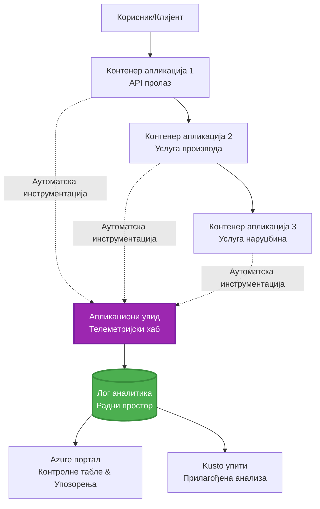
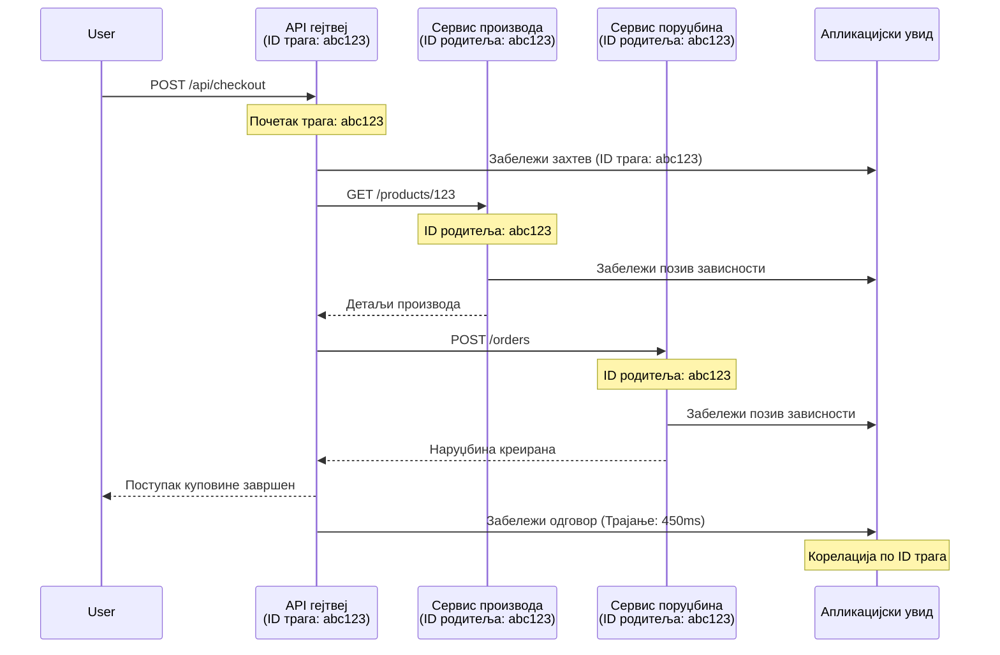

# Интеграција Application Insights са AZD

⏱️ **Процењено време**: 40-50 минута | 💰 **Утицај на трошкове**: ~$5-15/месечно | ⭐ **Сложеност**: Средњи

**📚 Пут учења:**
- ← Претходно: [Preflight Checks](preflight-checks.md) - Пре-поставке за деплој
- 🎯 **Ту сте**: Интеграција Application Insights (Надгледање, телеметрија, дебаговање)
- → Следеће: [Deployment Guide](../chapter-04-infrastructure/deployment-guide.md) - Деплој на Azure
- 🏠 [Course Home](../../README.md)

---

## Шта ћете научити

Завршетком ове лекције, ви ћете:
- Интегрисати **Application Insights** у AZD пројекте аутоматски
- Конфигурисати **дистрибуирано праћење (tracing)** за микросервисе
- Имплементирати **прилагођену телеметрију** (метрике, догађаји, зависности)
- Подесити **живе метрике** за надгледање у реалном времену
- Креирати **аларме и контролне табле** из AZD деплоја
- Дебаговати проблеме у продукцији помоћу **телеметријских упита**
- Оптимизовати **трошкове и стратегије узорковања**
- Надгледати **AI/LLM апликације** (токени, латенција, трошкови)

## Зашто је Application Insights са AZD важан

### Изазов: Посматрање у продукцији

**Без Application Insights:**
```
❌ No visibility into production behavior
❌ Manual log aggregation across services
❌ Reactive debugging (wait for customer complaints)
❌ No performance metrics
❌ Cannot trace requests across services
❌ Unknown failure rates and bottlenecks
```

**Са Application Insights + AZD:**
```
✅ Automatic telemetry collection
✅ Centralized logs from all services
✅ Proactive issue detection
✅ End-to-end request tracing
✅ Performance metrics and insights
✅ Real-time dashboards
✅ AZD provisions everything automatically
```

**Аналогија**: Application Insights је као "црна кутија" за лет + инструмент табла у кокпиту за вашу апликацију. Видите све што се дешава у реалном времену и можете репродуковати било који инцидент.

---

## Преглед архитектуре

### Application Insights у AZD архитектури


### Шта се аутоматски надгледа

| Telemetry Type | What It Captures | Use Case |
|----------------|------------------|----------|
| **Захтеви** | HTTP захтеви, статусни кодови, трајање | Праћење перформанси API-ја |
| **Зависности** | Спољни позиви (БД, API-ји, складиште) | Препознавање уских грла |
| **Изузеци** | Нерешене грешке са стек траговима | Отлањање грешака |
| **Прилагођени догађаји** | Пословни догађаји (пријава, куповина) | Аналитика и фуњели |
| **Метрике** | Показатељи перформанси, прилагођене метрике | Планирање капацитета |
| **Трагови** | Поруке дневника са нивоом озбиљности | Отлањање грешака и ревизија |
| **Доступност** | Тестови доступности и времена одговора | Праћење SLA |

---

## Предуслови

### Потребни алати

```bash
# Проверите Azure Developer CLI
azd version
# ✅ Очекује се: azd верзија 1.0.0 или новија

# Проверите Azure CLI
az --version
# ✅ Очекује се: azure-cli 2.50.0 или новија
```

### Захтеви за Azure

- Активна претплата на Azure
- Овлашћења за креирање:
  - Application Insights ресурса
  - Log Analytics радних простора
  - Container Apps
  - Resource група

### Знања (предуслови)

Требало би да сте завршили:
- [Основе AZD](../chapter-01-foundation/azd-basics.md) - Основни AZD концепти
- [Configuration](../chapter-03-configuration/configuration.md) - Подешавање окружења
- [First Project](../chapter-01-foundation/first-project.md) - Основни деплој

---

## Лекција 1: Аутоматски Application Insights са AZD

### Како AZD провиђује Application Insights

AZD аутоматски креира и конфигурише Application Insights када деплојујете. Хајде да видимо како то ради.

### Структура пројекта

```
monitored-app/
├── azure.yaml                     # AZD configuration
├── infra/
│   ├── main.bicep                # Main infrastructure
│   ├── core/
│   │   └── monitoring.bicep      # Application Insights + Log Analytics
│   └── app/
│       └── api.bicep             # Container App with monitoring
└── src/
    ├── app.py                    # Application with telemetry
    ├── requirements.txt
    └── Dockerfile
```

---

### Корак 1: Конфигуришите AZD (azure.yaml)

**Фајл: `azure.yaml`**

```yaml
name: monitored-app
metadata:
  template: monitored-app@1.0.0

services:
  api:
    project: ./src
    language: python
    host: containerapp

# AZD automatically provisions monitoring!
```

**То је то!** AZD ће по подразумеваној поставци креирати Application Insights. Нема додатне конфигурације за основно праћење.

---

### Корак 2: Инфраструктура за надгледање (Bicep)

**Фајл: `infra/core/monitoring.bicep`**

```bicep
param logAnalyticsName string
param applicationInsightsName string
param location string = resourceGroup().location
param tags object = {}

// Log Analytics Workspace (required for Application Insights)
resource logAnalytics 'Microsoft.OperationalInsights/workspaces@2022-10-01' = {
  name: logAnalyticsName
  location: location
  tags: tags
  properties: {
    sku: {
      name: 'PerGB2018'  // Pay-as-you-go pricing
    }
    retentionInDays: 30  // Keep logs for 30 days
    features: {
      enableLogAccessUsingOnlyResourcePermissions: true
    }
  }
}

// Application Insights
resource applicationInsights 'Microsoft.Insights/components@2020-02-02' = {
  name: applicationInsightsName
  location: location
  tags: tags
  kind: 'web'
  properties: {
    Application_Type: 'web'
    WorkspaceResourceId: logAnalytics.id
    IngestionMode: 'LogAnalytics'
    publicNetworkAccessForIngestion: 'Enabled'
    publicNetworkAccessForQuery: 'Enabled'
  }
}

// Outputs for Container Apps
output logAnalyticsWorkspaceId string = logAnalytics.id
output logAnalyticsWorkspaceName string = logAnalytics.name
output applicationInsightsConnectionString string = applicationInsights.properties.ConnectionString
output applicationInsightsInstrumentationKey string = applicationInsights.properties.InstrumentationKey
output applicationInsightsName string = applicationInsights.name
```

---

### Корак 3: Повежите Container App са Application Insights

**Фајл: `infra/app/api.bicep`**

```bicep
param name string
param location string
param tags object = {}
param containerAppsEnvironmentName string
param applicationInsightsConnectionString string

resource containerApp 'Microsoft.App/containerApps@2023-05-01' = {
  name: name
  location: location
  tags: tags
  properties: {
    configuration: {
      ingress: {
        external: true
        targetPort: 8000
      }
      secrets: [
        {
          name: 'appinsights-connection-string'
          value: applicationInsightsConnectionString
        }
      ]
    }
    template: {
      containers: [
        {
          name: 'api'
          image: 'myregistry.azurecr.io/api:latest'
          resources: {
            cpu: json('0.5')
            memory: '1Gi'
          }
          env: [
            {
              name: 'APPLICATIONINSIGHTS_CONNECTION_STRING'
              secretRef: 'appinsights-connection-string'
            }
            {
              name: 'APPLICATIONINSIGHTS_ENABLED'
              value: 'true'
            }
          ]
        }
      ]
    }
  }
}

output uri string = 'https://${containerApp.properties.configuration.ingress.fqdn}'
```

---

### Корак 4: Апликацијски код са телеметријом

**Фајл: `src/app.py`**

```python
from flask import Flask, request, jsonify
from opencensus.ext.azure.log_exporter import AzureLogHandler
from opencensus.ext.azure.trace_exporter import AzureExporter
from opencensus.ext.flask.flask_middleware import FlaskMiddleware
from opencensus.trace.samplers import ProbabilitySampler
import logging
import os

app = Flask(__name__)

# Добијте Application Insights конекциони низ
connection_string = os.environ.get('APPLICATIONINSIGHTS_CONNECTION_STRING')

if connection_string:
    # Конфигуришите расподељено праћење
    middleware = FlaskMiddleware(
        app,
        exporter=AzureExporter(connection_string=connection_string),
        sampler=ProbabilitySampler(rate=1.0)  # 100% узорковање за развој
    )
    
    # Конфигуришите логовање
    logger = logging.getLogger(__name__)
    logger.addHandler(AzureLogHandler(connection_string=connection_string))
    logger.setLevel(logging.INFO)
    
    print("✅ Application Insights enabled")
else:
    logger = logging.getLogger(__name__)
    logger.setLevel(logging.INFO)
    print("⚠️ Application Insights not configured")

@app.route('/health')
def health():
    logger.info('Health check endpoint called')
    return jsonify({'status': 'healthy', 'monitoring': 'enabled'})

@app.route('/api/products')
def get_products():
    logger.info('Fetching products')
    
    # Симулирајте позив базе података (аутоматски праћено као зависност)
    products = [
        {'id': 1, 'name': 'Laptop', 'price': 999.99},
        {'id': 2, 'name': 'Mouse', 'price': 29.99},
        {'id': 3, 'name': 'Keyboard', 'price': 79.99}
    ]
    
    logger.info(f'Returned {len(products)} products')
    return jsonify(products)

@app.route('/api/error-test')
def error_test():
    """Test error tracking"""
    logger.error('Testing error tracking')
    try:
        raise ValueError('This is a test exception')
    except Exception as e:
        logger.exception('Exception occurred in error-test endpoint')
        return jsonify({'error': str(e)}), 500

@app.route('/api/slow')
def slow_endpoint():
    """Test performance tracking"""
    import time
    logger.info('Slow endpoint called')
    time.sleep(3)  # Симулирајте спору операцију
    logger.warning('Endpoint took 3 seconds to respond')
    return jsonify({'message': 'Slow operation completed'})

if __name__ == '__main__':
    app.run(host='0.0.0.0', port=8000)
```

**Фајл: `src/requirements.txt`**

```txt
Flask==3.0.0
opencensus-ext-azure==1.1.13
opencensus-ext-flask==0.8.1
gunicorn==21.2.0
```

---

### Корак 5: Деплој и верификација

```bash
# Иницијализујте AZD
azd init

# Распоредите (аутоматски обезбеђује Application Insights)
azd up

# Добијте URL апликације
APP_URL=$(azd env get-values | grep API_URL | cut -d '=' -f2 | tr -d '"')

# Генеришите телеметрију
curl $APP_URL/health
curl $APP_URL/api/products
curl $APP_URL/api/error-test
curl $APP_URL/api/slow
```

**✅ Очекујани излаз:**
```json
{
  "status": "healthy",
  "monitoring": "enabled"
}
```

---

### Корак 6: Погледајте телеметрију у Azure порталу

```bash
# Добијте детаље о Application Insights
azd env get-values | grep APPLICATIONINSIGHTS

# Отворите у Azure порталу
az monitor app-insights component show \
  --app $(azd env get-values | grep APPLICATIONINSIGHTS_NAME | cut -d '=' -f2 | tr -d '"') \
  --resource-group $(azd env get-values | grep AZURE_RESOURCE_GROUP | cut -d '=' -f2 | tr -d '"') \
  --query "appId" -o tsv
```

**Отидите у Azure портал → Application Insights → Transaction Search**

Требало би да видите:
- ✅ HTTP захтеве са статусним кодовима
- ✅ Трајање захтева (3+ секунде за `/api/slow`)
- ✅ Детаље о изузецима из `/api/error-test`
- ✅ Прилагођене поруке дневника

---

## Лекција 2: Прилагођена телеметрија и догађаји

### Праћење пословних догађаја

Додајмо прилагођену телеметрију за критичне пословне догађаје.

**Фајл: `src/telemetry.py`**

```python
from opencensus.ext.azure import metrics_exporter
from opencensus.stats import aggregation as aggregation_module
from opencensus.stats import measure as measure_module
from opencensus.stats import stats as stats_module
from opencensus.stats import view as view_module
from opencensus.tags import tag_map as tag_map_module
from opencensus.ext.azure.log_exporter import AzureLogHandler
from opencensus.ext.azure.trace_exporter import AzureExporter
from opencensus.trace import tracer as tracer_module
import logging
import os

class TelemetryClient:
    """Custom telemetry client for Application Insights"""
    
    def __init__(self, connection_string=None):
        self.connection_string = connection_string or os.environ.get('APPLICATIONINSIGHTS_CONNECTION_STRING')
        
        if not self.connection_string:
            print("⚠️ Application Insights connection string not found")
            return
        
        # Подешавање логера
        self.logger = logging.getLogger(__name__)
        self.logger.addHandler(AzureLogHandler(connection_string=self.connection_string))
        self.logger.setLevel(logging.INFO)
        
        # Подешавање експортера метрика
        self.stats = stats_module.stats
        self.view_manager = self.stats.view_manager
        self.stats_recorder = self.stats.stats_recorder
        
        exporter = metrics_exporter.new_metrics_exporter(
            connection_string=self.connection_string
        )
        self.view_manager.register_exporter(exporter)
        
        # Подешавање трејсера
        self.tracer = tracer_module.Tracer(
            exporter=AzureExporter(connection_string=self.connection_string)
        )
        
        print("✅ Custom telemetry client initialized")
    
    def track_event(self, event_name: str, properties: dict = None):
        """Track custom business event"""
        properties = properties or {}
        self.logger.info(
            f"CustomEvent: {event_name}",
            extra={
                'custom_dimensions': {
                    'event_name': event_name,
                    **properties
                }
            }
        )
    
    def track_metric(self, metric_name: str, value: float, properties: dict = None):
        """Track custom metric"""
        properties = properties or {}
        self.logger.info(
            f"CustomMetric: {metric_name} = {value}",
            extra={
                'custom_dimensions': {
                    'metric_name': metric_name,
                    'value': value,
                    **properties
                }
            }
        )
    
    def track_dependency(self, name: str, dependency_type: str, duration: float, success: bool):
        """Track external dependency call"""
        with self.tracer.span(name=name) as span:
            span.add_attribute('dependency.type', dependency_type)
            span.add_attribute('duration', duration)
            span.add_attribute('success', success)

# Глобални клијент за телеметрију
telemetry = TelemetryClient()
```

### Ажурирајте апликацију са прилагођеним догађајима

**Фајл: `src/app.py` (побољшано)**

```python
from flask import Flask, request, jsonify
from telemetry import telemetry
import time
import random

app = Flask(__name__)

@app.route('/api/purchase', methods=['POST'])
def purchase():
    """Track purchase event with custom telemetry"""
    data = request.json
    product_id = data.get('product_id')
    quantity = data.get('quantity', 1)
    price = data.get('price', 0)
    
    # Пратити пословни догађај
    telemetry.track_event('Purchase', {
        'product_id': product_id,
        'quantity': quantity,
        'total_amount': price * quantity,
        'user_id': request.headers.get('X-User-Id', 'anonymous')
    })
    
    # Пратити метрику прихода
    telemetry.track_metric('Revenue', price * quantity, {
        'product_id': product_id,
        'currency': 'USD'
    })
    
    return jsonify({
        'order_id': f'ORD-{random.randint(1000, 9999)}',
        'status': 'confirmed',
        'total': price * quantity
    })

@app.route('/api/search')
def search():
    """Track search queries"""
    query = request.args.get('q', '')
    
    start_time = time.time()
    
    # Симулирати претрагу (била би стварна претрага у бази података)
    results = [{'id': 1, 'name': f'Result for {query}'}]
    
    duration = (time.time() - start_time) * 1000  # Претворити у ms
    
    # Пратити догађај претраге
    telemetry.track_event('Search', {
        'query': query,
        'results_count': len(results),
        'duration_ms': duration
    })
    
    # Пратити метрику перформанси претраге
    telemetry.track_metric('SearchDuration', duration, {
        'query_length': len(query)
    })
    
    return jsonify({'results': results, 'count': len(results)})

@app.route('/api/external-call')
def external_call():
    """Track external API dependency"""
    import requests
    
    start_time = time.time()
    success = True
    
    try:
        # Симулирати позив спољашњег API-ја
        response = requests.get('https://api.example.com/data', timeout=5)
        result = response.json()
    except Exception as e:
        success = False
        result = {'error': str(e)}
    
    duration = (time.time() - start_time) * 1000
    
    # Пратити зависност
    telemetry.track_dependency(
        name='ExternalAPI',
        dependency_type='HTTP',
        duration=duration,
        success=success
    )
    
    return jsonify(result)

if __name__ == '__main__':
    app.run(host='0.0.0.0', port=8000)
```

### Тестирајте прилагођену телеметрију

```bash
# Пратити догађај куповине
curl -X POST $APP_URL/api/purchase \
  -H "Content-Type: application/json" \
  -H "X-User-Id: user123" \
  -d '{"product_id": 1, "quantity": 2, "price": 29.99}'

# Пратити догађај претраге
curl "$APP_URL/api/search?q=laptop"

# Пратити спољну зависност
curl $APP_URL/api/external-call
```

**Погледајте у Azure порталу:**

Отидите у Application Insights → Logs, затим покрените:

```kusto
// View purchase events
traces
| where customDimensions.event_name == "Purchase"
| project 
    timestamp,
    product_id = tostring(customDimensions.product_id),
    total_amount = todouble(customDimensions.total_amount),
    user_id = tostring(customDimensions.user_id)
| order by timestamp desc

// View revenue metrics
traces
| where customDimensions.metric_name == "Revenue"
| summarize TotalRevenue = sum(todouble(customDimensions.value)) by bin(timestamp, 1h)
| render timechart

// View search performance
traces
| where customDimensions.event_name == "Search"
| summarize 
    AvgDuration = avg(todouble(customDimensions.duration_ms)),
    SearchCount = count()
  by bin(timestamp, 5m)
| render timechart
```

---

## Лекција 3: Дистрибуирано праћење за микросервисе

### Омогућите праћење преко сервиса

За микросервисе, Application Insights аутоматски корелира захтеве преко сервиса.

**Фајл: `infra/main.bicep`**

```bicep
targetScope = 'subscription'

param environmentName string
param location string = 'eastus'

var tags = { 'azd-env-name': environmentName }

resource rg 'Microsoft.Resources/resourceGroups@2021-04-01' = {
  name: 'rg-${environmentName}'
  location: location
  tags: tags
}

// Monitoring (shared by all services)
module monitoring './core/monitoring.bicep' = {
  name: 'monitoring'
  scope: rg
  params: {
    logAnalyticsName: 'log-${environmentName}'
    applicationInsightsName: 'appi-${environmentName}'
    location: location
    tags: tags
  }
}

// API Gateway
module apiGateway './app/api-gateway.bicep' = {
  name: 'api-gateway'
  scope: rg
  params: {
    name: 'ca-gateway-${environmentName}'
    location: location
    tags: union(tags, { 'azd-service-name': 'gateway' })
    applicationInsightsConnectionString: monitoring.outputs.applicationInsightsConnectionString
  }
}

// Product Service
module productService './app/product-service.bicep' = {
  name: 'product-service'
  scope: rg
  params: {
    name: 'ca-products-${environmentName}'
    location: location
    tags: union(tags, { 'azd-service-name': 'products' })
    applicationInsightsConnectionString: monitoring.outputs.applicationInsightsConnectionString
  }
}

// Order Service
module orderService './app/order-service.bicep' = {
  name: 'order-service'
  scope: rg
  params: {
    name: 'ca-orders-${environmentName}'
    location: location
    tags: union(tags, { 'azd-service-name': 'orders' })
    applicationInsightsConnectionString: monitoring.outputs.applicationInsightsConnectionString
  }
}

output APPLICATIONINSIGHTS_CONNECTION_STRING string = monitoring.outputs.applicationInsightsConnectionString
output GATEWAY_URL string = apiGateway.outputs.uri
```

### Погледајте крај-до-крај трансакцију


**Упит за крај-до-крај трагу:**

```kusto
// Find complete request flow
let traceId = "abc123...";  // Get from response header
dependencies
| union requests
| where operation_Id == traceId
| project 
    timestamp,
    type = itemType,
    name,
    duration,
    success,
    cloud_RoleName
| order by timestamp asc
```

---

## Лекција 4: Живе метрике и надгледање у реалном времену

### Омогућите Live Metrics Stream

Живе метрике пружају телеметрију у реалном времену са латенцијом <1 секунде.

**Приступ Live Metrics:**

```bash
# Добијте ресурс Application Insights
APPI_NAME=$(azd env get-values | grep APPLICATIONINSIGHTS_NAME | cut -d '=' -f2 | tr -d '"')

# Добијте групу ресурса
RG_NAME=$(azd env get-values | grep AZURE_RESOURCE_GROUP | cut -d '=' -f2 | tr -d '"')

echo "Navigate to: Azure Portal → Resource Groups → $RG_NAME → $APPI_NAME → Live Metrics"
```

**Шта видите у реалном времену:**
- ✅ Стопа улазећих захтева (requests/sec)
- ✅ Излазећи позиви зависности
- ✅ Број изузетака
- ✅ Kоришћење CPU и меморије
- ✅ Број активних сервера
- ✅ Узорачна телеметрија

### Генеришите оптерећење за тестирање

```bash
# Генеришите оптерећење да бисте видели метрике уживо
for i in {1..100}; do
  curl $APP_URL/api/products &
  curl $APP_URL/api/search?q=test$i &
done

# Пратите метрике уживо у Azure порталу
# Требало би да видите нагли скок стопе захтева
```

---

## Практичне вежбе

### Вежба 1: Подесите аларме ⭐⭐ (Средње)

**Циљ**: Креирати аларме за висок ниво грешака и споре одговоре.

**Кораци:**

1. **Креирајте аларм за стопу грешака:**

```bash
# Добиј ИД ресурса Application Insights
APPI_ID=$(az monitor app-insights component show \
  --app $APPI_NAME \
  --resource-group $RG_NAME \
  --query "id" -o tsv)

# Креирај метричко упозорење за неуспеле захтеве
az monitor metrics alert create \
  --name "High-Error-Rate" \
  --resource-group $RG_NAME \
  --scopes $APPI_ID \
  --condition "count requests/failed > 10" \
  --window-size 5m \
  --evaluation-frequency 1m \
  --description "Alert when error rate exceeds 10 per 5 minutes"
```

2. **Креирајте аларм за споре одговоре:**

```bash
az monitor metrics alert create \
  --name "Slow-Responses" \
  --resource-group $RG_NAME \
  --scopes $APPI_ID \
  --condition "avg requests/duration > 3000" \
  --window-size 5m \
  --evaluation-frequency 1m \
  --description "Alert when average response time exceeds 3 seconds"
```

3. **Креирајте аларм преко Bicep-а (преферирано за AZD):**

**Фајл: `infra/core/alerts.bicep`**

```bicep
param applicationInsightsId string
param actionGroupId string = ''
param location string = resourceGroup().location

// High error rate alert
resource errorRateAlert 'Microsoft.Insights/metricAlerts@2018-03-01' = {
  name: 'high-error-rate'
  location: 'global'
  properties: {
    description: 'Alert when error rate exceeds threshold'
    severity: 2
    enabled: true
    scopes: [
      applicationInsightsId
    ]
    evaluationFrequency: 'PT1M'
    windowSize: 'PT5M'
    criteria: {
      'odata.type': 'Microsoft.Azure.Monitor.SingleResourceMultipleMetricCriteria'
      allOf: [
        {
          name: 'Error rate'
          metricName: 'requests/failed'
          operator: 'GreaterThan'
          threshold: 10
          timeAggregation: 'Count'
        }
      ]
    }
    actions: actionGroupId != '' ? [
      {
        actionGroupId: actionGroupId
      }
    ] : []
  }
}

// Slow response alert
resource slowResponseAlert 'Microsoft.Insights/metricAlerts@2018-03-01' = {
  name: 'slow-responses'
  location: 'global'
  properties: {
    description: 'Alert when response time is too high'
    severity: 3
    enabled: true
    scopes: [
      applicationInsightsId
    ]
    evaluationFrequency: 'PT1M'
    windowSize: 'PT5M'
    criteria: {
      'odata.type': 'Microsoft.Azure.Monitor.SingleResourceMultipleMetricCriteria'
      allOf: [
        {
          name: 'Response duration'
          metricName: 'requests/duration'
          operator: 'GreaterThan'
          threshold: 3000
          timeAggregation: 'Average'
        }
      ]
    }
  }
}

output errorAlertId string = errorRateAlert.id
output slowResponseAlertId string = slowResponseAlert.id
```

4. **Тестирајте аларме:**

```bash
# Генеришите грешке
for i in {1..20}; do
  curl $APP_URL/api/error-test
done

# Генеришите спори одговори
for i in {1..10}; do
  curl $APP_URL/api/slow
done

# Проверите статус упозорења (сачекајте 5-10 минута)
az monitor metrics alert list \
  --resource-group $RG_NAME \
  --query "[].{Name:name, Enabled:enabled, State:properties.enabled}" \
  --output table
```

**✅ Критеријуми успеха:**
- ✅ Аларми успешно креирани
- ✅ Аларми се активирају када се прекораче прагови
- ✅ Можете прегледати историју аларма у Azure порталу
- ✅ Интегрисано са AZD деплојем

**Време**: 20-25 минута

---

### Вежба 2: Креирајте прилагођену контролну таблу ⭐⭐ (Средње)

**Циљ**: Изградите контролну таблу која приказује кључне метрике апликације.

**Кораци:**

1. **Креирајте контролну таблу преко Azure портала:**

Отидите на: Azure портал → Dashboards → New Dashboard

2. **Додајте плочице за кључне метрике:**

- Број захтева (последњих 24 сата)
- Просечно време одговора
- Стопа грешака
- Топ 5 најспоријих операција
- Географска расподела корисника

3. **Креирајте контролну таблу преко Bicep-а:**

**Фајл: `infra/core/dashboard.bicep`**

```bicep
param dashboardName string
param applicationInsightsId string
param location string = resourceGroup().location

resource dashboard 'Microsoft.Portal/dashboards@2020-09-01-preview' = {
  name: dashboardName
  location: location
  properties: {
    lenses: [
      {
        order: 0
        parts: [
          // Request count
          {
            position: { x: 0, y: 0, rowSpan: 4, colSpan: 6 }
            metadata: {
              type: 'Extension/Microsoft_OperationsManagementSuite_Workspace/PartType/LogsDashboardPart'
              inputs: [
                {
                  name: 'resourceId'
                  value: applicationInsightsId
                }
                {
                  name: 'query'
                  value: '''
                    requests
                    | summarize RequestCount = count() by bin(timestamp, 1h)
                    | render timechart
                  '''
                }
              ]
            }
          }
          // Error rate
          {
            position: { x: 6, y: 0, rowSpan: 4, colSpan: 6 }
            metadata: {
              type: 'Extension/Microsoft_OperationsManagementSuite_Workspace/PartType/LogsDashboardPart'
              inputs: [
                {
                  name: 'resourceId'
                  value: applicationInsightsId
                }
                {
                  name: 'query'
                  value: '''
                    requests
                    | summarize 
                        Total = count(),
                        Failed = countif(success == false)
                    | extend ErrorRate = (Failed * 100.0) / Total
                    | project ErrorRate
                  '''
                }
              ]
            }
          }
        ]
      }
    ]
  }
}

output dashboardId string = dashboard.id
```

4. **Деплојујте контролну таблу:**

```bash
# Додај у main.bicep
module dashboard './core/dashboard.bicep' = {
  name: 'dashboard'
  scope: rg
  params: {
    dashboardName: 'dashboard-${environmentName}'
    applicationInsightsId: monitoring.outputs.applicationInsightsId
    location: location
  }
}

# Распореди
azd up
```

**✅ Критеријуми успеха:**
- ✅ Контролна табла приказује кључне метрике
- ✅ Може се причврстити на почетну страну Azure портала
- ✅ Ажурира се у реалном времену
- ✅ Деплојује се преко AZD

**Време**: 25-30 минута

---

### Вежба 3: Надгледајте AI/LLM апликацију ⭐⭐⭐ (Напредно)

**Циљ**: Праћење коришћења Azure OpenAI (токени, трошкови, латенција).

**Кораци:**

1. **Креирајте AI monitoring wrapper:**

**Фајл: `src/ai_telemetry.py`**

```python
from telemetry import telemetry
from openai import AzureOpenAI
import time

class MonitoredAzureOpenAI:
    """Azure OpenAI client with automatic telemetry"""
    
    def __init__(self, api_key, endpoint, api_version="2024-02-01"):
        self.client = AzureOpenAI(
            api_key=api_key,
            api_version=api_version,
            azure_endpoint=endpoint
        )
    
    def chat_completion(self, model: str, messages: list, **kwargs):
        """Track chat completion with telemetry"""
        start_time = time.time()
        
        try:
            # Позови Azure OpenAI
            response = self.client.chat.completions.create(
                model=model,
                messages=messages,
                **kwargs
            )
            
            duration = (time.time() - start_time) * 1000  # мс
            
            # Извучи употребу
            usage = response.usage
            prompt_tokens = usage.prompt_tokens
            completion_tokens = usage.completion_tokens
            total_tokens = usage.total_tokens
            
            # Израчунај трошак (цена GPT-4)
            prompt_cost = (prompt_tokens / 1000) * 0.03  # $0.03 по 1К токена
            completion_cost = (completion_tokens / 1000) * 0.06  # $0.06 по 1К токена
            total_cost = prompt_cost + completion_cost
            
            # Прати прилагођени догађај
            telemetry.track_event('OpenAI_Request', {
                'model': model,
                'prompt_tokens': prompt_tokens,
                'completion_tokens': completion_tokens,
                'total_tokens': total_tokens,
                'duration_ms': duration,
                'cost_usd': total_cost,
                'success': True
            })
            
            # Прати метрике
            telemetry.track_metric('OpenAI_Tokens', total_tokens, {
                'model': model,
                'type': 'total'
            })
            
            telemetry.track_metric('OpenAI_Cost', total_cost, {
                'model': model,
                'currency': 'USD'
            })
            
            telemetry.track_metric('OpenAI_Duration', duration, {
                'model': model
            })
            
            return response
            
        except Exception as e:
            duration = (time.time() - start_time) * 1000
            
            telemetry.track_event('OpenAI_Request', {
                'model': model,
                'duration_ms': duration,
                'success': False,
                'error': str(e)
            })
            
            raise
```

2. **Користите праћеног клијента:**

```python
from flask import Flask, request, jsonify
from ai_telemetry import MonitoredAzureOpenAI
import os

app = Flask(__name__)

# Иницијализуј надгледани OpenAI клијент
openai_client = MonitoredAzureOpenAI(
    api_key=os.environ['AZURE_OPENAI_API_KEY'],
    endpoint=os.environ['AZURE_OPENAI_ENDPOINT']
)

@app.route('/api/chat', methods=['POST'])
def chat():
    data = request.json
    user_message = data.get('message')
    
    # Позови са аутоматским надгледањем
    response = openai_client.chat_completion(
        model='gpt-4',
        messages=[
            {'role': 'user', 'content': user_message}
        ]
    )
    
    return jsonify({
        'response': response.choices[0].message.content,
        'tokens': response.usage.total_tokens
    })
```

3. **Упит за AI метрике:**

```kusto
// Total AI spend over time
traces
| where customDimensions.event_name == "OpenAI_Request"
| where customDimensions.success == "True"
| summarize TotalCost = sum(todouble(customDimensions.cost_usd)) by bin(timestamp, 1h)
| render timechart

// Token usage by model
traces
| where customDimensions.event_name == "OpenAI_Request"
| summarize 
    TotalTokens = sum(toint(customDimensions.total_tokens)),
    RequestCount = count()
  by Model = tostring(customDimensions.model)

// Average latency
traces
| where customDimensions.event_name == "OpenAI_Request"
| summarize AvgDuration = avg(todouble(customDimensions.duration_ms))
| project AvgDurationSeconds = AvgDuration / 1000

// Cost per request
traces
| where customDimensions.event_name == "OpenAI_Request"
| extend Cost = todouble(customDimensions.cost_usd)
| summarize 
    TotalCost = sum(Cost),
    RequestCount = count(),
    AvgCostPerRequest = avg(Cost)
```

**✅ Критеријуми успеха:**
- ✅ Сваки OpenAI позив праћен аутоматски
- ✅ Потрошња токена и трошкови видљиви
- ✅ Латенција праћена
- ✅ Могуће је подесити аларме за буџет

**Време**: 35-45 минута

---

## Оптимизација трошкова

### Стратегије узорковања

Контролишите трошкове узорковањем телеметрије:

```python
from opencensus.trace.samplers import ProbabilitySampler

# Развој: 100% узорковање
sampler = ProbabilitySampler(rate=1.0)

# Производња: 10% узорковање (смањује трошкове за 90%)
sampler = ProbabilitySampler(rate=0.1)

# Адаптивно узорковање (аутоматски се прилагођава)
from opencensus.trace.samplers import AdaptiveSampler
sampler = AdaptiveSampler()
```

**У Bicep-у:**

```bicep
resource applicationInsights 'Microsoft.Insights/components@2020-02-02' = {
  name: applicationInsightsName
  properties: {
    SamplingPercentage: 10  // 10% sampling
  }
}
```

### Чување података

```bicep
resource logAnalytics 'Microsoft.OperationalInsights/workspaces@2022-10-01' = {
  name: logAnalyticsName
  properties: {
    retentionInDays: 30  // Minimum (cheapest)
    // Options: 30, 31, 60, 90, 120, 180, 270, 365, 550, 730
  }
}
```

### Месечне процене трошкова

| Data Volume | Retention | Monthly Cost |
|-------------|-----------|--------------|
| 1 GB/month | 30 days | ~$2-5 |
| 5 GB/month | 30 days | ~$10-15 |
| 10 GB/month | 90 days | ~$25-40 |
| 50 GB/month | 90 days | ~$100-150 |

**Бесплатни план**: 5 GB/месечно укључено

---

## Контрола знања

### 1. Основна интеграција ✓

Тестирајте своје разумевање:

- [ ] **П1**: Како AZD провиђује Application Insights?
  - **О**: Аутоматски преко Bicep шаблона у `infra/core/monitoring.bicep`

- [ ] **П2**: Која окружна променљива омогућава Application Insights?
  - **О**: `APPLICATIONINSIGHTS_CONNECTION_STRING`

- [ ] **П3**: Које су три главне врсте телеметрије?
  - **О**: Захтеви (HTTP позиви), Зависности (спољни позиви), Изузеци (грешке)

**Практична провера:**
```bash
# Проверите да ли је Application Insights конфигурисан
azd env get-values | grep APPLICATIONINSIGHTS

# Проверите да ли телеметрија тече
az monitor app-insights metrics show \
  --app $APPI_NAME \
  --resource-group $RG_NAME \
  --metric "requests/count"
```

---

### 2. Прилагођена телеметрија ✓

Тестирајте своје разумевање:

- [ ] **П1**: Како пратити прилагођене пословне догађаје?
  - **О**: Користите логер са `custom_dimensions` или `TelemetryClient.track_event()`

- [ ] **П2**: Која је разлика између догађаја и метрика?
  - **О**: Догађаји су дискретна дешавања, метрике су нумеричка мерења

- [ ] **П3**: Како корелирати телеметрију преко сервиса?
  - **О**: Application Insights аутоматски користи `operation_Id` за корелацију

**Практична провера:**
```kusto
// Verify custom events
traces
| where customDimensions.event_name != ""
| summarize count() by tostring(customDimensions.event_name)
```

---

### 3. Надгледање у продукцији ✓

Тестирајте своје разумевање:

- [ ] **П1**: Шта је узорковање и зашто га користити?
  - **О**: Узорковање смањује обим података (и трошкове) тако што бележи само проценат телеметрије

- [ ] **П2**: Како подесити аларме?
  - **О**: Користите metric alerts у Bicep-у или Azure порталу на основу Application Insights метрика

- [ ] **П3**: Која је разлика између Log Analytics и Application Insights?
  - **О**: Application Insights чува податке у Log Analytics радном простору; App Insights пружа апликационо-специфичне погледе

**Практична провера:**
```bash
# Проверите конфигурацију узорковања
az monitor app-insights component show \
  --app $APPI_NAME \
  --resource-group $RG_NAME \
  --query "properties.SamplingPercentage"
```

---

## Најбоље праксе

### ✅ РАДИТЕ:

1. **Користите correlation ID-e**
   ```python
   logger.info('Processing order', extra={
       'custom_dimensions': {
           'order_id': order_id,
           'user_id': user_id
       }
   })
   ```

2. **Подесите аларме за критичне метрике**
   ```bicep
   // Error rate, slow responses, availability
   ```

3. **Користите структурирано логовање**
   ```python
   # ✅ ДОБРО: Структурисано
   logger.info('User signup', extra={'custom_dimensions': {'user_id': 123}})
   
   # ❌ ЛОШЕ: Неструктурисано
   logger.info(f'User 123 signed up')
   ```

4. **Надгледајте зависности**
   ```python
   # Аутоматски прати позиве базе података, HTTP захтеве и слично.
   ```

5. **Користите Live Metrics током деплоја**

### ❌ НЕ РАДИТЕ:

1. **Не логовајте осетљиве податке**
   ```python
   # ❌ ЛОШ
   logger.info(f'Login: {username}:{password}')
   
   # ✅ ДОБАР
   logger.info('Login attempt', extra={'custom_dimensions': {'username': username}})
   ```

2. **Не користите 100% узорковање у продукцији**
   ```python
   # ❌ Скупо
   sampler = ProbabilitySampler(rate=1.0)
   
   # ✅ Исплативо
   sampler = ProbabilitySampler(rate=0.1)
   ```

3. **Не занемарујте dead letter queues**

4. **Не заборавите да подесите лимите чувања података**

---

## Отстрањавање проблема

### Проблем: Телеметрија се не појављује

**Дијагноза:**
```bash
# Проверите да ли је низ за повезивање постављен
azd env get-values | grep APPLICATIONINSIGHTS

# Проверите логове апликације помоћу Azure Monitor-а
azd monitor --logs

# Или користите Azure CLI за Container Apps:
az containerapp logs show --name $APP_NAME --resource-group $RG_NAME --tail 50
```

**Решење:**
```bash
# Проверите низ за повезивање у апликацији Container App
az containerapp show \
  --name $APP_NAME \
  --resource-group $RG_NAME \
  --query "properties.template.containers[0].env" \
  | grep -i applicationinsights
```

---

### Проблем: Високи трошкови

**Дијагноза:**
```bash
# Провери унос података
az monitor app-insights metrics show \
  --app $APPI_NAME \
  --resource-group $RG_NAME \
  --metric "availabilityResults/count"
```

**Решење:**
- Смањите стопу узорковања
- Скратите период чувања података
- Уклоните обимно логовање

---

## Сазнајте више

### Званична документација
- [Application Insights Overview](https://learn.microsoft.com/azure/azure-monitor/app/app-insights-overview)
- [Application Insights for Python](https://learn.microsoft.com/azure/azure-monitor/app/opencensus-python)
- [Kusto Query Language](https://learn.microsoft.com/azure/data-explorer/kusto/query/)
- [AZD Monitoring](https://learn.microsoft.com/azure/developer/azure-developer-cli/monitor-your-app)

### Следећи кораци у овом курсу
- ← Претходно: [Preflight Checks](preflight-checks.md)
- → Следеће: [Deployment Guide](../chapter-04-infrastructure/deployment-guide.md)
- 🏠 [Course Home](../../README.md)

### Сродни примери
- [Azure OpenAI Example](../../../../examples/azure-openai-chat) - AI телеметрија
- [Microservices Example](../../../../examples/microservices) - Дистрибуирано праћење

---

## Резиме

**Научили сте:**
- ✅ Аутоматско провиђање Application Insights са AZD
- ✅ Прилагођена телеметрија (догађаји, метрике, зависности)
- ✅ Дистрибуирано праћење преко микросервиса
- ✅ Метрике уживо и надгледање у реалном времену
- ✅ Упозорења и контролне табле
- ✅ Надгледање AI/LLM апликација
- ✅ Стратегије оптимизације трошкова

**Кључне поуке:**
1. **AZD аутоматски обезбеђује надгледање** - Нема ручног подешавања
2. **Користите структурисано логовање** - Олакшава упите
3. **Пратите пословне догађаје** - Не само техничке метрике
4. **Пратите трошкове AI-а** - Пратите токене и потрошњу
5. **Подесите упозорења** - Будите проактивни, не реактивни
6. **Оптимизујте трошкове** - Користите узорковање и ограничења задржавања

**Следећи кораци:**
1. Завршите практичне вежбе
2. Додајте Application Insights у ваше AZD пројекте
3. Направите прилагођене контролне табле за ваш тим
4. Проучите [Водич за деплојмент](../chapter-04-infrastructure/deployment-guide.md)

---

<!-- CO-OP TRANSLATOR DISCLAIMER START -->
Одрицање одговорности:
Овај документ је преведен уз помоћ услуге за превод засноване на вештачкој интелигенцији Co-op Translator (https://github.com/Azure/co-op-translator). Иако се трудимо да превод буде тачан, имајте у виду да аутоматски преводи могу садржати грешке или нетачности. Изворни документ на свом оригиналном језику треба сматрати ауторитативним извором. За критичне информације препоручује се професионални превод који обави људски преводилац. Не сносимо одговорност за било каква непоразумевања или погрешна тумачења која произилазе из коришћења овог превода.
<!-- CO-OP TRANSLATOR DISCLAIMER END -->