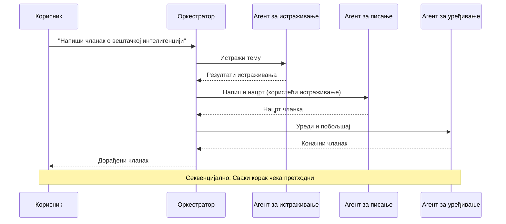
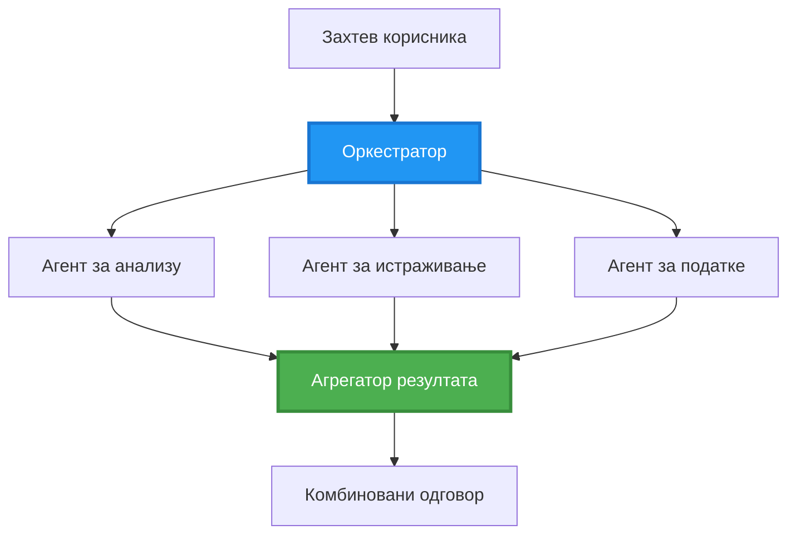
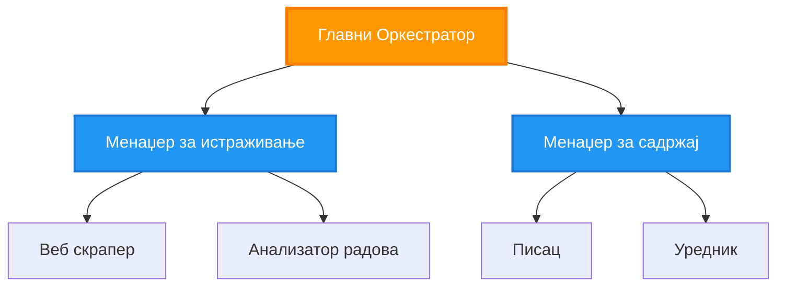
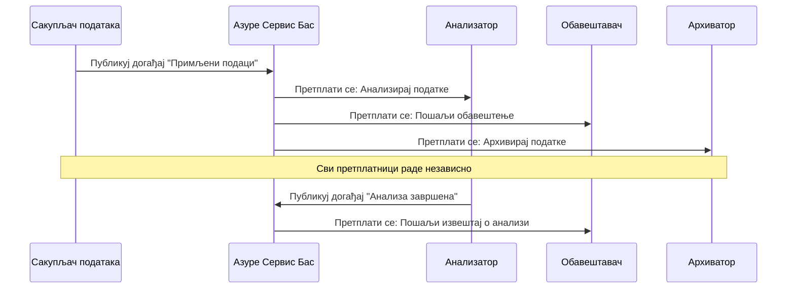
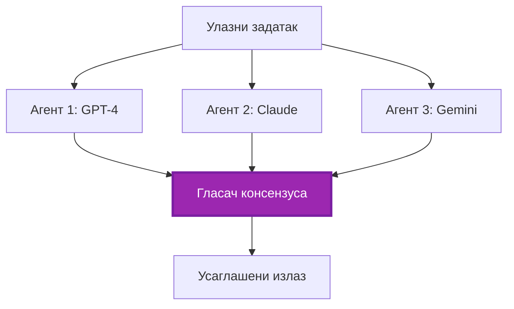
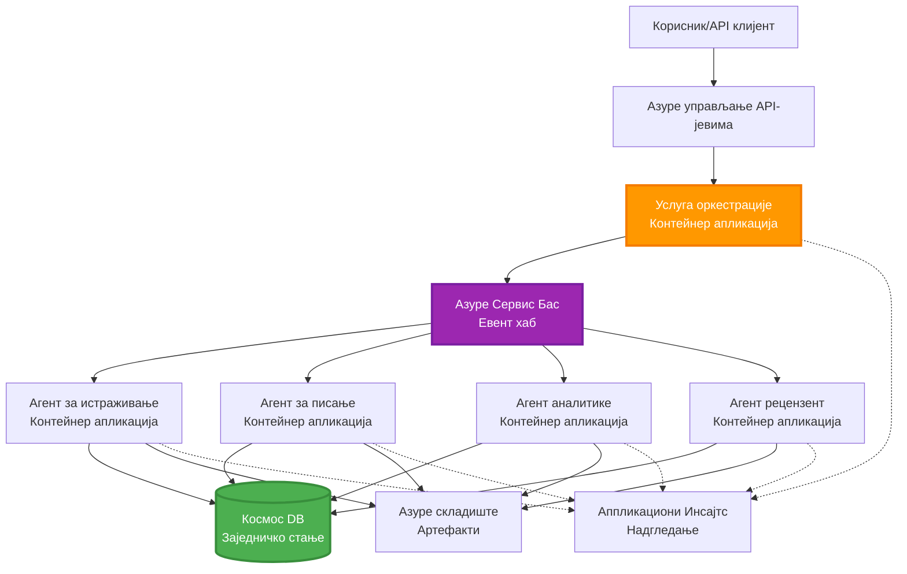

# Multi-Agent Coordination Patterns

⏱️ **Оцењено време**: 60-75 минута | 💰 **Процењени трошак**: ~$100-300/месечно | ⭐ **Комплексност**: Напредно

**📚 Пут учења:**
- ← Претходно: [Планирање капацитета](capacity-planning.md) - Величина ресурса и стратегије скалирања
- 🎯 **Тренутно сте овде**: Multi-Agent Coordination Patterns (Оркестрација, комуникација, управљање стањем)
- → Следеће: [Избор SKU](sku-selection.md) - Избор одговарајућих Azure услуга
- 🏠 [Почетна страница курса](../../README.md)

---

## Шта ћете научити

Завршетком ове лекције ћете:
- Разумети обрасце **архитектуре више агената** и када их користити
- Имплементирати **обрасце оркестрације** (централизовано, децентрализовано, хијерархијско)
- Дизајнирати стратегије **комуникације агената** (синхрона, асинхрона, вођена догађајима)
- Управљати **заједничким стањем** међу дистрибуираним агентима
- Размештати **системе са више агената** на Azure уз помоћ AZD
- Примeњивати **поређаче координације** за реалне AI сценарије
- Праћење и отклањање грешака у дистрибуираним системима агената

## Зашто је координација више агената важна

### Еволуција: Од једног агента до система више агената

**Један агент (једноставно):**
```
User → Agent → Response
```
- ✅ Лако за разумевање и имплементацију
- ✅ Брзо за једноставне задатке
- ❌ Ограничено капацитетима једног модела
- ❌ Не може да паралелизује сложене задатке
- ❌ Нема специјализацију

**Систем више агената (напредно):**
```
           ┌─────────────┐
           │ Orchestrator│
           └──────┬──────┘
        ┌─────────┼─────────┐
        │         │         │
    ┌───▼──┐  ┌──▼───┐  ┌──▼────┐
    │Agent1│  │Agent2│  │Agent3 │
    │(Plan)│  │(Code)│  │(Review)│
    └──────┘  └──────┘  └───────┘
```
- ✅ Специјализовани агенти за одређене задатке
- ✅ Паралелно извршавање ради брзине
- ✅ Модуларно и лако за одржавање
- ✅ Боље за сложене токове рада
- ⚠️ Захтева логику координације

**Аналогија**: Један агент је као једна особа која ради све задатке. Систем више агената је као тим где сваки члан има специјализоване вештине (истраживач, програмер, рецензент, писац) и сарађује.

---

## Основни обрасци координације

### Образац 1: Секвенцијална координација (Ланац одговорности)

**Када користити**: Задатци морају бити завршени у одређеном редоследу, сваки агент надограђује резултат претходног.


**Предности:**
- ✅ Јасан ток података
- ✅ Лако за дебаговање
- ✅ Предвидив редослед извршавања

**Ограничења:**
- ❌ Спорије (нема паралелизма)
- ❌ Један неуспех блокира цео ланац
- ❌ Не може да обради међузависне задатке

**Примери употребе:**
- Пимацину садржаја (истраживање → писање → уређивање → објављивање)
- Генерисање кода (план → имплементација → тест → деплој)
- Генерисање извештаја (прикупљање података → анализа → визуализација → резиме)

---

### Образац 2: Паралелна координација (Fan-Out/Fan-In)

**Када користити**: Независни задаци могу да се извршавају истовремено, резултати се комбинују на крају.


**Предности:**
- ✅ Брзо (паралелно извршавање)
- ✅ Отпоран на грешке (делимични резултати су прихватљиви)
- ✅ Лако хоризонтално скалирање

**Ограничења:**
- ⚠️ Резултати могу стићи ван реда
- ⚠️ Потребна логика агрегирања
- ⚠️ Комплексно управљање стањем

**Примери употребе:**
- Прикупљање података из више извора (API-ји + базе података + web scraping)
- Конкурентна анализа (више модела генерише решења, одабира се најбоље)
- Преводилачке услуге (паралелан превод на више језика)

---

### Образац 3: Хијерархијска координација (Менаджер-Радник)

**Када користити**: Сложени токови рада са подзадацима, потребна делегација.


**Предности:**
- ✅ Обрађује сложене токове рада
- ✅ Модуларно и лако за одржавање
- ✅ Јасне границе одговорности

**Ограничења:**
- ⚠️ Комплекснија архитектура
- ⚠️ Већа латенција (више слојева координације)
- ⚠️ Потребна софистицирана оркестрација

**Примери употребе:**
- Обрада корпоративних докумената (класификуј → усмери → обради → архивирај)
- Вишестепени подаци токови (ingest → очисти → трансформиши → анализирај → извештај)
- Сложени аутоматизациони токови (планирање → алокација ресурса → извршење → мониторинг)

---

### Образац 4: Координација вођена догађајима (Publish-Subscribe)

**Када користити**: Агенти треба да реагују на догађаје, жељено је лабаво повезивање.


**Предности:**
- ✅ Лабаво повезивање између агената
- ✅ Лако додавање нових агената (само се претплате)
- ✅ Асинхроно процесирање
- ✅ Отпоран (перзистенција порука)

**Ограничења:**
- ⚠️ Коначна конзистентност
- ⚠️ Комплексно дебаговање
- ⚠️ Изазови са поретком порука

**Примери употребе:**
- Системи за мониторинг у реалном времену (алерти, dashboard-ови, логови)
- Обавештавања преко више канала (email, SMS, push, Slack)
- Подаци токови (вишеструки потрошачи истих података)

---

### Образац 5: Координација заснована на консензусу (Гласање/Кворум)

**Када користити**: Потребан је договор више агената пре наставка.


**Предности:**
- ✅ Већа тачност (више мишљења)
- ✅ Отпоран на грешке (малу мањину неуспеха прихватљиво)
- ✅ Уграђена контролa квалитета

**Ограничења:**
- ❌ Скуп (више позива модела)
- ❌ Спорије (чекање на све агенте)
- ⚠️ Потребно решавање конфликта

**Примери употребе:**
- Модерација садржаја (више модела прегледа садржај)
- Преглед кода (више linter-а/аналитичара)
- Медицинска дијагноза (више AI модела, валидација од стране експерта)

---

## Преглед архитектуре

### Комплетан систем више агената на Azure


**Кључне компоненте:**

| Компонента | Намена | Azure услуга |
|-----------|---------|---------------|
| **API Gateway** | Улазна тачка, ограничење брзине, аутентикација | API Management |
| **Оркестратор** | Координише токове рада агената | Container Apps |
| **Message Queue** | Асинхрона комуникација | Service Bus / Event Hubs |
| **Агенти** | Специјализовани AI радници | Container Apps / Functions |
| **State Store** | Заједничко стање, праћење задатака | Cosmos DB |
| **Artifact Storage** | Документи, резултати, логови | Blob Storage |
| **Monitoring** | Дистрибуирано праћење, логови | Application Insights |

---

## Предуслови

### Потребни алати

```bash
# Проверите Azure Developer CLI
azd version
# ✅ Очекује се: azd верзија 1.0.0 или новија

# Проверите Azure CLI
az --version
# ✅ Очекује се: azure-cli 2.50.0 или новија

# Проверите Docker (за локално тестирање)
docker --version
# ✅ Очекује се: Docker верзија 20.10 или новија
```

### Захтеви за Azure

- Активна Azure претплата
- Права за креирање:
  - Container Apps
  - Service Bus namespaces
  - Cosmos DB accounts
  - Storage accounts
  - Application Insights

### Потребно знање

Треба да сте завршили:
- [Configuration Management](../chapter-03-configuration/configuration.md)
- [Authentication & Security](../chapter-03-configuration/authsecurity.md)
- [Microservices Example](../../../../examples/microservices)

---

## Водич за имплементацију

### Структура пројекта

```
multi-agent-system/
├── azure.yaml                    # AZD configuration
├── infra/
│   ├── main.bicep               # Main infrastructure
│   ├── core/
│   │   ├── servicebus.bicep     # Message queue
│   │   ├── cosmos.bicep         # State store
│   │   ├── storage.bicep        # Artifact storage
│   │   └── monitoring.bicep     # Application Insights
│   └── app/
│       ├── orchestrator.bicep   # Orchestrator service
│       └── agent.bicep          # Agent template
└── src/
    ├── orchestrator/            # Orchestration logic
    │   ├── app.py
    │   ├── workflows.py
    │   └── Dockerfile
    ├── agents/
    │   ├── research/            # Research agent
    │   ├── writer/              # Writer agent
    │   ├── analyst/             # Analyst agent
    │   └── reviewer/            # Reviewer agent
    └── shared/
        ├── state_manager.py     # Shared state logic
        └── message_handler.py   # Message handling
```

---

## Лекција 1: Образац секвенцијалне координације

### Имплементација: Пимацина садржаја

Хајде да изградимо секвенцијални конвејер: Истраживање → Писање → Уређивање → Објављивање

### 1. AZD конфигурација

**Фајл: `azure.yaml`**

```yaml
name: content-pipeline
metadata:
  template: multi-agent-sequential@1.0.0

services:
  orchestrator:
    project: ./src/orchestrator
    language: python
    host: containerapp
  
  research-agent:
    project: ./src/agents/research
    language: python
    host: containerapp
  
  writer-agent:
    project: ./src/agents/writer
    language: python
    host: containerapp
  
  editor-agent:
    project: ./src/agents/editor
    language: python
    host: containerapp
```

### 2. Инфраструктура: Service Bus за координацију

**Фајл: `infra/core/servicebus.bicep`**

```bicep
param name string
param location string
param tags object = {}

resource serviceBusNamespace 'Microsoft.ServiceBus/namespaces@2022-10-01-preview' = {
  name: name
  location: location
  tags: tags
  sku: {
    name: 'Standard'
    tier: 'Standard'
  }
  properties: {
    minimumTlsVersion: '1.2'
  }
}

// Queue for orchestrator → research agent
resource researchQueue 'Microsoft.ServiceBus/namespaces/queues@2022-10-01-preview' = {
  parent: serviceBusNamespace
  name: 'research-tasks'
  properties: {
    maxDeliveryCount: 3
    lockDuration: 'PT5M'
    deadLetteringOnMessageExpiration: true
  }
}

// Queue for research agent → writer agent
resource writerQueue 'Microsoft.ServiceBus/namespaces/queues@2022-10-01-preview' = {
  parent: serviceBusNamespace
  name: 'writer-tasks'
  properties: {
    maxDeliveryCount: 3
    lockDuration: 'PT5M'
  }
}

// Queue for writer agent → editor agent
resource editorQueue 'Microsoft.ServiceBus/namespaces/queues@2022-10-01-preview' = {
  parent: serviceBusNamespace
  name: 'editor-tasks'
  properties: {
    maxDeliveryCount: 3
    lockDuration: 'PT5M'
  }
}

output namespace string = serviceBusNamespace.name
output connectionString string = listKeys('${serviceBusNamespace.id}/AuthorizationRules/RootManageSharedAccessKey', serviceBusNamespace.apiVersion).primaryConnectionString
```

### 3. Менаџер за заједничко стање

**Фајл: `src/shared/state_manager.py`**

```python
from azure.cosmos import CosmosClient, PartitionKey
from datetime import datetime
import os

class StateManager:
    """Manages shared state across agents using Cosmos DB"""
    
    def __init__(self):
        endpoint = os.environ['COSMOS_ENDPOINT']
        key = os.environ['COSMOS_KEY']
        
        self.client = CosmosClient(endpoint, key)
        self.database = self.client.get_database_client('agent-state')
        self.container = self.database.get_container_client('tasks')
    
    def create_task(self, task_id: str, task_type: str, input_data: dict):
        """Create a new task"""
        task = {
            'id': task_id,
            'type': task_type,
            'status': 'pending',
            'input': input_data,
            'created_at': datetime.utcnow().isoformat(),
            'steps': []
        }
        self.container.create_item(task)
        return task
    
    def update_task_step(self, task_id: str, step_name: str, result: dict):
        """Update task with completed step"""
        task = self.container.read_item(task_id, partition_key=task_id)
        
        task['steps'].append({
            'name': step_name,
            'completed_at': datetime.utcnow().isoformat(),
            'result': result
        })
        
        self.container.replace_item(task_id, task)
        return task
    
    def complete_task(self, task_id: str, final_result: dict):
        """Mark task as complete"""
        task = self.container.read_item(task_id, partition_key=task_id)
        task['status'] = 'completed'
        task['result'] = final_result
        task['completed_at'] = datetime.utcnow().isoformat()
        self.container.replace_item(task_id, task)
        return task
    
    def get_task(self, task_id: str):
        """Retrieve task state"""
        return self.container.read_item(task_id, partition_key=task_id)
```

### 4. Оркестратор сервис

**Фајл: `src/orchestrator/app.py`**

```python
from flask import Flask, request, jsonify
from azure.servicebus import ServiceBusClient, ServiceBusMessage
import json
import uuid
import os
from shared.state_manager import StateManager

app = Flask(__name__)
state_manager = StateManager()

# Веза са Service Bus-ом
servicebus_connection_str = os.environ['SERVICEBUS_CONNECTION_STRING']
servicebus_client = ServiceBusClient.from_connection_string(servicebus_connection_str)

@app.route('/health', methods=['GET'])
def health():
    return jsonify({'status': 'healthy', 'service': 'orchestrator'})

@app.route('/create-content', methods=['POST'])
def create_content():
    """
    Sequential workflow: Research → Write → Edit → Publish
    """
    data = request.json
    topic = data.get('topic')
    
    if not topic:
        return jsonify({'error': 'Topic required'}), 400
    
    # Креирај задатак у складишту стања
    task_id = str(uuid.uuid4())
    task = state_manager.create_task(
        task_id=task_id,
        task_type='content_creation',
        input_data={'topic': topic}
    )
    
    # Пошаљи поруку истраживачком агенту (први корак)
    sender = servicebus_client.get_queue_sender('research-tasks')
    message = ServiceBusMessage(
        body=json.dumps({
            'task_id': task_id,
            'topic': topic,
            'next_queue': 'writer-tasks'  # Где послати резултате
        }),
        content_type='application/json'
    )
    
    with sender:
        sender.send_messages(message)
    
    return jsonify({
        'task_id': task_id,
        'status': 'started',
        'workflow': 'sequential',
        'steps': ['research', 'write', 'edit', 'publish'],
        'message': 'Content creation pipeline initiated'
    }), 202

@app.route('/task/<task_id>', methods=['GET'])
def get_task_status(task_id):
    """Check task status"""
    try:
        task = state_manager.get_task(task_id)
        return jsonify(task)
    except Exception as e:
        return jsonify({'error': str(e)}), 404

if __name__ == '__main__':
    app.run(host='0.0.0.0', port=8080)
```

### 5. Истраживачки агент

**Фајл: `src/agents/research/app.py`**

```python
from azure.servicebus import ServiceBusClient, ServiceBusMessage
from openai import AzureOpenAI
import json
import os
import time
from shared.state_manager import StateManager

# Иницијализовати клијенте
state_manager = StateManager()
servicebus_client = ServiceBusClient.from_connection_string(
    os.environ['SERVICEBUS_CONNECTION_STRING']
)

openai_client = AzureOpenAI(
    api_key=os.environ['AZURE_OPENAI_API_KEY'],
    api_version="2024-02-01",
    azure_endpoint=os.environ['AZURE_OPENAI_ENDPOINT']
)

def process_research_task(message_data):
    """Process research request and pass to writer"""
    task_id = message_data['task_id']
    topic = message_data['topic']
    next_queue = message_data['next_queue']
    
    print(f"🔬 Researching: {topic}")
    
    # Позвати Azure OpenAI за истраживање
    response = openai_client.chat.completions.create(
        model="gpt-4",
        messages=[
            {"role": "system", "content": "You are a research assistant. Provide comprehensive research on the given topic."},
            {"role": "user", "content": f"Research this topic thoroughly: {topic}"}
        ],
        max_tokens=1500
    )
    
    research_results = response.choices[0].message.content
    
    # Ажурирати стање
    state_manager.update_task_step(
        task_id=task_id,
        step_name='research',
        result={'research': research_results}
    )
    
    # Послати следећем агенту (писцу)
    sender = servicebus_client.get_queue_sender(next_queue)
    message = ServiceBusMessage(
        body=json.dumps({
            'task_id': task_id,
            'topic': topic,
            'research': research_results,
            'next_queue': 'editor-tasks'
        }),
        content_type='application/json'
    )
    
    with sender:
        sender.send_messages(message)
    
    print(f"✅ Research complete for task {task_id}")

def main():
    """Listen to research queue"""
    receiver = servicebus_client.get_queue_receiver('research-tasks')
    
    print("🔬 Research Agent started, listening for tasks...")
    
    with receiver:
        while True:
            messages = receiver.receive_messages(max_wait_time=5)
            for message in messages:
                try:
                    message_data = json.loads(str(message))
                    process_research_task(message_data)
                    receiver.complete_message(message)
                except Exception as e:
                    print(f"❌ Error processing message: {e}")
                    receiver.abandon_message(message)

if __name__ == '__main__':
    main()
```

### 6. Писац агент

**Фајл: `src/agents/writer/app.py`**

```python
from azure.servicebus import ServiceBusClient, ServiceBusMessage
from openai import AzureOpenAI
import json
import os
from shared.state_manager import StateManager

state_manager = StateManager()
servicebus_client = ServiceBusClient.from_connection_string(
    os.environ['SERVICEBUS_CONNECTION_STRING']
)

openai_client = AzureOpenAI(
    api_key=os.environ['AZURE_OPENAI_API_KEY'],
    api_version="2024-02-01",
    azure_endpoint=os.environ['AZURE_OPENAI_ENDPOINT']
)

def process_writing_task(message_data):
    """Write article based on research"""
    task_id = message_data['task_id']
    topic = message_data['topic']
    research = message_data['research']
    next_queue = message_data['next_queue']
    
    print(f"✍️ Writing article: {topic}")
    
    # Позвати Azure OpenAI да напише чланак
    response = openai_client.chat.completions.create(
        model="gpt-4",
        messages=[
            {"role": "system", "content": "You are a professional writer. Write engaging, well-structured articles."},
            {"role": "user", "content": f"Based on this research:\n\n{research}\n\nWrite a comprehensive article about: {topic}"}
        ],
        max_tokens=2000
    )
    
    article_draft = response.choices[0].message.content
    
    # Ажурирати стање
    state_manager.update_task_step(
        task_id=task_id,
        step_name='writing',
        result={'draft': article_draft}
    )
    
    # Послати уреднику
    sender = servicebus_client.get_queue_sender(next_queue)
    message = ServiceBusMessage(
        body=json.dumps({
            'task_id': task_id,
            'topic': topic,
            'draft': article_draft
        }),
        content_type='application/json'
    )
    
    with sender:
        sender.send_messages(message)
    
    print(f"✅ Article draft complete for task {task_id}")

def main():
    """Listen to writer queue"""
    receiver = servicebus_client.get_queue_receiver('writer-tasks')
    
    print("✍️ Writer Agent started, listening for tasks...")
    
    with receiver:
        while True:
            messages = receiver.receive_messages(max_wait_time=5)
            for message in messages:
                try:
                    message_data = json.loads(str(message))
                    process_writing_task(message_data)
                    receiver.complete_message(message)
                except Exception as e:
                    print(f"❌ Error: {e}")
                    receiver.abandon_message(message)

if __name__ == '__main__':
    main()
```

### 7. Уредник агент

**Фајл: `src/agents/editor/app.py`**

```python
from azure.servicebus import ServiceBusClient
from openai import AzureOpenAI
import json
import os
from shared.state_manager import StateManager

state_manager = StateManager()
servicebus_client = ServiceBusClient.from_connection_string(
    os.environ['SERVICEBUS_CONNECTION_STRING']
)

openai_client = AzureOpenAI(
    api_key=os.environ['AZURE_OPENAI_API_KEY'],
    api_version="2024-02-01",
    azure_endpoint=os.environ['AZURE_OPENAI_ENDPOINT']
)

def process_editing_task(message_data):
    """Edit and finalize article"""
    task_id = message_data['task_id']
    topic = message_data['topic']
    draft = message_data['draft']
    
    print(f"📝 Editing article: {topic}")
    
    # Позови Azure OpenAI да уреди
    response = openai_client.chat.completions.create(
        model="gpt-4",
        messages=[
            {"role": "system", "content": "You are an expert editor. Improve grammar, clarity, and structure."},
            {"role": "user", "content": f"Edit and improve this article:\n\n{draft}"}
        ],
        max_tokens=2000
    )
    
    final_article = response.choices[0].message.content
    
    # Означи задатак као завршен
    state_manager.complete_task(
        task_id=task_id,
        final_result={
            'topic': topic,
            'final_article': final_article,
            'word_count': len(final_article.split())
        }
    )
    
    print(f"✅ Article finalized for task {task_id}")

def main():
    """Listen to editor queue"""
    receiver = servicebus_client.get_queue_receiver('editor-tasks')
    
    print("📝 Editor Agent started, listening for tasks...")
    
    with receiver:
        while True:
            messages = receiver.receive_messages(max_wait_time=5)
            for message in messages:
                try:
                    message_data = json.loads(str(message))
                    process_editing_task(message_data)
                    receiver.complete_message(message)
                except Exception as e:
                    print(f"❌ Error: {e}")
                    receiver.abandon_message(message)

if __name__ == '__main__':
    main()
```

### 8. Деплој и тестирање

```bash
# Иницијализуј и размести
azd init
azd up

# Добиј УРЛ оркестратора
ORCHESTRATOR_URL=$(azd env get-values | grep ORCHESTRATOR_URL | cut -d '=' -f2 | tr -d '"')

# Креирај садржај
curl -X POST $ORCHESTRATOR_URL/create-content \
  -H "Content-Type: application/json" \
  -d '{"topic": "The Future of AI in Healthcare"}'
```

**✅ Очекивани излаз:**
```json
{
  "task_id": "a1b2c3d4-e5f6-7890-abcd-ef1234567890",
  "status": "started",
  "workflow": "sequential",
  "steps": ["research", "write", "edit", "publish"],
  "message": "Content creation pipeline initiated"
}
```

**Проверите напредак задатка:**
```bash
TASK_ID="a1b2c3d4-e5f6-7890-abcd-ef1234567890"
curl $ORCHESTRATOR_URL/task/$TASK_ID
```

**✅ Очекивани излаз (завршено):**
```json
{
  "id": "a1b2c3d4-e5f6-7890-abcd-ef1234567890",
  "type": "content_creation",
  "status": "completed",
  "steps": [
    {
      "name": "research",
      "completed_at": "2025-11-19T10:30:00Z",
      "result": {"research": "..."}
    },
    {
      "name": "writing",
      "completed_at": "2025-11-19T10:32:00Z",
      "result": {"draft": "..."}
    }
  ],
  "result": {
    "topic": "The Future of AI in Healthcare",
    "final_article": "...",
    "word_count": 1500
  }
}
```

---

## Лекција 2: Образац паралелне координације

### Имплементација: Агрегатор истраживања из више извора

Хајде да изградимо паралелни систем који прикупља информације из више извора истовремено.

### Паралелни оркестратор

**Фајл: `src/orchestrator/parallel_workflow.py`**

```python
from flask import Flask, request, jsonify
from azure.servicebus import ServiceBusClient, ServiceBusMessage
import json
import uuid
import os
from shared.state_manager import StateManager

app = Flask(__name__)
state_manager = StateManager()

servicebus_client = ServiceBusClient.from_connection_string(
    os.environ['SERVICEBUS_CONNECTION_STRING']
)

@app.route('/research-parallel', methods=['POST'])
def research_parallel():
    """
    Parallel workflow: Multiple agents work simultaneously
    """
    data = request.json
    query = data.get('query')
    
    task_id = str(uuid.uuid4())
    task = state_manager.create_task(
        task_id=task_id,
        task_type='parallel_research',
        input_data={
            'query': query,
            'agents': ['web', 'academic', 'news', 'social']
        }
    )
    
    # Фан-аут: Пошаљите свим агентима истовремено
    agents = [
        ('web-research-queue', 'web'),
        ('academic-research-queue', 'academic'),
        ('news-research-queue', 'news'),
        ('social-research-queue', 'social')
    ]
    
    for queue_name, agent_type in agents:
        sender = servicebus_client.get_queue_sender(queue_name)
        message = ServiceBusMessage(
            body=json.dumps({
                'task_id': task_id,
                'query': query,
                'agent_type': agent_type,
                'result_queue': 'aggregation-queue'
            }),
            content_type='application/json'
        )
        
        with sender:
            sender.send_messages(message)
    
    return jsonify({
        'task_id': task_id,
        'status': 'started',
        'workflow': 'parallel',
        'agents_dispatched': 4,
        'message': 'Parallel research initiated'
    }), 202

if __name__ == '__main__':
    app.run(host='0.0.0.0', port=8080)
```

### Логика агрегирања

**Фајл: `src/agents/aggregator/app.py`**

```python
from azure.servicebus import ServiceBusClient
import json
import os
from collections import defaultdict
from shared.state_manager import StateManager

state_manager = StateManager()
servicebus_client = ServiceBusClient.from_connection_string(
    os.environ['SERVICEBUS_CONNECTION_STRING']
)

# Праћење резултата по задатку
task_results = defaultdict(list)
expected_agents = 4  # веб, академски, вести, друштвени

def process_result(message_data):
    """Aggregate results from parallel agents"""
    task_id = message_data['task_id']
    agent_type = message_data['agent_type']
    result = message_data['result']
    
    # Чување резултата
    task_results[task_id].append({
        'agent': agent_type,
        'data': result
    })
    
    print(f"📊 Received result from {agent_type} agent ({len(task_results[task_id])}/{expected_agents})")
    
    # Провера да ли су сви агенти завршили (fan-in)
    if len(task_results[task_id]) == expected_agents:
        print(f"✅ All agents completed for task {task_id}. Aggregating...")
        
        # Комбиновање резултата
        aggregated = {
            'query': message_data['query'],
            'sources': task_results[task_id],
            'summary': generate_summary(task_results[task_id])
        }
        
        # Означи као завршено
        state_manager.complete_task(task_id, aggregated)
        
        # Чишћење
        del task_results[task_id]
        
        print(f"✅ Aggregation complete for task {task_id}")

def generate_summary(results):
    """Generate summary from all sources"""
    summaries = [r['data'].get('summary', '') for r in results]
    return '\n\n'.join(summaries)

def main():
    """Listen to aggregation queue"""
    receiver = servicebus_client.get_queue_receiver('aggregation-queue')
    
    print("📊 Aggregator started, listening for results...")
    
    with receiver:
        while True:
            messages = receiver.receive_messages(max_wait_time=5)
            for message in messages:
                try:
                    message_data = json.loads(str(message))
                    process_result(message_data)
                    receiver.complete_message(message)
                except Exception as e:
                    print(f"❌ Error: {e}")
                    receiver.abandon_message(message)

if __name__ == '__main__':
    main()
```

**Предности паралелног обрасца:**
- ⚡ **4x брже** (агенти раде истовремено)
- 🔄 **Отпоран на грешке** (делимични резултати прихватљиви)
- 📈 **Скалабилно** (лакше додати више агената)

---

## Практични задаци

### Задатак 1: Додајте руковање временским ограничењем ⭐⭐ (Средње)

**Циљ**: Имплементирати логику таймаута тако да агрегатор не чека довека на споре агенте.

**Кораци**:

1. **Додајте праћење таймаута у агрегатор:**

```python
from datetime import datetime, timedelta

task_timeouts = {}  # task_id -> expiration_time

def process_result(message_data):
    task_id = message_data['task_id']
    
    # Постави временско ограничење за први резултат
    if task_id not in task_timeouts:
        task_timeouts[task_id] = datetime.utcnow() + timedelta(seconds=30)
    
    task_results[task_id].append({
        'agent': message_data['agent_type'],
        'data': message_data['result']
    })
    
    # Провери да ли је завршено ИЛИ је истекао тајмаут
    if len(task_results[task_id]) == expected_agents or \
       datetime.utcnow() > task_timeouts[task_id]:
        
        print(f"📊 Aggregating with {len(task_results[task_id])}/{expected_agents} results")
        
        aggregated = {
            'query': message_data['query'],
            'sources': task_results[task_id],
            'completed_agents': len(task_results[task_id]),
            'timed_out': len(task_results[task_id]) < expected_agents
        }
        
        state_manager.complete_task(task_id, aggregated)
        
        # Чишћење
        del task_results[task_id]
        del task_timeouts[task_id]
```

2. **Тестирајте са вештачким кашњењима:**

```python
# У једном агенту додај кашњење да симулираш спору обраду
import time
time.sleep(35)  # Прекорачује временско ограничење од 30 секунди
```

3. **Деплојујте и проверите:**

```bash
azd deploy aggregator

# Пошаљи задатак
curl -X POST $ORCHESTRATOR_URL/research-parallel \
  -H "Content-Type: application/json" \
  -d '{"query": "AI safety research"}'

# Провери резултате након 30 секунди
curl $ORCHESTRATOR_URL/task/$TASK_ID
```

**✅ Критеријуми успеха:**
- ✅ Задатак се завршава после 30 секунди чак и ако агенти нису сви завршили
- ✅ Одговор указује на делимичне резултате (`"timed_out": true`)
- ✅ Доступни резултати се враћају (3 од 4 агента)

**Време**: 20-25 минута

---

### Задатак 2: Имплементирајте логику поновног покушаја ⭐⭐⭐ (Напредно)

**Циљ**: Аутоматски поново покушати неуспеле задатке агената пре одустајања.

**Кораци**:

1. **Додајте праћење покушаја у оркестратор:**

```python
from dataclasses import dataclass
from typing import Dict

@dataclass
class RetryConfig:
    max_retries: int = 3
    backoff_seconds: int = 5

retry_counts: Dict[str, int] = {}  # ид_поруке -> број_покушаја

def send_with_retry(queue_name: str, message_data: dict, retry_config: RetryConfig):
    """Send message with retry metadata"""
    message_id = message_data.get('message_id', str(uuid.uuid4()))
    message_data['message_id'] = message_id
    message_data['retry_count'] = retry_counts.get(message_id, 0)
    message_data['max_retries'] = retry_config.max_retries
    
    sender = servicebus_client.get_queue_sender(queue_name)
    message = ServiceBusMessage(
        body=json.dumps(message_data),
        content_type='application/json',
        message_id=message_id
    )
    
    with sender:
        sender.send_messages(message)
```

2. **Додајте обрађивач поновних покушаја у агенте:**

```python
def process_with_retry(message, receiver, process_func):
    """Process message with automatic retry on failure"""
    try:
        message_data = json.loads(str(message))
        
        # Обради поруку
        process_func(message_data)
        
        # Успешно - завршено
        receiver.complete_message(message)
        
    except Exception as e:
        message_id = message.message_id
        retry_count = message_data.get('retry_count', 0)
        max_retries = message_data.get('max_retries', 3)
        
        if retry_count < max_retries:
            # Поновни покушај: напусти и поново стави у ред са повећаним бројачем
            print(f"⚠️ Retry {retry_count + 1}/{max_retries} for message {message_id}")
            
            message_data['retry_count'] = retry_count + 1
            
            # Врати у исти ред са кашњењем
            time.sleep(5 * (retry_count + 1))  # Експоненцијално повлачење
            send_with_retry(queue_name, message_data, RetryConfig())
            
            receiver.complete_message(message)  # Уклони оригинал
        else:
            # Премашен максималан број покушаја - премести у ред за мртве поруке
            print(f"❌ Max retries exceeded for message {message_id}")
            receiver.dead_letter_message(
                message,
                reason="MaxRetriesExceeded",
                error_description=str(e)
            )
```

3. **Праћење dead letter реда:**

```python
def monitor_dead_letters():
    """Check dead letter queue for failed messages"""
    receiver = servicebus_client.get_queue_receiver(
        'research-queue',
        sub_queue='deadletter'
    )
    
    with receiver:
        messages = receiver.receive_messages(max_wait_time=5)
        for message in messages:
            print(f"☠️ Dead letter: {message.message_id}")
            print(f"Reason: {message.dead_letter_reason}")
            print(f"Description: {message.dead_letter_error_description}")
```

**✅ Критеријуми успеха:**
- ✅ Неуспели задаци се аутоматски покушавају (до 3 пута)
- ✅ Експоненцијални backoff између покушаја (5s, 10s, 15s)
- ✅ Након максималних покушаја, поруке иду у dead letter queue
- ✅ Dead letter queue може да се прати и репродукује

**Време**: 30-40 минута

---

### Задатак 3: Имплементирајте Circuit Breaker ⭐⭐⭐ (Напредно)

**Циљ**: Спријечити каскадне неуспехе заустављањем захтева ка неуспелим агентима.

**Кораци**:

1. **Креирајте класу circuit breaker:**

```python
from enum import Enum
from datetime import datetime, timedelta

class CircuitState(Enum):
    CLOSED = "closed"      # Нормалан рад
    OPEN = "open"          # Неуспева, одбија захтеве
    HALF_OPEN = "half_open"  # Тестирање да ли је опорављен

class CircuitBreaker:
    def __init__(self, failure_threshold=5, timeout_seconds=60):
        self.failure_threshold = failure_threshold
        self.timeout_seconds = timeout_seconds
        self.failure_count = 0
        self.last_failure_time = None
        self.state = CircuitState.CLOSED
    
    def call(self, func):
        """Execute function with circuit breaker protection"""
        if self.state == CircuitState.OPEN:
            # Провери да ли је временско ограничење истекло
            if datetime.utcnow() - self.last_failure_time > timedelta(seconds=self.timeout_seconds):
                self.state = CircuitState.HALF_OPEN
                print("🔄 Circuit breaker: HALF_OPEN (testing)")
            else:
                raise Exception(f"Circuit breaker OPEN for agent. Try again in {self.timeout_seconds}s")
        
        try:
            result = func()
            
            # Успех
            if self.state == CircuitState.HALF_OPEN:
                self.state = CircuitState.CLOSED
                self.failure_count = 0
                print("✅ Circuit breaker: CLOSED (recovered)")
            
            return result
            
        except Exception as e:
            self.failure_count += 1
            self.last_failure_time = datetime.utcnow()
            
            if self.failure_count >= self.failure_threshold:
                self.state = CircuitState.OPEN
                print(f"🔴 Circuit breaker: OPEN (too many failures)")
            
            raise e
```

2. **Примени на позиве агената:**

```python
# У оркестратору
agent_circuits = {
    'web': CircuitBreaker(failure_threshold=5, timeout_seconds=60),
    'academic': CircuitBreaker(failure_threshold=5, timeout_seconds=60),
    'news': CircuitBreaker(failure_threshold=5, timeout_seconds=60),
    'social': CircuitBreaker(failure_threshold=5, timeout_seconds=60)
}

def send_to_agent(agent_type, message_data):
    """Send with circuit breaker protection"""
    circuit = agent_circuits[agent_type]
    
    try:
        circuit.call(lambda: send_message(agent_type, message_data))
    except Exception as e:
        print(f"⚠️ Skipping {agent_type} agent: {e}")
        # Наставите са другим агентима
```

3. **Тестирајте circuit breaker:**

```bash
# Симулирајте поновљене неуспехе (зауставите једног агента)
az containerapp stop --name web-research-agent --resource-group rg-agents

# Пошаљите више захтева
for i in {1..10}; do
  curl -X POST $ORCHESTRATOR_URL/research-parallel \
    -H "Content-Type: application/json" \
    -d '{"query": "test query '$i'"}'
  sleep 2
done

# Проверите логове - требало би да видите да је прекидач кола отворен након 5 неуспеха
# Користите Azure CLI за логове Container App-а:
az containerapp logs show --name orchestrator --resource-group $RG_NAME --tail 50
```

**✅ Критеријуми успеха:**
- ✅ Након 5 неуспеха, циркуит се отвори (одбија захтеве)
- ✅ Након 60 секунди, циркуит иде у полу-отворено стање (тестира опоравак)
- ✅ Остали агенти настављају нормално да раде
- ✅ Циркуит се аутоматски затвара када агент оздрави

**Време**: 40-50 минута

---

## Мониторинг и отклањање грешака

### Дистрибуирано праћење са Application Insights

**Фајл: `src/shared/tracing.py`**

```python
from opencensus.ext.azure.log_exporter import AzureLogHandler
from opencensus.ext.azure.trace_exporter import AzureExporter
from opencensus.trace import config_integration
from opencensus.trace.tracer import Tracer
from opencensus.trace.samplers import AlwaysOnSampler
import logging
import os

# Конфигуришите трасирање
config_integration.trace_integrations(['requests', 'logging'])

connection_string = os.environ.get('APPLICATIONINSIGHTS_CONNECTION_STRING')

# Креирајте трејсер
tracer = Tracer(
    exporter=AzureExporter(connection_string=connection_string),
    sampler=AlwaysOnSampler()
)

# Конфигуришите логовање
logger = logging.getLogger(__name__)
logger.addHandler(AzureLogHandler(connection_string=connection_string))
logger.setLevel(logging.INFO)

def trace_agent_call(agent_name, task_id, operation):
    """Trace agent operations"""
    with tracer.span(name=f'{agent_name}.{operation}') as span:
        span.add_attribute('agent', agent_name)
        span.add_attribute('task_id', task_id)
        span.add_attribute('operation', operation)
        
        try:
            result = operation()
            span.add_attribute('status', 'success')
            return result
        except Exception as e:
            span.add_attribute('status', 'error')
            span.add_attribute('error', str(e))
            raise
```

### Упити за Application Insights

**Праћење токова рада са више агената:**

```kusto
// Trace complete workflow for a task
traces
| where customDimensions.task_id == "a1b2c3d4-..."
| project timestamp, message, customDimensions.agent, customDimensions.operation
| order by timestamp asc
```

**Поређење перформанси агената:**

```kusto
// Compare agent execution times
dependencies
| where name contains "agent"
| summarize 
    avg_duration = avg(duration),
    p95_duration = percentile(duration, 95),
    count = count()
  by agent = tostring(customDimensions.agent)
| order by avg_duration desc
```

**Анализа грешака:**

```kusto
// Find which agents fail most
exceptions
| where customDimensions.agent != ""
| summarize 
    failure_count = count(),
    unique_errors = dcount(outerMessage)
  by agent = tostring(customDimensions.agent)
| order by failure_count desc
```

---

## Анализа трошкова

### Трошкови система више агената (месечне процене)

| Component | Configuration | Cost |
|-----------|--------------|------|
| **Оркестратор** | 1 Container App (1 vCPU, 2GB) | $30-50 |
| **4 агента** | 4 Container Apps (0.5 vCPU, 1GB сваки) | $60-120 |
| **Service Bus** | Standard tier, 10M messages | $10-20 |
| **Cosmos DB** | Serverless, 5GB storage, 1M RUs | $25-50 |
| **Blob Storage** | 10GB storage, 100K operations | $5-10 |
| **Application Insights** | 5GB ingestion | $10-15 |
| **Azure OpenAI** | GPT-4, 10M tokens | $100-300 |
| **Укупно** | | **$240-565/month** |

### Стратегије оптимизације трошкова

1. **Користите serverless где је могуће:**
   ```bicep
   // Cosmos DB serverless (no minimum cost)
   properties: {
     databaseAccountOfferType: 'Standard'
     capabilities: [{ name: 'EnableServerless' }]
   }
   ```

2. **Скалирајте агенте на нулу када су неактивни:**
   ```bicep
   scale: {
     minReplicas: 0  // Scale to zero when no messages
     maxReplicas: 10
   }
   ```

3. **Користите батчинг за Service Bus:**
   ```python
   # Пошаљите поруке у пакетима (јефтиније)
   sender.send_messages([message1, message2, message3])
   ```

4. **Кеширајте често коришћене резултате:**
   ```python
   # Користите Azure Cache for Redis
   if cache.exists(query_hash):
       return cache.get(query_hash)
   ```

---

## Најбоље праксе

### ✅ РАДИТЕ:

1. **Користите идемпотентне операције**
   ```python
   # Агент може безбедно да обради исту поруку више пута
   def process_task(task_id):
       if state_manager.task_exists(task_id):
           print(f"Task {task_id} already processed, skipping")
           return
       # Обрађује се задатак...
   ```

2. **Имплементирајте свеобухватно логовање**
   ```python
   logger.info(f"Agent: {agent_name}, Task: {task_id}, Action: {action}")
   ```

3. **Користите корелационе ID-еве**
   ```python
   # Проследи task_id кроз цео ток рада
   message_data = {
       'task_id': task_id,  # ИД корелације
       'timestamp': datetime.utcnow().isoformat()
   }
   ```

4. **Поставите TTL порука (time-to-live)**
   ```bicep
   properties: {
     defaultMessageTimeToLive: 'PT1H'  // 1 hour max
   }
   ```

5. **Пратите dead letter queues**
   ```python
   # Редовно праћење неуспелих порука
   monitor_dead_letters()
   ```

### ❌ НЕ РАДИТЕ:

1. **Не стварајте кружне зависности**
   ```python
   # ❌ ЛОШЕ: Агент A → Агент B → Агент A (бескрајна петља)
   # ✅ ДОБРО: Дефинишите јасан усмерени ациклични граф (DAG)
   ```

2. **Не блокирајте нитe агената**
   ```python
   # ❌ ЛОШЕ: Синхроно чекање
   while not task_complete:
       time.sleep(1)
   
   # ✅ ДОБРО: Користите повратне позиве реда порука
   ```

3. **Не игноришите делимичне неуспехе**
   ```python
   # ❌ ЛОШЕ: Поништити цео ток рада ако један агент не успе
   # ✅ ДОБРО: Вратити делимичне резултате са индикаторима грешака
   ```

4. **Не користите бесконачне поновне покушаје**
   ```python
   # ❌ ЛОШЕ: поновно покушавање у недоглед
   # ✅ ДОБРО: max_retries = 3, а затим у ред за мртве поруке
   ```

---
## Vodič za rešavanje problema

### Проблем: Поруке заглављене у реду

**Симптоми:**
- Поруке се акумулирају у реду
- Агенти не обрађују
- Статус задатка заглављен на "pending"

**Дијагноза:**
```bash
# Проверите дубину реда
az servicebus queue show \
  --namespace-name mybus \
  --name research-tasks \
  --query "countDetails"

# Проверите логове агента користећи Azure CLI
az containerapp logs show --name research-agent --resource-group $RG_NAME --tail 50
```

**Решења:**

1. **Повећајте реплике агента:**
   ```bash
   az containerapp update \
     --name research-agent \
     --min-replicas 3 \
     --max-replicas 10
   ```

2. **Проверите ред мртвих порука:**
   ```bash
   az servicebus queue show \
     --namespace-name mybus \
     --name research-tasks \
     --query "countDetails.deadLetterMessageCount"
   ```

---

### Проблем: Временско ограничење задатка / никад не завршава

**Симптоми:**
- Статус задатка остаје "in_progress"
- Неки агенти завршавају, други не
- Нема порука о грешци

**Дијагноза:**
```bash
# Проверити стање задатка
curl $ORCHESTRATOR_URL/task/$TASK_ID

# Проверити Application Insights
# Покренути упит: traces | where customDimensions.task_id == "..."
```

**Решења:**

1. **Имплементирајте таймаут у агрегатору (Вежба 1)**

2. **Проверите неисправности агената помоћу Azure Monitor:**
   ```bash
   # Погледајте логове преко azd monitor
   azd monitor --logs
   
   # Или користите Azure CLI да проверите логове одређене апликације у контејнеру
   az containerapp logs show --name <agent-name> --resource-group $RG_NAME --follow | grep "ERROR\|FAIL"
   ```

3. **Проверите да ли су сви агенти покренути:**
   ```bash
   az containerapp list \
     --resource-group rg-agents \
     --query "[].{name:name, status:properties.runningStatus}"
   ```

---

## Сазнајте више

### Званична документација
- [Azure Service Bus](https://learn.microsoft.com/azure/service-bus-messaging/service-bus-messaging-overview)
- [Cosmos DB](https://learn.microsoft.com/azure/cosmos-db/introduction)
- [Container Apps DAPR](https://learn.microsoft.com/azure/container-apps/dapr-overview)
- [Multi-Agent Design Patterns](https://learn.microsoft.com/azure/architecture/guide/ai/multi-agent-systems)

### Следећи кораци у овом курсу
- ← Претходно: [Планирање капацитета](capacity-planning.md)
- → Следеће: [Избор SKU-а](sku-selection.md)
- 🏠 [Почетна страница курса](../../README.md)

### Повезани примери
- [Пример микросервиса](../../../../examples/microservices) - Обрасци комуникације сервиса
- [Пример Azure OpenAI](../../../../examples/azure-openai-chat) - Интеграција AI

---

## Резиме

**Научили сте:**
- ✅ Пет образаца координације (секвенцијални, паралелни, хијерархијски, покретани догађајима, консензус)
- ✅ Мулти-агентска архитектура на Azure (Service Bus, Cosmos DB, Container Apps)
- ✅ Управљање стањем код дистрибуираних агената
- ✅ Обрада истека времена, поновних покушаја и circuit breaker-а
- ✅ Праћење и отклањање грешака у дистрибуираним системима
- ✅ Стратегије оптимизације трошкова

**Кључне поуке:**
1. **Изаберите прави образац** - Секвенцијални за редоследне токове рада, паралелни за брзину, покретани догађајима за флексибилност
2. **Пажљиво управљајте стањем** - Користите Cosmos DB или слично за дељено стање
3. **Снажно управљајте неуспесима** - Таймаути, поновни покушаји, circuit breaker-и, редови за мртве поруке
4. **Пратите све** - Дистрибуирано праћење је кључно за отклањање грешака
5. **Оптимизујте трошкове** - Скалирање до нуле, коришћење serverless-а, имплементација кеширања

**Следећи кораци:**
1. Завршите практичне вежбе
2. Изградите мулти-агентски систем за ваш случај употребе
3. Проучите [Избор SKU-а](sku-selection.md) да бисте оптимизовали перформансе и трошкове

---

<!-- CO-OP TRANSLATOR DISCLAIMER START -->
Одрицање одговорности:
Овај документ је преведен помоћу услуге за превођење вештачком интелигенцијом Co-op Translator (https://github.com/Azure/co-op-translator). Иако се трудимо да обезбедимо тачност, имајте у виду да аутоматизовани преводи могу садржати грешке или нетачности. Изворни документ на његовом оригиналном језику треба сматрати меродавним извором. За критичне информације препоручује се професионални превод који обавља људски преводилац. Нисмо одговорни за било какве неспоразуме или за било каква погрешна тумачења која произилазе из употребе овог превода.
<!-- CO-OP TRANSLATOR DISCLAIMER END -->