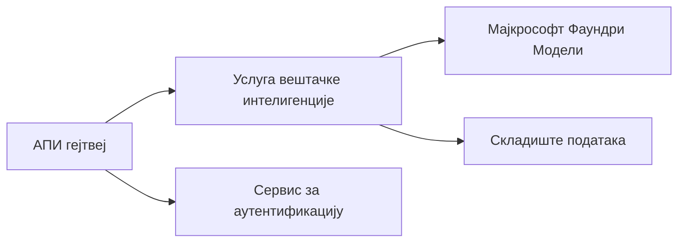
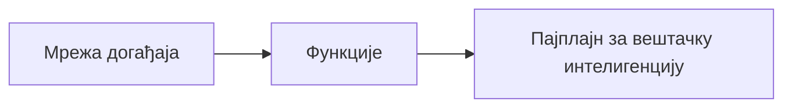

# Поглавље 8: Обрасци за продукцију и ентерпрајз

**📚 Course**: [AZD за почетнике](../../README.md) | **⏱️ Duration**: 2-3 сата | **⭐ Complexity**: Напредни

---

## Overview

Ово поглавље покрива ентерпрајз-спремне обрасце распоређивања, учвршћивање безбедности, мониторинг и оптимизацију трошкова за продукционе AI радне оптерећења.

> Проверено против `azd 1.25.6` у јуну 2026.

## Циљеви учења

Пре завршетка овог поглавља, моћи ћете да:
- Распоредите апликације отпорне на кварове у више региона
- Имплементирате ентерпрајз безбедносне обрасце
- Конфигуришете свеобухватан мониторинг
- Оптимизујете трошкове на нивоу
- Подесите CI/CD пипелине са AZD

---

## 📚 Лекције

| # | Лекција | Опис | Време |
|---|--------|-------------|------|
| 1 | [Практике продукционог AI](production-ai-practices.md) | Обрасци распоређивања за ентерпрајз | 90 min |

---

## 🚀 Контролна листа за продукцију

- [ ] Распоређивање у више региона за отпорност
- [ ] Управљани идентитет за аутентификацију (без кључева)
- [ ] Application Insights за мониторинг
- [ ] Буџети трошкова и аларми конфигурисани
- [ ] Скенирање безбедности омогућено
- [ ] Интеграција CI/CD пипелина
- [ ] План опоравка од катастрофе

---

## 🏗️ Обрасци архитектуре

### Образац 1: AI на микросервисима



### Образац 2: AI вођен догађајима



---

## 🔐 Најбоље безбедносне праксе

```bicep
// Use managed identity
identity: {
  type: 'SystemAssigned'
}

// Private endpoints for AI services
properties: {
  publicNetworkAccess: 'Disabled'
  networkAcls: {
    defaultAction: 'Deny'
  }
}
```

---

## 💰 Оптимизација трошкова

| Стратегија | Уштеда |
|----------|---------|
| Скалирање на нулу (Container Apps) | 60-80% |
| Користите слојеве потрошње за развој | 50-70% |
| Заказано скалирање | 30-50% |
| Резервисани капацитет | 20-40% |

```bash
# Подесите обавештења о буџету
az consumption budget create \
  --budget-name "AI-Budget" \
  --amount 500 \
  --category Cost \
  --time-grain Monthly
```

---

## 📊 Подешавање мониторинга

```bash
# Стримовање логова
azd monitor --logs

# Провери Application Insights
azd monitor --overview

# Прикажи метрике
az monitor metrics list --resource <resource-id>
```

---

## 🔗 Навигација

| Смер | Поглавље |
|-----------|---------|
| **Претходно** | [Поглавље 7: Решавање проблема](../chapter-07-troubleshooting/README.md) |
| **Курс завршен** | [Почетна страница курса](../../README.md) |

---

## 📖 Повезани ресурси

- [Водич за AI агенте](../chapter-02-ai-development/agents.md)
- [Application Insights](../chapter-06-pre-deployment/application-insights.md)
- [Решења са више агената](../chapter-05-multi-agent/README.md)
- [Пример микросервиса](../../examples/microservices/README.md)

---

<!-- CO-OP TRANSLATOR DISCLAIMER START -->
**Изјава о одрицању одговорности**:
Овај документ је преведен коришћењем услуге за аутоматски превод [Co-op Translator](https://github.com/Azure/co-op-translator). Иако тежимо тачности, имајте у виду да аутоматски преводи могу садржати грешке или нетачности. Оригинални документ на његовом изворном језику треба сматрати ауторитативним извором. За критичне информације препоручује се професионални људски превод. Нисмо одговорни за било каква неспоразума или погрешна тумачења која произилазе из коришћења овог превода.
<!-- CO-OP TRANSLATOR DISCLAIMER END -->