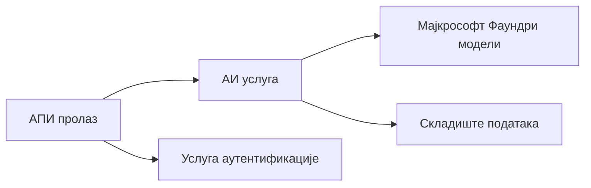
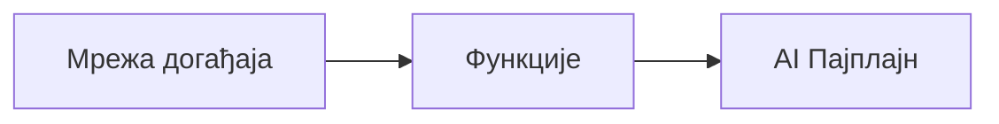

# Поглавље 8: Обрасци за продукцију и предузећа

**📚 Курс**: [AZD за почетнике](../../README.md) | **⏱️ Трајање**: 2-3 сата | **⭐ Сложеност**: Напредни

---

## Преглед

Ово поглавље покрива обрасце за распоређивање спремне за предузеће, ојачавање безбедности, праћење и оптимизацију трошкова за продукционе AI радне оптерећења.

## Циљеви учења

По завршетку овог поглавља, бићете у стању да:
- Распоредите апликације отпорне на отказе у више региона
- Имплементирате безбедносне образце за предузећа
- Конфигуришете свеобухватно праћење
- Оптимизујете трошкове у великом обиму
- Подесите CI/CD пипелине са AZD

---

## 📚 Лекције

| # | Лекција | Опис | Време |
|---|--------|-------------|------|
| 1 | [Практике продукционог AI](production-ai-practices.md) | Обрасци деплоја за предузећа | 90 мин |

---

## 🚀 Контролна листа за продукцију

- [ ] Распоређивање у више региона ради отпорности
- [ ] Управљани идентитет за аутентификацију (без кључева)
- [ ] Application Insights за праћење
- [ ] Буџети трошкова и аларми подешени
- [ ] Омогућено скенирање безбедности
- [ ] Интеграција CI/CD конвејера
- [ ] План за опоравак од катастрофа

---

## 🏗️ Обрасци архитектуре

### Образац 1: Микросервисни AI


### Образац 2: AI покретан догађајима


---

## 🔐 Најбоље праксе безбедности

```bicep
// Use managed identity
identity: {
  type: 'SystemAssigned'
}

// Private endpoints for AI services
properties: {
  publicNetworkAccess: 'Disabled'
  networkAcls: {
    defaultAction: 'Deny'
  }
}
```

---

## 💰 Оптимизација трошкова

| Стратегија | Уштеда |
|----------|---------|
| Скалирање до нуле (Container Apps) | 60-80% |
| Користити потрошне нивое за развој | 50-70% |
| Планирано скалирање | 30-50% |
| Резервисани капацитет | 20-40% |

```bash
# Подесите упозорења за буџет
az consumption budget create \
  --budget-name "AI-Budget" \
  --amount 500 \
  --category Cost \
  --time-grain Monthly
```

---

## 📊 Подешавање праћења

```bash
# Стримуј логове
azd monitor --logs

# Провери Application Insights
azd monitor

# Погледај метрике
az monitor metrics list --resource <resource-id>
```

---

## 🔗 Навигација

| Смер | Поглавље |
|-----------|---------|
| **Претходно** | [Поглавље 7: Решавање проблема](../chapter-07-troubleshooting/README.md) |
| **Курс завршен** | [Почетна страница курса](../../README.md) |

---

## 📖 Повезани ресурси

- [Водич за AI агенте](../chapter-02-ai-development/agents.md)
- [Application Insights](../chapter-06-pre-deployment/application-insights.md)
- [Решења са више агената](../chapter-05-multi-agent/README.md)
- [Пример микросервиса](../../examples/microservices/README.md)

---

<!-- CO-OP TRANSLATOR DISCLAIMER START -->
**Disclaimer**:
Овај документ је преведен помоћу услуге за превођење засноване на вештачкој интелигенцији [Co-op Translator](https://github.com/Azure/co-op-translator). Иако се трудимо да обезбедимо тачност, имајте у виду да аутоматски преводи могу садржати грешке или нетачности. Оригинални документ на његовом изворном језику треба сматрати меродавним извором. За критичне информације препоручује се професионални људски превод. Не сносимо одговорност за било каква недоразумевања или погрешна тумачења која произилазе из употребе овог превода.
<!-- CO-OP TRANSLATOR DISCLAIMER END -->