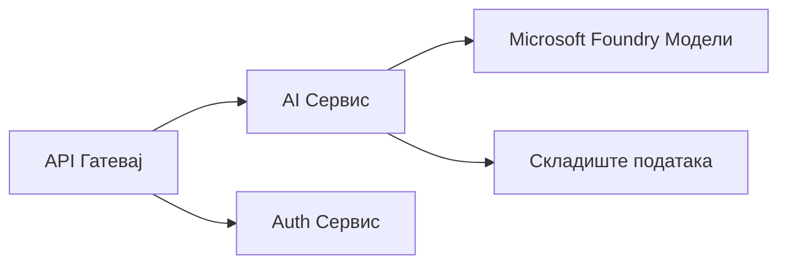

# Поглавље 8: Обрасци за производњу и предузећа

**📚 Курс**: [AZD за почетнике](../../README.md) | **⏱️ Трајање**: 2-3 сата | **⭐ Комплексност**: Напредно

---

## Преглед

Ово поглавље покрива образце за распоређивање спремно за предузећа, ојачавање безбедности, праћење и оптимизацију трошкова за продукционе AI задатке.

> Потврђено уз `azd 1.27.1` у јулу 2026.

## Циљеви учења

Завршетком овог поглавља, моћи ћете да:
- Распоредите апликације отпорне на више региона
- Имплементирате безбедносне предузетничке образце
- Конфигуришете свеобухватно праћење
- Оптимизујете трошкове у великом обиму
- Поставите CI/CD цевоводе са AZD-ом

---

## 📚 Лекције

| # | Лекција | Опис | Време |
|---|--------|-------------|------|
| 1 | [Производне AI праксе](production-ai-practices.md) | Предузетнички образци распоређивања | 90 мин |

---

## 🚀 Контролна листа за продукцију

- [ ] Распоређивање у више региона за отпорност
- [ ] Управљани идентитет за аутентикацију (без кључева)
- [ ] Application Insights за праћење
- [ ] Конфигурисани буџети и упозорења за трошкове
- [ ] Омогућено скенирање безбедности
- [ ] Интеграција CI/CD цевовода
- [ ] План за опоравак после катастрофе

---

## 🏗️ Обрасци архитектуре

### Образац 1: Микросервиси за AI



### Образац 2: AI покренут догађајима


---

## 🔐 Најбоље безбедносне праксе

```bicep
// Use managed identity
identity: {
  type: 'SystemAssigned'
}

// Private endpoints for AI services
properties: {
  publicNetworkAccess: 'Disabled'
  networkAcls: {
    defaultAction: 'Deny'
  }
}
```

---

## 💰 Оптимизација трошкова

| Стратегија | Уштеда |
|----------|---------|
| Скалирање до нуле (Container Apps) | 60-80% |
| Коришћење нивоа по потрошњи за развој | 50-70% |
| Распоредно скалирање | 30-50% |
| Резервисани капацитет | 20-40% |

```bash
# Постави упозорења о буџету
az consumption budget create \
  --budget-name "AI-Budget" \
  --amount 500 \
  --category Cost \
  --time-grain Monthly
```

---

## 📊 Подешавање праћења

```bash
# Стримујте записе
azd monitor --logs

# Проверите Application Insights
azd monitor --overview

# Погледајте метрике
az monitor metrics list --resource <resource-id>
```

---

## 🔗 Навигација

| Правци | Поглавље |
|-----------|---------|
| **Претходно** | [Поглавље 7: Решавање проблема](../chapter-07-troubleshooting/README.md) |
| **Курс завршен** | [Почетак курса](../../README.md) |

---

## 📖 Повећани ресурси

- [Водич за AI агенте](../chapter-02-ai-development/agents.md)
- [Application Insights](../chapter-06-pre-deployment/application-insights.md)
- [Решења са више агената](../chapter-05-multi-agent/README.md)
- [Пример микросервиса](../../examples/microservices/README.md)

---

<!-- CO-OP TRANSLATOR DISCLAIMER START -->
**Изјава о одрицању одговорности**:
Овај документ је преведен коришћењем услуге за аутоматски превод [Co-op Translator](https://github.com/Azure/co-op-translator). Иако тежимо тачности, имајте у виду да аутоматски преводи могу садржати грешке или нетачности. Оригинални документ на његовом изворном језику треба сматрати ауторитативним извором. За критичне информације препоручује се професионални људски превод. Нисмо одговорни за било каква неспоразума или погрешна тумачења која произилазе из коришћења овог превода.
<!-- CO-OP TRANSLATOR DISCLAIMER END -->