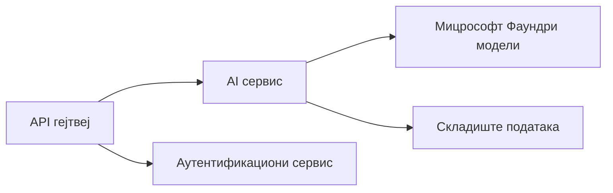
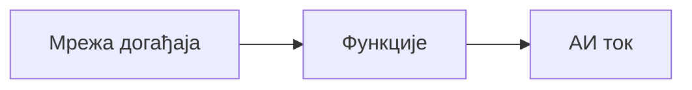

# Поглавље 8: Обрасци за продукцију и предузећа

**📚 Курс**: [AZD за почетнике](../../README.md) | **⏱️ Трајање**: 2-3 сата | **⭐ Сложеност**: Напредна

---

## Преглед

Ово поглавље покрива обрасце за распоређивање погодне за предузећа, појачавање безбедности, надгледање и оптимизацију трошкова за продукционе AI радне оптерећења.

> Верификовано против `azd 1.23.12` у марту 2026.

## Циљеви учења

Након завршетка овог поглавља, моћи ћете:
- Деплојирати отпорне апликације у више региона
- Имплементирати безбедносне обрасце за предузећа
- Конфигурисати свеобухватно надгледање
- Оптимизовати трошкове у великом обиму
- Подесити CI/CD pipeline-ове помоћу AZD

---

## 📚 Лекције

| # | Лекција | Опис | Време |
|---|--------|-------------|------|
| 1 | [Практике продукционог AI](production-ai-practices.md) | Предузетнички обрасци за распоређивање | 90 мин |

---

## 🚀 Контролна листа за продукцију

- [ ] Распоређивање у више региона ради отпорности
- [ ] Управљани идентитет за аутентификацију (без кључева)
- [ ] Application Insights за надгледање
- [ ] Постављени буџети и аларми за трошкове
- [ ] Омогућено скенирање безбедности
- [ ] Интеграција CI/CD цевовода
- [ ] План опоравка од катастрофа

---

## 🏗️ Архитектонски обрасци

### Образац 1: Микросервиси AI


### Образац 2: AI заснован на догађајима


---

## 🔐 Најбоље безбедносне праксе

```bicep
// Use managed identity
identity: {
  type: 'SystemAssigned'
}

// Private endpoints for AI services
properties: {
  publicNetworkAccess: 'Disabled'
  networkAcls: {
    defaultAction: 'Deny'
  }
}
```

---

## 💰 Оптимизација трошкова

| Стратегија | Уштеда |
|----------|---------|
| Скалирање до нуле (Container Apps) | 60-80% |
| Користити ниво потрошње за развој | 50-70% |
| Планирано скалирање | 30-50% |
| Резервисани капацитет | 20-40% |

```bash
# Подесите упозорења о буџету
az consumption budget create \
  --budget-name "AI-Budget" \
  --amount 500 \
  --category Cost \
  --time-grain Monthly
```

---

## 📊 Подешавање надгледања

```bash
# Стримуј логове
azd monitor --logs

# Провери Application Insights
azd monitor --overview

# Прикажи метрике
az monitor metrics list --resource <resource-id>
```

---

## 🔗 Навигација

| Смер | Поглавље |
|-----------|---------|
| **Претходно** | [Поглавље 7: Решавање проблема](../chapter-07-troubleshooting/README.md) |
| **Курс завршен** | [Почетна страница курса](../../README.md) |

---

## 📖 Повезани ресурси

- [Водич за AI агенте](../chapter-02-ai-development/agents.md)
- [Application Insights](../chapter-06-pre-deployment/application-insights.md)
- [Решења са више агената](../chapter-05-multi-agent/README.md)
- [Пример микросервиса](../../examples/microservices/README.md)

---

<!-- CO-OP TRANSLATOR DISCLAIMER START -->
**Одрицање одговорности**:
Овај документ је преведен помоћу услуге за превођење вештачком интелигенцијом [Co-op Translator](https://github.com/Azure/co-op-translator). Иако настојимо да будемо прецизни, имајте на уму да аутоматски преводи могу садржати грешке или нетачности. Оригинални документ на изворном језику треба сматрати обавезујућим извором. За критичне информације препоручује се професионални људски превод. Не сносимо одговорност за било какве неспоразуме или погрешна тумачења која проистекну из коришћења овог превода.
<!-- CO-OP TRANSLATOR DISCLAIMER END -->