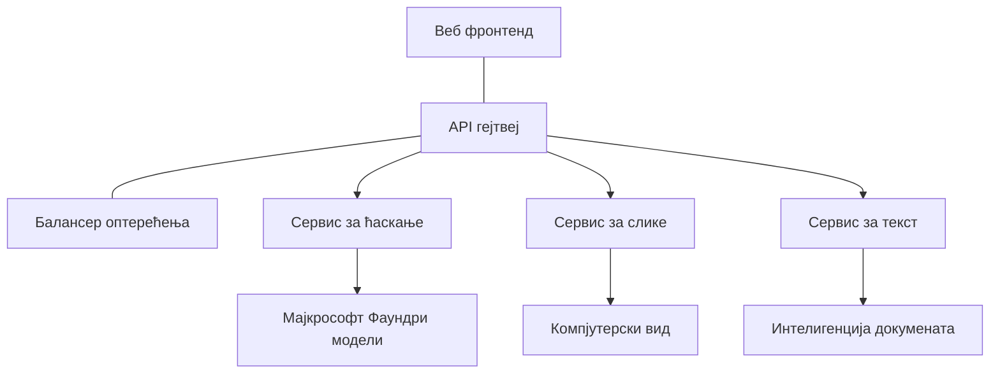

# Најбоље праксе за продукционе AI радне оптерећења са AZD

**Навигација поглављима:**
- **📚 Почетна курса**: [AZD за почетнике](../../README.md)
- **📖 Тренутно поглавље**: Поглавље 8 - Обрасци за продукцију и предузећа
- **⬅️ Претходно поглавље**: [Поглавље 7: Решавање проблема](../chapter-07-troubleshooting/debugging.md)
- **⬅️ Такође повезано**: [AI лабораторија](ai-workshop-lab.md)
- **🎯 Завршетак курса**: [AZD за почетнике](../../README.md)

## Преглед

Ово упутство пружа свеобухватне најбоље праксе за постављање продукционих AI радних оптерећења користећи Azure Developer CLI (AZD). На основу повратних информација из Microsoft Foundry Discord заједнице и реалних имплементација код купаца, ове праксе решавају најчешће изазове у продукционим AI системима.

## Главни изазови који се решавају

На основу резултата наше анкете у заједници, ово су главни изазови са којима се програмери сусрећу:

- **45%** имају потешкоће са разврставањем вишесервисних AI решења
- **38%** имају проблеме са управљањем акредитивима и тајнама  
- **35%** сматрају да је спремност за продукцију и скалирање тешка
- **32%** треба боље стратегије оптимизације трошкова
- **29%** захтевају побољшано праћење и решавање проблема

## Архитектонски обрасци за продукциони AI

### Образац 1: Микросервисна AI архитектура

**Када користити**: Комплексне AI апликације са више могућности



**AZD имплементација**:

```yaml
# azure.yaml
name: enterprise-ai-platform
services:
  web:
    project: ./web
    host: staticwebapp
  api-gateway:
    project: ./api-gateway
    host: containerapp
  chat-service:
    project: ./services/chat
    host: containerapp
  vision-service:
    project: ./services/vision
    host: containerapp
  text-service:
    project: ./services/text
    host: containerapp
```

### Образац 2: Обрађивање покренуто догађајима (Event-Driven)

**Када користити**: Пакетна обрада, анализа докумената, асинхрони токови рада

```bicep
// Event Hub for AI processing pipeline
resource eventHub 'Microsoft.EventHub/namespaces@2023-01-01-preview' = {
  name: eventHubNamespaceName
  location: location
  sku: {
    name: 'Standard'
    tier: 'Standard'
    capacity: 1
  }
}

// Service Bus for reliable message processing
resource serviceBus 'Microsoft.ServiceBus/namespaces@2022-10-01-preview' = {
  name: serviceBusNamespaceName
  location: location
  sku: {
    name: 'Premium'
    tier: 'Premium'
    capacity: 1
  }
}

// Function App for processing
resource functionApp 'Microsoft.Web/sites@2023-01-01' = {
  name: functionAppName
  location: location
  kind: 'functionapp,linux'
  properties: {
    siteConfig: {
      appSettings: [
        {
          name: 'FUNCTIONS_EXTENSION_VERSION'
          value: '~4'
        }
        {
          name: 'AZURE_OPENAI_ENDPOINT'
          value: '@Microsoft.KeyVault(VaultName=${keyVault.name};SecretName=openai-endpoint)'
        }
      ]
    }
  }
}
```

## Размишљања о здрављу AI агената

Када се традиционална веб апликација поквари, симптоми су познати: страница се не учитава, API враћа грешку или дистрибуција не успе. AI-погонске апликације могу да закуцају на све те исте начине—али могу и да се понашају суптилније на начине који не производе очигледне поруке о грешци.

Овај одељак вам помаже да изградите ментални модел за праћење AI радних оптерећења тако да знате где да тражите када нешто не делује како треба.

### Како се здравље агента разликује од здравља традиционалне апликације

Традиционална апликација или ради или не ради. AI агент може изгледати као да ради, а давати лоше резултате. Размислите о здрављу агента у два слоја:

| Слој | Шта пратити | Где тражити |
|-------|--------------|---------------|
| **Здравље инфраструктуре** | Да ли сервис ради? Да ли су ресурси обезбеђени? Да ли су крајње тачке доступне? | `azd monitor`, Azure Portal resource health, логови контејнера/апликације |
| **Здравље понашања** | Да ли агент одговара тачно? Да ли су одговори благовремени? Да ли се модел позива правилно? | Application Insights трагови, метрике латенције позива модела, логови квалитета одговора |

Здравље инфраструктуре је познато—исто је за било коју azd апликацију. Здравље понашања је нови слој који уводе AI радна оптерећења.

### Где тражити када се AI апликације не понашају као очекивано

Ако ваша AI апликација не даје очекиване резултате, ево концептуалне контролне листе:

1. **Почните са основама.** Да ли апликација ради? Може ли да досегне своје зависности? Проверите `azd monitor` и здравље ресурса као што бисте урадили за било коју апликацију.
2. **Проверите везу са моделом.** Да ли ваша апликација успешно позива AI модел? Неуспели или истекли позиви модела су најчешћи узрок проблема и појавиће се у логовима апликације.
3. **Погледајте шта је модел примио.** AI одговори зависе од улаза (промпт и сваки дохваћени контекст). Ако је излаз погрешан, улаз је обично погрешан. Проверите да ли ваша апликација шаље праве податке моделу.
4. **Проверите латенцију одговора.** Позиви AI модела су спорији од типичних API позива. Ако апликација делује успорено, проверите да ли су се времена одговора модела повећала—то може указивати на гушење, ограничења капацитета или загушење на нивоу региона.
5. **Пратите сигнале о трошковима.** Неочекивани скокови у коришћењу токена или API позива могу указивати на петљу, погрешно конфигурисан промпт или прекомерне поновне покушаје.

Не морате одмах савладати опсервационе алате. Кључна порука је да AI апликације имају додатни слој понашања који треба надгледати, а уграђено азд праћење (`azd monitor`) даје вам полазну тачку за истрагу оба слоја.

---

## Најбоље праксе за безбедност

### 1. Zero-Trust модел безбедности

**Стратегија имплементације**:
- Нема комуникације сервис-на-сервис без аутентификације
- Сви API позиви користе управљане идентитете
- Изолација мреже са приватним крајњим тачкама
- Контроле приступа са принципом најмање привилегије

```bicep
// Managed Identity for each service
resource chatServiceIdentity 'Microsoft.ManagedIdentity/userAssignedIdentities@2023-01-31' = {
  name: 'chat-service-identity'
  location: location
}

// Role assignments with minimal permissions
resource openAIUserRole 'Microsoft.Authorization/roleAssignments@2022-04-01' = {
  scope: openAIAccount
  name: guid(openAIAccount.id, chatServiceIdentity.id, openAIUserRoleDefinitionId)
  properties: {
    roleDefinitionId: subscriptionResourceId('Microsoft.Authorization/roleDefinitions', '5e0bd9bd-7b93-4f28-af87-19fc36ad61bd')
    principalId: chatServiceIdentity.properties.principalId
    principalType: 'ServicePrincipal'
  }
}
```

### 2. Сигурно управљање тајнама

**Образац интеграције Key Vault-а**:

```bicep
// Key Vault with proper access policies
resource keyVault 'Microsoft.KeyVault/vaults@2023-02-01' = {
  name: keyVaultName
  location: location
  properties: {
    tenantId: tenant().tenantId
    sku: {
      family: 'A'
      name: 'premium'  // Use premium for production
    }
    enableRbacAuthorization: true  // Use RBAC instead of access policies
    enablePurgeProtection: true    // Prevent accidental deletion
    enableSoftDelete: true
    softDeleteRetentionInDays: 90
  }
}

// Store all AI service credentials
resource openAIKeySecret 'Microsoft.KeyVault/vaults/secrets@2023-02-01' = {
  parent: keyVault
  name: 'openai-api-key'
  properties: {
    value: openAIAccount.listKeys().key1
    attributes: {
      enabled: true
    }
  }
}
```

### 3. Мрежна безбедност

**Конфигурација приватних крајњих тачака**:

```bicep
// Virtual Network for AI services
resource virtualNetwork 'Microsoft.Network/virtualNetworks@2023-04-01' = {
  name: vnetName
  location: location
  properties: {
    addressSpace: {
      addressPrefixes: ['10.0.0.0/16']
    }
    subnets: [
      {
        name: 'ai-services-subnet'
        properties: {
          addressPrefix: '10.0.1.0/24'
          privateEndpointNetworkPolicies: 'Disabled'
        }
      }
      {
        name: 'app-services-subnet'
        properties: {
          addressPrefix: '10.0.2.0/24'
          delegations: [
            {
              name: 'Microsoft.Web/serverFarms'
              properties: {
                serviceName: 'Microsoft.Web/serverFarms'
              }
            }
          ]
        }
      }
    ]
  }
}

// Private endpoints for all AI services
resource openAIPrivateEndpoint 'Microsoft.Network/privateEndpoints@2023-04-01' = {
  name: '${openAIAccountName}-pe'
  location: location
  properties: {
    subnet: {
      id: virtualNetwork.properties.subnets[0].id
    }
    privateLinkServiceConnections: [
      {
        name: 'openai-connection'
        properties: {
          privateLinkServiceId: openAIAccount.id
          groupIds: ['account']
        }
      }
    ]
  }
}
```

## Перформансе и скалабилност

### 1. Стратегије аутоматског скалирања

**Аутоматско скалирање Container Apps**:

```bicep
resource containerApp 'Microsoft.App/containerApps@2023-05-01' = {
  name: containerAppName
  location: location
  properties: {
    configuration: {
      ingress: {
        external: true
        targetPort: 8000
        transport: 'http'
      }
    }
    template: {
      scale: {
        minReplicas: 2  // Always have 2 instances minimum
        maxReplicas: 50 // Scale up to 50 for high load
        rules: [
          {
            name: 'http-scaling'
            http: {
              metadata: {
                concurrentRequests: '20'  // Scale when >20 concurrent requests
              }
            }
          }
          {
            name: 'cpu-scaling'
            custom: {
              type: 'cpu'
              metadata: {
                type: 'Utilization'
                value: '70'  // Scale when CPU >70%
              }
            }
          }
        ]
      }
    }
  }
}
```

### 2. Стратегије кеширања

**Redis кеш за AI одговоре**:

```bicep
// Redis Premium for production workloads
resource redisCache 'Microsoft.Cache/redis@2023-04-01' = {
  name: redisCacheName
  location: location
  properties: {
    sku: {
      name: 'Premium'
      family: 'P'
      capacity: 1
    }
    enableNonSslPort: false
    minimumTlsVersion: '1.2'
    redisConfiguration: {
      'maxmemory-policy': 'allkeys-lru'
    }
    // Enable clustering for high availability
    redisVersion: '6.0'
    shardCount: 2
  }
}

// Cache configuration in application
var cacheConnectionString = '${redisCache.properties.hostName}:6380,password=${redisCache.listKeys().primaryKey},ssl=True,abortConnect=False'
```

### 3. Равномерно распоређивање оптерећења и управљање саобраћајем

**Application Gateway са WAF**:

```bicep
// Application Gateway with Web Application Firewall
resource applicationGateway 'Microsoft.Network/applicationGateways@2023-04-01' = {
  name: appGatewayName
  location: location
  properties: {
    sku: {
      name: 'WAF_v2'
      tier: 'WAF_v2'
      capacity: 2
    }
    webApplicationFirewallConfiguration: {
      enabled: true
      firewallMode: 'Prevention'
      ruleSetType: 'OWASP'
      ruleSetVersion: '3.2'
    }
    // Backend pools for AI services
    backendAddressPools: [
      {
        name: 'ai-services-pool'
        properties: {
          backendAddresses: [
            {
              fqdn: '${containerApp.properties.configuration.ingress.fqdn}'
            }
          ]
        }
      }
    ]
  }
}
```

## 💰 Оптимизација трошкова

### 1. Правилно димензионисање ресурса

**Конфигурације специфичне за окружење**:

```bash
# Развојно окружење
azd env new development
azd env set AZURE_OPENAI_SKU "S0"
azd env set AZURE_OPENAI_CAPACITY 10
azd env set AZURE_SEARCH_SKU "basic"
azd env set CONTAINER_CPU 0.5
azd env set CONTAINER_MEMORY 1.0

# Производно окружење
azd env new production
azd env set AZURE_OPENAI_SKU "S0"
azd env set AZURE_OPENAI_CAPACITY 100
azd env set AZURE_SEARCH_SKU "standard"
azd env set CONTAINER_CPU 2.0
azd env set CONTAINER_MEMORY 4.0
```

### 2. Праћење трошкова и буџети

```bicep
// Cost management and budgets
resource budget 'Microsoft.Consumption/budgets@2023-05-01' = {
  name: 'ai-workload-budget'
  properties: {
    timePeriod: {
      startDate: '2024-01-01'
      endDate: '2024-12-31'
    }
    timeGrain: 'Monthly'
    amount: 2000  // $2000 monthly budget
    category: 'Cost'
    notifications: {
      warning: {
        enabled: true
        operator: 'GreaterThan'
        threshold: 80
        contactEmails: [
          'finance@company.com'
          'engineering@company.com'
        ]
        contactRoles: [
          'Owner'
          'Contributor'
        ]
      }
      critical: {
        enabled: true
        operator: 'GreaterThan'
        threshold: 95
        contactEmails: [
          'cto@company.com'
        ]
      }
    }
  }
}
```

### 3. Оптимизација употребе токена

**Управљање трошковима OpenAI**:

```typescript
// Оптимизација токена на нивоу апликације
class TokenOptimizer {
  private readonly maxTokens = 4000;
  private readonly reserveTokens = 500;
  
  optimizePrompt(userInput: string, context: string): string {
    const availableTokens = this.maxTokens - this.reserveTokens;
    const estimatedTokens = this.estimateTokens(userInput + context);
    
    if (estimatedTokens > availableTokens) {
      // Скраћујте контекст, не унос корисника
      context = this.truncateContext(context, availableTokens - this.estimateTokens(userInput));
    }
    
    return `${context}\n\nUser: ${userInput}`;
  }
  
  private estimateTokens(text: string): number {
    // Приближна процена: 1 токен ≈ 4 знака
    return Math.ceil(text.length / 4);
  }
}
```

## Мониторинг и опсервабилност

### 1. Свеобухватни Application Insights

```bicep
// Application Insights with advanced features
resource applicationInsights 'Microsoft.Insights/components@2020-02-02' = {
  name: applicationInsightsName
  location: location
  kind: 'web'
  properties: {
    Application_Type: 'web'
    WorkspaceResourceId: logAnalyticsWorkspace.id
    SamplingPercentage: 100  // Full sampling for AI apps
    DisableIpMasking: false  // Enable for security
  }
}

// Custom metrics for AI operations
resource aiMetricAlerts 'Microsoft.Insights/metricAlerts@2018-03-01' = {
  name: 'ai-high-error-rate'
  location: 'global'
  properties: {
    description: 'Alert when AI service error rate is high'
    severity: 2
    enabled: true
    scopes: [
      applicationInsights.id
    ]
    evaluationFrequency: 'PT1M'
    windowSize: 'PT5M'
    criteria: {
      'odata.type': 'Microsoft.Azure.Monitor.SingleResourceMultipleMetricCriteria'
      allOf: [
        {
          name: 'high-error-rate'
          metricName: 'requests/failed'
          operator: 'GreaterThan'
          threshold: 10
          timeAggregation: 'Count'
        }
      ]
    }
  }
}
```

### 2. Мониторинг специфичан за AI

**Прилагођени панели за AI метрике**:

```json
// Dashboard configuration for AI workloads
{
  "dashboard": {
    "name": "AI Application Monitoring",
    "tiles": [
      {
        "name": "OpenAI Request Volume",
        "query": "requests | where name contains 'openai' | summarize count() by bin(timestamp, 5m)"
      },
      {
        "name": "AI Response Latency",
        "query": "requests | where name contains 'openai' | summarize avg(duration) by bin(timestamp, 5m)"
      },
      {
        "name": "Token Usage",
        "query": "customMetrics | where name == 'openai_tokens_used' | summarize sum(value) by bin(timestamp, 1h)"
      },
      {
        "name": "Cost per Hour",
        "query": "customMetrics | where name == 'openai_cost' | summarize sum(value) by bin(timestamp, 1h)"
      }
    ]
  }
}
```

### 3. Провере здравља и праћење доступности

```bicep
// Application Insights availability tests
resource availabilityTest 'Microsoft.Insights/webtests@2022-06-15' = {
  name: 'ai-app-availability-test'
  location: location
  tags: {
    'hidden-link:${applicationInsights.id}': 'Resource'
  }
  properties: {
    SyntheticMonitorId: 'ai-app-availability-test'
    Name: 'AI Application Availability Test'
    Description: 'Tests AI application endpoints'
    Enabled: true
    Frequency: 300  // 5 minutes
    Timeout: 120    // 2 minutes
    Kind: 'ping'
    Locations: [
      {
        Id: 'us-east-2-azr'
      }
      {
        Id: 'us-west-2-azr'
      }
    ]
    Configuration: {
      WebTest: '''
        <WebTest Name="AI Health Check" 
                 Id="8d2de8d2-a2b0-4c2e-9a0d-8f9c9a0b8c8d" 
                 Enabled="True" 
                 CssProjectStructure="" 
                 CssIteration="" 
                 Timeout="120" 
                 WorkItemIds="" 
                 xmlns="http://microsoft.com/schemas/VisualStudio/TeamTest/2010" 
                 Description="" 
                 CredentialUserName="" 
                 CredentialPassword="" 
                 PreAuthenticate="True" 
                 Proxy="default" 
                 StopOnError="False" 
                 RecordedResultFile="" 
                 ResultsLocale="">
          <Items>
            <Request Method="GET" 
                     Guid="a5f10126-e4cd-570d-961c-cea43999a200" 
                     Version="1.1" 
                     Url="${webApp.properties.defaultHostName}/health" 
                     ThinkTime="0" 
                     Timeout="120" 
                     ParseDependentRequests="True" 
                     FollowRedirects="True" 
                     RecordResult="True" 
                     Cache="False" 
                     ResponseTimeGoal="0" 
                     Encoding="utf-8" 
                     ExpectedHttpStatusCode="200" 
                     ExpectedResponseUrl="" 
                     ReportingName="" 
                     IgnoreHttpStatusCode="False" />
          </Items>
        </WebTest>
      '''
    }
  }
}
```

## Опоравак од катастрофа и висока доступност

### 1. Размештање у више региона

```yaml
# azure.yaml - Multi-region configuration
name: ai-app-multiregion
services:
  api-primary:
    project: ./api
    host: containerapp
    env:
      - AZURE_REGION=eastus
  api-secondary:
    project: ./api
    host: containerapp
    env:
      - AZURE_REGION=westus2
```

```bicep
// Traffic Manager for global load balancing
resource trafficManager 'Microsoft.Network/trafficManagerProfiles@2022-04-01' = {
  name: trafficManagerProfileName
  location: 'global'
  properties: {
    profileStatus: 'Enabled'
    trafficRoutingMethod: 'Priority'
    dnsConfig: {
      relativeName: trafficManagerProfileName
      ttl: 30
    }
    monitorConfig: {
      protocol: 'HTTPS'
      port: 443
      path: '/health'
      intervalInSeconds: 30
      toleratedNumberOfFailures: 3
      timeoutInSeconds: 10
    }
    endpoints: [
      {
        name: 'primary-endpoint'
        type: 'Microsoft.Network/trafficManagerProfiles/azureEndpoints'
        properties: {
          targetResourceId: primaryAppService.id
          endpointStatus: 'Enabled'
          priority: 1
        }
      }
      {
        name: 'secondary-endpoint'
        type: 'Microsoft.Network/trafficManagerProfiles/azureEndpoints'
        properties: {
          targetResourceId: secondaryAppService.id
          endpointStatus: 'Enabled'
          priority: 2
        }
      }
    ]
  }
}
```

### 2. Бекап и опоравак података

```bicep
// Backup configuration for critical data
resource backupVault 'Microsoft.DataProtection/backupVaults@2023-05-01' = {
  name: backupVaultName
  location: location
  identity: {
    type: 'SystemAssigned'
  }
  properties: {
    storageSettings: [
      {
        datastoreType: 'VaultStore'
        type: 'LocallyRedundant'
      }
    ]
  }
}

// Backup policy for AI models and data
resource backupPolicy 'Microsoft.DataProtection/backupVaults/backupPolicies@2023-05-01' = {
  parent: backupVault
  name: 'ai-data-backup-policy'
  properties: {
    policyRules: [
      {
        backupParameters: {
          backupType: 'Full'
          objectType: 'AzureBackupParams'
        }
        trigger: {
          schedule: {
            repeatingTimeIntervals: [
              'R/2024-01-01T02:00:00+00:00/P1D'  // Daily at 2 AM
            ]
          }
          objectType: 'ScheduleBasedTriggerContext'
        }
        dataStore: {
          datastoreType: 'VaultStore'
          objectType: 'DataStoreInfoBase'
        }
        name: 'BackupDaily'
        objectType: 'AzureBackupRule'
      }
    ]
  }
}
```

## DevOps и интеграција CI/CD

### 1. GitHub Actions радни ток

```yaml
# .github/workflows/deploy-ai-app.yml
name: Deploy AI Application

on:
  push:
    branches: [main]
  pull_request:
    branches: [main]

jobs:
  test:
    runs-on: ubuntu-latest
    steps:
      - uses: actions/checkout@v4
      
      - name: Setup Python
        uses: actions/setup-python@v4
        with:
          python-version: '3.11'
          
      - name: Install dependencies
        run: |
          pip install -r requirements.txt
          pip install pytest
          
      - name: Run tests
        run: pytest tests/
        
      - name: AI Safety Tests
        run: |
          python scripts/test_ai_safety.py
          python scripts/validate_prompts.py

  deploy-staging:
    needs: test
    if: github.event_name == 'pull_request'
    runs-on: ubuntu-latest
    steps:
      - uses: actions/checkout@v4
      
      - name: Setup AZD
        uses: Azure/setup-azd@v2
        
      - name: Login to Azure
        uses: azure/login@v1
        with:
          creds: ${{ secrets.AZURE_CREDENTIALS }}
          
      - name: Deploy to Staging
        run: |
          azd env select staging
          azd deploy

  deploy-production:
    needs: test
    if: github.ref == 'refs/heads/main'
    runs-on: ubuntu-latest
    steps:
      - uses: actions/checkout@v4
      
      - name: Setup AZD
        uses: Azure/setup-azd@v2
        
      - name: Login to Azure
        uses: azure/login@v1
        with:
          creds: ${{ secrets.AZURE_CREDENTIALS }}
          
      - name: Deploy to Production
        run: |
          azd env select production
          azd deploy
          
      - name: Run Production Health Checks
        run: |
          python scripts/health_check.py --env production
```

### 2. Валидација инфраструктуре

```bash
# scripts/validate_infrastructure.sh
#!/bin/bash

echo "Validating AI infrastructure deployment..."

# Проверити да ли су сви потребни сервиси покренути
services=("openai" "search" "storage" "keyvault")
for service in "${services[@]}"; do
    echo "Checking $service..."
    if ! az resource list --resource-type "Microsoft.CognitiveServices/accounts" --query "[?contains(name, '$service')]" -o tsv; then
        echo "ERROR: $service not found"
        exit 1
    fi
done

# Валидирати распоређивања модела OpenAI
echo "Validating OpenAI model deployments..."
models=$(az cognitiveservices account deployment list --name $AZURE_OPENAI_NAME --resource-group $AZURE_RESOURCE_GROUP --query "[].name" -o tsv)
if [[ ! $models == *"gpt-4.1-mini"* ]]; then
  echo "ERROR: Required model gpt-4.1-mini not deployed"
    exit 1
fi

# Тестирати повезивост AI сервиса
echo "Testing AI service connectivity..."
python scripts/test_connectivity.py

echo "Infrastructure validation completed successfully!"
```

## Контролна листа спремности за продукцију

### Безбедност ✅
- [ ] Сви сервиси користе управљане идентитете
- [ ] Тајне складиштене у Key Vault-у
- [ ] Конфигурисане приватне крајње тачке
- [ ] Имплементирани мрежни сигурносни групи
- [ ] RBAC са принципом најмање привилегије
- [ ] WAF омогућен на јавним крајњим тачкама

### Перформансе ✅
- [ ] Конфигурисано аутоматско скалирање
- [ ] Имплементирано кеширање
- [ ] Подешено распоређивање оптерећења
- [ ] CDN за статички садржај
- [ ] Пула веза са базом података
- [ ] Оптимизација употребе токена

### Мониторинг ✅
- [ ] Конфигурисан Application Insights
- [ ] Дефинисане прилагођене метрике
- [ ] Подешена правила за аларме
- [ ] Креиран панел
- [ ] Имплементиране провере здравља
- [ ] Политике задржавања логова

### Поузданост ✅
- [ ] Размештање у више региона
- [ ] План за бекап и опоравак
- [ ] Имплементирани circuit breakers
- [ ] Конфигурисане политике поновног покушаја
- [ ] Грациозна деградација
- [ ] Крајње тачке за проверу здравља

### Управљање трошковима ✅
- [ ] Конфигурисани аларми буџета
- [ ] Правилно димензионисање ресурса
- [ ] Примењени попусти за развој/тест
- [ ] Купљене резервисане инстанце
- [ ] Панел за праћење трошкова
- [ ] Редовни прегледи трошкова

### Усклађеност ✅
- [ ] Испуњени захтеви за локалитет података
- [ ] Омогућено аудиторско логовање
- [ ] Примењене политике усклађености
- [ ] Имплементиране безбедносне основе
- [ ] Редовне безбедносне процене
- [ ] План за одговор на инциденте

## Бенчмаркови перформанси

### Типичне продукционе метрике

| Метрика | Циљ | Надгледање |
|--------|--------|------------|
| **Време одговора** | < 2 секунде | Application Insights |
| **Доступност** | 99.9% | Праћење доступности |
| **Стопа грешака** | < 0.1% | Логови апликације |
| **Употреба токена** | < $500/месечно | Управљање трошковима |
| **Паралелних корисника** | 1000+ | Тестирање оптерећења |
| **Време опоравка** | < 1 сат | Тестови опоравка од катастрофа |

### Тестирање оптерећења

```bash
# Скрипта за тестирање оптерећења за апликације вештачке интелигенције
python scripts/load_test.py \
  --endpoint https://your-ai-app.azurewebsites.net \
  --concurrent-users 100 \
  --duration 300 \
  --ramp-up 60
```

## 🤝 Најбоље праксе заједнице

На основу повратних информација из Microsoft Foundry Discord заједнице:

### Најбоље препоруке од заједнице:

1. **Почните мало, скалирајте постепено**: Почните са основним SKU-овима и повећавајте на основу стварне употребе
2. **Надгледајте све**: Подесите свеобухватни мониторинг од првог дана
3. **Аутоматизујте безбедност**: Користите инфраструктуру као код за конзистентну безбедност
4. **Тестирајте темељно**: Укључите тестирање специфично за AI у ваш CI/CD
5. **Планирајте трошкове**: Пратите употребу токена и подесите буџетске аларме рано

### Чести пропусти које треба избегавати:

- ❌ Утврдњавање API кључева у коду
- ❌ Неподешен одговарајући мониторинг
- ❌ Игнорисање оптимизације трошкова
- ❌ Не тестирање сценарија неуспеха
- ❌ Дистрибуција без провера здравља

## AZD AI CLI команде и екстензије

AZD укључује растући скуп AI-специфичних команди и екстензија које поједностављују продукционе AI токове рада. Ови алати премошћују јаз између локалног развоја и продукционог распоређивања AI радних оптерећења.

### AZD екстензије за AI

AZD користи систем екстензија да дода AI-специфичне могућности. Инсталирајте и управљајте екстензијама са:

```bash
# Прикажи све доступне екстензије (укључујући вештачку интелигенцију)
azd extension list

# Прегледај детаље инсталиране екстензије
azd extension show azure.ai.agents

# Инсталирај екстензију Foundry Agents
azd extension install azure.ai.agents

# Инсталирај екстензију за фино подешавање
azd extension install azure.ai.finetune

# Инсталирај екстензију за прилагођене моделе
azd extension install azure.ai.models

# Ажурирај све инсталиране екстензије
azd extension upgrade --all
```

**Доступне AI екстензије:**

| Екстензија | Намена | Статус |
|-----------|---------|--------|
| `azure.ai.agents` | Управљање Foundry Agent Service | Preview |
| `azure.ai.skills` | Поновно употребљиве вештине агената | Preview |
| `azure.ai.connections` | Foundry конекције (извори података, алати) | Preview |
| `azure.ai.finetune` | Финетјун за модел у Foundry-ју | Preview |
| `azure.ai.models` | Прилагођени модели за Foundry | Preview |
| `azure.coding-agent` | Конфигурација агента за кодирање | Available |

> `azure.ai.agents` екстензија се брзо развија. Овај курс је валидаван против `0.1.40-preview`. Покрените `azd extension upgrade --all` да бисте преузели најновији скуп команди, и `azd extension show azure.ai.agents` да потврдите инсталирану верзију.

**Шта су новије `skills` и `connections` екстензије?**

Појавиле су се две preview екстензије које иду уз алате за агенте и вреди их разумети чак и као почетнику:

- **`azure.ai.skills`** — **skill** је поново употребљива могућност (пакетирани алат или понашање) коју можете прикључити једном или више агената уместо да је сваки пут поново имплементирате. Размислите о њему као о заједничком грађевном блоку: дефинишите "претрага у документацији" или "пронађи налог" skill једном, а затим га поново користите међу агентима. Ово држи вишe-агентске системе (Поглавље 5) конзистентним и избегава копирање/налепницу.
- **`azure.ai.connections`** — **connection** је управљана веза из вашег Foundry пројекта до спољног ресурса који вашим агентима треба—извор података (нпр. Azure AI Search), крајна тачка алата или други сервис. Конекције централизују *где* и *како* агенти приступају подацима, тако да акредитиви и крајње тачке живе на једном регулисаном месту уместо разбацаних по коду.

Не требате их да бисте распоредили прве агенте—останите на `azure.ai.agents` док учите. Приступите `skills` када почнете да дуплирате исти алат међу агентима, а `connections` када више агената дели исти извор података.

### Иницијализација пројеката агената помоћу `azd ai agent init`

Команда `azd ai agent init` скелетонизира продукционо спреман пројекат AI агента интегрисан са Microsoft Foundry Agent Service:

```bash
# Иницијализујте нови агент пројекат из манифеста агента
azd ai agent init -m <manifest-path-or-uri>

# Иницијализујте и циљајте одређени Foundry пројекат
azd ai agent init -m agent-manifest.yaml --project-id <foundry-project-id>

# Иницијализујте са прилагођеним директоријумом извора
azd ai agent init -m agent-manifest.yaml --src ./agents/my-agent

# Циљајте Container Apps као хост
azd ai agent init -m agent-manifest.yaml --host containerapp
```

**Кључне опције:**

| Опција | Опис |
|------|-------------|
| `-m, --manifest` | Путања или URI до манифеста агента који ће се додати у ваш пројекат |
| `-p, --project-id` | Постојећи Microsoft Foundry Project ID за ваше azd окружење |
| `-s, --src` | Директоријум за преузимање дефиниције агента (по подразумевању `src/<agent-id>`) |
| `--host` | Замени подразумевани хост (нпр. `containerapp`) |
| `-e, --environment` | azd окружење које ће се користити |

**Савет за продукцију**: Користите `--project-id` да бисте се директно повезали на постојећи Foundry пројекат, држећи ваш код агента и облачне ресурсе повезаним од самог почетка.

### Управљање животним циклусом агента

Поред `init`, `azure.ai.agents` екстензија пружа команде за цео животни циклус хостираног агента—тестирање, процену, оптимизацију и повлачење:

```bash
# Позови распоређеног агента и погледај временске податке одговора сервера
# (укупна латенција и време до првог бајта)
azd ai agent invoke

# Прикажи конфигурацију активног ендпоинта пре него што је промениш
azd ai agent endpoint show

# Генериши скуп података за евалуацију агента
azd ai agent eval generate --dataset ./eval/dataset.jsonl

# Оптимизуј упутства агента на основу твојих евалуационих података
# (захтева optimization_model у пројекту агента)
azd ai agent optimize

# Преузми изворни код распоређеног хостираног агента заснованог на коду
# (са SHA-256 верификацијом)
azd ai agent code download

# Избриши хостираног агента и све његове верзије
# (--force прекида активне сесије)
azd ai agent delete --force
```

**Животни циклус на први поглед:**

| Фаза | Команда | Употреба у продукцији |
|-------|---------|----------------|
| Тест | `azd ai agent invoke` | Валидација одговора и мерење латенције пре пуштања |
| Инспекција | `azd ai agent endpoint show` | Преглед аутентификације/конфигурације крајње тачке; уочавање кварова рано |
| Мерење | `azd ai agent eval generate` | Изградња понављивог сета за евалуацију из стварних трагова |
| Побољшање | `azd ai agent optimize` | Тунинг инструкција у односу на мерени квалитет |
| Рекавери | `azd ai agent code download` | Преузимање тачно пласираног извора за ревизију/повратак |
| Повлачење | `azd ai agent delete --force` | Чисто уклањање агента и његових верзија |

> Ово су preview команде и могу се мењати између верзија екстензија. Покрените `azd ai agent --help` да видите тачне подкоманде доступне у вашој инсталираној верзији.

### Model Context Protocol (MCP) са `azd mcp`
AZD укључује уграђену подршку за MCP сервер (алфа), омогућавајући AI агентима и алатима да комуницирају са вашим Azure ресурсима путем стандардизованог протокола:

```bash
# Покрените MCP сервер за ваш пројекат
azd mcp start

# Прегледајте тренутна правила сагласности Copilot-а за извршавање алата
azd copilot consent list
```

MCP сервер излаже контекст вашег azd пројекта—окружења, сервисе и Azure ресурсе—AI-покретаним развојним алатима. Ово омогућава:

- **AI-помоћно постављање**: Дозволите агентима који пишу код да испитују стање вашег пројекта и покрећу размештања
- **Откривање ресурса**: AI алати могу открити које Azure ресурсе ваш пројекат користи
- **Управљање окружењима**: Агенти могу да прелазе између dev/staging/production окружења

### Генерисање инфраструктуре са `azd infra generate`

За продукционе AI радне оптерећења, можете генерисати и прилагодити Infrastructure as Code уместо да се ослањате на аутоматско провизионисање:

```bash
# Генеришите Bicep/Terraform фајлове из дефиниције вашег пројекта
azd infra generate
```

Ово записује IaC на диск тако да можете:
- Прегледати и ревидирати инфраструктуру пре постављања
- Додати прилагођене безбедносне политике (правила мреже, приватне крајње тачке)
- Интегрисати са постојећим IaC процесима ревизије
- Верзионисати измене инфраструктуре одвојено од апликационог кода

### Хуке животног циклуса за продукцију

AZD хукови вам омогућавају да убаците прилагођену логику у свакој фази животног циклуса размењивања—критично за продукционе AI токове рада:

```yaml
# azure.yaml - Production hooks example
name: ai-production-app
hooks:
  preprovision:
    shell: sh
    run: scripts/validate-quotas.sh    # Check AI model quota before provisioning
  postprovision:
    shell: sh
    run: scripts/configure-networking.sh  # Set up private endpoints
  predeploy:
    shell: sh
    run: scripts/run-ai-safety-tests.sh  # Run prompt safety checks
  postdeploy:
    shell: sh
    run: scripts/smoke-test.sh           # Verify agent responses post-deploy
services:
  agent-api:
    project: ./src/agent
    host: containerapp
    hooks:
      predeploy:
        shell: sh
        run: scripts/validate-model-access.sh  # Per-service hook
```

```bash
# Ручно покрените одређени хук током развоја
azd hooks run predeploy
```

**Препоручени продукциони хукови за AI радна оптерећења:**

| Хук | Случај употребе |
|------|----------|
| `preprovision` | Валидирати квоте претплате за капацитет AI модела |
| `postprovision` | Конфигурисати приватне крајње тачке, размештити тежине модела |
| `predeploy` | Покренути AI тестове безбедности, валидирати шаблоне упита |
| `postdeploy` | Основни тест одговора агента, проверити повезаност модела |

### Конфигурација CI/CD пипелина

Користите `azd pipeline config` да повежете ваш пројекат са GitHub Actions или Azure Pipelines уз сигурну Azure аутентификацију:

```bash
# Конфигуришите CI/CD конвејер (интерактивно)
azd pipeline config

# Конфигуришите са одређеним провајдером
azd pipeline config --provider github
```

Ова команда:
- Креира service principal са приступом најмањих привилегија
- Конфигурише federated credentials (нису сачуване тајне)
- Генерише или ажурира датотеку дефиниције вашег пипелина
- Поставља потребне променљиве окружења у вашем CI/CD систему

#### Корак по корак: ваш први GitHub Actions пипелин

Ево потпуне упуте од радног azd пројекта до аутоматизованих размењивања при сваком push-у.

**1. Уверите се да је ваш пројекат на GitHub-у**

```bash
git init
git add .
git commit -m "Initial azd project"
gh repo create my-ai-app --private --source=. --push
```

**2. Покрените pipeline config**

```bash
azd pipeline config --provider github
```

azd ће, интерактивно:
- Питаће коју Azure претплату и које окружење треба циљати
- Креира Entra **app registration + service principal** за пипелин
- Постави **federated credentials (OIDC)**—тако да се GitHub аутентификује према Azure-у са краткотрајним токенима и **нису сачуване никакве тајне**
- Поставља потребне **variables** у ваш GitHub репозиторијум (`AZURE_CLIENT_ID`, `AZURE_TENANT_ID`, `AZURE_SUBSCRIPTION_ID`, `AZURE_ENV_NAME`, `AZURE_LOCATION`)

**3. Разумите генерисани workflow**

azd додаје `.github/workflows/azure-dev.yml`. Кључни делови изгледају овако:

```yaml
# .github/workflows/azure-dev.yml
on:
  push:
    branches: [ main ]
  workflow_dispatch:        # lets you run it manually too

permissions:
  id-token: write           # required for OIDC federated login
  contents: read

jobs:
  build:
    runs-on: ubuntu-latest
    env:
      AZURE_CLIENT_ID: ${{ vars.AZURE_CLIENT_ID }}
      AZURE_TENANT_ID: ${{ vars.AZURE_TENANT_ID }}
      AZURE_SUBSCRIPTION_ID: ${{ vars.AZURE_SUBSCRIPTION_ID }}
      AZURE_ENV_NAME: ${{ vars.AZURE_ENV_NAME }}
      AZURE_LOCATION: ${{ vars.AZURE_LOCATION }}
    steps:
      - uses: actions/checkout@v4
      - name: Install azd
        uses: Azure/setup-azd@v2
      - name: Log in with OIDC
        run: azd auth login --client-id "$AZURE_CLIENT_ID" --federated-credential-provider "github" --tenant-id "$AZURE_TENANT_ID"
      - name: Provision infrastructure
        run: azd provision --no-prompt
      - name: Deploy application
        run: azd deploy --no-prompt
```

**4. Проверите да ли ради**

```bash
# Пошаљите промену да бисте покренули пајплајн.
git commit -am "Trigger pipeline" --allow-empty
git push
```

Отворите **Actions** картицу у вашем GitHub репозиторијуму и посматрајте како workflow аутоматски покреће `azd provision` и `azd deploy`.

> **Зашто су federated credentials важни:** стари пипелини су чували клијентску тајну у GitHub-у. OIDC federated credentials уклањају ту тајну у потпуности—GitHub тражи краткотрајни токен у време извршења, што је и сигурније и нема шта ротирати или процурити. Ово је подразумевано што `azd pipeline config` подешава.

> **Тајне vs. променљиве:** неосетљиви идентификатори (`AZURE_CLIENT_ID`, итд.) иду у репо **variables**. Ако ваша апликација заиста треба тајну у току изграде, додајте је као GitHub **secret** и референтујте је са `${{ secrets.NAME }}`—али преферирајте Key Vault + managed identity у време извршавања (видети [Поглавље 3](../chapter-03-configuration/authsecurity.md)).

**Продукциони ток рада са pipeline config:**

```bash
# 1. Поставите продукционо окружење
azd env new production
azd env set AZURE_OPENAI_CAPACITY 100

# 2. Конфигуришите пипелајн
azd pipeline config --provider github

# 3. Пипелајн покреће azd deploy при сваком push-у на main
```

#### Корак по корак: Azure DevOps Pipelines

Више волите Azure DevOps уместо GitHub Actions? azd га нативно подржава са `azdo` провајдером. Ток је скоро идентичан—azd генерише датотеку пипелина, креира service connection, и повезује аутентификацију.

**1. Уверите се да имате Azure DevOps пројекат**

Потребна вам је организација и пројекат на `https://dev.azure.com/<your-org>`. Генеришите Personal Access Token (PAT) са опсегом **Build (Read & execute)**, **Code (Read & write)**, и **Service Connections (Read, query & manage)**—azd ће вас тражити за њега.

**2. Конфигуришите пипелин**

```bash
azd pipeline config --provider azdo
```

azd ће:
- Питаће за вашу Azure DevOps организацију и пројекат
- Креирати (или поново употребити) **service connection** ка Azure-у користећи service principal
- Конфигурисати **workload identity federation (OIDC)** тако да се не чува client secret
- Комитовати `azure-dev.yml` дефиницију пипелина у ваш репозиторијум

**3. Прегледајте генерисани `azure-dev.yml`**

azd креира пипелин који провизионише и размењује при сваком push-у на `main`:

```yaml
# azure-dev.yml
trigger:
  - main

pool:
  vmImage: ubuntu-latest

steps:
  - task: setup-azd@1
    displayName: Install azd

  - script: azd provision --no-prompt
    displayName: Provision Infrastructure
    env:
      AZURE_SUBSCRIPTION_ID: $(AZURE_SUBSCRIPTION_ID)
      AZURE_ENV_NAME: $(AZURE_ENV_NAME)
      AZURE_LOCATION: $(AZURE_LOCATION)

  - script: azd deploy --no-prompt
    displayName: Deploy Application
    env:
      AZURE_SUBSCRIPTION_ID: $(AZURE_SUBSCRIPTION_ID)
      AZURE_ENV_NAME: $(AZURE_ENV_NAME)
      AZURE_LOCATION: $(AZURE_LOCATION)
```

**4. Одакле долазе променљиве**

azd складишти вредности окружења (`AZURE_ENV_NAME`, `AZURE_LOCATION`, `AZURE_SUBSCRIPTION_ID`) као **variable group** у Azure DevOps-у тако да пипелин може да их чита. Можете их погледати и уредити под **Pipelines → Library**.

> **Иста OIDC предност као за GitHub:** `azdo` провајдер такође подразумевано конфигурише workload identity federation, тако да се у service connection-у не чува client secret—Azure DevOps размењује краткотрајни токен у време извршења. Проследите `--auth-type client-credentials` само ако ваша организација још не може да користи OIDC.

**5. Покрените га**

```bash
git commit -am "Add Azure DevOps pipeline" --allow-empty
git push
```

Отворите **Pipelines** у Azure DevOps-у да посматрате како се извршавају `azd provision` и `azd deploy`.

### Додавање компоненти са `azd add`

Инкрементално додајте Azure сервисе у постојећи пројекат:

```bash
# Додај нову сервисну компоненту интерактивно
azd add
```

Ово је нарочито корисно за проширивање продукционих AI апликација—на пример, додавањем сервиса за претрагу вектора, нове крајње тачке агента или компоненте за надзор у постојеће размештање.

## Додатни ресурси

- **Azure Well-Architected Framework**: [Водич за AI радна оптерећења](https://learn.microsoft.com/azure/well-architected/ai/)
- **Microsoft Foundry Documentation**: [Званична документација](https://learn.microsoft.com/azure/ai-studio/)
- **Community Templates**: [Azure Samples](https://github.com/Azure-Samples)
- **Discord Community**: [#Azure канал](https://discord.gg/microsoft-azure)
- **Agent Skills for Azure**: [microsoft/github-copilot-for-azure on skills.sh](https://skills.sh/microsoft/github-copilot-for-azure) - 37 отворених агент вештина за Azure AI, Foundry, deployment, оптимизацију трошкова и дијагностику. Инсталирајте у вашем уређивачу:
  ```bash
  npx skills add microsoft/github-copilot-for-azure
  ```

---

**Навигација по поглављима:**
- **📚 Course Home**: [AZD За почетнике](../../README.md)
- **📖 Тренутно поглавље**: Поглавље 8 - Патерни за продукцију и предузећа
- **⬅️ Претходно поглавље**: [Поглавље 7: Решавање проблема](../chapter-07-troubleshooting/debugging.md)
- **⬅️ Такође повезано**: [AI радионица](ai-workshop-lab.md)
- **� Course Complete**: [AZD За почетнике](../../README.md)

**Запамтите**: Продукциони AI радни оптерећења захтевају пажљиво планирање, праћење и сталну оптимизацију. Почните са овим шаблонима и прилагодите их вашим специфичним захтевима.

---

<!-- CO-OP TRANSLATOR DISCLAIMER START -->
**Изјава о одрицању одговорности**:
Овај документ је преведен коришћењем услуге за аутоматски превод [Co-op Translator](https://github.com/Azure/co-op-translator). Иако тежимо тачности, имајте у виду да аутоматски преводи могу садржати грешке или нетачности. Оригинални документ на његовом изворном језику треба сматрати ауторитативним извором. За критичне информације препоручује се професионални људски превод. Нисмо одговорни за било каква неспоразума или погрешна тумачења која произилазе из коришћења овог превода.
<!-- CO-OP TRANSLATOR DISCLAIMER END -->