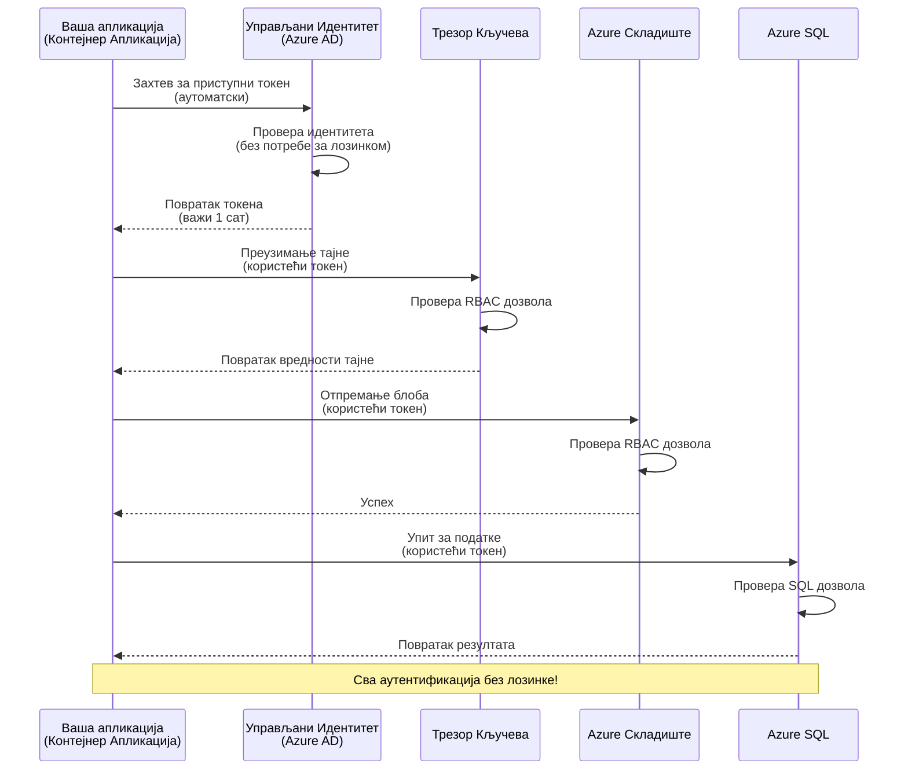
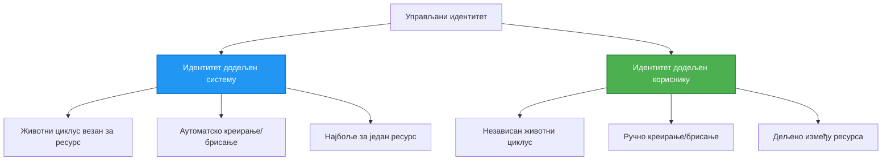

# Шаблони аутентификације и управљани идентитет

⏱️ **Процењено време**: 45-60 минута | 💰 **Утицај на трошкове**: Бесплатно (без додатних трошкова) | ⭐ **Комплексност**: Средњи ниво

**📚 Пут учења:**
- ← Претходно: [Управљање конфигурацијом](configuration.md) - Управљање променљивим окружења и тајнама
- 🎯 **Овде сте**: Аутентификација и безбедност (управљани идентитет, Key Vault, сигурни шаблони)
- → Следеће: [Први пројекат](first-project.md) - Направите своју прву AZD апликацију
- 🏠 [Почетна страна курса](../../README.md)

---

## Шта ћете научити

Завршетком ове лекције, научићете:
- Разумевање Azure шаблона аутентификације (кључеви, конекцијски низови, управљани идентитет)
- Имплементацију **управљаног идентитета** за аутентификацију без лозинки
- Обезбеђивање тајни интеграцијом са **Azure Key Vault**
- Конфигурисање **контроле приступа засноване на улогама (RBAC)** за AZD деплоје
- Примена најбољих безбедносних пракси у Container Apps и Azure сервисима
- Миграција са аутентификације засноване на кључевима на аутентификацију засновану на идентитету

## Зашто је управљани идентитет важан

### Проблем: Традиционална аутентификација

**Пре управљаног идентитета:**
```javascript
// ❌ БЕЗБЕДНОСНИ РИЗИК: Хардкодоване тајне у коду
const connectionString = "Server=mydb.database.windows.net;User=admin;Password=P@ssw0rd123";
const storageKey = "xK7mN9pQ2wR5tY8uI0oP3aS6dF1gH4jK...";
const cosmosKey = "C2x7B9n4M1p8Q5w3E6r0T2y5U8i1O4p7...";
```

**Проблеми:**
- 🔴 **Изложене тајне** у коду, конфигурационим фајловима, променљивим окружења
- 🔴 **Ротација акредитива** захтева измене кода и поновно постављање
- 🔴 **Кошмар у ревизији** - ко је приступио чему и када?
- 🔴 **Расипање** - тајне разбацане по више система
- 🔴 **Ризици усклађености** - не пролази безбедносне ревизије

### Решење: Управљани идентитет

**После управљаног идентитета:**
```javascript
// ✅ БЕЗБЕДНО: Нема тајни у коду
const credential = new DefaultAzureCredential();
const client = new BlobServiceClient(
  "https://mystorageaccount.blob.core.windows.net",
  credential  // Azure аутоматски обрађује аутентификацију
);
```

**Предности:**
- ✅ **Без тајни** у коду или конфигурацији
- ✅ **Аутоматска ротација** - Azure то обавља
- ✅ **Потпуни траг ревизије** у Azure AD логовима
- ✅ **Централизована безбедност** - управљање у Azure порталу
- ✅ **Спремно за усклађеност** - испуњава безбедносне стандарде

**Аналогија**: Традиционална аутентификација је као ношење више физичких кључева за различита врата. Управљани идентитет је као безбедносна пропусница која аутоматски омогућава приступ на основу вашег идентитета—без кључева које можете изгубити, копирати или ротирати.

---

## Преглед архитектуре

### Ток аутентификације са управљаним идентитетом


### Типови управљаних идентитета


| Карактеристика | Системски додељен | Кориснички додељен |
|----------------|-------------------|--------------------|
| **Животни циклус** | Везан за ресурс | Независан |
| **Креирање** | Аутоматски са ресурсом | Ручно креирање |
| **Брисање** | Брише се са ресурсом | Опстаје након брисања ресурса |
| **Дељење** | Само један ресурс | Више ресурса |
| **Случај употребе** | Једноставни сценарији | Комплексни сценарији са више ресурса |
| **AZD подразумевано** | ✅ Препоручено | Опционо |

---

## Предуслови

### Потребни алати

Требало би да сте их већ инсталирали из претходних лекција:

```bash
# Потврдите Azure Developer CLI
azd version
# ✅ Очекује се: azd верзија 1.0.0 или новија

# Потврдите Azure CLI
az --version
# ✅ Очекује се: azure-cli 2.50.0 или новија
```

### Azure захтеви

- Активна Azure претплата
- Дозволе за:
  - Креирање управљаних идентитета
  - Додељивање RBAC улога
  - Креирање Key Vault ресурса
  - Постављање Container Apps

### Предзнање

Требало би да сте завршили:
- [Водич за инсталацију](installation.md) - AZD подешавање
- [Основе AZD](azd-basics.md) - Основни концепти
- [Управљање конфигурацијом](configuration.md) - Променљиве окружења

---

## Лекција 1: Разумевање шаблона аутентификације

### Шаблон 1: Конекцијски низови (застарело - избегавати)

**Како функционише:**
```bash
# Стринг за повезивање садржи акредитиве
STORAGE_CONNECTION_STRING="DefaultEndpointsProtocol=https;AccountName=myaccount;AccountKey=xK7mN9pQ2wR5..."
COSMOS_CONNECTION_STRING="AccountEndpoint=https://myaccount.documents.azure.com:443/;AccountKey=C2x7..."
SQL_CONNECTION_STRING="Server=myserver.database.windows.net;User=admin;Password=P@ssw0rd..."
```

**Проблеми:**
- ❌ Тајне видљиве у променљивим окружења
- ❌ Логоване у системима за постављање
- ❌ Тешко ротирање
- ❌ Нема трага ревизије приступа

**Када користити:** Само за локални развој, никада у продукцији.

---

### Шаблон 2: Референце Key Vault-а (боље)

**Како функционише:**
```bicep
// Store secret in Key Vault
resource keyVault 'Microsoft.KeyVault/vaults@2023-02-01' = {
  name: 'mykv'
  properties: {
    enableRbacAuthorization: true
  }
}

// Reference in Container App
env: [
  {
    name: 'STORAGE_KEY'
    secretRef: 'storage-key'  // References Key Vault
  }
]
```

**Предности:**
- ✅ Тајне се безбедно чувају у Key Vault-у
- ✅ Централизовано управљање тајнама
- ✅ Ротација без измена кода

**Ограничења:**
- ⚠️ И даље се користе кључеви/лозинке
- ⚠️ Потребно је управљати приступом Key Vault-у

**Када користити:** Прелазни корак од конекцијских низова ка управљаном идентитету.

---

### Шаблон 3: Управљани идентитет (најбоља пракса)

**Како функционише:**
```bicep
// Enable managed identity
resource containerApp 'Microsoft.App/containerApps@2023-05-01' = {
  name: 'myapp'
  identity: {
    type: 'SystemAssigned'  // Automatically creates identity
  }
}

// Grant permissions
resource roleAssignment 'Microsoft.Authorization/roleAssignments@2022-04-01' = {
  scope: storageAccount
  properties: {
    roleDefinitionId: storageBlobDataContributorRole
    principalId: containerApp.identity.principalId
  }
}
```

**Код апликације:**
```javascript
// Нема потребе за тајнама!
const { DefaultAzureCredential } = require('@azure/identity');
const { BlobServiceClient } = require('@azure/storage-blob');

const credential = new DefaultAzureCredential();
const blobServiceClient = new BlobServiceClient(
  'https://mystorageaccount.blob.core.windows.net',
  credential
);
```

**Предности:**
- ✅ Без тајни у коду/конфигурацији
- ✅ Аутоматска ротација акредитива
- ✅ Потпуни траг ревизије
- ✅ Дозволе засноване на RBAC-у
- ✅ Спремно за усклађеност

**Када користити:** Увек, за продукцијске апликације.

---

## Лекција 2: Имплементација управљаног идентитета са AZD

### Корак-по-корак имплементација

Направимо безбедну Container App која користи управљани идентитет за приступ Azure Storage-у и Key Vault-у.

### Структура пројекта

```
secure-app/
├── azure.yaml                 # AZD configuration
├── infra/
│   ├── main.bicep            # Main infrastructure
│   ├── core/
│   │   ├── identity.bicep    # Managed identity setup
│   │   ├── keyvault.bicep    # Key Vault configuration
│   │   └── storage.bicep     # Storage with RBAC
│   └── app/
│       └── container-app.bicep
└── src/
    ├── app.js                # Application code
    ├── package.json
    └── Dockerfile
```

### 1. Конфигуришите AZD (azure.yaml)

```yaml
name: secure-app
metadata:
  template: secure-app@1.0.0

services:
  api:
    project: ./src
    language: js
    host: containerapp

# Enable managed identity (AZD handles this automatically)
```

### 2. Инфраструктура: Омогућите управљани идентитет

**Фајл: `infra/main.bicep`**

```bicep
targetScope = 'subscription'

param environmentName string
param location string = 'eastus'

var tags = { 'azd-env-name': environmentName }

// Resource group
resource rg 'Microsoft.Resources/resourceGroups@2021-04-01' = {
  name: 'rg-${environmentName}'
  location: location
  tags: tags
}

// Storage Account
module storage './core/storage.bicep' = {
  name: 'storage'
  scope: rg
  params: {
    name: 'st${uniqueString(rg.id)}'
    location: location
    tags: tags
  }
}

// Key Vault
module keyVault './core/keyvault.bicep' = {
  name: 'keyvault'
  scope: rg
  params: {
    name: 'kv-${uniqueString(rg.id)}'
    location: location
    tags: tags
  }
}

// Container App with Managed Identity
module containerApp './app/container-app.bicep' = {
  name: 'container-app'
  scope: rg
  params: {
    name: 'ca-${environmentName}'
    location: location
    tags: tags
    storageAccountName: storage.outputs.name
    keyVaultName: keyVault.outputs.name
  }
}

// Grant Container App access to Storage
module storageRoleAssignment './core/role-assignment.bicep' = {
  name: 'storage-role'
  scope: rg
  params: {
    principalId: containerApp.outputs.identityPrincipalId
    roleDefinitionId: 'ba92f5b4-2d11-453d-a403-e96b0029c9fe'  // Storage Blob Data Contributor
    targetResourceId: storage.outputs.id
  }
}

// Grant Container App access to Key Vault
module kvRoleAssignment './core/role-assignment.bicep' = {
  name: 'kv-role'
  scope: rg
  params: {
    principalId: containerApp.outputs.identityPrincipalId
    roleDefinitionId: '4633458b-17de-408a-b874-0445c86b69e6'  // Key Vault Secrets User
    targetResourceId: keyVault.outputs.id
  }
}

// Outputs
output AZURE_STORAGE_ACCOUNT_NAME string = storage.outputs.name
output AZURE_KEY_VAULT_NAME string = keyVault.outputs.name
output APP_URL string = containerApp.outputs.url
```

### 3. Container App са системски додељеним идентитетом

**Фајл: `infra/app/container-app.bicep`**

```bicep
param name string
param location string
param tags object = {}
param storageAccountName string
param keyVaultName string

resource containerApp 'Microsoft.App/containerApps@2023-05-01' = {
  name: name
  location: location
  tags: tags
  identity: {
    type: 'SystemAssigned'  // 🔑 Enable managed identity
  }
  properties: {
    configuration: {
      ingress: {
        external: true
        targetPort: 3000
      }
    }
    template: {
      containers: [
        {
          name: 'api'
          image: 'myregistry.azurecr.io/api:latest'
          resources: {
            cpu: json('0.5')
            memory: '1Gi'
          }
          env: [
            {
              name: 'AZURE_STORAGE_ACCOUNT_NAME'
              value: storageAccountName
            }
            {
              name: 'AZURE_KEY_VAULT_NAME'
              value: keyVaultName
            }
            // 🔑 No secrets - managed identity handles authentication!
          ]
        }
      ]
    }
  }
}

// Output the identity for RBAC assignments
output identityPrincipalId string = containerApp.identity.principalId
output id string = containerApp.id
output url string = 'https://${containerApp.properties.configuration.ingress.fqdn}'
```

### 4. Модул за додељивање RBAC улога

**Фајл: `infra/core/role-assignment.bicep`**

```bicep
param principalId string
param roleDefinitionId string  // Azure built-in role ID
param targetResourceId string

resource roleAssignment 'Microsoft.Authorization/roleAssignments@2022-04-01' = {
  name: guid(principalId, roleDefinitionId, targetResourceId)
  scope: resourceId('Microsoft.Resources/resourceGroups', resourceGroup().name)
  properties: {
    roleDefinitionId: subscriptionResourceId('Microsoft.Authorization/roleDefinitions', roleDefinitionId)
    principalId: principalId
    principalType: 'ServicePrincipal'
  }
}

output id string = roleAssignment.id
```

### 5. Код апликације са управљаним идентитетом

**Фајл: `src/app.js`**

```javascript
const express = require('express');
const { DefaultAzureCredential } = require('@azure/identity');
const { BlobServiceClient } = require('@azure/storage-blob');
const { SecretClient } = require('@azure/keyvault-secrets');

const app = express();
const PORT = process.env.PORT || 3000;

// 🔑 Иницијализуј акредитив (аутоматски ради са управљаним идентитетом)
const credential = new DefaultAzureCredential();

// Подешавање Azure Storage
const storageAccountName = process.env.AZURE_STORAGE_ACCOUNT_NAME;
const blobServiceClient = new BlobServiceClient(
  `https://${storageAccountName}.blob.core.windows.net`,
  credential  // Кључеви нису потребни!
);

// Подешавање Key Vault
const keyVaultName = process.env.AZURE_KEY_VAULT_NAME;
const secretClient = new SecretClient(
  `https://${keyVaultName}.vault.azure.net`,
  credential  // Кључеви нису потребни!
);

// Провера здравља
app.get('/health', (req, res) => {
  res.json({ status: 'healthy', authentication: 'managed-identity' });
});

// Отпреми датотеку у blob storage
app.post('/upload', async (req, res) => {
  try {
    const containerClient = blobServiceClient.getContainerClient('uploads');
    await containerClient.createIfNotExists();
    
    const blobName = `file-${Date.now()}.txt`;
    const blockBlobClient = containerClient.getBlockBlobClient(blobName);
    
    await blockBlobClient.upload('Hello from managed identity!', 30);
    
    res.json({
      success: true,
      blobName: blobName,
      message: 'File uploaded using managed identity!'
    });
  } catch (error) {
    console.error('Upload error:', error);
    res.status(500).json({ error: error.message });
  }
});

// Преузми тајну из Key Vault
app.get('/secret/:name', async (req, res) => {
  try {
    const secretName = req.params.name;
    const secret = await secretClient.getSecret(secretName);
    
    res.json({
      name: secretName,
      value: secret.value,
      message: 'Secret retrieved using managed identity!'
    });
  } catch (error) {
    console.error('Secret error:', error);
    res.status(500).json({ error: error.message });
  }
});

// Листај blob контејнере (демонстрира приступ за читање)
app.get('/containers', async (req, res) => {
  try {
    const containers = [];
    for await (const container of blobServiceClient.listContainers()) {
      containers.push(container.name);
    }
    
    res.json({
      containers: containers,
      count: containers.length,
      message: 'Containers listed using managed identity!'
    });
  } catch (error) {
    console.error('List error:', error);
    res.status(500).json({ error: error.message });
  }
});

app.listen(PORT, () => {
  console.log(`Secure API listening on port ${PORT}`);
  console.log('Authentication: Managed Identity (passwordless)');
});
```

**Фајл: `src/package.json`**

```json
{
  "name": "secure-app",
  "version": "1.0.0",
  "dependencies": {
    "express": "^4.18.2",
    "@azure/identity": "^4.0.0",
    "@azure/storage-blob": "^12.17.0",
    "@azure/keyvault-secrets": "^4.7.0"
  },
  "scripts": {
    "start": "node app.js"
  }
}
```

### 6. Поставите и тестирајте

```bash
# Иницијализуј AZD окружење
azd init

# Деплој инфраструктуру и апликацију
azd up

# Преузми URL апликације
APP_URL=$(azd env get-values | grep APP_URL | cut -d '=' -f2 | tr -d '"')

# Тестирај проверу здравља
curl $APP_URL/health
```

**✅ Очекивани излаз:**
```json
{
  "status": "healthy",
  "authentication": "managed-identity"
}
```

**Тестирајте отпремање блоба:**
```bash
curl -X POST $APP_URL/upload
```

**✅ Очекивани излаз:**
```json
{
  "success": true,
  "blobName": "file-1700404800000.txt",
  "message": "File uploaded using managed identity!"
}
```

**Тестирајте листу контејнера:**
```bash
curl $APP_URL/containers
```

**✅ Очекивани излаз:**
```json
{
  "containers": ["uploads"],
  "count": 1,
  "message": "Containers listed using managed identity!"
}
```

---

## Уобичајене Azure RBAC улоге

### Уграђени ID-ови улога за управљани идентитет

| Сервис | Назив улоге | ID улоге | Дозволе |
|--------|-------------|----------|---------|
| **Storage** | Storage Blob Data Reader | `2a2b9908-6b94-4a3d-8e5a-a7d8f8cc8a12` | Читање блобова и контејнера |
| **Storage** | Storage Blob Data Contributor | `ba92f5b4-2d11-453d-a403-e96b0029c9fe` | Читање, писање, брисање блобова |
| **Storage** | Storage Queue Data Contributor | `974c5e8b-45b9-4653-ba55-5f855dd0fb88` | Читање, писање, брисање порука у реду |
| **Key Vault** | Key Vault Secrets User | `4633458b-17de-408a-b874-0445c86b69e6` | Читање тајни |
| **Key Vault** | Key Vault Secrets Officer | `b86a8fe4-44ce-4948-aee5-eccb2c155cd7` | Читање, писање, брисање тајни |
| **Cosmos DB** | Cosmos DB Built-in Data Reader | `00000000-0000-0000-0000-000000000001` | Читање података из Cosmos DB |
| **Cosmos DB** | Cosmos DB Built-in Data Contributor | `00000000-0000-0000-0000-000000000002` | Читање, писање података у Cosmos DB |
| **SQL Database** | SQL DB Contributor | `9b7fa17d-e63e-47b0-bb0a-15c516ac86ec` | Управљање SQL базама података |
| **Service Bus** | Azure Service Bus Data Owner | `090c5cfd-751d-490a-894a-3ce6f1109419` | Слање, примање, управљање порукама |

### Како пронаћи ID-ове улога

```bash
# Наведи све уграђене улоге
az role definition list --query "[].{Name:roleName, ID:name}" --output table

# Претражи одређену улогу
az role definition list --query "[?contains(roleName, 'Storage Blob')].{Name:roleName, ID:name}" --output table

# Прикажи детаље улоге
az role definition list --name "Storage Blob Data Contributor"
```

---

## Практичне вежбе

### Вежба 1: Омогућите управљани идентитет за постојећу апликацију ⭐⭐ (Средњи ниво)

**Циљ**: Додајте управљани идентитет постојећем Container App деплоју

**Сценарио**: Имате Container App који користи конекцијске низове. Претворите га у управљани идентитет.

**Полазна тачка**: Container App са овом конфигурацијом:

```bicep
// ❌ Current: Using connection string
env: [
  {
    name: 'STORAGE_CONNECTION_STRING'
    secretRef: 'storage-connection'
  }
]
```

**Кораци**:

1. **Омогућите управљани идентитет у Bicep-у:**

```bicep
resource containerApp 'Microsoft.App/containerApps@2023-05-01' = {
  name: 'myapp'
  identity: {
    type: 'SystemAssigned'  // Add this
  }
  // ... rest of configuration
}
```

2. **Доделите приступ Storage-у:**

```bicep
// Get storage account reference
resource storageAccount 'Microsoft.Storage/storageAccounts@2023-01-01' existing = {
  name: storageAccountName
}

// Assign role
resource roleAssignment 'Microsoft.Authorization/roleAssignments@2022-04-01' = {
  name: guid(containerApp.id, 'ba92f5b4-2d11-453d-a403-e96b0029c9fe', storageAccount.id)
  scope: storageAccount
  properties: {
    roleDefinitionId: subscriptionResourceId('Microsoft.Authorization/roleDefinitions', 'ba92f5b4-2d11-453d-a403-e96b0029c9fe')
    principalId: containerApp.identity.principalId
    principalType: 'ServicePrincipal'
  }
}
```

3. **Ажурирајте код апликације:**

**Пре (конекцијски низ):**
```javascript
const { BlobServiceClient } = require('@azure/storage-blob');

const blobServiceClient = BlobServiceClient.fromConnectionString(
  process.env.STORAGE_CONNECTION_STRING
);
```

**После (управљани идентитет):**
```javascript
const { DefaultAzureCredential } = require('@azure/identity');
const { BlobServiceClient } = require('@azure/storage-blob');

const credential = new DefaultAzureCredential();
const blobServiceClient = new BlobServiceClient(
  `https://${process.env.STORAGE_ACCOUNT_NAME}.blob.core.windows.net`,
  credential
);
```

4. **Ажурирајте променљиве окружења:**

```bicep
env: [
  {
    name: 'STORAGE_ACCOUNT_NAME'
    value: storageAccountName  // Just the name, no secrets!
  }
  // Remove STORAGE_CONNECTION_STRING
]
```

5. **Поставите и тестирајте:**

```bash
# Поново распоредити
azd up

# Тестирајте да ли још увек ради
curl https://myapp.azurecontainerapps.io/upload
```

**✅ Критеријуми успеха:**
- ✅ Апликација се поставља без грешака
- ✅ Операције Storage-а функционишу (отпремање, листа, преузимање)
- ✅ Нема конекцијских низова у променљивим окружења
- ✅ Идентитет видљив у Azure порталу под "Identity" секцијом

**Провера:**

```bash
# Проверите да ли је омогућен управљани идентитет
az containerapp show \
  --name myapp \
  --resource-group rg-myapp \
  --query "identity.type"
# ✅ Очекује се: "SystemAssigned"

# Проверите доделу улоге
az role assignment list \
  --assignee $(az containerapp show --name myapp --resource-group rg-myapp --query "identity.principalId" -o tsv) \
  --scope /subscriptions/{sub-id}/resourceGroups/rg-myapp/providers/Microsoft.Storage/storageAccounts/mystorageaccount
# ✅ Очекује се: Приказује улогу "Storage Blob Data Contributor"
```

**Време**: 20-30 минута

---

### Вежба 2: Приступ више сервиса са кориснички додељеним идентитетом ⭐⭐⭐ (Напредни ниво)

**Циљ**: Направите кориснички додељен идентитет који се дели између више Container Apps

**Сценарио**: Имате 3 микросервиса који сви требају приступ истом Storage налогу и Key Vault-у.

**Кораци**:

1. **Направите кориснички додељен идентитет:**

**Фајл: `infra/core/identity.bicep`**

```bicep
param name string
param location string
param tags object = {}

resource userAssignedIdentity 'Microsoft.ManagedIdentity/userAssignedIdentities@2023-01-31' = {
  name: name
  location: location
  tags: tags
}

output id string = userAssignedIdentity.id
output principalId string = userAssignedIdentity.properties.principalId
output clientId string = userAssignedIdentity.properties.clientId
```

2. **Доделите улоге кориснички додељеном идентитету:**

```bicep
// In main.bicep
module userIdentity './core/identity.bicep' = {
  name: 'user-identity'
  scope: rg
  params: {
    name: 'id-${environmentName}'
    location: location
    tags: tags
  }
}

// Grant Storage access
resource storageRoleAssignment 'Microsoft.Authorization/roleAssignments@2022-04-01' = {
  name: guid(userIdentity.outputs.principalId, 'storage-contributor')
  scope: storageAccount
  properties: {
    roleDefinitionId: subscriptionResourceId('Microsoft.Authorization/roleDefinitions', 'ba92f5b4-2d11-453d-a403-e96b0029c9fe')
    principalId: userIdentity.outputs.principalId
    principalType: 'ServicePrincipal'
  }
}

// Grant Key Vault access
resource kvRoleAssignment 'Microsoft.Authorization/roleAssignments@2022-04-01' = {
  name: guid(userIdentity.outputs.principalId, 'kv-secrets-user')
  scope: keyVault
  properties: {
    roleDefinitionId: subscriptionResourceId('Microsoft.Authorization/roleDefinitions', '4633458b-17de-408a-b874-0445c86b69e6')
    principalId: userIdentity.outputs.principalId
    principalType: 'ServicePrincipal'
  }
}
```

3. **Доделите идентитет више Container Apps:**

```bicep
resource apiGateway 'Microsoft.App/containerApps@2023-05-01' = {
  name: 'api-gateway'
  identity: {
    type: 'UserAssigned'
    userAssignedIdentities: {
      '${userIdentity.outputs.id}': {}
    }
  }
  // ... rest of config
}

resource productService 'Microsoft.App/containerApps@2023-05-01' = {
  name: 'product-service'
  identity: {
    type: 'UserAssigned'
    userAssignedIdentities: {
      '${userIdentity.outputs.id}': {}
    }
  }
  // ... rest of config
}

resource orderService 'Microsoft.App/containerApps@2023-05-01' = {
  name: 'order-service'
  identity: {
    type: 'UserAssigned'
    userAssignedIdentities: {
      '${userIdentity.outputs.id}': {}
    }
  }
  // ... rest of config
}
```

4. **Код апликације (сви сервиси користе исти шаблон):**

```javascript
const { DefaultAzureCredential, ManagedIdentityCredential } = require('@azure/identity');

// За кориснички додељени идентитет, наведите ID клијента
const credential = new ManagedIdentityCredential(
  process.env.AZURE_CLIENT_ID  // ID клијента кориснички додељеног идентитета
);

// Или користите DefaultAzureCredential (аутоматски детектује)
const credential = new DefaultAzureCredential();

const blobServiceClient = new BlobServiceClient(
  `https://${process.env.STORAGE_ACCOUNT_NAME}.blob.core.windows.net`,
  credential
);
```

5. **Поставите и проверите:**

```bash
azd up

# Тестирајте да ли све услуге могу приступити складишту
curl https://api-gateway.azurecontainerapps.io/upload
curl https://product-service.azurecontainerapps.io/upload
curl https://order-service.azurecontainerapps.io/upload
```

**✅ Критеријуми успеха:**
- ✅ Један идентитет се дели између 3 сервиса
- ✅ Сви сервиси могу приступити Storage-у и Key Vault-у
- ✅ Идентитет опстаје ако избришете један сервис
- ✅ Централизовано управљање дозволама

**Предности кориснички додељеног идентитета:**
- Један идентитет за управљање
- Конзистентне дозволе између сервиса
- Опстаје након брисања сервиса
- Боље за комплексне архитектуре

**Време**: 30-40 минута

---

### Вежба 3: Имплементација ротације тајни у Key Vault-у ⭐⭐⭐ (Напредни ниво)

**Циљ**: Чувајте API кључеве трећих страна у Key Vault-у и приступајте им користећи управљани идентитет

**Сценарио**: Ваша апликација треба да позове спољни API (OpenAI, Stripe, SendGrid) који захтева API кључеве.

**Кораци**:

1. **Направите Key Vault са RBAC-ом:**

**Фајл: `infra/core/keyvault.bicep`**

```bicep
param name string
param location string
param tags object = {}

resource keyVault 'Microsoft.KeyVault/vaults@2023-02-01' = {
  name: name
  location: location
  tags: tags
  properties: {
    enableRbacAuthorization: true  // Use RBAC instead of access policies
    sku: {
      family: 'A'
      name: 'standard'
    }
    tenantId: subscription().tenantId
    enableSoftDelete: true
    softDeleteRetentionInDays: 90
  }
}

// Allow Container App to read secrets
output id string = keyVault.id
output name string = keyVault.name
output uri string = keyVault.properties.vaultUri
```

2. **Чувајте тајне у Key Vault-у:**

```bash
# Добиј име Key Vault-а
KV_NAME=$(azd env get-values | grep AZURE_KEY_VAULT_NAME | cut -d '=' -f2 | tr -d '"')

# Сачувај API кључеве треће стране
az keyvault secret set \
  --vault-name $KV_NAME \
  --name "OpenAI-ApiKey" \
  --value "sk-proj-xxxxxxxxxxxxx"

az keyvault secret set \
  --vault-name $KV_NAME \
  --name "Stripe-ApiKey" \
  --value "sk_live_xxxxxxxxxxxxx"

az keyvault secret set \
  --vault-name $KV_NAME \
  --name "SendGrid-ApiKey" \
  --value "SG.xxxxxxxxxxxxx"
```

3. **Код апликације за преузимање тајни:**

**Фајл: `src/config.js`**

```javascript
const { DefaultAzureCredential } = require('@azure/identity');
const { SecretClient } = require('@azure/keyvault-secrets');

class Config {
  constructor() {
    this.credential = new DefaultAzureCredential();
    this.secretClient = new SecretClient(
      `https://${process.env.AZURE_KEY_VAULT_NAME}.vault.azure.net`,
      this.credential
    );
    this.cache = {};
  }

  async getSecret(secretName) {
    // Прво провери кеш
    if (this.cache[secretName]) {
      return this.cache[secretName];
    }

    try {
      const secret = await this.secretClient.getSecret(secretName);
      this.cache[secretName] = secret.value;
      console.log(`✅ Retrieved secret: ${secretName}`);
      return secret.value;
    } catch (error) {
      console.error(`❌ Failed to get secret ${secretName}:`, error.message);
      throw error;
    }
  }

  async getOpenAIKey() {
    return this.getSecret('OpenAI-ApiKey');
  }

  async getStripeKey() {
    return this.getSecret('Stripe-ApiKey');
  }

  async getSendGridKey() {
    return this.getSecret('SendGrid-ApiKey');
  }
}

module.exports = new Config();
```

4. **Користите тајне у апликацији:**

**Фајл: `src/app.js`**

```javascript
const express = require('express');
const config = require('./config');
const { OpenAI } = require('openai');

const app = express();

// Иницијализуј OpenAI са кључем из Key Vault-а
let openaiClient;

async function initializeServices() {
  const openaiKey = await config.getOpenAIKey();
  openaiClient = new OpenAI({ apiKey: openaiKey });
  console.log('✅ Services initialized with secrets from Key Vault');
}

// Позови при покретању
initializeServices().catch(console.error);

app.post('/chat', async (req, res) => {
  try {
    const completion = await openaiClient.chat.completions.create({
      model: 'gpt-4',
      messages: [{ role: 'user', content: 'Hello!' }]
    });
    
    res.json({
      response: completion.choices[0].message.content,
      authentication: 'Key from Key Vault via Managed Identity'
    });
  } catch (error) {
    res.status(500).json({ error: error.message });
  }
});

app.listen(3000, () => {
  console.log('Secure API with Key Vault integration running');
});
```

5. **Поставите и тестирајте:**

```bash
azd up

# Тестирај да API кључеви раде
curl -X POST https://myapp.azurecontainerapps.io/chat \
  -H "Content-Type: application/json" \
  -d '{"message":"Hello AI"}'
```

**✅ Критеријуми успеха:**
- ✅ Нема API кључева у коду или променљивим окружења
- ✅ Апликација преузима кључеве из Key Vault-а
- ✅ Спољни API-ји функционишу исправно
- ✅ Можете ротирати кључеве без измена кода

**Ротирајте тајну:**

```bash
# Ажурирај тајну у Key Vault
az keyvault secret set \
  --vault-name $KV_NAME \
  --name "OpenAI-ApiKey" \
  --value "sk-proj-NEW_KEY_HERE"

# Поново покрени апликацију да преузме нови кључ
az containerapp revision restart \
  --name myapp \
  --resource-group rg-myapp
```

**Време**: 25-35 минута

---

## Провера знања

### 1. Шаблони аутентификације ✓

Тестирајте своје разумевање:

- [ ] **П1**: Која су три главна шаблона аутентификације? 
  - **О**: Конекцијски низови (застарело), референце Key Vault-а (прелазно), управљани идентитет (најбоље)

- [ ] **П2**: Зашто је управљани идентитет бољи од конекцијских низова?
  - **О**: Нема тајни у коду, аутоматска ротација, потпуни траг ревизије, RBAC дозволе

- [ ] **П3**: Када бисте користили кориснички додељен идентитет уместо системски додељеног?
  - **О**: Када делите идентитет између више ресурса или када је животни циклус идентитета независан од ресурса

**Практична провера:**
```bash
# Проверите који тип идентитета ваша апликација користи
az containerapp show \
  --name myapp \
  --resource-group rg-myapp \
  --query "identity.type"

# Наведите све доделе улога за идентитет
az role assignment list \
  --assignee $(az containerapp show --name myapp --resource-group rg-myapp --query "identity.principalId" -o tsv)
```

---

### 2. RBAC и дозволе ✓

Тестирајте своје разумевање:

- [ ] **П1**: Који је ID улоге за "Storage Blob Data Contributor"?
  - **О**: `ba92f5b4-2d11-453d-a403-e96b0029c9fe`

- [ ] **П2**: Које дозвол
- [ ] **Q1**: Како омогућити RBAC за Key Vault уместо приступних политика?
  - **A**: Поставите `enableRbacAuthorization: true` у Bicep

- [ ] **Q2**: Која Azure SDK библиотека обрађује аутентификацију преко управљаног идентитета?
  - **A**: `@azure/identity` са `DefaultAzureCredential` класом

- [ ] **Q3**: Колико дуго тајне из Key Vault-а остају у кешу?
  - **A**: Зависи од апликације; имплементирајте сопствену стратегију кеширања

**Практична провера:**
```bash
# Тестирај приступ Key Vault-у
az keyvault secret show \
  --vault-name $KV_NAME \
  --name "OpenAI-ApiKey" \
  --query "value"

# Провери да ли је RBAC омогућен
az keyvault show \
  --name $KV_NAME \
  --query "properties.enableRbacAuthorization"
# ✅ Очекује се: тачно
```

---

## Најбоље праксе за безбедност

### ✅ УРАДИТЕ:

1. **Увек користите управљани идентитет у продукцији**
   ```bicep
   identity: {
     type: 'SystemAssigned'
   }
   ```

2. **Користите RBAC улоге са најмање привилегија**
   - Користите улогу "Reader" кад год је могуће
   - Избегавајте улоге "Owner" или "Contributor" осим ако је неопходно

3. **Чувајте кључеве трећих страна у Key Vault-у**
   ```javascript
   const apiKey = await secretClient.getSecret('ThirdPartyApiKey');
   ```

4. **Омогућите евиденцију приступа**
   ```bicep
   diagnosticSettings: {
     logs: [{ category: 'AuditEvent', enabled: true }]
   }
   ```

5. **Користите различите идентитете за развој, тестирање и продукцију**
   ```bash
   azd env new dev
   azd env new staging
   azd env new prod
   ```

6. **Редовно ротирајте тајне**
   - Поставите датуме истека за тајне у Key Vault-у
   - Аутоматизујте ротацију помоћу Azure Functions

### ❌ НЕ УРАДИТЕ:

1. **Никада не хардкодирајте тајне**
   ```javascript
   // ❌ ЛОШЕ
   const apiKey = "sk-proj-xxxxxxxxxxxxx";
   ```

2. **Не користите connection strings у продукцији**
   ```javascript
   // ❌ ЛОШЕ
   BlobServiceClient.fromConnectionString(process.env.STORAGE_CONNECTION_STRING)
   ```

3. **Не дајте прекомерне дозволе**
   ```bicep
   // ❌ BAD - too much access
   roleDefinitionId: 'Owner'
   
   // ✅ GOOD - least privilege
   roleDefinitionId: 'Storage Blob Data Reader'
   ```

4. **Не бележите тајне**
   ```javascript
   // ❌ ЛОШЕ
   console.log('API Key:', apiKey);
   
   // ✅ ДОБРО
   console.log('API Key retrieved successfully');
   ```

5. **Не делите идентитете продукције између окружења**
   ```bicep
   // ❌ BAD - same identity for dev and prod
   // ✅ GOOD - separate identities per environment
   ```

---

## Водич за решавање проблема

### Проблем: "Unauthorized" при приступу Azure Storage-у

**Симптоми:**
```
Error: Unauthorized (403)
AuthorizationPermissionMismatch: This request is not authorized to perform this operation
```

**Дијагноза:**

```bash
# Проверите да ли је управљани идентитет омогућен
az containerapp show \
  --name myapp \
  --resource-group rg-myapp \
  --query "identity.type"
# ✅ Очекује се: "SystemAssigned" или "UserAssigned"

# Проверите доделе улога
PRINCIPAL_ID=$(az containerapp show --name myapp --resource-group rg-myapp --query "identity.principalId" -o tsv)
az role assignment list --assignee $PRINCIPAL_ID

# Очекује се: Треба да видите "Storage Blob Data Contributor" или сличну улогу
```

**Решења:**

1. **Доделите исправну RBAC улогу:**
```bash
STORAGE_ID=$(az storage account show --name mystorageaccount --resource-group rg-myapp --query "id" -o tsv)
az role assignment create \
  --assignee $PRINCIPAL_ID \
  --role "Storage Blob Data Contributor" \
  --scope $STORAGE_ID
```

2. **Сачекајте да се промене пропагирају (може трајати 5-10 минута):**
```bash
# Проверите статус доделе улоге
az role assignment list --assignee $PRINCIPAL_ID --scope $STORAGE_ID
```

3. **Проверите да апликациони код користи исправне креденцијале:**
```javascript
// Уверите се да користите DefaultAzureCredential
const credential = new DefaultAzureCredential();
```

---

### Проблем: Приступ Key Vault-у је одбијен

**Симптоми:**
```
Error: Forbidden (403)
The user, group or application does not have secrets get permission
```

**Дијагноза:**

```bash
# Проверите да ли је омогућен RBAC за Key Vault
az keyvault show \
  --name $KV_NAME \
  --query "properties.enableRbacAuthorization"
# ✅ Очекује се: тачно

# Проверите доделе улога
az role assignment list \
  --assignee $PRINCIPAL_ID \
  --scope /subscriptions/{sub-id}/resourceGroups/rg-myapp/providers/Microsoft.KeyVault/vaults/$KV_NAME
```

**Решења:**

1. **Омогућите RBAC на Key Vault-у:**
```bash
az keyvault update \
  --name $KV_NAME \
  --enable-rbac-authorization true
```

2. **Доделите улогу Key Vault Secrets User:**
```bash
KV_ID=$(az keyvault show --name $KV_NAME --query "id" -o tsv)
az role assignment create \
  --assignee $PRINCIPAL_ID \
  --role "Key Vault Secrets User" \
  --scope $KV_ID
```

---

### Проблем: DefaultAzureCredential не ради локално

**Симптоми:**
```
Error: DefaultAzureCredential failed to retrieve a token
CredentialUnavailableError: No credential available
```

**Дијагноза:**

```bash
# Проверите да ли сте пријављени
az account show

# Проверите аутентификацију Azure CLI
az ad signed-in-user show
```

**Решења:**

1. **Пријавите се на Azure CLI:**
```bash
az login
```

2. **Поставите Azure претплату:**
```bash
az account set --subscription "Your Subscription Name"
```

3. **За локални развој користите променљиве окружења:**
```bash
export AZURE_TENANT_ID="your-tenant-id"
export AZURE_CLIENT_ID="your-client-id"
export AZURE_CLIENT_SECRET="your-client-secret"
```

4. **Или користите другачије креденцијале локално:**
```javascript
const { DefaultAzureCredential, AzureCliCredential } = require('@azure/identity');

// Користите AzureCliCredential за локални развој
const credential = process.env.NODE_ENV === 'production' 
  ? new DefaultAzureCredential()
  : new AzureCliCredential();
```

---

### Проблем: Додела улога траје предуго да се пропагира

**Симптоми:**
- Улога је успешно додељена
- И даље добијате 403 грешке
- Повремени приступ (понекад ради, понекад не)

**Објашњење:**
Azure RBAC промене могу трајати 5-10 минута да се глобално пропагирају.

**Решење:**

```bash
# Сачекај и покушај поново
echo "Waiting for RBAC propagation..."
sleep 300  # Сачекај 5 минута

# Тестирај приступ
curl https://myapp.azurecontainerapps.io/upload

# Ако и даље не ради, поново покрени апликацију
az containerapp revision restart \
  --name myapp \
  --resource-group rg-myapp
```

---

## Разматрања трошкова

### Трошкови управљаног идентитета

| Ресурс | Трошак |
|--------|--------|
| **Управљани идентитет** | 🆓 **БЕСПЛАТНО** - Нема наплате |
| **RBAC додела улога** | 🆓 **БЕСПЛАТНО** - Нема наплате |
| **Azure AD захтеви за токене** | 🆓 **БЕСПЛАТНО** - Укључено |
| **Операције Key Vault-а** | $0.03 за 10,000 операција |
| **Складиштење у Key Vault-у** | $0.024 по тајни месечно |

**Управљани идентитет штеди новац тако што:**
- ✅ Елиминише операције Key Vault-а за аутентификацију између сервиса
- ✅ Смањује безбедносне инциденте (без процурелих креденцијала)
- ✅ Смањује оперативне трошкове (без ручне ротације)

**Пример поређења трошкова (месечно):**

| Сценарио | Connection Strings | Управљани идентитет | Уштеда |
|----------|--------------------|---------------------|--------|
| Мала апликација (1M захтева) | ~$50 (Key Vault + операције) | ~$0 | $50/месечно |
| Средња апликација (10M захтева) | ~$200 | ~$0 | $200/месечно |
| Велика апликација (100M захтева) | ~$1,500 | ~$0 | $1,500/месечно |

---

## Сазнајте више

### Званична документација
- [Azure Managed Identity](https://learn.microsoft.com/entra/identity/managed-identities-azure-resources/overview)
- [Azure RBAC](https://learn.microsoft.com/azure/role-based-access-control/overview)
- [Azure Key Vault](https://learn.microsoft.com/azure/key-vault/general/overview)
- [DefaultAzureCredential](https://learn.microsoft.com/dotnet/api/azure.identity.defaultazurecredential)

### SDK документација
- [@azure/identity (Node.js)](https://www.npmjs.com/package/@azure/identity)
- [Azure.Identity (C#)](https://www.nuget.org/packages/Azure.Identity/)
- [azure-identity (Python)](https://pypi.org/project/azure-identity/)

### Следећи кораци у овом курсу
- ← Претходно: [Управљање конфигурацијом](configuration.md)
- → Следеће: [Први пројекат](first-project.md)
- 🏠 [Почетна страна курса](../../README.md)

### Повезани примери
- [Пример Azure OpenAI Chat](../../../../examples/azure-openai-chat) - Користи управљани идентитет за Azure OpenAI
- [Пример микросервиса](../../../../examples/microservices) - Шаблони аутентификације за више сервиса

---

## Резиме

**Научили сте:**
- ✅ Три шаблона аутентификације (connection strings, Key Vault, управљани идентитет)
- ✅ Како омогућити и конфигурисати управљани идентитет у AZD
- ✅ RBAC доделе улога за Azure сервисе
- ✅ Интеграцију Key Vault-а за тајне трећих страна
- ✅ Коришћење идентитета додељених кориснику и система
- ✅ Најбоље праксе за безбедност и решавање проблема

**Кључни закључци:**
1. **Увек користите управљани идентитет у продукцији** - Без тајни, аутоматска ротација
2. **Користите RBAC улоге са најмање привилегија** - Доделите само неопходне дозволе
3. **Чувајте кључеве трећих страна у Key Vault-у** - Централизовано управљање тајнама
4. **Одвојите идентитете по окружењима** - Изолација за развој, тестирање и продукцију
5. **Омогућите евиденцију приступа** - Пратите ко је приступио чему

**Следећи кораци:**
1. Завршите практичне вежбе изнад
2. Мигрирајте постојећу апликацију са connection strings на управљани идентитет
3. Направите свој први AZD пројекат са безбедношћу од првог дана: [Први пројекат](first-project.md)

---

<!-- CO-OP TRANSLATOR DISCLAIMER START -->
**Одрицање од одговорности**:  
Овај документ је преведен помоћу услуге за превођење вештачке интелигенције [Co-op Translator](https://github.com/Azure/co-op-translator). Иако настојимо да обезбедимо тачност, молимо вас да имате у виду да аутоматски преводи могу садржати грешке или нетачности. Оригинални документ на изворном језику треба сматрати меродавним извором. За критичне информације препоручује се професионални превод од стране људи. Не преузимамо одговорност за било каква погрешна тумачења или неспоразуме који могу произаћи из коришћења овог превода.
<!-- CO-OP TRANSLATOR DISCLAIMER END -->