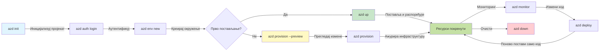
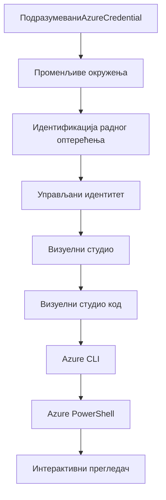

# AZD Основе - Разумевање Azure Developer CLI

# AZD Основе - Кључни концепти и основе

**Навигација кроз поглавља:**
- **📚 Почетна страна курса**: [AZD за почетнике](../../README.md)
- **📖 Текуће поглавље**: Поглавље 1 - Основе и брзи почетак
- **⬅️ Претходно**: [Преглед курса](../../README.md#-chapter-1-foundation--quick-start)
- **➡️ Следеће**: [Инсталација и подешавање](installation.md)
- **🚀 Следеће поглавље**: [Поглавље 2: Развој заснован на вештачкој интелигенцији](../microsoft-foundry/microsoft-foundry-integration.md)

## Увод

Ова лекција вас уводи у Azure Developer CLI (azd), моћан алат командне линије који убрзава ваш пут од локалног развоја до Azure имплементације. Научићете основне концепте, кључне функције и како azd поједностављује имплементацију апликација заснованих на облаку.

## Циљеви учења

На крају ове лекције, моћи ћете да:
- Разумете шта је Azure Developer CLI и његову примарну сврху
- Упознате се са основним концептима као што су шаблони, окружења и услуге
- Истражите кључне функције укључујући развој заснован на шаблонима и инфраструктуру као код
- Разумете структуру и ток рада azd пројекта
- Будете спремни за инсталацију и конфигурацију azd за ваше развојно окружење

## Исходи учења

Након завршетка ове лекције, моћи ћете да:
- Објасните улогу azd у модерним радним токовима развоја у облаку
- Идентификујете компоненте структуре azd пројекта
- Описујете како шаблони, окружења и услуге функционишу заједно
- Разумете предности инфраструктуре као кода са azd
- Препознате различите azd команде и њихове сврхе

## Шта је Azure Developer CLI (azd)?

Azure Developer CLI (azd) је алат командне линије дизајниран да убрза ваш пут од локалног развоја до Azure имплементације. Поједностављује процес изградње, имплементације и управљања апликацијама заснованим на облаку на Azure-у.

### 🎯 Зашто користити AZD? Поређење из стварног света

Упоредимо имплементацију једноставне веб апликације са базом података:

#### ❌ БЕЗ AZD: Ручна имплементација на Azure (30+ минута)

```bash
# Корак 1: Креирај групу ресурса
az group create --name myapp-rg --location eastus

# Корак 2: Креирај план за Апликациони сервис
az appservice plan create --name myapp-plan \
  --resource-group myapp-rg \
  --sku B1 --is-linux

# Корак 3: Креирај Веб апликацију
az webapp create --name myapp-web-unique123 \
  --resource-group myapp-rg \
  --plan myapp-plan \
  --runtime "NODE:18-lts"

# Корак 4: Креирај Cosmos DB налог (10-15 минута)
az cosmosdb create --name myapp-cosmos-unique123 \
  --resource-group myapp-rg \
  --kind MongoDB

# Корак 5: Креирај базу података
az cosmosdb mongodb database create \
  --account-name myapp-cosmos-unique123 \
  --resource-group myapp-rg \
  --name tododb

# Корак 6: Креирај колекцију
az cosmosdb mongodb collection create \
  --account-name myapp-cosmos-unique123 \
  --resource-group myapp-rg \
  --database-name tododb \
  --name todos

# Корак 7: Преузми стринг за повезивање
CONN_STR=$(az cosmosdb keys list \
  --name myapp-cosmos-unique123 \
  --resource-group myapp-rg \
  --type connection-strings \
  --query "connectionStrings[0].connectionString" -o tsv)

# Корак 8: Конфигуриши подешавања апликације
az webapp config appsettings set \
  --name myapp-web-unique123 \
  --resource-group myapp-rg \
  --settings MONGODB_URI="$CONN_STR"

# Корак 9: Омогући логовање
az webapp log config --name myapp-web-unique123 \
  --resource-group myapp-rg \
  --application-logging filesystem \
  --detailed-error-messages true

# Корак 10: Постави Application Insights
az monitor app-insights component create \
  --app myapp-insights \
  --location eastus \
  --resource-group myapp-rg

# Корак 11: Повежи App Insights са Веб апликацијом
INSTRUMENTATION_KEY=$(az monitor app-insights component show \
  --app myapp-insights \
  --resource-group myapp-rg \
  --query "instrumentationKey" -o tsv)

az webapp config appsettings set \
  --name myapp-web-unique123 \
  --resource-group myapp-rg \
  --settings APPINSIGHTS_INSTRUMENTATIONKEY="$INSTRUMENTATION_KEY"

# Корак 12: Изгради апликацију локално
npm install
npm run build

# Корак 13: Креирај пакет за деплојмент
zip -r app.zip . -x "*.git*" "node_modules/*"

# Корак 14: Деплоуј апликацију
az webapp deployment source config-zip \
  --resource-group myapp-rg \
  --name myapp-web-unique123 \
  --src app.zip

# Корак 15: Сачекај и моли се да ради 🙏
# (Нема аутоматске валидације, потребно ручно тестирање)
```

**Проблеми:**
- ❌ 15+ команди које треба запамтити и извршити редом
- ❌ 30-45 минута ручног рада
- ❌ Лако је направити грешке (грешке у куцању, погрешни параметри)
- ❌ Стрингови за повезивање изложени у историји терминала
- ❌ Нема аутоматског враћања уназад ако нешто не успе
- ❌ Тешко за реплицирање члановима тима
- ❌ Сваки пут другачије (није репродуктивно)

#### ✅ СА AZD: Аутоматизована имплементација (5 команди, 10-15 минута)

```bash
# Корак 1: Иницијализуј из шаблона
azd init --template todo-nodejs-mongo

# Корак 2: Аутентификуј се
azd auth login

# Корак 3: Креирај окружење
azd env new dev

# Корак 4: Прегледај измене (опционо, али препоручено)
azd provision --preview

# Корак 5: Деплоуј све
azd up

# ✨ Готово! Све је деплојовано, конфигурисано и праћено
```

**Предности:**
- ✅ **5 команди** уместо 15+ ручних корака
- ✅ **10-15 минута** укупно време (углавном чекање на Azure)
- ✅ **Нула грешака** - аутоматизовано и тестирано
- ✅ **Тајне се безбедно управљају** преко Key Vault-а
- ✅ **Аутоматско враћање уназад** у случају неуспеха
- ✅ **Потпуно репродуктивно** - исти резултат сваки пут
- ✅ **Спремно за тим** - свако може имплементирати са истим командама
- ✅ **Инфраструктура као код** - Bicep шаблони под контролом верзија
- ✅ **Уграђено праћење** - Application Insights аутоматски конфигурисан

### 📊 Смањење времена и грешака

| Метрика | Ручна имплементација | AZD имплементација | Побољшање |
|:-------|:---------------------|:-------------------|:----------|
| **Команде** | 15+ | 5 | 67% мање |
| **Време** | 30-45 мин | 10-15 мин | 60% брже |
| **Стопа грешака** | ~40% | <5% | 88% мање |
| **Конзистентност** | Ниска (ручна) | 100% (аутоматизована) | Савршено |
| **Увођење у тим** | 2-4 сата | 30 минута | 75% брже |
| **Време враћања уназад** | 30+ мин (ручна) | 2 мин (аутоматизована) | 93% брже |

## Основни концепти

### Шаблони
Шаблони су основа azd-а. Они садрже:
- **Код апликације** - Ваш изворни код и зависности
- **Дефиниције инфраструктуре** - Azure ресурси дефинисани у Bicep-у или Terraform-у
- **Конфигурационе датотеке** - Подешавања и променљиве окружења
- **Скрипте за имплементацију** - Аутоматизовани токови рада имплементације

### Окружења
Окружења представљају различите циљеве имплементације:
- **Развојно** - За тестирање и развој
- **Тестно** - Пре-продукционо окружење
- **Продукционо** - Живо продукционо окружење

Сваки тип окружења одржава своје:
- Azure ресурсне групе
- Конфигурациона подешавања
- Стање имплементације

### Услуге
Услуге су градивни блокови ваше апликације:
- **Фронтенд** - Веб апликације, SPAs
- **Бекенд** - API-ји, микросервиси
- **База података** - Решења за складиштење података
- **Складиште** - Складиштење фајлова и блобова

## Кључне функције

### 1. Развој заснован на шаблонима
```bash
# Прегледај доступне шаблоне
azd template list

# Иницијализуј из шаблона
azd init --template <template-name>
```

### 2. Инфраструктура као код
- **Bicep** - Azure-ов језик специфичан за домен
- **Terraform** - Алат за мулти-облачну инфраструктуру
- **ARM шаблони** - Azure Resource Manager шаблони

### 3. Интегрисани токови рада
```bash
# Комплетан ток рада за распоређивање
azd up            # Обезбеђивање + Распоређивање ово је без интервенције за прво подешавање

# 🧪 НОВО: Прегледајте промене инфраструктуре пре распоређивања (БЕЗБЕДНО)
azd provision --preview    # Симулирајте распоређивање инфраструктуре без прављења промена

azd provision     # Креирајте Azure ресурсе ако ажурирате инфраструктуру користите ово
azd deploy        # Распоредите код апликације или поново распоредите код апликације након ажурирања
azd down          # Очистите ресурсе
```

#### 🛡️ Безбедно планирање инфраструктуре са Preview
Команда `azd provision --preview` је револуционарна за безбедне имплементације:
- **Анализа пробног рада** - Показује шта ће бити креирано, измењено или обрисано
- **Нулти ризик** - Нема стварних промена у вашем Azure окружењу
- **Сарадња у тиму** - Дељење резултата пре имплементације
- **Процена трошкова** - Разумевање трошкова ресурса пре обавезивања

```bash
# Пример радног процеса прегледа
azd provision --preview           # Погледајте шта ће се променити
# Прегледајте резултат, дискутујте са тимом
azd provision                     # Примените промене са сигурношћу
```

### 📊 Визуелно: AZD развојни ток рада


**Објашњење тока рада:**
1. **Init** - Почетак са шаблоном или новим пројектом
2. **Auth** - Аутентификација са Azure-ом
3. **Окружење** - Креирање изолованог окружења за имплементацију
4. **Preview** - 🆕 Увек прегледајте промене у инфраструктури прво (безбедна пракса)
5. **Provision** - Креирање/ажурирање Azure ресурса
6. **Deploy** - Постављање вашег кода апликације
7. **Monitor** - Посматрање перформанси апликације
8. **Iterate** - Уношење промена и поновна имплементација кода
9. **Cleanup** - Уклањање ресурса када завршите

### 4. Управљање окружењима
```bash
# Креирај и управљај окружењима
azd env new <environment-name>
azd env select <environment-name>
azd env list
```

## 📁 Структура пројекта

Типична структура azd пројекта:
```
my-app/
├── .azd/                    # azd configuration
│   └── config.json
├── .azure/                  # Azure deployment artifacts
├── .devcontainer/          # Development container config
├── .github/workflows/      # GitHub Actions
├── .vscode/               # VS Code settings
├── infra/                 # Infrastructure code
│   ├── main.bicep        # Main infrastructure template
│   ├── main.parameters.json
│   └── modules/          # Reusable modules
├── src/                  # Application source code
│   ├── api/             # Backend services
│   └── web/             # Frontend application
├── azure.yaml           # azd project configuration
└── README.md
```

## 🔧 Конфигурационе датотеке

### azure.yaml
Главна конфигурациона датотека пројекта:
```yaml
name: my-awesome-app
metadata:
  template: my-template@1.0.0

services:
  web:
    project: ./src/web
    language: js
    host: appservice
  api:
    project: ./src/api
    language: js
    host: appservice

hooks:
  preprovision:
    shell: pwsh
    run: echo "Preparing to provision..."
```

### .azure/config.json
Конфигурација специфична за окружење:
```json
{
  "version": 1,
  "defaultEnvironment": "dev",
  "environments": {
    "dev": {
      "subscriptionId": "your-subscription-id",
      "location": "eastus"
    }
  }
}
```

## 🎪 Уобичајени токови рада са практичним вежбама

> **💡 Савет за учење:** Пратите ове вежбе редом како бисте постепено изградили своје AZD вештине.

### 🎯 Вежба 1: Иницијализујте свој први пројекат

**Циљ:** Креирајте AZD пројекат и истражите његову структуру

**Кораци:**
```bash
# Користите проверени шаблон
azd init --template todo-nodejs-mongo

# Истражите генерисане датотеке
ls -la  # Погледајте све датотеке, укључујући скривене

# Кључне датотеке креиране:
# - azure.yaml (главна конфигурација)
# - infra/ (код инфраструктуре)
# - src/ (код апликације)
```

**✅ Успех:** Имате azure.yaml, infra/ и src/ директоријуме

---

### 🎯 Вежба 2: Имплементација на Azure

**Циљ:** Завршите имплементацију од почетка до краја

**Кораци:**
```bash
# 1. Аутентификујте се
az login && azd auth login

# 2. Креирајте окружење
azd env new dev
azd env set AZURE_LOCATION eastus

# 3. Прегледајте промене (ПРЕПОРУЧЕНО)
azd provision --preview

# 4. Деплојтујте све
azd up

# 5. Потврдите деплојмент
azd show    # Погледајте URL ваше апликације
```

**Очекивано време:** 10-15 минута  
**✅ Успех:** URL апликације се отвара у прегледачу

---

### 🎯 Вежба 3: Више окружења

**Циљ:** Имплементирајте на dev и staging

**Кораци:**
```bash
# Већ имамо дев, направите стагинг
azd env new staging
azd env set AZURE_LOCATION westus2
azd up

# Пребацујте се између њих
azd env list
azd env select dev
```

**✅ Успех:** Две одвојене ресурсне групе у Azure порталу

---

### 🛡️ Чист почетак: `azd down --force --purge`

Када вам је потребно потпуно ресетовање:

```bash
azd down --force --purge
```

**Шта ради:**
- `--force`: Нема потврде
- `--purge`: Брише све локалне податке и Azure ресурсе

**Када користити:**
- Имплементација није успела
- Прелазак на друге пројекте
- Потребан нови почетак

---

## 🎪 Референца оригиналног тока рада

### Започињање новог пројекта
```bash
# Метод 1: Користите постојећи шаблон
azd init --template todo-nodejs-mongo

# Метод 2: Почните од нуле
azd init

# Метод 3: Користите тренутни директоријум
azd init .
```

### Циклус развоја
```bash
# Поставите развојно окружење
azd auth login
azd env new dev
azd env select dev

# Разместите све
azd up

# Направите измене и поново разместите
azd deploy

# Очистите када завршите
azd down --force --purge # команда у Azure Developer CLI је **тврди ресет** за ваше окружење—посебно корисно када решавате проблеме са неуспелим размештањима, чистите напуштене ресурсе или се припремате за ново размештање.
```

## Разумевање `azd down --force --purge`
Команда `azd down --force --purge` је моћан начин да потпуно уклоните своје azd окружење и све повезане ресурсе. Ево шта свака опција ради:
```
--force
```
- Прескаче потврде.
- Корисно за аутоматизацију или скриптовање где ручни унос није могућ.
- Осигурава да се уклањање настави без прекида, чак и ако CLI открије недоследности.

```
--purge
```
Брише **све повезане метаподатке**, укључујући:
Стање окружења
Локални `.azure` фолдер
Кеширане информације о имплементацији
Спречава azd да "памти" претходне имплементације, што може изазвати проблеме као што су недоследне ресурсне групе или застареле референце регистра.

### Зашто користити оба?
Када наиђете на проблем са `azd up` због преосталог стања или делимичних имплементација, ова комбинација осигурава **чист почетак**.

Посебно је корисно након ручног брисања ресурса у Azure порталу или приликом промене шаблона, окружења или конвенција именовања ресурсних група.

### Управљање више окружења
```bash
# Направи пробно окружење
azd env new staging
azd env select staging
azd up

# Врати се на развојно окружење
azd env select dev

# Упореди окружења
azd env list
```

## 🔐 Аутентификација и акредитиви

Разумевање аутентификације је кључно за успешне azd имплементације. Azure користи више метода аутентификације, а azd користи исти ланац акредитива као и други Azure алати.

### Azure CLI аутентификација (`az login`)

Пре коришћења azd, потребно је да се аутентификујете са Azure-ом. Најчешћи метод је коришћење Azure CLI:

```bash
# Интерактивна пријава (отвара прегледач)
az login

# Пријава са одређеним закупцем
az login --tenant <tenant-id>

# Пријава са сервисним принципалом
az login --service-principal -u <app-id> -p <password> --tenant <tenant-id>

# Провери тренутни статус пријаве
az account show

# Листа доступних претплата
az account list --output table

# Постави подразумевану претплату
az account set --subscription <subscription-id>
```

### Ток аутентификације
1. **Интерактивна пријава**: Отвара ваш подразумевани прегледач за аутентификацију
2. **Ток кода уређаја**: За окружења без приступа прегледачу
3. **Сервисни налог**: За аутоматизацију и CI/CD сценарије
4. **Управљани идентитет**: За апликације хостоване на Azure-у

### DefaultAzureCredential ланац

`DefaultAzureCredential` је тип акредитива који пружа поједностављено искуство аутентификације аутоматским испробавањем више извора акредитива у одређеном редоследу:

#### Редослед ланца акредитива

#### 1. Променљиве окружења
```bash
# Поставите променљиве окружења за сервисни принцип
export AZURE_CLIENT_ID="<app-id>"
export AZURE_CLIENT_SECRET="<password>"
export AZURE_TENANT_ID="<tenant-id>"
```

#### 2. Workload Identity (Kubernetes/GitHub Actions)
Аутоматски се користи у:
- Azure Kubernetes Service (AKS) са Workload Identity
- GitHub Actions са OIDC федерацијом
- Другим сценаријима федеративног идентитета

#### 3. Управљани идентитет
За Azure ресурсе као што су:
- Виртуелне машине
- App Service
- Azure Functions
- Container Instances

```bash
# Проверите да ли се ради на Azure ресурсу са управљеним идентитетом
az account show --query "user.type" --output tsv
# Враћа: "servicePrincipal" ако се користи управљени идентитет
```

#### 4. Интеграција са алатима за развој
- **Visual Studio**: Аутоматски користи пријављени налог
- **VS Code**: Користи акредитиве Azure Account екстензије
- **Azure CLI**: Користи `az login` акредитиве (најчешће за локални развој)

### Подешавање AZD аутентификације

```bash
# Метод 1: Користите Azure CLI (Препоручено за развој)
az login
azd auth login  # Користи постојеће Azure CLI акредитиве

# Метод 2: Директна azd аутентификација
azd auth login --use-device-code  # За окружења без графичког интерфејса

# Метод 3: Провера статуса аутентификације
azd auth login --check-status

# Метод 4: Одјава и поновна аутентификација
azd auth logout
azd auth login
```

### Најбоље праксе за аутентификацију

#### За локални развој
```bash
# 1. Пријавите се помоћу Azure CLI
az login

# 2. Потврдите исправну претплату
az account show
az account set --subscription "Your Subscription Name"

# 3. Користите azd са постојећим акредитивима
azd auth login
```

#### За CI/CD токове
```yaml
# GitHub Actions example
- name: Azure Login
  uses: azure/login@v1
  with:
    creds: ${{ secrets.AZURE_CREDENTIALS }}

- name: Deploy with azd
  run: |
    azd auth login --client-id ${{ secrets.AZURE_CLIENT_ID }} \
                    --client-secret ${{ secrets.AZURE_CLIENT_SECRET }} \
                    --tenant-id ${{ secrets.AZURE_TENANT_ID }}
    azd up --no-prompt
```

#### За продукциона окружења
- Користите **управљани идентитет** када радите на Azure ресурсима
- Користите **сервисни налог** за аутоматизацију сценарија
- Избегавајте чување акредитива у коду или конфигурационим датотекама
- Користите **Azure Key Vault** за осетљиву конфигурацију

### Уобичајени проблеми са аутентификацијом и решења

#### Проблем: "Није пронађена претплата"
```bash
# Решење: Постави подразумевану претплату
az account list --output table
az account set --subscription "<subscription-id>"
azd env set AZURE_SUBSCRIPTION_ID "<subscription-id>"
```

#### Проблем: "Недовољне дозволе"
```bash
# Решење: Проверите и доделите потребне улоге
az role assignment list --assignee $(az account show --query user.name --output tsv)

# Заједничке потребне улоге:
# - Сарадник (за управљање ресурсима)
# - Администратор корисничког приступа (за доделу улога)
```

#### Проблем: "Токен је истекао"
```bash
# Решење: Поново се аутентификујте
az logout
az login
azd auth logout
azd auth login
```

### Аутентификација у различитим сценаријима

#### Локални развој
```bash
# Налог за лични развој
az login
azd auth login
```

#### Тимски развој
```bash
# Користите одређеног закупца за организацију
az login --tenant contoso.onmicrosoft.com
azd auth login
```

#### Мулти-тенант сценарији
```bash
# Пребацивање између закупаца
az login --tenant tenant1.onmicrosoft.com
# Деплојовање на закупца 1
azd up

az login --tenant tenant2.onmicrosoft.com  
# Деплојовање на закупца 2
azd up
```

### Безбедносни аспекти

1. **Чување акредитива**: Никада не чувајте акредитиве у изворном коду
2. **Ограничење обима**: Користите принцип најмањих привилегија за сервисне налоге
3. **Ротација токена**: Редовно ротирајте тајне сервисних налога
4. **Траг активности**: Пратите активности аутентификације и имплементације
5. **Мрежна безбедност**: Користите приватне крајње тачке кад год је могуће

### Решавање проблема са аутентификацијом

```bash
# Решавање проблема са аутентификацијом
azd auth login --check-status
az account show
az account get-access-token

# Уобичајене дијагностичке команде
whoami                          # Тренутни кориснички контекст
az ad signed-in-user show      # Детаљи корисника Azure AD
az group list                  # Тестирање приступа ресурсима
```

## Разумевање `azd down --force --purge`

### Откривање
```bash
azd template list              # Прегледај шаблоне
azd template show <template>   # Детаљи шаблона
azd init --help               # Опције иницијализације
```

### Управљање
- [Инсталација и подешавање](installation.md) - Инсталирајте и конфигуришите azd
- [Ваш први пројекат](first-project.md) - Практични туторијал
- [Водич за конфигурацију](configuration.md) - Напредне опције конфигурације

**🎯 Спремни за следеће поглавље?**
- [Поглавље 2: Развој заснован на вештачкој интелигенцији](../microsoft-foundry/microsoft-foundry-integration.md) - Почните са изградњом AI апликација

## Додатни ресурси

- [Преглед Azure Developer CLI](https://learn.microsoft.com/en-us/azure/developer/azure-developer-cli/)
- [Галерија шаблона](https://azure.github.io/awesome-azd/)
- [Примери из заједнице](https://github.com/Azure-Samples)

---

## 🙋 Често постављана питања

### Општа питања

**П: Која је разлика између AZD и Azure CLI?**

О: Azure CLI (`az`) служи за управљање појединачним Azure ресурсима. AZD (`azd`) је за управљање целокупним апликацијама:

```bash
# Azure CLI - Управљање ресурсима на ниском нивоу
az webapp create --name myapp --resource-group rg
az sql server create --name myserver --resource-group rg
# ...потребно је још много команди

# AZD - Управљање на нивоу апликације
azd up  # Размешта целу апликацију са свим ресурсима
```

**Замислите овако:**
- `az` = Рад са појединачним Лего коцкицама
- `azd` = Рад са комплетним Лего сетовима

---

**П: Да ли морам да знам Bicep или Terraform да бих користио AZD?**

О: Не! Почните са шаблонима:
```bash
# Користите постојећи шаблон - није потребно знање о IaC
azd init --template todo-nodejs-mongo
azd up
```

Bicep можете научити касније за прилагођавање инфраструктуре. Шаблони пружају функционалне примере за учење.

---

**П: Колико кошта покретање AZD шаблона?**

О: Трошкови варирају у зависности од шаблона. Већина шаблона за развој кошта $50-150 месечно:

```bash
# Прегледајте трошкове пре него што примените
azd provision --preview

# Увек очистите када не користите
azd down --force --purge  # Уклања све ресурсе
```

**Савет:** Користите бесплатне нивое где је могуће:
- App Service: F1 (бесплатни) ниво
- Azure OpenAI: 50,000 токена месечно бесплатно
- Cosmos DB: 1000 RU/s бесплатни ниво

---

**П: Могу ли користити AZD са постојећим Azure ресурсима?**

О: Да, али је лакше почети од почетка. AZD најбоље функционише када управља целокупним животним циклусом. За постојеће ресурсе:

```bash
# Опција 1: Увези постојеће ресурсе (напредно)
azd init
# Затим измените infra/ да референцира постојеће ресурсе

# Опција 2: Почните од почетка (препоручено)
azd init --template matching-your-stack
azd up  # Креира ново окружење
```

---

**П: Како да поделим свој пројекат са тимом?**

О: Комитујте AZD пројекат у Git (али НЕ .azure фолдер):

```bash
# Већ је у .gitignore подразумевано
.azure/        # Садржи тајне и податке о окружењу
*.env          # Променљиве окружења

# Чланови тима тада:
git clone <your-repo>
azd auth login
azd env new <their-name>-dev
azd up
```

Сви добијају идентичну инфраструктуру из истих шаблона.

---

### Питања о решавању проблема

**П: "azd up" је застало на пола. Шта да радим?**

О: Проверите грешку, исправите је, па покушајте поново:

```bash
# Погледајте детаљне записе
azd show

# Уобичајене исправке:

# 1. Ако је квота прекорачена:
azd env set AZURE_LOCATION "westus2"  # Покушајте другу регију

# 2. Ако постоји конфликт имена ресурса:
azd down --force --purge  # Очистите све
azd up  # Поново покушајте

# 3. Ако је аутентификација истекла:
az login
azd auth login
azd up
```

**Најчешћи проблем:** Погрешно изабрана Azure претплата
```bash
az account list --output table
az account set --subscription "<correct-subscription>"
```

---

**П: Како да применим само измене у коду без поновног обезбеђивања?**

О: Користите `azd deploy` уместо `azd up`:

```bash
azd up          # Први пут: обезбеђивање + распоређивање (споро)

# Направите измене у коду...

azd deploy      # Следећи пут: само распоређивање (брзо)
```

Поређење брзине:
- `azd up`: 10-15 минута (обезбеђује инфраструктуру)
- `azd deploy`: 2-5 минута (само код)

---

**П: Могу ли да прилагодим инфраструктурне шаблоне?**

О: Да! Уредите Bicep фајлове у `infra/`:

```bash
# После azd иницијализације
cd infra/
code main.bicep  # Уредите у VS Code

# Прегледајте измене
azd provision --preview

# Примените измене
azd provision
```

**Савет:** Почните са малим изменама - промените SKUs:
```bicep
// infra/main.bicep
sku: {
  name: 'B1'  // Change to 'P1V2' for production
}
```

---

**П: Како да избришем све што је AZD креирао?**

О: Једна команда уклања све ресурсе:

```bash
azd down --force --purge

# Ово брише:
# - Све Azure ресурсе
# - Групу ресурса
# - Стање локалног окружења
# - Кеширане податке о распоређивању
```

**Увек покрените ово када:**
- Завршите тестирање шаблона
- Прелазите на други пројекат
- Желите да почнете од почетка

**Уштеда трошкова:** Брисање неискоришћених ресурса = $0 трошкова

---

**П: Шта ако сам случајно обрисао ресурсе у Azure порталу?**

О: AZD стање може бити ван синхронизације. Приступ чистом почетку:

```bash
# 1. Уклоните локално стање
azd down --force --purge

# 2. Почните из почетка
azd up

# Алтернатива: Нека AZD открије и поправи
azd provision  # Направиће недостајуће ресурсе
```

---

### Напредна питања

**П: Могу ли да користим AZD у CI/CD процесима?**

О: Да! Пример за GitHub Actions:

```yaml
# .github/workflows/deploy.yml
name: Deploy with AZD

on:
  push:
    branches: [main]

jobs:
  deploy:
    runs-on: ubuntu-latest
    steps:
      - uses: actions/checkout@v2
      
      - name: Install azd
        run: curl -fsSL https://aka.ms/install-azd.sh | bash
      
      - name: Azure Login
        run: |
          azd auth login \
            --client-id ${{ secrets.AZURE_CLIENT_ID }} \
            --client-secret ${{ secrets.AZURE_CLIENT_SECRET }} \
            --tenant-id ${{ secrets.AZURE_TENANT_ID }}
      
      - name: Deploy
        run: azd up --no-prompt
```

---

**П: Како да управљам тајнама и осетљивим подацима?**

О: AZD се аутоматски интегрише са Azure Key Vault:

```bash
# Тајне се чувају у Key Vault-у, а не у коду
azd env set DATABASE_PASSWORD "$(openssl rand -base64 32)"

# AZD аутоматски:
# 1. Креира Key Vault
# 2. Чува тајну
# 3. Додељује приступ апликацији преко Управљаног Идентитета
# 4. Убацује током извршавања
```

**Никада не комитујте:**
- `.azure/` фолдер (садржи податке о окружењу)
- `.env` фајлове (локалне тајне)
- Конекцијске стрингове

---

**П: Могу ли да применим у више региона?**

О: Да, креирајте окружење за сваки регион:

```bash
# Источноамеричко окружење
azd env new prod-eastus
azd env set AZURE_LOCATION eastus
azd up

# Западноевропско окружење
azd env new prod-westeurope
azd env set AZURE_LOCATION westeurope
azd up

# Свако окружење је независно
azd env list
```

За праве апликације у више региона, прилагодите Bicep шаблоне да примене у више региона истовремено.

---

**П: Где могу добити помоћ ако запнем?**

1. **AZD документација:** https://learn.microsoft.com/azure/developer/azure-developer-cli/
2. **GitHub Issues:** https://github.com/Azure/azure-dev/issues
3. **Discord:** [Azure Discord](https://discord.gg/microsoft-azure) - #azure-developer-cli канал
4. **Stack Overflow:** Ознака `azure-developer-cli`
5. **Овај курс:** [Водич за решавање проблема](../troubleshooting/common-issues.md)

**Савет:** Пре постављања питања, покрените:
```bash
azd show       # Приказује тренутно стање
azd version    # Приказује вашу верзију
```
Укључите ове информације у своје питање за бржу помоћ.

---

## 🎓 Шта је следеће?

Сада разумете основе AZD-а. Изаберите свој пут:

### 🎯 За почетнике:
1. **Следеће:** [Инсталација и подешавање](installation.md) - Инсталирајте AZD на свој рачунар
2. **Затим:** [Ваш први пројекат](first-project.md) - Примените своју прву апликацију
3. **Вежбајте:** Завршите сва 3 задатка у овом леку

### 🚀 За AI програмере:
1. **Прескочите на:** [Поглавље 2: Развој заснован на вештачкој интелигенцији](../microsoft-foundry/microsoft-foundry-integration.md)
2. **Примените:** Почните са `azd init --template get-started-with-ai-chat`
3. **Учите:** Градите док примењујете

### 🏗️ За искусне програмере:
1. **Прегледајте:** [Водич за конфигурацију](configuration.md) - Напредна подешавања
2. **Истражите:** [Инфраструктура као код](../deployment/provisioning.md) - Детаљно о Bicep-у
3. **Градите:** Креирајте прилагођене шаблоне за свој стек

---

**Навигација кроз поглавља:**
- **📚 Почетна страна курса**: [AZD за почетнике](../../README.md)
- **📖 Текуће поглавље**: Поглавље 1 - Основе и брзи почетак  
- **⬅️ Претходно**: [Преглед курса](../../README.md#-chapter-1-foundation--quick-start)
- **➡️ Следеће**: [Инсталација и подешавање](installation.md)
- **🚀 Следеће поглавље**: [Поглавље 2: Развој заснован на вештачкој интелигенцији](../microsoft-foundry/microsoft-foundry-integration.md)

---

<!-- CO-OP TRANSLATOR DISCLAIMER START -->
**Одрицање од одговорности**:  
Овај документ је преведен коришћењем услуге за превођење помоћу вештачке интелигенције [Co-op Translator](https://github.com/Azure/co-op-translator). Иако настојимо да обезбедимо тачност, молимо вас да имате у виду да аутоматски преводи могу садржати грешке или нетачности. Оригинални документ на његовом изворном језику треба сматрати ауторитативним извором. За критичне информације препоручује се професионални превод од стране људи. Не преузимамо одговорност за било каква погрешна тумачења или неспоразуме који могу настати услед коришћења овог превода.
<!-- CO-OP TRANSLATOR DISCLAIMER END -->