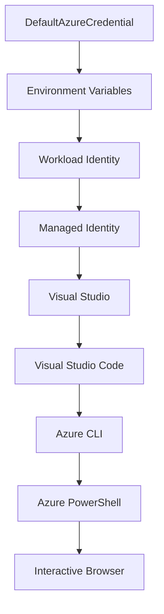

<!--
CO_OP_TRANSLATOR_METADATA:
{
  "original_hash": "4dc26ed8004b58a51875efd07203340f",
  "translation_date": "2025-09-26T18:45:52+00:00",
  "source_file": "docs/getting-started/azd-basics.md",
  "language_code": "sr"
}
-->
# AZD Основе - Разумевање Azure Developer CLI

# AZD Основе - Кључни концепти и основе

**Навигација кроз поглавља:**
- **📚 Почетна страна курса**: [AZD За Почетнике](../../README.md)
- **📖 Текуће поглавље**: Поглавље 1 - Основе и Брзи Почетак
- **⬅️ Претходно**: [Преглед курса](../../README.md#-chapter-1-foundation--quick-start)
- **➡️ Следеће**: [Инсталација и Подешавање](installation.md)
- **🚀 Следеће поглавље**: [Поглавље 2: Развој са AI у Првом Плану](../ai-foundry/azure-ai-foundry-integration.md)

## Увод

Ова лекција вас упознаје са Azure Developer CLI (azd), моћним алатом командне линије који убрзава ваш пут од локалног развоја до Azure имплементације. Научићете основне концепте, кључне функције и разумети како azd поједностављује имплементацију апликација за облак.

## Циљеви учења

На крају ове лекције, моћи ћете:
- Разумети шта је Azure Developer CLI и његова основна сврха
- Упознати се са основним концептима као што су шаблони, окружења и услуге
- Истражити кључне функције, укључујући развој заснован на шаблонима и инфраструктуру као код
- Разумети структуру пројекта azd и ток рада
- Бити спремни за инсталацију и конфигурацију azd за ваш развојни окружење

## Резултати учења

Након завршетка ове лекције, моћи ћете:
- Објаснити улогу azd у модерним токовима рада за развој облака
- Идентификовати компоненте структуре azd пројекта
- Описати како шаблони, окружења и услуге функционишу заједно
- Разумети предности инфраструктуре као код са azd
- Препознати различите azd команде и њихове сврхе

## Шта је Azure Developer CLI (azd)?

Azure Developer CLI (azd) је алат командне линије дизајниран да убрза ваш пут од локалног развоја до Azure имплементације. Он поједностављује процес изградње, имплементације и управљања апликацијама за облак на Azure платформи.

## Основни концепти

### Шаблони
Шаблони су основа azd. Они садрже:
- **Код апликације** - Ваш изворни код и зависности
- **Дефиниције инфраструктуре** - Azure ресурси дефинисани у Bicep или Terraform
- **Конфигурационе датотеке** - Подешавања и променљиве окружења
- **Скрипте за имплементацију** - Аутоматизовани токови имплементације

### Окружења
Окружења представљају различите циљеве имплементације:
- **Развојно** - За тестирање и развој
- **Прелазно** - Окружење пре продукције
- **Продукционо** - Живо продукционо окружење

Сваки тип окружења одржава своје:
- Azure групе ресурса
- Конфигурациона подешавања
- Стање имплементације

### Услуге
Услуге су градивни блокови ваше апликације:
- **Фронтенд** - Веб апликације, SPA
- **Бекенд** - API-ји, микросервиси
- **База података** - Решења за складиштење података
- **Складиште** - Фајлови и складиштење блобова

## Кључне функције

### 1. Развој заснован на шаблонима
```bash
# Browse available templates
azd template list

# Initialize from a template
azd init --template <template-name>
```

### 2. Инфраструктура као код
- **Bicep** - Azure-ов доменски специфичан језик
- **Terraform** - Алат за инфраструктуру на више облака
- **ARM Шаблони** - Azure Resource Manager шаблони

### 3. Интегрисани токови рада
```bash
# Complete deployment workflow
azd up            # Provision + Deploy this is hands off for first time setup
azd provision     # Create Azure resources if you update the infrastructure use this
azd deploy        # Deploy application code or redeploy application code once update
azd down          # Clean up resources
```

### 4. Управљање окружењима
```bash
# Create and manage environments
azd env new <environment-name>
azd env select <environment-name>
azd env list
```

## 📁 Структура пројекта

Типична структура azd пројекта:
```
my-app/
├── .azd/                    # azd configuration
│   └── config.json
├── .azure/                  # Azure deployment artifacts
├── .devcontainer/          # Development container config
├── .github/workflows/      # GitHub Actions
├── .vscode/               # VS Code settings
├── infra/                 # Infrastructure code
│   ├── main.bicep        # Main infrastructure template
│   ├── main.parameters.json
│   └── modules/          # Reusable modules
├── src/                  # Application source code
│   ├── api/             # Backend services
│   └── web/             # Frontend application
├── azure.yaml           # azd project configuration
└── README.md
```

## 🔧 Конфигурационе датотеке

### azure.yaml
Главна конфигурациона датотека пројекта:
```yaml
name: my-awesome-app
metadata:
  template: my-template@1.0.0

services:
  web:
    project: ./src/web
    language: js
    host: appservice
  api:
    project: ./src/api
    language: js
    host: appservice

hooks:
  preprovision:
    shell: pwsh
    run: echo "Preparing to provision..."
```

### .azure/config.json
Конфигурација специфична за окружење:
```json
{
  "version": 1,
  "defaultEnvironment": "dev",
  "environments": {
    "dev": {
      "subscriptionId": "your-subscription-id",
      "location": "eastus"
    }
  }
}
```

## 🎪 Уобичајени токови рада

### Започињање новог пројекта
```bash
# Method 1: Use existing template
azd init --template todo-nodejs-mongo

# Method 2: Start from scratch
azd init

# Method 3: Use current directory
azd init .
```

### Циклус развоја
```bash
# Set up development environment
azd auth login
azd env new dev
azd env select dev

# Deploy everything
azd up

# Make changes and redeploy
azd deploy

# Clean up when done
azd down --force --purge # command in the Azure Developer CLI is a **hard reset** for your environment—especially useful when you're troubleshooting failed deployments, cleaning up orphaned resources, or prepping for a fresh redeploy.
```

## Разумевање `azd down --force --purge`
Команда `azd down --force --purge` је моћан начин да потпуно уклоните ваше azd окружење и све повезане ресурсе. Ево шта свака опција ради:
```
--force
```
- Прескаче потврде.
- Корисно за аутоматизацију или скриптовање где ручни унос није изводљив.
- Осигурава да се уклањање настави без прекида, чак и ако CLI открије недоследности.

```
--purge
```
Брише **све повезане метаподатке**, укључујући:
Стање окружења  
Локалну `.azure` фасциклу  
Кеширане информације о имплементацији  
Спречава azd да "памти" претходне имплементације, што може изазвати проблеме као што су неусклађене групе ресурса или застареле референце регистра.

### Зашто користити оба?
Када наиђете на проблеме са `azd up` због преосталог стања или делимичних имплементација, ова комбинација осигурава **чист почетак**.

Посебно је корисно након ручног брисања ресурса у Azure порталу или приликом промене шаблона, окружења или конвенција именовања група ресурса.

### Управљање више окружења
```bash
# Create staging environment
azd env new staging
azd env select staging
azd up

# Switch back to dev
azd env select dev

# Compare environments
azd env list
```

## 🔐 Аутентикација и акредитиви

Разумевање аутентикације је кључно за успешне azd имплементације. Azure користи више метода аутентикације, а azd користи исти ланац акредитива као и други Azure алати.

### Azure CLI Аутентикација (`az login`)

Пре коришћења azd, потребно је да се аутентификујете са Azure-ом. Најчешћи метод је коришћење Azure CLI:

```bash
# Interactive login (opens browser)
az login

# Login with specific tenant
az login --tenant <tenant-id>

# Login with service principal
az login --service-principal -u <app-id> -p <password> --tenant <tenant-id>

# Check current login status
az account show

# List available subscriptions
az account list --output table

# Set default subscription
az account set --subscription <subscription-id>
```

### Ток аутентикације
1. **Интерактивна пријава**: Отвара ваш подразумевани претраживач за аутентификацију
2. **Ток кода уређаја**: За окружења без приступа претраживачу
3. **Сервисни принципал**: За аутоматизацију и CI/CD сценарије
4. **Управљани идентитет**: За апликације хостоване на Azure-у

### DefaultAzureCredential Ланац

`DefaultAzureCredential` је тип акредитива који пружа поједностављено искуство аутентификације аутоматским испробавањем више извора акредитива у одређеном редоследу:

#### Редослед ланца акредитива


#### 1. Променљиве окружења
```bash
# Set environment variables for service principal
export AZURE_CLIENT_ID="<app-id>"
export AZURE_CLIENT_SECRET="<password>"
export AZURE_TENANT_ID="<tenant-id>"
```

#### 2. Идентитет радног оптерећења (Kubernetes/GitHub Actions)
Аутоматски се користи у:
- Azure Kubernetes Service (AKS) са идентитетом радног оптерећења
- GitHub Actions са OIDC федерацијом
- Другим сценаријима федеративног идентитета

#### 3. Управљани идентитет
За Azure ресурсе као што су:
- Виртуелне машине
- App Service
- Azure Functions
- Container Instances

```bash
# Check if running on Azure resource with managed identity
az account show --query "user.type" --output tsv
# Returns: "servicePrincipal" if using managed identity
```

#### 4. Интеграција са алатима за развој
- **Visual Studio**: Аутоматски користи налог са којим сте пријављени
- **VS Code**: Користи акредитиве Azure Account екстензије
- **Azure CLI**: Користи акредитиве `az login` (најчешће за локални развој)

### Подешавање аутентикације за AZD

```bash
# Method 1: Use Azure CLI (Recommended for development)
az login
azd auth login  # Uses existing Azure CLI credentials

# Method 2: Direct azd authentication
azd auth login --use-device-code  # For headless environments

# Method 3: Check authentication status
azd auth login --check-status

# Method 4: Logout and re-authenticate
azd auth logout
azd auth login
```

### Најбоље праксе за аутентикацију

#### За локални развој
```bash
# 1. Login with Azure CLI
az login

# 2. Verify correct subscription
az account show
az account set --subscription "Your Subscription Name"

# 3. Use azd with existing credentials
azd auth login
```

#### За CI/CD Пипелине
```yaml
# GitHub Actions example
- name: Azure Login
  uses: azure/login@v1
  with:
    creds: ${{ secrets.AZURE_CREDENTIALS }}

- name: Deploy with azd
  run: |
    azd auth login --client-id ${{ secrets.AZURE_CLIENT_ID }} \
                    --client-secret ${{ secrets.AZURE_CLIENT_SECRET }} \
                    --tenant-id ${{ secrets.AZURE_TENANT_ID }}
    azd up --no-prompt
```

#### За продукциона окружења
- Користите **управљани идентитет** када радите на Azure ресурсима
- Користите **сервисни принципал** за сценарије аутоматизације
- Избегавајте чување акредитива у коду или конфигурационим датотекама
- Користите **Azure Key Vault** за осетљиву конфигурацију

### Уобичајени проблеми са аутентикацијом и решења

#### Проблем: "Није пронађена претплата"
```bash
# Solution: Set default subscription
az account list --output table
az account set --subscription "<subscription-id>"
azd env set AZURE_SUBSCRIPTION_ID "<subscription-id>"
```

#### Проблем: "Недовољне дозволе"
```bash
# Solution: Check and assign required roles
az role assignment list --assignee $(az account show --query user.name --output tsv)

# Common required roles:
# - Contributor (for resource management)
# - User Access Administrator (for role assignments)
```

#### Проблем: "Токен је истекао"
```bash
# Solution: Re-authenticate
az logout
az login
azd auth logout
azd auth login
```

### Аутентикација у различитим сценаријима

#### Локални развој
```bash
# Personal development account
az login
azd auth login
```

#### Тимски развој
```bash
# Use specific tenant for organization
az login --tenant contoso.onmicrosoft.com
azd auth login
```

#### Сценарији са више тенаната
```bash
# Switch between tenants
az login --tenant tenant1.onmicrosoft.com
# Deploy to tenant 1
azd up

az login --tenant tenant2.onmicrosoft.com  
# Deploy to tenant 2
azd up
```

### Безбедносни аспекти

1. **Чување акредитива**: Никада не чувајте акредитиве у изворном коду
2. **Ограничење обима**: Користите принцип најмањих привилегија за сервисне принципале
3. **Ротација токена**: Редовно ротирајте тајне сервисних принципала
4. **Траг ревизије**: Пратите активности аутентификације и имплементације
5. **Мрежна безбедност**: Користите приватне крајње тачке кад год је могуће

### Решавање проблема са аутентикацијом

```bash
# Debug authentication issues
azd auth login --check-status
az account show
az account get-access-token

# Common diagnostic commands
whoami                          # Current user context
az ad signed-in-user show      # Azure AD user details
az group list                  # Test resource access
```

## Разумевање `azd down --force --purge`

### Откривање
```bash
azd template list              # Browse templates
azd template show <template>   # Template details
azd init --help               # Initialization options
```

### Управљање пројектима
```bash
azd show                     # Project overview
azd env show                 # Current environment
azd config list             # Configuration settings
```

### Праћење
```bash
azd monitor                  # Open Azure portal
azd pipeline config          # Set up CI/CD
azd logs                     # View application logs
```

## Најбоље праксе

### 1. Користите смислена имена
```bash
# Good
azd env new production-east
azd init --template web-app-secure

# Avoid
azd env new env1
azd init --template template1
```

### 2. Искористите шаблоне
- Почните са постојећим шаблонима
- Прилагодите их својим потребама
- Креирајте шаблоне који се могу поново користити у вашој организацији

### 3. Изолација окружења
- Користите одвојена окружења за развој/прелаз/продукцију
- Никада не имплементирајте директно у продукцију са локалног рачунара
- Користите CI/CD пипелине за имплементације у продукцију

### 4. Управљање конфигурацијом
- Користите променљиве окружења за осетљиве податке
- Чувајте конфигурацију у систему за контролу верзија
- Документујте подешавања специфична за окружење

## Напредак у учењу

### Почетник (1-2 недеље)
1. Инсталирајте azd и аутентификујте се
2. Имплементирајте једноставан шаблон
3. Разумите структуру пројекта
4. Научите основне команде (up, down, deploy)

### Средњи ниво (3-4 недеље)
1. Прилагодите шаблоне
2. Управљајте више окружења
3. Разумите инфраструктуру као код
4. Поставите CI/CD пипелине

### Напредни ниво (5+ недеља)
1. Креирајте прилагођене шаблоне
2. Напредни инфраструктурни обрасци
3. Имплементације у више региона
4. Конфигурације на нивоу предузећа

## Следећи кораци

**📖 Наставите учење у Поглављу 1:**
- [Инсталација и Подешавање](installation.md) - Инсталирајте и конфигуришите azd
- [Ваш Први Пројекат](first-project.md) - Завршите практични туторијал
- [Водич за Конфигурацију](configuration.md) - Напредне опције конфигурације

**🎯 Спремни за следеће поглавље?**
- [Поглавље 2: Развој са AI у Првом Плану](../ai-foundry/azure-ai-foundry-integration.md) - Почните са изградњом AI апликација

## Додатни ресурси

- [Azure Developer CLI Преглед](https://learn.microsoft.com/en-us/azure/developer/azure-developer-cli/)
- [Галерија Шаблона](https://azure.github.io/awesome-azd/)
- [Примери из Заједнице](https://github.com/Azure-Samples)

---

**Навигација кроз поглавља:**
- **📚 Почетна страна курса**: [AZD За Почетнике](../../README.md)
- **📖 Текуће поглавље**: Поглавље 1 - Основе и Брзи Почетак  
- **⬅️ Претходно**: [Преглед курса](../../README.md#-chapter-1-foundation--quick-start)
- **➡️ Следеће**: [Инсталација и Подешавање](installation.md)
- **🚀 Следеће поглавље**: [Поглавље 2: Развој са AI у Првом Плану](../ai-foundry/azure-ai-foundry-integration.md)

---

