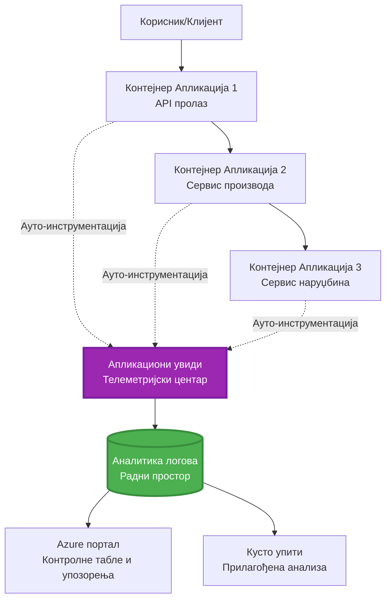

# Интеграција Application Insights са AZD

⏱️ **Процењено време**: 40-50 минута | 💰 **Утицај на трошкове**: ~$5-15/месечно | ⭐ **Комплексност**: Средњи ниво

**📚 Пут учења:**
- ← Претходно: [Провере пре покретања](preflight-checks.md) - Валидација пре деплоја
- 🎯 **Овде сте**: Интеграција Application Insights (Мониторинг, телеметрија, дебаговање)
- → Следеће: [Водич за деплој](../deployment/deployment-guide.md) - Деплој на Azure
- 🏠 [Почетна страна курса](../../README.md)

---

## Шта ћете научити

Завршетком ове лекције, научићете:
- Аутоматску интеграцију **Application Insights** у AZD пројекте
- Конфигурацију **дистрибуираног праћења** за микросервисе
- Имплементацију **прилагођене телеметрије** (метрике, догађаји, зависности)
- Постављање **живих метрика** за мониторинг у реалном времену
- Креирање **упозорења и контролних табли** из AZD деплоја
- Дебаговање проблема у продукцији помоћу **телеметријских упита**
- Оптимизацију **трошкова и стратегија узорковања**
- Мониторинг **AI/LLM апликација** (токени, кашњење, трошкови)

## Зашто је Application Insights важан за AZD

### Изазов: Продукцијска видљивост

**Без Application Insights:**
```
❌ No visibility into production behavior
❌ Manual log aggregation across services
❌ Reactive debugging (wait for customer complaints)
❌ No performance metrics
❌ Cannot trace requests across services
❌ Unknown failure rates and bottlenecks
```

**Са Application Insights + AZD:**
```
✅ Automatic telemetry collection
✅ Centralized logs from all services
✅ Proactive issue detection
✅ End-to-end request tracing
✅ Performance metrics and insights
✅ Real-time dashboards
✅ AZD provisions everything automatically
```

**Аналогија**: Application Insights је као "црна кутија" за снимање летова + контролна табла у кокпиту за вашу апликацију. Видите све што се дешава у реалном времену и можете поново прегледати било који инцидент.

---

## Преглед архитектуре

### Application Insights у AZD архитектури


### Шта се аутоматски прати

| Тип телеметрије | Шта се хвата | Примена |
|-----------------|--------------|---------|
| **Захтеви** | HTTP захтеви, статусни кодови, трајање | Мониторинг перформанси API-ја |
| **Зависности** | Спољашњи позиви (БД, API-ји, складиште) | Идентификација уских грла |
| **Изузеци** | Непредвиђене грешке са стек траговима | Дебаговање кварова |
| **Прилагођени догађаји** | Пословни догађаји (регистрација, куповина) | Аналитика и левци |
| **Метрике** | Перформансни бројачи, прилагођене метрике | Планирање капацитета |
| **Трагови** | Поруке дневника са озбиљношћу | Дебаговање и ревизија |
| **Доступност** | Тестови времена рада и одговора | Мониторинг SLA-а |

---

## Предуслови

### Потребни алати

```bash
# Потврдите Azure Developer CLI
azd version
# ✅ Очекује се: azd верзија 1.0.0 или новија

# Потврдите Azure CLI
az --version
# ✅ Очекује се: azure-cli 2.50.0 или новија
```

### Azure захтеви

- Активна Azure претплата
- Дозволе за креирање:
  - Application Insights ресурса
  - Log Analytics радних простора
  - Container Apps
  - Resource група

### Предзнање

Требало би да сте завршили:
- [Основе AZD](../getting-started/azd-basics.md) - Основни концепти AZD-а
- [Конфигурација](../getting-started/configuration.md) - Постављање окружења
- [Први пројекат](../getting-started/first-project.md) - Основни деплој

---

## Лекција 1: Аутоматски Application Insights са AZD

### Како AZD поставља Application Insights

AZD аутоматски креира и конфигурише Application Insights када деплојтујете. Погледајмо како то функционише.

### Структура пројекта

```
monitored-app/
├── azure.yaml                     # AZD configuration
├── infra/
│   ├── main.bicep                # Main infrastructure
│   ├── core/
│   │   └── monitoring.bicep      # Application Insights + Log Analytics
│   └── app/
│       └── api.bicep             # Container App with monitoring
└── src/
    ├── app.py                    # Application with telemetry
    ├── requirements.txt
    └── Dockerfile
```

---

### Корак 1: Конфигуришите AZD (azure.yaml)

**Фајл: `azure.yaml`**

```yaml
name: monitored-app
metadata:
  template: monitored-app@1.0.0

services:
  api:
    project: ./src
    language: python
    host: containerapp

# AZD automatically provisions monitoring!
```

**То је то!** AZD ће креирати Application Insights подразумевано. Нема потребе за додатном конфигурацијом за основни мониторинг.

---

### Корак 2: Инфраструктура за мониторинг (Bicep)

**Фајл: `infra/core/monitoring.bicep`**

```bicep
param logAnalyticsName string
param applicationInsightsName string
param location string = resourceGroup().location
param tags object = {}

// Log Analytics Workspace (required for Application Insights)
resource logAnalytics 'Microsoft.OperationalInsights/workspaces@2022-10-01' = {
  name: logAnalyticsName
  location: location
  tags: tags
  properties: {
    sku: {
      name: 'PerGB2018'  // Pay-as-you-go pricing
    }
    retentionInDays: 30  // Keep logs for 30 days
    features: {
      enableLogAccessUsingOnlyResourcePermissions: true
    }
  }
}

// Application Insights
resource applicationInsights 'Microsoft.Insights/components@2020-02-02' = {
  name: applicationInsightsName
  location: location
  tags: tags
  kind: 'web'
  properties: {
    Application_Type: 'web'
    WorkspaceResourceId: logAnalytics.id
    IngestionMode: 'LogAnalytics'
    publicNetworkAccessForIngestion: 'Enabled'
    publicNetworkAccessForQuery: 'Enabled'
  }
}

// Outputs for Container Apps
output logAnalyticsWorkspaceId string = logAnalytics.id
output logAnalyticsWorkspaceName string = logAnalytics.name
output applicationInsightsConnectionString string = applicationInsights.properties.ConnectionString
output applicationInsightsInstrumentationKey string = applicationInsights.properties.InstrumentationKey
output applicationInsightsName string = applicationInsights.name
```

---

### Корак 3: Повежите Container App са Application Insights

**Фајл: `infra/app/api.bicep`**

```bicep
param name string
param location string
param tags object = {}
param containerAppsEnvironmentName string
param applicationInsightsConnectionString string

resource containerApp 'Microsoft.App/containerApps@2023-05-01' = {
  name: name
  location: location
  tags: tags
  properties: {
    configuration: {
      ingress: {
        external: true
        targetPort: 8000
      }
      secrets: [
        {
          name: 'appinsights-connection-string'
          value: applicationInsightsConnectionString
        }
      ]
    }
    template: {
      containers: [
        {
          name: 'api'
          image: 'myregistry.azurecr.io/api:latest'
          resources: {
            cpu: json('0.5')
            memory: '1Gi'
          }
          env: [
            {
              name: 'APPLICATIONINSIGHTS_CONNECTION_STRING'
              secretRef: 'appinsights-connection-string'
            }
            {
              name: 'APPLICATIONINSIGHTS_ENABLED'
              value: 'true'
            }
          ]
        }
      ]
    }
  }
}

output uri string = 'https://${containerApp.properties.configuration.ingress.fqdn}'
```

---

### Корак 4: Апликациони код са телеметријом

**Фајл: `src/app.py`**

```python
from flask import Flask, request, jsonify
from opencensus.ext.azure.log_exporter import AzureLogHandler
from opencensus.ext.azure.trace_exporter import AzureExporter
from opencensus.ext.flask.flask_middleware import FlaskMiddleware
from opencensus.trace.samplers import ProbabilitySampler
import logging
import os

app = Flask(__name__)

# Преузмите стринг за повезивање са Application Insights
connection_string = os.environ.get('APPLICATIONINSIGHTS_CONNECTION_STRING')

if connection_string:
    # Конфигуришите дистрибуирано праћење
    middleware = FlaskMiddleware(
        app,
        exporter=AzureExporter(connection_string=connection_string),
        sampler=ProbabilitySampler(rate=1.0)  # 100% узорковање за развој
    )
    
    # Конфигуришите логовање
    logger = logging.getLogger(__name__)
    logger.addHandler(AzureLogHandler(connection_string=connection_string))
    logger.setLevel(logging.INFO)
    
    print("✅ Application Insights enabled")
else:
    logger = logging.getLogger(__name__)
    logger.setLevel(logging.INFO)
    print("⚠️ Application Insights not configured")

@app.route('/health')
def health():
    logger.info('Health check endpoint called')
    return jsonify({'status': 'healthy', 'monitoring': 'enabled'})

@app.route('/api/products')
def get_products():
    logger.info('Fetching products')
    
    # Симулирајте позив бази података (аутоматски праћен као зависност)
    products = [
        {'id': 1, 'name': 'Laptop', 'price': 999.99},
        {'id': 2, 'name': 'Mouse', 'price': 29.99},
        {'id': 3, 'name': 'Keyboard', 'price': 79.99}
    ]
    
    logger.info(f'Returned {len(products)} products')
    return jsonify(products)

@app.route('/api/error-test')
def error_test():
    """Test error tracking"""
    logger.error('Testing error tracking')
    try:
        raise ValueError('This is a test exception')
    except Exception as e:
        logger.exception('Exception occurred in error-test endpoint')
        return jsonify({'error': str(e)}), 500

@app.route('/api/slow')
def slow_endpoint():
    """Test performance tracking"""
    import time
    logger.info('Slow endpoint called')
    time.sleep(3)  # Симулирајте спору операцију
    logger.warning('Endpoint took 3 seconds to respond')
    return jsonify({'message': 'Slow operation completed'})

if __name__ == '__main__':
    app.run(host='0.0.0.0', port=8000)
```

**Фајл: `src/requirements.txt`**

```txt
Flask==3.0.0
opencensus-ext-azure==1.1.13
opencensus-ext-flask==0.8.1
gunicorn==21.2.0
```

---

### Корак 5: Деплој и верификација

```bash
# Иницијализуј AZD
azd init

# Деплој (аутоматски обезбеђује Application Insights)
azd up

# Добиј URL апликације
APP_URL=$(azd env get-values | grep API_URL | cut -d '=' -f2 | tr -d '"')

# Генериши телеметрију
curl $APP_URL/health
curl $APP_URL/api/products
curl $APP_URL/api/error-test
curl $APP_URL/api/slow
```

**✅ Очекивани излаз:**
```json
{
  "status": "healthy",
  "monitoring": "enabled"
}
```

---

### Корак 6: Преглед телеметрије у Azure порталу

```bash
# Добијте детаље о Application Insights
azd env get-values | grep APPLICATIONINSIGHTS

# Отворите у Azure порталу
az monitor app-insights component show \
  --app $(azd env get-values | grep APPLICATIONINSIGHTS_NAME | cut -d '=' -f2 | tr -d '"') \
  --resource-group $(azd env get-values | grep AZURE_RESOURCE_GROUP | cut -d '=' -f2 | tr -d '"') \
  --query "appId" -o tsv
```

**Идите на Azure Portal → Application Insights → Transaction Search**

Требало би да видите:
- ✅ HTTP захтеве са статусним кодовима
- ✅ Трајање захтева (3+ секунде за `/api/slow`)
- ✅ Детаље изузетака из `/api/error-test`
- ✅ Прилагођене поруке дневника

---

## Лекција 2: Прилагођена телеметрија и догађаји

### Праћење пословних догађаја

Додајмо прилагођену телеметрију за пословно критичне догађаје.

**Фајл: `src/telemetry.py`**

```python
from opencensus.ext.azure import metrics_exporter
from opencensus.stats import aggregation as aggregation_module
from opencensus.stats import measure as measure_module
from opencensus.stats import stats as stats_module
from opencensus.stats import view as view_module
from opencensus.tags import tag_map as tag_map_module
from opencensus.ext.azure.log_exporter import AzureLogHandler
from opencensus.ext.azure.trace_exporter import AzureExporter
from opencensus.trace import tracer as tracer_module
import logging
import os

class TelemetryClient:
    """Custom telemetry client for Application Insights"""
    
    def __init__(self, connection_string=None):
        self.connection_string = connection_string or os.environ.get('APPLICATIONINSIGHTS_CONNECTION_STRING')
        
        if not self.connection_string:
            print("⚠️ Application Insights connection string not found")
            return
        
        # Подеси логер
        self.logger = logging.getLogger(__name__)
        self.logger.addHandler(AzureLogHandler(connection_string=self.connection_string))
        self.logger.setLevel(logging.INFO)
        
        # Подеси извозник метрика
        self.stats = stats_module.stats
        self.view_manager = self.stats.view_manager
        self.stats_recorder = self.stats.stats_recorder
        
        exporter = metrics_exporter.new_metrics_exporter(
            connection_string=self.connection_string
        )
        self.view_manager.register_exporter(exporter)
        
        # Подеси трацер
        self.tracer = tracer_module.Tracer(
            exporter=AzureExporter(connection_string=self.connection_string)
        )
        
        print("✅ Custom telemetry client initialized")
    
    def track_event(self, event_name: str, properties: dict = None):
        """Track custom business event"""
        properties = properties or {}
        self.logger.info(
            f"CustomEvent: {event_name}",
            extra={
                'custom_dimensions': {
                    'event_name': event_name,
                    **properties
                }
            }
        )
    
    def track_metric(self, metric_name: str, value: float, properties: dict = None):
        """Track custom metric"""
        properties = properties or {}
        self.logger.info(
            f"CustomMetric: {metric_name} = {value}",
            extra={
                'custom_dimensions': {
                    'metric_name': metric_name,
                    'value': value,
                    **properties
                }
            }
        )
    
    def track_dependency(self, name: str, dependency_type: str, duration: float, success: bool):
        """Track external dependency call"""
        with self.tracer.span(name=name) as span:
            span.add_attribute('dependency.type', dependency_type)
            span.add_attribute('duration', duration)
            span.add_attribute('success', success)

# Глобални телеметријски клијент
telemetry = TelemetryClient()
```

### Ажурирање апликације са прилагођеним догађајима

**Фајл: `src/app.py` (унапређен)**

```python
from flask import Flask, request, jsonify
from telemetry import telemetry
import time
import random

app = Flask(__name__)

@app.route('/api/purchase', methods=['POST'])
def purchase():
    """Track purchase event with custom telemetry"""
    data = request.json
    product_id = data.get('product_id')
    quantity = data.get('quantity', 1)
    price = data.get('price', 0)
    
    # Пратите пословни догађај
    telemetry.track_event('Purchase', {
        'product_id': product_id,
        'quantity': quantity,
        'total_amount': price * quantity,
        'user_id': request.headers.get('X-User-Id', 'anonymous')
    })
    
    # Пратите метрику прихода
    telemetry.track_metric('Revenue', price * quantity, {
        'product_id': product_id,
        'currency': 'USD'
    })
    
    return jsonify({
        'order_id': f'ORD-{random.randint(1000, 9999)}',
        'status': 'confirmed',
        'total': price * quantity
    })

@app.route('/api/search')
def search():
    """Track search queries"""
    query = request.args.get('q', '')
    
    start_time = time.time()
    
    # Симулирајте претрагу (била би права упит база података)
    results = [{'id': 1, 'name': f'Result for {query}'}]
    
    duration = (time.time() - start_time) * 1000  # Претворите у милисекунде
    
    # Пратите догађај претраге
    telemetry.track_event('Search', {
        'query': query,
        'results_count': len(results),
        'duration_ms': duration
    })
    
    # Пратите метрику перформанси претраге
    telemetry.track_metric('SearchDuration', duration, {
        'query_length': len(query)
    })
    
    return jsonify({'results': results, 'count': len(results)})

@app.route('/api/external-call')
def external_call():
    """Track external API dependency"""
    import requests
    
    start_time = time.time()
    success = True
    
    try:
        # Симулирајте позив спољашњег API-ја
        response = requests.get('https://api.example.com/data', timeout=5)
        result = response.json()
    except Exception as e:
        success = False
        result = {'error': str(e)}
    
    duration = (time.time() - start_time) * 1000
    
    # Пратите зависност
    telemetry.track_dependency(
        name='ExternalAPI',
        dependency_type='HTTP',
        duration=duration,
        success=success
    )
    
    return jsonify(result)

if __name__ == '__main__':
    app.run(host='0.0.0.0', port=8000)
```

### Тестирање прилагођене телеметрије

```bash
# Пратите догађај куповине
curl -X POST $APP_URL/api/purchase \
  -H "Content-Type: application/json" \
  -H "X-User-Id: user123" \
  -d '{"product_id": 1, "quantity": 2, "price": 29.99}'

# Пратите догађај претраге
curl "$APP_URL/api/search?q=laptop"

# Пратите спољну зависност
curl $APP_URL/api/external-call
```

**Преглед у Azure порталу:**

Идите на Application Insights → Logs, затим покрените:

```kusto
// View purchase events
traces
| where customDimensions.event_name == "Purchase"
| project 
    timestamp,
    product_id = tostring(customDimensions.product_id),
    total_amount = todouble(customDimensions.total_amount),
    user_id = tostring(customDimensions.user_id)
| order by timestamp desc

// View revenue metrics
traces
| where customDimensions.metric_name == "Revenue"
| summarize TotalRevenue = sum(todouble(customDimensions.value)) by bin(timestamp, 1h)
| render timechart

// View search performance
traces
| where customDimensions.event_name == "Search"
| summarize 
    AvgDuration = avg(todouble(customDimensions.duration_ms)),
    SearchCount = count()
  by bin(timestamp, 5m)
| render timechart
```

---

## Лекција 3: Дистрибуирано праћење за микросервисе

### Омогућите праћење преко сервиса

За микросервисе, Application Insights аутоматски корелира захтеве између сервиса.

**Фајл: `infra/main.bicep`**

```bicep
targetScope = 'subscription'

param environmentName string
param location string = 'eastus'

var tags = { 'azd-env-name': environmentName }

resource rg 'Microsoft.Resources/resourceGroups@2021-04-01' = {
  name: 'rg-${environmentName}'
  location: location
  tags: tags
}

// Monitoring (shared by all services)
module monitoring './core/monitoring.bicep' = {
  name: 'monitoring'
  scope: rg
  params: {
    logAnalyticsName: 'log-${environmentName}'
    applicationInsightsName: 'appi-${environmentName}'
    location: location
    tags: tags
  }
}

// API Gateway
module apiGateway './app/api-gateway.bicep' = {
  name: 'api-gateway'
  scope: rg
  params: {
    name: 'ca-gateway-${environmentName}'
    location: location
    tags: union(tags, { 'azd-service-name': 'gateway' })
    applicationInsightsConnectionString: monitoring.outputs.applicationInsightsConnectionString
  }
}

// Product Service
module productService './app/product-service.bicep' = {
  name: 'product-service'
  scope: rg
  params: {
    name: 'ca-products-${environmentName}'
    location: location
    tags: union(tags, { 'azd-service-name': 'products' })
    applicationInsightsConnectionString: monitoring.outputs.applicationInsightsConnectionString
  }
}

// Order Service
module orderService './app/order-service.bicep' = {
  name: 'order-service'
  scope: rg
  params: {
    name: 'ca-orders-${environmentName}'
    location: location
    tags: union(tags, { 'azd-service-name': 'orders' })
    applicationInsightsConnectionString: monitoring.outputs.applicationInsightsConnectionString
  }
}

output APPLICATIONINSIGHTS_CONNECTION_STRING string = monitoring.outputs.applicationInsightsConnectionString
output GATEWAY_URL string = apiGateway.outputs.uri
```

### Преглед транзакције од краја до краја

```mermaid
sequenceDiagram
    participant User
    participant Gateway as API Gateway<br/>(Trace ID: abc123)
    participant Product as Product Service<br/>(Parent ID: abc123)
    participant Order as Order Service<br/>(Parent ID: abc123)
    participant AppInsights as Application Insights
    
    User->>Gateway: POST /api/checkout
    Note over Gateway: Започни праћење: abc123
    Gateway->>AppInsights: Забележи захтев (Trace ID: abc123)
    
    Gateway->>Product: GET /products/123
    Note over Product: Родитељски ID: abc123
    Product->>AppInsights: Забележи позив зависности
    Product-->>Gateway: Детаљи производа
    
    Gateway->>Order: POST /orders
    Note over Order: Родитељски ID: abc123
    Order->>AppInsights: Забележи позив зависности
    Order-->>Gateway: Наруџбина креирана
    
    Gateway-->>User: Куповина завршена
    Gateway->>AppInsights: Забележи одговор (Трајање: 450ms)
    
    Note over AppInsights: Корелација по Trace ID
```


**Упит за праћење од краја до краја:**

```kusto
// Find complete request flow
let traceId = "abc123...";  // Get from response header
dependencies
| union requests
| where operation_Id == traceId
| project 
    timestamp,
    type = itemType,
    name,
    duration,
    success,
    cloud_RoleName
| order by timestamp asc
```

---

## Лекција 4: Живе метрике и мониторинг у реалном времену

### Омогућите Live Metrics Stream

Live Metrics пружа телеметрију у реалном времену са <1 секунде кашњења.

**Приступ Live Metrics:**

```bash
# Преузмите ресурс за Application Insights
APPI_NAME=$(azd env get-values | grep APPLICATIONINSIGHTS_NAME | cut -d '=' -f2 | tr -d '"')

# Преузмите ресурсну групу
RG_NAME=$(azd env get-values | grep AZURE_RESOURCE_GROUP | cut -d '=' -f2 | tr -d '"')

echo "Navigate to: Azure Portal → Resource Groups → $RG_NAME → $APPI_NAME → Live Metrics"
```

**Шта видите у реалном времену:**
- ✅ Стопа долазних захтева (захтеви/сек)
- ✅ Одлазни позиви зависности
- ✅ Број изузетака
- ✅ Употреба CPU-а и меморије
- ✅ Број активних сервера
- ✅ Узорак телеметрије

### Генеришите оптерећење за тестирање

```bash
# Генеришите оптерећење да бисте видели живе метрике
for i in {1..100}; do
  curl $APP_URL/api/products &
  curl $APP_URL/api/search?q=test$i &
done

# Пратите живе метрике у Azure порталу
# Требало би да видите нагли пораст стопе захтева
```

---

## Практичне вежбе

### Вежба 1: Поставите упозорења ⭐⭐ (Средњи ниво)

**Циљ**: Креирајте упозорења за високе стопе грешака и споре одговоре.

**Кораци:**

1. **Креирајте упозорење за стопу грешака:**

```bash
# Преузмите ID ресурса за Application Insights
APPI_ID=$(az monitor app-insights component show \
  --app $APPI_NAME \
  --resource-group $RG_NAME \
  --query "id" -o tsv)

# Креирајте упозорење за метрику за неуспеле захтеве
az monitor metrics alert create \
  --name "High-Error-Rate" \
  --resource-group $RG_NAME \
  --scopes $APPI_ID \
  --condition "count requests/failed > 10" \
  --window-size 5m \
  --evaluation-frequency 1m \
  --description "Alert when error rate exceeds 10 per 5 minutes"
```

2. **Креирајте упозорење за споре одговоре:**

```bash
az monitor metrics alert create \
  --name "Slow-Responses" \
  --resource-group $RG_NAME \
  --scopes $APPI_ID \
  --condition "avg requests/duration > 3000" \
  --window-size 5m \
  --evaluation-frequency 1m \
  --description "Alert when average response time exceeds 3 seconds"
```

3. **Креирајте упозорење преко Bicep-а (препоручено за AZD):**

**Фајл: `infra/core/alerts.bicep`**

```bicep
param applicationInsightsId string
param actionGroupId string = ''
param location string = resourceGroup().location

// High error rate alert
resource errorRateAlert 'Microsoft.Insights/metricAlerts@2018-03-01' = {
  name: 'high-error-rate'
  location: 'global'
  properties: {
    description: 'Alert when error rate exceeds threshold'
    severity: 2
    enabled: true
    scopes: [
      applicationInsightsId
    ]
    evaluationFrequency: 'PT1M'
    windowSize: 'PT5M'
    criteria: {
      'odata.type': 'Microsoft.Azure.Monitor.SingleResourceMultipleMetricCriteria'
      allOf: [
        {
          name: 'Error rate'
          metricName: 'requests/failed'
          operator: 'GreaterThan'
          threshold: 10
          timeAggregation: 'Count'
        }
      ]
    }
    actions: actionGroupId != '' ? [
      {
        actionGroupId: actionGroupId
      }
    ] : []
  }
}

// Slow response alert
resource slowResponseAlert 'Microsoft.Insights/metricAlerts@2018-03-01' = {
  name: 'slow-responses'
  location: 'global'
  properties: {
    description: 'Alert when response time is too high'
    severity: 3
    enabled: true
    scopes: [
      applicationInsightsId
    ]
    evaluationFrequency: 'PT1M'
    windowSize: 'PT5M'
    criteria: {
      'odata.type': 'Microsoft.Azure.Monitor.SingleResourceMultipleMetricCriteria'
      allOf: [
        {
          name: 'Response duration'
          metricName: 'requests/duration'
          operator: 'GreaterThan'
          threshold: 3000
          timeAggregation: 'Average'
        }
      ]
    }
  }
}

output errorAlertId string = errorRateAlert.id
output slowResponseAlertId string = slowResponseAlert.id
```

4. **Тестирајте упозорења:**

```bash
# Генериши грешке
for i in {1..20}; do
  curl $APP_URL/api/error-test
done

# Генериши споре одговоре
for i in {1..10}; do
  curl $APP_URL/api/slow
done

# Провери статус упозорења (сачекај 5-10 минута)
az monitor metrics alert list \
  --resource-group $RG_NAME \
  --query "[].{Name:name, Enabled:enabled, State:properties.enabled}" \
  --output table
```

**✅ Критеријуми успеха:**
- ✅ Упозорења успешно креирана
- ✅ Упозорења се активирају када се прекораче прагови
- ✅ Можете прегледати историју упозорења у Azure порталу
- ✅ Интегрисано са AZD деплојем

**Време**: 20-25 минута

---

### Вежба 2: Креирајте прилагођену контролну таблу ⭐⭐ (Средњи ниво)

**Циљ**: Направите контролну таблу која приказује кључне метрике апликације.

**Кораци:**

1. **Креирајте контролну таблу преко Azure портала:**

Идите на: Azure Portal → Dashboards → New Dashboard

2. **Додајте плочице за кључне метрике:**

- Број захтева (последњих 24 сата)
- Просечно време одговора
- Стопа грешака
- Топ 5 најспоријих операција
- Географска дистрибуција корисника

3. **Креирајте контролну таблу преко Bicep-а:**

**Фајл: `infra/core/dashboard.bicep`**

```bicep
param dashboardName string
param applicationInsightsId string
param location string = resourceGroup().location

resource dashboard 'Microsoft.Portal/dashboards@2020-09-01-preview' = {
  name: dashboardName
  location: location
  properties: {
    lenses: [
      {
        order: 0
        parts: [
          // Request count
          {
            position: { x: 0, y: 0, rowSpan: 4, colSpan: 6 }
            metadata: {
              type: 'Extension/Microsoft_OperationsManagementSuite_Workspace/PartType/LogsDashboardPart'
              inputs: [
                {
                  name: 'resourceId'
                  value: applicationInsightsId
                }
                {
                  name: 'query'
                  value: '''
                    requests
                    | summarize RequestCount = count() by bin(timestamp, 1h)
                    | render timechart
                  '''
                }
              ]
            }
          }
          // Error rate
          {
            position: { x: 6, y: 0, rowSpan: 4, colSpan: 6 }
            metadata: {
              type: 'Extension/Microsoft_OperationsManagementSuite_Workspace/PartType/LogsDashboardPart'
              inputs: [
                {
                  name: 'resourceId'
                  value: applicationInsightsId
                }
                {
                  name: 'query'
                  value: '''
                    requests
                    | summarize 
                        Total = count(),
                        Failed = countif(success == false)
                    | extend ErrorRate = (Failed * 100.0) / Total
                    | project ErrorRate
                  '''
                }
              ]
            }
          }
        ]
      }
    ]
  }
}

output dashboardId string = dashboard.id
```

4. **Деплојтујте контролну таблу:**

```bash
# Додај у main.bicep
module dashboard './core/dashboard.bicep' = {
  name: 'dashboard'
  scope: rg
  params: {
    dashboardName: 'dashboard-${environmentName}'
    applicationInsightsId: monitoring.outputs.applicationInsightsId
    location: location
  }
}

# Деплој
azd up
```

**✅ Критеријуми успеха:**
- ✅ Контролна табла приказује кључне метрике
- ✅ Може се закачити на почетну страну Azure портала
- ✅ Ажурира се у реалном времену
- ✅ Може се деплојтовати преко AZD-а

**Време**: 25-30 минута

---

### Вежба 3: Мониторинг AI/LLM апликације ⭐⭐⭐ (Напредни ниво)

**Циљ**: Пратите употребу Azure OpenAI (токени, трошкови, кашњење).

**Кораци:**

1. **Направите омотач за мониторинг AI-а:**

**Фајл: `src/ai_telemetry.py`**

```python
from telemetry import telemetry
from openai import AzureOpenAI
import time

class MonitoredAzureOpenAI:
    """Azure OpenAI client with automatic telemetry"""
    
    def __init__(self, api_key, endpoint, api_version="2024-02-01"):
        self.client = AzureOpenAI(
            api_key=api_key,
            api_version=api_version,
            azure_endpoint=endpoint
        )
    
    def chat_completion(self, model: str, messages: list, **kwargs):
        """Track chat completion with telemetry"""
        start_time = time.time()
        
        try:
            # Позови Azure OpenAI
            response = self.client.chat.completions.create(
                model=model,
                messages=messages,
                **kwargs
            )
            
            duration = (time.time() - start_time) * 1000  # мс
            
            # Извучи употребу
            usage = response.usage
            prompt_tokens = usage.prompt_tokens
            completion_tokens = usage.completion_tokens
            total_tokens = usage.total_tokens
            
            # Израчунај цену (GPT-4 цена)
            prompt_cost = (prompt_tokens / 1000) * 0.03  # $0.03 по 1K токена
            completion_cost = (completion_tokens / 1000) * 0.06  # $0.06 по 1K токена
            total_cost = prompt_cost + completion_cost
            
            # Прати прилагођени догађај
            telemetry.track_event('OpenAI_Request', {
                'model': model,
                'prompt_tokens': prompt_tokens,
                'completion_tokens': completion_tokens,
                'total_tokens': total_tokens,
                'duration_ms': duration,
                'cost_usd': total_cost,
                'success': True
            })
            
            # Прати метрике
            telemetry.track_metric('OpenAI_Tokens', total_tokens, {
                'model': model,
                'type': 'total'
            })
            
            telemetry.track_metric('OpenAI_Cost', total_cost, {
                'model': model,
                'currency': 'USD'
            })
            
            telemetry.track_metric('OpenAI_Duration', duration, {
                'model': model
            })
            
            return response
            
        except Exception as e:
            duration = (time.time() - start_time) * 1000
            
            telemetry.track_event('OpenAI_Request', {
                'model': model,
                'duration_ms': duration,
                'success': False,
                'error': str(e)
            })
            
            raise
```

2. **Користите клијента са мониторингом:**

```python
from flask import Flask, request, jsonify
from ai_telemetry import MonitoredAzureOpenAI
import os

app = Flask(__name__)

# Иницијализујте праћени OpenAI клијент
openai_client = MonitoredAzureOpenAI(
    api_key=os.environ['AZURE_OPENAI_API_KEY'],
    endpoint=os.environ['AZURE_OPENAI_ENDPOINT']
)

@app.route('/api/chat', methods=['POST'])
def chat():
    data = request.json
    user_message = data.get('message')
    
    # Позовите са аутоматским праћењем
    response = openai_client.chat_completion(
        model='gpt-4',
        messages=[
            {'role': 'user', 'content': user_message}
        ]
    )
    
    return jsonify({
        'response': response.choices[0].message.content,
        'tokens': response.usage.total_tokens
    })
```

3. **Упит за AI метрике:**

```kusto
// Total AI spend over time
traces
| where customDimensions.event_name == "OpenAI_Request"
| where customDimensions.success == "True"
| summarize TotalCost = sum(todouble(customDimensions.cost_usd)) by bin(timestamp, 1h)
| render timechart

// Token usage by model
traces
| where customDimensions.event_name == "OpenAI_Request"
| summarize 
    TotalTokens = sum(toint(customDimensions.total_tokens)),
    RequestCount = count()
  by Model = tostring(customDimensions.model)

// Average latency
traces
| where customDimensions.event_name == "OpenAI_Request"
| summarize AvgDuration = avg(todouble(customDimensions.duration_ms))
| project AvgDurationSeconds = AvgDuration / 1000

// Cost per request
traces
| where customDimensions.event_name == "OpenAI_Request"
| extend Cost = todouble(customDimensions.cost_usd)
| summarize 
    TotalCost = sum(Cost),
    RequestCount = count(),
    AvgCostPerRequest = avg(Cost)
```

**✅ Критеријуми успеха:**
- ✅ Сваки OpenAI позив се аутоматски прати
- ✅ Видљива употреба токена и трошкови
- ✅ Кашњење се прати
- ✅ Могуће поставити упозорења за буџет

**Време**: 35-45 минута

---

## Оптимизација трошкова

### Стратегије узорковања

Контролишите трошкове узорковањем телеметрије:

```python
from opencensus.trace.samplers import ProbabilitySampler

# Развој: 100% узорковање
sampler = ProbabilitySampler(rate=1.0)

# Производња: 10% узорковање (смањити трошкове за 90%)
sampler = ProbabilitySampler(rate=0.1)

# Адаптивно узорковање (аутоматски се прилагођава)
from opencensus.trace.samplers import AdaptiveSampler
sampler = AdaptiveSampler()
```

**У Bicep-у:**

```bicep
resource applicationInsights 'Microsoft.Insights/components@2020-02-02' = {
  name: applicationInsightsName
  properties: {
    SamplingPercentage: 10  // 10% sampling
  }
}
```

### Задржавање података

```bicep
resource logAnalytics 'Microsoft.OperationalInsights/workspaces@2022-10-01' = {
  name: logAnalyticsName
  properties: {
    retentionInDays: 30  // Minimum (cheapest)
    // Options: 30, 31, 60, 90, 120, 180, 270, 365, 550, 730
  }
}
```

### Месечне процене трошкова

| Обим података | Задржавање | Месечни трошак |
|---------------|------------|----------------|
| 1 GB/месечно | 30 дана | ~$2-5 |
| 5 GB/месечно | 30 дана | ~$10-15 |
| 10 GB/месечно | 90 дана | ~$25-40 |
| 50 GB/месечно | 90 дана | ~$100-150 |

**Бесплатни ниво**: 5 GB/месечно укључено

---

## Провера знања

### 1. Основна интеграција ✓

Тестирајте своје разумевање:

- [ ] **П1**: Како AZD поставља Application Insights?
  - **О**: Аутоматски преко Bicep шаблона у `infra/core/monitoring.bicep`

- [ ] **П2**: Која променљива окружења омогућава Application Insights?
  - **О**: `APPLICATIONINSIGHTS_CONNECTION_STRING`

- [ ] **П3**: Која су три главна типа телеметрије?
  - **О**: Захтеви (HTTP позиви), Зависности (спољашњи позиви), Изузеци (грешке)

**Практична верификација:**
```bash
# Проверите да ли је Application Insights конфигурисан
azd env get-values | grep APPLICATIONINSIGHTS

# Потврдите да телеметрија функционише
az monitor app-insights metrics show \
  --app $APPI_NAME \
  --resource-group $RG_NAME \
  --metric "requests/count"
```

---

### 2. Прилагођена телеметрија ✓

Тестирајте своје разумевање:

- [ ] **П1**: Како пратите прилагођене пословне догађаје?
  - **О**: Користите logger са `custom_dimensions` или `TelemetryClient.track_event()`

- [ ] **П2**: Која је разлика између догађаја и метрика?
  - **О**: Догађаји су дискретни догађаји, метрике су нумеричка мерења

- [ ] **П3**: Како корелирате телеметрију између сервиса?
  - **О**: Application Insights аутоматски користи `operation_Id` за корелацију

**Практична верификација:**
```kusto
// Verify custom events
traces
| where customDimensions.event_name != ""
| summarize count() by tostring(customDimensions.event_name)
```

---

### 3. Мониторинг продукције ✓

Тестирајте своје разумевање:

- [ ] **П1**: Шта је узорковање и зашто га користити?
  - **О**: Узорковање смањује обим података (и трошкове) хватањем само процента телеметрије

- [ ] **П2**: Како постављате упозорења?
  - **О**: Користите метрик упозорења у Bicep-у или Azure порталу на основу метрика Application Insights-а

- [ ] **П3**: Која је разлика између Log Analytics-а и Application Insights-а?
  - **О**: Application Insights чува податке у Log Analytics радном простору; App Insights пружа апликационо специфичне приказе

**Практична верификација:**
```bash
# Проверите конфигурацију узорковања
az monitor app-insights component show \
  --app $APPI_NAME \
  --resource-group $RG_NAME \
  --query "properties.SamplingPercentage"
```

---

## Најбоље праксе

### ✅ УРАДИТЕ:

1. **Користите корелационе ID-ове**
   ```python
   logger.info('Processing order', extra={
       'custom_dimensions': {
           'order_id': order_id,
           'user_id': user_id
       }
   })
   ```

2. **Поставите упозорења за критичне метрике**
   ```bicep
   // Error rate, slow responses, availability
   ```

3. **Користите структурирано логовање**
   ```python
   # ✅ ДОБРО: Структурирано
   logger.info('User signup', extra={'custom_dimensions': {'user_id': 123}})
   
   # ❌ ЛОШЕ: Неструктурирано
   logger.info(f'User 123 signed up')
   ```

4. **Мониторишите зависности**
   ```python
   # Аутоматски прати позиве базе података, HTTP захтеве, итд.
   ```

5. **Користите Live Metrics током деплоја**

### ❌ НЕ УРАДИТЕ:

1. **Не логујте осетљиве податке**
   ```python
   # ❌ ЛОШЕ
   logger.info(f'Login: {username}:{password}')
   
   # ✅ ДОБРО
   logger.info('Login attempt', extra={'custom_dimensions': {'username': username}})
   ```

2. **Не користите 100% узорковање у продукцији**
   ```python
   # ❌ Скупо
   sampler = ProbabilitySampler(rate=1.0)
   
   # ✅ Исплативо
   sampler = ProbabilitySampler(rate=0.1)
   ```

3. **Не игноришите редове за мртва слова**

4. **Не заборавите да поставите лимите задржавања података**

---

## Решавање проблема

### Проблем: Телеметрија се не приказује

**Дијагноза:**
```bash
# Проверите да ли је постављен низ за повезивање
azd env get-values | grep APPLICATIONINSIGHTS

# Проверите дневнике апликације
azd logs api --tail 50
```

**Решење:**
```bash
# Проверите стринг за конекцију у апликацији контејнера
az containerapp show \
  --name $APP_NAME \
  --resource-group $RG_NAME \
  --query "properties.template.containers[0].env" \
  | grep -i applicationinsights
```

---

### Проблем: Високи трошкови

**Дијагноза:**
```bash
# Проверите унос података
az monitor app-insights metrics show \
  --app $APPI_NAME \
  --resource-group $RG_NAME \
  --metric "availabilityResults/count"
```

**Решење:**
- Смањите стопу узорковања
- Смањите период задржавања
- Уклоните опширно логовање

---

## Сазнајте више

### Званична документација
- [Преглед Application Insights-а](https://learn.microsoft.com/azure/azure-monitor/app/app-insights-overview)
- [Application Insights за Python](https://learn.microsoft.com/azure/azure-monitor/app/opencensus-python)
- [Kusto Query Language](https://learn.microsoft.com/azure/data-explorer/kusto/query/)
- [AZD Мониторинг](https://learn.microsoft.com/azure/developer/azure-developer-cli/monitor-your-app)

### Следећи кораци у овом курсу
- ← Претходно: [Провере пре покретања](preflight-checks.md)
- → Следеће: [Водич за деплој](../deployment/deployment-guide.md)
- 🏠 [Почетна страна курса](../../README.md)

### Повезани примери
- [Пример Azure OpenAI](../../../../examples/azure-openai-chat) - AI телеметрија
- [Пример микросерв
- ✅ Надгледање апликација са AI/LLM
- ✅ Стратегије за оптимизацију трошкова

**Кључне ставке:**
1. **AZD аутоматски подешава надгледање** - Нема ручног подешавања
2. **Користите структурисано логовање** - Олакшава упите
3. **Пратите пословне догађаје** - Не само техничке метрике
4. **Надгледајте трошкове AI-а** - Пратите токене и потрошњу
5. **Поставите обавештења** - Будите проактивни, а не реактивни
6. **Оптимизујте трошкове** - Користите узорковање и ограничења задржавања

**Следећи кораци:**
1. Завршите практичне вежбе
2. Додајте Application Insights у своје AZD пројекте
3. Креирајте прилагођене контролне табле за свој тим
4. Научите [Водич за распоређивање](../deployment/deployment-guide.md)

---

<!-- CO-OP TRANSLATOR DISCLAIMER START -->
**Одрицање од одговорности**:  
Овај документ је преведен помоћу услуге за превођење уз помоћ вештачке интелигенције [Co-op Translator](https://github.com/Azure/co-op-translator). Иако настојимо да обезбедимо тачност, молимо вас да имате у виду да аутоматски преводи могу садржати грешке или нетачности. Оригинални документ на његовом изворном језику треба сматрати ауторитативним извором. За критичне информације препоручује се професионални превод од стране људи. Не преузимамо одговорност за било каква погрешна тумачења или неспоразуме који могу настати услед коришћења овог превода.
<!-- CO-OP TRANSLATOR DISCLAIMER END -->