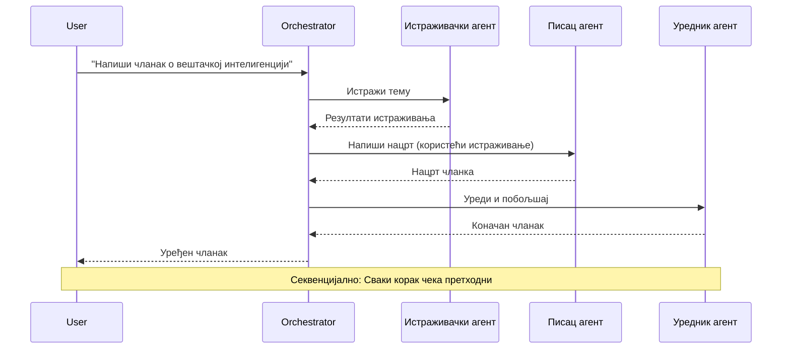
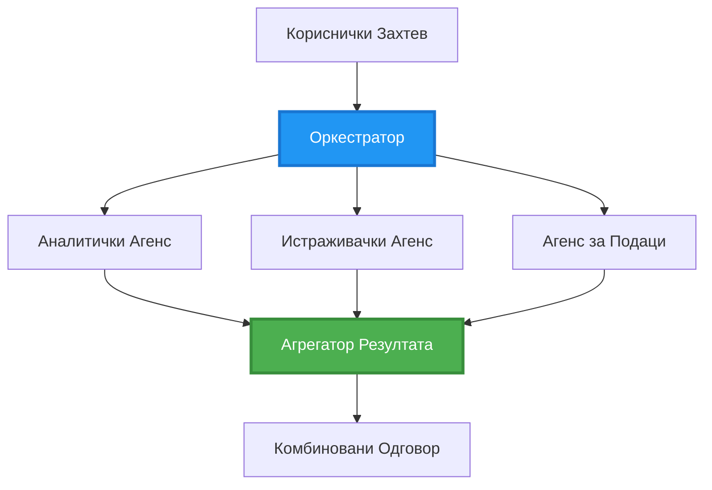
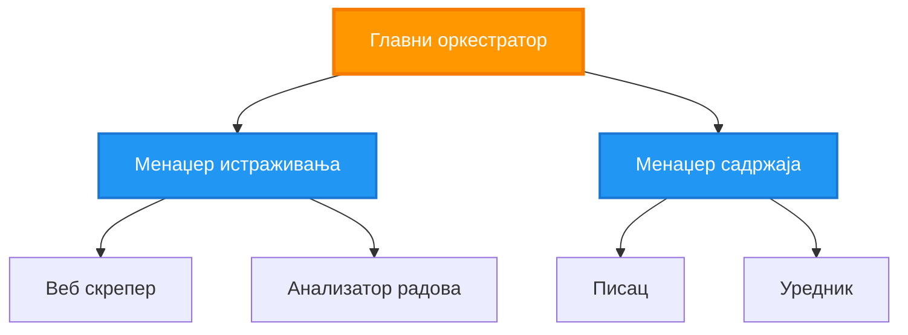
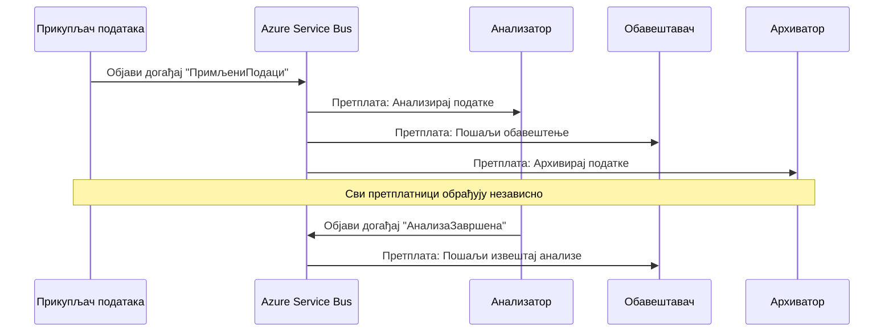
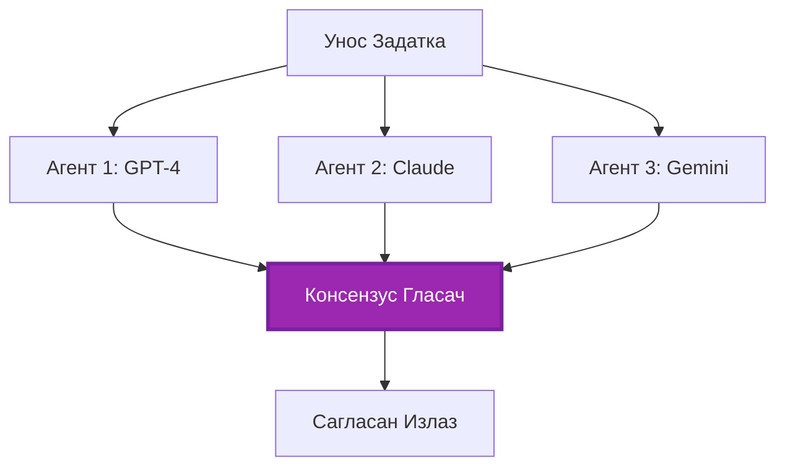
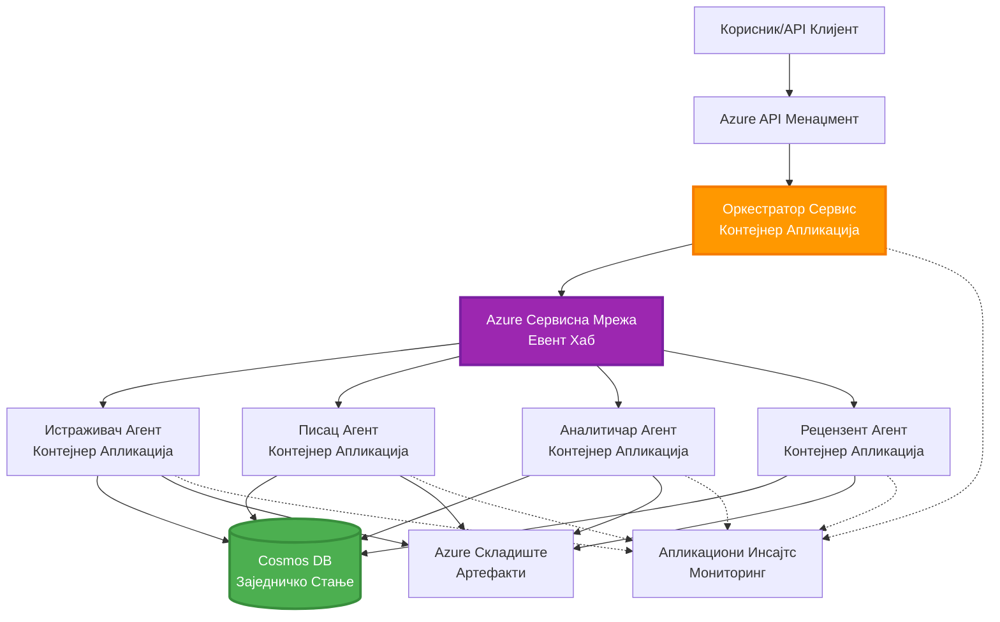

# Шаблони координације више агената

⏱️ **Процењено време**: 60-75 минута | 💰 **Процењени трошак**: ~$100-300/месечно | ⭐ **Комплексност**: Напредно

**📚 Пут учења:**
- ← Претходно: [Планирање капацитета](capacity-planning.md) - Стратегије за одређивање ресурса и скалирање
- 🎯 **Овде сте**: Шаблони координације више агената (Оркестрација, комуникација, управљање стањем)
- → Следеће: [Избор SKU](sku-selection.md) - Одабир правих Azure услуга
- 🏠 [Почетна страна курса](../../README.md)

---

## Шта ћете научити

Завршетком ове лекције, научићете:
- Разумевање **архитектонских шаблона више агената** и када их користити
- Имплементацију **шаблона оркестрације** (централизована, децентрализована, хијерархијска)
- Дизајн стратегија **комуникације агената** (синхрона, асинхрона, заснована на догађајима)
- Управљање **заједничким стањем** међу дистрибуираним агентима
- Деплојовање **система више агената** на Azure уз AZD
- Примена **шаблона координације** за реалне AI сценарије
- Праћење и отклањање грешака у дистрибуираним системима агената

## Зашто је координација више агената важна

### Еволуција: Од једног агента до више агената

**Један агент (Једноставно):**
```
User → Agent → Response
```
- ✅ Лако за разумевање и имплементацију
- ✅ Брзо за једноставне задатке
- ❌ Ограничено способностима једног модела
- ❌ Не може паралелизовати сложене задатке
- ❌ Нема специјализације

**Систем више агената (Напредно):**
```
           ┌─────────────┐
           │ Orchestrator│
           └──────┬──────┘
        ┌─────────┼─────────┐
        │         │         │
    ┌───▼──┐  ┌──▼───┐  ┌──▼────┐
    │Agent1│  │Agent2│  │Agent3 │
    │(Plan)│  │(Code)│  │(Review)│
    └──────┘  └──────┘  └───────┘
```
- ✅ Специјализовани агенти за одређене задатке
- ✅ Паралелно извршавање за брзину
- ✅ Модуларно и лако за одржавање
- ✅ Боље за сложене радне токове
- ⚠️ Захтева логику координације

**Аналогија**: Један агент је као једна особа која ради све задатке. Систем више агената је као тим где сваки члан има специјализоване вештине (истраживач, програмер, рецензент, писац) и ради заједно.

---

## Основни шаблони координације

### Шаблон 1: Секвенцијална координација (Ланац одговорности)

**Када користити**: Задаци морају бити завршени у одређеном редоследу, сваки агент гради на претходном излазу.


**Предности:**
- ✅ Јасан ток података
- ✅ Лако за отклањање грешака
- ✅ Предвидљив редослед извршавања

**Ограничења:**
- ❌ Спорије (нема паралелизма)
- ❌ Један неуспех блокира цео ланац
- ❌ Не може обрадити међузависне задатке

**Примери употребе:**
- Радни ток за креирање садржаја (истраживање → писање → уређивање → објављивање)
- Генерација кода (планирање → имплементација → тестирање → деплојовање)
- Генерација извештаја (прикупљање података → анализа → визуализација → резиме)

---

### Шаблон 2: Паралелна координација (Fan-Out/Fan-In)

**Када користити**: Независни задаци могу се извршавати истовремено, резултати се комбинују на крају.


**Предности:**
- ✅ Брзо (паралелно извршавање)
- ✅ Отпорно на грешке (делимични резултати су прихватљиви)
- ✅ Хоризонтално скалабилно

**Ограничења:**
- ⚠️ Резултати могу стићи ван реда
- ⚠️ Потребна логика за агрегацију
- ⚠️ Комплексно управљање стањем

**Примери употребе:**
- Прикупљање података из више извора (API-ји + базе података + веб скрепинг)
- Конкурентна анализа (више модела генерише решења, најбоље се бира)
- Услуге превођења (превођење на више језика истовремено)

---

### Шаблон 3: Хијерархијска координација (Менаџер-Радник)

**Када користити**: Сложени радни токови са подзадатцима, потребна делегација.


**Предности:**
- ✅ Обрађује сложене радне токове
- ✅ Модуларно и лако за одржавање
- ✅ Јасне границе одговорности

**Ограничења:**
- ⚠️ Комплекснија архитектура
- ⚠️ Већа латенција (више слојева координације)
- ⚠️ Захтева софистицирану оркестрацију

**Примери употребе:**
- Обрада докумената у предузећу (класификација → рутирање → обрада → архивирање)
- Вишестепени токови података (прикупљање → чишћење → трансформација → анализа → извештај)
- Сложени радни токови аутоматизације (планирање → алокација ресурса → извршење → праћење)

---

### Шаблон 4: Координација заснована на догађајима (Publish-Subscribe)

**Када користити**: Агенти треба да реагују на догађаје, пожељно је слабо повезивање.


**Предности:**
- ✅ Слабо повезивање између агената
- ✅ Лако додавање нових агената (само се претплате)
- ✅ Асинхрона обрада
- ✅ Отпорно (перзистенција порука)

**Ограничења:**
- ⚠️ Конзистентност на крају
- ⚠️ Комплексно отклањање грешака
- ⚠️ Изазови у редоследу порука

**Примери употребе:**
- Системи за праћење у реалном времену (упозорења, контролне табле, логови)
- Обавештења на више канала (е-пошта, SMS, push, Slack)
- Токови обраде података (више потрошача истих података)

---

### Шаблон 5: Координација заснована на консензусу (Гласање/Кворум)

**Када користити**: Потребан је договор више агената пре наставка.


**Предности:**
- ✅ Већа тачност (више мишљења)
- ✅ Отпорно на грешке (прихватљиви мањински неуспеси)
- ✅ Уграђено осигурање квалитета

**Ограничења:**
- ❌ Скупо (више позива модела)
- ❌ Спорије (чекање свих агената)
- ⚠️ Потребно решавање конфликата

**Примери употребе:**
- Модерација садржаја (више модела прегледа садржај)
- Преглед кода (више линтера/анализатора)
- Медицинска дијагностика (више AI модела, валидација стручњака)

---

## Преглед архитектуре

### Комплетан систем више агената на Azure


**Кључне компоненте:**

| Компонента | Сврха | Azure услуга |
|------------|-------|--------------|
| **API Gateway** | Улазна тачка, ограничење брзине, аутентификација | API Management |
| **Оркестратор** | Координира радне токове агената | Container Apps |
| **Ред порука** | Асинхрона комуникација | Service Bus / Event Hubs |
| **Агенти** | Специјализовани AI радници | Container Apps / Functions |
| **Складиште стања** | Заједничко стање, праћење задатака | Cosmos DB |
| **Складиште артефаката** | Документи, резултати, логови | Blob Storage |
| **Праћење** | Дистрибуирано праћење, логови | Application Insights |

---

## Предуслови

### Потребни алати

```bash
# Проверите Azure Developer CLI
azd version
# ✅ Очекује се: azd верзија 1.0.0 или новија

# Проверите Azure CLI
az --version
# ✅ Очекује се: azure-cli 2.50.0 или новија

# Проверите Docker (за локално тестирање)
docker --version
# ✅ Очекује се: Docker верзија 20.10 или новија
```

### Azure захтеви

- Активна Azure претплата
- Дозволе за креирање:
  - Container Apps
  - Service Bus namespaces
  - Cosmos DB налога
  - Складишних налога
  - Application Insights

### Предзнања

Требало би да сте завршили:
- [Управљање конфигурацијом](../getting-started/configuration.md)
- [Аутентификација и безбедност](../getting-started/authsecurity.md)
- [Пример микросервиса](../../../../examples/microservices)

---

## Водич за имплементацију

### Структура пројекта

```
multi-agent-system/
├── azure.yaml                    # AZD configuration
├── infra/
│   ├── main.bicep               # Main infrastructure
│   ├── core/
│   │   ├── servicebus.bicep     # Message queue
│   │   ├── cosmos.bicep         # State store
│   │   ├── storage.bicep        # Artifact storage
│   │   └── monitoring.bicep     # Application Insights
│   └── app/
│       ├── orchestrator.bicep   # Orchestrator service
│       └── agent.bicep          # Agent template
└── src/
    ├── orchestrator/            # Orchestration logic
    │   ├── app.py
    │   ├── workflows.py
    │   └── Dockerfile
    ├── agents/
    │   ├── research/            # Research agent
    │   ├── writer/              # Writer agent
    │   ├── analyst/             # Analyst agent
    │   └── reviewer/            # Reviewer agent
    └── shared/
        ├── state_manager.py     # Shared state logic
        └── message_handler.py   # Message handling
```

---

## Лекција 1: Шаблон секвенцијалне координације

### Имплементација: Радни ток за креирање садржаја

Хајде да изградимо секвенцијални радни ток: Истраживање → Писање → Уређивање → Објављивање

### 1. AZD конфигурација

**Фајл: `azure.yaml`**

```yaml
name: content-pipeline
metadata:
  template: multi-agent-sequential@1.0.0

services:
  orchestrator:
    project: ./src/orchestrator
    language: python
    host: containerapp
  
  research-agent:
    project: ./src/agents/research
    language: python
    host: containerapp
  
  writer-agent:
    project: ./src/agents/writer
    language: python
    host: containerapp
  
  editor-agent:
    project: ./src/agents/editor
    language: python
    host: containerapp
```

### 2. Инфраструктура: Service Bus за координацију

**Фајл: `infra/core/servicebus.bicep`**

```bicep
param name string
param location string
param tags object = {}

resource serviceBusNamespace 'Microsoft.ServiceBus/namespaces@2022-10-01-preview' = {
  name: name
  location: location
  tags: tags
  sku: {
    name: 'Standard'
    tier: 'Standard'
  }
  properties: {
    minimumTlsVersion: '1.2'
  }
}

// Queue for orchestrator → research agent
resource researchQueue 'Microsoft.ServiceBus/namespaces/queues@2022-10-01-preview' = {
  parent: serviceBusNamespace
  name: 'research-tasks'
  properties: {
    maxDeliveryCount: 3
    lockDuration: 'PT5M'
    deadLetteringOnMessageExpiration: true
  }
}

// Queue for research agent → writer agent
resource writerQueue 'Microsoft.ServiceBus/namespaces/queues@2022-10-01-preview' = {
  parent: serviceBusNamespace
  name: 'writer-tasks'
  properties: {
    maxDeliveryCount: 3
    lockDuration: 'PT5M'
  }
}

// Queue for writer agent → editor agent
resource editorQueue 'Microsoft.ServiceBus/namespaces/queues@2022-10-01-preview' = {
  parent: serviceBusNamespace
  name: 'editor-tasks'
  properties: {
    maxDeliveryCount: 3
    lockDuration: 'PT5M'
  }
}

output namespace string = serviceBusNamespace.name
output connectionString string = listKeys('${serviceBusNamespace.id}/AuthorizationRules/RootManageSharedAccessKey', serviceBusNamespace.apiVersion).primaryConnectionString
```

### 3. Менаџер заједничког стања

**Фајл: `src/shared/state_manager.py`**

```python
from azure.cosmos import CosmosClient, PartitionKey
from datetime import datetime
import os

class StateManager:
    """Manages shared state across agents using Cosmos DB"""
    
    def __init__(self):
        endpoint = os.environ['COSMOS_ENDPOINT']
        key = os.environ['COSMOS_KEY']
        
        self.client = CosmosClient(endpoint, key)
        self.database = self.client.get_database_client('agent-state')
        self.container = self.database.get_container_client('tasks')
    
    def create_task(self, task_id: str, task_type: str, input_data: dict):
        """Create a new task"""
        task = {
            'id': task_id,
            'type': task_type,
            'status': 'pending',
            'input': input_data,
            'created_at': datetime.utcnow().isoformat(),
            'steps': []
        }
        self.container.create_item(task)
        return task
    
    def update_task_step(self, task_id: str, step_name: str, result: dict):
        """Update task with completed step"""
        task = self.container.read_item(task_id, partition_key=task_id)
        
        task['steps'].append({
            'name': step_name,
            'completed_at': datetime.utcnow().isoformat(),
            'result': result
        })
        
        self.container.replace_item(task_id, task)
        return task
    
    def complete_task(self, task_id: str, final_result: dict):
        """Mark task as complete"""
        task = self.container.read_item(task_id, partition_key=task_id)
        task['status'] = 'completed'
        task['result'] = final_result
        task['completed_at'] = datetime.utcnow().isoformat()
        self.container.replace_item(task_id, task)
        return task
    
    def get_task(self, task_id: str):
        """Retrieve task state"""
        return self.container.read_item(task_id, partition_key=task_id)
```

### 4. Сервис оркестратора

**Фајл: `src/orchestrator/app.py`**

```python
from flask import Flask, request, jsonify
from azure.servicebus import ServiceBusClient, ServiceBusMessage
import json
import uuid
import os
from shared.state_manager import StateManager

app = Flask(__name__)
state_manager = StateManager()

# Веза са сервисним аутобусом
servicebus_connection_str = os.environ['SERVICEBUS_CONNECTION_STRING']
servicebus_client = ServiceBusClient.from_connection_string(servicebus_connection_str)

@app.route('/health', methods=['GET'])
def health():
    return jsonify({'status': 'healthy', 'service': 'orchestrator'})

@app.route('/create-content', methods=['POST'])
def create_content():
    """
    Sequential workflow: Research → Write → Edit → Publish
    """
    data = request.json
    topic = data.get('topic')
    
    if not topic:
        return jsonify({'error': 'Topic required'}), 400
    
    # Креирај задатак у складишту стања
    task_id = str(uuid.uuid4())
    task = state_manager.create_task(
        task_id=task_id,
        task_type='content_creation',
        input_data={'topic': topic}
    )
    
    # Пошаљи поруку истраживачком агенту (први корак)
    sender = servicebus_client.get_queue_sender('research-tasks')
    message = ServiceBusMessage(
        body=json.dumps({
            'task_id': task_id,
            'topic': topic,
            'next_queue': 'writer-tasks'  # Где послати резултате
        }),
        content_type='application/json'
    )
    
    with sender:
        sender.send_messages(message)
    
    return jsonify({
        'task_id': task_id,
        'status': 'started',
        'workflow': 'sequential',
        'steps': ['research', 'write', 'edit', 'publish'],
        'message': 'Content creation pipeline initiated'
    }), 202

@app.route('/task/<task_id>', methods=['GET'])
def get_task_status(task_id):
    """Check task status"""
    try:
        task = state_manager.get_task(task_id)
        return jsonify(task)
    except Exception as e:
        return jsonify({'error': str(e)}), 404

if __name__ == '__main__':
    app.run(host='0.0.0.0', port=8080)
```

### 5. Агенти за истраживање

**Фајл: `src/agents/research/app.py`**

```python
from azure.servicebus import ServiceBusClient, ServiceBusMessage
from openai import AzureOpenAI
import json
import os
import time
from shared.state_manager import StateManager

# Иницијализуј клијенте
state_manager = StateManager()
servicebus_client = ServiceBusClient.from_connection_string(
    os.environ['SERVICEBUS_CONNECTION_STRING']
)

openai_client = AzureOpenAI(
    api_key=os.environ['AZURE_OPENAI_API_KEY'],
    api_version="2024-02-01",
    azure_endpoint=os.environ['AZURE_OPENAI_ENDPOINT']
)

def process_research_task(message_data):
    """Process research request and pass to writer"""
    task_id = message_data['task_id']
    topic = message_data['topic']
    next_queue = message_data['next_queue']
    
    print(f"🔬 Researching: {topic}")
    
    # Позови Azure OpenAI за истраживање
    response = openai_client.chat.completions.create(
        model="gpt-4",
        messages=[
            {"role": "system", "content": "You are a research assistant. Provide comprehensive research on the given topic."},
            {"role": "user", "content": f"Research this topic thoroughly: {topic}"}
        ],
        max_tokens=1500
    )
    
    research_results = response.choices[0].message.content
    
    # Ажурирај стање
    state_manager.update_task_step(
        task_id=task_id,
        step_name='research',
        result={'research': research_results}
    )
    
    # Пошаљи следећем агенту (писцу)
    sender = servicebus_client.get_queue_sender(next_queue)
    message = ServiceBusMessage(
        body=json.dumps({
            'task_id': task_id,
            'topic': topic,
            'research': research_results,
            'next_queue': 'editor-tasks'
        }),
        content_type='application/json'
    )
    
    with sender:
        sender.send_messages(message)
    
    print(f"✅ Research complete for task {task_id}")

def main():
    """Listen to research queue"""
    receiver = servicebus_client.get_queue_receiver('research-tasks')
    
    print("🔬 Research Agent started, listening for tasks...")
    
    with receiver:
        while True:
            messages = receiver.receive_messages(max_wait_time=5)
            for message in messages:
                try:
                    message_data = json.loads(str(message))
                    process_research_task(message_data)
                    receiver.complete_message(message)
                except Exception as e:
                    print(f"❌ Error processing message: {e}")
                    receiver.abandon_message(message)

if __name__ == '__main__':
    main()
```

### 6. Агенти за писање

**Фајл: `src/agents/writer/app.py`**

```python
from azure.servicebus import ServiceBusClient, ServiceBusMessage
from openai import AzureOpenAI
import json
import os
from shared.state_manager import StateManager

state_manager = StateManager()
servicebus_client = ServiceBusClient.from_connection_string(
    os.environ['SERVICEBUS_CONNECTION_STRING']
)

openai_client = AzureOpenAI(
    api_key=os.environ['AZURE_OPENAI_API_KEY'],
    api_version="2024-02-01",
    azure_endpoint=os.environ['AZURE_OPENAI_ENDPOINT']
)

def process_writing_task(message_data):
    """Write article based on research"""
    task_id = message_data['task_id']
    topic = message_data['topic']
    research = message_data['research']
    next_queue = message_data['next_queue']
    
    print(f"✍️ Writing article: {topic}")
    
    # Позовите Azure OpenAI да напише чланак
    response = openai_client.chat.completions.create(
        model="gpt-4",
        messages=[
            {"role": "system", "content": "You are a professional writer. Write engaging, well-structured articles."},
            {"role": "user", "content": f"Based on this research:\n\n{research}\n\nWrite a comprehensive article about: {topic}"}
        ],
        max_tokens=2000
    )
    
    article_draft = response.choices[0].message.content
    
    # Ажурирајте стање
    state_manager.update_task_step(
        task_id=task_id,
        step_name='writing',
        result={'draft': article_draft}
    )
    
    # Пошаљите уреднику
    sender = servicebus_client.get_queue_sender(next_queue)
    message = ServiceBusMessage(
        body=json.dumps({
            'task_id': task_id,
            'topic': topic,
            'draft': article_draft
        }),
        content_type='application/json'
    )
    
    with sender:
        sender.send_messages(message)
    
    print(f"✅ Article draft complete for task {task_id}")

def main():
    """Listen to writer queue"""
    receiver = servicebus_client.get_queue_receiver('writer-tasks')
    
    print("✍️ Writer Agent started, listening for tasks...")
    
    with receiver:
        while True:
            messages = receiver.receive_messages(max_wait_time=5)
            for message in messages:
                try:
                    message_data = json.loads(str(message))
                    process_writing_task(message_data)
                    receiver.complete_message(message)
                except Exception as e:
                    print(f"❌ Error: {e}")
                    receiver.abandon_message(message)

if __name__ == '__main__':
    main()
```

### 7. Агенти за уређивање

**Фајл: `src/agents/editor/app.py`**

```python
from azure.servicebus import ServiceBusClient
from openai import AzureOpenAI
import json
import os
from shared.state_manager import StateManager

state_manager = StateManager()
servicebus_client = ServiceBusClient.from_connection_string(
    os.environ['SERVICEBUS_CONNECTION_STRING']
)

openai_client = AzureOpenAI(
    api_key=os.environ['AZURE_OPENAI_API_KEY'],
    api_version="2024-02-01",
    azure_endpoint=os.environ['AZURE_OPENAI_ENDPOINT']
)

def process_editing_task(message_data):
    """Edit and finalize article"""
    task_id = message_data['task_id']
    topic = message_data['topic']
    draft = message_data['draft']
    
    print(f"📝 Editing article: {topic}")
    
    # Позови Azure OpenAI за уређивање
    response = openai_client.chat.completions.create(
        model="gpt-4",
        messages=[
            {"role": "system", "content": "You are an expert editor. Improve grammar, clarity, and structure."},
            {"role": "user", "content": f"Edit and improve this article:\n\n{draft}"}
        ],
        max_tokens=2000
    )
    
    final_article = response.choices[0].message.content
    
    # Означи задатак као завршен
    state_manager.complete_task(
        task_id=task_id,
        final_result={
            'topic': topic,
            'final_article': final_article,
            'word_count': len(final_article.split())
        }
    )
    
    print(f"✅ Article finalized for task {task_id}")

def main():
    """Listen to editor queue"""
    receiver = servicebus_client.get_queue_receiver('editor-tasks')
    
    print("📝 Editor Agent started, listening for tasks...")
    
    with receiver:
        while True:
            messages = receiver.receive_messages(max_wait_time=5)
            for message in messages:
                try:
                    message_data = json.loads(str(message))
                    process_editing_task(message_data)
                    receiver.complete_message(message)
                except Exception as e:
                    print(f"❌ Error: {e}")
                    receiver.abandon_message(message)

if __name__ == '__main__':
    main()
```

### 8. Деплојовање и тестирање

```bash
# Иницијализуј и распореди
azd init
azd up

# Преузми URL оркестратора
ORCHESTRATOR_URL=$(azd env get-values | grep ORCHESTRATOR_URL | cut -d '=' -f2 | tr -d '"')

# Креирај садржај
curl -X POST $ORCHESTRATOR_URL/create-content \
  -H "Content-Type: application/json" \
  -d '{"topic": "The Future of AI in Healthcare"}'
```

**✅ Очекивани излаз:**
```json
{
  "task_id": "a1b2c3d4-e5f6-7890-abcd-ef1234567890",
  "status": "started",
  "workflow": "sequential",
  "steps": ["research", "write", "edit", "publish"],
  "message": "Content creation pipeline initiated"
}
```

**Провера напретка задатка:**
```bash
TASK_ID="a1b2c3d4-e5f6-7890-abcd-ef1234567890"
curl $ORCHESTRATOR_URL/task/$TASK_ID
```

**✅ Очекивани излаз (завршено):**
```json
{
  "id": "a1b2c3d4-e5f6-7890-abcd-ef1234567890",
  "type": "content_creation",
  "status": "completed",
  "steps": [
    {
      "name": "research",
      "completed_at": "2025-11-19T10:30:00Z",
      "result": {"research": "..."}
    },
    {
      "name": "writing",
      "completed_at": "2025-11-19T10:32:00Z",
      "result": {"draft": "..."}
    }
  ],
  "result": {
    "topic": "The Future of AI in Healthcare",
    "final_article": "...",
    "word_count": 1500
  }
}
```

---

## Лекција 2: Шаблон паралелне координације

### Имплементација: Агрегатор за истраживање из више извора

Хајде да изградимо паралелни систем који истовремено прикупља информације из више извора.

### Паралелни оркестратор

**Фајл: `src/orchestrator/parallel_workflow.py`**

```python
from flask import Flask, request, jsonify
from azure.servicebus import ServiceBusClient, ServiceBusMessage
import json
import uuid
import os
from shared.state_manager import StateManager

app = Flask(__name__)
state_manager = StateManager()

servicebus_client = ServiceBusClient.from_connection_string(
    os.environ['SERVICEBUS_CONNECTION_STRING']
)

@app.route('/research-parallel', methods=['POST'])
def research_parallel():
    """
    Parallel workflow: Multiple agents work simultaneously
    """
    data = request.json
    query = data.get('query')
    
    task_id = str(uuid.uuid4())
    task = state_manager.create_task(
        task_id=task_id,
        task_type='parallel_research',
        input_data={
            'query': query,
            'agents': ['web', 'academic', 'news', 'social']
        }
    )
    
    # Фан-аут: Пошаљи свим агентима истовремено
    agents = [
        ('web-research-queue', 'web'),
        ('academic-research-queue', 'academic'),
        ('news-research-queue', 'news'),
        ('social-research-queue', 'social')
    ]
    
    for queue_name, agent_type in agents:
        sender = servicebus_client.get_queue_sender(queue_name)
        message = ServiceBusMessage(
            body=json.dumps({
                'task_id': task_id,
                'query': query,
                'agent_type': agent_type,
                'result_queue': 'aggregation-queue'
            }),
            content_type='application/json'
        )
        
        with sender:
            sender.send_messages(message)
    
    return jsonify({
        'task_id': task_id,
        'status': 'started',
        'workflow': 'parallel',
        'agents_dispatched': 4,
        'message': 'Parallel research initiated'
    }), 202

if __name__ == '__main__':
    app.run(host='0.0.0.0', port=8080)
```

### Логика агрегације

**Фајл: `src/agents/aggregator/app.py`**

```python
from azure.servicebus import ServiceBusClient
import json
import os
from collections import defaultdict
from shared.state_manager import StateManager

state_manager = StateManager()
servicebus_client = ServiceBusClient.from_connection_string(
    os.environ['SERVICEBUS_CONNECTION_STRING']
)

# Пратите резултате по задатку
task_results = defaultdict(list)
expected_agents = 4  # веб, академски, вести, друштвено

def process_result(message_data):
    """Aggregate results from parallel agents"""
    task_id = message_data['task_id']
    agent_type = message_data['agent_type']
    result = message_data['result']
    
    # Сачувајте резултат
    task_results[task_id].append({
        'agent': agent_type,
        'data': result
    })
    
    print(f"📊 Received result from {agent_type} agent ({len(task_results[task_id])}/{expected_agents})")
    
    # Проверите да ли су сви агенти завршили (фан-ин)
    if len(task_results[task_id]) == expected_agents:
        print(f"✅ All agents completed for task {task_id}. Aggregating...")
        
        # Комбинујте резултате
        aggregated = {
            'query': message_data['query'],
            'sources': task_results[task_id],
            'summary': generate_summary(task_results[task_id])
        }
        
        # Означите као завршено
        state_manager.complete_task(task_id, aggregated)
        
        # Очистите
        del task_results[task_id]
        
        print(f"✅ Aggregation complete for task {task_id}")

def generate_summary(results):
    """Generate summary from all sources"""
    summaries = [r['data'].get('summary', '') for r in results]
    return '\n\n'.join(summaries)

def main():
    """Listen to aggregation queue"""
    receiver = servicebus_client.get_queue_receiver('aggregation-queue')
    
    print("📊 Aggregator started, listening for results...")
    
    with receiver:
        while True:
            messages = receiver.receive_messages(max_wait_time=5)
            for message in messages:
                try:
                    message_data = json.loads(str(message))
                    process_result(message_data)
                    receiver.complete_message(message)
                except Exception as e:
                    print(f"❌ Error: {e}")
                    receiver.abandon_message(message)

if __name__ == '__main__':
    main()
```

**Предности паралелног шаблона:**
- ⚡ **4x брже** (агенти раде истовремено)
- 🔄 **Отпорно на грешке** (делимични резултати су прихватљиви)
- 📈 **Скалабилно** (лако додавање више агената)

---

## Практичне вежбе

### Вежба 1: Додавање логике за временско ограничење ⭐⭐ (Средње)

**Циљ**: Имплементирајте логику временског ограничења тако да агрегатор не чека предуго на споре агенте.

**Кораци**:

1. **Додајте праћење временског ограничења у агрегатор:**

```python
from datetime import datetime, timedelta

task_timeouts = {}  # task_id -> време истека

def process_result(message_data):
    task_id = message_data['task_id']
    
    # Постави временско ограничење на први резултат
    if task_id not in task_timeouts:
        task_timeouts[task_id] = datetime.utcnow() + timedelta(seconds=30)
    
    task_results[task_id].append({
        'agent': message_data['agent_type'],
        'data': message_data['result']
    })
    
    # Провери да ли је завршено ИЛИ истекло време
    if len(task_results[task_id]) == expected_agents or \
       datetime.utcnow() > task_timeouts[task_id]:
        
        print(f"📊 Aggregating with {len(task_results[task_id])}/{expected_agents} results")
        
        aggregated = {
            'query': message_data['query'],
            'sources': task_results[task_id],
            'completed_agents': len(task_results[task_id]),
            'timed_out': len(task_results[task_id]) < expected_agents
        }
        
        state_manager.complete_task(task_id, aggregated)
        
        # Чишћење
        del task_results[task_id]
        del task_timeouts[task_id]
```

2. **Тестирајте са вештачким кашњењима:**

```python
# У једном агенту, додајте кашњење да симулирате спору обраду
import time
time.sleep(35)  # Прелази временско ограничење од 30 секунди
```

3. **Деплојовање и верификација:**

```bash
azd deploy aggregator

# Поднеси задатак
curl -X POST $ORCHESTRATOR_URL/research-parallel \
  -H "Content-Type: application/json" \
  -d '{"query": "AI safety research"}'

# Провери резултате након 30 секунди
curl $ORCHESTRATOR_URL/task/$TASK_ID
```

**✅ Критеријуми успеха:**
- ✅ Задатак се завршава након 30 секунди чак и ако агенти не заврше
- ✅ Одговор указује на делимичне резултате (`"timed_out": true`)
- ✅ Доступни резултати се враћају (3 од 4 агента)

**Време**: 20-25 минута

---

### Вежба 2: Имплементација логике за поновни покушај ⭐⭐⭐ (Напредно)

**Циљ**: Аутоматски поновите задатке агента који су неуспели пре него што одустанете.

**Кораци**:

1. **Додајте праћење поновних покушаја у оркестратор:**

```python
from dataclasses import dataclass
from typing import Dict

@dataclass
class RetryConfig:
    max_retries: int = 3
    backoff_seconds: int = 5

retry_counts: Dict[str, int] = {}  # message_id -> број_покушаја

def send_with_retry(queue_name: str, message_data: dict, retry_config: RetryConfig):
    """Send message with retry metadata"""
    message_id = message_data.get('message_id', str(uuid.uuid4()))
    message_data['message_id'] = message_id
    message_data['retry_count'] = retry_counts.get(message_id, 0)
    message_data['max_retries'] = retry_config.max_retries
    
    sender = servicebus_client.get_queue_sender(queue_name)
    message = ServiceBusMessage(
        body=json.dumps(message_data),
        content_type='application/json',
        message_id=message_id
    )
    
    with sender:
        sender.send_messages(message)
```

2. **Додајте хендлер за поновне покушаје у агенте:**

```python
def process_with_retry(message, receiver, process_func):
    """Process message with automatic retry on failure"""
    try:
        message_data = json.loads(str(message))
        
        # Обради поруку
        process_func(message_data)
        
        # Успех - завршено
        receiver.complete_message(message)
        
    except Exception as e:
        message_id = message.message_id
        retry_count = message_data.get('retry_count', 0)
        max_retries = message_data.get('max_retries', 3)
        
        if retry_count < max_retries:
            # Понови: напусти и поново стави у ред са повећаним бројем
            print(f"⚠️ Retry {retry_count + 1}/{max_retries} for message {message_id}")
            
            message_data['retry_count'] = retry_count + 1
            
            # Пошаљи назад у исти ред са кашњењем
            time.sleep(5 * (retry_count + 1))  # Експоненцијално одлагање
            send_with_retry(queue_name, message_data, RetryConfig())
            
            receiver.complete_message(message)  # Уклони оригинал
        else:
            # Максималан број покушаја премашен - премести у ред за неисправне поруке
            print(f"❌ Max retries exceeded for message {message_id}")
            receiver.dead_letter_message(
                message,
                reason="MaxRetriesExceeded",
                error_description=str(e)
            )
```

3. **Пратите ред за неуспеле поруке:**

```python
def monitor_dead_letters():
    """Check dead letter queue for failed messages"""
    receiver = servicebus_client.get_queue_receiver(
        'research-queue',
        sub_queue='deadletter'
    )
    
    with receiver:
        messages = receiver.receive_messages(max_wait_time=5)
        for message in messages:
            print(f"☠️ Dead letter: {message.message_id}")
            print(f"Reason: {message.dead_letter_reason}")
            print(f"Description: {message.dead_letter_error_description}")
```

**✅ Критеријуми успеха:**
- ✅ Неуспели задаци се аутоматски поново покушавају (до 3 пута)
- ✅ Експоненцијално повећање времена између покушаја (5с, 10с, 15с)
- ✅ Након максималног броја покушаја, поруке иду у ред за неуспеле поруке
- ✅ Ред за неуспеле поруке може се пратити и поново обрадити

**Време**: 30-40 минута

---

### Вежба 3: Имплементација прекидача круга ⭐⭐⭐ (Напредно)

**Циљ**: Спречите каскадне грешке заустављањем захтева ка агентима који не раде.

**Кораци**:

1. **Креирајте класу прекидача круга:**

```python
from enum import Enum
from datetime import datetime, timedelta

class CircuitState(Enum):
    CLOSED = "closed"      # Нормалан рад
    OPEN = "open"          # Неуспех, одбиј захтеве
    HALF_OPEN = "half_open"  # Тестирање да ли је опорављено

class CircuitBreaker:
    def __init__(self, failure_threshold=5, timeout_seconds=60):
        self.failure_threshold = failure_threshold
        self.timeout_seconds = timeout_seconds
        self.failure_count = 0
        self.last_failure_time = None
        self.state = CircuitState.CLOSED
    
    def call(self, func):
        """Execute function with circuit breaker protection"""
        if self.state == CircuitState.OPEN:
            # Провери да ли је истекло време
            if datetime.utcnow() - self.last_failure_time > timedelta(seconds=self.timeout_seconds):
                self.state = CircuitState.HALF_OPEN
                print("🔄 Circuit breaker: HALF_OPEN (testing)")
            else:
                raise Exception(f"Circuit breaker OPEN for agent. Try again in {self.timeout_seconds}s")
        
        try:
            result = func()
            
            # Успех
            if self.state == CircuitState.HALF_OPEN:
                self.state = CircuitState.CLOSED
                self.failure_count = 0
                print("✅ Circuit breaker: CLOSED (recovered)")
            
            return result
            
        except Exception as e:
            self.failure_count += 1
            self.last_failure_time = datetime.utcnow()
            
            if self.failure_count >= self.failure_threshold:
                self.state = CircuitState.OPEN
                print(f"🔴 Circuit breaker: OPEN (too many failures)")
            
            raise e
```

2. **Примените на позиве агента:**

```python
# У оркестратору
agent_circuits = {
    'web': CircuitBreaker(failure_threshold=5, timeout_seconds=60),
    'academic': CircuitBreaker(failure_threshold=5, timeout_seconds=60),
    'news': CircuitBreaker(failure_threshold=5, timeout_seconds=60),
    'social': CircuitBreaker(failure_threshold=5, timeout_seconds=60)
}

def send_to_agent(agent_type, message_data):
    """Send with circuit breaker protection"""
    circuit = agent_circuits[agent_type]
    
    try:
        circuit.call(lambda: send_message(agent_type, message_data))
    except Exception as e:
        print(f"⚠️ Skipping {agent_type} agent: {e}")
        # Наставите са другим агентима
```

3. **Тестирајте прекидач круга:**

```bash
# Симулирај поновљене отказе (заустави једног агента)
az containerapp stop --name web-research-agent --resource-group rg-agents

# Пошаљи више захтева
for i in {1..10}; do
  curl -X POST $ORCHESTRATOR_URL/research-parallel \
    -H "Content-Type: application/json" \
    -d '{"query": "test query '$i'"}'
  sleep 2
done

# Провери логове - требало би да видиш да је круг отворен након 5 отказа
azd logs orchestrator --tail 50
```

**✅ Критеријуми успеха:**
- ✅ Након 5 неуспеха, прекидач се отвара (одбија захтеве)
- ✅ Након 60 секунди, прекидач се делимично отвара (тестира опоравак)
- ✅ Остали агенти настављају нормално да раде
- ✅ Прекидач се аутоматски затвара када се агент опорави

**Време**: 40-50 минута

---

## Праћење и отклањање грешака

### Дистрибуирано праћење уз Application Insights

**Фајл: `src/shared/tracing.py`**

```python
from opencensus.ext.azure.log_exporter import AzureLogHandler
from opencensus.ext.azure.trace_exporter import AzureExporter
from opencensus.trace import config_integration
from opencensus.trace.tracer import Tracer
from opencensus.trace.samplers import AlwaysOnSampler
import logging
import os

# Конфигуришите праћење
config_integration.trace_integrations(['requests', 'logging'])

connection_string = os.environ.get('APPLICATIONINSIGHTS_CONNECTION_STRING')

# Креирајте трацер
tracer = Tracer(
    exporter=AzureExporter(connection_string=connection_string),
    sampler=AlwaysOnSampler()
)

# Конфигуришите логовање
logger = logging.getLogger(__name__)
logger.addHandler(AzureLogHandler(connection_string=connection_string))
logger.setLevel(logging.INFO)

def trace_agent_call(agent_name, task_id, operation):
    """Trace agent operations"""
    with tracer.span(name=f'{agent_name}.{operation}') as span:
        span.add_attribute('agent', agent_name)
        span.add_attribute('task_id', task_id)
        span.add_attribute('operation', operation)
        
        try:
            result = operation()
            span.add_attribute('status', 'success')
            return result
        except Exception as e:
            span.add_attribute('status', 'error')
            span.add_attribute('error', str(e))
            raise
```

### Упити за Application Insights

**Праћење радних токова више агената:**

```kusto
// Trace complete workflow for a task
traces
| where customDimensions.task_id == "a1b2c3d4-..."
| project timestamp, message, customDimensions.agent, customDimensions.operation
| order by timestamp asc
```

**Поређење перформанси агената:**

```kusto
// Compare agent execution times
dependencies
| where name contains "agent"
| summarize 
    avg_duration = avg(duration),
    p95_duration = percentile(duration, 95),
    count = count()
  by agent = tostring(customDimensions.agent)
| order by avg_duration desc
```

**Анализа неуспеха:**

```kusto
// Find which agents fail most
exceptions
| where customDimensions.agent != ""
| summarize 
    failure_count = count(),
    unique_errors = dcount(outerMessage)
  by agent = tostring(customDimensions.agent)
| order by failure_count desc
```

---

## Анализа трошкова

### Трошкови система више агената (Месечне процене)

| Компонента | Конфигурација | Трошак |
|------------|---------------|--------|
| **Оркестратор** | 1 Container App (1 vCPU, 2GB) | $30-50 |
| **4 агента** | 4 Container Apps (0.5 vCPU, 1GB сваки) | $60-120 |
| **Service Bus** | Standard tier, 10M порука | $10-20 |
| **Cosmos DB** | Serverless, 5GB складишта, 1M RUs | $25-50 |
| **Blob Storage** | 10GB складишта, 100K операција | $5-10 |
| **Application Insights** | 5GB у
## Водич за решавање проблема

### Проблем: Поруке заглављене у реду

**Симптоми:**
- Поруке се акумулирају у реду
- Агенти не обрађују
- Статус задатка заглављен на "pending"

**Дијагноза:**
```bash
# Проверите дубину реда
az servicebus queue show \
  --namespace-name mybus \
  --name research-tasks \
  --query "countDetails"

# Проверите здравље агента
azd logs research-agent --tail 50
```

**Решења:**

1. **Повећајте број реплика агената:**
   ```bash
   az containerapp update \
     --name research-agent \
     --min-replicas 3 \
     --max-replicas 10
   ```

2. **Проверите ред за мртва слова:**
   ```bash
   az servicebus queue show \
     --namespace-name mybus \
     --name research-tasks \
     --query "countDetails.deadLetterMessageCount"
   ```

---

### Проблем: Време извршења задатка истекло/никада се не завршава

**Симптоми:**
- Статус задатка остаје "in_progress"
- Неки агенти завршавају, други не
- Нема порука о грешци

**Дијагноза:**
```bash
# Проверите стање задатка
curl $ORCHESTRATOR_URL/task/$TASK_ID

# Проверите Application Insights
# Покрените упит: traces | where customDimensions.task_id == "..."
```

**Решења:**

1. **Примените временско ограничење у агрегатору (Вежба 1)**

2. **Проверите неуспехе агената:**
   ```bash
   azd logs --follow | grep "ERROR\|FAIL"
   ```

3. **Потврдите да сви агенти раде:**
   ```bash
   az containerapp list \
     --resource-group rg-agents \
     --query "[].{name:name, status:properties.runningStatus}"
   ```

---

## Сазнајте више

### Званична документација
- [Azure Service Bus](https://learn.microsoft.com/azure/service-bus-messaging/service-bus-messaging-overview)
- [Cosmos DB](https://learn.microsoft.com/azure/cosmos-db/introduction)
- [Container Apps DAPR](https://learn.microsoft.com/azure/container-apps/dapr-overview)
- [Multi-Agent Design Patterns](https://learn.microsoft.com/azure/architecture/guide/ai/multi-agent-systems)

### Следећи кораци у овом курсу
- ← Претходно: [Планирање капацитета](capacity-planning.md)
- → Следеће: [Избор SKU](sku-selection.md)
- 🏠 [Почетна страна курса](../../README.md)

### Повезани примери
- [Пример микросервиса](../../../../examples/microservices) - Шаблони комуникације сервиса
- [Пример Azure OpenAI](../../../../examples/azure-openai-chat) - Интеграција вештачке интелигенције

---

## Резиме

**Научили сте:**
- ✅ Пет шаблона координације (секвенцијални, паралелни, хијерархијски, заснован на догађајима, консензус)
- ✅ Архитектуру са више агената на Azure-у (Service Bus, Cosmos DB, Container Apps)
- ✅ Управљање стањем међу дистрибуираним агентима
- ✅ Руковање временским ограничењима, поновним покушајима и прекидачима
- ✅ Праћење и отклањање грешака у дистрибуираним системима
- ✅ Стратегије оптимизације трошкова

**Кључни закључци:**
1. **Изаберите прави шаблон** - Секвенцијални за уређене токове рада, паралелни за брзину, заснован на догађајима за флексибилност
2. **Пажљиво управљајте стањем** - Користите Cosmos DB или слично за заједничко стање
3. **Руковање грешкама** - Временска ограничења, поновни покушаји, прекидачи, редови за мртва слова
4. **Пратите све** - Дистрибуирано праћење је неопходно за отклањање грешака
5. **Оптимизујте трошкове** - Скалирање на нулу, коришћење серверлес решења, примена кеширања

**Следећи кораци:**
1. Завршите практичне вежбе
2. Направите систем са више агената за ваш случај употребе
3. Проучите [Избор SKU](sku-selection.md) за оптимизацију перформанси и трошкова

---

<!-- CO-OP TRANSLATOR DISCLAIMER START -->
**Одрицање од одговорности**:  
Овај документ је преведен помоћу услуге за превођење вештачке интелигенције [Co-op Translator](https://github.com/Azure/co-op-translator). Иако настојимо да обезбедимо тачност, молимо вас да имате у виду да аутоматски преводи могу садржати грешке или нетачности. Оригинални документ на његовом изворном језику треба сматрати ауторитативним извором. За критичне информације препоручује се професионални превод од стране људи. Не преузимамо одговорност за било каква погрешна тумачења или неспоразуме који могу настати услед коришћења овог превода.
<!-- CO-OP TRANSLATOR DISCLAIMER END -->