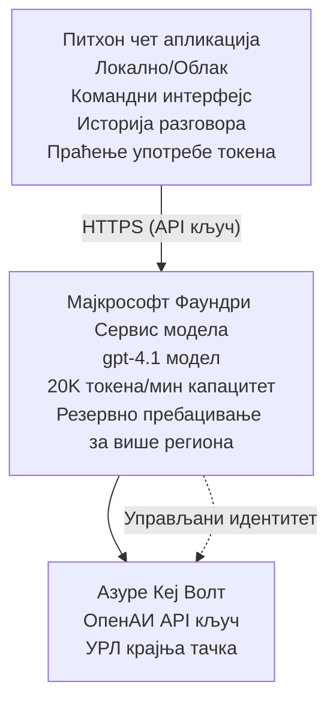

# Microsoft Foundry Models Chat Application

**Пут учења:** Средњи ⭐⭐ | **Време:** 35-45 минута | **Трошак:** $50-200/month

Комплетна Microsoft Foundry Models чат апликација деплојована коришћењем Azure Developer CLI (azd). Овај пример демонстрира деплој gpt-4.1, безбедан приступ API-ју и једноставан интерфејс за чет.

## 🎯 Шта ћете научити

- Деплој Microsoft Foundry Models сервиса са gpt-4.1 моделом
- Безбедно чување OpenAI API кључева у Key Vault-у
- Изградња једноставног интерфејса за чет у Python-у
- Праћење коришћења токена и трошкова
- Имплементација ограничења брзине и руковања грешкама

## 📦 Шта је укључено

✅ **Microsoft Foundry Models Service** - деплој модела gpt-4.1  
✅ **Python Chat App** - Једноставан командно-линијски интерфејс за чет  
✅ **Key Vault Integration** - Безбедно чување API кључева  
✅ **ARM Templates** - Комплетна инфраструктура као код  
✅ **Cost Monitoring** - Праћење коришћења токена  
✅ **Rate Limiting** - Превенција исцрпљивања квота  

## Architecture



## Претпослови

### Потребно

- **Azure Developer CLI (azd)** - [Водич за инсталацију](https://learn.microsoft.com/azure/developer/azure-developer-cli/install-azd)
- **Azure subscription** са приступом OpenAI-у - [Захтев за приступ](https://aka.ms/oai/access)
- **Python 3.9+** - [Инсталирајте Python](https://www.python.org/downloads/)

### Проверите предуслове

```bash
# Проверите верзију azd (потребна је 1.5.0 или новија)
azd version

# Проверите да ли сте пријављени у Azure
azd auth login

# Проверите верзију Питона
python --version  # или python3 --version

# Проверите приступ OpenAI (проверите у Azure порталу)
az cognitiveservices account list-skus \
  --kind OpenAI \
  --location eastus
```

> **⚠️ Важно:** Microsoft Foundry Models захтева одобрење апликације. Ако нисте поднели захтев, посетите [aka.ms/oai/access](https://aka.ms/oai/access). Одобрење обично траје 1-2 радна дана.

## ⏱️ Временска линија деплоја

| Фаза | Трајање | Шта се дешава |
|-------|----------|--------------|
| Провера предуслова | 2-3 минута | Потврдите доступност OpenAI квоте |
| Деплој инфраструктуре | 8-12 минута | Креирање OpenAI, Key Vault, деплој модела |
| Конфигурисање апликације | 2-3 минута | Постављање окружења и зависности |
| **Укупно** | **12-18 минута** | Спремно за чет са gpt-4.1 |

**Напомена:** Деплој OpenAI-а први пут може трајати дуже због провизије модела.

## Брзо покретање

```bash
# Идите до примера
cd examples/azure-openai-chat

# Иницијализујте окружење
azd env new myopenai

# Разместите све (инфраструктуру + конфигурацију)
azd up
# Од вас ће бити затражено да:
# 1. Изаберите Azure претплату
# 2. Изаберите локацију где је OpenAI доступан (нпр. eastus, eastus2, westus)
# 3. Сачекајте 12-18 минута за распоређивање

# Инсталирајте Python зависности
pip install -r requirements.txt

# Почните да ћаскате!
python chat.py
```

**Очекујани излаз:**
```
🤖 Microsoft Foundry Models Chat Application
Connected to: gpt-4.1 (eastus)
Type your message (or 'quit' to exit)

You: Hello! Tell me about Microsoft Foundry Models.
Assistant: Microsoft Foundry Models Service provides REST API access to OpenAI's powerful language models including gpt-4.1, GPT-3.5-Turbo, and Embeddings...

[Tokens used: 145 | Estimated cost: $0.0044]
```

## ✅ Потврдите деплој

### Корак 1: Проверите Azure ресурсе

```bash
# Прикажи распоређене ресурсе
azd show

# Очекује се да ће излаз приказати:
# - OpenAI услуга: (име ресурса)
# - Складиште кључева: (име ресурса)
# - Распоређивање: gpt-4.1
# - Локација: eastus (или ваш изабрани регион)
```

### Корак 2: Тестирајте OpenAI API

```bash
# Добиј OpenAI ендпоинт и кључ
OPENAI_ENDPOINT=$(azd env get-value AZURE_OPENAI_ENDPOINT)
OPENAI_KEY=$(azd env get-value AZURE_OPENAI_API_KEY)

# Тестирај API позив
curl "$OPENAI_ENDPOINT/openai/deployments/gpt-4.1/chat/completions?api-version=2024-08-01-preview" \
  -H "Content-Type: application/json" \
  -H "api-key: $OPENAI_KEY" \
  -d '{
    "messages": [{"role": "user", "content": "Say hello!"}],
    "max_tokens": 50
  }'
```

**Очекивани одговор:**
```json
{
  "choices": [
    {
      "message": {
        "role": "assistant",
        "content": "Hello! How can I assist you today?"
      }
    }
  ],
  "usage": {
    "prompt_tokens": 8,
    "completion_tokens": 9,
    "total_tokens": 17
  }
}
```

### Корак 3: Потврдите приступ Key Vault-у

```bash
# Наведи тајне у Key Vault-у
KV_NAME=$(azd env get-value AZURE_KEY_VAULT_NAME)

az keyvault secret list \
  --vault-name $KV_NAME \
  --query "[].name" \
  --output table
```

**Очекујани секрети:**
- `openai-api-key`
- `openai-endpoint`

**Критеријуми успеха:**
- ✅ OpenAI сервис деплојован са gpt-4.1
- ✅ API позив враћа важећи одговор
- ✅ Секрети сачувани у Key Vault-у
- ✅ Праћење коришћења токена функционише

## Структура пројекта

```
azure-openai-chat/
├── README.md                   ✅ This guide
├── azure.yaml                  ✅ AZD configuration
├── infra/                      ✅ Infrastructure as Code
│   ├── main.bicep             ✅ Main Bicep template
│   ├── main.parameters.json   ✅ Parameters
│   └── openai.bicep           ✅ OpenAI resource definition
├── src/                        ✅ Application code
│   ├── chat.py                ✅ Chat interface
│   ├── config.py              ✅ Configuration loader
│   └── requirements.txt       ✅ Python dependencies
└── .gitignore                  ✅ Git ignore rules
```

## Функције апликације

### Chat Interface (`chat.py`)

Чет апликација укључује:

- **Историја разговора** - Одржава контекст кроз поруке
- **Бројање токена** - Праћење коришћења и процена трошкова
- **Руковање грешкама** - Грациозно руковање лимитима и API грешкама
- **Процењивање трошкова** - Рачунање трошкова по поруци у реалном времену
- **Подршка за стриминг** - Опционо стримовање одговора

### Команде

Док четујете, можете користити:
- `quit` или `exit` - Завршите сесију
- `clear` - Очистите историју разговора
- `tokens` - Прикажи укупно коришћење токена
- `cost` - Прикажи процењени укупни трошак

### Конфигурација (`config.py`)

Учитава конфигурацију из променљивих окружења:
```python
AZURE_OPENAI_ENDPOINT  # Из Key Vault-а
AZURE_OPENAI_API_KEY   # Из Key Vault-а
AZURE_OPENAI_MODEL     # Подразумевано: gpt-4.1
AZURE_OPENAI_MAX_TOKENS # Подразумевано: 800
```

## Примери употребе

### Основни чет

```bash
python chat.py
```

### Чет са прилагођеним моделом

```bash
export AZURE_OPENAI_MODEL=gpt-35-turbo
python chat.py
```

### Чет са стримингом

```bash
python chat.py --stream
```

### Пример разговора

```
You: Explain Microsoft Foundry Models Service in 3 sentences.
Assistant: Microsoft Foundry Models Service is Microsoft Azure's cloud platform offering 
that provides access to OpenAI's powerful language models. It enables developers 
to integrate capabilities like gpt-4.1 into their applications with enterprise-grade 
security and compliance. The service includes features for content filtering, 
abuse monitoring, and responsible AI practices.

[Tokens used: 89 | Estimated cost: $0.0027]

You: What models are available?
Assistant: Microsoft Foundry Models Service offers several model families including gpt-4.1 
(most capable), GPT-3.5-Turbo (faster and cost-effective), and Embeddings models 
for vector search. Each model has different capabilities, pricing, and token limits.

[Tokens used: 67 | Estimated cost: $0.0020]

Total session: 156 tokens | $0.0047
```

## Управљање трошковима

### Цена по токену (gpt-4.1)

| Модел | Улаз (по 1К токена) | Излаз (по 1К токена) |
|-------|----------------------|------------------------|
| gpt-4.1 | $0.03 | $0.06 |
| GPT-3.5-Turbo | $0.0015 | $0.002 |

### Процењени месечни трошкови

На основу шаблона коришћења:

| Ниво коришћења | Поруке/дан | Токени/дан | Месечни трошак |
|-------------|--------------|------------|--------------|
| **Лако** | 20 порука | 3,000 токена | $3-5 |
| **Умерено** | 100 порука | 15,000 токена | $15-25 |
| **Интензивно** | 500 порука | 75,000 токена | $75-125 |

**Основни трошак инфраструктуре:** $1-2/month (Key Vault + минимални рачунарски ресурси)

### Савети за оптимизацију трошкова

```bash
# 1. Користите GPT-3.5-Turbo за једноставније задатке (20 пута јефтиније)
export AZURE_OPENAI_MODEL=gpt-35-turbo

# 2. Смањите максималан број токена за краће одговоре
export AZURE_OPENAI_MAX_TOKENS=400

# 3. Пратите употребу токена
python chat.py --show-tokens

# 4. Подесите упозорења о буџету
az consumption budget create \
  --budget-name "openai-budget" \
  --amount 50 \
  --time-grain Monthly
```

## Надгледање

### Погледајте коришћење токена

```bash
# У Azure порталу:
# OpenAI ресурс → Метрике → Изаберите "Трансакција токена"

# Или преко Azure CLI:
az monitor metrics list \
  --resource $(azd env get-value AZURE_OPENAI_RESOURCE_ID) \
  --metric "TokenTransaction" \
  --start-time $(date -u -d '1 hour ago' '+%Y-%m-%dT%H:%M:%S') \
  --interval PT1M
```

### Погледајте API логове

```bash
# Стримовање дијагностичких логова
az monitor diagnostic-settings create \
  --resource $(azd env get-value AZURE_OPENAI_RESOURCE_ID) \
  --name openai-logs \
  --logs '[{"category": "Audit", "enabled": true}]' \
  --workspace $(azd env get-value LOG_ANALYTICS_WORKSPACE_ID)

# Логови упита
az monitor log-analytics query \
  --workspace $(azd env get-value LOG_ANALYTICS_WORKSPACE_ID) \
  --analytics-query "AzureDiagnostics | where Category == 'Audit' | top 10 by TimeGenerated"
```

## Решавање проблема

### Проблем: „Приступ одбијен” грешка

**Симптоми:** 403 Forbidden при позиву API-ја

**Решења:**
```bash
# 1. Проверите да ли је приступ OpenAI-у одобрен
az cognitiveservices account show \
  --name $(azd env get-value AZURE_OPENAI_NAME) \
  --resource-group $(azd env get-value AZURE_RESOURCE_GROUP)

# 2. Проверите да ли је АПИ кључ исправан
azd env get-value AZURE_OPENAI_API_KEY

# 3. Проверите формат URL-а крајње тачке
azd env get-value AZURE_OPENAI_ENDPOINT
# Треба да буде: https://[name].openai.azure.com/
```

### Проблем: „Прекорачен лимит захтева”

**Симптоми:** 429 Too Many Requests

**Решења:**
```bash
# 1. Проверите тренутну квоту
az cognitiveservices account deployment show \
  --name $(azd env get-value AZURE_OPENAI_NAME) \
  --resource-group $(azd env get-value AZURE_RESOURCE_GROUP) \
  --deployment-name gpt-4.1

# 2. Затражите повећање квоте (ако је потребно)
# Идите на Azure портал → OpenAI ресурс → Квоте → Затражите повећање

# 3. Имплементирајте логику поновних покушаја (већ у chat.py)
# Апликација аутоматски поново покушава са експоненцијалним повећањем времена чекања између покушаја
```

### Проблем: „Модел није пронађен”

**Симптоми:** 404 грешка за деплој

**Решења:**
```bash
# 1. Прикажите доступна размештања
az cognitiveservices account deployment list \
  --name $(azd env get-value AZURE_OPENAI_NAME) \
  --resource-group $(azd env get-value AZURE_RESOURCE_GROUP)

# 2. Проверите име модела у окружењу
echo $AZURE_OPENAI_MODEL

# 3. Промените у исправно име размештања
export AZURE_OPENAI_MODEL=gpt-4.1  # или gpt-35-turbo
```

### Проблем: Висока латенција

**Симптоми:** Споро време одзива (>5 секунди)

**Решења:**
```bash
# 1. Проверите регионално кашњење
# Разместите у регион најближи корисницима

# 2. Смањите max_tokens за брже одговоре
export AZURE_OPENAI_MAX_TOKENS=400

# 3. Користите стримовање за боље корисничко искуство
python chat.py --stream
```

## Најбоље праксе безбедности

### 1. Заштитите API кључеве

```bash
# Никада не комитујте кључеве у систем за контролу верзија
# Користите Key Vault (већ конфигурисан)

# Редовно мењајте кључеве
az cognitiveservices account keys regenerate \
  --name $(azd env get-value AZURE_OPENAI_NAME) \
  --resource-group $(azd env get-value AZURE_RESOURCE_GROUP) \
  --key-name key1
```

### 2. Имплементирајте филтрирање садржаја

```python
# Microsoft Foundry Models укључује уграђено филтрирање садржаја
# Конфигуришите у Azure порталу:
# OpenAI ресурс → Филтри садржаја → Креирај прилагођени филтар

# Категорије: Мржња, Сексуални садржај, Насиље, Самоповређивање
# Нивоа: Ниско, Средње, Високо филтрирање
```

### 3. Користите Managed Identity (у продукцији)

```bash
# За продукцијска распоређивања користите управљани идентитет
# уместо API кључева (захтева хостовање апликације на Azure)

# Ажурирајте infra/openai.bicep да укључи:
# identity: { type: 'SystemAssigned' }
```

## Развој

### Покрените локално

```bash
# Инсталирајте зависности
pip install -r src/requirements.txt

# Подесите променљиве окружења
export AZURE_OPENAI_ENDPOINT="https://[name].openai.azure.com/"
export AZURE_OPENAI_API_KEY="your-api-key"
export AZURE_OPENAI_MODEL="gpt-4.1"

# Покрените апликацију
python src/chat.py
```

### Покрените тестове

```bash
# Инсталирајте зависности за тестирање
pip install pytest pytest-cov

# Покрените тестове
pytest tests/ -v

# Са покривеношћу
pytest tests/ --cov=src --cov-report=html
```

### Ажурирајте деплој модела

```bash
# Поставити другу верзију модела
az cognitiveservices account deployment create \
  --name $(azd env get-value AZURE_OPENAI_NAME) \
  --resource-group $(azd env get-value AZURE_RESOURCE_GROUP) \
  --deployment-name gpt-35-turbo \
  --model-name gpt-35-turbo \
  --model-version "0613" \
  --model-format OpenAI \
  --sku-capacity 20 \
  --sku-name "Standard"
```

## Чишћење

```bash
# Избриши све Azure ресурсе
azd down --force --purge

# Ово уклања:
# - OpenAI услуга
# - Key Vault (са 90-дневним меком брисањем)
# - Група ресурса
# - Сва размештања и конфигурације
```

## Следећи кораци

### Проширите овај пример

1. **Додајте веб интерфејс** - Направите React/Vue фронтенд
   ```bash
   # Додај фронтенд сервис у azure.yaml
   # Распореди на Azure Static Web Apps
   ```

2. **Имплементирајте RAG** - Додајте претрагу докумената помоћу Azure AI Search
   ```python
   # Интегришите Azure AI Search
   # Отпремите документе и креирајте векторски индекс
   ```

3. **Додајте позив функција** - Омогућите коришћење алата
   ```python
   # Дефинишите функције у chat.py
   # Дозволите gpt-4.1 да позива спољашње АПИ-је
   ```

4. **Подршка више модела** - Деплојујте више модела
   ```bash
   # Додајте gpt-35-turbo и моделе уграђивања
   # Имплементирајте логику рутирања модела
   ```

### Повезани примери

- **[Retail Multi-Agent](../retail-scenario.md)** - Напредна мулти-агент архитектура
- **[Database App](../../../../examples/database-app)** - Додајте перзистентно складиште
- **[Container Apps](../../../../examples/container-app)** - Деплој као сервис у контејнерима

### Ресурси за учење

- 📚 [AZD For Beginners Course](../../README.md) - Главна почетна страница курса
- 📚 [Microsoft Foundry Models Documentation](https://learn.microsoft.com/azure/ai-services/openai/) - Званична документација
- 📚 [OpenAI API Reference](https://platform.openai.com/docs/api-reference) - Детаљи API-ја
- 📚 [Responsible AI](https://www.microsoft.com/ai/responsible-ai) - Најбоље праксе

## Додатни ресурси

### Документација
- **[Microsoft Foundry Models Service](https://learn.microsoft.com/azure/ai-services/openai/)** - Комплетан водич
- **[gpt-4.1 Models](https://learn.microsoft.com/azure/ai-services/openai/concepts/models)** - Могућности модела
- **[Content Filtering](https://learn.microsoft.com/azure/ai-services/openai/concepts/content-filter)** - Безбедносне функције
- **[Azure Developer CLI](https://learn.microsoft.com/azure/developer/azure-developer-cli/)** - azd референца

### Туторијали
- **[OpenAI Quickstart](https://learn.microsoft.com/azure/ai-services/openai/quickstart)** - Први деплој
- **[Chat Completions](https://learn.microsoft.com/azure/ai-services/openai/how-to/chatgpt)** - Изградња чет апликација
- **[Function Calling](https://learn.microsoft.com/azure/ai-services/openai/how-to/function-calling)** - Напредне функције

### Алатке
- **[Microsoft Foundry Models Studio](https://oai.azure.com/)** - Веб-базирано окружење за тестирање
- **[Prompt Engineering Guide](https://platform.openai.com/docs/guides/prompt-engineering)** - Побољшавање упита
- **[Token Calculator](https://platform.openai.com/tokenizer)** - Процените коришћење токена

### Заједница
- **[Azure AI Discord](https://discord.gg/azure)** - Помоћ од заједнице
- **[GitHub Discussions](https://github.com/Azure-Samples/openai/discussions)** - Форум за питања и одговоре
- **[Azure Blog](https://azure.microsoft.com/blog/tag/azure-openai-service/)** - Најновија ажурирања

---

**🎉 Успешно!** Деплојовали сте Microsoft Foundry Models и изградили радну чет апликацију. Почните да истражујете могућности gpt-4.1 и експериментишете са различитим упитима и случајевима употребе.

**Питања?** [Open an issue](https://github.com/microsoft/AZD-for-beginners/issues) или погледајте [FAQ](../../resources/faq.md)

**Упозорење о трошковима:** Запамтите да покренете `azd down` када завршите тестирање да бисте избегли сталне наплате (~$50-100/month за активно коришћење).

---

<!-- CO-OP TRANSLATOR DISCLAIMER START -->
**Изјава о одрицању одговорности**:
Овај документ је преведен коришћењем услуге за аутоматски превод [Co-op Translator](https://github.com/Azure/co-op-translator). Иако тежимо тачности, имајте у виду да аутоматски преводи могу садржати грешке или нетачности. Оригинални документ на његовом изворном језику треба сматрати ауторитативним извором. За критичне информације препоручује се професионални људски превод. Нисмо одговорни за било каква неспоразума или погрешна тумачења која произилазе из коришћења овог превода.
<!-- CO-OP TRANSLATOR DISCLAIMER END -->