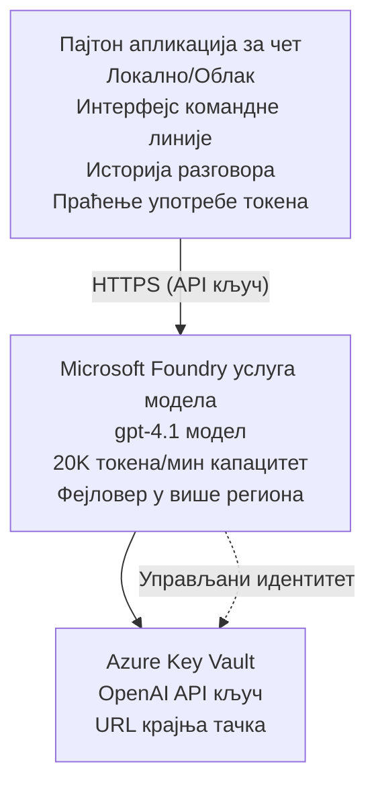

# Microsoft Foundry Models апликација за чет

**Пут учења:** Средњи ниво ⭐⭐ | **Време:** 35-45 минута | **Трошак:** $50-200/месечно

Комплетна Microsoft Foundry Models апликација за чет размењена користећи Azure Developer CLI (azd). Овај пример демонстрира размењивање gpt-4.1 модела, сигуран приступ API-ју и једноставан чет интерфејс.

## 🎯 Шта ћете научити

- Разместити Microsoft Foundry Models сервис са моделом gpt-4.1
- Заштитити OpenAI API кључеве помоћу Key Vault-а
- Направити једноставан чет интерфејс у Python-у
- Праћење коришћења токена и трошкова
- Имплементирати ограничење брзине (rate limiting) и обраду грешака

## 📦 Шта је укључено

✅ **Microsoft Foundry Models Service** - gpt-4.1 модел размењен  
✅ **Python Chat App** - Једноставан командно-линијски чет интерфејс  
✅ **Key Vault Integration** - Сигурно чување API кључева  
✅ **ARM Templates** - Комплетна инфраструктура као код  
✅ **Cost Monitoring** - Праћење коришћења токена  
✅ **Rate Limiting** - Спремање квота  

## Архитектура


## Предуслови

### Потребно

- **Azure Developer CLI (azd)** - [Упутство за инсталацију](https://learn.microsoft.com/azure/developer/azure-developer-cli/install-azd)
- **Azure subscription** са приступом OpenAI-ју - [Захтевање приступа](https://aka.ms/oai/access)
- **Python 3.9+** - [Инсталирајте Python](https://www.python.org/downloads/)

### Проверите предуслове

```bash
# Проверите верзију azd (потребна је 1.5.0 или новија)
azd version

# Проверите пријаву у Azure
azd auth login

# Проверите верзију Пајтона
python --version  # или python3 --version

# Проверите приступ OpenAI-у (проверите у Azure порталу)
az cognitiveservices account list-skus \
  --kind OpenAI \
  --location eastus
```

> **⚠️ Важно:** Microsoft Foundry Models захтева одобрење апликације. Ако нисте поднели захтев, посетите [aka.ms/oai/access](https://aka.ms/oai/access). Одобрење обично траје 1-2 радна дана.

## ⏱️ Временски оквир распоређивања

| Фаза | Трајање | Шта се дешава |
|-------|----------|--------------|
| Провера предуслова | 2-3 минута | Проверите доступност OpenAI квоте |
| Размествaње инфраструктуре | 8-12 минута | Креирање OpenAI сервиса, Key Vault-а и размествaње модела |
| Конфигурисање апликације | 2-3 минута | Подешавање окружења и зависности |
| **Укупно** | **12-18 минута** | Спремни за разговор са gpt-4.1 |

**Напомена:** Прво размествaње OpenAI-а може трајати дуже због припреме модела.

## Брзи почетак

```bash
# Идите до примера
cd examples/azure-openai-chat

# Иницијализујте окружење
azd env new myopenai

# Размештите све (инфраструктуру + конфигурацију)
azd up
# Биће вам затражено да:
# 1. Изаберите Azure претплату
# 2. Изаберите локацију где је OpenAI доступан (нпр. eastus, eastus2, westus)
# 3. Сачекајте 12-18 минута за распоређивање

# Инсталирајте Python зависности
pip install -r requirements.txt

# Почните да ћаскате!
python chat.py
```

**Очекивани излаз:**
```
🤖 Microsoft Foundry Models Chat Application
Connected to: gpt-4.1 (eastus)
Type your message (or 'quit' to exit)

You: Hello! Tell me about Microsoft Foundry Models.
Assistant: Microsoft Foundry Models Service provides REST API access to OpenAI's powerful language models including gpt-4.1, GPT-3.5-Turbo, and Embeddings...

[Tokens used: 145 | Estimated cost: $0.0044]
```

## ✅ Проверите размествaње

### Корак 1: Проверите Azure ресурсе

```bash
# Прикажи распоређене ресурсе
azd show

# Очекује се да излаз прикаже:
# - OpenAI услуга: (име ресурса)
# - Складиште кључева: (име ресурса)
# - Распоређивање: gpt-4.1
# - Локација: eastus (или ваш одабрани регион)
```

### Корак 2: Тестирајте OpenAI API

```bash
# Добијте OpenAI крајњу тачку и кључ
OPENAI_ENDPOINT=$(azd env get-value AZURE_OPENAI_ENDPOINT)
OPENAI_KEY=$(azd env get-value AZURE_OPENAI_API_KEY)

# Тестирај позив АПИ-ја
curl "$OPENAI_ENDPOINT/openai/deployments/gpt-4.1/chat/completions?api-version=2024-08-01-preview" \
  -H "Content-Type: application/json" \
  -H "api-key: $OPENAI_KEY" \
  -d '{
    "messages": [{"role": "user", "content": "Say hello!"}],
    "max_tokens": 50
  }'
```

**Очекивани одговор:**
```json
{
  "choices": [
    {
      "message": {
        "role": "assistant",
        "content": "Hello! How can I assist you today?"
      }
    }
  ],
  "usage": {
    "prompt_tokens": 8,
    "completion_tokens": 9,
    "total_tokens": 17
  }
}
```

### Корак 3: Потврдите приступ Key Vault-у

```bash
# Наведи тајне у Key Vault-у
KV_NAME=$(azd env get-value AZURE_KEY_VAULT_NAME)

az keyvault secret list \
  --vault-name $KV_NAME \
  --query "[].name" \
  --output table
```

**Очекујeне тајне:**
- `openai-api-key`
- `openai-endpoint`

**Критеријуми успеха:**
- ✅ OpenAI сервис размењен са gpt-4.1
- ✅ API позив враћа валидан одговор
- ✅ Тајне сачуване у Key Vault-у
- ✅ Праћење коришћења токена ради

## Структура пројекта

```
azure-openai-chat/
├── README.md                   ✅ This guide
├── azure.yaml                  ✅ AZD configuration
├── infra/                      ✅ Infrastructure as Code
│   ├── main.bicep             ✅ Main Bicep template
│   ├── main.parameters.json   ✅ Parameters
│   └── openai.bicep           ✅ OpenAI resource definition
├── src/                        ✅ Application code
│   ├── chat.py                ✅ Chat interface
│   ├── config.py              ✅ Configuration loader
│   └── requirements.txt       ✅ Python dependencies
└── .gitignore                  ✅ Git ignore rules
```

## Карактеристике апликације

### Чет интерфејс (`chat.py`)

Апликација за чет обухвата:

- **Историја разговора** - Одржава контекст између порука
- **Бројање токена** - Праћење коришћења и процена трошкова
- **Обрада грешака** - Нежно руковање ограничењима и грешкама API-ја
- **Процена трошкова** - Рачунање трошкова по поруци у реалном времену
- **Подршка стримовања** - Опционални стримовани одговори

### Команде

Током четова, можете користити:
- `quit` or `exit` - End the session
- `clear` - Clear conversation history
- `tokens` - Show total token usage
- `cost` - Show estimated total cost

### Конфигурација (`config.py`)

Учитава конфигурацију из променљивих окружења:
```python
AZURE_OPENAI_ENDPOINT  # Из складишта кључева
AZURE_OPENAI_API_KEY   # Из складишта кључева
AZURE_OPENAI_MODEL     # Подразумевано: gpt-4.1
AZURE_OPENAI_MAX_TOKENS # Подразумевано: 800
```

## Примери употребе

### Основни чет

```bash
python chat.py
```

### Чет са прилагођеним моделом

```bash
export AZURE_OPENAI_MODEL=gpt-35-turbo
python chat.py
```

### Чет са стримовањем

```bash
python chat.py --stream
```

### Пример разговора

```
You: Explain Microsoft Foundry Models Service in 3 sentences.
Assistant: Microsoft Foundry Models Service is Microsoft Azure's cloud platform offering 
that provides access to OpenAI's powerful language models. It enables developers 
to integrate capabilities like gpt-4.1 into their applications with enterprise-grade 
security and compliance. The service includes features for content filtering, 
abuse monitoring, and responsible AI practices.

[Tokens used: 89 | Estimated cost: $0.0027]

You: What models are available?
Assistant: Microsoft Foundry Models Service offers several model families including gpt-4.1 
(most capable), GPT-3.5-Turbo (faster and cost-effective), and Embeddings models 
for vector search. Each model has different capabilities, pricing, and token limits.

[Tokens used: 67 | Estimated cost: $0.0020]

Total session: 156 tokens | $0.0047
```

## Управљање трошковима

### Цена по токену (gpt-4.1)

| Модел | Улаз (по 1К токена) | Излаз (по 1К токена) |
|-------|----------------------|------------------------|
| gpt-4.1 | $0.03 | $0.06 |
| GPT-3.5-Turbo | $0.0015 | $0.002 |

### Процењени месечни трошкови

На основу образаца коришћења:

| Ниво коришћења | Поруке/дан | Токени/дан | Месечни трошак |
|-------------|--------------|------------|--------------|
| **Лагано** | 20 порука | 3,000 токена | $3-5 |
| **Умерено** | 100 порука | 15,000 токена | $15-25 |
| **Интензивно** | 500 порука | 75,000 токена | $75-125 |

**Основни трошак инфраструктуре:** $1-2/месечно (Key Vault + минимални рачунарски ресурси)

### Савети за оптимизацију трошкова

```bash
# 1. Користите GPT-3.5-Turbo за једноставније задатке (20 пута јефтиније)
export AZURE_OPENAI_MODEL=gpt-35-turbo

# 2. Смањите максимални број токена за краће одговоре
export AZURE_OPENAI_MAX_TOKENS=400

# 3. Праћите употребу токена
python chat.py --show-tokens

# 4. Подесите упозорења о буџету
az consumption budget create \
  --budget-name "openai-budget" \
  --amount 50 \
  --time-grain Monthly
```

## Надгледање

### Преглед коришћења токена

```bash
# У Azure порталу:
# Ресурс OpenAI → Метрике → Изаберите „Token Transaction“

# Или преко Azure CLI:
az monitor metrics list \
  --resource $(azd env get-value AZURE_OPENAI_RESOURCE_ID) \
  --metric "TokenTransaction" \
  --start-time $(date -u -d '1 hour ago' '+%Y-%m-%dT%H:%M:%S') \
  --interval PT1M
```

### Преглед API логова

```bash
# Стримовање дијагностичких логова
az monitor diagnostic-settings create \
  --resource $(azd env get-value AZURE_OPENAI_RESOURCE_ID) \
  --name openai-logs \
  --logs '[{"category": "Audit", "enabled": true}]' \
  --workspace $(azd env get-value LOG_ANALYTICS_WORKSPACE_ID)

# Логови упита
az monitor log-analytics query \
  --workspace $(azd env get-value LOG_ANALYTICS_WORKSPACE_ID) \
  --analytics-query "AzureDiagnostics | where Category == 'Audit' | top 10 by TimeGenerated"
```

## Решавање проблема

### Проблем: "Access Denied" грешка

**Симптоми:** 403 Forbidden при позиву API-ја

**Решења:**
```bash
# 1. Проверити да је приступ OpenAI одобрен
az cognitiveservices account show \
  --name $(azd env get-value AZURE_OPENAI_NAME) \
  --resource-group $(azd env get-value AZURE_RESOURCE_GROUP)

# 2. Проверити да је API кључ исправан
azd env get-value AZURE_OPENAI_API_KEY

# 3. Проверити формат URL-а крајње тачке
azd env get-value AZURE_OPENAI_ENDPOINT
# Треба да буде: https://[name].openai.azure.com/
```

### Проблем: "Rate Limit Exceeded"

**Симптоми:** 429 Too Many Requests

**Решења:**
```bash
# 1. Проверите тренутну квоту
az cognitiveservices account deployment show \
  --name $(azd env get-value AZURE_OPENAI_NAME) \
  --resource-group $(azd env get-value AZURE_RESOURCE_GROUP) \
  --deployment-name gpt-4.1

# 2. Затражите повећање квоте (ако је потребно)
# Идите на Azure портал → OpenAI ресурс → Квоте → Затражите повећање

# 3. Имплементирајте логику поновних покушаја (већ у chat.py)
# Апликација аутоматски поново покушава користећи експоненцијално повећање интервала између покушаја
```

### Проблем: "Model Not Found"

**Симптоми:** 404 грешка за размештање

**Решења:**
```bash
# 1. Прикажите доступна распоређивања
az cognitiveservices account deployment list \
  --name $(azd env get-value AZURE_OPENAI_NAME) \
  --resource-group $(azd env get-value AZURE_RESOURCE_GROUP)

# 2. Проверите име модела у окружењу
echo $AZURE_OPENAI_MODEL

# 3. Ажурирајте на исправно име распоређивања
export AZURE_OPENAI_MODEL=gpt-4.1  # или gpt-35-turbo
```

### Проблем: Висока латенција

**Симптоми:** Спори одговори (>5 секунди)

**Решења:**
```bash
# 1. Проверите регионално кашњење
# Deploy to region closest to users

# 2. Смањите max_tokens за брже одговоре
export AZURE_OPENAI_MAX_TOKENS=400

# 3. Користите стримовање за боље корисничко искуство
python chat.py --stream
```

## Најбоље праксе безбедности

### 1. Заштитите API кључеве

```bash
# Никада не додајте кључеве у систем за контролу верзија
# Користите Key Vault (већ конфигурисан)

# Редовно мењајте кључеве
az cognitiveservices account keys regenerate \
  --name $(azd env get-value AZURE_OPENAI_NAME) \
  --resource-group $(azd env get-value AZURE_RESOURCE_GROUP) \
  --key-name key1
```

### 2. Имплементирајте филтрирање садржаја

```python
# Microsoft Foundry Models укључује уграђено филтрирање садржаја
# Конфигуришите у Azure порталу:
# OpenAI ресурс → Филтри садржаја → Креирај прилагођени филтер

# Категорије: Мржња, Сексуални садржај, Насиље, Самоповређивање
# Нивои филтрирања: Низак, Средњи, Висок
```

### 3. Користите Managed Identity (у продукцији)

```bash
# За продукционе распоређивања, користите управљани идентитет
# уместо API кључева (захтева хостовање апликације на Azure)

# Ажурирајте infra/openai.bicep да укључи:
# identity: { type: 'SystemAssigned' }
```

## Развој

### Покрените локално

```bash
# Инсталирајте зависности
pip install -r src/requirements.txt

# Поставите променљиве окружења
export AZURE_OPENAI_ENDPOINT="https://[name].openai.azure.com/"
export AZURE_OPENAI_API_KEY="your-api-key"
export AZURE_OPENAI_MODEL="gpt-4.1"

# Покрените апликацију
python src/chat.py
```

### Покрените тестове

```bash
# Инсталирајте зависности за тестирање
pip install pytest pytest-cov

# Покрените тестове
pytest tests/ -v

# Са покривеношћу
pytest tests/ --cov=src --cov-report=html
```

### Ажурирајте размествaње модела

```bash
# Распоредите другу верзију модела
az cognitiveservices account deployment create \
  --name $(azd env get-value AZURE_OPENAI_NAME) \
  --resource-group $(azd env get-value AZURE_RESOURCE_GROUP) \
  --deployment-name gpt-35-turbo \
  --model-name gpt-35-turbo \
  --model-version "0613" \
  --model-format OpenAI \
  --sku-capacity 20 \
  --sku-name "Standard"
```

## Чишћење

```bash
# Избришите све Azure ресурсе
azd down --force --purge

# Ово уклања:
# - OpenAI услуга
# - Key Vault (са омогућеним меким брисањем од 90 дана)
# - Група ресурса
# - Сва размештања и конфигурације
```

## Следећи кораци

### Проширите овај пример

1. **Додајте веб интерфејс** - Изградите React/Vue фронтенд
   ```bash
   # Додај фронтенд сервис у azure.yaml
   # Објави на Azure Static Web Apps
   ```

2. **Имплементирајте RAG** - Додајте претрагу докумената помоћу Azure AI Search
   ```python
   # Интеграција Azure Cognitive Search
   # Отпремите документе и креирајте векторски индекс
   ```

3. **Додајте позиве функција** - Омогућите коришћење алата
   ```python
   # Дефинишите функције у chat.py
   # Дозволите gpt-4.1 да позива спољашње АПИ-је
   ```

4. **Подршка за више модела** - Разместите више модела
   ```bash
   # Додај gpt-35-turbo, ембединг моделе
   # Имплементирај логику рутирања модела
   ```

### Повезани примери

- **[Retail Multi-Agent](../retail-scenario.md)** - Напредна мулти-агент архитектура
- **[Database App](../../../../examples/database-app)** - Додајте перзистентно складиште
- **[Container Apps](../../../../examples/container-app)** - Разместите као сервис у контејнеру

### Ресурси за учење

- 📚 [AZD For Beginners Course](../../README.md) - Главна страница курса
- 📚 [Microsoft Foundry Models Documentation](https://learn.microsoft.com/azure/ai-services/openai/) - Званична документација
- 📚 [OpenAI API Reference](https://platform.openai.com/docs/api-reference) - Детаљи API-ја
- 📚 [Responsible AI](https://www.microsoft.com/ai/responsible-ai) - Најбоље праксе

## Додатни ресурси

### Документација
- **[Microsoft Foundry Models Service](https://learn.microsoft.com/azure/ai-services/openai/)** - Комплетан водич
- **[gpt-4.1 Models](https://learn.microsoft.com/azure/ai-services/openai/concepts/models)** - Могућности модела
- **[Content Filtering](https://learn.microsoft.com/azure/ai-services/openai/concepts/content-filter)** - Безбедносне функције
- **[Azure Developer CLI](https://learn.microsoft.com/azure/developer/azure-developer-cli/)** - Референца за azd

### Туторијали
- **[OpenAI Quickstart](https://learn.microsoft.com/azure/ai-services/openai/quickstart)** - Прво размествaње
- **[Chat Completions](https://learn.microsoft.com/azure/ai-services/openai/how-to/chatgpt)** - Изградња чет апликација
- **[Function Calling](https://learn.microsoft.com/azure/ai-services/openai/how-to/function-calling)** - Напредне функционалности

### Алати
- **[Microsoft Foundry Models Studio](https://oai.azure.com/)** - Веб-алат за пробу
- **[Prompt Engineering Guide](https://platform.openai.com/docs/guides/prompt-engineering)** - Писање бољих промптова
- **[Token Calculator](https://platform.openai.com/tokenizer)** - Процените коришћење токена

### Заједница
- **[Azure AI Discord](https://discord.gg/azure)** - Потражите помоћ у заједници
- **[GitHub Discussions](https://github.com/Azure-Samples/openai/discussions)** - Форум за питања и одговоре
- **[Azure Blog](https://azure.microsoft.com/blog/tag/azure-openai-service/)** - Најновија ажурирања

---

**🎉 Успех!** Разместили сте Microsoft Foundry Models и направили радну апликацију за чет. Почните да истражујете могућности gpt-4.1 и експериментишете са различитим промптовима и случајевима употребе.

**Питања?** [Отворите issue](https://github.com/microsoft/AZD-for-beginners/issues) или проверите [ЧПП](../../resources/faq.md)

**Упозорење о трошковима:** Запамтите да покренете `azd down` када завршите тестирање како бисте избегли сталне трошкове (~$50-100/месечно за активну употребу).

---

<!-- CO-OP TRANSLATOR DISCLAIMER START -->
**Одрицање одговорности**:
Овај документ је преведен помоћу AI сервиса за превођење [Co-op Translator](https://github.com/Azure/co-op-translator). Иако тежимо тачности, имајте у виду да аутоматски преводи могу садржати грешке или нетачности. Оригинални документ на његовом изворном језику треба сматрати ауторитетним извором. За критичне информације препоручује се професионални људски превод. Не сносимо одговорност за било какве неспоразуме или погрешна тумачења која произилазе из коришћења овог превода.
<!-- CO-OP TRANSLATOR DISCLAIMER END -->