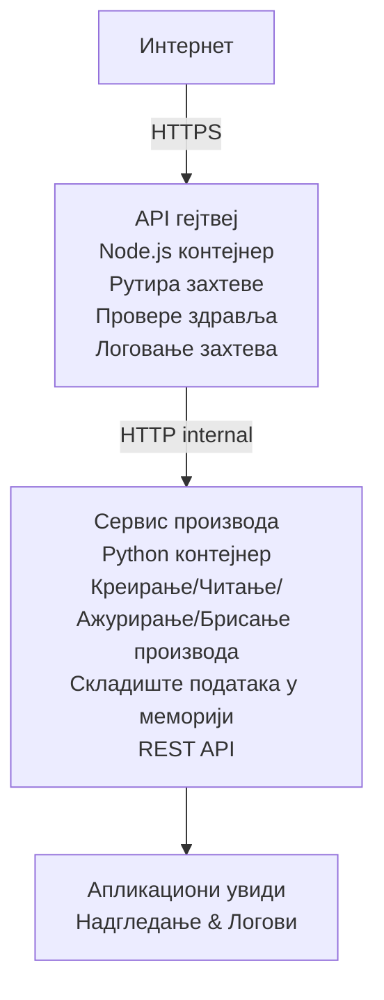

# Микросервисна архитектура - пример Container App

⏱️ **Процењено време**: 25-35 минута | 💰 **Процењени трошак**: ~$50-100/месец | ⭐ **Сложеност**: Напредно

A **поједностављена али функционална** микросервисна архитектура распоређена на Azure Container Apps користећи AZD CLI. Овај пример демонстрира комуникацију између сервиса, оркестрацију контејнера и мониторинг са практичном поставком од 2 сервиса.

> **📚 Приступ учењу**: Овај пример почиње са минималном архитектуром од 2 сервиса (API Gateway + Backend Service) коју заправо можете деплојовати и из које можете учити. Након што савладате ову основу, дајемо смернице за проширење у пуну микросервисну економију.

## Шта ћете научити

Завршетком овог примера, научићете:
- Деплојовати више контејнера на Azure Container Apps
- Имплементирати комуникацију између сервиса са интерном мрежом
- Конфигурисати скалирање и health check-ове на основу окружења
- Праћење дистрибуираних апликација помоћу Application Insights
- Разумети шаблоне деплоја микросервиса и најбоље праксе
- Учинити постепено проширење од једноставне до сложене архитектуре

## Архитектура

### Фаза 1: Шта правимо (укључено у овај пример)


**Зашто почети једноставно?**
- ✅ Брзо деплојујте и разумете (25-35 минута)
- ✅ Научите основне шаблоне микросервиса без сложености
- ✅ Радни код који можете модификовати и експериментисати
- ✅ Нижи трошкови за учење (~$50-100/месец уместо $300-1400/месец)
- ✅ Изградите самопоуздање пре додавања база података и редова порука

**Аналогија**: Замислите ово као учење вожње. Почнете са празним паркингом (2 сервиса), савладате основе, затим прелазите на грађевински саобраћај (5+ сервиса са базама података).

### Фаза 2: Будући развој (референтна архитектура)

```
Full Architecture (Not Included - For Reference)
├── API Gateway (✅ Included)
├── Product Service (✅ Included)
├── Order Service (🔜 Add next)
├── User Service (🔜 Add next)
├── Notification Service (🔜 Add last)
├── Azure Service Bus (🔜 For async communication)
├── Cosmos DB (🔜 For product persistence)
├── Azure SQL (🔜 For order management)
└── Azure Storage (🔜 For file storage)
```

Погледајте одељак "Expansion Guide" на крају за корак-по-корак упутства.

## Обухваћене функције

✅ **Service Discovery**: Аутоматско DNS засновано откривање између контејнера  
✅ **Load Balancing**: Уграђено балансирање оптерећења преко реплика  
✅ **Auto-scaling**: Независно скалирање по сервису на основу HTTP захтева  
✅ **Health Monitoring**: Liveness и readiness probe-ови за оба сервиса  
✅ **Distributed Logging**: Централизовано логовање са Application Insights  
✅ **Internal Networking**: Сигурна комуникација између сервиса  
✅ **Container Orchestration**: Аутоматски деплој и скалирање  
✅ **Zero-Downtime Updates**: Ролинг ажурирања са управљањем ревизијама  

## Предуслови

### Потребни алати

Пре него што почнете, проверите да ли имате инсталиране следеће алате:

1. **[Azure Developer CLI (azd)](https://learn.microsoft.com/azure/developer/azure-developer-cli/install-azd)** (верзија 1.0.0 или новија)
   ```bash
   azd version
   # Очекује се излаз: azd верзија 1.0.0 или новија
   ```

2. **[Azure CLI](https://learn.microsoft.com/cli/azure/install-azure-cli)** (верзија 2.50.0 или новија)
   ```bash
   az --version
   # Очекивани излаз: azure-cli 2.50.0 или новији
   ```

3. **[Docker](https://www.docker.com/get-started)** (за локални развој/тестирање - опционално)
   ```bash
   docker --version
   # Очекивани излаз: Докер верзија 20.10 или новија
   ```

### Захтеви за Azure

- Активна **Azure претплата** ([create a free account](https://azure.microsoft.com/free/))
- Дозволе за креирање ресурса у вашој претплати
- **Contributor** улога на претплати или resource group-у

### Претходно знање

Ово је пример **напредног нивоа**. Требало би да имате:
- Завршили сте [Simple Flask API example](../../../../../examples/container-app/simple-flask-api) 
- Основно разумевање микросервисне архитектуре
- Познавање REST API-ја и HTTP-а
- Разумевање концепата контејнера

**Ново у Container Apps?** Почните са [Simple Flask API example](../../../../../examples/container-app/simple-flask-api) прво да бисте научили основе.

## Брзи почетак (корак по корак)

### Корак 1: Клонирајте и пређите у директоријум

```bash
git clone https://github.com/microsoft/AZD-for-beginners.git
cd AZD-for-beginners/examples/container-app/microservices
```

**✓ Провера успеха**: Уверите се да видите `azure.yaml`:
```bash
ls
# Очекивано: README.md, azure.yaml, infra/, src/
```

### Корак 2: Аутентификација са Azure

```bash
azd auth login
```

Ово ће отворити ваш прегледач ради Azure аутентификације. Пријавите се својим Azure акредитивима.

**✓ Провера успеха**: Требало би да видите:
```
Logged in to Azure.
```

### Корак 3: Иницијализација окружења

```bash
azd init
```

**Подешавања која ћете видети**:
- **Име окружења**: Унесите кратко име (нпр. `microservices-dev`)
- **Azure претплата**: Изаберите вашу претплату
- **Azure локација**: Одаберите регион (нпр. `eastus`, `westeurope`)

**✓ Провера успеха**: Требало би да видите:
```
SUCCESS: New project initialized!
```

### Корак 4: Деплој инфраструктуре и сервиса

```bash
azd up
```

**Шта се дешава** (траје 8-12 минута):
1. Креира Container Apps окружење
2. Креира Application Insights за мониторинг
3. Гради API Gateway контејнер (Node.js)
4. Гради Product Service контејнер (Python)
5. Деплојује оба контејнера на Azure
6. Конфигурише мрежу и health check-ове
7. Подешава мониторинг и логовање

**✓ Провера успеха**: Требало би да видите:
```
SUCCESS: Your application was deployed to Azure in X minutes Y seconds.
Endpoint: https://api-gateway-<unique-id>.azurecontainerapps.io
```

**⏱️ Време**: 8-12 минута

### Корак 5: Тестирање деплоирања

```bash
# Добијте крајњу тачку пролаза
GATEWAY_URL=$(azd env get-values | grep API_GATEWAY_URL | cut -d '=' -f2 | tr -d '"')

# Тестирајте здравље API пролаза
curl $GATEWAY_URL/health

# Очекујани излаз:
# {"статус":"исправан","услуга":"api-пролаз","временска_ознака":"2025-11-19T10:30:00Z"}
```

**Тестирајте product service преко API Gateway-а**:
```bash
# Листа производа
curl $GATEWAY_URL/api/products

# Очекивани излаз:
# [
#   {"id":1,"name":"Лаптоп","price":999.99,"stock":50},
#   {"id":2,"name":"Миш","price":29.99,"stock":200},
#   {"id":3,"name":"Тастатура","price":79.99,"stock":150}
# ]
```

**✓ Провера успеха**: Оба ендпоинта враћају JSON податке без грешака.

---

**🎉 Честитамо!** Деплојовали сте микросервисну архитектуру на Azure!

## Структура пројекта

Сви файлови за имплементацију су укључени—ово је комплетан, радни пример:

```
microservices/
│
├── README.md                         # This file
├── azure.yaml                        # AZD configuration
├── .gitignore                        # Git ignore patterns
│
├── infra/                           # Infrastructure as Code (Bicep)
│   ├── main.bicep                   # Main orchestration
│   ├── abbreviations.json           # Naming conventions
│   ├── core/                        # Shared infrastructure
│   │   ├── container-apps-environment.bicep  # Container environment + registry
│   │   └── monitor.bicep            # Application Insights + Log Analytics
│   └── app/                         # Service definitions
│       ├── api-gateway.bicep        # API Gateway container app
│       └── product-service.bicep    # Product Service container app
│
└── src/                             # Application source code
    ├── api-gateway/                 # Node.js API Gateway
    │   ├── app.js                   # Express server with routing
    │   ├── package.json             # Node dependencies
    │   └── Dockerfile               # Container definition
    └── product-service/             # Python Product Service
        ├── main.py                  # Flask API with product data
        ├── requirements.txt         # Python dependencies
        └── Dockerfile               # Container definition
```

**Шта сваки компонент ради:**

**Infrastructure (infra/)**:
- `main.bicep`: Оркестрира све Azure ресурсе и њихове зависности
- `core/container-apps-environment.bicep`: Креира Container Apps окружење и Azure Container Registry
- `core/monitor.bicep`: Подешава Application Insights за дистрибуирано логовање
- `app/*.bicep`: Дефиниције појединачних container app-ова са скалирањем и health check-овима

**API Gateway (src/api-gateway/)**:
- Јавно доступан сервис који прослеђује захтеве ка backend сервисима
- Имплементира логовање, обраду грешака и прослеђивање захтева
- Демонстрира HTTP комуникацију између сервиса

**Product Service (src/product-service/)**:
- Интерни сервис са каталогом производа (у меморији ради једноставности)
- REST API са health check-овима
- Пример backend микросервисног шаблона

## Преглед сервиса

### API Gateway (Node.js/Express)

**Port**: 8080  
**Access**: Јавно (спољашњи приступ)  
**Намена**: Прослеђује улазне захтеве одговарајућим backend сервисима  

**Ендпоинти**:
- `GET /` - Информације о сервису
- `GET /health` - Health check ендпоинт
- `GET /api/products` - Прослеђује ка product service (листати све)
- `GET /api/products/:id` - Прослеђује ка product service (преузми по ID)

**Кључне функције**:
- Рутација захтева помоћу axios-а
- Централизовано логовање
- Обрада грешака и управљање timeout-овима
- Service discovery преко environment променљивих
- Интеграција са Application Insights

**Извадак кода** (`src/api-gateway/app.js`):
```javascript
// Интерна комуникација сервиса
app.get('/api/products', async (req, res) => {
  const response = await axios.get(`${PRODUCT_SERVICE_URL}/products`);
  res.json(response.data);
});
```

### Product Service (Python/Flask)

**Port**: 8000  
**Access**: Само интерно (без спољашњег приступа)  
**Намена**: Управља каталогом производа са подацима у меморији  

**Ендпоинти**:
- `GET /` - Информације о сервису
- `GET /health` - Health check ендпоинт
- `GET /products` - Листа свих производа
- `GET /products/<id>` - Преузми производ по ID

**Кључне функције**:
- RESTful API помоћу Flask-а
- Складиште производа у меморији (једноставно, није потребна база података)
- Мониторинг здравља помоћу probe-ова
- Структурисано логовање
- Интеграција са Application Insights

**Подаци моделa**:
```python
{
  "id": 1,
  "name": "Laptop",
  "description": "High-performance laptop",
  "price": 999.99,
  "stock": 50
}
```

**Зашто само интерни приступ?**
Product service није изложен јавности. Сви захтеви морају да пролазе кроз API Gateway, који пружа:
- Безбедност: Контролисана тачка приступа
- Флексибилност: Можете мењати backend без утицаја на клијенте
- Мониторинг: Централизовано логовање захтева

## Разумевање комуникације између сервиса

### Како сервиси комуницирају међусобно

У овом примеру, API Gateway комуницира са Product Service-ом користећи **интерне HTTP позиве**:

```javascript
// АПИ гејтвеј (src/api-gateway/app.js)
const PRODUCT_SERVICE_URL = process.env.PRODUCT_SERVICE_URL;

// Направи унутрашњи HTTP захтев
const response = await axios.get(`${PRODUCT_SERVICE_URL}/products`);
```

**Кључне тачке**:

1. **DNS-засновано откривање**: Container Apps аутоматски обезбеђује DNS за интерне сервисе
   - Product Service FQDN: `product-service.internal.<environment>.azurecontainerapps.io`
   - Поједностављено као: `http://product-service` (Container Apps то решава)

2. **Нема јавног излагања**: Product Service има `external: false` у Bicep-у
   - Приступачан само унутар Container Apps окружења
   - Нема приступа са интернета

3. **Променљиве окружења**: URL-ови сервиса се убацују приликом деплоирања
   - Bicep прослеђује интерни FQDN ка gateway-у
   - Нема уграђених (hardcoded) URL-ова у апликационом коду

**Аналогија**: Замислите ово као канцеларије. API Gateway је рецепција (јавно видљива), а Product Service је канцеларија (само интерна). Посетиоци морају проћи преко рецепције да би дошли до било које канцеларије.

## Опције деплоја

### Пуни деплој (препоручено)

```bash
# Распореди инфраструктуру и оба сервиса
azd up
```

Ово поставља:
1. Container Apps окружење
2. Application Insights
3. Container Registry
4. API Gateway контејнер
5. Product Service контејнер

**Време**: 8-12 минута

### Деплој појединачног сервиса

```bash
# Деплојујте само једну услугу (након почетног azd up)
azd deploy api-gateway

# Или деплојујте услугу product
azd deploy product-service
```

**Употребни случај**: Када сте ажурирали код у једном сервису и желите да деплојујете само тај сервис.

### Ажурирање конфигурације

```bash
# Промените параметре скалирања
azd env set GATEWAY_MAX_REPLICAS 30

# Поново распоредите са новом конфигурацијом
azd up
```

## Конфигурација

### Конфигурација скалирања

Оба сервиса су конфигурисана са HTTP заснованим аутоскалирањем у њиховим Bicep фајловима:

**API Gateway**:
- Минималан број реплика: 2 (увек најмање 2 за доступност)
- Максималан број реплика: 20
- Триггер скалирања: 50 конкутентних захтева по реплици

**Product Service**:
- Минималан број реплика: 1 (може да скалира до нуле ако је потребно)
- Максималан број реплика: 10
- Триггер скалирања: 100 конкутентних захтева по реплици

**Прилагодите скалирање** (у `infra/app/*.bicep`):
```bicep
scale: {
  minReplicas: 1
  maxReplicas: 10
  rules: [
    {
      name: 'http-scale-rule'
      http: {
        metadata: {
          concurrentRequests: '100'  // Adjust this
        }
      }
    }
  ]
}
```

### Ресурсна расподела

**API Gateway**:
- CPU: 1.0 vCPU
- Меморија: 2 GiB
- Разлог: Обрађује сав спољашњи саобраћај

**Product Service**:
- CPU: 0.5 vCPU
- Меморија: 1 GiB
- Разлог: Лаган, операције у меморији

### Health Checks

Оба сервиса укључују liveness и readiness probe-ове:

```bicep
probes: [
  {
    type: 'Liveness'
    httpGet: {
      path: '/health'
      port: 8080
    }
    initialDelaySeconds: 10
    periodSeconds: 30
  }
  {
    type: 'Readiness'
    httpGet: {
      path: '/health'
      port: 8080
    }
    initialDelaySeconds: 5
    periodSeconds: 10
  }
]
```

**Шта ово значи**:
- **Liveness**: Ако health check не успе, Container Apps рестартује контејнер
- **Readiness**: Ако сервис није спреман, Container Apps престаје да шаље саобраћај тој реплици


## Мониторинг и опсервабилност

### Преглед логова сервиса

```bash
# Прегледајте логове помоћу azd monitor
azd monitor --logs

# Или користите Azure CLI за одређене Container Apps:
# Стримујте логове са API Gateway
az containerapp logs show --name api-gateway --resource-group $RG_NAME --follow

# Прегледајте недавне логове услуге product
az containerapp logs show --name product-service --resource-group $RG_NAME --tail 100
```

**Очекујени излаз**:
```
[api-gateway] API Gateway listening on port 8080
[api-gateway] Product Service URL: http://product-service
[api-gateway] GET /api/products 200 - 45ms
[product-service] Retrieved 5 products
```

### Упити за Application Insights

Приступите Application Insights у Azure порталу, затим покрените ове упите:

**Пронађи споре захтеве**:
```kusto
requests
| where timestamp > ago(1h)
| where duration > 1000  // Requests taking >1 second
| summarize count() by name, cloud_RoleName
| order by count_ desc
```

**Праћење позива између сервиса**:
```kusto
dependencies
| where timestamp > ago(1h)
| where type == "Http"
| project timestamp, name, target, duration, success
| order by timestamp desc
```

**Стопа грешака по сервису**:
```kusto
exceptions
| where timestamp > ago(24h)
| summarize errorCount = count() by cloud_RoleName, type
| order by errorCount desc
```

**Обим захтева током времена**:
```kusto
requests
| where timestamp > ago(1h)
| summarize requestCount = count() by bin(timestamp, 5m), cloud_RoleName
| render timechart
```

### Приступ контролној табли за мониторинг

```bash
# Добијте детаље о Application Insights
azd env get-values | grep APPLICATIONINSIGHTS

# Отворите мониторинг у Azure порталу
az monitor app-insights component show \
  --app $(azd env get-values | grep APPLICATIONINSIGHTS_CONNECTION_STRING | cut -d '=' -f2) \
  --resource-group $(azd env get-values | grep AZURE_RESOURCE_GROUP | cut -d '=' -f2) \
  --query "appId" -o tsv
```

### Живе метрике

1. Идите у Application Insights у Azure порталу
2. Кликните "Live Metrics"
3. Видите захтеве у реалном времену, неуспехе и перформансе
4. Тестирајте покретањем: `curl $(azd env get-values | grep API_GATEWAY_URL | cut -d '=' -f2 | tr -d '"')/api/products`

## Практични задаци

[Напомена: Погледајте све задатке горе у одељку "Practical Exercises" за детаљне корак-по-корак вежбе које укључују верификацију деплоирања, модификацију података, тестове аутоскалирања, обраду грешака и додавање трећег сервиса.]

## Анализа трошкова

### Процењени месечни трошкови (за овај пример са 2 сервиса)

| Resource | Configuration | Estimated Cost |
|----------|--------------|----------------|
| API Gateway | 2-20 replicas, 1 vCPU, 2GB RAM | $30-150 |
| Product Service | 1-10 replicas, 0.5 vCPU, 1GB RAM | $15-75 |
| Container Registry | Basic tier | $5 |
| Application Insights | 1-2 GB/month | $5-10 |
| Log Analytics | 1 GB/month | $3 |
| **Total** | | **$58-243/month** |

**Расподела трошкова по употреби**:
- **Мали саобраћај** (тестирање/учење): ~$60/месец
- **Умерен саобраћај** (мали production): ~$120/месец
- **Већи саобраћај** (периоди високе оптерећености): ~$240/месец

### Савети за оптимизацију трошкова

1. **Scale to Zero за development**:
   ```bicep
   scale: {
     minReplicas: 0  // Save $30-40/month when not in use
     maxReplicas: 10
   }
   ```

2. **Користите Consumption Plan за Cosmos DB** (када га додате):
   - Плаћате само оно што користите
   - Нема минималне наплате

3. **Подесите Application Insights Sampling**:
   ```javascript
   appInsights.defaultClient.config.samplingPercentage = 50; // Одабери узорак од 50% захтева
   ```

4. **Очистите ресурсе када нису потребни**:
   ```bash
   azd down
   ```

### Опције бесплатног нивоа

За учење/тестирање, размотрите:
- Use Azure free credits (first 30 days)
- Keep to minimum replicas
- Delete after testing (no ongoing charges)

---

## Чишћење

To avoid ongoing charges, delete all resources:

```bash
azd down --force --purge
```

**Confirmation Prompt**:
```
? Total resources to delete: 6, are you sure you want to continue? (y/N)
```

Откуцајте `y` да потврдите.

**What Gets Deleted**:
- Окружење Container Apps
- Оба Container Apps-а (gateway & product service)
- Container Registry
- Application Insights
- Log Analytics Workspace
- Resource Group

**✓ Verify Cleanup**:
```bash
az group list --query "[?starts_with(name,'rg-microservices')]" --output table
```

Треба да врати празно.

---

## Водич за проширење: од 2 до 5+ сервиса

Once you've mastered this 2-service architecture, here's how to expand:

### Фаза 1: Додајте перзистенцију базе података (следећи корак)

**Додајте Cosmos DB за Product Service**:

1. Create `infra/core/cosmos.bicep`:
   ```bicep
   resource cosmosAccount 'Microsoft.DocumentDB/databaseAccounts@2023-04-15' = {
     name: name
     location: location
     kind: 'GlobalDocumentDB'
     properties: {
       databaseAccountOfferType: 'Standard'
       locations: [{ locationName: location, failoverPriority: 0 }]
     }
   }
   ```

2. Update product service to use Cosmos DB instead of in-memory data

3. Процењени додатни трошак: ~$25/month (serverless)

### Фаза 2: Додајте трећи сервис (управљање наруџбинама)

**Креирајте Order Service**:

1. Нови фолдер: `src/order-service/` (Python/Node.js/C#)
2. Нови Bicep: `infra/app/order-service.bicep`
3. Ажурирајте API Gateway да рутира `/api/orders`
4. Додајте Azure SQL Database за перзистенцију наруџбина

**Архитектура постаје**:
```
API Gateway → Product Service (Cosmos DB)
           → Order Service (Azure SQL)
```

### Фаза 3: Додајте асинхрону комуникацију (Service Bus)

**Имплементирајте догађајно вођену архитектуру**:

1. Додајте Azure Service Bus: `infra/core/servicebus.bicep`
2. Product Service публикује догађаје "ProductCreated"
3. Order Service се претплаћује на product догађаје
4. Додајте Notification Service да обрађује догађаје

**Образац**: Request/Response (HTTP) + Event-Driven (Service Bus)

### Фаза 4: Додајте аутентификацију корисника

**Имплементирајте User Service**:

1. Креирајте `src/user-service/` (Go/Node.js)
2. Додајте Azure AD B2C или custom JWT аутентикацију
3. API Gateway верификује токене
4. Сервиси проверавају дозволе корисника

### Фаза 5: Спремност за продукцију

**Додајте ове компоненте**:
- Azure Front Door (глобално балансирање оптерећења)
- Azure Key Vault (управљање тајнама)
- Azure Monitor Workbooks (прилагођени dashboard-ови)
- CI/CD Pipeline (GitHub Actions)
- Blue-Green deploy-ови
- Managed Identity за све сервисе

**Трошак целе продукцијске архитектуре**: ~$300-1,400/month

---

## Сазнајте више

### Повезана документација
- [Azure Container Apps Documentation](https://learn.microsoft.com/azure/container-apps/)
- [Microservices Architecture Guide](https://learn.microsoft.com/azure/architecture/guide/architecture-styles/microservices)
- [Application Insights for Distributed Tracing](https://learn.microsoft.com/azure/azure-monitor/app/distributed-tracing)
- [Azure Developer CLI Documentation](https://learn.microsoft.com/azure/developer/azure-developer-cli/)

### Следећи кораци у овом курсу
- ← Previous: [Simple Flask API](../../../../../examples/container-app/simple-flask-api) - Beginner single-container example
- → Next: [AI Integration Guide](../../../../../examples/docs/ai-foundry) - Add AI capabilities
- 🏠 [Course Home](../../README.md)

### Поређење: када користити шта

**Single Container App** (пример Simple Flask API):
- ✅ Једноставне апликације
- ✅ Монолитна архитектура
- ✅ Брзо за постављање
- ❌ Ограничена скалабилност
- **Трошак**: ~$15-50/month

**Микросервиси** (овaj пример):
- ✅ Сложеније апликације
- ✅ Независно скалирање по сервису
- ✅ Аутономија тимова (различити сервиси, различити тимови)
- ❌ Сложеније за управљање
- **Трошак**: ~$60-250/month

**Kubernetes (AKS)**:
- ✅ Максимална контрола и флексибилност
- ✅ Мулти-цлоуд преносивост
- ✅ Напредно умрежавање
- ❌ Захтева Kubernetes експертизу
- **Трошак**: ~$150-500/month minimum

**Препорука**: Почните са Container Apps (као у овом примеру), пређите на AKS само ако су вам потребне специфичне Kubernetes функционалности.

---

## Често постављана питања

**П: Зашто само 2 сервиса уместо 5+?**  
О: Образовни напредак. Свладајте основе (комуникација сервиса, мониторинг, скалирање) помоћу једноставног примера пре додавања сложености. Обрасци које тут научите важе и за архитектуре са 100 сервиса.

**П: Могу ли сам да додам више сервиса?**  
О: Апсолутно! Следите водич за проширење изнад. Сваки нови сервис прати исти образац: креирајте src фолдер, направите Bicep фајл, ажурирајте azure.yaml, деплоy-ујте.

**П: Да ли је ово спремно за продукцију?**  
О: То је солидна основа. За продукцију додајте: managed identity, Key Vault, перзистентне базе података, CI/CD pipeline, аларме за мониторинг и стратегију бекупа.

**П: Зашто не користити Dapr или други service mesh?**  
О: Задржите једноставност ради учења. Када разумете нативно Container Apps умрежавање, можете надоградити са Dapr-ом за напредне сценарије.

**П: Како да дебагујем локално?**  
О: Покрените сервисе локално помоћу Dockera:
```bash
cd src/api-gateway
docker build -t local-gateway .
docker run -p 8080:8080 -e PRODUCT_SERVICE_URL=http://localhost:8000 local-gateway
```

**П: Могу ли користити различите програмске језике?**  
О: Можете! У овом примеру јe Node.js (gateway) + Python (product service). Можете мешати било које језике који раде у контејнерима.

**П: Шта ако немам Azure кредите?**  
О: Користите Azure free tier (prvih 30 дана за нове налоге) или deploy-ујте за кратка тестирања и одмах избришите.

---

> **🎓 Резиме пута учења**: Нaučili сте да деплојујете мулти-сервисну архитектуру са аутоматским скалирањем, интерним умрежавањем, централним мониторингом и шаблонима спремним за продукцију. Ова основа вас припрема за сложене дистрибуиране системе и ентерпрајз микросервисне архитектуре.

**📚 Навигација курса:**
- ← Previous: [Simple Flask API](../../../../../examples/container-app/simple-flask-api)
- → Next: [Database Integration Example](../../../../../examples/database-app)
- 🏠 [Course Home](../../../README.md)
- 📖 [Container Apps Best Practices](../../../docs/chapter-04-infrastructure/deployment-guide.md)

---

<!-- CO-OP TRANSLATOR DISCLAIMER START -->
**Ограничење одговорности**:
Овај документ је преведен уз помоћ услуге за превођење засноване на вештачкој интелигенцији [Co-op Translator](https://github.com/Azure/co-op-translator). Иако настојимо да обезбедимо тачност, имајте на уму да аутоматски преводи могу садржати грешке или нетачности. Изворни документ на свом матичном језику треба сматрати ауторитетним извором. За критичне информације препоручује се професионални људски превод. Не сносимо одговорност за било каква неразумевања или погрешне тумачења која проистичу из употребе овог превода.
<!-- CO-OP TRANSLATOR DISCLAIMER END -->